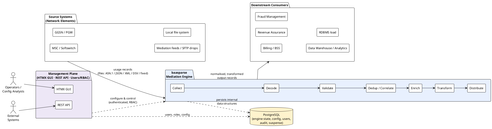

# baasparse — Business Requirements Specification (BRS)

> **Project:** baasparse (Afrikaans *baas-parse* → "boss-parse")
> **Type:** Telco Mediation Engine
> **Document class:** Business Requirements Specification (BRS)
> **Status:** Draft `v0.3` (gap reviews closed: two passes + verification round, [[13-gap-review-decisions]] — v1 tier‑3/tier‑2 scope)
> **Owner:** pgvanniekerk
> **Last updated:** 2026-07-04

---

## 1. What this document is

This BRS captures **what the business needs** baasparse to do and **why**, expressed
in business terms. It deliberately avoids committing to a specific technical design —
that belongs in the downstream **SRS** (Software Requirements Specification) and
**Architecture / Design** documents. Where technology is mentioned (Go, PostgreSQL), it
is because it is a **fixed business/technical constraint** stated by the sponsor, not
a design decision made here.

baasparse is a **Telco mediation engine**: the layer that sits between the network /
source systems that *produce usage records* and the downstream systems that *consume*
them (billing, revenue assurance, fraud, analytics). Its job is to **collect, decode,
validate, deduplicate, correlate, enrich, transform, and distribute** usage records
reliably, losslessly, and auditably.

## 2. How to read this pack

Each section of the BRS is a separate Obsidian note so it can be reviewed and versioned
independently. Read in order:

| # | Section | Purpose |
|---|---------|---------|
| 01 | [[01-introduction]] | Purpose, scope boundary, audience, conventions, references |
| 02 | [[02-business-context]] | What telco mediation is, the problem, business drivers |
| 03 | [[03-stakeholders]] | Who has a stake, personas, their needs |
| 04 | [[04-scope]] | In/out of scope, v1 vs v2 boundary, release themes |
| 05 | [[05-business-process]] | The mediation lifecycle as a business process |
| 06 | [[06-functional-requirements]] | Numbered business/functional requirements |
| 07 | [[07-non-functional-requirements]] | Performance, reliability, security, ops |
| 08 | [[08-data-and-configuration]] | Conceptual domain model & configurability |
| 09 | [[09-assumptions-constraints-dependencies]] | Boundary conditions & risks |
| 10 | [[10-roadmap]] | Release plan (v1 mediation incl. RDBMS load, v2 extended alerting) |
| 11 | [[11-glossary]] | Telco & project terminology |
| 12 | [[12-traceability]] | Requirement → driver → release mapping |
| 13 | [[13-gap-review-decisions]] | Gap-review dispositions (v1 fixes; deferrals with mitigations) |

## 3. Requirement identifier scheme

Requirements are identified as `BR-<AREA>-<NNN>` so they can be traced end-to-end.

| Area code | Domain |
|-----------|--------|
| `RMT` | Remote acquisition (SFTP / FTPS fetch to local) |
| `COL` | Collection / ingestion |
| `DEC` | Decoding / parsing (ASN.1, JSON, XML, DSV, fixed-position) |
| `VAL` | Validation & screening |
| `COR` | Correlation of partial/related records |
| `DUP` | Deduplication |
| `ENR` | Enrichment / lookups |
| `TRN` | Transformation & formatting |
| `DST` | Distribution / output |
| `ERR` | Error, suspense & reprocessing |
| `REC` | Reconciliation & completeness |
| `ARC` | Archiving & retention of processed files |
| `AUD` | Audit & traceability |
| `CFG` | Configuration & rule management |
| `OPS` | Operability, monitoring, control |
| `USR` | User management & access control |
| `API` | REST API exposure |
| `UI` | Graphical user interface (HTMX) |
| `HA` | High availability & multi-instance clustering |
| `CMP` | Regulatory & data protection (optional) |
| `NFR` | Non-functional (see section 07) |

Each requirement carries a **priority** using MoSCoW: **M**ust / **S**hould / **C**ould /
**W**on't (this release).

## 4. Solution at a glance

## 5. Fixed constraints inherited from the sponsor

These are **given** (see [[09-assumptions-constraints-dependencies]] for the full list):

- Implemented **entirely in Go** as a **"Modulith"** (modular monolith), deployed as
  **multiple cooperating instances across multiple Linux servers** (horizontally scalable,
  no single point of failure). **Linux-only.**
- Deployed **on-premises, per tenant** (one tenant per deployment — no multi-tenancy).
- **PostgreSQL** (a primary with **streaming-replication standby(s)**, including a **DR**
  standby) hosts/persists all internal data structures (config, state, claims, audit,
  suspense). **Raw file bytes are never stored in PostgreSQL** — files are streamed from the
  shared disk. The only *record* data persisted is the **bounded canonical working set of
  open correlation/aggregation windows** (dropped once the aggregate is emitted); everything
  else streams. See processing modes in [[05-business-process]].
- Processing is **real-time / always-on** — files are picked up and processed as soon as
  they are available, not on batch schedules.
- **Performance and memory efficiency are the top priority** — the engine must process
  large volumes with a bounded, predictable memory footprint (streaming, not load-all).
- **v1** = file-based mediation, with input from the **local file system** and via
  **remote fetch (SFTP/FTPS)**; input formats **ASN.1, JSON, XML, DSV,
  fixed-position**; configurable transformations; **output to files and/or RDBMS load
  (e.g. PostgreSQL)**; processed-file **archiving**.
- **v1 management plane** = a **built-in user system with RBAC**, an **HTMX GUI hosted in
  the Go app**, and a **REST API** for external systems — sharing one auth model.
- **v1 correlation** = **single-source** correlation/aggregation on an **event-time** basis;
  cross-source correlation is v2. v1 uses **async replication + disk-marker reconciliation**,
  scheduled jobs on a **nominated instance**, and current-active format decode.
- **v2** = **scale-out & resilience hardening** on the unchanged v1 pipeline — cross-source
  correlation, dynamic scheduled-job coordination/failover, synchronous-commit RPO=0 & formal
  RPO/RTO, event-time format selection, dedup read-path pre-filter, and write-path scale-out
  toward tier-1 — plus **extended alerting** (webhook/SNMP/chat) and broader integrations.
  Every v2 item lands on a **seam built into v1** (see [[10-roadmap]] §10.6), so growth toward
  a tier-1 operator is additive, not a re-architecture.
