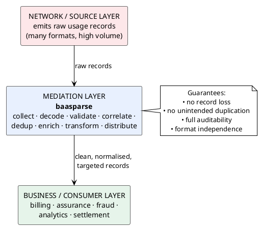

# 02 — Business Context & Background

> Part of the [[00-index|baasparse BRS]]. Previous: [[01-introduction]]  ·  Next: [[03-stakeholders]]

## 2.1 What is a Telco mediation engine?

In a telecommunications operator, **network elements** (switches, softswitches, packet
gateways, IN/service platforms, messaging centres, probes) continuously emit **usage
records** describing chargeable or trackable events — a voice call, a data session, an
SMS, a roaming event, etc. These records are produced in **many different technical
formats** (binary ASN.1, delimited text, fixed-width text, JSON), with **many different
field layouts**, at **high volume**.

Downstream business systems — **billing**, **revenue assurance**, **fraud management**,
**interconnect settlement**, **data warehouse / analytics** — cannot consume this raw,
heterogeneous, network-centric data directly. They need it **normalised, validated,
de-duplicated, correlated, enriched, and reformatted** into the shape each consumer
expects.

**Mediation** is the layer that performs exactly this. It is the "universal translator
and quality gate" between the network and the business.



## 2.2 The problem baasparse solves

Without a mediation layer, an operator faces:

- **Format chaos** — every downstream system would need to understand every network
  element's proprietary format and encoding (ASN.1 BER, DSV, fixed-width, JSON…).
- **Revenue leakage** — duplicated, malformed, or lost records translate directly into
  mis-billing and lost revenue.
- **No single source of truth** — inconsistent field definitions and units across feeds.
- **Poor auditability** — inability to prove that usage was completely and correctly
  processed, which is a regulatory and revenue-assurance liability.
- **Tight coupling** — a change in a network element forces changes in every consumer.

baasparse decouples producers from consumers and enforces **data quality, completeness,
and traceability** as a first-class concern.

## 2.3 Business drivers

| ID | Driver | Why it matters |
|----|--------|----------------|
| D-1 | **Revenue integrity** | Every billable event must be captured exactly once; loss or duplication = lost or disputed revenue. |
| D-2 | **Format & vendor independence** | Onboard new sources/formats without rewriting downstream systems. |
| D-3 | **Configurability over code** | Business/ops must change transformations and routing via configuration, not redeployment. |
| D-4 | **Auditability & compliance** | Regulators and internal audit require provable, complete, traceable processing. |
| D-5 | **Performance & cost efficiency** | High record volumes must be processed with bounded memory and predictable throughput on modest hardware. |
| D-6 | **Operational control** | Ops must monitor, pause, resume, and reprocess flows safely. |
| D-7 | **Future extensibility** | Add new destinations (RDBMS load in v1) and, later, online/real-time charging without re-architecting. |

## 2.4 Why "Modulith", Go, and PostgreSQL

These are sponsor-set constraints, recorded here for context (full treatment in
[[09-assumptions-constraints-dependencies]]):

- **Go** — strong concurrency primitives, predictable performance, low memory overhead,
  single static binary → ideal for a high-throughput, always-on data-plane component on Linux.
- **Modulith (modular monolith)** — each instance is one deployable process of well-bounded
  internal modules; **many instances run across servers** as one cluster, coordinating via
  PostgreSQL and a shared file area. This gives horizontal scale and HA without microservice
  complexity, while keeping clean module boundaries for a possible future split.
- **PostgreSQL** — a proven relational database (a **primary with streaming-replication
  standby(s), including a DR standby**) for the engine's own state: configuration,
  operational state (incl. distributed **file claims**), audit, and suspense — **but never
  raw file bytes**, which are streamed from the shared disk. The one exception for *record*
  data is the **bounded canonical working set of open correlation/aggregation windows**
  (§2.5, [[05-business-process]]), persisted while a window is open and dropped once its
  aggregate is emitted. Otherwise the database holds only well-structured metadata, keys,
  counts, and state, for which relational integrity is a natural fit: **transactional
  guarantees** underpin the no-loss/no-duplication and
  reconciliation invariants; **`SELECT … FOR UPDATE SKIP LOCKED`** gives a robust
  exactly-once file-claim mechanism across instances; **SQL** makes reconciliation and
  revenue-assurance queries straightforward; and **`JSONB`** carries the declarative
  per-source configuration where schema flexibility is wanted. It is also the database our
  target clients already run and staff with DBA teams, and it is also the v1 RDBMS load
  target (`BR-DST-007`) — consolidating the platform on one database technology.

## 2.5 Business capabilities baasparse must provide (capability map)

```plantuml
@startuml capability-map
!theme plain
skinparam defaultTextAlignment center
skinparam rectangle { BackgroundColor #E8F0FE BorderColor #4472C4 }

rectangle "Remote Acquisition\n(SFTP/FTPS)" as C0
rectangle "Ingestion &\nCollection" as C1
rectangle "Format Decoding\n(ASN.1/JSON/XML/DSV/Fixed)" as C2
rectangle "Validation &\nScreening" as C3
rectangle "Correlation &\nDeduplication" as C4
rectangle "Enrichment" as C5
rectangle "Transformation &\nFormatting" as C6
rectangle "Distribution &\nRouting" as C7
rectangle "Error / Suspense\n& Reprocessing" as C8
rectangle "Reconciliation &\nCompleteness" as C9
rectangle "Audit &\nTraceability" as C10
rectangle "Configuration &\nRule Management" as C11
rectangle "Operability &\nMonitoring" as C12
rectangle "Archiving &\nRetention" as C13
rectangle "User Mgmt &\nAccess (RBAC)" as C14
rectangle "GUI (HTMX) &\nREST API" as C15
rectangle "High Availability &\nMulti-Instance" as C16
rectangle "Regulatory & Data\nProtection (opt.)" as C17

C0 -[hidden]right- C1
C1 -[hidden]right- C2
C2 -[hidden]right- C3
C3 -[hidden]right- C4
C5 -[hidden]right- C6
C6 -[hidden]right- C7
C7 -[hidden]right- C8
C9 -[hidden]right- C10
C10 -[hidden]right- C11
C11 -[hidden]right- C12
C12 -[hidden]right- C13
C13 -[hidden]right- C14
C14 -[hidden]right- C15
C15 -[hidden]right- C16
C16 -[hidden]right- C17
@enduml
```

Each capability is elaborated as numbered requirements in
[[06-functional-requirements]] and [[07-non-functional-requirements]].
