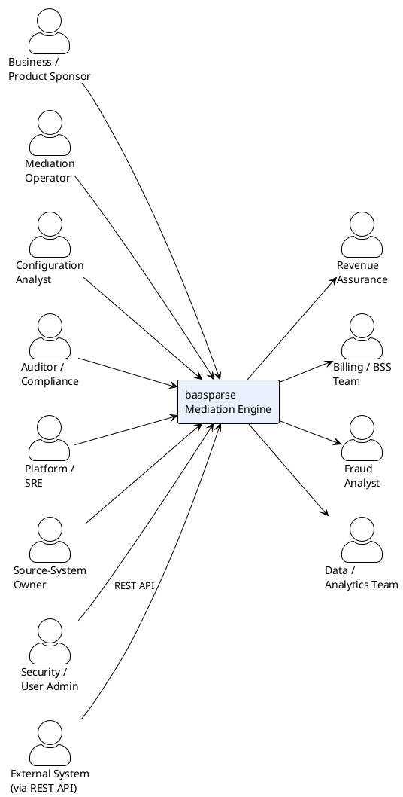

# 03 — Stakeholders & Personas

> Part of the [[00-index|baasparse BRS]]. Previous: [[02-business-context]]  ·  Next: [[04-scope]]

## 3.1 Stakeholder map

## 3.2 Personas & their needs

| Persona | Role | Primary needs from baasparse |
|---------|------|------------------------------|
| **Business / Product Sponsor** | Owns the outcome | Predictable v1/v2 delivery; revenue integrity; cost-efficient run |
| **Mediation Operator** | Day-to-day running of flows | Start/stop/pause/resume streams; see status; find & reprocess failed records; clear alarms — via GUI |
| **Configuration Analyst** | Defines sources, pipelines, rules | Add a new source & format; model file structures & transformations declaratively in the GUI; test rules safely before go-live |
| **Security / User Admin** | Manages access | Create/manage users & roles; enforce RBAC; review the security audit trail |
| **External System / Integrator** | Operates baasparse from its own tooling | A documented REST API with authentication & RBAC to manage config and control flows |
| **Revenue Assurance (RA)** | Guards against leakage | Proof of completeness (in = out + suspense + discarded); duplicate & gap detection |
| **Billing / BSS Team** | Consumes output | Correctly formatted, normalised, de-duplicated records delivered on schedule |
| **Fraud Analyst** | Consumes output | Timely, enriched records; no silent drops |
| **Data / Analytics Team** | Consumes output | Consistent field semantics and units across feeds |
| **Auditor / Compliance** | Assurance & regulation | Immutable, queryable audit trail of every transformation and decision |
| **Platform / SRE** | Runs the process | Bounded resource usage; health/metrics; safe restart; no data loss on crash |
| **Source-System Owner** | Produces input | Clear contract on file formats, naming, delivery location, and error feedback |

## 3.3 Key stakeholder goals mapped to drivers

| Persona | Chief goal | Linked driver ([[02-business-context]]) |
|---------|-----------|------------------------------------------|
| Operator | "I can see, control, and recover every flow." | D-6 |
| Configuration Analyst | "I change behaviour with config, not code." | D-3 |
| Revenue Assurance | "I can prove nothing was lost or double-counted." | D-1, D-4 |
| Downstream consumers | "I receive clean data in my format, on time." | D-2 |
| SRE | "It runs fast and predictably within its memory budget." | D-5 |
| Sponsor | "v1 mediates files and loads to RDBMS; v2 extends alerting — on plan." | D-7 |

## 3.4 RACI (indicative, per capability area)

| Capability | Operator | Config Analyst | RA | SRE | Sponsor |
|------------|:--------:|:--------------:|:--:|:---:|:-------:|
| Manage users & roles (RBAC)¹ | I | I | I | C | I |
| Onboard source/format | C | **R/A** | C | C | I |
| Define transformation rules | C | **R/A** | C | I | I |
| Run/monitor flows | **R/A** | I | I | C | I |
| Reprocess suspense | **R/A** | C | C | I | I |
| Completeness sign-off | I | I | **R/A** | I | I |
| Capacity & performance | I | I | I | **R/A** | I |
| Scope & release approval | I | I | I | I | **R/A** |

*R = Responsible, A = Accountable, C = Consulted, I = Informed.*
¹ Owned (R/A) by the **Security / User Admin** persona (not shown as a column above).
