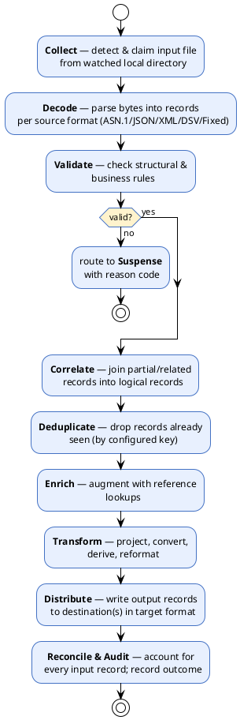
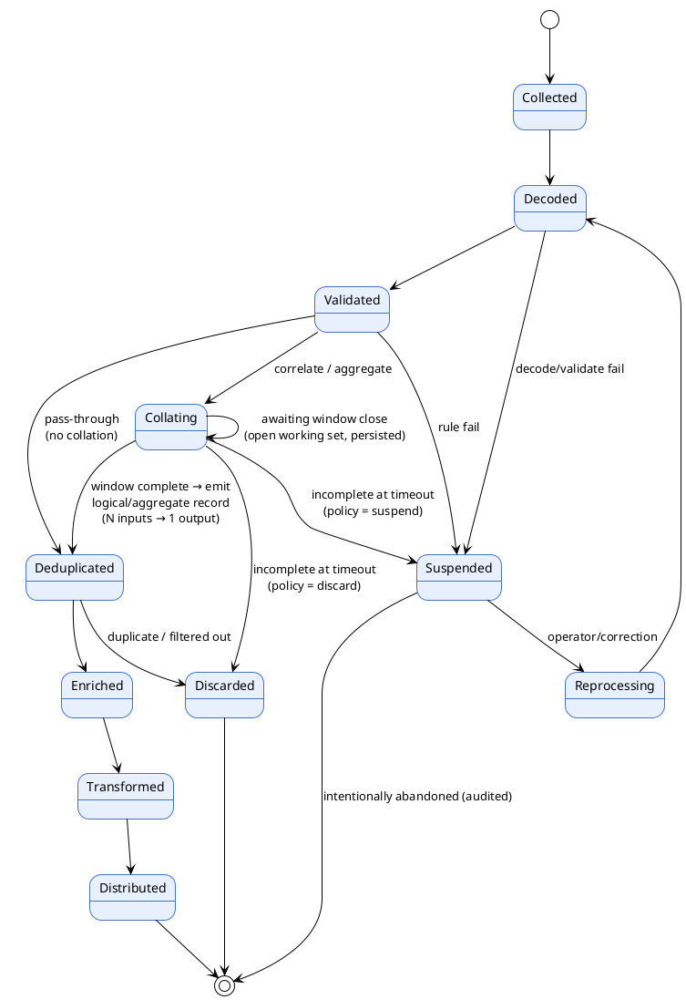
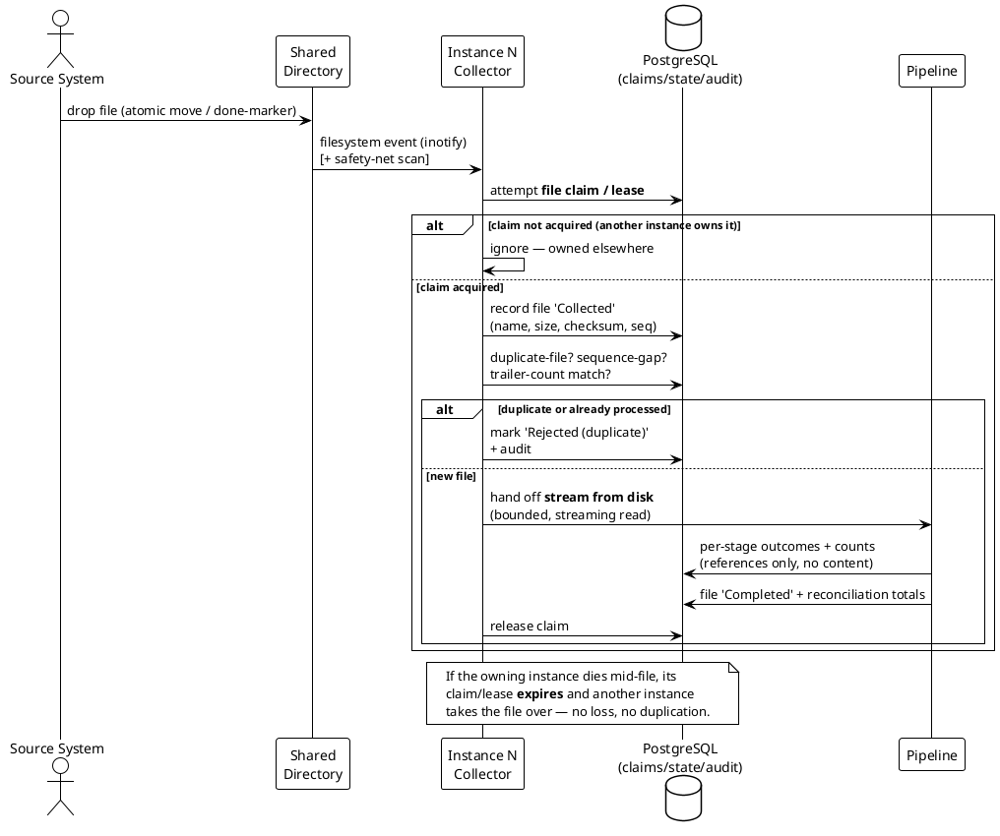

# 05 — The Mediation Business Process

> Part of the [[00-index|baasparse BRS]]. Previous: [[04-scope]]  ·  Next: [[06-functional-requirements]]

This section describes the **end-to-end mediation lifecycle** as a business process. It
frames *what happens to a record*, from arrival to delivery, and the control points
where the business asserts quality, completeness, and auditability. The numbered
requirements in [[06-functional-requirements]] hang off these stages.

## 5.1 The pipeline, stage by stage



| Stage | Business intent | Key control |
|-------|-----------------|-------------|
| Fetch *(optional)* | Bring remote files to local disk for processing | SFTP/FTPS; integrity check; already-fetched check |
| Collect | Take ownership of an input file exactly once | File claim / lock; sequence & duplicate-file checks |
| Decode | Turn raw bytes into structured records | Format-specific parser; reject on decode failure |
| Validate | Enforce structural & business correctness | Rule set; suspense on failure |
| Correlate | Assemble complete logical records from parts | Correlation key & time window |
| Deduplicate | Ensure each event counted once | Dedup key + retention window |
| Enrich | Add context (lookups, derived reference data) | Reference data in PostgreSQL |
| Transform | Shape records for consumers | Declarative transformation rules |
| Distribute | Deliver to the right consumer in the right format | Routing rules; atomic output |
| Done | Separate processed inputs from pending | Move to configurable "done" directory |
| Archive *(scheduled)* | Retain & offload old processed files | Age threshold; compress; ship to remote; verify-then-prune |
| Reconcile & Audit | Prove completeness; leave a trail | Counts; immutable audit records |

## 5.2 Record lifecycle (states)



Every terminal outcome — **Distributed**, **Discarded**, or **abandoned Suspense** — is
**audited**. Because correlation/aggregation collapse **N input records into one output**
(the `Collating` state), completeness is proven by **input conservation** — every *input*
record is accounted for as *contributed-to-an-emitted-aggregate*, *delivered*, *discarded*,
*suspended*, or *still open* — **not** by equal in/out counts (see `BR-REC-*` and §5.6).

## 5.3 File collection sequence (real-time, multi-instance)

Any instance in the cluster may see a new file. Real-time detection (`inotify`) triggers a
**distributed claim** in PostgreSQL (a row-level `SELECT … FOR UPDATE SKIP LOCKED` claim
with a heartbeat lease) so exactly one instance processes it; content is streamed from the
shared disk (never copied into PostgreSQL).



## 5.4 Business rules governing the process (summary)

- **Real-time & always-on:** files are picked up and processed **as soon as they are
  available** (event-driven), not on batch schedules; the service runs continuously.
- **Once-only capture across the cluster:** a given input file is **claimed by exactly one
  instance** (distributed lease in PostgreSQL); re-arrival of the same file is detected and
  rejected (audited), never silently reprocessed — regardless of which server sees it.
- **Content stays on disk:** raw file bytes are **streamed from the shared disk** and never
  copied into PostgreSQL (the only persisted record data is the bounded collation working
  set, §5.6); suspense/audit hold **references**, so reprocessing
  re-reads the original file **as-is**.
- **Fail safe, not silent:** a record that cannot be processed goes to **suspense** with a
  reason code — it is never dropped without an audit entry.
- **Order independence where possible:** correlation/dedup use keys and time windows, not
  arrival order, so late/partial records are handled deterministically.
- **Completeness is provable by input conservation:** every *input* record is always
  accounted for as **delivered**, **discarded**, **suspended**, **contributed to an emitted
  aggregate**, or **still open** in a correlation/aggregation window. Where no collation
  occurs this reduces to `collected = distributed + discarded + suspended`; where collation
  occurs, output records are fewer than inputs by design, and each output carries a
  **contributing-record count** so the inputs still reconcile (see §5.6, `BR-REC-*`).
- **Configuration governs behaviour:** which formats, rules, transformations, and routes
  apply is defined per source/stream in configuration (see [[08-data-and-configuration]]).
- **Backpressure over unbounded buffering:** to protect memory, the process applies
  backpressure and streams data rather than loading whole files into memory (see
  [[07-non-functional-requirements]]).

## 5.5 File-level lifecycle: fetch → in-progress → done → archive

Distinct from the *record* lifecycle (5.2), each **input file** moves through a
housekeeping lifecycle. Remote fetch feeds the input directory; the **in-progress**
directory holds files currently being processed; the **done** directory holds files fully
delivered to all endpoints; the scheduled archiver compresses and offloads them.

```plantuml
@startuml file-lifecycle
!theme plain
skinparam defaultTextAlignment center
skinparam state { BackgroundColor #E8F0FE BorderColor #4472C4 }

state "On Remote Host" as R
state "Fetched (input dir)" as I
state "In-Progress (in-progress dir)" as P
state "Done (done dir)" as D
state "Archived (compressed)" as A
state "Offloaded (remote archive)" as O

[*] --> R
R --> I : SFTP/FTPS fetch\n(integrity + already-fetched check)
I --> P : claimed → **moved to in-progress**\n(processing begins)
P --> P : store-and-forward:\nretry endpoints until delivered
P --> D : **all records delivered to\nALL fan-out endpoints** (BR-COL-009)
D --> A : age > X days →\ncompress (scheduled)
A --> O : transfer to remote\n(verify before prune)
O --> [*] : local done files pruned\nper retention policy
note right of P
  If the owning instance dies, another
  recovers the in-progress file and
  completes it (BR-COL-015, BR-HA-004).
  Records that fail go to suspense.
end note
@enduml
```

**Governing rules:**
- A file is **moved to "in-progress" when processing begins**, and reaches **"done" only
  once every record has been delivered to _all_ configured endpoints** (`BR-COL-009`,
  `BR-DST-010`). A file with an unavailable destination stays in-progress and is retried
  (store-and-forward) — output is never lost.
- **In-progress files are recoverable**: on instance failure another instance takes over
  and completes them (`BR-COL-015`, `BR-HA-004`).
- **Zero-record files** are accepted and recorded, and (if configured) still produce empty
  output before reaching "done" (`BR-COL-016`).
- Archiving **verifies the remote transfer before pruning** local files (`BR-ARC-006`),
  so offload never loses data.
- Fetch, in-progress/done handling, and archive are all **configurable per source** and
  fully audited.

## 5.6 Processing modes, collation & completion semantics

Most of the pipeline is **streaming**: records flow through memory (decode → validate →
enrich → transform → distribute) and their content is never persisted — this preserves the
bounded-memory guarantee (`BR-NFR-001/009`). Two stages are different because they must see
**many records across files and time**: **correlation** (assembling one logical record from
partial records of the same event) and **aggregation** (summarising many records into one).
These are the only stages that persist **record** data.

### Processing modes (per pipeline)

| Mode | When | Behaviour |
|------|------|-----------|
| **Streaming (pass-through)** | Pipeline has no correlation/aggregation | Records stream end-to-end; no record bodies persisted; memory bounded by concurrency/buffers. High-volume feeds (bulk voice/data CDRs) run here. |
| **Collating (staged stages)** | Pipeline includes correlation/aggregation | Incoming canonical records are written to a **bounded working set** in PostgreSQL, keyed by correlation/group key, until the window completes; the rest of the pipeline still streams. |

The mode is a **property of the configured pipeline**, not a global setting — different
sources on the same cluster can run different modes. Enrichment is **1:1 and in-stream** in
both modes: it looks records up against reference data in PostgreSQL but does **not** persist
records and does **not** change record counts.

### The canonical record

To store and collate records independent of their input format, decoded records are held in
a **canonical internal representation** (typed fields with explicit units, `BR-DEC-009`).
This is the "common format" the working set is persisted in (and the same shape the v1 RDBMS
load target consumes). Raw file bytes are still never stored — only the decoded canonical
fields needed for collation.

### Completion — "how do we know the last record has arrived?"

A collation window emits when a **completion trigger** fires, chosen per rule in priority
order:

1. **Explicit end-of-event signal** — a partial-record indicator / closing-cause / final
   flag / sequence number in the source record (best; the engine *knows* it is complete).
2. **Time window / grace timeout** — emit when no new record for the key has arrived within
   a configurable window (the fallback when no explicit signal exists).
3. **Record count** — emit when an expected number of parts is reached.
4. **Session close** — an explicit session-end event.

Two policies must be configured because completeness and real-time are in tension:
- **Incomplete-at-timeout policy** — when a window closes still incomplete: **emit-partial**,
  **suspend**, or **discard** (each audited).
- **Late-arrival policy** — a record for a key already emitted: **emit an adjustment/delta**,
  **suspend**, or **discard** (each audited; dedup, `BR-DUP-*`, guards against double-count).

### Time basis — event time vs arrival time (`BR-COR-010`)

Windowing uses **two distinct clocks**, and the distinction matters for correctness:

- A record's **canonical event time is its event start-date/time** — the start of the
  underlying event (call/session), carried in the record itself. **Grouping keys** (e.g.
  `event_date`), **window assignment**, and **effective-dated config/format/rule selection**
  (`BR-DEC-012`, `BR-ENR-005`) are all computed from **event time**. So a file processed
  *today* that carries *yesterday's* events lands in yesterday's windows/groups and decodes
  under yesterday's effective format — never under "now".
- The **grace-timeout** trigger (#2 above) is the exception: it is measured in
  **arrival / wall-clock time** — elapsed time since the last member for the key was
  appended — because "have we waited long enough for stragglers?" is inherently a
  real-world-time question.

A record whose **event time falls inside an already-emitted** window is a **late arrival**
(late-arrival policy); one whose event time is old but lands inside a **still-open** window
is simply placed in that window by event time. Event-time computation is
**timezone/DST-aware** (`BR-TRN-010`) so window and group boundaries are unambiguous across
feeds and across a DST change.

### Consequence: records-in ≠ records-out (by design)

Collation deliberately makes **output records fewer than input records**. This is correct,
not loss — provided reconciliation accounts for it (`BR-REC-*`):
- Each emitted aggregate carries a **contributing-record count** and **source-file
  references**, giving lineage (`BR-AUD-003`) without storing record bodies after emit.
- **Open** windows (records buffered, not yet emitted) are a distinct, **queryable
  in-flight count** — *pending*, never confused with *lost* (`BR-REC-007`).
- The emit is **atomic**: consuming the N member rows, writing the 1 output, and marking the
  contributors done happen in **one PostgreSQL transaction**, so a crash mid-emit cannot lose
  the inputs or double-count (`BR-COR-006`, `BR-NFR-011/012`).

After emit, member **bodies** are dropped (default) — counts and references are retained;
retaining member bodies for a configurable post-emit window (for drill-down) is optional.
