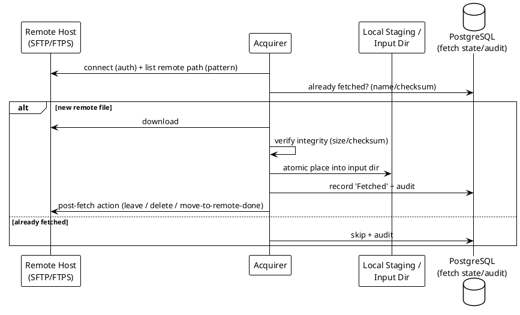
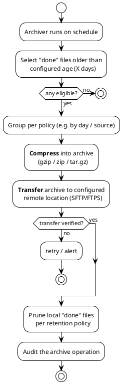
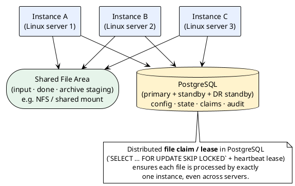

# 06 — Functional Business Requirements

> Part of the [[00-index|baasparse BRS]]. Previous: [[05-business-process]]  ·  Next: [[07-non-functional-requirements]]

Requirements use `BR-<AREA>-<NNN>` and MoSCoW priority (**M**ust / **S**hould / **C**ould /
**W**on't-this-release). Unless noted, all are **v1**. Items marked *(v2)* are recorded
here for continuity but scoped to release 2.

---

## 6.1 Remote Acquisition — `RMT`

Remote acquisition **fetches files from remote hosts into a local staging/input
directory**, from which the normal Collection stage (`COL`) takes over. It is a
configurable front-end to collection, not a change to the pipeline.



| ID | Priority | Requirement |
|----|:--------:|-------------|
| BR-RMT-001 | M | The engine MUST be able to **fetch input files from remote hosts** and store them **locally** for processing, over **SFTP** and **FTPS**. Because usage records carry subscriber-identifying data, **only encrypted transports (SFTP/FTPS) are supported — plain, unencrypted FTP is explicitly out of scope** (`BR-NFR-051`, `BR-CMP-001`). |
| BR-RMT-002 | M | Remote acquisition MUST be **configurable per source**: protocol, host, port, remote path/directory, and file-selection pattern (glob/regex). |
| BR-RMT-003 | M | Credentials/keys MUST be supplied via **secure configuration/secrets** (never hard-coded), supporting password auth and **SFTP key-based auth**. |
| BR-RMT-004 | M | The acquirer MUST only hand a downloaded file to Collection when it is **complete and integrity-checked** (e.g. size/checksum), placing it **atomically** into the local input directory (temp-then-rename or done-marker). |
| BR-RMT-005 | M | The engine MUST track **already-fetched remote files** (by name and/or checksum) so a file is **not downloaded or processed twice** across polls and restarts. |
| BR-RMT-006 | S | The engine SHOULD support a configurable **post-fetch action on the remote**: leave in place, delete, or move to a remote "collected/done" directory. |
| BR-RMT-007 | S | Remote acquisition SHOULD run on a **configurable schedule / poll interval** per remote source. |
| BR-RMT-008 | S | The acquirer SHOULD **retry transient failures** (connect/transfer) with backoff, and resume/re-fetch partial downloads safely; permanent failures SHOULD raise an alert. |
| BR-RMT-009 | S | FTPS/SFTP connections SHOULD support **host-key / certificate verification** so the engine only transfers with trusted hosts. |
| BR-RMT-010 | C | The engine COULD support configurable **concurrency and bandwidth limits** per remote host to avoid overloading source systems. |
| BR-RMT-011 | S | The engine SHOULD support **scheduled credential/key rotation** for remote endpoints: an operator can **upload a new credential/key and set an effective-from time**, after which the engine automatically switches to it (the prior credential is retained until cutover so in-flight transfers are unaffected). Rotation MUST be RBAC-gated and audited (`BR-USR-*`, `BR-AUD-*`), the secret sourced via the secrets mechanism (`BR-NFR-054`), and a rotation that fails to authenticate at cutover MUST raise an alert (`BR-OPS-008`) rather than silently starving input. |
| BR-RMT-012 | M *(v2)* | **(v2)** Remote **fetch polling is dynamically cluster-coordinated** — for each remote source, **exactly one instance polls/downloads at a time** via the dynamic scheduled-job lease (`BR-HA-010`), with automatic failover, so instances never open concurrent sessions to the same source. **v1 seam:** in v1, fetch polling runs on a **single nominated instance per remote source** (configuration), and correctness does **not** depend on that nomination — the **already-fetched guard** (`BR-RMT-005`) makes any accidental double-poll idempotent (a file is never acquired or processed twice). v2 replaces the static nomination with the dynamic lease **without changing fetch semantics** (the poll/download/guard logic is unchanged; only *who runs it and how failover happens* changes). |

## 6.2 Collection & Ingestion — `COL`

| ID | Priority | Requirement |
|----|:--------:|-------------|
| BR-COL-001 | M | The engine MUST collect input files from one or more configured **local or shared file-system directories** per source (including directories populated by Remote Acquisition, `BR-RMT-*`, and the **shared directory** used across instances, `BR-HA-*`). |
| BR-COL-002 | M | The engine MUST only collect files that are **completely delivered** — detected via atomic rename, a done-marker/trigger file, or a configurable stability check (size unchanged for N intervals). |
| BR-COL-003 | M | The engine MUST support configurable **file selection** per source (glob/regex on filename, and optionally directory). |
| BR-COL-004 | M | Each file MUST be **claimed exactly once across all instances and servers** in the cluster, so that concurrent workers on different hosts never process the same file twice (`BR-HA-*`). |
| BR-COL-005 | M | The engine MUST record file-level metadata on collection: name, path, size, checksum/hash, detected sequence number (if any), collection timestamp, and a **unique, gap-free, system-assigned file identifier (file UID)** used for tracing and output sequencing (`BR-DST-011`). |
| BR-COL-006 | M | The engine MUST detect and reject **re-arrival of an already-processed file** (by name and/or checksum), raising an audited rejection rather than reprocessing. |
| BR-COL-007 | S | The engine SHOULD detect **file sequence gaps** (missing expected sequence numbers) per source and raise an operational alert. |
| BR-COL-008 | M | The engine MUST read input using a **bounded, streaming** approach — it MUST NOT require loading an entire file into memory to begin processing. |
| BR-COL-009 | M | When processing of a file **begins**, the engine MUST move it to a configurable **"in-progress" directory**; it MUST be moved to the **"done" directory** **only once the file has been fully delivered to _all_ configured (fan-out) endpoints** (`BR-DST-008`). This makes the file's state visible on disk and underpins store-and-forward and crash recovery. Files that fail are handled via **suspense** (`BR-ERR-*`) and MUST NOT be moved to "done". On reaching "done" the engine MUST also write a small **on-disk completion marker/manifest** alongside the file (file UID, checksum, record counts, outcome), so processed-file state can be **reconciled from disk** if the database is restored to an earlier point (`BR-NFR-017`). |
| BR-COL-010 | S | The engine SHOULD support alternative configurable post-processing **dispositions** in place of, or in addition to, the "done" move: delete, or leave-in-place-marked. |
| BR-COL-011 | C | The engine COULD support a configurable **maximum concurrent files / directory poll interval** per source to control load. |
| BR-COL-012 | M | The engine MUST detect and collect files in **real time**, beginning processing **as soon as a complete file is available** — driven by **filesystem event notification** (Linux `inotify`) with a periodic scan as a safety net — rather than on scheduled batch runs. |
| BR-COL-013 | S | The engine SHOULD support **decompressing input files** on collection (e.g. `.gz`, `.zip`) per a configurable per-source setting, before decode, preserving the streaming memory guarantee. |
| BR-COL-014 | S | The engine SHOULD support an **optional, per-pipeline integrity/authenticity check** on collected files — verifying an expected **checksum/hash** and/or **digital signature** (e.g. against an accompanying manifest/signature) — routing files that fail to suspense with an audited reason. |
| BR-COL-015 | M | The engine MUST maintain an **"in-progress" directory** for files currently being processed (`BR-COL-009`). On instance failure/takeover (`BR-HA-004`), in-progress files MUST be **recovered and driven to completion** by another instance — never stranded, never lost. |
| BR-COL-016 | M | The engine MUST provide **configurable handling of zero-record (empty) files**: the file MUST always be **accepted and recorded** (noting a record count of 0), and — per configuration — MAY be **transformed and delivered as empty output to configured downstream channels**, or acknowledged and moved to "done" without output. Zero-record files MUST NOT be treated as errors unless configured to be. |
| BR-COL-017 | M | The engine MUST protect against **poison files** that cause **abnormal termination** (panic/OOM/repeated crash), as distinct from records that merely fail to decode (`BR-DEC-007`). It MUST track **processing attempts per file** (incremented on each claim/takeover, `BR-HA-004`) and record the **progress point** (checkpoint offset, `BR-NFR-013`). On repeated abnormal termination at the **same progress point**, the engine MUST either **isolate the offending record to suspense** (if identifiable) and continue past it, or — after a **configurable maximum attempts** — move the whole file to **file-level quarantine**: retained on disk (`BR-ERR-008`), **not re-claimed**, counted as an unprocessed file-level state (`BR-REC-008`), and alerted (`BR-OPS-008`). A poison file MUST NOT crash-loop the cluster through repeated takeover. |

## 6.3 Decoding & Parsing — `DEC`

| ID | Priority | Requirement |
|----|:--------:|-------------|
| BR-DEC-001 | M | The engine MUST decode **ASN.1**-encoded input (BER/DER) into structured records, driven by a configurable schema/definition for the record structure. |
| BR-DEC-002 | M | The engine MUST decode **JSON** input, supporting both **record-per-line (NDJSON)** and structured array/object documents. |
| BR-DEC-003 | M | The engine MUST decode **DSV** (delimiter-separated) input with configurable **delimiter, quote character, escape character, header presence, and encoding**. |
| BR-DEC-004 | M | The engine MUST decode **fixed-position** input with configurable per-field **offset, length, padding, alignment, and trim** rules. |
| BR-DEC-005 | M | Each decoder MUST be selected per source/stream by **configuration**, not by code changes. |
| BR-DEC-006 | M | The engine MUST decode **incrementally / record-at-a-time (or in bounded batches)** to preserve the streaming memory guarantee (BR-COL-008). |
| BR-DEC-007 | M | On a record that cannot be decoded, the engine MUST route that record (and enough context to locate it) to **suspense** with a decode-failure reason code, and continue processing the remainder of the file. |
| BR-DEC-008 | S | The engine SHOULD support **multiple record types within one file/stream** (heterogeneous records), selecting the decode/handling per record-type discriminator. |
| BR-DEC-009 | S | The engine SHOULD normalise decoded values into a common internal representation (typed fields with explicit units) so downstream stages are format-independent. |
| BR-DEC-010 | C | The engine COULD support configurable **character-set / code-page** conversion during decode. |
| BR-DEC-011 | M | The engine MUST decode **XML** input, with configurable mapping of **elements/attributes to fields** (e.g. XPath-style paths), supporting **record-per-element** extraction and nested structures, decoded incrementally (streaming) to preserve the memory guarantee. |
| BR-DEC-012 | M *(v2)* | **(v2)** **Event-time-driven format selection** — the engine selects the format/template version **effective at the record's event-start-date/time** (`BR-COR-010`), so a file processed today but carrying yesterday's events automatically decodes under yesterday's format and scheduled format cutovers activate by event date. **v1 seam:** v1 already stores Format Definitions as **temporal, versioned config** (`effective_from`/`end_date`, `BR-CFG-009`) and decodes each source under its **currently-active** version; a format change is an operator-timed **publish** (`BR-CFG-008`) with in-flight files continuing under the version they started (`BR-CFG-007`). v2 layers **automatic event-time selection** over the *same* versioned Format Definitions — no schema change, only the selection rule changes from "current-active" to "effective-at-event-time". Multi-record-type files use the discriminator (`BR-DEC-008`) in both releases. |

## 6.4 Validation & Screening — `VAL`

| ID | Priority | Requirement |
|----|:--------:|-------------|
| BR-VAL-001 | M | The engine MUST validate decoded records against **configurable rules** (mandatory fields present, type/format correct, value ranges, referential checks). |
| BR-VAL-002 | M | Records failing validation MUST be routed to **suspense** with a specific reason code; they MUST NOT be silently dropped. |
| BR-VAL-003 | S | The engine SHOULD support **screening/filtering** rules that intentionally **discard** records that are valid but not wanted (e.g. zero-duration events), recording the discard for reconciliation. |
| BR-VAL-004 | S | Validation rules SHOULD be expressible **declaratively** (see [[08-data-and-configuration]]) and be versioned. |
| BR-VAL-005 | C | The engine COULD support **severity levels** (reject vs warn-and-pass) per validation rule. |
| BR-VAL-006 | M | Where a source's files carry **header/trailer records** (common for CDR feeds), the engine MUST support configurable parsing of them and MUST **reconcile the trailer record count against the number of records actually decoded**, flagging any mismatch as a file-level integrity failure (`BR-REC-*`). |
| BR-VAL-007 | S | The engine SHOULD support a **TAP3 (GSMA TD.57) ingestion validation profile** for roaming-in files, recognising that TAP3 ingestion is more than generic decode: **file-sequence-number continuity** across a TAP stream (gap/duplicate detection), distinguishing **transfer vs notification** files, and **severity classification** of validation errors — *fatal* (reject the **whole file** to suspense) vs *severe* (route the **individual record** to suspense) vs *warning* (pass, recorded) — rather than a flat valid/invalid outcome. Generation of **RAP** (Returned Account Procedure) files and roaming **settlement** output remain **future scope** ([[10-roadmap]]); v1 quarantines and reports TAP3 rejects clearly for downstream/manual handling. |

## 6.5 Correlation — `COR`

| ID | Priority | Requirement |
|----|:--------:|-------------|
| BR-COR-001 | S | The engine SHOULD support **correlation** of multiple partial/related input records into a single logical output record, keyed by a **configurable correlation key**. |
| BR-COR-002 | S | Correlation SHOULD operate within a **configurable time window / completion condition**, after which incomplete correlations are handled by a configurable policy (emit-partial, suspend, or discard). |
| BR-COR-003 | S | Correlation state held pending completion MUST respect the memory-efficiency constraint — bounded, spillable to PostgreSQL rather than unbounded in-memory. |
| BR-COR-004 | S | The engine SHOULD support **aggregation** — summarising many records into one (e.g. per-subscriber, per-cell, or per-period totals) — as a configurable stage, with a configurable grouping key, aggregate functions (sum/count/min/max), and a completion trigger (time window, record count, or session close). |
| BR-COR-005 | S | Aggregation state MUST respect the memory-efficiency constraint — **bounded and spillable to PostgreSQL** (as with correlation, `BR-COR-003`) — and its completion/emit behaviour MUST be deterministic and audited. |
| BR-COR-006 | M | Where a pipeline performs correlation/aggregation, the engine MUST persist the **open working set** of in-flight records in a **canonical internal representation** (`BR-DEC-009`) in PostgreSQL, keyed by correlation/group key, and MUST perform the **emit atomically** — consuming the contributing member records, writing the single output record, and marking the members complete in **one transaction** — so a failure mid-emit neither loses inputs nor produces duplicates (`BR-NFR-011/012`). Member **bodies** MUST be droppable after emit (default), with **contributing-record counts and source-file references retained** for lineage (`BR-AUD-003`, `BR-REC-*`); retaining member bodies for a configurable post-emit window MAY be supported. Raw file bytes are still never persisted (`BR-NFR-009`). |
| BR-COR-007 | M | Correlation/aggregation completion MUST be driven by a **configurable completion trigger** — an **explicit end-of-event signal** (partial-record indicator / closing cause / final flag / sequence number), a **time window / grace timeout**, a **record count**, or a **session-close** event — with a configurable **incomplete-at-timeout policy** (emit-partial / suspend / discard) and a configurable **late-arrival policy** (adjustment-delta / suspend / discard). Every completion, timeout, and late-arrival outcome MUST be audited. |
| BR-COR-008 | M | Open windows MUST be **owned collectively via PostgreSQL**, not bound to the instance that ingested their members. Any instance MUST be able to append a member (atomic upsert, `BR-COR-006`); a **due window** (completion trigger met or deadline passed) MUST be **claimed for emit by exactly one surviving instance** using the same `SELECT … FOR UPDATE SKIP LOCKED` mechanism as file claims (`BR-HA-003`), transitioning `open → emitting → emitted` transactionally. If the instance that ingested a window's members fails, another instance MUST still complete it — **no window stranded, none emitted twice**. A window still being actively appended to MUST NOT be completed prematurely. |
| BR-COR-009 | S *(v2)* | **(v2)** **Cross-source (multi-feed) correlation** — assembling one logical record from **partial records that arrive on different sources/pipelines** (e.g. the two legs of a call from different MSCs, or a data session split across SGW-CDR and PGW-CDR), modelled as a **Correlation Group** ([[08-data-and-configuration]]) that **more than one source pipeline feeds**, keyed by a shared correlation key. **v1 seam:** v1 supports single-source correlation/aggregation (`BR-COR-001..008`) whose working set is **keyed by correlation key and is already source-agnostic** — the persisted member rows (`BR-COR-006`) carry the key, not a hard source binding, and cluster ownership/atomic-emit (`BR-COR-008`) are independent of which pipeline appended a member. v2 therefore adds cross-source correlation by allowing **more than one pipeline to append to the same keyed working set** (the Correlation Group config) — **reusing the v1 working-set, claim, emit, and input-conservation machinery unchanged**; no change to the persistence model or emit transaction. Participating sources must produce **key-compatible canonical records** (shared key present and normalised, `BR-TRN-010`, `BR-DEC-009`). |
| BR-COR-010 | M | Correlation/aggregation MUST use a well-defined **time basis**. The record's **canonical event time is its event start-date/time** (the start of the underlying event) carried in the record; **grouping** keys (e.g. `event_date`), **effective-dated reference-data/rule selection** (`BR-ENR-005`), and **window assignment** MUST be computed from this **event time**. (Event-time-driven *format-version* selection is the v2 extension `BR-DEC-012`; v1 decodes under the current-active format but still windows/groups by event time.) The **grace-timeout** completion trigger (`BR-COR-007`), by contrast, is measured in **arrival/processing (wall-clock) time** — time elapsed since the last member for the key was appended. A record whose event time falls in an **already-emitted** window/group is a **late arrival** handled by the late-arrival policy (`BR-COR-007`); a record whose event time is old but still within an **open** window is placed in that window by event time. Event-time computation MUST be **timezone- and DST-aware** (`BR-TRN-010`) so window and group boundaries are unambiguous. |

## 6.6 Deduplication — `DUP`

| ID | Priority | Requirement |
|----|:--------:|-------------|
| BR-DUP-001 | M | The engine MUST deduplicate records using a **configurable dedup key** (one or more fields, or a record hash). |
| BR-DUP-002 | M | Duplicate detection MUST persist keys in PostgreSQL over a **configurable retention window** so duplicates are caught **across files and restarts**, not just within one file. As the highest-write-rate store, the dedup-key table SHOULD be **time-partitioned** so that expiry of the retention window is achieved by **dropping whole partitions** rather than row-by-row deletion. |
| BR-DUP-003 | M | A detected duplicate MUST be recorded (count + reference) for reconciliation and MUST NOT be delivered downstream. |
| BR-DUP-004 | S | The dedup key store SHOULD be bounded and prunable by retention window to protect storage and memory. |
| BR-DUP-005 | S | Deduplication (removal of **identical re-sent records**) SHOULD be applied **before records contribute to correlation/aggregation**, so duplicates do not inflate aggregates. The **dedup key** (whole-record identity) is distinct from the **correlation key** (event identity): legitimately-related partial records share a correlation key but are not duplicates and MUST NOT be dropped by dedup. |

## 6.7 Enrichment — `ENR`

| ID | Priority | Requirement |
|----|:--------:|-------------|
| BR-ENR-001 | S | The engine SHOULD support **enrichment** of records via configurable **lookups** against reference data held in PostgreSQL (e.g. mapping codes to descriptions, adding derived attributes). Enrichment is **1:1 and in-stream** — it adds fields to a passing record and MUST NOT persist records or change record counts; only the reference tables it reads are in the database. |
| BR-ENR-002 | S | Enrichment lookups SHOULD define behaviour on **miss** (leave blank, default value, or route to suspense) per rule. |
| BR-ENR-003 | S | The engine SHOULD serve enrichment lookups from **indexed reference tables** that scale to large data sets (e.g. tens of millions of rows, such as number-portability) with a **bounded hot cache** (e.g. LRU) and refresh policy, rather than loading whole tables into memory — so lookups stay low-latency without breaching the memory budget (`BR-NFR-002/023`). |
| BR-ENR-004 | M | The engine MUST provide a **reference-data lifecycle**: loading and updating lookup tables (via GUI/API/import) **without redeploying** the engine, with changes audited. |
| BR-ENR-005 | S | Reference data and enrichment/transformation rules SHOULD support **effective-dating** — a record/rule version can be given an "active from / active to" date so scheduled changes (e.g. a new tariff or number range from the 1st of the month) take effect automatically, with the engine selecting the version effective at the record's event time. |

## 6.8 Transformation & Formatting — `TRN`

| ID | Priority | Requirement |
|----|:--------:|-------------|
| BR-TRN-001 | M | The engine MUST apply **configurable transformations** to records, defined as **data/configuration (e.g. JSON), not code**. |
| BR-TRN-002 | M | Transformation MUST support **projection** — selecting, dropping, and **reordering** fields (e.g. "output fewer columns"). |
| BR-TRN-003 | M | Transformation MUST support **renaming** of fields between input and output. |
| BR-TRN-004 | M | Transformation MUST support **type and unit conversion** (e.g. bytes↔kilobytes, seconds↔minutes, epoch↔ISO-8601, string↔number). |
| BR-TRN-005 | S | Transformation SHOULD support **derived fields** computed from one or more input fields (concatenation, arithmetic, conditional/mapping expressions, constants). |
| BR-TRN-006 | M | The engine MUST support producing output in a **different format** from the input (any of ASN.1/JSON/DSV/fixed-position → any target format the distribution supports). |
| BR-TRN-007 | S | Transformation rules SHOULD be **composable and ordered**, and applied deterministically. |
| BR-TRN-008 | S | The engine SHOULD validate the **output record** against a configurable output schema before distribution. |
| BR-TRN-009 | C | The engine COULD support reusable, named transformation rule-sets shared across streams. |
| BR-TRN-010 | M | The engine MUST support configurable **normalisation** of telco identifiers and timestamps, including: **MSISDN to E.164**, **IMSI/IMEI** formatting, and **timestamp/timezone normalisation** (to a canonical timezone/format, DST-aware), so records from different feeds share consistent field semantics and units. |

## 6.9 Distribution & Routing — `DST`

| ID | Priority | Requirement |
|----|:--------:|-------------|
| BR-DST-001 | M | The engine MUST distribute transformed output as **files** written to configurable **local file-system** destinations. |
| BR-DST-002 | M | Output MUST be written in a **configurable format** (JSON / DSV / fixed-position / XML; ASN.1 output *(S)*), independent of the input format. |
| BR-DST-003 | M | Output files MUST be produced **atomically** (write-to-temp then rename, or done-marker) so consumers never read partial files. |
| BR-DST-004 | S | The engine SHOULD support **routing**: sending records/streams to **different destinations** based on configurable rules (by record type, field value, or source). |
| BR-DST-005 | S | The engine SHOULD support configurable **output batching** (records per file, max file size, or time-based roll-over). |
| BR-DST-006 | S | Output file naming SHOULD be configurable (templated with source, timestamp, sequence). |
| BR-DST-008 | M | The engine MUST support **fan-out** — delivering the same stream/record to **multiple destinations simultaneously**, each with its **own output format and layout** (e.g. billing as DSV, fraud as JSON, data-warehouse as fixed-position) from a single processing pass. |
| BR-DST-009 | S | The engine SHOULD provide a **delivery guarantee** to downstream consumers: confirm an output file is fully written and available (atomic + optional done-marker/receipt), track its delivery state (`Delivery Record`), and support **operator-initiated re-send/retransmission** of a previously produced output (audited), without re-running the whole pipeline. |
| BR-DST-010 | M | The engine MUST implement **store-and-forward**: if a destination is **unavailable**, its output MUST be **retained and retried** (with backoff) until delivered — **no output is lost** on a destination outage. The source file MUST remain in the **"in-progress" directory** and MUST NOT be moved to "done" until **all** endpoints have received their output (`BR-COL-009`); prolonged failure MUST raise an alert (`BR-OPS-008`). This includes an **RDBMS destination that is down or in error** — retries MUST be idempotent (`BR-DST-013`) so recovery never double-inserts. |
| BR-DST-011 | S | Each output file SHOULD carry a **gap-free incremental sequence number / UID per destination** (derivable from the source file UID, `BR-COL-005`), embeddable in the **output header and/or filename**, so downstream systems can detect a **missing output file**. |
| BR-DST-012 | S | v1 does **not** guarantee global output ordering, but where a stream is order-sensitive the engine SHOULD **preserve per-source, per-key ordering**, and the gap-free sequence numbers (`BR-DST-011`) MUST let consumers **detect gaps and re-order** deterministically. Output records produced by **replay/adjustment** (`BR-ERR-010`) MUST carry a **correction/supersede marker** so consumers can distinguish them from original output. |
| BR-DST-007 | M | The engine MUST support distributing records into an **RDBMS (e.g. PostgreSQL)** as an additional **Destination** type **in v1** — configured with a connection, a **target table**, and a **field→column mapping** from the canonical record — reusing the same pipeline up to *Distribute* (a database load is just another output point alongside file destinations, and a valid **fan-out** target, `BR-DST-008`). The load target is a **client-owned destination**, separate from the engine's state store (`DEP-7`), so `BR-NFR-009` is unaffected. |
| BR-DST-013 | M | RDBMS load MUST be **transactional and idempotent**: rows are written in **bounded, committed batches** (all-or-nothing per batch), and re-delivery from store-and-forward retry (`BR-DST-010`), crash recovery (`BR-NFR-011/012`), operator re-send (`BR-DST-009`), or replay (`BR-ERR-009/010`) MUST NOT create **duplicate rows** — via an **upsert / delivery-dedup key** (e.g. `INSERT … ON CONFLICT`) on a business/record identifier. A record counts as **delivered only once its batch commits** (`BR-REC-009`). |
| BR-DST-014 | M | The engine does **not own or migrate** the target schema (the RDBMS is a **client-owned** load target, `DEP-7`, `ASM-13`). The field→column mapping MUST be **validated against the target table** at configuration/publish time (`BR-CFG-003`), and a **runtime schema mismatch** (missing/renamed column, type/constraint violation) MUST route the affected records to **suspense** with a clear reason (`BR-ERR-001`) and alert (`BR-OPS-008`) — never crash the pipeline or silently drop rows. |
| BR-DST-015 | S | RDBMS load SHOULD support a **configurable batch size / commit interval** (bounded, to protect both the engine's memory budget and the target's transaction/lock load), **pooled connections** to the target, and optional **rate limiting** per target so the engine does not overwhelm the client's database (`BR-OPS-006`, `BR-NFR-002`). |
| BR-DST-016 | S | For **file destinations**, where a downstream consumer can confirm receipt, the engine SHOULD support an **optional, per-destination delivery-confirmation callback** — a downstream-provided endpoint (or receipt-file/acknowledgement convention) the engine calls, or watches for, to confirm the consumer has **received the full contents** of an output file. Until confirmation is received, the file's `Delivery Record` (`BR-DST-009`) stays in a **written-but-unconfirmed** state; on confirmation it moves to **delivered**. This narrows the completeness boundary from *written-to-disk* toward *received-by-consumer* (`ASM-6`): where a destination has a callback configured, a source file MUST NOT reach "done" (`BR-COL-009`) until the confirmation is in, and a **missing/late confirmation MUST raise an alert** (`BR-OPS-008`). The callback is **optional** — destinations without one retain the v1 default (delivered = atomically written). Confirmation outcomes feed reconciliation (`BR-REC-002`). |

## 6.10 Error, Suspense & Reprocessing — `ERR`

| ID | Priority | Requirement |
|----|:--------:|-------------|
| BR-ERR-001 | M | The engine MUST quarantine any record/file it cannot process by recording a **suspense entry** (in PostgreSQL) holding: a **reference/pointer to the source file and record location** (not the file contents), the failing stage, a **reason code**, and correlation to its source file. Raw file/record **content MUST NOT be copied into PostgreSQL** — it is re-read from disk on demand (`CON-*`, `BR-NFR-001`). |
| BR-ERR-002 | M | Suspense MUST NOT block the stream — the engine MUST continue processing other records/files. |
| BR-ERR-003 | M | Operators MUST be able to **list, query, and inspect** suspended records by source, stage, reason, and time. |
| BR-ERR-004 | M | The engine MUST support **reprocessing** of suspended records/files **as-is** — re-streaming the original file from disk through the pipeline (typically after a **configuration or reference-data correction**), with the outcome audited. Because content is not stored in PostgreSQL, **in-place editing of a suspended record's content is out of scope**; correction is achieved by fixing config/rules and reprocessing. For records suspended out of a **collation stage**, reprocessing re-enters the pipeline as a **late arrival** under the window's late-arrival policy (`BR-ERR-010`, `BR-COR-007`). |
| BR-ERR-008 | M | A source file that has **open suspense entries against it MUST remain available on disk** (input/done/archive) until those entries are resolved or abandoned; archiving/pruning (`BR-ARC-*`, `BR-COL-010`) MUST NOT remove a file with unresolved suspense, so reprocessing can always re-read it. |
| BR-ERR-005 | S | Reprocessing SHOULD be **idempotent** with respect to dedup — a reprocessed record MUST NOT create a downstream duplicate. |
| BR-ERR-006 | S | The engine SHOULD support **bulk** suspense actions (reprocess/abandon a selection) with a full audit of who/what/when. |
| BR-ERR-007 | S | The engine SHOULD apply configurable **retry policy** for transient failures (e.g. destination unavailable) distinct from permanent failures (bad data). |
| BR-ERR-009 | S | The engine SHOULD support **controlled full-file replay** — an operator/API action (audited, RBAC-gated) that reprocesses an **entire previously-completed source file** through the pipeline. Because record content is not stored, replay is always **whole-file** (not per-record). The action MUST support a **dedup-override** (so the replay is not blocked as duplicate) and MUST allow **directing the output to a chosen subset of destinations** (e.g. only RA) instead of all configured endpoints. Replay **requires the source file to be present on disk**: a file already **archived/pruned** MUST be **re-added by the operator** before replay — the engine does **not** automatically retrieve it from the archive (`ASM-14`). Because replay uses **dedup-override**, its output may duplicate records a downstream already holds: output is marked as replay/adjustment (`BR-DST-012`); an **RDBMS destination de-duplicates by idempotent upsert** (`BR-DST-013`), whereas for **file destinations, avoiding duplicate ingestion is a downstream/operator responsibility** (`ASM-14`, `R29`). For **collating pipelines**, replay follows the defined collation-replay semantics (`BR-ERR-010`). |
| BR-ERR-010 | M | Replay/reprocess semantics MUST be **explicitly defined for collating pipelines** (correlation/aggregation), where aggregates have already emitted and member bodies been dropped (`BR-COR-006`). **Full-file replay** (`BR-ERR-009`) of a collating pipeline MUST NOT silently re-run aggregation; per configuration it MUST either **(a)** emit **correction/replacement aggregates** clearly **marked as adjustments** (`BR-DST-012`) so downstream can supersede prior output, or **(b)** replay **decoded records to a restricted destination subset** (e.g. RA) **bypassing aggregation** for investigation. All replay output MUST be audited, carry its **adjustment/correction status** in output metadata, and be reflected in reconciliation as adjustment (not new) volume (`BR-REC-008`). |

## 6.11 Reconciliation & Completeness — `REC`

| ID | Priority | Requirement |
|----|:--------:|-------------|
| BR-REC-001 | M | The engine MUST prove completeness by **input-record conservation**: every input record MUST be accounted for as **delivered**, **discarded**, **suspended**, **contributed to an emitted aggregate**, or **still open** in a correlation/aggregation window. For pass-through (non-collating) pipelines this reduces to **collected = distributed + discarded + suspended**; for collating pipelines, **collected = Σ(contributing records of emitted aggregates) + open + discarded + suspended**, so output records are fewer than inputs **by design**, not by loss. |
| BR-REC-002 | M | The engine MUST expose per-file and per-stream **reconciliation totals** (records in, out, suspended, discarded, duplicates, **records contributed to aggregates**, and **records currently open in collation windows**) for Revenue Assurance. |
| BR-REC-003 | S | The engine SHOULD support **file-count / sequence reconciliation** per source (expected vs received files). |
| BR-REC-006 | M | Reconciliation MUST incorporate the **header/trailer count check** (`BR-VAL-006`): a file whose decoded record count disagrees with its declared trailer count MUST be surfaced as a reconciliation exception and alerted. |
| BR-REC-004 | S | Reconciliation figures SHOULD be queryable for any historical period within the retention window. |
| BR-REC-005 | C | The engine COULD emit a **reconciliation report** artifact per processing run. |
| BR-REC-007 | M | Records held in **open correlation/aggregation windows** MUST be counted as a distinct **in-flight ("open") state**, queryable at any time and clearly separated from delivered/discarded/suspended, so that `records-in ≠ records-out` is always explained by *pending* or *collapsed* records and never masks loss. Windows that fail to complete within a configurable bound MUST be surfaced/alerted (`BR-OPS-004`). |
| BR-REC-008 | M | Reconciliation MUST distinctly account for **replay/adjustment output** (`BR-ERR-010`) and **quarantined files** (`BR-COL-017`): adjustment/correction records MUST NOT be counted as new input volume, and a quarantined file's records MUST be shown as an **unprocessed/quarantined** file-level state — neither lost nor done — so Revenue Assurance sees a true picture. |
| BR-REC-009 | M | Reconciliation MUST fold in **RDBMS load outcomes** — **rows committed vs records emitted** per destination — so a record delivered to a database counts as *distributed* only on **commit**, and any batch **rollback** returns its records to the in-flight/retry state, preserving input conservation (`BR-REC-001`, `BR-DST-013`). |

## 6.12 Archiving & Retention of Processed Files — `ARC`

Archiving is scheduled housekeeping over the **"done" directory** (`BR-COL-009`): files
older than a configurable age are compressed and shipped to a remote location, then
pruned locally. It reuses the remote-transport capability of `RMT`.



| ID | Priority | Requirement |
|----|:--------:|-------------|
| BR-ARC-001 | M | The engine MUST provide **automatic archiving** of processed files from the "done" directory, selecting files older than a **configurable age threshold (X days)**. |
| BR-ARC-002 | M | Archiving MUST **compress** the selected files into an archive using a **configurable compression format** (e.g. gzip, zip, tar.gz). |
| BR-ARC-003 | M | Archiving MUST **transfer the compressed archive to a configurable remote location** over SFTP/FTPS (reusing `BR-RMT-*` transport & credential handling). |
| BR-ARC-004 | M | The archiving job MUST run on a **configurable schedule** (e.g. interval or cron-style), and the age threshold, grouping, format, and destination MUST all be configurable. |
| BR-ARC-005 | S | Archiving SHOULD support a configurable **grouping/batching policy** (e.g. one archive per day and/or per source) and a **naming template** for archive files. |
| BR-ARC-006 | M | The engine MUST **verify the remote transfer succeeded** before deleting local "done" files, so archiving never loses data on a failed upload. |
| BR-ARC-007 | S | After verified transfer, the engine SHOULD **prune local "done" files** per a configurable **local retention policy** (delete immediately, or keep N days locally as well). |
| BR-ARC-008 | S | Archiving SHOULD **retry transient failures** (compression/transfer) with backoff and **alert** on repeated/permanent failure, without blocking mediation processing. |
| BR-ARC-009 | S | Each archive operation SHOULD be **audited** (`BR-AUD-*`): files included, archive name, size, destination, and outcome. |
| BR-ARC-010 | C | The engine COULD support **integrity metadata** (per-archive checksum/manifest) transferred alongside the archive for downstream verification. |

## 6.13 Audit & Traceability — `AUD`

| ID | Priority | Requirement |
|----|:--------:|-------------|
| BR-AUD-001 | M | The engine MUST persist an **audit trail** in PostgreSQL capturing significant events: file collected/rejected/completed, record suspended/reprocessed/discarded, configuration change, and operator control actions. |
| BR-AUD-002 | M | Each audit entry MUST carry a **timestamp, correlation identifier, event type, and payload/context** sufficient to reconstruct what happened. |
| BR-AUD-003 | M | It MUST be possible to trace an **output record back to its source file** (and, where feasible, source record) and forward from a source file to its outcomes. |
| BR-AUD-004 | M | Audit records MUST be **append-only and tamper-evident** — written once, **never updated or deleted in place**, and protected by a **tamper-evidence mechanism** (e.g. a per-entry hash chained to the prior entry, or an equivalent verifiable sequence) so that any insertion, deletion, or modification of the trail is **detectable**. Because the engine's whole value proposition is *provable* revenue integrity and regulatory audit (D-1, D-4), an audit trail that can be silently altered would undermine every completeness and compliance claim. Retention/pruning (`BR-AUD-005`) removes only whole aged segments per policy, never selectively edits within the retained trail. |
| BR-AUD-005 | S | Audit and operational history SHOULD be subject to a configurable **retention policy**. |

## 6.14 Configuration & Rule Management — `CFG`

| ID | Priority | Requirement |
|----|:--------:|-------------|
| BR-CFG-001 | M | All behaviour that varies per deployment — sources, formats, pipelines, validation, correlation, dedup, enrichment, transformation, routing, destinations — MUST be **configuration**, persisted in PostgreSQL (declarative rule bodies held as `JSONB`), not hard-coded. |
| BR-CFG-002 | M | Transformation and rule configuration MUST be expressible in a **declarative, human-readable format (e.g. JSON)** per the sponsor's intent. |
| BR-CFG-003 | S | Configuration SHOULD be **validatable** (schema-checked) before it is activated, rejecting invalid config with clear errors. |
| BR-CFG-004 | S | Configuration SHOULD be **versioned**, and changes SHOULD be audited (BR-AUD-001). |
| BR-CFG-005 | S | It SHOULD be possible to **add a new source and its full pipeline** without redeploying the engine. |
| BR-CFG-006 | S | The engine SHOULD support a **dry-run / test-harness** mode to evaluate a pipeline against sample input without distributing output — so a new or edited revenue-bearing feed can be validated end-to-end **before** it is published to production (`BR-CFG-008`, `BR-UI-009`). |
| BR-CFG-007 | M | When configuration is updated, the change MUST be **propagated and applied (hot-reloaded) across all running instances** in the cluster **without a restart**, so every instance converges to the new active version consistently; in-flight files continue under the version they started with. |
| BR-CFG-008 | M | The engine MUST support a **publish-to-production action** — a single operator step ("push to production" button in the GUI, and equivalent API call) that **promotes a prepared/edited pipeline configuration to the production instances** and activates it cluster-wide (triggering `BR-CFG-007`). The action is RBAC-gated and audited. |
| BR-CFG-009 | M | Configuration records MUST **never be physically deleted**. Supersession or "deletion" MUST be modelled by setting an **`end_date`** (temporal/soft-delete), retaining full history in PostgreSQL so any prior configuration version can be **inspected and restored/reactivated**. This also underpins effective-dating (`BR-ENR-005`). |
| BR-CFG-010 | M | Each pipeline's **processing mode** MUST follow from its configured stages: a pipeline **without** correlation/aggregation runs **streaming (pass-through)** — no record bodies persisted, memory bounded by concurrency/buffers (`BR-NFR-001`); a pipeline **with** correlation/aggregation runs **collating** — persisting a bounded canonical working set for those stages only (`BR-COR-006`). The mode is **per pipeline** (different sources may differ on one cluster) and MUST be visible in the pipeline configuration. |
| BR-CFG-011 | S | The engine SHOULD support **exporting a pipeline and its dependent configuration** (formats, rule sets, transforms, routing, and optionally reference-data snapshots) as a **portable, versioned artifact (JSON)** and **importing** it into another deployment — the primary means of seeding/onboarding a new tenant. Import MUST perform pre-activation **validation** (`BR-CFG-003`), configurable **conflict handling** (create / update / skip), preservation of **effective-dating**, and **environment-specific overrides** (paths, hosts). Exports MUST **exclude plaintext secrets**, carrying secret **references/placeholders** resolved on import (`BR-NFR-054`). The action is RBAC-gated and audited. |
| BR-CFG-012 | S | Configuration editing MUST be protected against **concurrent conflicting edits**: when a user opens a pipeline/config item for editing, the engine MUST take an **edit lock** on that item so that other users are **blocked from editing it concurrently**, shown a clear message that the item is currently being edited (and by whom). The lock MUST be **released on save, cancel, or a configurable idle/expiry timeout** (so an abandoned edit session cannot lock an item forever), and lock acquisition/release MUST be audited. This prevents two Configuration Analysts silently overwriting each other's changes to the same live pipeline. |

## 6.15 Operability & Control — `OPS`

| ID | Priority | Requirement |
|----|:--------:|-------------|
| BR-OPS-001 | M | Operators MUST be able to **start, stop, pause, and resume** collection/processing per source or stream. |
| BR-OPS-002 | M | The engine MUST expose **health** and **throughput** signals (records/sec, files processed, suspense counts, lag/backlog). |
| BR-OPS-003 | M | On restart after a crash, the engine MUST **resume safely with no record loss and no unintended duplication** (idempotent recovery using persisted state). |
| BR-OPS-004 | S | The engine SHOULD raise **operational alerts** for conditions such as sequence gaps, rising suspense, destination failures, and throughput collapse. |
| BR-OPS-005 | S | The engine SHOULD emit structured **logs** and **metrics** suitable for external monitoring. |
| BR-OPS-006 | C | The engine COULD support **rate limiting / throttling** per source to protect downstream systems. |
| BR-OPS-007 | M | The engine MUST support **feed-liveness / expected-arrival monitoring**: per source, a configurable expectation of when/how often files should arrive, raising an alert when an **expected file has not arrived** within its window (detecting a dead or stalled feed) — complementing sequence-gap detection (`BR-COL-007`). |
| BR-OPS-008 | M | The engine MUST raise **alerts on operational issues** (feed stalls, rising suspense, reconciliation/trailer mismatches, destination/transfer failures, throughput collapse, instance failure, poison-file quarantine, stuck collation windows) and MUST support **email alerting** in v1, with alert routing/severity configurable. **Alarm visibility MUST NOT depend on email**: every alarm is persisted with lifecycle (`BR-OPS-011`) and exposed via GUI/API and the metrics endpoint (`BR-OPS-009`), so a mail-relay outage cannot hide it; **failure to send an alert email MUST itself raise a visible alarm**. Additional channels (webhook, SNMP, chat) are **v2** (see [[10-roadmap]]). |
| BR-OPS-009 | M | The engine MUST expose **health-check endpoints** (liveness/readiness, per instance) and a **Prometheus-compatible metrics endpoint** for external monitoring/telemetry, **including a metric for open/critical alarm counts** so external monitoring catches alarm conditions independently of email (`BR-OPS-008`). |
| BR-OPS-010 | S | **Log rotation and retention MUST be configurable** (size/age-based), so log growth is bounded on each host. |
| BR-OPS-011 | S | Alerts MUST have an **acknowledge/clear lifecycle** (open → acknowledged → resolved), tracked in the system. Email alerts SHOULD include an **actionable resolve/acknowledge link** that calls back to baasparse to update the alarm state; the callback MUST be **secured with a single-use, expiring, signed token**, be **RBAC-checked and audited**, and be **idempotent** (safe against mail-client link pre-fetching). |
| BR-OPS-012 | S | The engine SHOULD monitor **inter-instance clock skew** and NTP health (`ASM-3b`) and alert when skew exceeds a configurable threshold, since distributed claim/lease and window-completion timing depend on synchronised clocks (`BR-HA-003`, `BR-COR-008`). |
| BR-OPS-013 | S | The engine SHOULD handle a **backlog / catch-up** situation — onboarding a new feed with historical files, or draining the accumulation from a feed/instance outage — by **processing the backlog as a large batch of files through the normal pipeline** (same claim, decode, collation, dedup, reconciliation paths; no separate code path). Because event-time drives grouping and effective-dated config (`BR-COR-010`, `BR-DEC-012`), historical files reconcile into their **correct event-time windows/groups**. The engine MUST make **backlog depth / drain progress visible** (`BR-OPS-002`) and MUST treat the **real-time latency target (`BR-NFR-008`) as relaxed during an explicit catch-up** — measured/reported separately — so a large backfill does not read as a latency-SLA breach. Backpressure and horizontal scale (`BR-NFR-002/020`) bound resource use during catch-up. |

---

## The management plane

`USR`, `API`, and `UI` together form baasparse's **management plane** — how humans and
external systems administer, configure, and control the engine — as distinct from the
**data plane** (`RMT`→`ARC`) that moves records. All three share **one service/authorization
layer**, so the GUI, the REST API, and any external caller obey the same rules.

```plantuml
@startuml management-plane
!theme plain
skinparam defaultTextAlignment center
actor "Operator /\nConfig Analyst" as U
actor "External\nSystem" as X

rectangle "HTMX GUI\n(server-rendered)" as GUI #E8F0FE
rectangle "REST API" as API #E8F0FE
rectangle "Auth & RBAC\n(users, roles, sessions/tokens)" as AUTH #FFF3CD
rectangle "Management Service Layer\n(users · sources · pipelines ·\nfile-structure models · transform models ·\ncontrol · monitoring)" as SVC #E6F4EA
database "PostgreSQL" as DB

U --> GUI
X --> API
GUI --> AUTH
API --> AUTH
AUTH --> SVC
SVC --> DB
SVC ..> "Data plane\n(engine runtime)" as DP : configure / control
@enduml
```

## 6.16 User Management & Access Control — `USR`

| ID | Priority | Requirement |
|----|:--------:|-------------|
| BR-USR-001 | M | The system MUST provide a **user system** to create, view, update, and deactivate user accounts, usable from both the GUI and the API. |
| BR-USR-002 | M | Users MUST **authenticate** before performing any management, configuration, or control operation. |
| BR-USR-003 | M | The system MUST enforce **role-based access control (RBAC)**: roles grant permissions to capabilities (e.g. *Administrator*, *Configurer*, *Operator*, *Viewer*). |
| BR-USR-004 | M | User credentials MUST be stored **securely** (salted, strong one-way hashing) in PostgreSQL; passwords MUST NEVER be stored or logged in plaintext. |
| BR-USR-005 | M | RBAC MUST be enforced **consistently across the GUI and the API** — the same authorization decision regardless of channel. |
| BR-USR-006 | M | All user and security-relevant actions (create/modify/deactivate user, role change, login success/failure, permission-denied) MUST be **audited** (`BR-AUD-*`), attributable to an identity. |
| BR-USR-007 | S | The system SHOULD manage **sessions** for the GUI (login/logout, idle/absolute expiry) and **token-based** auth for the API. |
| BR-USR-008 | S | The system SHOULD support a **password policy** (complexity, optional rotation) and **account lockout / throttling** after repeated failed logins. |
| BR-USR-009 | S | The system SHOULD provision an initial **bootstrap administrator** securely on first run (forced credential change), so the platform is never left with a default open account. |
| BR-USR-010 | C | The system COULD later integrate with an **external identity provider** (OIDC/LDAP/SSO) — designed for, not delivered in, v1. |

## 6.17 REST API Exposure — `API`

| ID | Priority | Requirement |
|----|:--------:|-------------|
| BR-API-001 | M | The engine MUST expose a **REST API** enabling external systems to operate baasparse programmatically from their own tooling/GUIs. |
| BR-API-002 | M | Every API operation MUST require **authentication** and enforce the **same RBAC** as the GUI (`BR-USR-003`, `BR-USR-005`). |
| BR-API-003 | M | The API MUST cover the core management capabilities: **user management**, **source/stream/pipeline configuration**, **file-structure models**, **transformation models**, **publish-to-production** (`BR-CFG-008`), **operational control** (start/stop/pause/resume), **suspense** (query/reprocess), **full-file replay** (`BR-ERR-009`), **config export/import** (`BR-CFG-011`), and **reconciliation/metrics** queries. |
| BR-API-004 | M | Configuration submitted via the API MUST be **validated before activation** (`BR-CFG-003`), rejecting invalid payloads with clear, structured errors. |
| BR-API-005 | S | The API SHOULD use **standard HTTP semantics** (methods, status codes) and return **consistent, structured error** responses. |
| BR-API-006 | S | The API SHOULD be **documented via a machine-readable contract** (e.g. OpenAPI) so external integrators can generate clients — renderable in the Obsidian docs. |
| BR-API-007 | S | The API SHOULD be **versioned** so external consumers are not broken by change. |
| BR-API-008 | C | The API COULD support **rate limiting** per client/credential to protect the engine. |

## 6.18 Graphical User Interface — `UI`

| ID | Priority | Requirement |
|----|:--------:|-------------|
| BR-UI-001 | M | The engine MUST provide a **GUI served by the Go application itself using HTMX** (server-rendered HTML with HTMX-driven interactions), requiring no separate front-end build or deployment. |
| BR-UI-002 | M | The GUI MUST support **user management** — create/manage users and assign roles (`BR-USR-*`). |
| BR-UI-003 | M | The GUI MUST support **setting up and managing pipelines/streams** — sources, formats, pipeline stages, destinations, and routing. |
| BR-UI-003b | M | The GUI MUST provide a **"publish to production"** action — a single button that promotes a prepared/edited pipeline configuration to the production instances and activates it cluster-wide (`BR-CFG-008`), with confirmation and audit. |
| BR-UI-004 | M | The GUI MUST support **file-structure modelling** — defining a source's input record structure per format: ASN.1 schema reference, DSV layout (delimiter/quote/columns), fixed-position field map (offset/length), **XML element/attribute mapping**, or JSON structure. |
| BR-UI-005 | M | The GUI MUST support **transformation modelling** — defining projection, rename, type/unit conversion, derived fields, and output format, declaratively (`BR-TRN-*`, `BR-CFG-002`). |
| BR-UI-006 | S | The GUI SHOULD let operators **monitor and control** flows: status/throughput, start/stop/pause/resume, suspense inspection & reprocess, and reconciliation views (`BR-OPS-*`, `BR-ERR-*`, `BR-REC-*`). |
| BR-UI-007 | S | The GUI SHOULD **validate configuration before save/activation** and surface clear, field-level errors (`BR-CFG-003`). |
| BR-UI-008 | S | The GUI SHOULD **enforce RBAC in the presentation** — showing and permitting only the actions allowed for the user's role (defence in depth alongside server-side enforcement). |
| BR-UI-009 | S | The GUI SHOULD provide a **dry-run/preview** to test a transformation/file-structure model against sample input before activation (`BR-CFG-006`). |
| BR-UI-010 | M | All GUI actions MUST be **authenticated and audited** (`BR-USR-002`, `BR-USR-006`). |
| BR-UI-011 | S | When a user opens a pipeline/config item for editing, the GUI MUST **take an edit lock and indicate to any other user that the item is currently being edited** (and by whom), blocking concurrent edits, per `BR-CFG-012`. The lock is released on save/cancel/idle-timeout. |

## 6.19 High Availability & Multi-Instance — `HA`

baasparse runs as **multiple instances across multiple Linux servers**, all sharing a
**common file-storage area** and coordinating through PostgreSQL. This provides horizontal
scale and eliminates the single point of failure, while preserving the no-loss /
no-duplication guarantees.



| ID | Priority | Requirement |
|----|:--------:|-------------|
| BR-HA-001 | M | The system MUST support running **multiple instances concurrently across multiple Linux servers**, cooperating as one logical mediation service. |
| BR-HA-002 | M | Instances MUST read input from, and write "done"/archive output to, a **shared file-storage area** (e.g. an NFS/shared mount) reachable by all servers. |
| BR-HA-003 | M | File ownership MUST be coordinated by a **distributed claim/lease** (in PostgreSQL, using `SELECT … FOR UPDATE SKIP LOCKED` over a claims table with a heartbeat-renewed lease) so that **each file is processed by exactly one instance**, with no double-processing and no gaps, even under concurrent scanning from multiple hosts (`BR-COL-004`). |
| BR-HA-004 | M | If an instance **fails mid-file**, its claim MUST **expire/be released** and another instance MUST safely **take over** the file, resuming with no record loss and no unintended duplication (`BR-NFR-011/012`). Takeover MUST **increment the file's processing-attempt count** so a **poison file** cannot crash-loop the cluster (`BR-COL-017`), and MUST also allow surviving instances to complete **open collation windows** owned by the failed instance (`BR-COR-008`). |
| BR-HA-005 | M | Shared stateful stages (dedup keys, correlation/aggregation state, suspense, audit, reconciliation) MUST be held in **shared PostgreSQL** so behaviour is **consistent regardless of which instance** handles a given file. |
| BR-HA-006 | M | The system MUST support a **PostgreSQL disaster-recovery (DR) deployment** (a primary with streaming-replication standby(s), including a DR standby at a secondary site, with automated failover e.g. Patroni/repmgr) so the engine's state survives loss of the primary database. |
| BR-HA-007 | S | Adding or removing an instance SHOULD require **no reconfiguration of the others** (instances self-coordinate via PostgreSQL) and SHOULD scale throughput roughly with instance count until shared-storage/DB limits are reached. |
| BR-HA-008 | S | The system SHOULD tolerate **rolling restarts/upgrades** (drain and hand off claims) without stopping the overall service or losing data. |
| BR-HA-009 | S | Operational views (`BR-OPS-*`, GUI/API) SHOULD present a **cluster-wide** picture (all instances, their health, and per-instance throughput), not just the local node. |
| BR-HA-010 | M *(v2)* | **(v2)** **Dynamic scheduled-job coordination** — scheduled/singleton cluster work (remote-fetch polling per source `BR-RMT-012`, the archiver `BR-ARC-004`, feed-liveness monitoring `BR-OPS-007`) is coordinated by a **scheduled-job lease** (a claimable row worked with `SELECT … FOR UPDATE SKIP LOCKED` + heartbeat, keyed by job type and, for fetch, by source), so any instance may run a job, only the lease-holder does, and it **fails over automatically**. **v1 seam:** in v1 these jobs run on a **single nominated instance** (configuration) and their correctness does **not** depend on single-runner enforcement — the **already-fetched guard** (`BR-RMT-005`) makes duplicate fetch idempotent, **verify-before-prune** (`BR-ARC-006`) makes duplicate archive-runs safe, and duplicate liveness alerts are merely redundant (deduplicated at the alarm, `BR-OPS-011`). So a v1 misconfiguration wastes work but **never loses or duplicates data**. v2 replaces the static nomination with the dynamic lease — **same jobs, same safety backstops**, adding automatic failover and load-spreading. (Collation-window emit already uses the lease mechanism in v1, `BR-COR-008`, proving the seam.) |

## 6.20 Regulatory & Data Protection — `CMP` *(optional, configurable)*

Support for South African regulatory and privacy obligations, provided as **optional,
configurable** capabilities so a deployment enables what its jurisdiction/operator
requires.

| ID | Priority | Requirement |
|----|:--------:|-------------|
| BR-CMP-001 | S | The engine SHOULD support **configurable PII protection** — masking, redaction, or hashing of subscriber-identifying fields (e.g. MSISDN, IMSI) in logs, suspense views, the **persisted collation working set** (`BR-COR-006`), and (where required) output — in support of **POPIA**. Where a masked field is **also a correlation/dedup key**, masking MUST use **deterministic tokenisation/hashing** so collation and dedup still match on the token rather than the raw identifier. |
| BR-CMP-002 | S | The engine SHOULD support **configurable data-retention periods** for its own operational data (audit, reconciliation, suspense metadata, dedup keys, and the **collation working set** — bounded by window close) and for processed files including **quarantined files** (`BR-COL-017`, via `BR-ARC-*`), so retention can meet regulatory requirements (e.g. mandated CDR retention, **RICA**). |
| BR-CMP-003 | S | Access to subscriber data through the GUI/API SHOULD be **RBAC-gated and audited** (`BR-USR-*`, `BR-AUD-*`) so data access is attributable. |
| BR-CMP-004 | C | The engine COULD support **configurable data-residency constraints** (e.g. keeping data within a jurisdiction) as deployments require. |

> These are enabled per deployment; where a feature is turned off, that choice should
> itself be recorded (configuration audit, `BR-CFG-004`). Full lawful-intercept and
> settlement-grade compliance remain **future** scope ([[10-roadmap]]).

---

### Cross-cutting note

Requirements above are elaborated for delivery and mapped to drivers/releases in
[[12-traceability]]. Non-functional expectations (performance, memory, reliability,
security) are specified in [[07-non-functional-requirements]].
