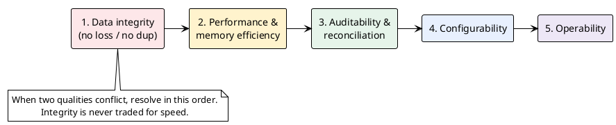

# 07 — Non-Functional Requirements

> Part of the [[00-index|baasparse BRS]]. Previous: [[06-functional-requirements]]  ·  Next: [[08-data-and-configuration]]

Non-functional requirements use `BR-NFR-<NNN>`. **Performance and memory efficiency are
the sponsor's top priority** and are treated as first-class, testable requirements — not
aspirations.

## 7.1 Performance & memory efficiency — the top priority

| ID | Priority | Requirement |
|----|:--------:|-------------|
| BR-NFR-001 | M | The engine MUST process input using **streaming / bounded-buffer** techniques; memory consumption MUST be a function of configured concurrency and buffer sizes, **not of input file size**. Processing a 10 GB file MUST NOT require ~10 GB of memory. Correlation/aggregation working sets are held in PostgreSQL, not memory (`BR-COR-006`), so the in-memory footprint stays bounded even for collating pipelines. |
| BR-NFR-002 | M | The engine MUST operate within a **configurable memory budget** and apply **backpressure** rather than allocating unbounded buffers when downstream/stages are slow. |
| BR-NFR-003 | M | Per-record processing MUST avoid unnecessary allocations and copies on the hot path (favouring reuse/pooling) so that throughput is CPU-bound, not GC-bound. |
| BR-NFR-004 | S | The engine SHOULD exploit **concurrency** (parallel files/records/stages) to scale throughput on multi-core hosts, with configurable degrees of parallelism. |
| BR-NFR-005 | M | The engine MUST have a **defined v1 volume/throughput/latency envelope** that sizing and the "single PostgreSQL primary is sufficient" judgement (`BR-NFR-024`) are validated against — otherwise "small-to-medium" and "sufficient" are undefined. Confirming the concrete figures is a **design-gating deliverable** (Open Q1), but the BRS fixes the **tier the envelope targets: tier‑3 and tier‑2 operators only** (tier‑1 is explicitly future, [[10-roadmap]]). *Illustrative order-of-magnitude (to be confirmed, not contractual):* aggregate ingest on the order of **tens to a few hundred million records/day**, sustained peaks in the **low tens of thousands of records/sec** cluster-wide, files up to **multi-GB**, across a handful of instances. The engine SHOULD sustain a **defined baseline throughput/core** (e.g. ≥ X thousand records/sec/core for DSV/fixed; ASN.1 lower) provable in a **repeatable benchmark**, and sizing SHOULD show headroom against the envelope on the target hardware. If a prospective deployment exceeds this envelope, it is a **tier‑1 case deferred to v2/future** (`ASM-17`, `R30`), not a v1 sizing exercise. |
| BR-NFR-006 | S | Memory-heavy stateful stages (correlation, aggregation, dedup) SHOULD be **bounded and spillable to PostgreSQL** — held as the canonical working set (`BR-COR-006`) or dedup-key store (`BR-DUP-002`) — so that state size does not blow the memory budget; these stores SHOULD be prunable/partitioned by retention or window close. |
| BR-NFR-007 | S | Throughput SHOULD **degrade gracefully** (via backpressure/queueing) under overload rather than failing or OOM-ing. |
| BR-NFR-008 | M | Processing MUST be **near-real-time / low-latency**: a complete, available file MUST begin processing within a small, configurable delay of arrival, and the service runs **continuously**. On a **shared/networked file area** the detection floor is set by the **directory-scan interval** (`BR-COL-012`) — cross-host `inotify` is not reliable — so the scan interval MUST be configurable and set to meet the agreed latency target; "real-time" here means *short-poll near-real-time*, not sub-second event delivery. During a **declared catch-up/backfill** (`BR-OPS-013`) this latency target is **explicitly relaxed and reported separately**, so a backlog drain does not read as an SLA breach. |
| BR-NFR-009 | M | **Raw file bytes MUST NOT be persisted in PostgreSQL** — files are streamed from the shared disk on demand. The **only record data persisted** is the **bounded canonical working set of open correlation/aggregation windows** (`BR-COR-006`), dropped once its aggregate is emitted; every other stage streams record content without persisting it. Otherwise only metadata, references, keys, counts, and state are stored. This bounds database size and reinforces the memory guarantee. |

## 7.2 Reliability, integrity & recovery

| ID | Priority | Requirement |
|----|:--------:|-------------|
| BR-NFR-010 | M | **Zero record loss:** no input record may be lost. Every record is delivered, discarded, or suspended — always accounted for (ties to `BR-REC-*`). |
| BR-NFR-011 | M | **No unintended duplication:** normal operation, retries, and crash-recovery MUST NOT produce downstream duplicates (idempotency + dedup). |
| BR-NFR-012 | M | The engine MUST recover from **abrupt termination** (crash/kill/power loss) to a consistent state using durably persisted progress, with no manual data repair required for the common case. |
| BR-NFR-013 | S | Processing progress SHOULD be **checkpointed** at a granularity that bounds re-work after a crash. |
| BR-NFR-014 | S | Transient downstream failures SHOULD be retried with backoff; permanent failures SHOULD go to suspense (ties to `BR-ERR-007`). |
| BR-NFR-015 | M | The service MUST remain **available despite the loss of a single instance or server**: surviving instances continue processing, and files claimed by the failed instance are taken over (`BR-HA-004`). No single point of failure in the application tier. |
| BR-NFR-016 | M | The engine's state store MUST survive a database-node loss via **PostgreSQL streaming replication** (`BR-HA-006`); the engine MUST **reconnect and resume against a promoted primary automatically**. In v1, replication MAY be **asynchronous**, so a database failover MUST NOT cause **silent** loss: any file whose most-recent DB state was not yet replicated at failover MUST be made good by the **startup DB↔disk consistency reconciliation** (`BR-NFR-017`) — recovered from its **on-disk completion marker** or safely reprocessed — so recovery degrades to *bounded, reconcilable re-work*, never lost records. The replication lag that defines this bound MUST be **observed** — exposed as a metric and alerted on threshold (`BR-OPS-016`) — so the bound is real, not assumed. Tightening this to a formal **RPO = 0** on local failover is the v2 upgrade `BR-NFR-018`. |
| BR-NFR-018 | M *(v2)* | **(v2)** **Formal, failure-domain-matched recovery objectives.**  • **Local database failover** (local standby promoted): the local standby runs in **synchronous-commit** mode → **RPO = 0**, so failover loses **zero committed transactions** and eliminates even the reconcilable re-work v1 tolerates.  • **Disaster / whole-site failover** (remote DR standby promoted): the DR standby replicates **asynchronously** (to avoid a WAN commit-latency penalty), carrying a **small, explicitly bounded RPO** (design target, e.g. ≤ a few seconds), file-level-bounded by the disk markers + reconciliation (`BR-NFR-017`).  • **RTO** has a stated target achievable via automated failover (`BR-HA-006`). **v1 seam:** v1 already persists on-disk completion markers and runs the startup reconciliation (`BR-NFR-017`, `BR-COL-009`), so v2 is a **deployment/configuration change** (enable `synchronous_commit` on the local standby, set RPO/RTO targets) — **no change to the engine's persistence or recovery logic**. |
| BR-NFR-017 | M | On startup and **after a database restore**, the engine MUST run a **state/disk consistency reconciliation** — comparing processed-file records against the files actually present in input/in-progress/done/archive and their **on-disk completion markers** (`BR-COL-009`) — and MUST reconcile divergences **safely**: files present-and-done on disk but not-done in a restored database are recovered from their markers (**not reprocessed**); database references to files no longer on disk are flagged/alerted; unrecognised files on disk are treated as new input. The check MUST be **single-owner** (claimed via `BR-HA-003`) or idempotent, and MUST NOT itself cause loss or duplication. State DB and shared file area are assumed backed up as a **coordinated pair** (`ASM-12`). |
| BR-NFR-019 | M | **Fail-closed on loss of the state store.** `BR-NFR-016` covers *failover* (reconnect to a promoted primary); this covers the window in which **no PostgreSQL primary is reachable at all** (outage, or failover still in progress). The engine can then neither claim files, dedup, checkpoint, append audit, nor record delivery — so it MUST **fail closed**: stop claiming/collecting new files, quiesce in-flight work at the last safe checkpoint (`BR-NFR-013`), and MUST NOT deliver output whose delivery cannot be durably recorded — applying backpressure rather than proceeding unrecorded (integrity over liveness, §7.8). It MUST retry/reconnect with backoff and **resume automatically** once a primary is reachable, with no manual repair for the common case (`BR-NFR-012/016`). Because alarms are DB-persisted (`BR-OPS-008/011`), a state-store outage is precisely the condition the alarm store **cannot record** (`R34`): the degraded state MUST therefore remain visible **independently of the database** — the per-instance **health/readiness endpoints** (`BR-OPS-009`) MUST report it (readiness *not-ready*, a distinct degraded status and metric), and the engine SHOULD additionally attempt **best-effort email alerting from in-memory state**, journaling the alarm into PostgreSQL once connectivity returns. |

## 7.3 Scalability & capacity

| ID | Priority | Requirement |
|----|:--------:|-------------|
| BR-NFR-020 | M | The engine MUST scale **horizontally** by running **multiple instances across multiple Linux servers**, coordinating via PostgreSQL and a shared file area (`BR-HA-*`); throughput SHOULD grow roughly with instance count until shared-storage/DB limits are reached. Instance-to-database connections SHOULD be **pooled (e.g. via PgBouncer)** so instance count does not exhaust database connections. |
| BR-NFR-021 | S | Each instance SHOULD also scale **vertically** (more cores/memory) with near-linear throughput up to host limits, via internal concurrency. |
| BR-NFR-022 | S | State stores (dedup keys, correlation/aggregation state, audit) SHOULD be prunable so storage growth is **bounded by retention**, not unbounded. |
| BR-NFR-023 | S | Reference-data and lookup stores SHOULD scale to **large data sets** (e.g. tens of millions of rows) with **indexed, bounded-latency** lookups and **online refresh** that does not stall the pipeline (`BR-ENR-003/004`); their size MUST NOT count against the per-record memory budget (`BR-NFR-002`), being served from PostgreSQL with a bounded hot cache. |
| BR-NFR-024 | M | **Known scaling ceiling — the single PostgreSQL primary is the cluster's shared write bottleneck.** File claims, dedup-key writes (the highest-write-rate store, `BR-DUP-002`), the collation working set, audit, and reconciliation all commit to one primary. For the **v1 target (small-to-medium operator)** this is an accepted, sufficient design, mitigated by **time-partitioning high-churn tables** (`BR-DUP-002`), **partition-drop expiry** rather than row deletion, connection **pooling** (`BR-NFR-020`), and keeping high-volume feeds in **streaming (non-collating) mode** (`BR-CFG-010`); the dedup **read-path pre-filter** (`BR-NFR-025`) is a v2 throughput upgrade. Scaling **beyond** the single-primary write ceiling — toward **tier-1 volumes** (partitioned/sharded state, an external high-throughput dedup store, or write-offload) — is an explicit **v2/future** work item ([[10-roadmap]], `R30`), **not solved in v1 and not committed** (no tier-1 customer is in scope). **Honesty note (revised):** the modular pipeline (`BR-NFR-030/031`) lets the *format-agnostic data path* survive that growth, but breaking the write ceiling is a **genuine re-architecture of the shared state/audit layer** — cross-primary sharding does not preserve the single-transaction atomic emit (`BR-COR-006`), and the serial tamper-evident audit chain (`BR-AUD-004`) does not shard trivially. So v1 keeps the pipeline extensible and defers the write-path scale-out as a **future project**, rather than claiming it is a mere configuration flip. Within the **v1 tier‑3/tier‑2 envelope** (`BR-NFR-005`, `ASM-17`) the single primary is sufficient with the stated mitigations, and that is the scope v1 commits to. |
| BR-NFR-025 | S *(v2)* | **(v2)** **Dedup read-path pre-filter** — front the dedup lookup with a **bounded in-memory pre-filter** (probabilistic set / recent-key cache) that answers *definitely-new* cheaply and confirms only *possible-duplicate* candidates against PostgreSQL (analogous to the enrichment hot cache, `BR-ENR-003`), so dedup does not become the throughput bottleneck at higher volumes — never producing a false *duplicate* verdict (any positive is DB-confirmed). **v1 seam:** v1 dedup is a **correct** DB-backed key check (`BR-DUP-001..004`) behind a stable lookup interface; v2 inserts the cache **in front of that interface with identical semantics** — a pure performance change, no effect on correctness or on-disk state. |

## 7.4 Maintainability & modularity (the "Modulith")

| ID | Priority | Requirement |
|----|:--------:|-------------|
| BR-NFR-030 | M | Each instance MUST be a **single deployable process** (the Modulith) composed of **well-bounded internal modules** (collection, decode, transform, distribute, config, audit, etc.) with clear interfaces; horizontal scale is achieved by running **many such instances**, not by splitting the process. |
| BR-NFR-031 | S | Module boundaries SHOULD be clean enough that a module (e.g. a decoder or a distribution target) can be **added or replaced** without pervasive change — as demonstrated by the v1 file and RDBMS targets sharing one Destination seam, and enabling future targets/formats. |
| BR-NFR-032 | S | New **decoders**, **transformations**, and **distribution targets** SHOULD be addable via well-defined extension points. |
| BR-NFR-033 | M | The **management plane** (GUI, API, user/config services) and the **data plane** (record processing) MUST be internally separated so that management activity **does not degrade mediation throughput or its memory budget**, and a fault in one does not stall the other — within the single Modulith process. |
| BR-NFR-034 | S | The GUI and API MUST share **one service/authorization layer** so behaviour and access control stay identical across channels (`BR-USR-005`). |

## 7.5 Observability & operability

| ID | Priority | Requirement |
|----|:--------:|-------------|
| BR-NFR-040 | M | The engine MUST expose **metrics** (throughput, latency, memory, suspense, backlog) via a **Prometheus-compatible endpoint** and **health** (liveness/readiness) in a form consumable by standard monitoring (`BR-OPS-009`). |
| BR-NFR-041 | M | The engine MUST emit **structured logs** correlated by the same identifiers used in the audit trail. |
| BR-NFR-042 | S | Operational state (running/paused, per-source backlog) SHOULD be queryable at any time (ties to `BR-OPS-*`). |

## 7.6 Security & data protection

| ID | Priority | Requirement |
|----|:--------:|-------------|
| BR-NFR-050 | M | Access to PostgreSQL (config, audit, suspense, state) MUST be **authenticated**; credentials MUST NOT be hard-coded and MUST be supplied via secure configuration/secrets. Because the state store carries **subscriber-identifying canonical records** in the collation working set (`BR-COR-006`) — the same sensitivity argument that bans plain FTP (`BR-RMT-001`) — database connections MUST support **TLS** and TLS MUST be the **default**; disabling it is permitted only as an **explicit, audited configuration choice** for links confined to a protected segment (same-host/loopback or a dedicated encrypted path), consistent with the RDBMS load-target rule (`BR-DST-019`). |
| BR-NFR-051 | S | Usage records may contain **subscriber-identifying data**; the engine SHOULD support configurable **masking/redaction** of sensitive fields in logs and, where required, in output (see optional regulatory features, `BR-CMP-*`). |
| BR-NFR-052 | M | Every management action (GUI or API) MUST be **authenticated, authorised via RBAC, and attributable** to a user identity in the audit trail (`BR-USR-*`, `BR-AUD-*`). |
| BR-NFR-053 | M | The **GUI and REST API MUST be served over TLS/HTTPS**; session cookies/tokens MUST be protected (secure/HTTP-only, expiry) and the API MUST guard against common web risks (auth bypass, injection, CSRF for the GUI). |
| BR-NFR-054 | M | All credentials/keys (PostgreSQL state store, SFTP/FTPS, SMTP, RDBMS load target, **API tokens** `BR-USR-007`) MUST be sourced from a **defined secrets mechanism** (environment / secret-manager, or a restricted-permission file) — never hard-coded or stored in plaintext config — and MUST NOT appear in **exported configuration** (`BR-CFG-011`) or in logs. Because these secrets guard **subscriber-PII-bearing** infrastructure, the **documented minimum bar** is a secrets file that is **OS-permission-restricted AND resident on an encrypted volume** (delegated deployment-layer at-rest encryption, `BR-NFR-055`, `ASM-5`) — a plain-permission file alone is **not** acceptable. The mechanism MUST support **rotation without redeploy** for every credential type (the scheduled SFTP/FTPS key rotation of `BR-RMT-011` is the model), so a leaked or expiring secret can be replaced live. |
| BR-NFR-055 | C | The engine COULD support encryption-at-rest expectations for suspense/audit/credential stores and the **collation working set** (which may hold subscriber-identifying canonical records, `BR-COR-006`) where mandated. As core PostgreSQL has no built-in transparent data encryption, this is delegated in v1 to the **deployment layer** — OS/volume-level encryption (e.g. LUKS/dm-crypt) or an encrypting storage array under the PostgreSQL data directory (and the shared file area). |

## 7.7 Portability & environment

| ID | Priority | Requirement |
|----|:--------:|-------------|
| BR-NFR-060 | M | The engine MUST be delivered as a **self-contained Go binary** targeting **Linux only** (it relies on Linux facilities such as `inotify`); other operating systems are out of scope. |
| BR-NFR-061 | S | Configuration and runtime parameters (shared paths, budgets, PostgreSQL connection, instance identity) SHOULD be externalised (env/config), not compiled in. |
| BR-NFR-062 | M | The engine MUST support **on-premises, per-tenant** deployment (one tenant per deployment); it does not need to be multi-tenant. |

## 7.8 Quality attribute priorities (for design trade-offs)

