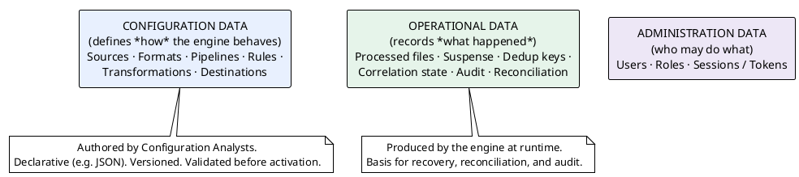

# 08 — Conceptual Data & Configuration Model

> Part of the [[00-index|baasparse BRS]]. Previous: [[07-non-functional-requirements]]  ·  Next: [[09-assumptions-constraints-dependencies]]

This section defines the **conceptual** information model — the business entities the
engine reasons about and persists in **PostgreSQL** (a primary with streaming-replication
standby(s), including a DR standby, shared by all instances). It is intentionally
technology-neutral (no table schemas, indexes, or field types); those belong in the design
docs. Its job is to give stakeholders a shared vocabulary and confirm the model is complete.

> **Content boundary:** PostgreSQL holds **metadata, references, keys, counts, state,
> config, and audit** — and **never raw file bytes**. The one *record*-content exception is
> the **bounded canonical working set of open correlation/aggregation windows**
> (`BR-COR-006`), dropped once its aggregate is emitted. All other record content lives on
> the shared file area and is streamed from disk on demand (`BR-NFR-009`).

## 8.1 Two kinds of data



## 8.2 Conceptual entity model

```plantuml
@startuml conceptual-model
!theme plain
hide circle
hide empty methods
skinparam linetype ortho
skinparam entity {
  BackgroundColor #FAFAFA
  BorderColor #555
}

' ---- Configuration domain ----
entity "Source" as SRC {
  identity
  --
  name
  input location (local/shared dir)
  in-progress directory
  done directory
  file selection pattern
  collection policy
  zero-record-file policy
  effective_from / end_date
}
entity "Remote Endpoint" as RMT {
  identity
  --
  protocol: SFTP|FTPS
  host, port, remote path
  credentials/key ref
  host-key/cert trust
}
entity "Archive Policy" as ARC {
  identity
  --
  age threshold (X days)
  compression format
  grouping / naming
  local retention
  target endpoint ref
}
entity "Format Definition" as FMT {
  identity
  --
  kind: ASN.1 | JSON | XML | DSV | Fixed
  structure / field spec
  version
  effective_from / end_date
}
entity "Pipeline" as PIPE {
  identity
  --
  ordered stages
}
entity "Correlation Group (v2)" as CG {
  identity
  --
  name
  shared correlation key
  participating pipelines/sources
  completion trigger & policy
}
entity "Validation Rule Set" as VAL {
  identity
  --
  rules
}
entity "Correlation Rule" as COR {
  identity
  --
  key, window, policy
}
entity "Dedup Rule" as DUP {
  identity
  --
  key, retention window
}
entity "Enrichment Rule" as ENR {
  identity
  --
  lookup source, on-miss policy
}
entity "Transformation Rule Set" as TRN {
  identity
  --
  projection, rename, convert,
  derive, output format
}
entity "Destination" as DST {
  identity
  --
  kind: File | RDBMS (both v1)
  output location & format (file)
  connection · target table ·
    field→column map (RDBMS)
  routing rules
}
entity "Reference Data" as REF {
  identity
  --
  lookup tables
  effective-from / effective-to
}

' ---- Administration / identity domain ----
entity "User" as USR {
  identity
  --
  username
  credential (hashed)
  status (active/disabled)
  role ref(s)
}
entity "Role" as ROLE {
  identity
  --
  name
  permissions
}
entity "Session / Token" as SESS {
  identity
  --
  user ref
  kind (GUI session | API token)
  issued-at, expiry
}

' ---- Operational domain ----
entity "Processed File" as PF {
  identity
  --
  **file UID** (gap-free)
  source, name, checksum, seq
  status (fetched/in-progress/
    done/suspended/quarantined)
  record count (incl. 0)
  processing attempts
  on-disk completion marker ref
  timestamps, owning instance
  reconciliation totals
}
entity "Suspense Record" as SUS {
  identity
  --
  source file ref, stage,
  reason code, payload/pointer,
  status (open/reprocessed/abandoned)
}
entity "Dedup Key Entry" as DKE {
  identity
  --
  key value, first-seen,
  expiry
}
entity "Correlation / Aggregation State" as CST {
  identity
  --
  correlation/group key,
  canonical member records (open),
  aggregate accumulators,
  window deadline / completion trigger,
  contributing count
}
entity "Audit Event" as AUD {
  identity
  --
  timestamp, correlation id,
  event type, context (append-only)
}
entity "Reconciliation Summary" as RECS {
  identity
  --
  scope (file/stream/period)
  in, out, suspended,
  discarded, duplicates,
  contributed-to-aggregates,
  open (in-flight),
  adjustments (replay),
  quarantined
}
entity "Fetch Registry" as FRG {
  identity
  --
  remote endpoint, remote name,
  checksum, fetched-at
  (already-fetched guard)
}
entity "File Claim / Lease" as CLM {
  identity
  --
  file ref, owning instance,
  lease acquired-at / expires-at,
  processing attempts,
  status (held/released/expired)
}
entity "Scheduled-Job Lease (v2)" as SJL {
  identity
  --
  job type (fetch/archive/liveness),
  scope (e.g. source ref),
  owning instance,
  lease acquired-at / expires-at,
  status (held/released/expired)
}
entity "Config Edit Lock" as CEL {
  identity
  --
  config item ref,
  locked-by (user), acquired-at,
  idle/expiry deadline
}
entity "Delivery Record" as DLV {
  identity
  --
  output file ref, destination,
  format, delivered-at,
  state (pending/written/
    written-unconfirmed/
    delivered/resent/failed)
}
entity "Alarm" as ALM {
  identity
  --
  type, severity, source ref,
  raised-at,
  state (open/acknowledged/
    resolved), resolved-by
}
entity "Archive Run" as ARN {
  identity
  --
  policy ref, files included,
  archive name, size,
  destination, outcome
}

' ---- Relationships ----
SRC ||--o| RMT : fetches via
SRC ||--o| ARC : archived by
ARC ||--|| RMT : offloads via
SRC ||--|| FMT : uses
SRC ||--|| PIPE : processed by
PIPE ||--o{ VAL : includes
PIPE ||--o| COR : includes
PIPE ||--o| DUP : includes
PIPE ||--o{ ENR : includes
PIPE ||--|| TRN : includes
PIPE ||--o{ DST : routes to
ENR }o--o{ REF : reads
PIPE }o--o| CG : may feed (cross-source, v2)
CG ||--o{ CST : maintains (v2)

SRC ||--o{ PF : produces
PF ||--o{ SUS : may raise
PF ||--|| RECS : summarised by
DUP ||--o{ DKE : maintains
COR ||--o{ CST : maintains
RMT ||--o{ FRG : tracked by
ARC ||--o{ ARN : produces
PF ||--o| CLM : claimed via
PF ||--o{ DLV : delivered as
ALM ||--o{ AUD : lifecycle recorded in
USR }o--|| ROLE : granted
USR ||--o{ SESS : authenticates via
PF ||--o{ AUD : recorded in
SUS ||--o{ AUD : recorded in
ARN ||--o{ AUD : recorded in
USR ||--o{ AUD : actions recorded in
@enduml
```



## 8.3 Entity glossary (conceptual)

| Entity | Kind | Meaning |
|--------|------|---------|
| **Source** | Config | A named origin of input files (a watched local directory + done directory + selection + collection policy; optional remote fetch). |
| **Remote Endpoint** | Config | A remote host connection (SFTP/FTPS): protocol, host, path, credentials, trust — used for fetching input and/or offloading archives. |
| **Archive Policy** | Config | Rules for archiving "done" files: age threshold, compression format, grouping/naming, local retention, and target endpoint. |
| **Format Definition** *(a.k.a. File-Structure Model)* | Config | How to decode a source's records: kind (ASN.1/JSON/XML/DSV/Fixed) + structure. Stored as **temporal, versioned config** (`effective_from`/`end_date`, `BR-CFG-009`); v1 decodes under the **current-active** version, and **event-time-based version selection is v2** (`BR-DEC-012`). This is what the GUI's **file-structure modelling** (`BR-UI-004`) produces. |
| **Pipeline** | Config | The ordered stages applied to a source's records. |
| **Correlation Group** *(v2)* | Config | A named **cross-source correlation scope** (`BR-COR-009`, **v2**): a shared correlation key that **multiple source pipelines feed** their canonical records into (e.g. call legs from different MSCs), emitting under one completion policy. It reuses v1's **source-agnostic keyed working set** (`BR-COR-006/008`) unchanged — the seam that lets v2 add cross-feed correlation without re-architecting (§10.6). |
| **Validation Rule Set** | Config | Declarative rules deciding valid vs suspended vs discarded. |
| **Correlation Rule** | Config | How partial/related records are joined (key, window, completion policy). |
| **Dedup Rule** | Config | Key + retention window defining duplicate detection. |
| **Enrichment Rule** | Config | Lookup against Reference Data, with on-miss behaviour. |
| **Transformation Rule Set** | Config | Declarative projection/rename/convert/derive + target output format. |
| **Destination** | Config | Where/how output is delivered — **file or RDBMS load, both v1** (RDBMS carries connection, target table, and field→column mapping to a **client-owned** database) + routing. |
| **Reference Data** | Config | Lookup tables used by enrichment. |
| **Processed File** | Operational | The record of one input file's journey and reconciliation totals, including its status (incl. **quarantined**, `BR-COL-017`), **processing-attempt count**, and a reference to its **on-disk completion marker** for DB/disk reconciliation (`BR-NFR-017`). |
| **Suspense Record** | Operational | A quarantined record with stage + reason, awaiting reprocess/abandon. |
| **Dedup Key Entry** | Operational | A remembered key used to catch duplicates across files/restarts. |
| **Correlation / Aggregation State** | Operational | The **canonical working set** for open collation windows: pending member records, aggregate accumulators, group/correlation key, completion trigger/deadline, and contributing count. Bodies are dropped on emit; counts/references retained (`BR-COR-006`). |
| **Audit Event** | Operational | Append-only trail of significant events. |
| **Reconciliation Summary** | Operational | Counts proving completeness for a file/stream/period. |
| **Fetch Registry** | Operational | Record of already-fetched remote files, guarding against re-download/re-processing. |
| **File Claim / Lease** | Operational | The distributed lock by which one instance owns a file; expires on instance failure so another can take over (`BR-HA-003/004`). |
| **Scheduled-Job Lease** *(v2)* | Operational | The same claim/lease mechanism applied to **periodic/singleton cluster jobs** — remote-fetch polling (per source), archiving, feed-liveness — so exactly one instance runs each and it fails over automatically (`BR-HA-010`, `BR-RMT-012`, **v2**). In v1 these jobs run on a **nominated instance** with idempotent backstops; the lease (already used for window emit, `BR-COR-008`) replaces the nomination in v2 (§10.6). |
| **Config Edit Lock** | Administration | A short-lived lock taken when a user opens a config item for editing, blocking concurrent edits and released on save/cancel/idle-timeout (`BR-CFG-012`, `BR-UI-011`). |
| **Delivery Record** | Operational | Tracks an output file's delivery state per destination; a Processed File is "done" only when all its Delivery Records succeed (`BR-DST-009/010`). Where a destination has a **receipt callback** (`BR-DST-016`), a written file stays **written-unconfirmed** until the consumer confirms full receipt. |
| **Alarm** | Operational | A raised operational issue with an **open → acknowledged → resolved** lifecycle, resolvable via a secure email callback link (`BR-OPS-011`). |
| **Archive Run** | Operational | Record of one archiving operation: files included, archive name/size, destination, outcome. |
| **User** | Administration | A person or system account that authenticates to the GUI/API; holds role(s) and a securely hashed credential. |
| **Role** | Administration | A named set of permissions granted to users (RBAC), e.g. Administrator/Configurer/Operator/Viewer. |
| **Session / Token** | Administration | A GUI login session or API access token, tied to a user, with issue/expiry. |

## 8.4 Illustrative transformation configuration (declarative)

Non-binding illustration of the sponsor's "use JSON to describe the transformation"
intent — **shape only**, final schema is a design deliverable:

```json
{
  "stream": "voice-cdr-eu",
  "fetch": {
    "protocol": "sftp",
    "host": "cdr-gw.example.net", "port": 22,
    "remotePath": "/export/voice", "match": "*.ber",
    "auth": { "user": "baasparse", "keyRef": "secret://sftp/voice-key" },
    "hostKeyRef": "secret://sftp/voice-hostkey",
    "schedule": "*/5 * * * *",
    "onFetched": "moveRemote:/export/voice/collected"
  },
  "source": { "dir": "/shared/in/voice", "match": "*.ber*", "format": "asn1", "asn1Schema": "voice_cdr_v3",
              "inProgressDir": "/shared/inprogress/voice",
              "doneDir": "/shared/done/voice",
              "decompress": "auto",
              "integrity": { "mode": "signature", "keyRef": "secret://pgp/voice-partner" },
              "headerTrailer": { "trailerCountField": "recordCount" },
              "zeroRecordFile": { "accept": true, "emitEmptyOutput": true } },
  "validate": [
    { "field": "callingNumber", "required": true },
    { "field": "duration", "type": "integer", "min": 0 }
  ],
  "dedup": { "key": ["recordId"], "retention": "72h" },
  "enrich": [
    { "lookup": "country_by_prefix", "in": "callingNumber", "out": "originCountry", "onMiss": "blank",
      "effectiveDated": true }
  ],
  "aggregate": { "groupBy": ["subscriberId", "event_date"], "functions": { "duration": "sum", "*": "count" },
                 "completeOn": { "window": "15m" } },
  "transform": {
    "normalise": { "callingNumber": "e164", "calledNumber": "e164", "startTime": { "tz": "Africa/Johannesburg" } },
    "select": ["recordId", "callingNumber", "calledNumber", "duration", "originCountry"],
    "rename": { "callingNumber": "a_number", "calledNumber": "b_number" },
    "convert": { "duration": { "from": "seconds", "to": "minutes", "round": "ceil" } },
    "derive": { "event_date": { "expr": "toDate(startTime, 'yyyy-MM-dd')" } }
  },
  "output": [
    { "to": "billing", "format": "dsv", "delimiter": "|", "dir": "/shared/out/billing", "roll": { "maxRecords": 100000 } },
    { "to": "fraud", "format": "json", "dir": "/shared/out/fraud" },
    { "to": "dwh", "format": "fixed", "layout": "dwh_voice_v2", "dir": "/shared/out/dwh" }
  ],
  "archive": {
    "olderThanDays": 7,
    "compression": "tar.gz",
    "group": "perDay",
    "nameTemplate": "voice-cdr-eu_{yyyyMMdd}.tar.gz",
    "target": { "protocol": "ftps", "host": "archive.example.net", "remotePath": "/archive/voice",
                "auth": { "user": "archiver", "passwordRef": "secret://ftps/archive" } },
    "localRetention": { "deleteAfterUpload": true },
    "schedule": "0 2 * * *"
  }
}
```

## 8.5 Modelling principles

- **Config vs operational separation** keeps the audit/reconciliation stores immutable
  and the config stores versioned and validatable.
- **Everything reconciles to a Processed File**, giving Revenue Assurance a single anchor
  for completeness (`BR-REC-*`).
- **Completeness is input conservation, not equal counts** — correlation/aggregation
  collapse N inputs into one output, so a collating stream emits fewer records than it
  ingests *by design*; each aggregate carries a **contributing count** and open windows are a
  visible **in-flight** state, so inputs still reconcile and `in ≠ out` never hides loss
  (`BR-REC-001/007`, §5.6).
- **Stateful stages persist bounded state** (Dedup Key Entry, Correlation/Aggregation
  State) in PostgreSQL so the memory budget holds and recovery is possible (`BR-NFR-006`,
  `BR-NFR-012`). High-churn, retention-bounded stores (dedup keys, audit) SHOULD be
  **time-partitioned** so expiry is a partition **drop**, not row-by-row deletion
  (`BR-DUP-002`).
- **No raw bytes in PostgreSQL** — only references, keys, counts, and state, plus the one
  exception of the **canonical working set for open correlation/aggregation windows**
  (`BR-COR-006`), dropped on emit; all other record content is streamed from the shared disk
  (`BR-NFR-009`). This is why suspense reprocessing is *as-is* and why a file with open
  suspense must be retained on disk (`BR-ERR-008`).
- **Shared state across instances** — File Claims/Leases, dedup keys, correlation state,
  suspense, and audit are all in shared PostgreSQL, so any instance behaves identically and a
  failed instance's work can be taken over (`BR-HA-*`). The File Claim/Lease is realised as
  a claims table worked with `SELECT … FOR UPDATE SKIP LOCKED` plus a heartbeat-renewed
  lease, so exactly one instance owns a file and a crashed owner's claim is reclaimable. The
  **same claim/lease mechanism** governs collation-window emit (`BR-COR-008`) in v1 and, in
  **v2**, periodic/singleton jobs — fetch polling, archiving, feed-liveness — via a
  **Scheduled-Job Lease** (`BR-HA-010`, `BR-RMT-012`). In **v1** those jobs run on a
  **nominated instance** with idempotent backstops (already-fetched guard, verify-before-prune),
  so the v2 lease is a drop-in upgrade, not a re-design (§10.6).
- **The correlation working set is source-agnostic** — keyed by correlation key, not bound to
  the ingesting source. v1 uses this for **single-source** correlation/aggregation; the same
  structure is the **seam** for **v2 cross-source correlation** (a **Correlation Group**,
  `BR-COR-009`), where several pipelines feed one shared, cluster-owned working set so
  multi-leg/multi-feed events (e.g. call legs from different MSCs) correlate — reusing the v1
  persistence/claim/emit machinery unchanged (§10.6).
- **The single PostgreSQL primary is the shared write bottleneck** — sufficient for the v1
  small-to-medium target with partitioning, partition-drop expiry, pooling, and streaming-mode
  feeds (the dedup read-path pre-filter and write-path scale-out are **v2**, `BR-NFR-024/025`);
  scaling past it toward tier-1 volumes is explicit **v2/future** work (`R30`, [[10-roadmap]])
  that must not require re-architecting the pipeline — the primary v1→v2 seam (§10.6).
- **Disk is a recoverable source of completion state** — each "done" file carries an
  on-disk completion marker (`BR-COL-009`), so a database restored behind the file area is
  reconciled from disk rather than by reprocessing (`BR-NFR-017`); state DB and file area are
  backed up as a coordinated pair (`ASM-12`).
- **Effective-dating** on reference data and rules lets scheduled changes activate by date
  without redeploying (`BR-ENR-005`).
- **Config is never physically deleted** — every configuration record carries
  `effective_from` / `end_date`; "deleting" or superseding sets `end_date`, keeping full
  history for inspection, restore, and effective-dating (`BR-CFG-009`).
- **Draft → published lifecycle** — configuration can be edited and then **published to
  production in one action** (`BR-CFG-008`), after which all instances **hot-reload** the
  new active version (`BR-CFG-007`).
- **Done means fully delivered** — a Processed File reaches `done` only when every fan-out
  endpoint has a successful Delivery Record; unavailable destinations keep it `in-progress`
  (store-and-forward, `BR-DST-010`).
- The model is **format-agnostic after decode**, which is what lets a **file or RDBMS
  Destination** (both v1) — and future targets — plug in without touching upstream stages.
  For an RDBMS target, a record is "delivered" only when its **batch commits** (`BR-DST-013`,
  `BR-REC-009`); a rollback keeps the source file in-progress under store-and-forward.
