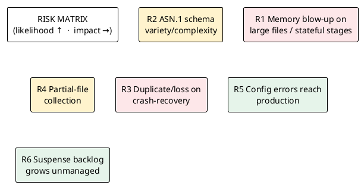

# 09 — Assumptions, Constraints, Dependencies & Risks

> Part of the [[00-index|baasparse BRS]]. Previous: [[08-data-and-configuration]]  ·  Next: [[10-roadmap]]

## 9.1 Constraints (fixed — not open for design)

| ID | Constraint | Source |
|----|-----------|--------|
| CON-1 | Implemented **entirely in Go**. | Sponsor |
| CON-2 | Each instance is a **"Modulith"** (modular monolith), not microservices; the system runs as **multiple cooperating instances across multiple servers**. | Sponsor |
| CON-3 | **PostgreSQL** hosts/persists all internal data structures (config, state, audit, suspense); declarative rule bodies are stored as `JSONB`. | Sponsor |
| CON-4 | **Performance and memory efficiency are the top priority**; streaming, bounded memory. | Sponsor |
| CON-5 | v1 acquires input **locally** and via **remote fetch over SFTP/FTPS**; other transports (S3/Kafka/streaming) are out of scope. | Sponsor |
| CON-6 | v1 must support **ASN.1, JSON, XML, DSV, and fixed-position** input formats. | Sponsor |
| CON-7 | Transformations must be **configurable/declarative (e.g. JSON)**. | Sponsor |
| CON-8 | **v1** supports **RDBMS (e.g. PostgreSQL)** as a load/distribution target — a client-owned destination alongside file outputs (originally planned for v2, pulled forward). | Sponsor |
| CON-9 | Processed files move to a configurable **"done" directory**; **automatic archiving** (compress + remote offload of files older than X days) is configurable. | Sponsor |
| CON-10 | The administration **GUI is server-rendered with HTMX, hosted inside the Go application** (no separate front-end stack/deployment). | Sponsor |
| CON-11 | A **REST API** must expose management/control so external systems can operate baasparse; GUI and API share one auth/RBAC model. | Sponsor |
| CON-12 | v1 uses a **built-in user system with RBAC**; external identity providers (OIDC/LDAP/SSO) are out of scope for v1. | Sponsor |
| CON-13 | **Linux-only** (relies on Linux facilities such as `inotify`). | Sponsor |
| CON-14 | **Multiple instances across multiple servers** sharing a **common file-storage area**, coordinating file ownership via PostgreSQL — no single point of failure. | Sponsor |
| CON-15 | **Real-time / always-on** processing — files processed as soon as available, not on batch schedules. | Sponsor |
| CON-16 | **Raw file bytes are never stored in PostgreSQL** — files are streamed from the shared disk. The only *record* data persisted is the **bounded canonical working set of open correlation/aggregation windows** (`BR-COR-006`), dropped on emit. Suspended records are reprocessed **as-is** (no content editing). | Sponsor |
| CON-17 | Deployed **on-premises, per tenant** (one tenant per deployment — not multi-tenant). | Sponsor |
| CON-18 | PostgreSQL runs as a **primary with streaming-replication standby(s), including a DR standby** (automated failover, e.g. Patroni/repmgr); **email** is the v1 alerting channel. | Sponsor |
| CON-19 | **Configuration is never physically deleted** — supersession sets an `end_date` (temporal/soft-delete), retaining history for restore. | Sponsor |
| CON-20 | Files use an **"in-progress" directory** while processing and reach **"done" only after delivery to all endpoints** (store-and-forward until then). | Sponsor |
| CON-21 | Config changes **hot-reload across all instances**; a **one-click "publish to production"** promotes a pipeline. | Sponsor |

## 9.2 Assumptions

| ID | Assumption | If wrong… |
|----|-----------|-----------|
| ASM-1 | Input files are delivered **atomically/complete** before collection (rename or done-marker). | Need a stability-detection fallback (partial reads risk). |
| ASM-2 | Source systems provide a **stable, documented format** per source (ASN.1 schema, DSV layout, fixed-position map). | Cannot decode reliably; more suspense. |
| ASM-3 | A **shared file-storage area** (e.g. NFS/clustered FS) is provided, reachable by all servers, with adequate performance and correct file locking/atomic-rename semantics. | Claim coordination or throughput suffers; partial-read risk. |
| ASM-3b | Server clocks are **reasonably synchronised (NTP)** so distributed claim/lease expiry behaves correctly. | Lease expiry misfires → double-processing or stalls. |
| ASM-4 | **PostgreSQL is available, secured, sized, and administered** (backup/restore, HA failover, connection pooling) by the client's platform/DBA team. | Engine cannot persist state/audit. |
| ASM-5 | Sensitive-data handling (masking, encryption-at-rest) is **partly delegated** to the deployment — OS/volume-level encryption under the PostgreSQL data directory in v1. | Additional in-engine controls needed. |
| ASM-6 | Downstream consumers read from **local file destinations** and manage their own pickup in v1. | Additional delivery transport needed. |
| ASM-7 | Correlation/aggregation **grouping and window assignment use the record's own event-start-date/time** (`BR-COR-010`); host wall-clock time is used only for **grace-timeouts** and audit timestamps, and is NTP-synchronised (`ASM-3b`). Source records are assumed to carry a usable, parseable **event start timestamp** with enough timezone information to normalise (`BR-TRN-010`). | If records lack a reliable event timestamp, windowing/effective-dating fall back to arrival time — less accurate grouping; more tuning. |
| ASM-8 | Remote fetch/archive **hosts, credentials/keys, and paths** are provided, reachable, and stable. | Fetch/archive fails; input starves or offload stalls. |
| ASM-9 | Remote hosts expose files **atomically/completely** (or a stability/marker signal) so partial remote files are not fetched. | Corrupt downloads; more suspense. |
| ASM-10 | Disk on the engine host is sized for **local input, done, and pre-offload archive** staging. | Archiving/fetch stalls on full disk. |
| ASM-11 | For correlation/aggregation feeds, source records carry a usable **completion signal** (partial-record indicator / closing cause / sequence), or a **grace-timeout** is an acceptable proxy. | Collation relies on timeouts only → more emit-partial/suspense and tuning burden (`BR-COR-007`). |
| ASM-12 | The **state database and the shared file area are backed up as a coordinated pair**, and a restore is followed by the startup consistency check (`BR-NFR-017`). | Restore leaves DB and disk diverged; manual reconciliation needed. |
| ASM-13 | Where an RDBMS destination is configured, the **target table and its schema are provided and maintained by the client**; the engine writes per the configured mapping and does not alter the client's schema. | Load fails to suspense on schema drift (`BR-DST-014`). |
| ASM-14 | To replay an **archived** file the **operator re-adds it to disk manually** (the engine does not auto-retrieve from the archive); and where a replay is directed to **file destinations** with dedup-override, the **downstream partner is responsible for handling duplicates/superseding** per the replay marker, coordinated by the operator. | Replay of a pruned file is blocked until re-added; a downstream may double-ingest if the marker is ignored (`BR-ERR-009`). |
| ASM-15 | Where a downstream file consumer wants **confirmed** delivery (`BR-DST-016`), it provides a callback/receipt convention the engine can call or watch; absent that, delivery = *atomically written to the destination directory* (`ASM-6`). | Completeness proof stops at *written*, not *received*, for that destination. |
| ASM-16 *(v2)* | For **cross-source correlation** (`BR-COR-009`, **v2**), the feeds participating in a Correlation Group carry a **common, normalisable correlation key** for the same logical event. In **v1** (single-source correlation) this does not apply. | Cross-feed legs cannot be joined in v2; they emit as separate partials. |
| ASM-17 | v1 is sized for a **small-to-medium operator**, whose aggregate write rate fits a **single PostgreSQL primary** with partitioning/pooling (`BR-NFR-024`). | Tier-1 volumes require the v2/future write-scaling work (`R30`) before onboarding. |

## 9.3 Dependencies

| ID | Dependency | Nature |
|----|-----------|--------|
| DEP-1 | **PostgreSQL** (a primary with streaming-replication standby(s), including a **DR standby**), shared by all instances; connection pooling (e.g. PgBouncer) expected. | Runtime, hard dependency. |
| DEP-1b | **Shared file-storage area** (e.g. NFS/clustered FS) reachable by all Linux servers. | Runtime, hard dependency. |
| DEP-1c | **SMTP relay** for email alerting (incl. secure resolve-callback links). | Runtime (alerting). |
| DEP-1d | **Prometheus** (or compatible) for metrics scraping — optional but expected. | Runtime (monitoring). |
| DEP-2 | **Go 1.26+ toolchain** for build; **Linux** target hosts. | Build/runtime. |
| DEP-3 | ASN.1 **schema definitions** for each ASN.1 source. | Data/config input. |
| DEP-4 | Reference data feeds for **enrichment** lookups. | Data input (may itself be mediated). |
| DEP-5 | Host **file system** & directory conventions (input, done, archive staging) agreed with source-system owners. | Integration contract. |
| DEP-6 | **Remote SFTP/FTPS hosts** (for fetch and archive offload) + credentials/keys managed via secrets. | Runtime, integration. |
| DEP-7 | Target **RDBMS load destination (PostgreSQL)** availability & schema, where a deployment configures an RDBMS destination — a **client-owned, separate database/role** from the engine's own state store (`DEP-1`), though it MAY be the same PostgreSQL technology/cluster. | Runtime (v1), optional per deployment. |

## 9.4 Key risks

| ID | Risk | Impact | Mitigation |
|----|------|--------|------------|
| R1 | Memory blow-up on large files or unbounded correlation/dedup state | OOM, missed SLAs | Streaming (BR-NFR-001/002), bounded spillable state (BR-NFR-006), benchmarks (BR-NFR-005) |
| R2 | ASN.1 schema variety/complexity harder than expected | Delivery risk on DEC | Schema-driven decoder; start with a representative CDR structure; suspense on decode failure |
| R3 | Crash-recovery causes loss or duplication | Revenue integrity breach | Idempotent recovery + checkpointing (BR-NFR-011/012/013), cross-restart dedup (BR-DUP-002) |
| R4 | Partial/incomplete input file collected | Corrupt/failed decode | Atomic-delivery assumption + stability check (BR-COL-002) |
| R5 | Bad configuration reaches production | Wrong transforms / mis-routing | Config validation & dry-run (BR-CFG-003/006), versioning & audit |
| R6 | Suspense grows without operator action | Silent leakage | Alerts on rising suspense (BR-OPS-004), reconciliation visibility (BR-REC-002) |
| R7 | Remote fetch/offload fails (host down, auth/key expiry, network) | Input starves; archives not offloaded | Retry+backoff & alerts (BR-RMT-008, BR-ARC-008); verify-before-prune (BR-ARC-006) |
| R8 | Partial/duplicate remote download | Corrupt input or double processing | Integrity check + atomic placement (BR-RMT-004); already-fetched guard (BR-RMT-005) |
| R9 | Disk exhaustion from input/done/archive staging | Processing halts | Disposition/pruning policies (BR-COL-010, BR-ARC-007); capacity assumption ASM-10 |
| R10 | GUI/API is an attack surface (auth bypass, injection, CSRF, weak creds) | Unauthorised control/config change | TLS + RBAC + audit (BR-NFR-052/053), secure credential storage (BR-USR-004), lockout (BR-USR-008) |
| R11 | Management activity contends with the data plane | Throughput dips under admin load | Management/data-plane isolation (BR-NFR-033) |
| R12 | Shared file-storage area becomes a **single point of failure / bottleneck** | Cluster-wide stall | HA/redundant shared FS (platform), monitoring; SPOF removed from app tier but not storage — flag to platform |
| R13 | **Claim/lease race or split-brain** across instances (clock skew, GC pause) | Double-processing or stuck files | Atomic claim in PostgreSQL via `SELECT … FOR UPDATE SKIP LOCKED` (row lock released automatically if the owning connection dies) + heartbeat-renewed lease + dedup as backstop (BR-HA-003/004, BR-DUP-*); NTP (ASM-3b) |
| R14 | File pruned/archived while it still has **open suspense** | Cannot reprocess; data lost | Retain-until-resolved rule (BR-ERR-008) |
| R15 | Real-time expectation not met (backlog builds under burst) | Latency SLA breach | Backpressure + add instances (BR-NFR-008/020), feed-liveness alerts (BR-OPS-007) |
| R16 | A destination stays down for long → **in-progress files accumulate** on shared disk | Disk fills; processing stalls | Store-and-forward with alerting on prolonged failure (BR-DST-010, BR-OPS-008); capacity/monitoring |
| R17 | **Email resolve-callback link** abused or auto-fetched by mail scanners | False alarm clears | Single-use, expiring, signed, RBAC-checked, idempotent, audited callback (BR-OPS-011) |
| R18 | A bad config **published to production** breaks live flows | Cluster-wide misprocessing | Validate before publish (BR-CFG-003), audit, and **restore prior version** via temporal history (BR-CFG-009) |
| R19 | **Collation windows never complete** (missing end-of-event signal, silent feed gap) → open working set grows, output stalls, latency climbs | State/DB growth; RA sees rising "open"; latency SLA risk | Bounded windows with grace-timeout completion + incomplete-at-timeout policy (BR-COR-007); alert on windows exceeding bound and on rising open count (BR-REC-007, BR-OPS-004) |
| R20 | **Contention on hot aggregate rows** — many records for one group key upserting the same working-set row across instances | Throughput dip on collating streams | Atomic upsert (BR-COR-006); partition/shard state by key; keep high-volume feeds in streaming mode (BR-CFG-010) |
| R21 | **Poison file** crashes the process and is re-claimed by each surviving instance in turn → cluster-wide crash-loop | Total processing outage | Per-file attempt counter + checkpoint; isolate offending record or quarantine file after max attempts (BR-COL-017); alert (BR-OPS-008) |
| R22 | **DB restored behind the file area** → claims/state/suspense references diverge from disk | Reprocessing, stuck files, or apparent loss | On-disk completion markers (BR-COL-009) + startup consistency reconciliation (BR-NFR-017); coordinated backup (ASM-12) |
| R23 | **Config import clobbers live production** or **leaks secrets** in an exported artifact | Mis-processing; credential exposure | Validate + conflict-handling + env overrides on import, restore prior version (BR-CFG-003/009/011); secrets excluded from export (BR-NFR-054) |
| R24 | **Large reference data** (e.g. number portability) makes enrichment lookups slow or blows the memory budget if cached whole | Throughput collapse / OOM | Indexed DB lookups + bounded hot cache + online refresh (BR-ENR-003, BR-NFR-023) |
| R25 | **Stuck collation window ownership** — a due window is never claimed for emit (all owners gone, sweep not running) | Output stalls; rising "open" | Ownerless windows claimable by any instance via SKIP LOCKED sweep (BR-COR-008); alert on windows past bound (BR-REC-007, BR-OPS-004) |
| R26 | **Duplicate rows** in the target DB from retry/recovery/re-send/replay without idempotency | Data-integrity breach downstream | Transactional batches + upsert/delivery-dedup key (BR-DST-013); commit-based delivery (BR-REC-009) |
| R27 | **Target schema drift** (column removed/renamed/retyped) breaks RDBMS load | Load stalls; records suspended | Validate mapping at publish + runtime mismatch → suspense, not crash (BR-DST-014); alert (BR-OPS-008); client owns schema (ASM-13) |
| R28 | **RDBMS load overwhelms the client's target DB** (large batches, long transactions, connection storm, lock contention) | Target-DB slowdown; complaints | Bounded batch size/commit interval, pooled connections, optional rate limiting (BR-DST-015); store-and-forward absorbs target slowness (BR-DST-010) |
| R29 | **Replayed file re-ingested as a duplicate** by a downstream partner (dedup-override output to a file destination) | Double-counting downstream | Replay/adjustment marker (BR-DST-012); RDBMS idempotent upsert (BR-DST-013); operator↔partner coordination (ASM-14) |
| R30 | **Single PostgreSQL primary write ceiling** reached as volumes approach tier-1 (dedup writes, collation, claims, audit all commit to one primary) | Throughput plateau; cannot scale further by adding instances | v1: partitioning + partition-drop expiry, pooling, streaming-mode feeds, dedup read-path pre-filter (BR-NFR-024/025); **v2/future**: partition/shard state or external dedup store ([[10-roadmap]]) — accepted limitation for the small-to-medium v1 target |
| R31 | **Loss on DB failover** because v1 replication may be asynchronous | Window of committed state not yet replicated | **v1:** no *silent* loss — the failed-over state is made good by **disk-marker startup reconciliation** (BR-NFR-016/017), degrading to bounded re-work. **v2:** synchronous-commit local standby → **RPO=0** (BR-NFR-018) |
| R32 | **Uncoordinated scheduled/singleton jobs** across instances (fetch/archive/liveness) → connection storms, duplicate fetch, redundant runs | Source-system overload; wasted work | **v1:** jobs on a **nominated instance** + idempotent backstops (already-fetched guard BR-RMT-005, verify-before-prune BR-ARC-006) — wasteful at worst, never lossy. **v2:** Scheduled-Job Lease with auto-failover (BR-HA-010, BR-RMT-012) |
| R33 | **Wrong-version decode** — a file carrying old-format events decoded under the current format after a schema change | Mis-decoded records; suspense/mis-billing | **v1:** operator-timed format cutover via publish (BR-CFG-008); in-flight files continue under their started version (BR-CFG-007). **v2:** automatic **event-time-driven format selection** (BR-DEC-012) removes the timing burden |

## 9.5 Open questions (to resolve before/into design)

1. Target **throughput and volume** figures per source (records/day, peak files/hour), and expected **number of instances/servers**, to set the performance benchmark and sizing (BR-NFR-005/020).
2. Which **ASN.1 record structures** are in v1 scope per feed (specific CDR types / TS 32.298 subsets, TAP3 version) — see the feed catalog in [[04-scope]] §4.5?
2b. **Shared file-storage** technology and its own HA (NFS / clustered FS), and the **real-time latency target** (max delay from file-available to processing start).
3. Expected **correlation/aggregation** cases for v1: which sources emit **partial records**, what **completion signal** each carries (final flag / closing cause / sequence) or whether a **grace-timeout** must stand in, and which streams therefore run in **collating** vs **streaming** mode (`BR-COR-006/007`, `BR-CFG-010`, §5.6)?
4. Required **retention windows** for dedup keys, suspense, and audit.
5. ~~Administration surface for v1~~ **Resolved:** an **HTMX GUI hosted in the Go app** plus a **REST API**, both over a built-in user system with RBAC (`CON-10..12`, `BR-USR/API/UI-*`). Remaining detail: the exact **permission set per role** (Administrator / Configurer / Operator / Viewer).
6. Sensitive-field / privacy requirements driving masking (BR-NFR-051).
7. Remote-fetch details per source: protocols in use, auth model (password vs key), poll cadence, and post-fetch action on the remote (`BR-RMT-*`).
8. Archiving policy: age threshold (X days), compression format, grouping, archive destination(s), and local retention after offload (`BR-ARC-*`).
9. **Reference-data volumes** per lookup (e.g. number-portability row counts) and refresh cadence, to size the lookup store and cache (`BR-ENR-003`, `BR-NFR-023`).
10. **Config portability**: which config is exportable/parameterised for tenant onboarding, and the environment-override set (paths, hosts, secret refs) per deployment (`BR-CFG-011`).
11. **Poison-file** max-attempts threshold and whether the default action is record-isolation or whole-file quarantine (`BR-COL-017`).
12. **Backup/restore** approach for the coordinated DB + file-area pair, including PITR alignment and how far behind the DB may lag the disk (`BR-NFR-017`, `ASM-12`).
13. **RDBMS load targets** per client: which target tables/mappings, expected load volumes, batch/commit expectations, idempotency key per feed, and whether the target is the same PostgreSQL cluster as the engine state store or a separate one (`BR-DST-007/013/014/015`, `DEP-7`).
14. *(v2)* **Recovery objectives**: the concrete **RPO** (DR/async window) and **RTO** targets, and the local-standby **synchronous-commit** decision — deferred to the v2 hardening (`BR-NFR-018`); v1 relies on disk-marker reconciliation (`BR-NFR-016/017`).
15. *(v2)* **Cross-source correlation** cases: which feeds must join into a **Correlation Group**, the shared correlation key, and each participant's completion signal — deferred to v2 (`BR-COR-009`); v1 correlation is single-source (`BR-COR-001..008`, `BR-COR-010`).
16. **TAP3 ingestion rigor**: which TD.57 validations and severity mapping are required for roaming-in files, and whether any RAP/settlement output is needed sooner than "future" (`BR-VAL-007`).
17. **Downstream receipt confirmation**: which file destinations (if any) will provide a delivery-confirmation callback/receipt, and its convention (`BR-DST-016`).
18. **Scheduled-job cadence & failover**: poll intervals, archiver schedule, and acceptable job-failover delay under the Scheduled-Job Lease (`BR-HA-010`).
