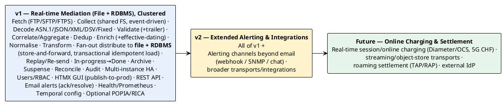

# 10 — Release Roadmap

> Part of the [[00-index|baasparse BRS]]. Previous: [[09-assumptions-constraints-dependencies]]  ·  Next: [[11-glossary]]

## 10.1 Release overview

## 10.2 v1 — Real-time File Mediation, Clustered (committed)

**Goal:** a production-usable, always-on mediation engine for a mobile operator's file
feeds, running highly-available across multiple Linux servers.

**Must include:**
- **Real-time, always-on** collection (event-driven, `inotify`) and **multi-instance HA**
  across Linux servers with distributed file-claim and instance-failover (`BR-COL-012`,
  `BR-HA-*`, `BR-NFR-008/015/020`).
- Remote acquisition over **FTP/SFTP/FTPS**, with already-fetched guarding, plus
  **optional input decompression** and **optional integrity/signature checks**
  (`BR-RMT-*`, `BR-COL-013/014`).
- Collection from **shared FS** with once-only cross-cluster capture, duplicate/sequence
  checks, **in-progress → done** lifecycle (done only after all endpoints), configurable
  **zero-record-file** handling, and automatic **archiving** (`BR-COL-*`, `BR-ARC-*`).
- All five decoders: ASN.1, JSON, **XML**, DSV, fixed-position (`BR-DEC-*`).
- Validation & screening incl. **header/trailer count reconciliation**; suspense &
  **as-is reprocessing** (`BR-VAL-*`, `BR-REC-006`, `BR-ERR-*`).
- Deduplication, **correlation and aggregation** with a persisted **canonical working set**,
  atomic emit, and configurable completion triggers/policies (`BR-DUP-*`, `BR-COR-*`, §5.6).
- Enrichment with **reference-data lifecycle & effective-dating** (`BR-ENR-*`).
- Configurable transformation incl. projection, rename, convert, derive, **telco
  normalisation** (MSISDN/E.164, IMSI, timezone), reformat (`BR-TRN-*`).
- **Fan-out** distribution to multiple destinations of **mixed kinds** — **file outputs and
  RDBMS load** (transactional, idempotent, schema-validated) — with atomic output, routing,
  **store-and-forward**, gap-free output sequencing, operator **re-send**, and
  **controlled full-file replay** (dedup-override, subset of destinations) (`BR-DST-*`,
  `BR-ERR-009/010`).
- Reconciliation and audit (`BR-REC-*`, `BR-AUD-*`).
- Declarative, PostgreSQL-persisted configuration (rule bodies as `JSONB`) with **hot-reload
  across instances**, **one-click publish-to-production**, and **temporal (never-deleted)
  config history** (`BR-CFG-007/008/009`); **no raw file bytes in PostgreSQL** — only the
  bounded canonical collation working set (`BR-NFR-009`, `BR-COR-006`); **PostgreSQL primary +
  streaming-replication standby(s) incl. DR** (`BR-HA-006`, `BR-NFR-016`).
- Operability incl. **feed-liveness monitoring**, **email alerting with ack/resolve
  lifecycle** (alarm visibility **independent of email**; further channels are v2),
  **clock-skew monitoring**, **health-check + Prometheus endpoints**, and **configurable log
  rotation** (`BR-OPS-*`).
- **Resilience**: **poison-file crash-loop protection** (attempt-counter + quarantine,
  `BR-COL-017`), **startup DB↔disk consistency reconciliation** with on-disk completion
  markers (`BR-NFR-017`, `BR-COL-009`), and **collation-window failover** across instances
  (`BR-COR-008`).
- **Config portability**: **export/import** of a pipeline and its dependent config for
  tenant onboarding, secrets excluded (`BR-CFG-011`).
- **Management plane**: user system with RBAC (`BR-USR-*`), an **HTMX GUI hosted in the Go
  app** for user/pipeline/file-structure/transformation management (`BR-UI-*`), and a
  **REST API** (`BR-API-*`).
- **Optional regulatory features**: PII masking (POPIA), configurable retention (RICA)
  (`BR-CMP-*`).
- Streaming, bounded-memory processing meeting the performance benchmark
  (`BR-NFR-001..009`).

**Supported feeds (v1):** the network-element feed catalog in [[04-scope]] §4.5 (voice,
data/GPRS-EPC, VoLTE/IMS, SMS/MMS, roaming TAP files, prepaid/IN files).

**Exit criteria:** a source can be onboarded **through the GUI** (file-structure &
transformation modelled, no code) and via the **REST API** under RBAC; a representative
file of each format processes end-to-end within the memory budget; **killing one instance
mid-file has another take over with no loss/dup**; reconciliation proves `in = out +
suspended + discarded` and catches a trailer mismatch; management activity does not degrade
data-plane throughput.

## 10.3 v2 — Extended Alerting & Integrations

**Goal:** broaden operational alerting beyond email and widen integration options, on the
unchanged v1 pipeline. (RDBMS load, originally planned here, has been **pulled forward into
v1** as an additional Destination type — `BR-DST-007/013/014/015` — since it is just another
output point on the same format-agnostic pipeline. The load-target database is a
client-owned destination, distinct from the engine's own state store, `DEP-1/DEP-7`.)

**Adds:**
- **Additional alerting channels** beyond email — webhook, SNMP traps, chat (`BR-OPS-008`).
- Broader transports/integrations as demand emerges (candidates in §10.4).

**Explicitly reuses:** collection, decode, validate, dedup, enrich, transform, fan-out
(file + RDBMS), suspense, audit, HA — unchanged.

## 10.4 Future candidates (not committed here)

- **Online / real-time charging**: session-based charging over Diameter (Gy)/RADIUS, and
  5G converged charging (CHF) — a distinct interface from v1's real-time *file* processing.
- Streaming/object-store transports (Kafka, TCP probes, S3/GCS/Azure Blob).
- Interconnect/roaming **settlement generation** (TAP/RAP production, NRTRDE).
- **External identity providers** (OIDC/LDAP/SSO) for the management plane.
- Rating/pricing hooks (if the business chooses to pull them into mediation).

## 10.5 Guiding sequencing principle

> Build the **format-agnostic core once** (collect → … → transform), keep **Distribution**
> as a pluggable target, and add capability by **adding targets and collectors**, not by
> re-architecting the pipeline. This is what makes v2 (and the future roadmap)
> incremental rather than disruptive.
