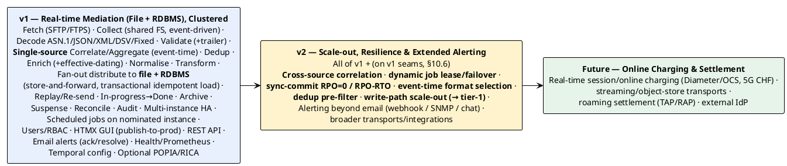

# 10 — Release Roadmap

> Part of the [[00-index|baasparse BRS]]. Previous: [[09-assumptions-constraints-dependencies]]  ·  Next: [[11-glossary]]

## 10.1 Release overview

## 10.2 v1 — Real-time File Mediation, Clustered (committed)

**Goal:** a production-usable, always-on mediation engine for a mobile operator's file
feeds, running highly-available across multiple Linux servers.

**Must include:**
- **Real-time, always-on** collection (event-driven, `inotify`) and **multi-instance HA**
  across Linux servers with distributed file-claim and instance-failover (`BR-COL-012`,
  `BR-HA-*`, `BR-NFR-008/015/020`).
- Remote acquisition over **SFTP/FTPS**, with already-fetched guarding, plus
  **optional input decompression** and **optional integrity/signature checks**
  (`BR-RMT-*`, `BR-COL-013/014`).
- Collection from **shared FS** with once-only cross-cluster capture, duplicate/sequence
  checks, **in-progress → done** lifecycle (done only after all endpoints), configurable
  **zero-record-file** handling, and automatic **archiving** (`BR-COL-*`, `BR-ARC-*`).
- All five decoders: ASN.1, JSON, **XML**, DSV, fixed-position (`BR-DEC-*`).
- Validation & screening incl. **header/trailer count reconciliation**; suspense &
  **as-is reprocessing** (`BR-VAL-*`, `BR-REC-006`, `BR-ERR-*`).
- Deduplication, **single-source correlation and aggregation** with a persisted **canonical
  working set** (keyed by correlation key, source-agnostic), atomic emit, configurable
  completion triggers/policies, and **event-time** windowing/grouping (`BR-DUP-*`,
  `BR-COR-001..008`, `BR-COR-010`, §5.6). *(Cross-source Correlation Groups, `BR-COR-009`, are
  v2 — see §10.6.)*
- Enrichment with **reference-data lifecycle & effective-dating** (`BR-ENR-*`).
- Configurable transformation incl. projection, rename, convert, derive, **telco
  normalisation** (MSISDN/E.164, IMSI, timezone), reformat (`BR-TRN-*`).
- **Fan-out** distribution to multiple destinations of **mixed kinds** — **file outputs and
  RDBMS load** (transactional, idempotent, schema-validated) — with atomic output, routing,
  **store-and-forward**, gap-free output sequencing, operator **re-send**, and
  **controlled full-file replay** (dedup-override, subset of destinations) (`BR-DST-*`,
  `BR-ERR-009/010`).
- Reconciliation and audit (`BR-REC-*`, `BR-AUD-*`).
- Declarative, PostgreSQL-persisted configuration (rule bodies as `JSONB`) with **hot-reload
  across instances**, **one-click publish-to-production**, and **temporal (never-deleted)
  config history** (`BR-CFG-007/008/009`); **no raw file bytes in PostgreSQL** — only the
  bounded canonical collation working set (`BR-NFR-009`, `BR-COR-006`); **PostgreSQL primary +
  streaming-replication standby(s) incl. DR** (async permitted; recovery bounded by disk-marker
  reconciliation, `BR-HA-006`, `BR-NFR-016/017`). *(Synchronous-commit RPO=0 and formal RPO/RTO,
  `BR-NFR-018`, are v2 — §10.6.)*
- Operability incl. **feed-liveness monitoring**, **email alerting with ack/resolve
  lifecycle** (alarm visibility **independent of email**; further channels are v2),
  **clock-skew monitoring**, **health-check + Prometheus endpoints**, and **configurable log
  rotation** (`BR-OPS-*`).
- **Resilience**: **poison-file crash-loop protection** (attempt-counter + quarantine,
  `BR-COL-017`), **startup DB↔disk consistency reconciliation** with on-disk completion
  markers (`BR-NFR-017`, `BR-COL-009`), and **collation-window failover** across instances
  (`BR-COR-008`).
- **Scheduled/singleton jobs** (fetch polling, archiver, feed-liveness) run on a **nominated
  instance** in v1, with idempotent backstops (already-fetched guard, verify-before-prune) so
  they are safe without dynamic election. *(Dynamic scheduled-job lease + auto-failover,
  `BR-HA-010`/`BR-RMT-012`, are v2 — §10.6.)*
- **Config portability**: **export/import** of a pipeline and its dependent config for
  tenant onboarding, secrets excluded (`BR-CFG-011`).
- **Management plane**: user system with RBAC (`BR-USR-*`), an **HTMX GUI hosted in the Go
  app** for user/pipeline/file-structure/transformation management (`BR-UI-*`), and a
  **REST API** (`BR-API-*`).
- **Optional regulatory features**: PII masking (POPIA), configurable retention (RICA)
  (`BR-CMP-*`).
- Streaming, bounded-memory processing meeting the performance benchmark
  (`BR-NFR-001..009`).

**Supported feeds (v1):** the network-element feed catalog in [[04-scope]] §4.5 (voice,
data/GPRS-EPC, VoLTE/IMS, SMS/MMS, roaming TAP files, prepaid/IN files).

**Exit criteria:** a source can be onboarded **through the GUI** (file-structure &
transformation modelled, no code) and via the **REST API** under RBAC; a representative
file of each format processes end-to-end within the memory budget; **killing one instance
mid-file has another take over with no loss/dup**; reconciliation proves `in = out +
suspended + discarded` and catches a trailer mismatch; management activity does not degrade
data-plane throughput.

## 10.3 v2 — Scale-out, Resilience Hardening & Extended Alerting

**Goal:** take the proven v1 small-to-medium pipeline and add the **scale, resilience, and
automation** capabilities needed to grow toward a tier-1 operator — plus alerting channels
beyond email — **on the unchanged v1 pipeline**. (RDBMS load, originally planned here, was
**pulled forward into v1** — `BR-DST-007/013/014/015`.) Each item below has a defined **v1
seam** (§10.6), so v2 is *additive*, not a re-architecture.

**Adds — scale & resilience (deferred from v1, seams built in v1):**
- **Cross-source correlation** — Correlation Groups that join partial records across feeds
  (multi-leg calls, split data sessions) (`BR-COR-009`). *Seam: v1's keyed, source-agnostic
  working set.*
- **Dynamic scheduled-job coordination** — scheduled-job lease with automatic failover for
  fetch/archive/liveness, replacing the v1 nominated instance (`BR-HA-010`, `BR-RMT-012`).
  *Seam: the lease mechanism already runs collation-window emit in v1.*
- **Formal recovery objectives** — synchronous-commit local standby (**RPO = 0**) and stated
  RPO/RTO targets (`BR-NFR-018`). *Seam: v1 disk-marker reconciliation; v2 is a
  deployment/config change.*
- **Event-time-driven format selection** — automatic effective-dated format-version choice by
  event time (`BR-DEC-012`). *Seam: v1's temporal, versioned Format Definitions.*
- **Dedup read-path pre-filter** — bounded in-memory pre-filter to lift dedup throughput
  (`BR-NFR-025`). *Seam: v1's stable DB-backed dedup interface.*
- **Write-path scaling toward tier-1 volumes** — breaking past the single-PostgreSQL-primary
  write ceiling (`BR-NFR-024`, `R30`): **partitioned/sharded** state, an **external
  high-throughput dedup store**, or write-offload — *without re-architecting the pipeline*
  (`BR-NFR-030/031`). The key enabler for the "grow into a tier-1 operator" ambition.

**Adds — alerting & integration:**
- **Additional alerting channels** beyond email — webhook, SNMP traps, chat (`BR-OPS-008`).
- Broader transports/integrations as demand emerges (candidates in §10.4).

**Explicitly reuses:** collection, decode, validate, single-source dedup/correlation, enrich,
transform, fan-out (file + RDBMS), suspense, audit, HA — unchanged.

## 10.4 Future candidates (not committed here)

- **Online / real-time charging**: session-based charging over Diameter (Gy)/RADIUS, and
  5G converged charging (CHF) — a distinct interface from v1's real-time *file* processing.
- Streaming/object-store transports (Kafka, TCP probes, S3/GCS/Azure Blob).
- Interconnect/roaming **settlement generation** (TAP/RAP production, NRTRDE) — building on
  v1's TAP3 **ingestion/validation** (`BR-VAL-007`).
- **External identity providers** (OIDC/LDAP/SSO) for the management plane.
- Rating/pricing hooks (if the business chooses to pull them into mediation).

## 10.5 Guiding sequencing principle

> Build the **format-agnostic core once** (collect → … → transform), keep **Distribution**
> as a pluggable target, and add capability by **adding targets and collectors**, not by
> re-architecting the pipeline. This is what makes v2 (and the future roadmap)
> incremental rather than disruptive.

## 10.6 v1 → v2 upgrade path (design seams)

v1 is a **lean, production-usable small-to-medium** release; the scale/resilience/automation
capabilities are **deferred to v2**. The **non-negotiable constraint** is that v1 be built so
each v2 capability is an **additive change behind a seam already present in v1** — no rewrite
of the pipeline, persistence model, or recovery logic. This is a **binding design requirement**
on v1, traceable to `BR-NFR-030/031` (modularity) and the seams below.

Two rules make the path safe:
1. **v1 must expose the seam.** Each deferred capability names a v1 structure it will extend;
   v1 delivery is **not complete** unless that structure exists in the required shape (e.g. the
   correlation working set is keyed by correlation key and carries **no hard source binding**).
2. **v1 correctness must not depend on the deferred mechanism.** Where v1 uses a simpler stand-in
   (nominated instance, async replication, current-active format), an **idempotent backstop**
   guarantees no loss/duplication, so enabling the v2 mechanism only removes *waste* or
   *re-work*, never changes *correctness*.

| v2 capability | Deferred req | v1 seam that must exist | Nature of the v2 change |
|---------------|--------------|-------------------------|-------------------------|
| Cross-source correlation (Correlation Groups) | `BR-COR-009` | Collation working set **keyed by correlation key, source-agnostic**; cluster ownership & atomic emit independent of which pipeline appended (`BR-COR-006/008`) | Allow **>1 pipeline to append** to the same keyed working set — reuse persistence/claim/emit unchanged |
| Dynamic scheduled-job coordination + failover | `BR-HA-010`, `BR-RMT-012` | v1 runs jobs on a **nominated instance** with idempotent backstops (already-fetched guard `BR-RMT-005`, verify-before-prune `BR-ARC-006`); the **lease mechanism already exists** for window emit (`BR-COR-008`) | Swap nominated instance for the **scheduled-job lease** — same jobs, same backstops, adds auto-failover |
| Formal RPO=0 / RPO/RTO targets | `BR-NFR-018` | **On-disk completion markers + startup reconciliation** (`BR-COL-009`, `BR-NFR-017`) already bound loss to reconcilable re-work | **Deployment/config change** — enable `synchronous_commit` on the local standby; set targets. No engine-logic change |
| Event-time format-version selection | `BR-DEC-012` | Format Definitions stored as **temporal, versioned config** (`effective_from`/`end_date`, `BR-CFG-009`); v1 decodes current-active | Change the **selection rule** from "current-active" to "effective-at-event-time" over the *same* versioned data |
| Dedup read-path pre-filter | `BR-NFR-025` | Dedup behind a **stable key-lookup interface** (`BR-DUP-001..004`) | Insert an in-memory **pre-filter in front of the interface**, identical semantics — pure performance |
| Write-path scale-out (tier-1) | `BR-NFR-024`, `R30` | **High-churn tables time-partitioned** (`BR-DUP-002`), state prunable by partition-drop, connections pooled; format-agnostic core (`BR-NFR-030/031`) | Partition/shard state or move dedup to an external store — behind the same interfaces |

> **Net effect:** a v1 deployment for a small-to-medium operator can grow toward tier-1 by
> turning on v2 capabilities **incrementally**, each landing on a seam v1 was required to build
> — none forcing a data migration that changes the meaning of already-processed records or a
> re-architecture of the pipeline.
