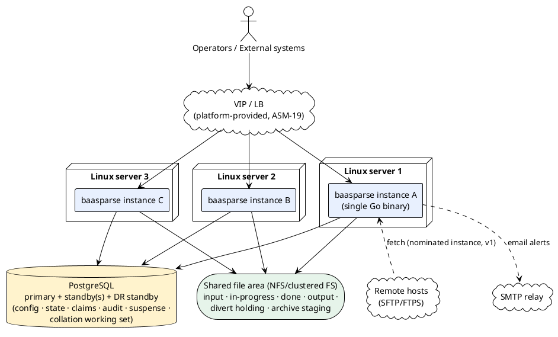
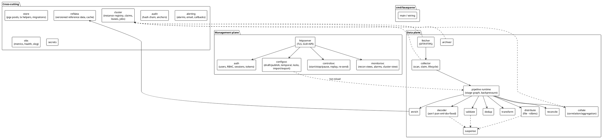
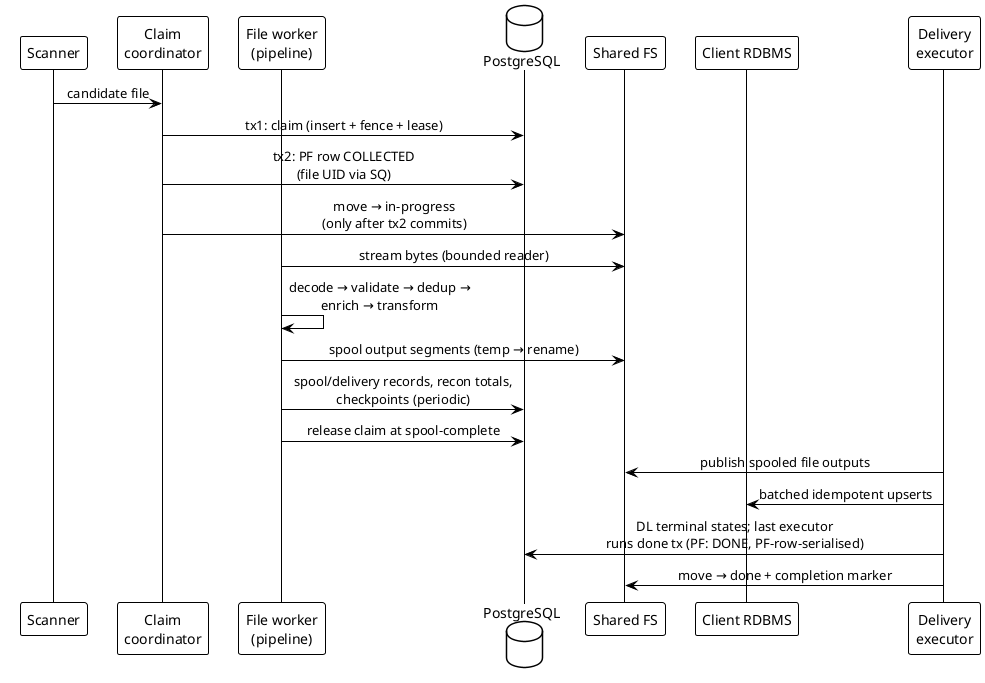

# 01 — Solution Architecture

> Part of the [[00-index|baasparse TS]]. Previous: [[00-index]] · Next: [[02-conventions]]

## 1.1 Architecture overview

baasparse is a **Go Modulith**: one statically linked binary containing every module,
deployed as **N identical instances** across Linux servers. Instances are peers — there
is no leader for the data plane; coordination happens exclusively through **PostgreSQL**
(claims, leases, state) and the **shared file area** (record content). Any instance can
process any file, serve any management request, and complete any collation window
(`BR-HA-001..005`, `BR-HA-012`).

**Platform dependencies (not implemented by the engine):** shared-FS HA and DR
replication (`ASM-3`, `ASM-18`), PostgreSQL administration and automated failover
(Patroni/repmgr, `ASM-4`, `BR-HA-006`), the management-plane VIP/LB (`ASM-19`,
`DEP-1e`), SMTP relay (`DEP-1c`), NTP (`ASM-3b`).

## 1.2 The two planes

Each instance internally separates (`BR-NFR-033`):

- **Data plane** — fetch → collect → decode → validate → dedup → correlate → enrich →
  transform → distribute → reconcile/audit → archive. Owns the memory budget and worker
  pools.
- **Management plane** — HTTP server (HTMX GUI + REST API), auth/RBAC, configuration
  services, monitoring/control endpoints. Runs on its own listener and its own bounded
  worker resources so admin activity cannot starve mediation (`BR-NFR-033`); both share
  one **service/authorization layer** (`BR-NFR-034`).

Isolation mechanism: separate `pgxpool` pools (data-plane pool sized for throughput,
management pool small and capped), separate goroutine pools, and a management-side
request concurrency limit. Both planes live in one process (`BR-NFR-030`).

## 1.3 Module map (the Modulith)

Module-to-package mapping and interface seams follow [[02-conventions]] §2.3. The
decode and destination seams are formal extension points (`BR-NFR-031/032`): a decoder
implements `decoder.Decoder`, a destination implements `distribute.Target`; vendor-variant
ASN.1 decoders plug in behind `decoder.Registry` without touching the core (`BR-DEC-005`).

## 1.4 Data-plane execution model

### File-at-a-time worker model

The unit of scheduling is the **file**. Per instance:

1. **Scanner** goroutines (one per configured source directory group) list watched input
   dirs on a short, configurable interval; instance-local dirs additionally use `inotify`
   (`BR-COL-012`). Detection produces *candidates* only.
2. A candidate is offered to the **claim coordinator**, which attempts the distributed
   claim (`FC_FILE_CLAIM` insert + heartbeat lease, `BR-HA-003`), then commits the
   **collect transaction** (file UID + `PF` row `COLLECTED`) — two transactions,
   [[03-database-design]] §3.9.1. Only after the collect commit is the file moved to
   the in-progress directory and handed to a **file worker** from a bounded pool
   (`maxConcurrentFiles` per source / instance, `BR-COL-011`).
3. The file worker runs the pipeline **stage graph** for the file: a chain of stages
   connected by small bounded channels (record batches, not single records, to amortise
   overhead). Every stage is pull-based; a slow stage propagates backpressure to the
   reader — the goroutine simply blocks, no queue growth (`BR-NFR-002/007`).
4. Pass accounting (reconciliation totals, per-destination spools, final checkpoint)
   commits before the claim is **released at pass/spool-complete** — store-and-forward
   delivery does not hold the claim. Delivery executors publish the spooled outputs;
   whichever executor terminalises the **last** delivery record performs the done
   transaction (`PF` → `DONE`, done-move + completion marker), serialised on the `PF`
   row, with a periodic sweep as backstop
   ([[04-acquisition-collection-archiving]], [[07-distribution-delivery]]).

Records flow as **canonical records** ([[05-decoding-and-canonical-record]]) from decode
onward; stages are format-agnostic (`BR-DEC-009`, BRS §4.4).

### Streaming vs collating pipelines

The pipeline's mode follows from its configured stages (`BR-CFG-010`):

- **Streaming:** records never persist; total in-memory footprint =
  Σ(stage buffers × batch size × concurrent files) — bounded by configuration.
- **Collating:** the correlate/aggregate stage writes canonical members to
  `CW_COLLATION_WINDOW`/`CM_COLLATION_MEMBER` and immediately releases the memory; a
  separate cluster-wide **window sweeper** (any instance, lease-claimed per due window)
  performs the atomic emit and feeds emitted records back into the downstream half of
  the pipeline (enrich → transform → distribute) (`BR-COR-006/008`).

### Scheduled/singleton work

Fetch polling (per remote source), the archiver, feed-liveness monitoring, dedup-key and
audit partition maintenance, and the alarm escalator run as **jobs** defined in
`SJ_SCHEDULED_JOB`. In v1 each job runs on its **nominated instance** (configuration);
every job is idempotent-by-design (already-fetched guard, verify-before-prune, alarm
dedup) so mis-nomination can waste work but never corrupt (`BR-HA-010` v1 seam). The
table already carries lease columns; v2 activates lease-based election without schema
change (BRS §10.6). The **collation window sweeper is lease-based already in v1**
(`BR-COR-008`) — it is the proof of the seam.

## 1.5 Reliability spine

The invariants every module builds on (detailed in [[11-ha-clustering-recovery]]):

| Invariant | Mechanism |
|-----------|-----------|
| A file is processed by exactly one instance | `FC_FILE_CLAIM` row lock + heartbeat lease; expiry → takeover (`BR-HA-003/004`) |
| Crash mid-file loses/duplicates nothing | Checkpointed progress (`FC` offset) + idempotent re-run: dedup store, deterministic output identity, idempotent RDBMS upsert, atomic file outputs (`BR-NFR-011/012/013`) |
| Crash mid-emit loses/duplicates nothing | Window emit = one transaction: mark emitted + persist the emitted body (the spool entry), consume members, transfer reconciliation counts (`BR-COR-006`; [[03-database-design]] §3.9.3) |
| DB failover ≠ silent loss | On-disk completion markers + startup DB↔disk reconciliation (`BR-COL-009`, `BR-NFR-016/017`) |
| No reachable primary → no unrecorded effects | Fail-closed: stop claiming, quiesce at checkpoints, no unrecorded delivery; readiness reports degraded; auto-resume (`BR-NFR-019`) |
| Poison file ≠ cluster crash-loop | Checkpoint-stall detection (lease-**expiry** takeovers without checkpoint advance — graceful releases never count) → record-skip (only if unambiguously identifiable) or file quarantine (`BR-COL-017`) |

## 1.6 Key data flows

### End-to-end (streaming pipeline, file destination + RDBMS fan-out)

Delivery is **executor-driven post-spool**: the file worker's claim ends at
spool-complete, and publishing/confirmation proceeds under per-delivery leases
([[07-distribution-delivery]]) — a slow or unreachable destination never holds a file
claim open.

### Management-plane request

Request → TLS listener → session/token auth → RBAC check → service layer (same layer
for GUI and API, `BR-NFR-034`) → PostgreSQL. Config mutations write **drafts**; a
**publish** creates the new active `PLV_PIPELINE_VERSION` and notifies instances via
PostgreSQL `LISTEN/NOTIFY` (plus a poll fallback) to hot-reload (`BR-CFG-007/008`);
in-flight files keep their pinned version, open windows keep their stamped version
(`BR-COR-011`).

## 1.7 Configuration & startup

- Bootstrap config (state-DB DSN, instance ID, listen addresses, memory budget, shared
  paths) comes from environment/flags/config file (`BR-NFR-061`); everything behavioural
  comes from PostgreSQL (`BR-CFG-001`).
- Startup order: load secrets → connect DB (retry w/ backoff) → run/verify migrations
  (single owner) → register instance (`INS_INSTANCE`) → startup DB↔disk reconciliation
  where owed (`BR-NFR-017`) → load active config → start management listener → start
  data plane (readiness gates on all of the above).
- Shutdown (SIGTERM): stop claiming, drain in-flight files to checkpoint or completion
  (bounded grace), release claims, deregister — supports rolling upgrades (`BR-HA-008`).

## 1.8 Technology choices (summary)

| Concern | Choice | Rationale / BRS tie |
|---------|--------|--------------------|
| DB driver | `pgx/v5` + `pgxpool` | Performance, explicit tx control, LISTEN/NOTIFY (`BR-CFG-007`) |
| HTTP | stdlib `net/http` + HTMX; templates via `html/template` (embedded) | `CON-10`, no separate front-end (`BR-UI-001`) |
| SFTP | `golang.org/x/crypto/ssh` + `github.com/pkg/sftp` | `BR-RMT-001` |
| FTPS | `github.com/jlaffaye/ftp` (TLS) | `BR-RMT-001` |
| ASN.1 BER/DER | in-house streaming BER decoder driven by declarative schema (JSONB) + vendor plug-in seam | `BR-DEC-001/005`; stdlib `encoding/asn1` is neither streaming nor schema-driven |
| Metrics | `prometheus/client_golang` | `BR-OPS-009` |
| Logs | `log/slog` JSON | `BR-NFR-041` |
| Passwords | `argon2id` (`x/crypto`) | `BR-USR-004` |
| Compression | stdlib `gzip`/`zip` + `archive/tar` | `BR-COL-013`, `BR-ARC-002` |

Full per-area design detail: sections [[03-database-design]] through
[[14-performance-sizing]].
