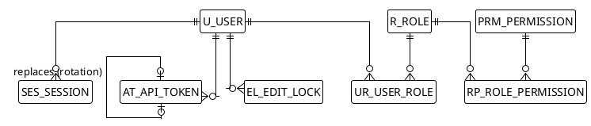
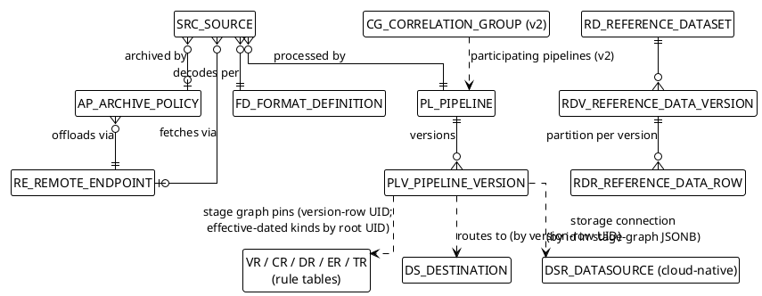
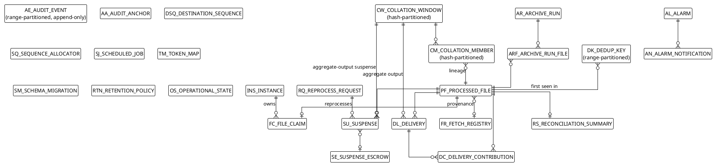

# 03 — Database Design (PostgreSQL Physical Schema)

> Part of the [[00-index|baasparse TS]]. Previous: [[02-conventions]] · Next: [[04-acquisition-collection-archiving]]

This section is the **physical realisation** of the conceptual entity model in
[[../brs/08-data-and-configuration|BRS §8]]. It defines every table in the
[[02-conventions]] §2.2 registry at column level: types, nullability, defaults, keys,
constraints, partitioning, indexes, and the concurrency-sensitive access patterns the
schema exists to serve. All DDL below follows the **mandatory naming standard** of
[[02-conventions]] §2.1 and lives in the single engine schema (default `baasparse`,
set via `search_path`; the DDL is written unqualified).

The binding content rule: PostgreSQL holds **metadata, references, keys, counts, state,
config, and audit — never raw file bytes** (`BR-NFR-009`). The two narrow exceptions are
the canonical bodies of **open collation-window members** (`CM_COLLATION_MEMBER`,
`BR-COR-006`) and the optional bounded **suspense escrow** (`SE_SUSPENSE_ESCROW`,
`BR-ERR-011`).

---

## 3.1 Schema-wide standards

These rules apply to every table and are not repeated per definition:

1. **Surrogate key.** `<PREFIX>_UID BIGINT GENERATED ALWAYS AS IDENTITY PRIMARY KEY`.
   *Partitioned-table variant:* PostgreSQL requires the partition key inside every
   unique constraint, so a partitioned table's primary key is the composite
   `(<PREFIX>_UID, <partition column>)`. The identity column remains the row's
   engine-visible identifier; the composite PK is a physical necessity, not a semantic
   change. Affected tables: `DK`, `AE`, `CW`, `CM`, `RDR`.
2. **Audit columns.** Every table carries
   `<PREFIX>_CREATED_BY TEXT NOT NULL`,
   `<PREFIX>_CREATED_ON TIMESTAMPTZ NOT NULL DEFAULT now()`,
   `<PREFIX>_MODIFIED_BY TEXT NOT NULL`,
   `<PREFIX>_MODIFIED_ON TIMESTAMPTZ NOT NULL DEFAULT now()`.
   They are shown in every DDL block below. They are **application-set** (see §3.8.3),
   with `*_BY` holding a username for management-plane writes or `engine:<instance-id>`
   for data-plane writes.
3. **Enumerations** are `TEXT` + `CHECK` (named `CK_<PREFIX>_<COL>`), never native
   enums, so expand-then-contract migrations stay additive (`BR-HA-011`). Values are
   `UPPER_SNAKE` literals.
4. **Timestamps** are `TIMESTAMPTZ`, UTC at rest. Event-time semantics live in the
   canonical record ([[05-decoding-and-canonical-record]]), not in column typing.
5. **Declarative rule/config bodies** are `JSONB`; JSONB is never used where a
   relational column serves a reconciliation or query need.
6. **Foreign keys** follow `<CHILD>_<PARENT>_UID[_<ROLE>]`, constraint
   `FK_<CHILD>_<PARENT>[_<ROLE>]`, and are **`ON DELETE RESTRICT`** throughout
   (see §3.8.4). Indexes are `IX_...`, unique indexes/constraints `UX_...`.
7. **No raw record content** except the two exceptions named above; both are
   size-bounded, retention-bounded, and PII-masked/tokenised per `BR-CMP-001` where
   enabled.
8. **DDL presentation order.** Definitions below follow the registry order for
   readability; several therefore *forward-reference* tables defined later (e.g.
   `SRC → PL`, `PF → INS`). The actual migrations create tables in dependency order
   (or add the FK constraints in a trailing step) — presentation order is not
   creation order.

## 3.2 The temporal configuration pattern

Every **Configuration-domain** table (except the `PL`/`PLV` split, `RD`/`RDV`/`RDR`
lifecycle, and the `CG` v2 seam, each described in place) follows one pattern realising
`BR-CFG-009` (never physically deleted), `BR-CFG-008` (draft → published), and
`BR-ENR-005`/`BR-CFG-014` (effective-dating incl. backdated correction):

| Column | Type | Meaning |
|--------|------|---------|
| `<P>_<P>_UID_ROOT` | `BIGINT NULL`, self-FK | **Logical identity.** Every version row of one logical entity points at the entity's first version row; `NULL` means *this row is its own root*. The entity's logical id is `COALESCE(<P>_<P>_UID_ROOT, <P>_UID)`. Cross-table FKs always reference the **root row's UID**, so version selection is a runtime concern, never an FK rewrite. |
| `<P>_VERSION_NO` | `INT NOT NULL` | Monotonic per logical entity ([[02-conventions]] §2.5). |
| `<P>_STATUS` | `TEXT NOT NULL CHECK` | `DRAFT` → `PUBLISHED` → `SUPERSEDED`. Only `PUBLISHED` rows are runtime-selectable; drafts are invisible to the data plane (`BR-CFG-008`). An **end-dated historical version REMAINS `PUBLISHED`** — its validity is closed by `END_DATE`, not by a status flip. `SUPERSEDED` is reserved for versions replaced across their **entire** validity window (e.g. a backdated correction covering the whole period) and for discarded drafts ([[09-configuration-management]] §9.1.2). |
| `<P>_EFFECTIVE_FROM` | `TIMESTAMPTZ NOT NULL` | Start of validity. A **backdated correction** (`BR-CFG-014`) is simply a new published version whose validity covers a past period. |
| `<P>_END_DATE` | `TIMESTAMPTZ NULL` | End of validity; `NULL` = open-ended. "Delete" = set `END_DATE`. **No config row is ever physically deleted** (`BR-CFG-009`); the retention section §3.10 therefore excludes all config tables. |

Runtime selection is *"the version effective at time T per the latest published
configuration"*: among rows sharing a root, pick the `PUBLISHED` row with the greatest
`VERSION_NO` whose `[EFFECTIVE_FROM, END_DATE)` covers T — a validity-window match, with
the highest version winning where a backdated correction overlaps an older version. v1 uses T = now for pipeline
config (`BR-CFG-007` pins per file thereafter) and T = event time for effective-dated
enrichment/reference selection (`BR-ENR-005`, `BR-COR-010`); v2 extends event-time
selection to format versions (`BR-DEC-012`) with **no schema change**.

Each temporal table carries the same three supporting indexes (shown once here, created
per table with its prefix substituted):

```sql
-- unique version per logical entity (root rows count as their own root)
CREATE UNIQUE INDEX UX_<P>_ROOT_VERSION
  ON <TABLE> (COALESCE(<P>_<P>_UID_ROOT, <P>_UID), <P>_VERSION_NO);
-- runtime selection path
CREATE INDEX IX_<P>_ROOT_EFFECTIVE
  ON <TABLE> (COALESCE(<P>_<P>_UID_ROOT, <P>_UID), <P>_EFFECTIVE_FROM)
  WHERE <P>_STATUS = 'PUBLISHED';
-- one open-ended published head per entity
CREATE UNIQUE INDEX UX_<P>_ROOT_OPEN
  ON <TABLE> (COALESCE(<P>_<P>_UID_ROOT, <P>_UID))
  WHERE <P>_STATUS = 'PUBLISHED' AND <P>_END_DATE IS NULL;
```

---

## 3.3 Administration domain

Users, RBAC, sessions/tokens, and config edit locks. All shared cluster-wide in
PostgreSQL so any instance serves any management request and instance loss invalidates
nothing (`BR-HA-012`). Full behavioural design: [[10-management-plane]].



### 3.3.1 `U_USER` — user accounts (`BR-USR-001/004/008/009`)

```sql
CREATE TABLE U_USER (
  U_UID                  BIGINT GENERATED ALWAYS AS IDENTITY PRIMARY KEY,
  U_USERNAME             TEXT        NOT NULL,
  U_DISPLAY_NAME         TEXT        NULL,
  U_EMAIL                TEXT        NULL,        -- alert-callback / notification address
  U_AUTH_SOURCE          TEXT        NOT NULL DEFAULT 'LOCAL', -- v1: LOCAL only; OIDC/LDAP are the
                                                  -- external-IdP seam (BR-USR-010, [[10-management-plane]] §10.1.5)
  U_PASSWORD_HASH        TEXT        NULL,        -- argon2id encoded string; never plaintext (BR-USR-004);
                                                  -- NULL only for externally-authenticated identities
  U_STATUS               TEXT        NOT NULL DEFAULT 'ACTIVE',
  U_MUST_CHANGE_PASSWORD BOOLEAN     NOT NULL DEFAULT FALSE, -- bootstrap admin forced change (BR-USR-009)
  U_FAILED_LOGIN_COUNT   INT         NOT NULL DEFAULT 0,     -- lockout/throttling (BR-USR-008)
  U_LOCKED_UNTIL         TIMESTAMPTZ NULL,                   -- lockout expiry; NULL = not locked
  U_PASSWORD_CHANGED_ON  TIMESTAMPTZ NULL,                   -- rotation policy input (BR-USR-008)
  U_CREATED_BY           TEXT        NOT NULL,
  U_CREATED_ON           TIMESTAMPTZ NOT NULL DEFAULT now(),
  U_MODIFIED_BY          TEXT        NOT NULL,
  U_MODIFIED_ON          TIMESTAMPTZ NOT NULL DEFAULT now(),
  CONSTRAINT UX_U_USERNAME UNIQUE (U_USERNAME),
  CONSTRAINT CK_U_STATUS CHECK (U_STATUS IN ('ACTIVE','DISABLED')),
  CONSTRAINT CK_U_AUTH_SOURCE CHECK (U_AUTH_SOURCE IN ('LOCAL','OIDC','LDAP')),
  CONSTRAINT CK_U_LOCAL_PASSWORD CHECK (U_AUTH_SOURCE <> 'LOCAL' OR U_PASSWORD_HASH IS NOT NULL)
);
```

Users are deactivated (`DISABLED`), never deleted — audit attribution (`BR-USR-006`)
must survive the account.

### 3.3.2 `R_ROLE` — roles (`BR-USR-003`)

```sql
CREATE TABLE R_ROLE (
  R_UID         BIGINT GENERATED ALWAYS AS IDENTITY PRIMARY KEY,
  R_NAME        TEXT        NOT NULL,
  R_DESCRIPTION TEXT        NULL,
  R_BUILT_IN    BOOLEAN     NOT NULL DEFAULT FALSE, -- seeded Administrator/Configurer/Operator/Viewer; not deletable
  R_CREATED_BY  TEXT        NOT NULL,
  R_CREATED_ON  TIMESTAMPTZ NOT NULL DEFAULT now(),
  R_MODIFIED_BY TEXT        NOT NULL,
  R_MODIFIED_ON TIMESTAMPTZ NOT NULL DEFAULT now(),
  CONSTRAINT UX_R_NAME UNIQUE (R_NAME)
);
```

### 3.3.3 `UR_USER_ROLE` — user ↔ role assignment

```sql
CREATE TABLE UR_USER_ROLE (
  UR_UID         BIGINT GENERATED ALWAYS AS IDENTITY PRIMARY KEY,
  UR_U_UID       BIGINT      NOT NULL,
  UR_R_UID       BIGINT      NOT NULL,
  UR_CREATED_BY  TEXT        NOT NULL,
  UR_CREATED_ON  TIMESTAMPTZ NOT NULL DEFAULT now(),
  UR_MODIFIED_BY TEXT        NOT NULL,
  UR_MODIFIED_ON TIMESTAMPTZ NOT NULL DEFAULT now(),
  CONSTRAINT FK_UR_U FOREIGN KEY (UR_U_UID) REFERENCES U_USER (U_UID) ON DELETE RESTRICT,
  CONSTRAINT FK_UR_R FOREIGN KEY (UR_R_UID) REFERENCES R_ROLE (R_UID) ON DELETE RESTRICT,
  CONSTRAINT UX_UR_USER_ROLE UNIQUE (UR_U_UID, UR_R_UID)
);
CREATE INDEX IX_UR_R ON UR_USER_ROLE (UR_R_UID);
```

Role removal from a user is a physical delete of the assignment row (the grant history
lives in `AE_AUDIT_EVENT`, `BR-USR-006`); token access reflects it immediately because
authorisation is evaluated per request (`BR-USR-007`).

### 3.3.4 `PRM_PERMISSION` — permission catalog

```sql
CREATE TABLE PRM_PERMISSION (
  PRM_UID         BIGINT GENERATED ALWAYS AS IDENTITY PRIMARY KEY,
  PRM_CODE        TEXT        NOT NULL, -- stable capability code, e.g. 'config.publish', 'suspense.reprocess'
  PRM_DESCRIPTION TEXT        NULL,
  PRM_CREATED_BY  TEXT        NOT NULL,
  PRM_CREATED_ON  TIMESTAMPTZ NOT NULL DEFAULT now(),
  PRM_MODIFIED_BY TEXT        NOT NULL,
  PRM_MODIFIED_ON TIMESTAMPTZ NOT NULL DEFAULT now(),
  CONSTRAINT UX_PRM_CODE UNIQUE (PRM_CODE)
);
```

The catalog is **seeded by migration** (capability codes are engine-defined); the GUI/API
grant them to roles but never invent codes.

### 3.3.5 `RP_ROLE_PERMISSION` — role ↔ permission grants

```sql
CREATE TABLE RP_ROLE_PERMISSION (
  RP_UID         BIGINT GENERATED ALWAYS AS IDENTITY PRIMARY KEY,
  RP_R_UID       BIGINT      NOT NULL,
  RP_PRM_UID     BIGINT      NOT NULL,
  RP_CREATED_BY  TEXT        NOT NULL,
  RP_CREATED_ON  TIMESTAMPTZ NOT NULL DEFAULT now(),
  RP_MODIFIED_BY TEXT        NOT NULL,
  RP_MODIFIED_ON TIMESTAMPTZ NOT NULL DEFAULT now(),
  CONSTRAINT FK_RP_R   FOREIGN KEY (RP_R_UID)   REFERENCES R_ROLE (R_UID)             ON DELETE RESTRICT,
  CONSTRAINT FK_RP_PRM FOREIGN KEY (RP_PRM_UID) REFERENCES PRM_PERMISSION (PRM_UID)   ON DELETE RESTRICT,
  CONSTRAINT UX_RP_ROLE_PERM UNIQUE (RP_R_UID, RP_PRM_UID)
);
```

### 3.3.6 `SES_SESSION` — GUI sessions (`BR-USR-007`, `BR-HA-012`)

```sql
CREATE TABLE SES_SESSION (
  SES_UID             BIGINT GENERATED ALWAYS AS IDENTITY PRIMARY KEY,
  SES_U_UID           BIGINT      NOT NULL,
  SES_TOKEN_HASH      BYTEA       NOT NULL, -- SHA-256 of the session cookie value; raw value never stored
  SES_ISSUED_ON       TIMESTAMPTZ NOT NULL DEFAULT now(),
  SES_ABSOLUTE_EXPIRES_ON TIMESTAMPTZ NOT NULL, -- hard ceiling regardless of activity
  SES_IDLE_EXPIRES_ON TIMESTAMPTZ NOT NULL, -- rolled forward on activity
  SES_LAST_SEEN_ON    TIMESTAMPTZ NOT NULL DEFAULT now(),
  SES_CLIENT_ADDR     TEXT        NULL,
  SES_REVOKED_ON      TIMESTAMPTZ NULL,     -- logout / Administrator revocation time
  SES_STATUS          TEXT        NOT NULL DEFAULT 'ACTIVE',
  SES_CREATED_BY      TEXT        NOT NULL,
  SES_CREATED_ON      TIMESTAMPTZ NOT NULL DEFAULT now(),
  SES_MODIFIED_BY     TEXT        NOT NULL,
  SES_MODIFIED_ON     TIMESTAMPTZ NOT NULL DEFAULT now(),
  CONSTRAINT FK_SES_U FOREIGN KEY (SES_U_UID) REFERENCES U_USER (U_UID) ON DELETE RESTRICT,
  CONSTRAINT UX_SES_TOKEN UNIQUE (SES_TOKEN_HASH),
  CONSTRAINT CK_SES_STATUS CHECK (SES_STATUS IN ('ACTIVE','EXPIRED','REVOKED'))
);
CREATE INDEX IX_SES_U ON SES_SESSION (SES_U_UID) WHERE SES_STATUS = 'ACTIVE';
```

Sessions live in shared PostgreSQL precisely so a client continues against a surviving
instance after node loss (`BR-HA-012`). Auth lookup is one indexed probe on the token
hash. Expired rows are swept per §3.10.

### 3.3.7 `AT_API_TOKEN` — API tokens (`BR-USR-007`)

```sql
CREATE TABLE AT_API_TOKEN (
  AT_UID             BIGINT GENERATED ALWAYS AS IDENTITY PRIMARY KEY,
  AT_U_UID           BIGINT      NOT NULL,
  AT_NAME            TEXT        NOT NULL, -- operator-visible label
  AT_TOKEN_HASH      BYTEA       NOT NULL, -- SHA-256 of the token; the token itself is shown once at issue
  AT_ISSUED_ON       TIMESTAMPTZ NOT NULL DEFAULT now(),
  AT_EXPIRES_ON      TIMESTAMPTZ NOT NULL, -- explicit expiry is mandatory (BR-USR-007)
  AT_REVOKED_ON      TIMESTAMPTZ NULL,
  AT_STATUS          TEXT        NOT NULL DEFAULT 'ACTIVE',
  AT_LAST_USED_ON    TIMESTAMPTZ NULL,     -- updated at most once per minute to avoid hot writes
  AT_AT_UID_REPLACES BIGINT      NULL,     -- rotation chain: token this one replaced (BR-USR-007)
  AT_CREATED_BY      TEXT        NOT NULL,
  AT_CREATED_ON      TIMESTAMPTZ NOT NULL DEFAULT now(),
  AT_MODIFIED_BY     TEXT        NOT NULL,
  AT_MODIFIED_ON     TIMESTAMPTZ NOT NULL DEFAULT now(),
  CONSTRAINT FK_AT_U           FOREIGN KEY (AT_U_UID)           REFERENCES U_USER (U_UID)      ON DELETE RESTRICT,
  CONSTRAINT FK_AT_AT_REPLACES FOREIGN KEY (AT_AT_UID_REPLACES) REFERENCES AT_API_TOKEN (AT_UID) ON DELETE RESTRICT,
  CONSTRAINT UX_AT_TOKEN UNIQUE (AT_TOKEN_HASH),
  CONSTRAINT CK_AT_STATUS CHECK (AT_STATUS IN ('ACTIVE','REVOKED','EXPIRED'))
);
CREATE INDEX IX_AT_U ON AT_API_TOKEN (AT_U_UID);
```

A token ceases to grant access when revoked, expired, its user is `DISABLED`, or the
granting role is removed — all checked per request, no cached grants (`BR-USR-007`).

### 3.3.8 `EL_EDIT_LOCK` — config edit locks (`BR-CFG-012`, `BR-UI-011`)

```sql
CREATE TABLE EL_EDIT_LOCK (
  EL_UID         BIGINT GENERATED ALWAYS AS IDENTITY PRIMARY KEY,
  EL_ITEM_KIND   TEXT        NOT NULL, -- table prefix of the locked config entity, e.g. 'PLV', 'SRC', 'FD'
  EL_ITEM_UID    BIGINT      NOT NULL, -- root UID of the locked logical entity (polymorphic — no FK, see §3.8.4)
  EL_U_UID       BIGINT      NOT NULL, -- holder ("currently being edited by …", BR-UI-011)
  EL_CHANNEL     TEXT        NOT NULL DEFAULT 'GUI', -- which channel holds it (BR-CFG-012)
  EL_ACQUIRED_ON TIMESTAMPTZ NOT NULL DEFAULT now(),
  EL_EXPIRES_ON  TIMESTAMPTZ NOT NULL, -- idle/expiry deadline; rolled forward on edit activity
  EL_STATUS      TEXT        NOT NULL DEFAULT 'HELD',
  EL_CREATED_BY  TEXT        NOT NULL,
  EL_CREATED_ON  TIMESTAMPTZ NOT NULL DEFAULT now(),
  EL_MODIFIED_BY TEXT        NOT NULL,
  EL_MODIFIED_ON TIMESTAMPTZ NOT NULL DEFAULT now(),
  CONSTRAINT FK_EL_U FOREIGN KEY (EL_U_UID) REFERENCES U_USER (U_UID) ON DELETE RESTRICT,
  CONSTRAINT CK_EL_STATUS  CHECK (EL_STATUS IN ('HELD','RELEASED','EXPIRED')),
  CONSTRAINT CK_EL_CHANNEL CHECK (EL_CHANNEL IN ('GUI','API','IMPORT'))
);
-- at most one live lock per config item, across GUI, API, and import (BR-CFG-012)
CREATE UNIQUE INDEX UX_EL_ITEM_HELD ON EL_EDIT_LOCK (EL_ITEM_KIND, EL_ITEM_UID)
  WHERE EL_STATUS = 'HELD';
```

Acquisition is `INSERT … ON CONFLICT DO NOTHING` against `UX_EL_ITEM_HELD` (a lost race
returns the holder for the "locked by X" message); release/expiry updates `EL_STATUS`,
keeping lock history for audit until pruned (§3.10).

---

## 3.4 Configuration domain

All behaviour-defining data (`BR-CFG-001`), temporal per §3.2, declarative bodies as
`JSONB` (`BR-CFG-002`). Secrets never appear in these tables — credential columns hold
**secret references** (`secret://…`) resolved via the secrets mechanism (`BR-NFR-054`).
Full lifecycle design (drafts, publish, hot reload, import/export): [[09-configuration-management]].



### 3.4.1 `SRC_SOURCE` — source definitions (`BR-COL-*`, `BR-RMT-002`)

```sql
CREATE TABLE SRC_SOURCE (
  SRC_UID               BIGINT GENERATED ALWAYS AS IDENTITY PRIMARY KEY,
  SRC_SRC_UID_ROOT      BIGINT      NULL,     -- temporal pattern §3.2
  SRC_VERSION_NO        INT         NOT NULL,
  SRC_STATUS            TEXT        NOT NULL DEFAULT 'DRAFT',
  SRC_EFFECTIVE_FROM    TIMESTAMPTZ NOT NULL,
  SRC_END_DATE          TIMESTAMPTZ NULL,
  SRC_NAME              TEXT        NOT NULL,
  SRC_INPUT_DIRS        JSONB       NOT NULL, -- watched input directories: JSONB array of one or more
                                              -- absolute paths ("one or more", BR-COL-001)
  SRC_IN_PROGRESS_DIR   TEXT        NOT NULL, -- BR-COL-009/015
  SRC_DONE_DIR          TEXT        NOT NULL,
  SRC_QUARANTINE_DIR    TEXT        NOT NULL, -- poison / integrity-failed files (BR-COL-014/017)
  SRC_REJECTED_DIR      TEXT        NOT NULL, -- duplicate re-arrivals per disposition (BR-COL-006)
                                              -- (every input dir + the four lifecycle dirs
                                              -- same-mount-validated, [[04-acquisition-collection-archiving]] §4.1)
  SRC_FILE_PATTERN      TEXT        NOT NULL, -- glob/regex selection (BR-COL-003)
  SRC_COLLECTION_POLICY JSONB       NOT NULL, -- completeness detection, stability check, decompression,
                                              -- integrity/signature check, zero-record policy, disposition,
                                              -- scan interval, max concurrent files, max attempts,
                                              -- sequence-number spec, liveness/cadence expectation, dedup
                                              -- horizon (BR-COL-002/010..017, BR-OPS-007, BR-DUP-006)
  SRC_FETCH_POLICY      JSONB       NULL,     -- per-source fetch policy: remote subpath/match, onFetched
                                              -- override of RE_POST_FETCH, refetchPolicy, remoteChecksum
                                              -- sidecar, stagingQuota (BR-RMT-002/004/005/006/013(b));
                                              -- NULL for local-drop sources
  SRC_RE_UID            BIGINT      NULL,     -- remote endpoint root; NULL = local-drop source (BR-RMT-002)
  SRC_AP_UID            BIGINT      NULL,     -- archive policy root; NULL = no archiving
  SRC_FD_UID            BIGINT      NOT NULL, -- format-definition ROOT UID (pin model, [[09-configuration-management]]
                                              -- §9.2.1): v1 selects the current-active published version at
                                              -- file claim and stamps it per file (BR-CFG-007); v2 flips
                                              -- selection to event time (BR-DEC-012) — no schema change
  SRC_PL_UID            BIGINT      NOT NULL, -- owning pipeline (logical identity)
  SRC_CREATED_BY        TEXT        NOT NULL,
  SRC_CREATED_ON        TIMESTAMPTZ NOT NULL DEFAULT now(),
  SRC_MODIFIED_BY       TEXT        NOT NULL,
  SRC_MODIFIED_ON       TIMESTAMPTZ NOT NULL DEFAULT now(),
  CONSTRAINT FK_SRC_SRC_ROOT FOREIGN KEY (SRC_SRC_UID_ROOT) REFERENCES SRC_SOURCE (SRC_UID)          ON DELETE RESTRICT,
  CONSTRAINT FK_SRC_RE       FOREIGN KEY (SRC_RE_UID)       REFERENCES RE_REMOTE_ENDPOINT (RE_UID)   ON DELETE RESTRICT,
  CONSTRAINT FK_SRC_AP       FOREIGN KEY (SRC_AP_UID)       REFERENCES AP_ARCHIVE_POLICY (AP_UID)    ON DELETE RESTRICT,
  CONSTRAINT FK_SRC_FD       FOREIGN KEY (SRC_FD_UID)       REFERENCES FD_FORMAT_DEFINITION (FD_UID) ON DELETE RESTRICT,
  CONSTRAINT FK_SRC_PL       FOREIGN KEY (SRC_PL_UID)       REFERENCES PL_PIPELINE (PL_UID)          ON DELETE RESTRICT,
  CONSTRAINT CK_SRC_STATUS CHECK (SRC_STATUS IN ('DRAFT','PUBLISHED','SUPERSEDED'))
);
-- plus the three temporal indexes of §3.2 (UX_SRC_ROOT_VERSION, IX_SRC_ROOT_EFFECTIVE, UX_SRC_ROOT_OPEN)
CREATE UNIQUE INDEX UX_SRC_NAME_OPEN ON SRC_SOURCE (SRC_NAME)
  WHERE SRC_STATUS = 'PUBLISHED' AND SRC_END_DATE IS NULL; -- one live source per name
```

### 3.4.2 `RE_REMOTE_ENDPOINT` — SFTP/FTPS endpoints (`BR-RMT-*`)

```sql
CREATE TABLE RE_REMOTE_ENDPOINT (
  RE_UID             BIGINT GENERATED ALWAYS AS IDENTITY PRIMARY KEY,
  RE_RE_UID_ROOT     BIGINT      NULL,
  RE_VERSION_NO      INT         NOT NULL,
  RE_STATUS          TEXT        NOT NULL DEFAULT 'DRAFT',
  RE_EFFECTIVE_FROM  TIMESTAMPTZ NOT NULL, -- temporal pattern §3.2 (endpoint config changes); credential
                                           -- rotation is IN-ROW via RE_CREDENTIALS, not a config version
  RE_END_DATE        TIMESTAMPTZ NULL,
  RE_NAME            TEXT        NOT NULL,
  RE_PROTOCOL        TEXT        NOT NULL,
  RE_HOST            TEXT        NOT NULL,
  RE_PORT            INT         NOT NULL,
  RE_REMOTE_PATH     TEXT        NOT NULL,
  RE_CREDENTIALS     JSONB       NOT NULL, -- ordered credential versions [{secretRef, effectiveFrom}] —
                                           -- secret REFERENCES only, never plaintext, excluded from export
                                           -- (BR-RMT-003/011, BR-NFR-054; [[04-acquisition-collection-archiving]] §4.3.9)
  RE_TRUST           JSONB       NULL,     -- pinned SSH host keys / x509 CA or leaf pins (BR-RMT-009;
                                           -- [[04-acquisition-collection-archiving]] §4.3.7, [[13-security-compliance]] §13.2.3)
  RE_POST_FETCH      TEXT        NOT NULL DEFAULT 'LEAVE', -- endpoint-level default remote-side action (BR-RMT-006);
                                           -- overridable per source via SRC_FETCH_POLICY onFetched (§3.4.1)
  RE_REMOTE_DONE_PATH TEXT       NULL,     -- for MOVE post-fetch action
  RE_LIMITS          JSONB       NULL,     -- concurrency/bandwidth caps, retry/backoff tuning (BR-RMT-008/010)
  RE_CREATED_BY      TEXT        NOT NULL,
  RE_CREATED_ON      TIMESTAMPTZ NOT NULL DEFAULT now(),
  RE_MODIFIED_BY     TEXT        NOT NULL,
  RE_MODIFIED_ON     TIMESTAMPTZ NOT NULL DEFAULT now(),
  CONSTRAINT FK_RE_RE_ROOT FOREIGN KEY (RE_RE_UID_ROOT) REFERENCES RE_REMOTE_ENDPOINT (RE_UID) ON DELETE RESTRICT,
  CONSTRAINT CK_RE_STATUS     CHECK (RE_STATUS IN ('DRAFT','PUBLISHED','SUPERSEDED')),
  CONSTRAINT CK_RE_PROTOCOL   CHECK (RE_PROTOCOL IN ('SFTP','FTPS')), -- plain FTP is out of scope (BR-RMT-001)
  CONSTRAINT CK_RE_POST_FETCH CHECK (RE_POST_FETCH IN ('LEAVE','DELETE','MOVE'))
);
-- plus temporal indexes (§3.2)
```

Scheduled credential rotation (`BR-RMT-011`) is **in-row**, not a config version:
`RE_CREDENTIALS` is an ordered JSONB list of credential versions, each entry
`{secretRef, effectiveFrom}`. Scheduling a rotation appends an entry with a future
`effectiveFrom`; the fetcher selects the entry effective at connect time, and prior
entries remain inspectable (mechanics and failure/alarm handling:
[[04-acquisition-collection-archiving]] §4.3.9).

### 3.4.3 `AP_ARCHIVE_POLICY` — archive policies (`BR-ARC-*`)

```sql
CREATE TABLE AP_ARCHIVE_POLICY (
  AP_UID              BIGINT GENERATED ALWAYS AS IDENTITY PRIMARY KEY,
  AP_AP_UID_ROOT      BIGINT      NULL,
  AP_VERSION_NO       INT         NOT NULL,
  AP_STATUS           TEXT        NOT NULL DEFAULT 'DRAFT',
  AP_EFFECTIVE_FROM   TIMESTAMPTZ NOT NULL,
  AP_END_DATE         TIMESTAMPTZ NULL,
  AP_NAME             TEXT        NOT NULL,
  AP_AGE_DAYS         INT         NOT NULL, -- "older than X days" selection (BR-ARC-001)
  AP_COMPRESSION      TEXT        NOT NULL, -- (BR-ARC-002)
  AP_GROUPING         JSONB       NOT NULL, -- per-day / per-source batching (BR-ARC-005)
  AP_NAME_TEMPLATE    TEXT        NOT NULL, -- archive naming (BR-ARC-005)
  AP_LOCAL_RETENTION  JSONB       NOT NULL, -- delete-after-upload / keep-N-days (BR-ARC-007)
  AP_SCHEDULE         TEXT        NOT NULL, -- cron/interval (BR-ARC-004)
  AP_INCLUDE_QUARANTINED BOOLEAN  NOT NULL DEFAULT FALSE, -- quarantine offload once released/expired (BR-ARC-001)
  AP_RE_UID           BIGINT      NOT NULL, -- offload target endpoint root (BR-ARC-003)
  AP_REMOTE_PATH      TEXT        NULL,     -- offload path at the endpoint (defaults to RE_REMOTE_PATH)
  AP_VERIFY_MODE      TEXT        NOT NULL DEFAULT 'READBACK', -- verify-before-prune rigor (BR-ARC-006;
                                            -- [[04-acquisition-collection-archiving]] §4.5.5)
  AP_MANIFEST         BOOLEAN     NOT NULL DEFAULT TRUE, -- integrity-manifest emission (BR-ARC-010)
  AP_CREATED_BY       TEXT        NOT NULL,
  AP_CREATED_ON       TIMESTAMPTZ NOT NULL DEFAULT now(),
  AP_MODIFIED_BY      TEXT        NOT NULL,
  AP_MODIFIED_ON      TIMESTAMPTZ NOT NULL DEFAULT now(),
  CONSTRAINT FK_AP_AP_ROOT FOREIGN KEY (AP_AP_UID_ROOT) REFERENCES AP_ARCHIVE_POLICY (AP_UID)  ON DELETE RESTRICT,
  CONSTRAINT FK_AP_RE      FOREIGN KEY (AP_RE_UID)      REFERENCES RE_REMOTE_ENDPOINT (RE_UID) ON DELETE RESTRICT,
  CONSTRAINT CK_AP_STATUS      CHECK (AP_STATUS IN ('DRAFT','PUBLISHED','SUPERSEDED')),
  CONSTRAINT CK_AP_COMPRESSION CHECK (AP_COMPRESSION IN ('GZIP','ZIP','TAR_GZ')),
  CONSTRAINT CK_AP_VERIFY_MODE CHECK (AP_VERIFY_MODE IN ('SIZE','READBACK'))
);
-- plus temporal indexes (§3.2)
```

### 3.4.4 `FD_FORMAT_DEFINITION` — format definitions (`BR-DEC-*`, `BR-UI-004`)

```sql
CREATE TABLE FD_FORMAT_DEFINITION (
  FD_UID            BIGINT GENERATED ALWAYS AS IDENTITY PRIMARY KEY,
  FD_FD_UID_ROOT    BIGINT      NULL,
  FD_VERSION_NO     INT         NOT NULL,
  FD_STATUS         TEXT        NOT NULL DEFAULT 'DRAFT',
  FD_EFFECTIVE_FROM TIMESTAMPTZ NOT NULL, -- v2 event-time format selection reads this (BR-DEC-012); no schema change
  FD_END_DATE       TIMESTAMPTZ NULL,
  FD_NAME           TEXT        NOT NULL,
  FD_KIND           TEXT        NOT NULL,
  FD_VARIANT        TEXT        NOT NULL DEFAULT '', -- '' = schema-driven default decoder; otherwise the
                                          -- registered vendor-variant plug-in name (BR-DEC-005,
                                          -- [[05-decoding-and-canonical-record]] §5.3.2)
  FD_SPEC           JSONB       NOT NULL, -- declarative structure: ASN.1 schema model / DSV layout / fixed map /
                                          -- XML mapping / JSON structure; record-type discriminator (BR-DEC-008);
                                          -- header/trailer spec incl. trailer count field (BR-VAL-006);
                                          -- vendor-variant decoders reference a plug-in id here (BR-DEC-005)
  FD_CREATED_BY     TEXT        NOT NULL,
  FD_CREATED_ON     TIMESTAMPTZ NOT NULL DEFAULT now(),
  FD_MODIFIED_BY    TEXT        NOT NULL,
  FD_MODIFIED_ON    TIMESTAMPTZ NOT NULL DEFAULT now(),
  CONSTRAINT FK_FD_FD_ROOT FOREIGN KEY (FD_FD_UID_ROOT) REFERENCES FD_FORMAT_DEFINITION (FD_UID) ON DELETE RESTRICT,
  CONSTRAINT CK_FD_STATUS CHECK (FD_STATUS IN ('DRAFT','PUBLISHED','SUPERSEDED')),
  CONSTRAINT CK_FD_KIND   CHECK (FD_KIND IN ('ASN1','JSON','XML','DSV','FIXED'))
);
-- plus temporal indexes (§3.2)
```

### 3.4.5 `PL_PIPELINE` / `PLV_PIPELINE_VERSION` — pipelines (`BR-CFG-007/008/010`)

Pipelines get an explicit identity/version split (unlike the root-UID pattern) because
the version row is the unit three mechanisms hang off: per-file pinning (`PF_PLV_UID`,
`BR-CFG-007`), per-window stamping (`CW_PLV_UID`, `BR-COR-011`), and the publish action
itself (`BR-CFG-008`).

```sql
CREATE TABLE PL_PIPELINE (
  PL_UID         BIGINT GENERATED ALWAYS AS IDENTITY PRIMARY KEY,
  PL_NAME        TEXT        NOT NULL,
  PL_DESCRIPTION TEXT        NULL,
  PL_STATUS      TEXT        NOT NULL DEFAULT 'ACTIVE', -- RETIRED pipelines keep history; never deleted
  PL_CREATED_BY  TEXT        NOT NULL,
  PL_CREATED_ON  TIMESTAMPTZ NOT NULL DEFAULT now(),
  PL_MODIFIED_BY TEXT        NOT NULL,
  PL_MODIFIED_ON TIMESTAMPTZ NOT NULL DEFAULT now(),
  CONSTRAINT UX_PL_NAME UNIQUE (PL_NAME),
  CONSTRAINT CK_PL_STATUS CHECK (PL_STATUS IN ('ACTIVE','RETIRED'))
);

CREATE TABLE PLV_PIPELINE_VERSION (
  PLV_UID            BIGINT GENERATED ALWAYS AS IDENTITY PRIMARY KEY,
  PLV_PL_UID         BIGINT      NOT NULL,
  PLV_VERSION_NO     INT         NOT NULL,
  PLV_STATUS         TEXT        NOT NULL DEFAULT 'DRAFT',
  PLV_EFFECTIVE_FROM TIMESTAMPTZ NULL,     -- set at publish; NULL while draft
  PLV_END_DATE       TIMESTAMPTZ NULL,
  PLV_MODE           TEXT        NOT NULL, -- STREAMING | COLLATING — derived from the stage graph at save,
                                           -- stored so the mode is visible config (BR-CFG-010)
  PLV_STAGE_GRAPH    JSONB       NOT NULL, -- ordered stages (schema: [[09-configuration-management]] §9.2.1).
                                           -- Pin model: non-effective-dated kinds (VR/CR/DR/TR/DS) are
                                           -- pinned by VERSION-ROW UID at publish; effective-dated kinds
                                           -- (ER rules, reference data) are pinned by ROOT UID and resolved
                                           -- at EVENT TIME per the latest published config — this is what
                                           -- lets a backdated correction reach past events (BR-CFG-014,
                                           -- BR-ENR-005)
  PLV_PUBLISHED_ON   TIMESTAMPTZ NULL,
  PLV_U_UID_SUBMITTED BIGINT     NULL,     -- four-eyes: author of the publish request (BR-CFG-013)
  PLV_U_UID_APPROVED BIGINT      NULL,     -- four-eyes approver where the gate is enabled (BR-CFG-013)
  PLV_CREATED_BY     TEXT        NOT NULL,
  PLV_CREATED_ON     TIMESTAMPTZ NOT NULL DEFAULT now(),
  PLV_MODIFIED_BY    TEXT        NOT NULL,
  PLV_MODIFIED_ON    TIMESTAMPTZ NOT NULL DEFAULT now(),
  CONSTRAINT FK_PLV_PL          FOREIGN KEY (PLV_PL_UID)          REFERENCES PL_PIPELINE (PL_UID) ON DELETE RESTRICT,
  CONSTRAINT FK_PLV_U_SUBMITTED FOREIGN KEY (PLV_U_UID_SUBMITTED) REFERENCES U_USER (U_UID)       ON DELETE RESTRICT,
  CONSTRAINT FK_PLV_U_APPROVED  FOREIGN KEY (PLV_U_UID_APPROVED)  REFERENCES U_USER (U_UID)       ON DELETE RESTRICT,
  CONSTRAINT UX_PLV_PL_VERSION UNIQUE (PLV_PL_UID, PLV_VERSION_NO),
  CONSTRAINT CK_PLV_STATUS CHECK (PLV_STATUS IN
    ('DRAFT','PENDING_APPROVAL','REJECTED','PUBLISHED','SUPERSEDED')),
  CONSTRAINT CK_PLV_MODE   CHECK (PLV_MODE IN ('STREAMING','COLLATING')),
  -- approver ≠ author as a database invariant, not just a service check (BR-CFG-013)
  CONSTRAINT CK_PLV_FOUR_EYES CHECK (PLV_U_UID_APPROVED IS NULL
                                     OR PLV_U_UID_APPROVED <> PLV_U_UID_SUBMITTED)
);
-- exactly one active (published, open-ended) version per pipeline
CREATE UNIQUE INDEX UX_PLV_PL_ACTIVE ON PLV_PIPELINE_VERSION (PLV_PL_UID)
  WHERE PLV_STATUS = 'PUBLISHED' AND PLV_END_DATE IS NULL;
```

**Publish** (`BR-CFG-008`) is one transaction: end-date the current active version, set
the new one `PUBLISHED`/open-ended (`UX_PLV_PL_ACTIVE` makes a double-publish race
impossible), append the audit event, then `NOTIFY` for cluster hot reload
(`BR-CFG-007`; poll fallback in [[09-configuration-management]]). In-flight files keep
their `PF_PLV_UID`; open windows keep their `CW_PLV_UID` — a publish mutates neither.

### 3.4.6 Rule-set tables — `VR`, `CR`, `DR`, `ER`, `TR`

Five temporal tables of identical shape (pattern §3.2): a name, a declarative `JSONB`
body, and the few parameters that reconciliation/maintenance must query relationally.
Stage graphs pin `VR`/`CR`/`DR`/`TR` by **version-row UID** at publish; `ER` (and any
rule kind explicitly marked effective-dated) is pinned by **root UID** with event-time
resolution at runtime (pin model, [[09-configuration-management]] §9.2.1).

```sql
CREATE TABLE VR_VALIDATION_RULESET (
  VR_UID            BIGINT GENERATED ALWAYS AS IDENTITY PRIMARY KEY,
  VR_VR_UID_ROOT    BIGINT      NULL,
  VR_VERSION_NO     INT         NOT NULL,
  VR_STATUS         TEXT        NOT NULL DEFAULT 'DRAFT',
  VR_EFFECTIVE_FROM TIMESTAMPTZ NOT NULL,
  VR_END_DATE       TIMESTAMPTZ NULL,
  VR_NAME           TEXT        NOT NULL,
  VR_RULES          JSONB       NOT NULL, -- validation + screening rules, severities, discard reasons
                                          -- (BR-VAL-001..005); TAP3 profile parameters where applicable (BR-VAL-007)
  VR_CREATED_BY     TEXT        NOT NULL,
  VR_CREATED_ON     TIMESTAMPTZ NOT NULL DEFAULT now(),
  VR_MODIFIED_BY    TEXT        NOT NULL,
  VR_MODIFIED_ON    TIMESTAMPTZ NOT NULL DEFAULT now(),
  CONSTRAINT FK_VR_VR_ROOT FOREIGN KEY (VR_VR_UID_ROOT) REFERENCES VR_VALIDATION_RULESET (VR_UID) ON DELETE RESTRICT,
  CONSTRAINT CK_VR_STATUS CHECK (VR_STATUS IN ('DRAFT','PUBLISHED','SUPERSEDED'))
);

CREATE TABLE CR_CORRELATION_RULE (
  CR_UID               BIGINT GENERATED ALWAYS AS IDENTITY PRIMARY KEY,
  CR_CR_UID_ROOT       BIGINT      NULL,
  CR_VERSION_NO        INT         NOT NULL,
  CR_STATUS            TEXT        NOT NULL DEFAULT 'DRAFT',
  CR_EFFECTIVE_FROM    TIMESTAMPTZ NOT NULL,
  CR_END_DATE          TIMESTAMPTZ NULL,
  CR_NAME              TEXT        NOT NULL,
  CR_KEY_SPEC          JSONB       NOT NULL, -- correlation/group-key derivation from canonical fields (BR-COR-001/004)
  CR_COMPLETION_SPEC   JSONB       NOT NULL, -- trigger: end-signal / grace-timeout / count / session-close,
                                             -- event-time window spec, backfill hold behaviour (BR-COR-007/010)
  CR_AGGREGATE_SPEC    JSONB       NULL,     -- aggregate functions per field; NULL = pure correlation (BR-COR-004)
  CR_INCOMPLETE_POLICY TEXT        NOT NULL DEFAULT 'SUSPEND',
  CR_LATE_POLICY       TEXT        NOT NULL DEFAULT 'DELTA',
  CR_MEMBER_RETENTION  INTERVAL    NULL,     -- optional post-emit member-body retention (BR-COR-006);
                                             -- NULL = drop bodies at emit (default)
  CR_CREATED_BY        TEXT        NOT NULL,
  CR_CREATED_ON        TIMESTAMPTZ NOT NULL DEFAULT now(),
  CR_MODIFIED_BY       TEXT        NOT NULL,
  CR_MODIFIED_ON       TIMESTAMPTZ NOT NULL DEFAULT now(),
  CONSTRAINT FK_CR_CR_ROOT FOREIGN KEY (CR_CR_UID_ROOT) REFERENCES CR_CORRELATION_RULE (CR_UID) ON DELETE RESTRICT,
  CONSTRAINT CK_CR_STATUS            CHECK (CR_STATUS IN ('DRAFT','PUBLISHED','SUPERSEDED')),
  CONSTRAINT CK_CR_INCOMPLETE_POLICY CHECK (CR_INCOMPLETE_POLICY IN ('EMIT_PARTIAL','SUSPEND','DISCARD')),
  CONSTRAINT CK_CR_LATE_POLICY       CHECK (CR_LATE_POLICY IN ('DELTA','SUSPEND','DISCARD'))
);

CREATE TABLE DR_DEDUP_RULE (
  DR_UID            BIGINT GENERATED ALWAYS AS IDENTITY PRIMARY KEY,
  DR_DR_UID_ROOT    BIGINT      NULL,
  DR_VERSION_NO     INT         NOT NULL,
  DR_STATUS         TEXT        NOT NULL DEFAULT 'DRAFT',
  DR_EFFECTIVE_FROM TIMESTAMPTZ NOT NULL,
  DR_END_DATE       TIMESTAMPTZ NULL,
  DR_NAME           TEXT        NOT NULL,
  DR_KEY_SPEC       JSONB       NOT NULL,  -- fields or whole-record hash forming the dedup key (BR-DUP-001)
  DR_RETENTION      INTERVAL    NOT NULL,  -- key retention window ≥ the source's re-send horizon
                                           -- (BR-DUP-002/006); drives partition-drop expiry of DK (§3.6.1)
  DR_CREATED_BY     TEXT        NOT NULL,
  DR_CREATED_ON     TIMESTAMPTZ NOT NULL DEFAULT now(),
  DR_MODIFIED_BY    TEXT        NOT NULL,
  DR_MODIFIED_ON    TIMESTAMPTZ NOT NULL DEFAULT now(),
  CONSTRAINT FK_DR_DR_ROOT FOREIGN KEY (DR_DR_UID_ROOT) REFERENCES DR_DEDUP_RULE (DR_UID) ON DELETE RESTRICT,
  CONSTRAINT CK_DR_STATUS CHECK (DR_STATUS IN ('DRAFT','PUBLISHED','SUPERSEDED'))
);

CREATE TABLE ER_ENRICHMENT_RULE (
  ER_UID             BIGINT GENERATED ALWAYS AS IDENTITY PRIMARY KEY,
  ER_ER_UID_ROOT     BIGINT      NULL,
  ER_VERSION_NO      INT         NOT NULL,
  ER_STATUS          TEXT        NOT NULL DEFAULT 'DRAFT',
  ER_EFFECTIVE_FROM  TIMESTAMPTZ NOT NULL,
  ER_END_DATE        TIMESTAMPTZ NULL,
  ER_NAME            TEXT        NOT NULL,
  ER_RD_UID          BIGINT      NOT NULL, -- reference dataset the lookup reads (BR-ENR-001)
  ER_LOOKUP_SPEC     JSONB       NOT NULL, -- in-field(s) → key derivation → out-field(s) mapping
  ER_ON_MISS         TEXT        NOT NULL DEFAULT 'BLANK', -- (BR-ENR-002)
  ER_DEFAULT_VALUE   JSONB       NULL,     -- used when ER_ON_MISS = 'DEFAULT'
  ER_EFFECTIVE_DATED BOOLEAN     NOT NULL DEFAULT FALSE, -- select RDR row effective at event time (BR-ENR-005)
  ER_CREATED_BY      TEXT        NOT NULL,
  ER_CREATED_ON      TIMESTAMPTZ NOT NULL DEFAULT now(),
  ER_MODIFIED_BY     TEXT        NOT NULL,
  ER_MODIFIED_ON     TIMESTAMPTZ NOT NULL DEFAULT now(),
  CONSTRAINT FK_ER_ER_ROOT FOREIGN KEY (ER_ER_UID_ROOT) REFERENCES ER_ENRICHMENT_RULE (ER_UID)   ON DELETE RESTRICT,
  CONSTRAINT FK_ER_RD      FOREIGN KEY (ER_RD_UID)      REFERENCES RD_REFERENCE_DATASET (RD_UID) ON DELETE RESTRICT,
  CONSTRAINT CK_ER_STATUS  CHECK (ER_STATUS IN ('DRAFT','PUBLISHED','SUPERSEDED')),
  CONSTRAINT CK_ER_ON_MISS CHECK (ER_ON_MISS IN ('BLANK','DEFAULT','SUSPEND'))
);

CREATE TABLE TR_TRANSFORM_RULESET (
  TR_UID            BIGINT GENERATED ALWAYS AS IDENTITY PRIMARY KEY,
  TR_TR_UID_ROOT    BIGINT      NULL,
  TR_VERSION_NO     INT         NOT NULL,
  TR_STATUS         TEXT        NOT NULL DEFAULT 'DRAFT',
  TR_EFFECTIVE_FROM TIMESTAMPTZ NOT NULL,
  TR_END_DATE       TIMESTAMPTZ NULL,
  TR_NAME           TEXT        NOT NULL,
  TR_RULES          JSONB       NOT NULL, -- ordered projection/rename/convert/derive/normalise steps
                                          -- (BR-TRN-001..007/010); named/reusable across pipelines (BR-TRN-009)
  TR_OUTPUT_SCHEMA  JSONB       NULL,     -- optional output-record schema check before distribution (BR-TRN-008)
  TR_CREATED_BY     TEXT        NOT NULL,
  TR_CREATED_ON     TIMESTAMPTZ NOT NULL DEFAULT now(),
  TR_MODIFIED_BY    TEXT        NOT NULL,
  TR_MODIFIED_ON    TIMESTAMPTZ NOT NULL DEFAULT now(),
  CONSTRAINT FK_TR_TR_ROOT FOREIGN KEY (TR_TR_UID_ROOT) REFERENCES TR_TRANSFORM_RULESET (TR_UID) ON DELETE RESTRICT,
  CONSTRAINT CK_TR_STATUS CHECK (TR_STATUS IN ('DRAFT','PUBLISHED','SUPERSEDED'))
);
-- each of the five carries the three temporal indexes of §3.2
```

### 3.4.7 `DS_DESTINATION` — destinations (`BR-DST-*`)

```sql
CREATE TABLE DS_DESTINATION (
  DS_UID            BIGINT GENERATED ALWAYS AS IDENTITY PRIMARY KEY,
  DS_DS_UID_ROOT    BIGINT      NULL,
  DS_VERSION_NO     INT         NOT NULL,
  DS_STATUS         TEXT        NOT NULL DEFAULT 'DRAFT',
  DS_EFFECTIVE_FROM TIMESTAMPTZ NOT NULL,
  DS_END_DATE       TIMESTAMPTZ NULL,
  DS_NAME           TEXT        NOT NULL,
  DS_KIND           TEXT        NOT NULL, -- FILE | RDBMS, both v1 (BR-DST-001/007)
  DS_SPEC           JSONB       NOT NULL, -- FILE: dir, output format, naming template, batching/roll,
                                          --   header/trailer template (BR-DST-002/005/006/020)
                                          -- RDBMS: connection secret-ref, TLS mode (default on, BR-DST-019),
                                          --   target table, field→column map, batch size, rate limit,
                                          --   upsert conflict key (BR-DST-007/013/015/018)
  DS_ROUTING        JSONB       NULL,     -- record/stream routing predicates (BR-DST-004)
  DS_SPOOL_POLICY   JSONB       NOT NULL, -- store-and-forward bound: max spool size/age, escalation
                                          -- thresholds, overflow policy PAUSE_INTAKE|DIVERT, holding-area
                                          -- bound (BR-DST-010/017); default PAUSE_INTAKE
  DS_CALLBACK       JSONB       NULL,     -- optional receipt-confirmation callback/receipt-file convention
                                          -- (BR-DST-016); NULL = delivered-when-written
  DS_RETENTION      JSONB       NOT NULL, -- delivered-output disposition: consumer-deletes / engine-prunes /
                                          -- archive; retention sized to re-send horizon (BR-DST-021)
  DS_CREATED_BY     TEXT        NOT NULL,
  DS_CREATED_ON     TIMESTAMPTZ NOT NULL DEFAULT now(),
  DS_MODIFIED_BY    TEXT        NOT NULL,
  DS_MODIFIED_ON    TIMESTAMPTZ NOT NULL DEFAULT now(),
  CONSTRAINT FK_DS_DS_ROOT FOREIGN KEY (DS_DS_UID_ROOT) REFERENCES DS_DESTINATION (DS_UID) ON DELETE RESTRICT,
  CONSTRAINT CK_DS_STATUS CHECK (DS_STATUS IN ('DRAFT','PUBLISHED','SUPERSEDED')),
  CONSTRAINT CK_DS_KIND   CHECK (DS_KIND IN ('FILE','RDBMS'))
);
-- plus temporal indexes (§3.2)
```

The RDBMS field→column mapping is validated against the client-owned target table at
publish time (`BR-DST-014`, `BR-CFG-003`); the engine never migrates that schema.

### 3.4.8 `RD_REFERENCE_DATASET` / `RDV_REFERENCE_DATA_VERSION` / `RDR_REFERENCE_DATA_ROW` — reference data (`BR-ENR-003/004/005`)

Reference data is a runtime-refreshable **dataset**, not pipeline behaviour: identity
(`RD`), atomically-activated versions (`RDV`), and rows (`RDR`, one **list partition per
version**). Activation is a single-row update of `RD_RDV_UID_ACTIVE` — the version swap
that makes a bulk refresh atomic (`BR-ENR-004`): every lookup joins through the active
pointer (or the version effective at event time where effective-dated), so a
half-loaded version is never visible and an in-progress load never stalls the pipeline.

```sql
CREATE TABLE RD_REFERENCE_DATASET (
  RD_UID            BIGINT GENERATED ALWAYS AS IDENTITY PRIMARY KEY,
  RD_NAME           TEXT        NOT NULL,
  RD_DESCRIPTION    TEXT        NULL,
  RD_KEY_SPEC       JSONB       NOT NULL, -- shape of the lookup key RDR_KEY is normalised from
  RD_READINESS      JSONB       NULL,     -- readiness precondition: required version present / freshness
                                          -- threshold; unmet → intake hold + alert (BR-ENR-006)
  RD_RDV_UID_ACTIVE BIGINT      NULL,     -- the atomic-activation pointer (BR-ENR-004); NULL = not yet loaded
  RD_CREATED_BY     TEXT        NOT NULL,
  RD_CREATED_ON     TIMESTAMPTZ NOT NULL DEFAULT now(),
  RD_MODIFIED_BY    TEXT        NOT NULL,
  RD_MODIFIED_ON    TIMESTAMPTZ NOT NULL DEFAULT now(),
  CONSTRAINT UX_RD_NAME UNIQUE (RD_NAME)
  -- FK_RD_RDV_ACTIVE added after RDV exists (circular reference):
  -- ALTER TABLE RD_REFERENCE_DATASET ADD CONSTRAINT FK_RD_RDV_ACTIVE
  --   FOREIGN KEY (RD_RDV_UID_ACTIVE) REFERENCES RDV_REFERENCE_DATA_VERSION (RDV_UID) ON DELETE RESTRICT;
);

CREATE TABLE RDV_REFERENCE_DATA_VERSION (
  RDV_UID            BIGINT GENERATED ALWAYS AS IDENTITY PRIMARY KEY,
  RDV_RD_UID         BIGINT      NOT NULL,
  RDV_VERSION_NO     INT         NOT NULL,
  RDV_STATUS         TEXT        NOT NULL DEFAULT 'LOADING',
  RDV_EFFECTIVE_FROM TIMESTAMPTZ NULL,    -- effective-dated activation (BR-ENR-005); NULL = pointer-swap only
  RDV_END_DATE       TIMESTAMPTZ NULL,
  RDV_ROW_COUNT      BIGINT      NULL,    -- set at load completion; load-verification input
  RDV_CHECKSUM       TEXT        NULL,    -- load-content digest; verification input (BR-ENR-004)
  RDV_SOURCE_REF     TEXT        NULL,    -- provenance: import file / API batch id (audited, BR-ENR-004)
  RDV_LOADED_ON      TIMESTAMPTZ NULL,
  RDV_CREATED_BY     TEXT        NOT NULL,
  RDV_CREATED_ON     TIMESTAMPTZ NOT NULL DEFAULT now(),
  RDV_MODIFIED_BY    TEXT        NOT NULL,
  RDV_MODIFIED_ON    TIMESTAMPTZ NOT NULL DEFAULT now(),
  CONSTRAINT FK_RDV_RD FOREIGN KEY (RDV_RD_UID) REFERENCES RD_REFERENCE_DATASET (RD_UID) ON DELETE RESTRICT,
  CONSTRAINT UX_RDV_RD_VERSION UNIQUE (RDV_RD_UID, RDV_VERSION_NO),
  CONSTRAINT CK_RDV_STATUS CHECK (RDV_STATUS IN ('LOADING','READY','ACTIVE','RETIRED','FAILED'))
);

CREATE TABLE RDR_REFERENCE_DATA_ROW (
  RDR_UID            BIGINT GENERATED ALWAYS AS IDENTITY,
  RDR_RDV_UID        BIGINT      NOT NULL, -- partition key: one LIST partition per dataset version
  RDR_KEY            TEXT        NOT NULL, -- normalised lookup key (per RD_KEY_SPEC); range lower bound
                                           -- for range datasets
  RDR_KEY_TO         TEXT        NULL,     -- range upper bound (range-match datasets only, BR-ENR-003)
  RDR_ATTRS          JSONB       NOT NULL, -- the enrichment payload
  RDR_EFFECTIVE_FROM TIMESTAMPTZ NULL,     -- per-row effective dating within a version (BR-ENR-005)
  RDR_END_DATE       TIMESTAMPTZ NULL,
  RDR_CREATED_BY     TEXT        NOT NULL,
  RDR_CREATED_ON     TIMESTAMPTZ NOT NULL DEFAULT now(),
  RDR_MODIFIED_BY    TEXT        NOT NULL,
  RDR_MODIFIED_ON    TIMESTAMPTZ NOT NULL DEFAULT now(),
  CONSTRAINT PK_RDR PRIMARY KEY (RDR_UID, RDR_RDV_UID), -- partitioned-table PK variant (§3.1)
  CONSTRAINT FK_RDR_RDV FOREIGN KEY (RDR_RDV_UID) REFERENCES RDV_REFERENCE_DATA_VERSION (RDV_UID) ON DELETE RESTRICT
) PARTITION BY LIST (RDR_RDV_UID);
-- per-partition lookup path (created with each partition):
--   CREATE INDEX IX_RDR_<RDV>_KEY ON RDR_REFERENCE_DATA_ROW_V<RDV> (RDR_KEY, RDR_EFFECTIVE_FROM);
```

Load flow: create `RDV` (`LOADING`) → create its `RDR` partition → bulk `COPY` rows →
verify count → mark `READY` → **activate = the `RD_RDV_UID_ACTIVE` pointer swap** (and/or
effective date) → the displaced version's status is `RETIRED` → its partition detached
and dropped after the **drop-guard horizon** (§3.6.4): a per-dataset configured period =
max event-time lag + reprocess horizon, so a `RETIRED` version an effective-dated lookup
or replay might still select is never dropped early.
Lookups at tens of millions of rows are a single per-partition index probe, fronted by
the engine's bounded LRU hot cache (`BR-ENR-003`, `BR-NFR-023`).

### 3.4.9 `CG_CORRELATION_GROUP` — cross-source correlation groups *(v2 seam, `BR-COR-009`)*

Shipped in v1, unused by the v1 engine: it proves the shape cross-source correlation
needs — the `CW`/`CM` working set is already keyed by correlation key, not by source.

```sql
CREATE TABLE CG_CORRELATION_GROUP (
  CG_UID            BIGINT GENERATED ALWAYS AS IDENTITY PRIMARY KEY,
  CG_CG_UID_ROOT    BIGINT      NULL,
  CG_VERSION_NO     INT         NOT NULL,
  CG_STATUS         TEXT        NOT NULL DEFAULT 'DRAFT',
  CG_EFFECTIVE_FROM TIMESTAMPTZ NOT NULL,
  CG_END_DATE       TIMESTAMPTZ NULL,
  CG_NAME           TEXT        NOT NULL,
  CG_KEY_SPEC       JSONB       NOT NULL, -- the shared correlation key all participants derive (BR-TRN-010)
  CG_PIPELINES      JSONB       NOT NULL, -- participating pipeline UIDs (v2 may normalise to a link table —
                                          -- an additive migration, BR-HA-011)
  CG_COMPLETION_SPEC JSONB      NOT NULL, -- group completion trigger & policies (mirrors CR)
  CG_CREATED_BY     TEXT        NOT NULL,
  CG_CREATED_ON     TIMESTAMPTZ NOT NULL DEFAULT now(),
  CG_MODIFIED_BY    TEXT        NOT NULL,
  CG_MODIFIED_ON    TIMESTAMPTZ NOT NULL DEFAULT now(),
  CONSTRAINT FK_CG_CG_ROOT FOREIGN KEY (CG_CG_UID_ROOT) REFERENCES CG_CORRELATION_GROUP (CG_UID) ON DELETE RESTRICT,
  CONSTRAINT CK_CG_STATUS CHECK (CG_STATUS IN ('DRAFT','PUBLISHED','SUPERSEDED'))
);
-- plus temporal indexes (§3.2)
```

### 3.4.10 `DSR_DATASOURCE` — reusable storage connections *(cloud-native track, `BR-STO-002`)*

A **named, reusable storage connection** a pipeline selects as its input and/or output
location, so the same backend (a POSIX working directory or an S3-compatible endpoint) is
defined once and shared across pipelines. It holds only the **connection** — never the
bucket or the lifecycle sub-directories, which are per-pipeline. Additive to the 0001
baseline; **no other table FKs into it** — a pipeline links a datasource by **id inside its
`PLV_STAGE_GRAPH` JSONB** (the stage-graph `Source` carries `DatasourceID`,
`OutputDatasourceID`, and a per-pipeline `OutputBucket`), which the store materialises into
runtime storage config at read time (`applyDatasources`). This keeps the reference in the
declarative body (`BR-CFG-002`) rather than adding a relational FK, and leaves
**inline-config pipelines (`DatasourceID == 0`) unchanged** — fully backward-compatible.

```sql
CREATE TABLE DSR_DATASOURCE (
  DSR_UID         BIGINT GENERATED ALWAYS AS IDENTITY PRIMARY KEY,
  DSR_NAME        TEXT        NOT NULL,
  DSR_KIND        TEXT        NOT NULL, -- backend family: 'posix' (working directory) or 's3'
                                        -- (endpoint + region + credentials) — configurable per source and
                                        -- per destination (BR-STO-002, [[16-cloud-native-deployment]] §16.2)
  DSR_CONFIG      JSONB       NOT NULL, -- connection body: posix {root} OR s3 {endpoint, region, accessKey,
                                        -- secretKey, useSSL} — NO bucket (per-pipeline). The S3 secret key is
                                        -- AES-256-GCM encrypted in-place (internal/secret), mirroring the
                                        -- SRC/PLV encrypted-JSONB pattern; ciphertext, never plaintext
  DSR_STATUS      TEXT        NOT NULL DEFAULT 'ACTIVE',
  DSR_CREATED_BY  TEXT        NOT NULL,
  DSR_CREATED_ON  TIMESTAMPTZ NOT NULL DEFAULT now(),
  DSR_MODIFIED_BY TEXT        NOT NULL,
  DSR_MODIFIED_ON TIMESTAMPTZ NOT NULL DEFAULT now(),
  CONSTRAINT CK_DSR_KIND   CHECK (DSR_KIND IN ('posix','s3')),
  CONSTRAINT CK_DSR_STATUS CHECK (DSR_STATUS IN ('ACTIVE','DISABLED'))
);
-- name is unique among ACTIVE datasources only; a soft-delete sets DISABLED
CREATE UNIQUE INDEX UX_DSR_NAME_ACTIVE ON DSR_DATASOURCE (DSR_NAME) WHERE DSR_STATUS = 'ACTIVE';
```

Unlike the §3.2 configuration tables this is a **flat identity row**, not a temporal
version chain — the connection is edit-in-place operational config, not a published-version
lineage. **Soft-delete** follows the `U_USER` model (§3.3.1): `DeleteDatasource` flips
`DSR_STATUS` to `DISABLED` rather than removing the row, so a pipeline still referencing the
datasource by id **continues to resolve** (`GetDatasource` returns disabled rows); the
partial-unique `UX_DSR_NAME_ACTIVE` frees the name for re-use while the disabled history
survives. The store surface is `ListDatasources` / `GetDatasource` / `CreateDatasource` /
`DeleteDatasource`. Because a datasource carries only the connection, a pipeline's lifecycle
directories default to a name-scoped prefix on the shared backend —
`<slug(name)>-<id>/{input,in-progress,done,quarantine,output}` — the pipeline id guaranteeing
uniqueness where two names slug alike. A pipeline may point its **output/done** side at a
*different* datasource from its input, so input can be read from one backend and results
written to another (e.g. read S3 → write done to a local filesystem); the data plane splits
into a source store (input, in-progress, quarantine) and a dest store (done, output,
completion markers) accordingly ([[16-cloud-native-deployment]] §16.2–§16.3).

---

## 3.5 Operational domain

Everything the engine records at runtime. This is where the write load lives; the
high-churn tables are partitioned (§3.6) and retention-bounded (§3.10).



### 3.5.1 `PF_PROCESSED_FILE` — processed-file record (`BR-COL-005/006/009/016/017`)

The anchor of everything reconcilable ([[../brs/08-data-and-configuration|BRS §8.5]]).

```sql
CREATE TABLE PF_PROCESSED_FILE (
  PF_UID               BIGINT GENERATED ALWAYS AS IDENTITY PRIMARY KEY,
  PF_FILE_UID          BIGINT      NOT NULL, -- the business file UID: unique, contiguous under normal
                                             -- operation, allocated from SQ_SEQUENCE_ALLOCATOR in the same
                                             -- transaction as this insert (BR-COL-005, §3.9.4). Distinct from
                                             -- PF_UID: identity columns leave gaps on rollback.
  PF_SRC_UID           BIGINT      NOT NULL, -- source root UID (logical source, §3.2)
  PF_PLV_UID           BIGINT      NOT NULL, -- pipeline version pinned at claim (BR-CFG-007)
  PF_NAME              TEXT        NOT NULL, -- original filename
  PF_PATH              TEXT        NOT NULL, -- current storage REFERENCE for the source file (moves
                                             -- input → in-progress → done). Widened from a bare on-disk path
                                             -- to a small structured reference — backend + root + key — so one
                                             -- schema serves the POSIX, SFTP/FTPS and S3 backends (storage
                                             -- abstraction, [[16-cloud-native-deployment]] §16.2); still a
                                             -- reference, never content (BR-NFR-009 intact; BR-STO-001)
  PF_SIZE_BYTES        BIGINT      NOT NULL,
  PF_CHECKSUM          TEXT        NULL,     -- hex digest; algorithm below (BR-COL-005). Computed in-stream
                                             -- and populated at decode EOF — NULL until the single processing
                                             -- pass has read the whole file (remotely fetched files may carry
                                             -- FR_CHECKSUM earlier via provenance, §3.5.3)
  PF_CHECKSUM_ALGO     TEXT        NOT NULL DEFAULT 'SHA256',
  PF_SEQUENCE_NO       BIGINT      NULL,     -- detected source file-sequence number; gap detection (BR-COL-007)
  PF_STATUS            TEXT        NOT NULL DEFAULT 'COLLECTED',
  PF_RECON_STATE       TEXT        NOT NULL DEFAULT 'PENDING',
                                             -- INDETERMINATE_COUNT: quarantined before full decode — records
                                             -- confirmed to checkpoint, remainder unknown (BR-REC-001)
  PF_REASON_CODE       TEXT        NULL,     -- quarantine/failure reason CODE — the leading UPPER_SNAKE token
                                             -- of the reason (e.g. 'DECODE_ERROR' for a content failure,
                                             -- 'STALLED' for the poison-stall heuristic; 'PROCESSING_ERROR'
                                             -- when uncoded). Set when PF_STATUS='QUARANTINED' (BR-COL-017);
                                             -- NULL otherwise. Also the low-cardinality metric label on
                                             -- baasparse_files_quarantined_total{reason_code}
  PF_ERROR_TEXT        TEXT        NULL,     -- full human-readable failure message backing PF_REASON_CODE;
                                             -- surfaced on the GUI processed-files page. NULL when no failure
  PF_DECLARED_COUNT    BIGINT      NULL,     -- trailer-declared record count where present (BR-VAL-006)
  PF_RECORD_COUNT      BIGINT      NULL,     -- authoritative input total once fully decoded; 0 is valid
                                             -- (zero-record files are accepted and recorded, BR-COL-016)
  PF_ATTEMPT_COUNT     INT         NOT NULL DEFAULT 0, -- AUDIT counter of all claims/takeovers/adoptions.
                                             -- Quarantine is driven by FC_STALL_COUNT (attempts exhausted
                                             -- WITHOUT checkpoint advance), and only lease-EXPIRY takeovers
                                             -- advance that — graceful releases (drain, operator stop) never
                                             -- count toward quarantine (BR-COL-017, BR-HA-004)
  PF_COMPLETION_MARKER TEXT        NULL,     -- storage REFERENCE of the completion marker/manifest written at
                                             -- done (BR-COL-009): a directory file on POSIX/SFTP or a
                                             -- done-marker object (…/done-markers/<fileUID>.json) on S3 —
                                             -- same backend + root + key shape as PF_PATH, resolved over the
                                             -- configured backend. The DB↔storage reconciliation key
                                             -- (BR-NFR-017, BR-STO-006)
  PF_INS_UID           BIGINT      NULL,     -- instance that completed (or last worked) the file
  PF_FR_UID            BIGINT      NULL,     -- fetch provenance where remotely acquired (BR-RMT-005)
  PF_COLLECTED_ON      TIMESTAMPTZ NOT NULL DEFAULT now(),
  PF_STARTED_ON        TIMESTAMPTZ NULL,     -- moved to in-progress
  PF_COMPLETED_ON      TIMESTAMPTZ NULL,     -- reached done / terminal state
  PF_CREATED_BY        TEXT        NOT NULL,
  PF_CREATED_ON        TIMESTAMPTZ NOT NULL DEFAULT now(),
  PF_MODIFIED_BY       TEXT        NOT NULL,
  PF_MODIFIED_ON       TIMESTAMPTZ NOT NULL DEFAULT now(),
  CONSTRAINT FK_PF_SRC FOREIGN KEY (PF_SRC_UID) REFERENCES SRC_SOURCE (SRC_UID)            ON DELETE RESTRICT,
  CONSTRAINT FK_PF_PLV FOREIGN KEY (PF_PLV_UID) REFERENCES PLV_PIPELINE_VERSION (PLV_UID)  ON DELETE RESTRICT,
  CONSTRAINT FK_PF_INS FOREIGN KEY (PF_INS_UID) REFERENCES INS_INSTANCE (INS_UID)          ON DELETE RESTRICT,
  CONSTRAINT FK_PF_FR  FOREIGN KEY (PF_FR_UID)  REFERENCES FR_FETCH_REGISTRY (FR_UID)      ON DELETE RESTRICT,
  CONSTRAINT UX_PF_FILE_UID UNIQUE (PF_FILE_UID),
  CONSTRAINT CK_PF_STATUS CHECK (PF_STATUS IN
    ('COLLECTED','IN_PROGRESS','DONE','SUSPENDED','QUARANTINED','REJECTED_DUPLICATE',
     'ARCHIVED','MISSING_ON_DISK')),
  CONSTRAINT CK_PF_RECON_STATE CHECK (PF_RECON_STATE IN
    ('PENDING','BALANCED','EXCEPTION','INDETERMINATE_COUNT'))
);
CREATE INDEX IX_PF_SRC_NAME     ON PF_PROCESSED_FILE (PF_SRC_UID, PF_NAME);     -- re-arrival by name (BR-COL-006)
CREATE INDEX IX_PF_SRC_CHECKSUM ON PF_PROCESSED_FILE (PF_SRC_UID, PF_CHECKSUM); -- re-arrival by checksum
CREATE INDEX IX_PF_SRC_SEQ      ON PF_PROCESSED_FILE (PF_SRC_UID, PF_SEQUENCE_NO)
  WHERE PF_SEQUENCE_NO IS NOT NULL;                                             -- sequence-gap scan (BR-COL-007)
CREATE INDEX IX_PF_STATUS       ON PF_PROCESSED_FILE (PF_STATUS, PF_SRC_UID)
  WHERE PF_STATUS NOT IN ('DONE','REJECTED_DUPLICATE','ARCHIVED');              -- operational views: what's live
CREATE INDEX IX_PF_COLLECTED_ON ON PF_PROCESSED_FILE (PF_COLLECTED_ON);         -- period recon & pruning
```

Status semantics: `SUSPENDED` = whole-file failure (integrity/trailer/decode-fatal);
record-level suspense does **not** change `PF_STATUS` — a file with open `SU` rows may
be `DONE` yet is pinned on disk until they resolve (`BR-ERR-008`, checked via
`IX_SU_PF_OPEN` below). Re-arrival detection is a lookup on name and/or checksum per
source policy — deliberately **not** a unique constraint, since whether name-match alone
is a duplicate is per-source configuration (`BR-COL-006`).

**Quarantine reason (`PF_REASON_CODE` / `PF_ERROR_TEXT`).** A `QUARANTINED` row carries
*why* it failed: a genuine decode/content failure quarantines the file **immediately** with
its reason (`BR-COL-017`) rather than retrying a file that will never parse, and the
poison-stall heuristic (`FC_STALL_COUNT` exhausted, §3.5.2) records `STALLED`. Write-side
and infrastructure faults (a destination outage, DB error, context cancellation) are
**retryable — never quarantined**, so they never populate these columns. The reason string
is split on its leading token: `PF_REASON_CODE` gets the UPPER_SNAKE code (the low-cardinality
metric label), `PF_ERROR_TEXT` the full message the GUI shows. Both are **nullable** and unset
for non-failed files. Added to the 0001 baseline additively via idempotent
`ALTER TABLE … ADD COLUMN IF NOT EXISTS` (`BR-HA-011`), needing no backfill.

**Storage-reference model (`BR-STO-001`).** `PF_PATH` and `PF_COMPLETION_MARKER` — and every
operational file reference the pipeline records — hold a **storage reference (backend + root +
key)**, not a substrate-specific path. This is a **widening of the existing columns, not a new
content column**: the same schema drives the local/shared POSIX FS, SFTP/FTPS, and S3-compatible
object-storage backends (`BR-STO-002`, configurable per source and per destination), and PostgreSQL
still holds a *reference, never the file's bytes* (`BR-NFR-009` intact). Where the substrate is
object storage, the lifecycle is authoritative `PF_STATUS` + backend object placement with
per-instance scratch, so no ReadWriteMany filesystem is required (`BR-STO-003`); suspense retention
(`BR-ERR-008`) pins the source **object** by its `PF_PATH` reference, and startup reconciliation
reads the marker over the configured backend — directory scan or object `List` + done-marker
objects (`BR-NFR-017`, `BR-STO-006`). Full model: [[16-cloud-native-deployment]] §16.2–§16.3.

### 3.5.2 `FC_FILE_CLAIM` — distributed claim/lease + checkpoint (`BR-HA-003/004`, `BR-NFR-013`)

```sql
CREATE TABLE FC_FILE_CLAIM (
  FC_UID               BIGINT GENERATED ALWAYS AS IDENTITY PRIMARY KEY,
  FC_SRC_UID           BIGINT      NOT NULL, -- source root UID: claims are keyed before PF exists
  FC_FILE_NAME         TEXT        NOT NULL, -- the claim key: DIRECTORY-QUALIFIED name — declared-input-dir
                                             -- ordinal + relative path ([[04-acquisition-collection-archiving]]
                                             -- §4.4.1), since a source watches one or more input dirs
                                             -- (SRC_INPUT_DIRS) and the same name may appear in several
  FC_PF_UID            BIGINT      NULL,     -- set once the PF row is created in the collect transaction
                                             -- (tx2, §3.9.1)
  FC_INS_UID           BIGINT      NOT NULL, -- current owner
  FC_STATUS            TEXT        NOT NULL DEFAULT 'HELD',
  FC_FENCE             BIGINT      NOT NULL DEFAULT 1, -- fencing token: incremented on EVERY claim,
                                             -- takeover, and adoption. Every file-worker write during the
                                             -- processing pass carries WHERE FC_INS_UID = $me AND
                                             -- FC_FENCE = $fence AND FC_STATUS = 'HELD' (consolidation
                                             -- decision 3, [[02-conventions]] §2.2; zombie-writer guard).
                                             -- The claim is released at pass/spool-complete — post-release
                                             -- done-gating is PF-row-serialised, not fence-guarded (§3.5.12)
  FC_PATH              TEXT        NOT NULL DEFAULT 'INPUT', -- lifecycle-directory marker; crash recovery
                                             -- checks this directory first, then the adjacent one (§4.7.3)
  FC_ACQUIRED_ON       TIMESTAMPTZ NOT NULL DEFAULT now(),
  FC_EXPIRES_ON        TIMESTAMPTZ NOT NULL, -- lease deadline; expired+HELD = reclaimable (takeover)
  FC_HEARTBEAT_ON      TIMESTAMPTZ NOT NULL DEFAULT now(), -- last renewal; renewal pushes FC_EXPIRES_ON forward
  FC_ATTEMPT           INT         NOT NULL DEFAULT 1, -- attempt number this claim/takeover represents
  FC_CHECKPOINT_OFFSET BIGINT      NOT NULL DEFAULT 0, -- byte offset durably processed (BR-NFR-013);
                                             -- always a record/block boundary
  FC_CHECKPOINT_RECORD BIGINT      NOT NULL DEFAULT 0, -- record ordinal at the checkpoint
  FC_CHECKPOINT        JSONB       NULL,     -- structured resume state, versioned: decoder boundary state,
                                             -- per-destination committed batches, window-append high-water
                                             -- ([[11-ha-clustering-recovery]] §11.4)
  FC_CHECKPOINT_ON     TIMESTAMPTZ NULL,     -- when the checkpoint was last written
  FC_CHECKPOINT_PREV   JSONB       NULL,     -- checkpoint as at the PREVIOUS takeover; poison-file
                                             -- stall detection compares progress across attempts (BR-COL-017)
  FC_STALL_COUNT       INT         NOT NULL DEFAULT 0, -- consecutive lease-EXPIRY takeovers with no checkpoint
                                             -- advance — THE quarantine driver: quarantine fires only when
                                             -- attempts are exhausted without progress. Graceful releases
                                             -- (drain, operator stop) never advance it (BR-COL-017)
  FC_CREATED_BY        TEXT        NOT NULL,
  FC_CREATED_ON        TIMESTAMPTZ NOT NULL DEFAULT now(),
  FC_MODIFIED_BY       TEXT        NOT NULL,
  FC_MODIFIED_ON       TIMESTAMPTZ NOT NULL DEFAULT now(),
  CONSTRAINT FK_FC_SRC FOREIGN KEY (FC_SRC_UID) REFERENCES SRC_SOURCE (SRC_UID)     ON DELETE RESTRICT,
  CONSTRAINT FK_FC_PF  FOREIGN KEY (FC_PF_UID)  REFERENCES PF_PROCESSED_FILE (PF_UID) ON DELETE RESTRICT,
  CONSTRAINT FK_FC_INS FOREIGN KEY (FC_INS_UID) REFERENCES INS_INSTANCE (INS_UID)   ON DELETE RESTRICT,
  CONSTRAINT UX_FC_PF UNIQUE (FC_PF_UID),
  CONSTRAINT CK_FC_STATUS CHECK (FC_STATUS IN ('HELD','RELEASED')),
  CONSTRAINT CK_FC_PATH   CHECK (FC_PATH IN ('INPUT','IN_PROGRESS'))
);
-- exactly one live claim per (source, directory-qualified filename): the
-- idempotent-detection guard — scan + inotify, or scans on two hosts, still claim
-- once (BR-COL-004/012)
CREATE UNIQUE INDEX UX_FC_SRC_NAME_HELD ON FC_FILE_CLAIM (FC_SRC_UID, FC_FILE_NAME)
  WHERE FC_STATUS = 'HELD';
-- takeover scan: expired leases (BR-HA-004)
CREATE INDEX IX_FC_EXPIRES ON FC_FILE_CLAIM (FC_EXPIRES_ON) WHERE FC_STATUS = 'HELD';
-- adoption sweep: released claims whose PF is non-terminal (§3.9.1)
CREATE INDEX IX_FC_RELEASED ON FC_FILE_CLAIM (FC_PF_UID) WHERE FC_STATUS = 'RELEASED';
```

The claim/takeover/heartbeat transactions are given in §3.9.1. `RELEASED` rows are
kept until their `PF` reaches a terminal state, then pruned (§3.10); a `RELEASED` claim
whose `PF` is non-terminal is an **adoption candidate** for the takeover/adoption sweep
(§3.9.1) — gated on the source being intake-live, so an operator `stop` sticks.

### 3.5.3 `FR_FETCH_REGISTRY` — already-fetched guard (`BR-RMT-005`)

```sql
CREATE TABLE FR_FETCH_REGISTRY (
  FR_UID           BIGINT GENERATED ALWAYS AS IDENTITY PRIMARY KEY,
  FR_RE_UID        BIGINT      NOT NULL, -- remote endpoint root
  FR_SRC_UID       BIGINT      NULL,     -- the source the fetch served (staging-quota accounting)
  FR_REMOTE_NAME   TEXT        NOT NULL, -- ENDPOINT-PATH-QUALIFIED remote name: path relative to
                                         -- RE_REMOTE_PATH including the source's fetch subpath — two
                                         -- sources polling different subpaths of one endpoint never
                                         -- collide on a bare filename
  FR_SIZE_BYTES    BIGINT      NULL,
  FR_CHECKSUM      TEXT        NOT NULL, -- SHA-256 computed in-stream during the download, known before
                                         -- the row is written; name+checksum together are the guard
  FR_STATUS        TEXT        NOT NULL DEFAULT 'DOWNLOADED',
  FR_REMOTE_ACTION TEXT        NULL,     -- post-fetch action outcome: retried until OK, then alarmed
                                         -- (BR-RMT-006, [[04-acquisition-collection-archiving]] §4.3.5)
  FR_FETCHED_ON    TIMESTAMPTZ NOT NULL DEFAULT now(),
  FR_LOCAL_NAME    TEXT        NULL,     -- name placed into the input dir
  FR_CREATED_BY    TEXT        NOT NULL,
  FR_CREATED_ON    TIMESTAMPTZ NOT NULL DEFAULT now(),
  FR_MODIFIED_BY   TEXT        NOT NULL,
  FR_MODIFIED_ON   TIMESTAMPTZ NOT NULL DEFAULT now(),
  CONSTRAINT FK_FR_RE  FOREIGN KEY (FR_RE_UID)  REFERENCES RE_REMOTE_ENDPOINT (RE_UID) ON DELETE RESTRICT,
  CONSTRAINT FK_FR_SRC FOREIGN KEY (FR_SRC_UID) REFERENCES SRC_SOURCE (SRC_UID)        ON DELETE RESTRICT,
  CONSTRAINT UX_FR_RE_NAME UNIQUE (FR_RE_UID, FR_REMOTE_NAME, FR_CHECKSUM),
    -- the already-fetched guard IS name+checksum: a double-poll of the same bytes
    -- conflicts (idempotent); a same-name re-offer with different bytes inserts as a
    -- NEW arrival (§4.3 disposition below)
  CONSTRAINT CK_FR_STATUS CHECK (FR_STATUS IN ('DOWNLOADED','PLACED','SKIPPED','FAILED')),
  CONSTRAINT CK_FR_REMOTE_ACTION CHECK (FR_REMOTE_ACTION IS NULL OR FR_REMOTE_ACTION IN
    ('PENDING','OK','FAILED'))
);
```

The `DOWNLOADED` state (row committed after the download is verified but **before** the
rename into `input/`, `BR-RMT-004` — DB-before-rename ordering, [[04-acquisition-collection-archiving]] §4.3.4) makes an
interrupted placement recoverable and a concurrent double-poll idempotent —
`UX_FR_RE_NAME` is what makes v1's nominated-instance fetch safe against mis-nomination
(`BR-RMT-012` seam). A surviving `.part` with **no** `FR` row is simply resumed or
re-fetched. A same-name file re-offered with a **different checksum** IS auto-fetched as
a new arrival: a new `FR` row (the name+checksum guard admits it) placed into `input/`
under an **occurrence-qualified local name** (`FR_LOCAL_NAME`), and duplicate handling
then applies per source policy ([[04-acquisition-collection-archiving]] §4.3.4,
`BR-COL-006`).

### 3.5.4 `DK_DEDUP_KEY` — dedup key store (`BR-DUP-*`)

The highest-write-rate store; **range-partitioned by day** on `DK_KEY_DATE` — the
record's **event date**, not its arrival time — so retention expiry is a partition
**drop**, never row deletion (`BR-DUP-002`, `BR-NFR-024`), and so a duplicate always
targets the **same partition** as its original ([[06-pipeline-stages]] §6.3.3).

```sql
CREATE TABLE DK_DEDUP_KEY (
  DK_UID          BIGINT GENERATED ALWAYS AS IDENTITY,
  DK_PL_UID       BIGINT      NOT NULL, -- scope: the pipeline's LOGICAL identity — stable across
                                        -- config versions, so a rule edit never resets dedup memory
  DK_KEY_HASH     BYTEA       NOT NULL, -- SHA-256 (32 bytes) over the canonical injective field
                                        -- encoding ([[06-pipeline-stages]] §6.3.1); fixed width
                                        -- regardless of key field sizes
  DK_KEY_DATE     DATE        NOT NULL, -- partition key: the record's event date (deterministic from
                                        -- the record itself); arrival-date fallback per §6.3.3
  DK_PF_UID       BIGINT      NOT NULL, -- first-seen lineage: file (duplicate reference, BR-DUP-003)
  DK_RECORD_INDEX BIGINT      NOT NULL, -- first-seen lineage: in-file ordinal — with DK_PF_UID this
                                        -- lets reprocess/replay recognise a record's own prior
                                        -- registration as self, not duplicate (BR-ERR-005)
  DK_CREATED_BY   TEXT        NOT NULL,
  DK_CREATED_ON   TIMESTAMPTZ NOT NULL DEFAULT now(),
  DK_MODIFIED_BY  TEXT        NOT NULL,
  DK_MODIFIED_ON  TIMESTAMPTZ NOT NULL DEFAULT now(),
  CONSTRAINT PK_DK PRIMARY KEY (DK_UID, DK_KEY_DATE),
  CONSTRAINT FK_DK_PL FOREIGN KEY (DK_PL_UID) REFERENCES PL_PIPELINE (PL_UID)       ON DELETE RESTRICT,
  CONSTRAINT FK_DK_PF FOREIGN KEY (DK_PF_UID) REFERENCES PF_PROCESSED_FILE (PF_UID) ON DELETE RESTRICT
) PARTITION BY RANGE (DK_KEY_DATE);
-- the ON CONFLICT target of the atomic check-and-record (§3.9.5)
CREATE UNIQUE INDEX UX_DK_SCOPE_KEY ON DK_DEDUP_KEY (DK_PL_UID, DK_KEY_HASH, DK_KEY_DATE);
```

The dedup check (§3.9.5) is one atomic `INSERT … ON CONFLICT DO NOTHING` per batch.
Because the partition column is derived from the **record content** (event date), a true
duplicate computes the same `DK_KEY_DATE` and conflicts atomically in the same
partition — `(scope, hash, event-date)` uniqueness is equivalent to `(scope, hash)`
uniqueness for identical records, with no cross-partition race. **Retention floor:** a
key whose event date is older than the oldest retained partition **skips the dedup
insert** (engine-side floor check, [[06-pipeline-stages]] §6.3.3) and the record is
processed as new — exactly the documented residual of keys aged out of retention, not a
new failure mode; there is no insert into a non-existent partition. Feeds with no event
time fall back to `"bucket": "arrival"`, whose midnight-boundary residual is documented
and absorbed downstream by idempotent RDBMS delivery (`BR-DST-013/018`), consistent with
the `BR-DUP-006` residual-risk posture. The v2 read-path pre-filter (`BR-NFR-025`) sits in
front of this table with identical semantics — no schema change.

### 3.5.5 `CW_COLLATION_WINDOW` — open collation windows (`BR-COR-006/007/008/011/012`)

**Hash-partitioned (16 partitions) on `CW_KEY_HASH`** so concurrent appends from
multiple instances spread across partitions rather than serialising on one hot page
(`BR-COR-006`, gap-review `G8`/`R20`).

```sql
CREATE TABLE CW_COLLATION_WINDOW (
  CW_UID             BIGINT GENERATED ALWAYS AS IDENTITY,
  CW_KEY_HASH        BIGINT      NOT NULL, -- 64-bit hash of CW_KEY; partition key
  CW_PL_UID          BIGINT      NOT NULL, -- owning pipeline. v2 cross-source correlation (BR-COR-009) is an
                                           -- ADDITIVE migration: add nullable CW_CG_UID (correlation group)
                                           -- and replace the arbiter with a unique index on
                                           -- (COALESCE(CW_CG_UID, CW_PL_UID), CW_KEY_HASH, CW_KEY_GEN,
                                           --  CW_KEY, CW_WINDOW_START) — member rows, claim and emit
                                           -- transactions unchanged (§3.4.9)
  CW_PLV_UID         BIGINT      NOT NULL, -- config version STAMPED AT OPEN; all appends, completion
                                           -- evaluation and emit run under it; a publish never mutates
                                           -- an open window (BR-COR-011)
  CW_CR_UID          BIGINT      NOT NULL, -- correlation-rule root governing the window
  CW_KEY             TEXT        NOT NULL, -- canonical correlation/group-key value (tokenised where the
                                           -- key is a masked identifier, BR-CMP-001)
  CW_KEY_GEN         INT         NOT NULL DEFAULT 1, -- key-derivation generation from the stamped PLV;
                                           -- unchanged key spec across a publish keeps the generation,
                                           -- changed spec increments it — post-publish records then open
                                           -- new windows, never merged (BR-COR-011, [[06-pipeline-stages]] §6.4.10)
  CW_WINDOW_START    TIMESTAMPTZ NOT NULL, -- event-time window assignment (BR-COR-010)
  CW_WINDOW_END      TIMESTAMPTZ NULL,     -- event-time window upper bound (whole key validity for
                                           -- unwindowed rules)
  CW_STATUS          TEXT        NOT NULL DEFAULT 'OPEN',
  CW_TRIGGER_STATE   JSONB       NULL,     -- completion-trigger progress: expected count, end-signal seen,
                                           -- session-close seen (BR-COR-007)
  CW_DEADLINE_ON     TIMESTAMPTZ NULL,     -- single indexed due deadline: grace re-arm on every append,
                                           -- now() for event-intrinsic dues, immediate for flush. Stall
                                           -- handling is SUPPRESSION-ONLY (no held status): GRACE-reason
                                           -- dues are suppressed at sweep time while an active
                                           -- OS_OPERATIONAL_STATE stall row covers the source, pipeline or
                                           -- cluster, and re-armed with fresh grace in the same transaction
                                           -- as the OS clear (BR-COR-007, [[06-pipeline-stages]] §6.4.9)
  CW_DUE_REASON      TEXT        NULL,     -- which trigger armed the deadline; grace-reason dues are
                                           -- suppressed while the source is not intake-live ([[06-pipeline-stages]] §6.4.9)
  CW_MEMBER_COUNT    INT         NOT NULL DEFAULT 0, -- contributing count — retained after emit (BR-REC-002)
  CW_CONTRIB_FILES   JSONB       NULL,     -- array of distinct contributing PF_UIDs, rolled up at append;
                                           -- retained after emit as lineage + replacement-coverage
                                           -- verification anchor (BR-COR-012b) once CM rows are dropped
  CW_AGG_STATE       JSONB       NULL,     -- running aggregate accumulators (BR-COR-004/005)
  CW_OUTPUT_IDENTITY TEXT        NULL,     -- deterministic aggregate identity: group key + window identity
                                           -- (BR-DST-018); set at emit
  CW_ADJUSTMENT_SEQ  INT         NOT NULL DEFAULT 0, -- monotonic adjustment counter: delta identities are
                                           -- CW_OUTPUT_IDENTITY + seq (BR-COR-012a)
  CW_EMITTED_BODY    JSONB       NULL,     -- the emitted aggregate record, persisted by the atomic emit and
                                           -- nulled once every DL row for it reaches WRITTEN — the "spool
                                           -- entry" that makes emit-then-crash recoverable (BR-COR-006).
                                           -- RETAINED (not nulled) while an open aggregate-output suspense
                                           -- entry anchors on the window (SU_CW_UID, §3.5.7) — reprocess
                                           -- re-emits from this body
  CW_INS_UID         BIGINT      NULL,     -- emit claimer while EMITTING
  CW_EMIT_EXPIRES_ON TIMESTAMPTZ NULL,     -- emit lease; expired EMITTING is reclaimable (BR-COR-008)
  CW_OPENED_ON       TIMESTAMPTZ NOT NULL DEFAULT now(),
  CW_LAST_APPEND_ON  TIMESTAMPTZ NOT NULL DEFAULT now(),
  CW_EMITTED_ON      TIMESTAMPTZ NULL,
  CW_CREATED_BY      TEXT        NOT NULL,
  CW_CREATED_ON      TIMESTAMPTZ NOT NULL DEFAULT now(),
  CW_MODIFIED_BY     TEXT        NOT NULL,
  CW_MODIFIED_ON     TIMESTAMPTZ NOT NULL DEFAULT now(),
  CONSTRAINT PK_CW PRIMARY KEY (CW_UID, CW_KEY_HASH),
  CONSTRAINT FK_CW_PL  FOREIGN KEY (CW_PL_UID)  REFERENCES PL_PIPELINE (PL_UID)           ON DELETE RESTRICT,
  CONSTRAINT FK_CW_PLV FOREIGN KEY (CW_PLV_UID) REFERENCES PLV_PIPELINE_VERSION (PLV_UID) ON DELETE RESTRICT,
  CONSTRAINT FK_CW_CR  FOREIGN KEY (CW_CR_UID)  REFERENCES CR_CORRELATION_RULE (CR_UID)   ON DELETE RESTRICT,
  CONSTRAINT FK_CW_INS FOREIGN KEY (CW_INS_UID) REFERENCES INS_INSTANCE (INS_UID)         ON DELETE RESTRICT,
  CONSTRAINT CK_CW_STATUS CHECK (CW_STATUS IN
    ('OPEN','EMITTING','EMITTED','SUSPENDED','DISCARDED')),
  CONSTRAINT CK_CW_DUE_REASON CHECK (CW_DUE_REASON IS NULL OR CW_DUE_REASON IN
    ('GRACE','END_SIGNAL','COUNT','SESSION_CLOSE','FLUSH'))
) PARTITION BY HASH (CW_KEY_HASH);
-- THE window-identity arbiter: a FULL (non-partial) unique index spanning ALL statuses —
-- the ON CONFLICT target of the append upsert (§3.9.2, [[06-pipeline-stages]] §6.4.3).
-- One row EVER per (pipeline, key generation, key, event-time window): a conflict whose
-- row is not OPEN (EMITTED/EMITTING/SUSPENDED/DISCARDED) is the deterministic
-- late-arrival signal (BR-COR-012)
CREATE UNIQUE INDEX UX_CW_LIVE ON CW_COLLATION_WINDOW
  (CW_PL_UID, CW_KEY_HASH, CW_KEY_GEN, CW_KEY, CW_WINDOW_START);
-- due-window sweep (deadline passed / trigger met) — the sweeper's SKIP LOCKED scan (§3.9.3)
CREATE INDEX IX_CW_DUE ON CW_COLLATION_WINDOW (CW_DEADLINE_ON)
  WHERE CW_STATUS = 'OPEN';
-- stuck-emit reclaim and over-bound open-window alerting (BR-REC-007, BR-OPS-008)
CREATE INDEX IX_CW_EMITTING ON CW_COLLATION_WINDOW (CW_EMIT_EXPIRES_ON) WHERE CW_STATUS = 'EMITTING';
CREATE INDEX IX_CW_PL_STATUS ON CW_COLLATION_WINDOW (CW_PL_UID, CW_STATUS);
```

There is **no held status**: backfill hold-until-drain and intake-stall hold
(`BR-COR-007`) are both realised as **due-suppression** — windows stay `OPEN` with their
deadlines armed, the sweeper's due scan suppresses `GRACE`-reason dues while an active
`OS_OPERATIONAL_STATE` stall row (SOURCE, PIPELINE or CLUSTER scope, §3.5.22) covers the
feeding source, and stall end re-arms fresh grace deadlines on the affected windows in
the **same transaction** as the OS clear. Late arrivals (key maps to an `EMITTED`
window via the full arbiter) never reopen it — they follow `CR_LATE_POLICY` against the
emitted row's identity (`BR-COR-012`); the engine pre-checks identities older than the
emitted-row retention horizon and processes those per late-arrival policy as the
documented residual. Emitted rows are **retained** (status `EMITTED`, accumulators
nulled, counts and identity kept) as the lineage record, replacement-verification
anchor, **and late-arrival detector** — their retention MUST be ≥ the configured
late-arrival detection horizon — pruned per §3.10.

### 3.5.6 `CM_COLLATION_MEMBER` — window members (`BR-COR-006/012`)

Co-partitioned with `CW` (same 16-way hash on `CM_KEY_HASH`) so member appends land in
the same partition as their window row.

```sql
CREATE TABLE CM_COLLATION_MEMBER (
  CM_UID          BIGINT GENERATED ALWAYS AS IDENTITY,
  CM_KEY_HASH     BIGINT      NOT NULL, -- copy of CW_KEY_HASH: partition alignment + composite-FK component
  CM_CW_UID       BIGINT      NOT NULL,
  CM_PF_UID       BIGINT      NOT NULL, -- contributing source file — lineage retained after emit
                                        -- (BR-AUD-003, BR-COR-012b replacement verification)
  CM_RECORD_INDEX BIGINT      NOT NULL, -- ordinal within the source file: with CM_PF_UID this is the
                                        -- deterministic member reference (double-contribution guard,
                                        -- BR-COR-012c, and replay identity input, BR-DST-018)
  CM_EVENT_TIME   TIMESTAMPTZ NOT NULL, -- record event-start time (BR-COR-010)
  CM_STATUS       TEXT        NOT NULL DEFAULT 'OPEN',
  CM_BODY         JSONB       NULL,     -- the canonical record — THE permitted record-content exception
                                        -- (BR-NFR-009); PII fields tokenised where enabled (BR-CMP-001);
                                        -- row (body included) DELETEd by the atomic emit (default) or
                                        -- retained for CR_MEMBER_RETENTION where configured (BR-COR-006)
  CM_CREATED_BY   TEXT        NOT NULL,
  CM_CREATED_ON   TIMESTAMPTZ NOT NULL DEFAULT now(),
  CM_MODIFIED_BY  TEXT        NOT NULL,
  CM_MODIFIED_ON  TIMESTAMPTZ NOT NULL DEFAULT now(),
  CONSTRAINT PK_CM PRIMARY KEY (CM_UID, CM_KEY_HASH),
  CONSTRAINT FK_CM_CW FOREIGN KEY (CM_CW_UID, CM_KEY_HASH)
    REFERENCES CW_COLLATION_WINDOW (CW_UID, CW_KEY_HASH) ON DELETE RESTRICT,
  CONSTRAINT FK_CM_PF FOREIGN KEY (CM_PF_UID) REFERENCES PF_PROCESSED_FILE (PF_UID) ON DELETE RESTRICT,
  CONSTRAINT CK_CM_STATUS CHECK (CM_STATUS IN ('OPEN','CONSUMED'))
) PARTITION BY HASH (CM_KEY_HASH);
-- member identity: the ON CONFLICT DO NOTHING target preventing double-contribution
CREATE UNIQUE INDEX UX_CM_MEMBER ON CM_COLLATION_MEMBER
  (CM_CW_UID, CM_PF_UID, CM_RECORD_INDEX, CM_KEY_HASH);
CREATE INDEX IX_CM_PF ON CM_COLLATION_MEMBER (CM_PF_UID); -- per-file open count (BR-REC-007) & replay checks
```

### 3.5.7 `SU_SUSPENSE` — suspense entries (`BR-ERR-001/003/008`)

References only — record content stays on disk and is re-read for as-is reprocessing
(`BR-ERR-004`), or optionally escrowed (`SE`); aggregate-output suspense anchors on the
window instead, whose retained `CW_EMITTED_BODY` (§3.5.5) is the reprocess source.

```sql
CREATE TABLE SU_SUSPENSE (
  SU_UID            BIGINT GENERATED ALWAYS AS IDENTITY PRIMARY KEY,
  SU_PF_UID         BIGINT      NULL,     -- anchor (a): source file (BR-ERR-001)
  SU_CW_UID         BIGINT      NULL,     -- anchor (b): emitted collation window — aggregate-output
                                          -- suspense (downstream-half failure on an emitted aggregate);
                                          -- CW_EMITTED_BODY is retained until this entry resolves, and
                                          -- reprocess re-emits from it ([[08-suspense-reconciliation-replay]] §8.2)
  SU_CW_KEY_HASH    BIGINT      NULL,     -- composite-FK component to partitioned CW
  SU_SRC_UID        BIGINT      NOT NULL, -- denormalised source root — the BR-ERR-003 query dimension,
                                          -- avoids a PF join on every suspense listing
  SU_SCOPE          TEXT        NOT NULL DEFAULT 'RECORD', -- RECORD | FILE (whole-file suspense) |
                                          -- OUTPUT (diverted outputs, BR-DST-017(b))
  SU_RECORD_INDEX   BIGINT      NULL,     -- in-file ordinal of the failing record: 1-based decode order,
                                          -- [[02-conventions]] §2.5 (NULL for FILE scope / window anchor)
  SU_BYTE_OFFSET    BIGINT      NULL,     -- location hint for re-streaming from disk
  SU_BYTE_LENGTH    BIGINT      NULL,     -- record length where the decoder can delimit it — enables
                                          -- direct seek on reprocess ([[08-suspense-reconciliation-replay]] §8.1.1)
  SU_STAGE          TEXT        NOT NULL, -- failing stage
  SU_REASON_CODE    TEXT        NOT NULL, -- stable machine reason code ([[02-conventions]] §2.3)
  SU_REASON_CLASS   TEXT        NOT NULL DEFAULT 'PERMANENT', -- drives retry policy (BR-ERR-007)
  SU_REASON_DETAIL  JSONB       NULL,     -- context: rule id, field, expected/actual (masked, BR-CMP-001),
                                          -- destination/batch refs, decoder diagnostics
  SU_PLV_UID        BIGINT      NULL,     -- pipeline config version the record failed under
  SU_STATUS         TEXT        NOT NULL DEFAULT 'OPEN',
  SU_ATTEMPTS       INT         NOT NULL DEFAULT 0, -- reprocess attempts (BR-ERR-006)
  SU_RQ_UID_LAST    BIGINT      NULL,     -- last reprocess request that touched this entry (§3.5.24)
  SU_SE_UID         BIGINT      NULL,     -- optional escrowed record bytes (BR-ERR-011)
  SU_RESOLVED_ON    TIMESTAMPTZ NULL,
  SU_U_UID_RESOLVED BIGINT      NULL,     -- operator who reprocessed/abandoned (engine-resolved rows carry
                                          -- the engine identity in SU_MODIFIED_BY instead)
  SU_CREATED_BY     TEXT        NOT NULL,
  SU_CREATED_ON     TIMESTAMPTZ NOT NULL DEFAULT now(),
  SU_MODIFIED_BY    TEXT        NOT NULL,
  SU_MODIFIED_ON    TIMESTAMPTZ NOT NULL DEFAULT now(),
  CONSTRAINT FK_SU_PF         FOREIGN KEY (SU_PF_UID)         REFERENCES PF_PROCESSED_FILE (PF_UID)  ON DELETE RESTRICT,
  CONSTRAINT FK_SU_CW         FOREIGN KEY (SU_CW_UID, SU_CW_KEY_HASH)
    REFERENCES CW_COLLATION_WINDOW (CW_UID, CW_KEY_HASH) ON DELETE RESTRICT,
  CONSTRAINT FK_SU_SRC        FOREIGN KEY (SU_SRC_UID)        REFERENCES SRC_SOURCE (SRC_UID)        ON DELETE RESTRICT,
  CONSTRAINT FK_SU_SE         FOREIGN KEY (SU_SE_UID)         REFERENCES SE_SUSPENSE_ESCROW (SE_UID)    ON DELETE RESTRICT,
  CONSTRAINT FK_SU_PLV        FOREIGN KEY (SU_PLV_UID)        REFERENCES PLV_PIPELINE_VERSION (PLV_UID) ON DELETE RESTRICT,
  CONSTRAINT FK_SU_RQ_LAST    FOREIGN KEY (SU_RQ_UID_LAST)    REFERENCES RQ_REPROCESS_REQUEST (RQ_UID)  ON DELETE RESTRICT,
  CONSTRAINT FK_SU_U_RESOLVED FOREIGN KEY (SU_U_UID_RESOLVED) REFERENCES U_USER (U_UID)                 ON DELETE RESTRICT,
  -- exactly ONE anchor: file XOR window
  CONSTRAINT CK_SU_ANCHOR CHECK ((SU_PF_UID IS NOT NULL) <> (SU_CW_UID IS NOT NULL)),
  CONSTRAINT CK_SU_CW_HASH CHECK ((SU_CW_UID IS NULL) = (SU_CW_KEY_HASH IS NULL)),
  CONSTRAINT CK_SU_SCOPE  CHECK (SU_SCOPE IN ('RECORD','FILE','OUTPUT')),
  CONSTRAINT CK_SU_STAGE  CHECK (SU_STAGE IN
    ('COLLECT','DECODE','VALIDATE','DEDUP','COLLATE','ENRICH','TRANSFORM','DISTRIBUTE')),
  CONSTRAINT CK_SU_REASON_CLASS CHECK (SU_REASON_CLASS IN ('PERMANENT','TRANSIENT')),
  CONSTRAINT CK_SU_STATUS CHECK (SU_STATUS IN ('OPEN','REPROCESSING','REPROCESSED','ABANDONED'))
);
-- the BR-ERR-003 listing dimensions: source, stage, reason, time
CREATE INDEX IX_SU_SRC_STAGE_REASON ON SU_SUSPENSE (SU_SRC_UID, SU_STAGE, SU_REASON_CODE, SU_CREATED_ON);
CREATE INDEX IX_SU_STATUS_CREATED   ON SU_SUSPENSE (SU_STATUS, SU_CREATED_ON) WHERE SU_STATUS = 'OPEN';
-- the disk-pin check: does this file still have unresolved suspense? (BR-ERR-008, archiver guard)
CREATE INDEX IX_SU_PF_OPEN ON SU_SUSPENSE (SU_PF_UID) WHERE SU_STATUS IN ('OPEN','REPROCESSING');
```

### 3.5.8 `SE_SUSPENSE_ESCROW` — bounded per-record escrow *(optional, `BR-ERR-011`)*

```sql
CREATE TABLE SE_SUSPENSE_ESCROW (
  SE_UID         BIGINT GENERATED ALWAYS AS IDENTITY PRIMARY KEY,
  SE_BODY        BYTEA       NOT NULL, -- the single record's raw bytes — the narrow, deliberate exception
                                       -- to no-content-off-stream; PII rules of the working set apply
  SE_SIZE_BYTES  INT         NOT NULL, -- redundant with octet_length(SE_BODY); kept for cheap quota sums
  SE_SHA256      TEXT        NULL,     -- body digest — integrity check at reprocess re-read
  SE_ENCODING    JSONB       NULL,     -- what is needed to re-decode: format-definition version ref etc.
                                       -- ([[08-suspense-reconciliation-replay]] §8.3.3)
  SE_EXPIRES_ON  TIMESTAMPTZ NOT NULL, -- retention bound (BR-ERR-011)
  SE_CREATED_BY  TEXT        NOT NULL,
  SE_CREATED_ON  TIMESTAMPTZ NOT NULL DEFAULT now(),
  SE_MODIFIED_BY TEXT        NOT NULL,
  SE_MODIFIED_ON TIMESTAMPTZ NOT NULL DEFAULT now(),
  CONSTRAINT CK_SE_SIZE CHECK (SE_SIZE_BYTES = octet_length(SE_BODY) AND SE_SIZE_BYTES <= 1048576)
    -- hard per-record cap (1 MiB); the per-source total quota is enforced in the engine
);
CREATE INDEX IX_SE_EXPIRES ON SE_SUSPENSE_ESCROW (SE_EXPIRES_ON);
```

**Expiry ordering** (`BR-ERR-011`): the prune sweep first auto-transitions any
still-`OPEN` suspense entry referencing an expired escrow row to `ABANDONED` (reason
`ESCROW_EXPIRED`, [[02-conventions]] §2.3 registry — audited and reconciled into
`RS_ABANDONED_COUNT`), and only then deletes the `SE` row — escrow bytes are never
removed from under an open entry. An entry whose record was escrowed released the
source file's disk pin at escrow time and **never returns to pinning**
([[08-suspense-reconciliation-replay]] §8.3.3).

### 3.5.9 `AE_AUDIT_EVENT` — append-only, hash-chained audit trail (`BR-AUD-001..004`)

**Range-partitioned by month** on `AE_CHAIN_ON` — a **monotonic chain-time** column
stamped under the chain-head lock, so partition boundaries always align with contiguous
`AE_SEQ` ranges; retention removes whole aged partitions only, never rows
(`BR-AUD-004`, §3.6.2). Append-only is enforced by grant revocation **and** a guard
trigger (§3.8.1/3.8.2).

```sql
CREATE TABLE AE_AUDIT_EVENT (
  AE_UID              BIGINT GENERATED ALWAYS AS IDENTITY,
  AE_CHAIN_ON         TIMESTAMPTZ NOT NULL, -- partition key: monotonic CHAIN time, stamped under the
                                            -- AUDIT_CHAIN head lock (§3.8.2) as
                                            -- greatest(previous chain_on, now()) — never runs backwards
  AE_OCCURRED_ON      TIMESTAMPTZ NOT NULL DEFAULT now(), -- EVENT time — a payload/query column, NOT the
                                            -- partition key (clock skew never scatters the chain)
  AE_SEQ              BIGINT      NOT NULL, -- dense chain position, allocated under the chain-head lock
                                            -- (§3.8.2); unique by construction — a cross-partition unique
                                            -- index is not expressible, so uniqueness is serialisation-borne
  AE_EVENT_TYPE       TEXT        NOT NULL, -- e.g. FILE_COLLECTED, FILE_COMPLETED, RECORD_SUSPENDED,
                                            -- WINDOW_EMITTED, CONFIG_PUBLISHED, USER_LOGIN, ALARM_RESOLVED
  AE_CORRELATION_KIND TEXT        NOT NULL, -- FILE | WINDOW | ALARM | CONFIG | USER | INSTANCE | JOB |
                                            -- DELIVERY | SUSPENSE | REQUEST | TOKEN_MAP | ENDPOINT …
                                            -- (taxonomy in [[13-security-compliance]] §13.5.6)
  AE_CORRELATION_ID   BIGINT      NULL,     -- file UID / window UID / alarm UID / entity UID
                                            -- ([[02-conventions]] §2.5); soft reference, no FK (§3.8.4)
  AE_ACTOR            TEXT        NOT NULL, -- username or engine:<instance-id>
  AE_CONTEXT          JSONB       NULL,     -- payload sufficient to reconstruct the event (BR-AUD-002);
                                            -- governing config version for emits (BR-COR-011), active
                                            -- reference version for lookups (BR-ENR-004), etc.
  AE_PREV_HASH        BYTEA       NOT NULL, -- chain: SHA-256 head before this entry
  AE_HASH             BYTEA       NOT NULL, -- SHA-256(AE_PREV_HASH ‖ AE_SEQ ‖ AE_OCCURRED_ON ‖ AE_EVENT_TYPE ‖
                                            --         AE_CORRELATION_KIND ‖ AE_CORRELATION_ID ‖ AE_ACTOR ‖
                                            --         canonical(AE_CONTEXT)) — computed by the application
  AE_CREATED_BY       TEXT        NOT NULL,
  AE_CREATED_ON       TIMESTAMPTZ NOT NULL DEFAULT now(),
  AE_MODIFIED_BY      TEXT        NOT NULL, -- always equals AE_CREATED_BY: append-only (§2.1)
  AE_MODIFIED_ON      TIMESTAMPTZ NOT NULL DEFAULT now(),
  CONSTRAINT PK_AE PRIMARY KEY (AE_UID, AE_CHAIN_ON)
) PARTITION BY RANGE (AE_CHAIN_ON);
-- trace by correlation id + time: "everything that happened to file 123" (BR-AUD-003)
CREATE INDEX IX_AE_CORRELATION ON AE_AUDIT_EVENT (AE_CORRELATION_KIND, AE_CORRELATION_ID, AE_OCCURRED_ON);
CREATE INDEX IX_AE_TYPE_TIME   ON AE_AUDIT_EVENT (AE_EVENT_TYPE, AE_OCCURRED_ON);
CREATE INDEX IX_AE_SEQ         ON AE_AUDIT_EVENT (AE_SEQ); -- chain-verification walk & prune boundary
```

**Write coupling** (`BR-AUD-001`): audit events for **terminal state transitions**
(file done, window emit, quarantine, publish/delivery commit, suspense resolution,
config publish, …) are written **in the same transaction** as the transition itself —
crash-safe by construction. The batched flush path (§3.8.2) serves only high-frequency
**non-terminal** events (per-record/progress detail), where a crash loses nothing the
state store doesn't already imply.

### 3.5.10 `AA_AUDIT_ANCHOR` — external chain anchors (`BR-AUD-004`)

```sql
CREATE TABLE AA_AUDIT_ANCHOR (
  AA_UID         BIGINT GENERATED ALWAYS AS IDENTITY PRIMARY KEY,
  AA_AE_SEQ      BIGINT      NOT NULL, -- chain position anchored (soft reference to AE_SEQ)
  AA_CHAIN_HASH  BYTEA       NOT NULL, -- the head hash at that position
  AA_KIND        TEXT        NOT NULL DEFAULT 'PERIODIC', -- PRUNE_BOUNDARY anchors record the last event
                                       -- inside a dropped partition ([[13-security-compliance]] §13.5.5)
  AA_EMITTED_TO  TEXT        NOT NULL, -- where the anchor goes OUTSIDE the database: WORM_LOG | EXPORT | EMAIL
  AA_EMITTED_ON  TIMESTAMPTZ NULL,     -- set at per-channel ACKNOWLEDGEMENT, not at insert
  AA_STATUS      TEXT        NOT NULL DEFAULT 'PENDING', -- PENDING at insert → EMITTED only on per-channel
                                       -- acknowledgement (WORM write fsynced / export durably written /
                                       -- SMTP accepted); the prune gate (§3.6.2) requires EMITTED
  AA_CREATED_BY  TEXT        NOT NULL,
  AA_CREATED_ON  TIMESTAMPTZ NOT NULL DEFAULT now(),
  AA_MODIFIED_BY TEXT        NOT NULL,
  AA_MODIFIED_ON TIMESTAMPTZ NOT NULL DEFAULT now(),
  CONSTRAINT CK_AA_KIND   CHECK (AA_KIND IN ('PERIODIC','PRUNE_BOUNDARY')),
  CONSTRAINT CK_AA_STATUS CHECK (AA_STATUS IN ('PENDING','EMITTED','FAILED')),
  CONSTRAINT UX_AA_SEQ UNIQUE (AA_AE_SEQ, AA_EMITTED_TO)
);
```

The in-database anchor row is the *record* of the emission; the anchor's *value* lives
outside the mutable database (restricted-permission/WORM log, config export, alert
email) so a full-table rewrite is detectable against an independently-held head
(`BR-AUD-004`). A row inserts as `PENDING` and flips to `EMITTED` only when the
external channel **acknowledges** durable receipt — an unacknowledged anchor never
gates anything open. Verification: recompute the chain from the newest `EMITTED` anchor
at or before the oldest retained partition. The **prune boundary is defined strictly by
`AE_SEQ`**: a partition is droppable only when its entire `AE_SEQ` range lies at or
behind an `EMITTED` anchor's `AA_AE_SEQ` (§3.6.2) — chain-time partitioning makes that
range contiguous and checkable.

### 3.5.11 `RS_RECONCILIATION_SUMMARY` — conservation totals (`BR-REC-*`)

One row per scope: per file (created with the file, updated at terminal accounting),
per stream/period (rolled up by a scheduled job).

```sql
CREATE TABLE RS_RECONCILIATION_SUMMARY (
  RS_UID              BIGINT GENERATED ALWAYS AS IDENTITY PRIMARY KEY,
  RS_SCOPE            TEXT        NOT NULL, -- FILE | STREAM | PERIOD (BR-REC-002/004)
  RS_PF_UID           BIGINT      NULL,     -- FILE scope
  RS_SRC_UID          BIGINT      NULL,     -- STREAM/PERIOD scope (also set for FILE, for filtering)
  RS_PERIOD_START     TIMESTAMPTZ NULL,
  RS_PERIOD_END       TIMESTAMPTZ NULL,
  RS_BASELINE_KIND    TEXT        NOT NULL DEFAULT 'DECODED', -- what the input baseline is
                                                      -- ([[08-suspense-reconciliation-replay]] §8.5.3): TRAILER | DECODED | INDETERMINATE
  RS_IN_COUNT         BIGINT      NOT NULL DEFAULT 0, -- decoded/collected input baseline (BR-REC-001)
  RS_DECLARED_COUNT   BIGINT      NULL,               -- trailer count where present (BR-REC-006)
  RS_ROUTED_COUNT     BIGINT      NOT NULL DEFAULT 0, -- records handed to distribution (spooled to every
                                                      -- routed destination). Per-destination delivered/
                                                      -- committed counts are a second layer over this,
                                                      -- from DC × DL (BR-REC-009, [[08-suspense-reconciliation-replay]] §8.5.1)
  RS_DISCARDED_COUNT  BIGINT      NOT NULL DEFAULT 0, -- screening discards, per-rule detail in JSONB below
  RS_SUSPENDED_COUNT  BIGINT      NOT NULL DEFAULT 0,
  RS_ABANDONED_COUNT  BIGINT      NOT NULL DEFAULT 0, -- terminally-abandoned suspense split out of suspended
  RS_DUPLICATE_COUNT  BIGINT      NOT NULL DEFAULT 0,
  RS_AGGREGATED_COUNT BIGINT      NOT NULL DEFAULT 0, -- contributed to emitted aggregates
  RS_OPEN_COUNT       BIGINT      NOT NULL DEFAULT 0, -- still in open windows — pending, never "lost" (BR-REC-007)
  RS_ADJ_EMITTED_COUNT BIGINT     NOT NULL DEFAULT 0, -- replay/adjustment output volume — never new input (BR-REC-008)
  RS_ADJ_CONTRIBUTED_COUNT BIGINT NOT NULL DEFAULT 0, -- replayed records contributed into windows
  RS_QUARANTINED_COUNT BIGINT     NOT NULL DEFAULT 0, -- records in quarantined files, confirmed to checkpoint
  RS_FILES_EXPECTED   BIGINT      NULL,               -- PERIOD scope: cadence/sequence contract (BR-REC-003)
  RS_FILES_RECEIVED   BIGINT      NULL,
  RS_STATE            TEXT        NOT NULL DEFAULT 'PENDING',
  RS_EXCEPTION        JSONB       NULL,     -- exception detail: kind (trailer_mismatch | indeterminate_count
                                            -- | sequence_gap), declared vs actual, missing-file list
  RS_RULE_OUTCOMES    JSONB       NULL,     -- per-rule discard/reject/warn breakdown (BR-VAL-003 drill-down;
                                            -- relational totals above carry the reconciliation arithmetic)
  RS_CREATED_BY       TEXT        NOT NULL,
  RS_CREATED_ON       TIMESTAMPTZ NOT NULL DEFAULT now(),
  RS_MODIFIED_BY      TEXT        NOT NULL,
  RS_MODIFIED_ON      TIMESTAMPTZ NOT NULL DEFAULT now(),
  CONSTRAINT FK_RS_PF  FOREIGN KEY (RS_PF_UID)  REFERENCES PF_PROCESSED_FILE (PF_UID) ON DELETE RESTRICT,
  CONSTRAINT FK_RS_SRC FOREIGN KEY (RS_SRC_UID) REFERENCES SRC_SOURCE (SRC_UID)       ON DELETE RESTRICT,
  CONSTRAINT CK_RS_SCOPE CHECK (RS_SCOPE IN ('FILE','STREAM','PERIOD')),
  CONSTRAINT CK_RS_BASELINE_KIND CHECK (RS_BASELINE_KIND IN ('TRAILER','DECODED','INDETERMINATE')),
  CONSTRAINT CK_RS_STATE CHECK (RS_STATE IN ('PENDING','BALANCED','EXCEPTION','INDETERMINATE'))
);
CREATE UNIQUE INDEX UX_RS_FILE ON RS_RECONCILIATION_SUMMARY (RS_PF_UID) WHERE RS_SCOPE = 'FILE';
CREATE UNIQUE INDEX UX_RS_PERIOD ON RS_RECONCILIATION_SUMMARY (RS_SRC_UID, RS_SCOPE, RS_PERIOD_START)
  WHERE RS_SCOPE IN ('STREAM','PERIOD');
CREATE INDEX IX_RS_STATE ON RS_RECONCILIATION_SUMMARY (RS_STATE, RS_MODIFIED_ON)
  WHERE RS_STATE IN ('EXCEPTION','INDETERMINATE'); -- RA exception worklist
```

The conservation identity checked at file terminal accounting:
`RS_IN_COUNT = RS_ROUTED + RS_DISCARDED + (RS_SUSPENDED + RS_ABANDONED) + RS_DUPLICATE + RS_AGGREGATED + RS_OPEN`
(`BR-REC-001`; counter suffixes elided). The bracketed pair is the **suspense bucket**
— open plus terminally-abandoned. It is asserted by the engine, not a DB `CHECK`
— counts arrive across many transactions and are only required to balance at terminal
accounting.

**Bucket movements (invariant, `BR-REC-008`):**

- **Suspense resolution.** A suspense entry reprocessed to a terminal outcome moves,
  **in the resolution transaction**, out of the suspense bucket into `RS_ROUTED` /
  `RS_DISCARDED` / `RS_AGGREGATED` per outcome; an abandon moves `RS_SUSPENDED` →
  `RS_ABANDONED` *within* the bucket. `RS_ADJ_*` counts replay **output volume only** —
  replayed records never re-enter `RS_IN_COUNT`.
- **DISTRIBUTE-stage suspense** (target schema mismatch etc., after routing was
  counted): the same transaction that inserts the `SU` row performs routed→suspended
  (decrement `RS_ROUTED`, increment `RS_SUSPENDED`) and reduces the affected `DL`/`DC`
  emitted count, so the delivered-vs-emitted ledger stays true
  ([[08-suspense-reconciliation-replay]] §8.5). Per-destination *delivered vs emitted* is deliberately a second ledger over
`RS_ROUTED_COUNT`, rolled up from `DC_DELIVERY_CONTRIBUTION` × `DL_DELIVERY`
(`BR-REC-009`, [[08-suspense-reconciliation-replay]] §8.5.1), so fan-out multiplicity
never distorts record-level conservation.

### 3.5.12 `DL_DELIVERY` — delivery records (`BR-DST-009/010/011/016/017/021`)

One row per output × destination endpoint.

```sql
CREATE TABLE DL_DELIVERY (
  DL_UID              BIGINT GENERATED ALWAYS AS IDENTITY PRIMARY KEY,
  DL_DS_UID           BIGINT      NOT NULL, -- destination root
  DL_PLV_UID          BIGINT      NOT NULL, -- pipeline config version pinned for this output (BR-CFG-007);
                                            -- Deliver/Confirm run under it, not "current"
  DL_PF_UID           BIGINT      NULL,     -- source file (single-source output); NULL for window output
                                            -- or cross-file roll-over — fan-in is in DC (§3.5.23)
  DL_CW_UID           BIGINT      NULL,     -- source window (aggregate output); with DL_CW_KEY_HASH
  DL_CW_KEY_HASH      BIGINT      NULL,     -- composite-FK component to partitioned CW
  DL_OUTPUT_IDENTITY  TEXT        NOT NULL, -- deterministic output identity (BR-DST-018): file lineage or
                                            -- group key + window identity (+ adjustment seq for deltas)
  DL_IDENTITY_ADJUSTS TEXT        NULL,     -- for kind DELTA: the identity being adjusted (BR-COR-012a)
  DL_KIND             TEXT        NOT NULL DEFAULT 'ORIGINAL', -- correction/supersede marking (BR-DST-012)
  DL_OUTPUT_NAME      TEXT        NULL,     -- final templated name (FILE kind) or batch tag (RDBMS kind)
  DL_SPOOL_PATH       TEXT        NULL,     -- spooled output location awaiting delivery ([[07-distribution-delivery]] §7.5.1)
  DL_OUTPUT_PATH      TEXT        NULL,     -- delivered location / divert holding path when DIVERTED
  DL_FORMAT           TEXT        NULL,     -- output format actually produced (fan-out differs per endpoint)
  DL_CHECKSUM         TEXT        NULL,     -- finalised output SHA-256 — the publish-adoption check
                                            -- ([[07-distribution-delivery]] §7.9.3) and re-send byte-identity verification
  DL_SEQUENCE_NO      BIGINT      NULL,     -- per-destination monotonic sequence, allocated from DSQ at
                                            -- delivery-commit — gap downstream = real missing file (BR-DST-011)
  DL_RECORD_COUNT     BIGINT      NULL,
  DL_SIZE_BYTES       BIGINT      NULL,
  DL_STATUS           TEXT        NOT NULL DEFAULT 'PENDING',
  DL_COMMITTED_THROUGH BIGINT     NOT NULL DEFAULT 0, -- RDBMS batch checkpoint: last batch index committed
                                            -- at the target ([[07-distribution-delivery]] §7.4.4)
  DL_DELIVERED_COUNT  BIGINT      NOT NULL DEFAULT 0, -- records committed at the target so far — advances
                                            -- only with the batch checkpoint (BR-REC-009)
  DL_ATTEMPTS         INT         NOT NULL DEFAULT 0,   -- store-and-forward retry count (BR-DST-010)
  DL_NEXT_RETRY_ON    TIMESTAMPTZ NULL,                 -- backoff schedule
  DL_LAST_ERROR       TEXT        NULL,                 -- last delivery error (retry diagnostics)
  DL_INS_UID_LEASE    BIGINT      NULL,     -- delivery-executor lease holder (BR-HA-003 pattern)
  DL_LEASE_EXPIRES_ON TIMESTAMPTZ NULL,     -- executor lease deadline; expired = claimable
  DL_RESEND_COUNT     INT         NOT NULL DEFAULT 0,   -- operator re-sends performed (BR-DST-009); a re-send
                                            -- re-drives THIS row with its original sequence
  DL_WRITTEN_ON       TIMESTAMPTZ NULL,
  DL_DELIVERED_ON     TIMESTAMPTZ NULL,                 -- confirmation time where callback configured
  DL_OUTPUT_DISPOSITION TEXT      NOT NULL DEFAULT 'PRESENT', -- delivered-output lifecycle (BR-DST-021);
                                            -- re-send against a non-PRESENT output falls back to
                                            -- full-file replay
  DL_CREATED_BY       TEXT        NOT NULL,
  DL_CREATED_ON       TIMESTAMPTZ NOT NULL DEFAULT now(),
  DL_MODIFIED_BY      TEXT        NOT NULL,
  DL_MODIFIED_ON      TIMESTAMPTZ NOT NULL DEFAULT now(),
  CONSTRAINT FK_DL_DS  FOREIGN KEY (DL_DS_UID)  REFERENCES DS_DESTINATION (DS_UID)        ON DELETE RESTRICT,
  CONSTRAINT FK_DL_PLV FOREIGN KEY (DL_PLV_UID) REFERENCES PLV_PIPELINE_VERSION (PLV_UID) ON DELETE RESTRICT,
  CONSTRAINT FK_DL_PF  FOREIGN KEY (DL_PF_UID)  REFERENCES PF_PROCESSED_FILE (PF_UID)     ON DELETE RESTRICT,
  CONSTRAINT FK_DL_INS_LEASE FOREIGN KEY (DL_INS_UID_LEASE) REFERENCES INS_INSTANCE (INS_UID) ON DELETE RESTRICT,
  CONSTRAINT FK_DL_CW FOREIGN KEY (DL_CW_UID, DL_CW_KEY_HASH)
    REFERENCES CW_COLLATION_WINDOW (CW_UID, CW_KEY_HASH) ON DELETE RESTRICT,
  CONSTRAINT CK_DL_KIND   CHECK (DL_KIND IN ('ORIGINAL','REPLAY','REPLACEMENT','DELTA')),
  CONSTRAINT CK_DL_STATUS CHECK (DL_STATUS IN
    ('PENDING','SPOOLED','PUBLISHING','WRITTEN','WRITTEN_UNCONFIRMED','DELIVERED',
     'DIVERTED','FAILED')),
  CONSTRAINT CK_DL_OUTPUT_DISPOSITION CHECK (DL_OUTPUT_DISPOSITION IN
    ('PRESENT','CONSUMED','PRUNED','ARCHIVED'))
);
-- idempotent delivery guard: one row per identity per destination for ORIGINAL/REPLACEMENT.
-- A REPLACEMENT updates the existing row in place (kind ORIGINAL→REPLACEMENT, BR-COR-012b);
-- DELTA rows carry their own adjustment identity so they never collide; re-sends re-drive
-- the same row (DL_RESEND_COUNT), so no historical duplicate rows exist.
CREATE UNIQUE INDEX UX_DL_IDENTITY ON DL_DELIVERY (DL_DS_UID, DL_OUTPUT_IDENTITY)
  WHERE DL_KIND IN ('ORIGINAL','REPLACEMENT');
CREATE UNIQUE INDEX UX_DL_DS_SEQ ON DL_DELIVERY (DL_DS_UID, DL_SEQUENCE_NO)
  WHERE DL_SEQUENCE_NO IS NOT NULL; -- sequence contiguity & uniqueness per destination (BR-DST-011)
-- store-and-forward retry scan ([[07-distribution-delivery]] §7.5.2)
CREATE INDEX IX_DL_RETRY ON DL_DELIVERY (DL_NEXT_RETRY_ON)
  WHERE DL_STATUS IN ('SPOOLED','PUBLISHING','WRITTEN_UNCONFIRMED');
-- done-gate: are all endpoints terminal for this file? (BR-COL-009, BR-DST-008) —
-- single-source fast path; cross-file outputs gate through DC (§3.5.23)
CREATE INDEX IX_DL_PF ON DL_DELIVERY (DL_PF_UID, DL_STATUS);
CREATE INDEX IX_DL_DS_STATUS ON DL_DELIVERY (DL_DS_UID, DL_STATUS, DL_MODIFIED_ON); -- spool depth/age (BR-OPS-015)
```

The state machine (`PENDING → SPOOLED → PUBLISHING → WRITTEN [→ WRITTEN_UNCONFIRMED]
→ DELIVERED`, plus `DIVERTED`/`FAILED`) is specified in [[07-distribution-delivery]]
§7.2.3. The **done-gate** (`BR-COL-009`): a file moves to done when every `DL` row
reachable through its `DC` rows is terminal — `DELIVERED`, or `DIVERTED`
(terminal-but-not-delivered, reconciled as such, `BR-DST-017`, recorded in the
completion marker). Destinations with a receipt callback hold at `WRITTEN_UNCONFIRMED`
until confirmation (`BR-DST-016`), blocking the done-gate. **Ownership:** the done
transaction is performed by whichever delivery executor terminalises the **last** `DL`
row — guarded by that executor's DL lease, a `SELECT … FOR UPDATE` on the `PF` row, and
a `PF_STATUS` precondition, **not** by the `FC` fence (the file claim was already
released at spool-complete, §3.5.2); a periodic done-gate sweep is the backstop for the
two-executors-finish-together race ([[07-distribution-delivery]] §7.5.4).

### 3.5.13 `DSQ_DESTINATION_SEQUENCE` — per-destination sequence allocator (`BR-DST-011`)

```sql
CREATE TABLE DSQ_DESTINATION_SEQUENCE (
  DSQ_UID         BIGINT GENERATED ALWAYS AS IDENTITY PRIMARY KEY,
  DSQ_DS_UID      BIGINT      NOT NULL, -- destination root
  DSQ_LAST_VALUE  BIGINT      NOT NULL DEFAULT 0, -- allocated with FOR UPDATE inside the delivery-commit
                                                  -- transaction (§3.9.6): rollback rolls the counter back,
                                                  -- so gaps are real signals, not allocator noise
  DSQ_CREATED_BY  TEXT        NOT NULL,
  DSQ_CREATED_ON  TIMESTAMPTZ NOT NULL DEFAULT now(),
  DSQ_MODIFIED_BY TEXT        NOT NULL,
  DSQ_MODIFIED_ON TIMESTAMPTZ NOT NULL DEFAULT now(),
  CONSTRAINT FK_DSQ_DS FOREIGN KEY (DSQ_DS_UID) REFERENCES DS_DESTINATION (DS_UID) ON DELETE RESTRICT,
  CONSTRAINT UX_DSQ_DS UNIQUE (DSQ_DS_UID)
);
```

### 3.5.14 `SQ_SEQUENCE_ALLOCATOR` — named transactional counters (`BR-COL-005`)

```sql
CREATE TABLE SQ_SEQUENCE_ALLOCATOR (
  SQ_UID         BIGINT GENERATED ALWAYS AS IDENTITY PRIMARY KEY,
  SQ_NAME        TEXT        NOT NULL, -- 'FILE_UID' (BR-COL-005), 'AUDIT_CHAIN' (§3.8.2), …
  SQ_LAST_VALUE  BIGINT      NOT NULL DEFAULT 0,
  SQ_CHAIN_HASH  BYTEA       NULL,     -- for 'AUDIT_CHAIN' only: the current head hash, updated in the
                                       -- same transaction as the chained batch append
  SQ_CHAIN_ON    TIMESTAMPTZ NULL,     -- for 'AUDIT_CHAIN' only: monotonic chain-time high-water — the
                                       -- next append stamps AE_CHAIN_ON = greatest(SQ_CHAIN_ON, now())
                                       -- under the same head lock (§3.8.2)
  SQ_CREATED_BY  TEXT        NOT NULL,
  SQ_CREATED_ON  TIMESTAMPTZ NOT NULL DEFAULT now(),
  SQ_MODIFIED_BY TEXT        NOT NULL,
  SQ_MODIFIED_ON TIMESTAMPTZ NOT NULL DEFAULT now(),
  CONSTRAINT UX_SQ_NAME UNIQUE (SQ_NAME)
);
```

A deliberate row-lock serialisation point: contiguity under normal operation requires
commit-coupled allocation (native sequences leak gaps on rollback). The cost is
negligible at the v1 envelope — files/day, not records/day, cross the `FILE_UID`
counter (`BR-COL-005`), and audit appends batch under one head lock (§3.8.2).

### 3.5.15 `AL_ALARM` — alarms (`BR-OPS-008/011/017`)

```sql
CREATE TABLE AL_ALARM (
  AL_UID                BIGINT GENERATED ALWAYS AS IDENTITY PRIMARY KEY,
  AL_TYPE               TEXT        NOT NULL, -- stable alarm type code — the enumerated catalog lives in
                                              -- [[12-observability-operations]] §12.5: FEED_STALL,
                                              -- SEQUENCE_GAP, POISON_QUARANTINE, REPLICATION_LAG, …
  AL_SEVERITY           TEXT        NOT NULL,
  AL_SOURCE_KIND        TEXT        NULL,     -- what raised it: SRC | DS | INS | PF | CW | JOB (soft ref)
  AL_SOURCE_REF         BIGINT      NULL,
  AL_MESSAGE            TEXT        NOT NULL,
  AL_CONTEXT            JSONB       NULL,
  AL_DEDUP_KEY          TEXT        NOT NULL, -- type + scope digest: re-raising an already-open condition
                                              -- updates the row instead of storming (BR-OPS-011)
  AL_STATUS             TEXT        NOT NULL DEFAULT 'OPEN',
  AL_RAISED_ON          TIMESTAMPTZ NOT NULL DEFAULT now(),
  AL_LAST_SEEN_ON       TIMESTAMPTZ NOT NULL DEFAULT now(), -- condition still firing
  AL_OCCURRENCES        BIGINT      NOT NULL DEFAULT 1,     -- re-raises of the open condition (dedup upsert,
                                              -- [[12-observability-operations]] §12.5)
  AL_ACKNOWLEDGED_ON    TIMESTAMPTZ NULL,
  AL_U_UID_ACKNOWLEDGED BIGINT      NULL,
  AL_RESOLVED_ON        TIMESTAMPTZ NULL,
  AL_U_UID_RESOLVED     BIGINT      NULL,     -- resolver (email-callback resolutions attribute the token's
                                              -- user, BR-OPS-011)
  AL_ESCALATION_LEVEL   INT         NOT NULL DEFAULT 0,
  AL_NEXT_ESCALATION_ON TIMESTAMPTZ NULL,     -- unacknowledged-escalation schedule (BR-OPS-011)
  AL_AL_UID_SUPPRESSED_BY BIGINT    NULL,     -- state-aware suppression: the declared-state alarm this
                                              -- condition is folded under; queryable, so suppression is
                                              -- visible, never silent (BR-OPS-017)
  AL_CREATED_BY         TEXT        NOT NULL,
  AL_CREATED_ON         TIMESTAMPTZ NOT NULL DEFAULT now(),
  AL_MODIFIED_BY        TEXT        NOT NULL,
  AL_MODIFIED_ON        TIMESTAMPTZ NOT NULL DEFAULT now(),
  CONSTRAINT FK_AL_U_ACKNOWLEDGED FOREIGN KEY (AL_U_UID_ACKNOWLEDGED) REFERENCES U_USER (U_UID)   ON DELETE RESTRICT,
  CONSTRAINT FK_AL_U_RESOLVED     FOREIGN KEY (AL_U_UID_RESOLVED)     REFERENCES U_USER (U_UID)   ON DELETE RESTRICT,
  CONSTRAINT FK_AL_AL_SUPPRESSED_BY FOREIGN KEY (AL_AL_UID_SUPPRESSED_BY) REFERENCES AL_ALARM (AL_UID) ON DELETE RESTRICT,
  CONSTRAINT CK_AL_SEVERITY CHECK (AL_SEVERITY IN ('INFO','WARNING','MAJOR','CRITICAL')),
  CONSTRAINT CK_AL_STATUS   CHECK (AL_STATUS IN ('OPEN','ACKNOWLEDGED','SUPPRESSED','RESOLVED'))
);
CREATE UNIQUE INDEX UX_AL_DEDUP_OPEN ON AL_ALARM (AL_DEDUP_KEY)
  WHERE AL_STATUS IN ('OPEN','ACKNOWLEDGED','SUPPRESSED');
CREATE INDEX IX_AL_STATUS_SEVERITY ON AL_ALARM (AL_STATUS, AL_SEVERITY)
  WHERE AL_STATUS <> 'RESOLVED'; -- open/critical alarm-count metric (BR-OPS-009)
CREATE INDEX IX_AL_ESCALATION ON AL_ALARM (AL_NEXT_ESCALATION_ON)
  WHERE AL_STATUS = 'OPEN'; -- escalator job scan
```

### 3.5.16 `AN_ALARM_NOTIFICATION` — notification sends + callback tokens (`BR-OPS-011`)

```sql
CREATE TABLE AN_ALARM_NOTIFICATION (
  AN_UID             BIGINT GENERATED ALWAYS AS IDENTITY PRIMARY KEY,
  AN_AL_UID          BIGINT      NOT NULL,
  AN_CHANNEL         TEXT        NOT NULL DEFAULT 'EMAIL', -- v1: EMAIL only; WEBHOOK/SNMP/CHAT are v2 values
  AN_RECIPIENT       TEXT        NOT NULL,
  AN_SENT_ON         TIMESTAMPTZ NULL,
  AN_STATUS          TEXT        NOT NULL DEFAULT 'QUEUED', -- a send FAILURE raises its own alarm (BR-OPS-008)
  AN_ESCALATION_LEVEL INT        NOT NULL DEFAULT 0, -- which escalation step produced this send (BR-OPS-011)
  AN_ACTION          TEXT        NULL,     -- callback action the embedded link performs: ACK | RESOLVE
  AN_TOKEN_HASH      BYTEA       NULL,     -- SHA-256 of the signed single-use callback token
  AN_TOKEN_EXPIRES_ON TIMESTAMPTZ NULL,
  AN_TOKEN_USED_ON   TIMESTAMPTZ NULL,     -- set exactly once — idempotent against mail-client prefetch:
                                           -- first use flips it under the row lock, replays are no-ops
  AN_CREATED_BY      TEXT        NOT NULL,
  AN_CREATED_ON      TIMESTAMPTZ NOT NULL DEFAULT now(),
  AN_MODIFIED_BY     TEXT        NOT NULL,
  AN_MODIFIED_ON     TIMESTAMPTZ NOT NULL DEFAULT now(),
  CONSTRAINT FK_AN_AL FOREIGN KEY (AN_AL_UID) REFERENCES AL_ALARM (AL_UID) ON DELETE RESTRICT,
  CONSTRAINT UX_AN_TOKEN UNIQUE (AN_TOKEN_HASH),
  CONSTRAINT CK_AN_STATUS CHECK (AN_STATUS IN ('QUEUED','SENT','FAILED')),
  CONSTRAINT CK_AN_ACTION CHECK (AN_ACTION IS NULL OR AN_ACTION IN ('ACK','RESOLVE'))
);
CREATE INDEX IX_AN_AL ON AN_ALARM_NOTIFICATION (AN_AL_UID);
```

### 3.5.17 `AR_ARCHIVE_RUN` / `ARF_ARCHIVE_RUN_FILE` — archive outcomes (`BR-ARC-006/009`)

```sql
CREATE TABLE AR_ARCHIVE_RUN (
  AR_UID          BIGINT GENERATED ALWAYS AS IDENTITY PRIMARY KEY,
  AR_AP_UID       BIGINT      NOT NULL, -- policy root
  AR_STARTED_ON   TIMESTAMPTZ NOT NULL DEFAULT now(),
  AR_FINISHED_ON  TIMESTAMPTZ NULL,
  AR_ARCHIVE_NAME TEXT        NULL,     -- per AP_NAME_TEMPLATE
  AR_SIZE_BYTES   BIGINT      NULL,
  AR_CHECKSUM     TEXT        NULL,     -- integrity manifest value (BR-ARC-010)
  AR_TARGET       TEXT        NULL,     -- resolved remote target (host+path) for the audit record
  AR_FILE_COUNT   INT         NOT NULL DEFAULT 0,
  AR_STATUS       TEXT        NOT NULL DEFAULT 'SELECTING',
  AR_ERROR        TEXT        NULL,
  AR_CREATED_BY   TEXT        NOT NULL,
  AR_CREATED_ON   TIMESTAMPTZ NOT NULL DEFAULT now(),
  AR_MODIFIED_BY  TEXT        NOT NULL,
  AR_MODIFIED_ON  TIMESTAMPTZ NOT NULL DEFAULT now(),
  CONSTRAINT FK_AR_AP FOREIGN KEY (AR_AP_UID) REFERENCES AP_ARCHIVE_POLICY (AP_UID) ON DELETE RESTRICT,
  -- phase order encodes verify-before-prune (BR-ARC-006): PRUNING is only reachable from a
  -- passed VERIFYING ([[04-acquisition-collection-archiving]] §4.5)
  CONSTRAINT CK_AR_STATUS CHECK (AR_STATUS IN
    ('SELECTING','COMPRESSING','UPLOADING','VERIFYING','PRUNING','COMPLETE','FAILED'))
);

CREATE TABLE ARF_ARCHIVE_RUN_FILE (
  ARF_UID         BIGINT GENERATED ALWAYS AS IDENTITY PRIMARY KEY,
  ARF_AR_UID      BIGINT      NOT NULL,
  ARF_PF_UID      BIGINT      NOT NULL,
  ARF_PRUNED      BOOLEAN     NOT NULL DEFAULT FALSE, -- local copy removed after verified transfer
  ARF_CREATED_BY  TEXT        NOT NULL,
  ARF_CREATED_ON  TIMESTAMPTZ NOT NULL DEFAULT now(),
  ARF_MODIFIED_BY TEXT        NOT NULL,
  ARF_MODIFIED_ON TIMESTAMPTZ NOT NULL DEFAULT now(),
  CONSTRAINT FK_ARF_AR FOREIGN KEY (ARF_AR_UID) REFERENCES AR_ARCHIVE_RUN (AR_UID)      ON DELETE RESTRICT,
  CONSTRAINT FK_ARF_PF FOREIGN KEY (ARF_PF_UID) REFERENCES PF_PROCESSED_FILE (PF_UID)   ON DELETE RESTRICT,
  CONSTRAINT UX_ARF_AR_PF UNIQUE (ARF_AR_UID, ARF_PF_UID)
);
CREATE INDEX IX_ARF_PF ON ARF_ARCHIVE_RUN_FILE (ARF_PF_UID); -- "where did this file's bytes go?"
```

Archiver eligibility joins `PF` (age, status) against `IX_SU_PF_OPEN` — a file with
open suspense is never selected (`BR-ERR-008`); quarantined files only per policy and
release/retention (`BR-ARC-001`).

### 3.5.18 `INS_INSTANCE` — instance registry (`BR-HA-*`)

```sql
CREATE TABLE INS_INSTANCE (
  INS_UID          BIGINT GENERATED ALWAYS AS IDENTITY PRIMARY KEY,
  INS_NAME         TEXT        NOT NULL, -- stable instance identity from bootstrap config (BR-NFR-061)
  INS_HOST         TEXT        NOT NULL,
  INS_ENGINE_VERSION TEXT      NOT NULL, -- semver; rolling-upgrade visibility (BR-HA-008/011)
  INS_STATUS       TEXT        NOT NULL DEFAULT 'STARTING',
  INS_STARTED_ON   TIMESTAMPTZ NOT NULL DEFAULT now(),
  INS_HEARTBEAT_ON TIMESTAMPTZ NOT NULL DEFAULT now(), -- cluster-view liveness (BR-HA-009); stale heartbeat
                                                       -- + expired FC/CW leases = failed instance
  INS_MGMT_ADDR    TEXT        NULL,     -- management listener address (cluster view)
  INS_CREATED_BY   TEXT        NOT NULL,
  INS_CREATED_ON   TIMESTAMPTZ NOT NULL DEFAULT now(),
  INS_MODIFIED_BY  TEXT        NOT NULL,
  INS_MODIFIED_ON  TIMESTAMPTZ NOT NULL DEFAULT now(),
  CONSTRAINT UX_INS_NAME UNIQUE (INS_NAME), -- re-registration of the same identity updates the row
  CONSTRAINT CK_INS_STATUS CHECK (INS_STATUS IN
    ('STARTING','READY','DEGRADED','DRAINING','STOPPED'))
);
```

### 3.5.19 `SJ_SCHEDULED_JOB` — scheduled/singleton jobs (`BR-HA-010` seam)

```sql
CREATE TABLE SJ_SCHEDULED_JOB (
  SJ_UID               BIGINT GENERATED ALWAYS AS IDENTITY PRIMARY KEY,
  SJ_KIND              TEXT        NOT NULL,
  SJ_SCOPE             TEXT        NOT NULL DEFAULT '', -- e.g. source root UID for FETCH/LIVENESS; '' = global
  SJ_SCHEDULE          TEXT        NOT NULL, -- cron/interval expression
  SJ_ENABLED           BOOLEAN     NOT NULL DEFAULT TRUE,
  SJ_INS_UID_NOMINATED BIGINT      NULL,     -- v1: the nominated runner (configuration); mis-nomination
                                             -- wastes work but never corrupts — idempotent backstops
                                             -- (already-fetched guard, verify-before-prune, alarm dedup)
  SJ_INS_UID_LEASE     BIGINT      NULL,     -- v2 seam: lease holder — columns shipped in v1, unused
                                             -- except by the DB↔disk reconciliation job ([[11-ha-clustering-recovery]] §11.8);
  SJ_LEASE_ACQUIRED_ON TIMESTAMPTZ NULL,     -- v2 activates SKIP LOCKED election with NO schema change
  SJ_LEASE_EXPIRES_ON  TIMESTAMPTZ NULL,     -- (BR-HA-010; the window sweeper proves the mechanism in v1)
  SJ_FENCE             BIGINT      NOT NULL DEFAULT 0, -- lease fencing token (parallels FC_FENCE);
                                             -- dormant in v1, advanced per lease acquisition in v2
  SJ_LAST_RUN_ON       TIMESTAMPTZ NULL,
  SJ_LAST_OUTCOME      TEXT        NULL,     -- SUCCESS | FAILED + summary; drives job-failure alarms
  SJ_CREATED_BY        TEXT        NOT NULL,
  SJ_CREATED_ON        TIMESTAMPTZ NOT NULL DEFAULT now(),
  SJ_MODIFIED_BY       TEXT        NOT NULL,
  SJ_MODIFIED_ON       TIMESTAMPTZ NOT NULL DEFAULT now(),
  CONSTRAINT FK_SJ_INS_NOMINATED FOREIGN KEY (SJ_INS_UID_NOMINATED) REFERENCES INS_INSTANCE (INS_UID) ON DELETE RESTRICT,
  CONSTRAINT FK_SJ_INS_LEASE     FOREIGN KEY (SJ_INS_UID_LEASE)     REFERENCES INS_INSTANCE (INS_UID) ON DELETE RESTRICT,
  CONSTRAINT UX_SJ_KIND_SCOPE UNIQUE (SJ_KIND, SJ_SCOPE),
  CONSTRAINT CK_SJ_KIND CHECK (SJ_KIND IN
    ('FETCH','ARCHIVE','LIVENESS','PARTITION_MAINTAIN','RETENTION_PRUNE','ALARM_ESCALATE',
     'RECON_ROLLUP','AUDIT_ANCHOR','SESSION_SWEEP','DISK_PRESSURE','DB_DISK_RECONCILE'))
);
```

### 3.5.20 `TM_TOKEN_MAP` — deterministic PII token map (`BR-CMP-001/005`)

```sql
CREATE TABLE TM_TOKEN_MAP (
  TM_UID            BIGINT GENERATED ALWAYS AS IDENTITY PRIMARY KEY,
  TM_KIND           TEXT        NOT NULL, -- identifier class: MSISDN | IMSI | IMEI | OTHER
  TM_TOKEN          TEXT        NOT NULL, -- deterministic token: HMAC-SHA256(tokenisation key, identifier).
                                          -- Persisted stores (CM bodies, SU detail, DK keys where the dedup
                                          -- key is an identifier, logs) hold THIS value, so collation and
                                          -- dedup still match on it (BR-CMP-001)
  TM_IDENTIFIER_ENC BYTEA       NOT NULL, -- the raw identifier, encrypted with the reversal key; exists so
                                          -- authorised, audited views can unmask (BR-CMP-003)
  TM_KEY_VER        INT         NOT NULL DEFAULT 1, -- HMAC/encryption key version — rotation without
                                          -- re-tokenising history ([[13-security-compliance]] §13.3/§13.6)
  TM_CREATED_BY     TEXT        NOT NULL,
  TM_CREATED_ON     TIMESTAMPTZ NOT NULL DEFAULT now(),
  TM_MODIFIED_BY    TEXT        NOT NULL,
  TM_MODIFIED_ON    TIMESTAMPTZ NOT NULL DEFAULT now(),
  CONSTRAINT UX_TM_KIND_TOKEN UNIQUE (TM_KIND, TM_TOKEN),
  CONSTRAINT CK_TM_KIND CHECK (TM_KIND IN ('MSISDN','IMSI','IMEI','OTHER'))
);
```

**Erasure = crypto-shredding** (`BR-CMP-005`): subject search derives the token
deterministically from the presented identifier and probes every store by token;
erasure deletes the subject's `TM` rows — the token survives everywhere (audit chain
untouched, `BR-AUD-004`) but is no longer reversible by anyone. This is the one table
whose rows are deleted as a *feature*; the deletion itself is audited.

### 3.5.21 `SM_SCHEMA_MIGRATION` — migration ledger (`BR-HA-011`)

```sql
CREATE TABLE SM_SCHEMA_MIGRATION (
  SM_UID         BIGINT GENERATED ALWAYS AS IDENTITY PRIMARY KEY,
  SM_VERSION     TEXT        NOT NULL, -- migration step id, e.g. '0001_initial'
  SM_CHECKSUM    TEXT        NOT NULL, -- digest of the embedded migration source; drift detection
  SM_STATUS      TEXT        NOT NULL DEFAULT 'APPLIED',
  SM_APPLIED_ON  TIMESTAMPTZ NOT NULL DEFAULT now(),
  SM_DURATION_MS BIGINT      NULL,
  SM_CREATED_BY  TEXT        NOT NULL, -- engine:<instance-id> of the single owner
  SM_CREATED_ON  TIMESTAMPTZ NOT NULL DEFAULT now(),
  SM_MODIFIED_BY TEXT        NOT NULL,
  SM_MODIFIED_ON TIMESTAMPTZ NOT NULL DEFAULT now(),
  CONSTRAINT UX_SM_VERSION UNIQUE (SM_VERSION),
  CONSTRAINT CK_SM_STATUS CHECK (SM_STATUS IN ('APPLIED','FAILED'))
);
```

Single-owner application: the migrating instance takes
`SELECT pg_advisory_lock(hashtext('baasparse.migrate'))` (session-level, so a crashed
migrator releases it), applies pending expand-then-contract steps idempotently, and
records each here; peers wait, then verify. Details: [[02-conventions]] §2.4.

### 3.5.22 `OS_OPERATIONAL_STATE` — declared operational states (registry: 02 §2.2)

Operator pause/stop, overflow pause-intake, fetch pause/staging quota, readiness hold,
fail-closed (journaled on reconnect), and declared catch-up are **cluster-wide
operational facts** (`BR-OPS-001/013/017`, `BR-DST-017`, `BR-RMT-013`, `BR-ENR-006`,
`BR-NFR-019`) that survive restarts and must be visible to every instance. They are not
config versions (no draft/publish) and not per-file state. `OS_OPERATIONAL_STATE` is the
**single system of record** for them (consolidation decision 1, [[02-conventions]]
§2.2): one row per declared state **interval**, so the intake-live interval history per
source is directly queryable (grace-due suppression and stall-end re-arm,
`BR-COR-007`).

```sql
CREATE TABLE OS_OPERATIONAL_STATE (
  OS_UID            BIGINT GENERATED ALWAYS AS IDENTITY PRIMARY KEY,
  OS_KIND           TEXT        NOT NULL, -- what is declared (suppression matrix keys off this,
                                          -- [[12-observability-operations]] §12.6)
  OS_SCOPE          TEXT        NOT NULL, -- SOURCE | PIPELINE | DESTINATION | INSTANCE | CLUSTER — the
                                          -- suppression probe tests OS_SCOPE = 'CLUSTER' alongside the
                                          -- source/pipeline scope FKs ([[06-pipeline-stages]] §6.4.4)
  OS_SRC_UID        BIGINT      NULL,     -- scope FKs — exactly the one matching OS_SCOPE is set
  OS_PL_UID         BIGINT      NULL,     --   (CLUSTER scope sets none)
  OS_DS_UID         BIGINT      NULL,
  OS_INS_UID        BIGINT      NULL,
  OS_STATUS         TEXT        NOT NULL DEFAULT 'ACTIVE',
  OS_STARTED_ON     TIMESTAMPTZ NOT NULL DEFAULT now(),
  OS_CLEARED_ON     TIMESTAMPTZ NULL,     -- set when the state clears. [STARTED, CLEARED) is the queryable
                                          -- stall-interval history; stall handling is SUPPRESS-AND-RE-ARM
                                          -- (never interval subtraction): grace dues are suppressed while
                                          -- a row is ACTIVE, and the clear transaction re-arms fresh grace
                                          -- deadlines on affected open windows (BR-COR-007, §3.5.5)
  OS_REASON         TEXT        NULL,     -- operator-supplied / engine-computed cause detail
  OS_U_UID_DECLARED BIGINT      NULL,     -- operator, where operator-initiated (engine causes leave it NULL)
  OS_AL_UID         BIGINT      NULL,     -- the DECLARED_STATE alarm representing this interval
                                          -- (suppression anchor, BR-OPS-017)
  OS_CREATED_BY     TEXT        NOT NULL,
  OS_CREATED_ON     TIMESTAMPTZ NOT NULL DEFAULT now(),
  OS_MODIFIED_BY    TEXT        NOT NULL,
  OS_MODIFIED_ON    TIMESTAMPTZ NOT NULL DEFAULT now(),
  CONSTRAINT FK_OS_SRC        FOREIGN KEY (OS_SRC_UID)        REFERENCES SRC_SOURCE (SRC_UID)   ON DELETE RESTRICT,
  CONSTRAINT FK_OS_PL         FOREIGN KEY (OS_PL_UID)         REFERENCES PL_PIPELINE (PL_UID)   ON DELETE RESTRICT,
  CONSTRAINT FK_OS_DS         FOREIGN KEY (OS_DS_UID)         REFERENCES DS_DESTINATION (DS_UID) ON DELETE RESTRICT,
  CONSTRAINT FK_OS_INS        FOREIGN KEY (OS_INS_UID)        REFERENCES INS_INSTANCE (INS_UID) ON DELETE RESTRICT,
  CONSTRAINT FK_OS_U_DECLARED FOREIGN KEY (OS_U_UID_DECLARED) REFERENCES U_USER (U_UID)         ON DELETE RESTRICT,
  CONSTRAINT FK_OS_AL         FOREIGN KEY (OS_AL_UID)         REFERENCES AL_ALARM (AL_UID)      ON DELETE RESTRICT,
  CONSTRAINT CK_OS_KIND CHECK (OS_KIND IN
    ('PAUSE','STOP','PAUSE_INTAKE_OVERFLOW','FETCH_PAUSE','STAGING_QUOTA',
     'READINESS_HOLD','FAIL_CLOSED','CATCHUP')),
  CONSTRAINT CK_OS_SCOPE CHECK (OS_SCOPE IN
    ('SOURCE','PIPELINE','DESTINATION','INSTANCE','CLUSTER')),
  CONSTRAINT CK_OS_STATUS CHECK (OS_STATUS IN ('ACTIVE','CLEARED'))
);
-- at most one active row per (kind, scope); NULLS NOT DISTINCT so per-scope
-- uniqueness holds with the unused scope FKs NULL
CREATE UNIQUE INDEX UX_OS_ACTIVE ON OS_OPERATIONAL_STATE
  (OS_KIND, OS_SCOPE, OS_SRC_UID, OS_PL_UID, OS_DS_UID, OS_INS_UID)
  NULLS NOT DISTINCT WHERE OS_STATUS = 'ACTIVE';
-- the hot-path probe: active states covering a source/pipeline
CREATE INDEX IX_OS_ACTIVE_SCOPE ON OS_OPERATIONAL_STATE (OS_SRC_UID, OS_PL_UID)
  WHERE OS_STATUS = 'ACTIVE';
```

A state is declared by inserting an `ACTIVE` row and cleared by stamping
`OS_STATUS='CLEARED'` + `OS_CLEARED_ON` (every transition audited in `AE`, propagated by
`NOTIFY baasparse_ops` + poll fallback, [[12-observability-operations]] §12.1). A source
is **intake-live** iff no `ACTIVE` row of an intake-stalling kind (every kind except
`CATCHUP` behaves as a stall; `CATCHUP` additionally switches windowing to backfill
mode) covers it or its pipeline — the suppression probe spans **SOURCE-, PIPELINE- and
CLUSTER-scoped** rows. Scope declarations: `BR-DST-017` overflow pause-intake is
declared as **SOURCE-scoped** rows for every source feeding the bounded destination;
journaled fail-closed (`FAIL_CLOSED`) is **CLUSTER** scope. Consumers: the scanner's
claim gate, the **takeover/adoption sweep's intake-liveness gate** (§3.9.1 — an
operator `stop` sticks; released claims are not silently re-adopted), the fetcher's
poll gate (`BR-RMT-013(a)`), the collation sweeper's grace suppression and stall-end
re-arm ([[06-pipeline-stages]] §6.4.9), and state-aware alert suppression
(`BR-OPS-017`).

### 3.5.23 `DC_DELIVERY_CONTRIBUTION` — output ↔ source-file fan-in (registry: 02 §2.2)

Batching can put records of more than one source file into one output (time-based
roll-over, `BR-DST-005`), and one source file fans out to many outputs.
`DC_DELIVERY_CONTRIBUTION` records the many-to-many with counts — the done-gate walks it
(`BR-COL-009`) and per-file × per-destination delivered-count reconciliation rolls up
through it (`BR-REC-002/009`). Usage: [[07-distribution-delivery]] §7.2.2.

```sql
CREATE TABLE DC_DELIVERY_CONTRIBUTION (
  DC_UID                BIGINT GENERATED ALWAYS AS IDENTITY PRIMARY KEY,
  DC_DL_UID             BIGINT      NOT NULL, -- the output (delivery record)
  DC_PF_UID             BIGINT      NOT NULL, -- a contributing source file
  DC_RECORD_COUNT       BIGINT      NOT NULL DEFAULT 0, -- this file's records inside the output
  DC_FIRST_RECORD_INDEX BIGINT      NULL,     -- contiguous contribution span within the source file
  DC_LAST_RECORD_INDEX  BIGINT      NULL,
  DC_CREATED_BY         TEXT        NOT NULL,
  DC_CREATED_ON         TIMESTAMPTZ NOT NULL DEFAULT now(),
  DC_MODIFIED_BY        TEXT        NOT NULL,
  DC_MODIFIED_ON        TIMESTAMPTZ NOT NULL DEFAULT now(),
  CONSTRAINT FK_DC_DL FOREIGN KEY (DC_DL_UID) REFERENCES DL_DELIVERY (DL_UID)        ON DELETE RESTRICT,
  CONSTRAINT FK_DC_PF FOREIGN KEY (DC_PF_UID) REFERENCES PF_PROCESSED_FILE (PF_UID)  ON DELETE RESTRICT,
  CONSTRAINT UX_DC_DL_PF UNIQUE (DC_DL_UID, DC_PF_UID)
);
-- the done-gate walk: all DL rows reachable from a PF (BR-COL-009, [[07-distribution-delivery]] §7.5.4)
CREATE INDEX IX_DC_PF ON DC_DELIVERY_CONTRIBUTION (DC_PF_UID);
```

Rows are written by the spool writer's roll (with their `DL` row) and pruned with their
`DL`/`PF` parents (§3.10).

### 3.5.24 `RQ_REPROCESS_REQUEST` — audited reprocess / replay / re-send requests (registry: 02 §2.2)

One auditable surface for every operator reprocessing action (`BR-ERR-004/006/009`,
`BR-DST-009`). Usage: [[08-suspense-reconciliation-replay]] §8.2.4,
[[07-distribution-delivery]] §7.8.

```sql
CREATE TABLE RQ_REPROCESS_REQUEST (
  RQ_UID          BIGINT GENERATED ALWAYS AS IDENTITY PRIMARY KEY,
  RQ_KIND         TEXT        NOT NULL, -- REPROCESS (suspense reprocess/abandon, incl. bulk) |
                                        -- REPLAY (full-file) | RESEND (delivery re-transmit)
  RQ_STATUS       TEXT        NOT NULL DEFAULT 'SUBMITTED',
  RQ_PARAMS       JSONB       NOT NULL, -- selection filter / PF set + dedupOverride + destination subset +
                                        -- collation mode / DL selection — resolved to concrete UID sets at
                                        -- submit time and recorded here
  RQ_U_UID        BIGINT      NOT NULL, -- requesting user (API-token requests attribute the owning user)
  RQ_ITEM_COUNT   BIGINT      NOT NULL DEFAULT 0, -- progress counters: selected / done / failed
  RQ_DONE_COUNT   BIGINT      NOT NULL DEFAULT 0,
  RQ_FAILED_COUNT BIGINT      NOT NULL DEFAULT 0,
  RQ_RESULT       JSONB       NULL,     -- per-item outcome summary
  RQ_STARTED_ON   TIMESTAMPTZ NULL,
  RQ_FINISHED_ON  TIMESTAMPTZ NULL,
  RQ_CREATED_BY   TEXT        NOT NULL,
  RQ_CREATED_ON   TIMESTAMPTZ NOT NULL DEFAULT now(),
  RQ_MODIFIED_BY  TEXT        NOT NULL,
  RQ_MODIFIED_ON  TIMESTAMPTZ NOT NULL DEFAULT now(),
  CONSTRAINT FK_RQ_U FOREIGN KEY (RQ_U_UID) REFERENCES U_USER (U_UID) ON DELETE RESTRICT,
  CONSTRAINT CK_RQ_KIND   CHECK (RQ_KIND IN ('REPROCESS','REPLAY','RESEND')),
  CONSTRAINT CK_RQ_STATUS CHECK (RQ_STATUS IN
    ('SUBMITTED','RUNNING','COMPLETED','PARTIAL','FAILED','CANCELLED'))
);
-- the executor's work scan
CREATE INDEX IX_RQ_STATUS ON RQ_REPROCESS_REQUEST (RQ_STATUS, RQ_CREATED_ON)
  WHERE RQ_STATUS IN ('SUBMITTED','RUNNING');
```

Who/what/when/why is on the row and mirrored to `AE_AUDIT_EVENT`; suspense entries
back-reference the last request that touched them (`SU_RQ_UID_LAST`, §3.5.7).

### 3.5.25 `RTN_RETENTION_POLICY` — per-store retention + lawful basis (registry: 02 §2.2)

Retention is explicit, queryable configuration — per store, with the POPIA/RICA lawful
basis recorded beside the period (`BR-CMP-002/005`). The `RETENTION_PRUNE` /
`PARTITION_MAINTAIN` jobs read it; [[13-security-compliance]] §13.7 specifies the
per-store mechanisms. Temporal per §3.2 (audited, never deleted, backdatable).

```sql
CREATE TABLE RTN_RETENTION_POLICY (
  RTN_UID            BIGINT GENERATED ALWAYS AS IDENTITY PRIMARY KEY,
  RTN_RTN_UID_ROOT   BIGINT      NULL,     -- temporal pattern §3.2
  RTN_VERSION_NO     INT         NOT NULL,
  RTN_STATUS         TEXT        NOT NULL DEFAULT 'DRAFT',
  RTN_EFFECTIVE_FROM TIMESTAMPTZ NOT NULL,
  RTN_END_DATE       TIMESTAMPTZ NULL,
  RTN_STORE          TEXT        NOT NULL, -- store key: AUDIT | DEDUP_KEYS | COLLATION_WORKING_SET |
                                           -- SUSPENSE_METADATA | ESCROW | RECONCILIATION |
                                           -- PROCESSED_FILE_METADATA | DONE_FILES | QUARANTINE |
                                           -- DELIVERED_OUTPUT | DIVERT_HOLDING | SESSIONS_TOKENS |
                                           -- TOKEN_MAP | LOGS
  RTN_SCOPE          TEXT        NULL,     -- optional per-source/destination override scope (root UID ref
                                           -- rendered as text; NULL = store-wide default)
  RTN_PERIOD         INTERVAL    NULL,     -- retention period; NULL = never time-pruned (e.g. TOKEN_MAP)
  RTN_LAWFUL_BASIS   TEXT        NULL,     -- lawful-basis note, e.g. RICA obligation for CDR archives
                                           -- (BR-CMP-005 exemption record)
  RTN_CREATED_BY     TEXT        NOT NULL,
  RTN_CREATED_ON     TIMESTAMPTZ NOT NULL DEFAULT now(),
  RTN_MODIFIED_BY    TEXT        NOT NULL,
  RTN_MODIFIED_ON    TIMESTAMPTZ NOT NULL DEFAULT now(),
  CONSTRAINT FK_RTN_RTN_ROOT FOREIGN KEY (RTN_RTN_UID_ROOT) REFERENCES RTN_RETENTION_POLICY (RTN_UID) ON DELETE RESTRICT,
  CONSTRAINT CK_RTN_STATUS CHECK (RTN_STATUS IN ('DRAFT','PUBLISHED','SUPERSEDED'))
);
-- plus the three temporal indexes of §3.2, with (RTN_STORE, RTN_SCOPE) as the logical key dimensions:
CREATE UNIQUE INDEX UX_RTN_STORE_SCOPE_OPEN ON RTN_RETENTION_POLICY (RTN_STORE, COALESCE(RTN_SCOPE,''))
  WHERE RTN_STATUS = 'PUBLISHED' AND RTN_END_DATE IS NULL;
```

---

## 3.6 Partitioning design

Four tables are partitioned; each for a different reason. Partition names follow
[[02-conventions]] §2.1 (`_P<yyyymmdd>` / `_P<yyyymm>` for range, `_H<nn>` for hash,
`_V<rdv-uid>` for reference-data versions).

| Table | Strategy | Granularity | Why |
|-------|----------|-------------|-----|
| `DK_DEDUP_KEY` | `RANGE (DK_KEY_DATE)` | daily (event date) | Highest write rate; retention expiry = partition **drop**, not row deletion (`BR-DUP-002`, `BR-NFR-024`); event-date bucketing keeps duplicate detection race-free across partitions ([[06-pipeline-stages]] §6.3.3) |
| `AE_AUDIT_EVENT` | `RANGE (AE_CHAIN_ON)` | monthly (chain time) | Append-only growth; monotonic chain time keeps partitions aligned with `AE_SEQ` ranges; retention removes whole aged segments only (`BR-AUD-004/005`) |
| `CW_COLLATION_WINDOW` | `HASH (CW_KEY_HASH)` | 16 partitions, fixed | Spread concurrent multi-instance appends off hot pages/rows for high-cardinality keys (`BR-COR-006`, `R20`) |
| `CM_COLLATION_MEMBER` | `HASH (CM_KEY_HASH)` | 16, co-aligned with `CW` | Member appends land beside their window row; composite FK stays partition-local |
| `RDR_REFERENCE_DATA_ROW` | `LIST (RDR_RDV_UID)` | one per dataset version | Atomic activation = pointer swap; version retirement = partition drop (`BR-ENR-004`) |

### 3.6.1 `DK` daily partitions

Created ahead by the `PARTITION_MAINTAIN` job (§3.6.4) — including backfill-deep
partitions during a declared catch-up, since old event dates insert into old partitions
([[06-pipeline-stages]] §6.3.3); dropped once older than the **maximum** `DR_RETENTION`
across published dedup rules (a shared table serves all scopes; per-scope precision is
not worth per-scope tables — the query path filters on `DK_PL_UID` regardless). A drop
is `DETACH CONCURRENTLY` then `DROP` — no table lock on the hot path, no vacuum debt.

### 3.6.2 `AE` monthly partitions

Created ahead like `DK`. Because `AE_CHAIN_ON` is monotonic with `AE_SEQ` (both
allocated under the head lock, §3.8.2), every partition holds a contiguous `AE_SEQ`
range. A partition is droppable only when (a) it is older than the configured audit
retention (`BR-AUD-005`, `BR-CMP-002`) **and** (b) its entire `AE_SEQ` range lies
wholly at or behind the `AA_AE_SEQ` of an anchor with `AA_STATUS = 'EMITTED'`
(acknowledged externally, §3.5.10) — so the retained chain always verifies from an
independently-held anchor (`BR-AUD-004`). The maintenance job enforces (b) before any
drop.

### 3.6.3 `CW`/`CM` hash partitions

Fixed at 16 (`MODULUS 16, REMAINDER 0..15`) at install. This is a **contention** spread,
not a growth spread — the working set is bounded by open windows (`BR-COR-006`), so
partitions never need to scale with data age. 16 comfortably exceeds the plausible v1
instance count, giving concurrent appenders separate index/heap pages. Changing the
modulus is an offline reorganisation; 16 is deliberately generous to avoid ever needing
it within v1's envelope.

### 3.6.4 Partition maintenance jobs

Two `SJ_SCHEDULED_JOB` entries of kind `PARTITION_MAINTAIN` and `RETENTION_PRUNE`
(daily, nominated instance in v1, idempotent):

- **Create-ahead:** ensure `DK` partitions exist for today + N days (default 7) and `AE`
  for this month + 2. Creation is `CREATE TABLE IF NOT EXISTS … PARTITION OF …` —
  idempotent, safe under accidental double-run (`BR-HA-010` seam posture).
- **Drop-on-expiry:** `DK` partitions past max retention; `AE` per §3.6.2; `RDR`
  partitions of `RETIRED` versions past the per-dataset **drop-guard horizon** (= max
  event-time lag + reprocess horizon, §3.4.8) and not referenced by any effective-dated
  rule still selecting them. Every drop is audited (`AE` event before the drop,
  naturally).
- A missed run degrades safely: inserts route to existing partitions (create-ahead
  headroom), and a missing tomorrow-partition raises an alarm well before it bites.

## 3.7 Index strategy

Indexes are declared with their tables in §3.3–3.5; this section states the policy and
maps the hot access paths.

**Policy.** Every index must serve a named query path — the write-heavy tables (`DK`,
`AE`, `CM`) carry the *minimum* set because index maintenance is the marginal cost of
the single-primary write ceiling (`BR-NFR-024`). Partial indexes are preferred wherever
the query only ever sees a status subset (live claims, open suspense, due windows,
retryable deliveries): they keep the working set of the index proportional to *live*
rows, not historical rows. No covering/GIN indexes in v1: no JSONB column is on a hot
relational query path (§3.1 rule 5 exists precisely for this).

| Access path | Requirement | Index |
|-------------|-------------|-------|
| File claim / takeover / adoption (`SKIP LOCKED`) | `BR-HA-003/004` | `UX_FC_SRC_NAME_HELD`, `IX_FC_EXPIRES`, `IX_FC_RELEASED` |
| Re-arrival detection | `BR-COL-006` | `IX_PF_SRC_NAME`, `IX_PF_SRC_CHECKSUM` |
| File-sequence gap scan | `BR-COL-007` | `IX_PF_SRC_SEQ` |
| Dedup check-and-record (`ON CONFLICT`) | `BR-DUP-001/002` | `UX_DK_SCOPE_KEY` |
| Window append upsert | `BR-COR-006/008` | `UX_CW_LIVE` (`ON CONFLICT` target) |
| Due-window sweep (`SKIP LOCKED`) | `BR-COR-008` | `IX_CW_DUE`, `IX_CW_EMITTING` |
| Double-contribution guard | `BR-COR-012c` | `UX_CM_MEMBER` |
| Suspense listing by source/stage/reason/time | `BR-ERR-003` | `IX_SU_SRC_STAGE_REASON`, `IX_SU_STATUS_CREATED` |
| Suspense disk-pin / archiver guard | `BR-ERR-008` | `IX_SU_PF_OPEN` |
| Audit by correlation id / time | `BR-AUD-002/003` | `IX_AE_CORRELATION`, `IX_AE_TYPE_TIME` |
| Chain verification walk | `BR-AUD-004` | `IX_AE_SEQ` |
| Recon exception worklist / period queries | `BR-REC-002/004` | `IX_RS_STATE`, `UX_RS_PERIOD` |
| Store-and-forward retry scan | `BR-DST-010` | `IX_DL_RETRY` |
| Done-gate per file | `BR-COL-009` | `IX_DL_PF` |
| Spool depth/age metrics | `BR-OPS-015` | `IX_DL_DS_STATUS` |
| Output-sequence uniqueness | `BR-DST-011` | `UX_DL_DS_SEQ` |
| Idempotent delivery identity | `BR-DST-013/018` | `UX_DL_IDENTITY` |
| Reference lookup | `BR-ENR-003` | per-partition `IX_RDR_<V>_KEY` |
| Session/token auth probe | `BR-USR-007` | `UX_SES_TOKEN`, `UX_AT_TOKEN` |
| Alarm dedup / escalation / metric | `BR-OPS-008/009/011` | `UX_AL_DEDUP_OPEN`, `IX_AL_ESCALATION`, `IX_AL_STATUS_SEVERITY` |
| Edit-lock conflict | `BR-CFG-012` | `UX_EL_ITEM_HELD` |
| Config version selection | `BR-CFG-009`, `BR-ENR-005` | the three §3.2 temporal indexes per config table |

## 3.8 Integrity & trigger policy

### 3.8.1 Append-only enforcement on `AE_AUDIT_EVENT`

Two independent layers (`BR-AUD-004`):

1. **Grants.** The engine's runtime database role holds `INSERT`/`SELECT` only on
   `AE_AUDIT_EVENT` and its partitions — no `UPDATE`, `DELETE`, or `TRUNCATE`. Only the
   migration owner role can alter grants; only the maintenance job's partition-drop
   path (running DDL as the migration role) removes aged partitions.
2. **Guard trigger.** A `BEFORE UPDATE OR DELETE` statement trigger on the parent that
   unconditionally raises — defence against a misconfigured role. This is one of only
   two triggers in the schema (see 3.8.3).

```sql
CREATE FUNCTION AE_APPEND_ONLY_GUARD() RETURNS trigger
LANGUAGE plpgsql AS $$
BEGIN
  RAISE EXCEPTION 'AE_AUDIT_EVENT is append-only (BR-AUD-004)';
END $$;
CREATE TRIGGER TG_AE_APPEND_ONLY BEFORE UPDATE OR DELETE ON AE_AUDIT_EVENT
  FOR EACH STATEMENT EXECUTE FUNCTION AE_APPEND_ONLY_GUARD();
```

### 3.8.2 Hash-chain computation

Computed **in the application**, serialised by the `SQ_SEQUENCE_ALLOCATOR` row named
`AUDIT_CHAIN`:

1. `SELECT SQ_LAST_VALUE, SQ_CHAIN_HASH, SQ_CHAIN_ON FROM SQ_SEQUENCE_ALLOCATOR WHERE SQ_NAME = 'AUDIT_CHAIN' FOR UPDATE;`
2. `chain_on := greatest(SQ_CHAIN_ON, now())` — the monotonic chain time stamped into
   every row of this batch as `AE_CHAIN_ON` (the partition key, §3.5.9). For each event
   in the (batched) append: `seq := last+i`,
   `hash_i := SHA256(hash_{i-1} ‖ canonical(event_i))`; insert the `AE` rows.
3. `UPDATE SQ_SEQUENCE_ALLOCATOR SET SQ_LAST_VALUE = last+n, SQ_CHAIN_HASH = hash_n, SQ_CHAIN_ON = chain_on …;`
4. Commit — chain head, chain time and entries move atomically; a rollback rewinds all.

Audit events for **terminal state transitions** ride the transition's own transaction
(§3.5.9) — those appends take the head lock inside that transaction. Non-terminal,
high-frequency events **batch** (per file-worker flush, per management action) so the
head lock is taken hundreds of times per second at most, not per event. The chain is
serial by requirement — this is the acknowledged non-shardable structure of
`BR-NFR-024`. The `AUDIT_ANCHOR` job (§3.5.10) periodically emits the head externally.

### 3.8.3 Audit columns: application-set, not triggers

**Decision:** the four audit columns are populated by the store layer
([[02-conventions]] §2.3), not by database triggers. Reasons:

- The acting identity (`username` vs `engine:<instance-id>`) is an **application
  concept**; a trigger would need it smuggled through `SET LOCAL` session variables on
  every transaction — more moving parts, same trust boundary.
- Row triggers cost on exactly the tables that hurt (`DK`, `CM` at tens of thousands of
  rows/sec) and are invisible in code review; an explicit column list in every `INSERT`/
  `UPDATE` is auditable in the SQL itself.
- The one thing triggers would guarantee — that `MODIFIED_*` is never forgotten — is
  covered by the store layer owning all SQL (no ad-hoc writes; the runtime role has no
  interactive users) plus a CI check that flags any statement missing the audit columns.

The only triggers in the schema are the `AE` append-only guard (3.8.1) — where the
guarantee must hold even against a compromised/misconfigured application — and nothing
else. No trigger ever computes business state.

### 3.8.4 Foreign-key and delete policy

- **Every FK is `ON DELETE RESTRICT`.** Nothing cascades: an unexpected delete must
  fail loudly, never fan out silently (integrity over convenience, BRS §7.8).
- **Config rows are never deleted** (`BR-CFG-009`), so RESTRICT on config parents is
  cost-free; operational pruning (§3.10) deletes children before parents in job order
  (e.g. `AN` before `AL`, `ARF` before `AR`, `DL`/`SU`/`RS`/`FC` before `PF`).
- **Deliberate soft references (no FK):** `EL_EDIT_LOCK.EL_ITEM_UID` (polymorphic across
  config tables), `AE_AUDIT_EVENT.AE_CORRELATION_ID` (polymorphic; audit must outlive
  every referent and partition drops must never be blocked by referencing rows), and
  `AL_ALARM.AL_SOURCE_REF` (same reason). In each case the *kind* column scopes the
  reference and the referent is never physically deleted within the reference's
  lifetime, or the reference is explicitly historical.
- **Partition-drop compatibility:** the droppable tables (`DK`, `AE`, `RDR`) carry only
  *outgoing* FKs; no table references them, so drops never fight referential integrity.
  `CW`/`CM` hash partitions are permanent (§3.6.3), so `DL → CW` and `CM → CW` FKs are
  safe.

---

## 3.9 Concurrency-sensitive access patterns

The canonical transactions the schema is shaped around. SQL is illustrative but
load-bearing — the locking order and transaction boundaries are normative.

### 3.9.1 File claim, heartbeat, takeover (`BR-HA-003/004`, `BR-COL-004`)

Claim and collect are **two transactions** ([[04-acquisition-collection-archiving]]
§4.4.4, [[11-ha-clustering-recovery]] §11.2): tx1 establishes ownership (the `FC` row +
fence), tx2 records the Collected file. The in-progress move happens strictly **after
tx2 commits**.

**tx1 — claim** (race for the (source, filename)):

```sql
BEGIN;
-- losing the race is a clean no-op
INSERT INTO FC_FILE_CLAIM (FC_SRC_UID, FC_FILE_NAME, FC_INS_UID, FC_EXPIRES_ON, FC_CREATED_BY, FC_MODIFIED_BY)
VALUES ($src, $name, $ins, now() + $lease, $eng, $eng)
ON CONFLICT (FC_SRC_UID, FC_FILE_NAME) WHERE FC_STATUS = 'HELD' DO NOTHING
RETURNING FC_UID, FC_FENCE;              -- no row returned → owned elsewhere, walk away;
                                         -- the worker carries FC_FENCE into every later write
COMMIT;
```

**tx2 — collect** (the Collected record):

```sql
BEGIN;
-- 1. allocate the file UID (contiguous: same tx as the Collected record, BR-COL-005)
SELECT SQ_LAST_VALUE FROM SQ_SEQUENCE_ALLOCATOR WHERE SQ_NAME = 'FILE_UID' FOR UPDATE;
UPDATE SQ_SEQUENCE_ALLOCATOR SET SQ_LAST_VALUE = SQ_LAST_VALUE + 1, ... WHERE SQ_NAME = 'FILE_UID';
-- 2. the Collected record (PF_STATUS = 'COLLECTED'), pinned to the active pipeline
--    version (BR-CFG-007)
INSERT INTO PF_PROCESSED_FILE (PF_FILE_UID, PF_SRC_UID, PF_PLV_UID, PF_NAME, ...) VALUES (...);
-- 3. bind the claim — fence-guarded: zero rows → claim lost between tx1 and tx2, abort
UPDATE FC_FILE_CLAIM SET FC_PF_UID = $pf, ...
WHERE  FC_UID = $fc AND FC_INS_UID = $ins AND FC_FENCE = $fence AND FC_STATUS = 'HELD';
INSERT INTO RS_RECONCILIATION_SUMMARY (RS_SCOPE, RS_PF_UID, RS_SRC_UID, ...) VALUES ('FILE', $pf, $src, ...);
-- 4. FILE_COLLECTED audit event (same transaction — a terminal transition, §3.8.2)
COMMIT;
-- only after tx2 commits: move the file to in-progress (disk follows DB). A crash
-- between tx1 and tx2 leaves a claimed-but-uncollected file; a crash between tx2 and
-- the move leaves a collected-but-unmoved file — both resolved by the owner's resume
-- or by takeover (FC_PATH says which directory to probe first), never by loss.
```

**Heartbeat:** `UPDATE FC_FILE_CLAIM SET FC_HEARTBEAT_ON = now(), FC_EXPIRES_ON = now() + $lease, … WHERE FC_UID = $fc AND FC_INS_UID = $ins AND FC_FENCE = $fence AND FC_STATUS = 'HELD';`
zero rows updated means the lease was lost (taken over — the fence has advanced) — the
worker must abandon the file immediately without further durable effects. A **batched**
heartbeat renews per-claim (UID, fence) pairs:
`WHERE (FC_UID, FC_FENCE) IN (($u1,$f1),($u2,$f2),…)` — never `FC_FENCE = ANY(...)`,
which would let one claim's fence validate another's row. Every other file-worker write
during the processing pass (checkpoints, spool/delivery records, reconciliation totals)
carries the same `FC_INS_UID = $me AND FC_FENCE = $fence AND FC_STATUS = 'HELD'`
predicate (decision 3, [[02-conventions]] §2.2). The claim is **released at
pass/spool-complete** — the done transaction is PF-row-serialised, not fence-guarded
(§3.5.12).

**Takeover/adoption sweep** — the `SKIP LOCKED` claim query. It adopts both **expired**
claims (abnormal termination) and **released** claims whose `PF` is non-terminal
(graceful drain/stop left work behind), and is gated on the source being
**intake-live** (`OS_OPERATIONAL_STATE` probe, §3.5.22) so an operator `stop` sticks:

```sql
SELECT fc.FC_UID, fc.FC_PF_UID, fc.FC_STATUS, fc.FC_CHECKPOINT_OFFSET,
       fc.FC_CHECKPOINT_RECORD, fc.FC_CHECKPOINT
FROM   FC_FILE_CLAIM fc
LEFT JOIN PF_PROCESSED_FILE pf ON pf.PF_UID = fc.FC_PF_UID  -- LEFT: a pre-collect claim has no PF yet
WHERE  ((fc.FC_STATUS = 'HELD'     AND fc.FC_EXPIRES_ON < now())          -- expired lease
    OR  (fc.FC_STATUS = 'RELEASED' AND pf.PF_STATUS NOT IN
           ('DONE','SUSPENDED','QUARANTINED','REJECTED_DUPLICATE','ARCHIVED'))) -- released, work remains
  AND  NOT EXISTS (SELECT 1 FROM OS_OPERATIONAL_STATE os                  -- adoption gate (§3.5.22):
                   WHERE os.OS_STATUS = 'ACTIVE'                          -- source must be intake-live
                     AND <os row of an intake-stalling kind covers fc.FC_SRC_UID / its pipeline / cluster>)
ORDER  BY fc.FC_EXPIRES_ON
LIMIT  $batch
FOR UPDATE OF fc SKIP LOCKED;   -- concurrent scavengers never collide, never block

UPDATE FC_FILE_CLAIM SET FC_INS_UID = $ins, FC_STATUS = 'HELD', FC_ACQUIRED_ON = now(),
       FC_EXPIRES_ON = now() + $lease, FC_ATTEMPT = FC_ATTEMPT + 1,
       FC_FENCE = FC_FENCE + 1,        -- fence advances: the dead owner's writes now fail
       FC_CHECKPOINT_PREV = FC_CHECKPOINT, -- stall comparison input (BR-COL-017)
       FC_STALL_COUNT = CASE WHEN $was_expiry AND <no checkpoint advance>
                             THEN FC_STALL_COUNT + 1 ELSE 0 END,
         -- only lease-EXPIRY takeovers count toward quarantine; adoptions of
         -- gracefully RELEASED claims never do (BR-COL-017)
       ... WHERE FC_UID = ANY($claimed);
UPDATE PF_PROCESSED_FILE SET PF_ATTEMPT_COUNT = PF_ATTEMPT_COUNT + 1, ...
WHERE  PF_UID = ANY($pfs);           -- audit counter only; quarantine keys off FC_STALL_COUNT
```

Re-run from `FC_CHECKPOINT_OFFSET` is loss/duplication-free because every downstream
effect is idempotent: dedup store, deterministic output identity (`BR-DST-018`),
`ON CONFLICT` RDBMS upsert, temp-then-rename file outputs (`BR-NFR-011/012/013`).

### 3.9.2 Window append upsert (`BR-COR-006/008`)

Any instance appends to any window — ownership is collective. The normative
three-statement transaction is [[06-pipeline-stages]] §6.4.3; this is the schema-side
sketch. The `ON CONFLICT` arbiter is the **full** unique index `UX_CW_LIVE` (§3.5.5),
spanning all statuses:

```sql
BEGIN;
-- 1. no-op-touch upsert: creates the window if absent; otherwise takes the row lock
--    and touches nothing (the fold happens in step 3, AFTER the member arbitration)
INSERT INTO CW_COLLATION_WINDOW
  (CW_KEY_HASH, CW_PL_UID, CW_PLV_UID, CW_CR_UID, CW_KEY, CW_KEY_GEN, CW_WINDOW_START,
   CW_DEADLINE_ON, CW_DUE_REASON, CW_MEMBER_COUNT, CW_AGG_STATE, ...)
VALUES ($hash, $pl, $active_plv, $cr, $key, $keygen, $wstart,
        now() + $grace, 'GRACE', 0, $agg_empty, ...)
ON CONFLICT (CW_PL_UID, CW_KEY_HASH, CW_KEY_GEN, CW_KEY, CW_WINDOW_START)
DO UPDATE SET CW_MODIFIED_BY = $eng, CW_MODIFIED_ON = now()
  WHERE CW_COLLATION_WINDOW.CW_STATUS = 'OPEN'
RETURNING CW_UID, CW_STATUS, CW_PLV_UID;
  -- zero rows → the identity exists but is NOT OPEN (EMITTED/EMITTING/SUSPENDED/
  -- DISCARDED): the deterministic LATE-ARRIVAL signal — abort the append and follow
  -- CR_LATE_POLICY against the emitted row's identity (BR-COR-012).
  -- note: appends run under the window's STAMPED version, which may differ from the
  -- appender's active version (BR-COR-011)
-- 2. member insert — the double-contribution arbiter (BR-COR-012c)
INSERT INTO CM_COLLATION_MEMBER
  (CM_KEY_HASH, CM_CW_UID, CM_PF_UID, CM_RECORD_INDEX, CM_EVENT_TIME, CM_BODY, ...)
VALUES ($hash, $cw, $pf, $idx, $etime, $body, ...)
ON CONFLICT (CM_CW_UID, CM_PF_UID, CM_RECORD_INDEX, CM_KEY_HASH) DO NOTHING;
-- 3. server-side fold — executed ONLY if step 2 inserted a row (rowcount = 1), so a
--    replayed member never double-counts; no client-computed merged aggregate, no
--    compensation path
UPDATE CW_COLLATION_WINDOW SET
  CW_MEMBER_COUNT   = CW_MEMBER_COUNT + 1,
  CW_AGG_STATE      = <server-side fold of the member's deltas into CW_AGG_STATE>,
  CW_CONTRIB_FILES  = <roll up $pf if absent>,
  CW_TRIGGER_STATE  = <merge trigger progress>,
  CW_LAST_APPEND_ON = now(), CW_DEADLINE_ON = now() + $grace,  -- grace re-arm (BR-COR-007)
  CW_MODIFIED_BY = $eng, CW_MODIFIED_ON = now()
WHERE CW_UID = $cw AND CW_KEY_HASH = $hash AND CW_STATUS = 'OPEN';
COMMIT;
```

Step 1's row lock serialises appends against the emit claim (below): an append that
loses to a committed emit sees the conflict row non-`OPEN` (zero rows from the
`DO UPDATE`) and takes the late-arrival path — the full arbiter makes late arrival a
*detected condition*, never a silent second window. The engine **pre-checks** identities
whose event-time window is older than the emitted-row retention horizon and processes
those per late-arrival policy directly (the documented residual — `EMITTED`-row
retention MUST be ≥ the late-arrival detection horizon, §3.5.5). If key derivation
changed across a publish, post-publish records open new windows under the incremented
`CW_KEY_GEN` — never merged into the old (`BR-COR-011`).

### 3.9.3 Atomic emit (`BR-COR-006/008`, `BR-NFR-011/012`)

The window sweeper — lease-based on any instance, the v1 proof of the `BR-HA-010`
mechanism — runs two transactions:

```sql
-- T1: claim due windows (trigger met or deadline passed).
-- GRACE-reason dues are additionally suppressed while the feeding source is not
-- intake-live — the probe covers SOURCE-, PIPELINE- and CLUSTER-scoped active
-- OS_OPERATIONAL_STATE rows ([[06-pipeline-stages]] §6.4.9, §3.5.22)
SELECT CW_UID, CW_KEY_HASH FROM CW_COLLATION_WINDOW
WHERE  (CW_STATUS = 'OPEN' AND (CW_DEADLINE_ON < now() OR $trigger_met))
   OR  (CW_STATUS = 'EMITTING' AND CW_EMIT_EXPIRES_ON < now())  -- reclaim a dead emitter (BR-COR-008)
LIMIT  $batch
FOR UPDATE SKIP LOCKED;
UPDATE CW_COLLATION_WINDOW SET CW_STATUS = 'EMITTING', CW_INS_UID = $ins,
       CW_EMIT_EXPIRES_ON = now() + $emit_lease, ... WHERE ...;
COMMIT;

-- (compute the aggregate/correlated record from CM bodies + CW_AGG_STATE, in memory)

-- T2: the atomic emit — all or nothing (BR-COR-006).
-- Contents: CW update + CM consume + RS open→aggregated transfer + audit event.
-- NO DL_DELIVERY rows are created here — the emitted record flows into the downstream
-- pipeline half and DL rows are created by the SPOOL WRITERS at roll
-- ([[07-distribution-delivery]] §7.2/§7.3, [[06-pipeline-stages]] §6.4.7)
BEGIN;
UPDATE CW_COLLATION_WINDOW SET
  CW_STATUS = 'EMITTED', CW_EMITTED_ON = now(),
  CW_OUTPUT_IDENTITY = $identity,          -- deterministic aggregate identity, grammar in
                                           -- [[07-distribution-delivery]] §7.4.2 (BR-DST-018)
  CW_EMITTED_BODY = $aggregate,            -- the spool entry; nulled once written out
  CW_AGG_STATE = NULL, ...
WHERE CW_UID = $cw AND CW_KEY_HASH = $h AND CW_STATUS = 'EMITTING' AND CW_INS_UID = $ins;
  -- zero rows → lease lost; abort with no effect (another instance owns the emit)
-- consume the members: default drops bodies AND rows — the rolled-up CW_MEMBER_COUNT +
-- CW_CONTRIB_FILES are the retained lineage (BR-COR-006); with CR_MEMBER_RETENTION
-- configured, rows are instead marked CONSUMED (bodies kept) and pruned later (§3.10)
DELETE FROM CM_COLLATION_MEMBER WHERE CM_CW_UID = $cw AND CM_KEY_HASH = $h;
-- (retention variant: UPDATE ... SET CM_STATUS = 'CONSUMED' WHERE ...)
-- the explicit RS conservation transfer (BR-REC-007): each contributing file's counts
-- move open → aggregated. With multiple contributing files, the per-file updates
-- execute in ASCENDING PF_UID order — concurrent emits touching overlapping file sets
-- then lock in the same order (deadlock avoidance)
UPDATE RS_RECONCILIATION_SUMMARY SET RS_OPEN_COUNT = RS_OPEN_COUNT - c.n,
       RS_AGGREGATED_COUNT = RS_AGGREGATED_COUNT + c.n, ...
FROM   (SELECT ... ORDER BY PF_UID ASC) c WHERE ...;
-- audit: WINDOW_EMITTED with governing CW_PLV_UID in context — same transaction, a
-- terminal transition (BR-COR-011, §3.8.2)
COMMIT;
```

A crash before T2's commit changes nothing (members intact, window reclaimable at lease
expiry); after commit, the downstream half of the pipeline (enrich → transform →
distribute) drains `CW_EMITTED_BODY` into the per-destination spools — the spool
writers create the `DL` rows at roll — and the body is nulled when every `DL` row for
it reaches `WRITTEN` (retained while an open `SU_CW_UID` suspense entry references it,
§3.5.5/§3.5.7). A crash in between re-drives from the persisted body under the same
deterministic identity, upserting idempotently (`BR-DST-013/018`). No window stranded,
none emitted twice.

### 3.9.4 File-UID allocation (`BR-COL-005`)

Shown inline in §3.9.1 tx2 step 1: `FOR UPDATE` on the `SQ` counter row inside the
collect transaction — the same transaction that records the Collected file. A rollback
rewinds the counter with everything else, so the sequence stays
**contiguous under normal operation** and a gap is a meaningful lost-file signal —
exactly what a native `SEQUENCE` cannot give. Serialisation cost: one row lock per
*file*, thousands per day at the envelope — noise.

### 3.9.5 Dedup check (`BR-DUP-001/002/003`)

Per record batch, inside the file worker's transaction — one atomic
check-and-record statement (detail in [[06-pipeline-stages]] §6.3.2):

```sql
INSERT INTO DK_DEDUP_KEY
       (DK_PL_UID, DK_KEY_HASH, DK_KEY_DATE, DK_PF_UID, DK_RECORD_INDEX,
        DK_CREATED_BY, DK_MODIFIED_BY)
SELECT * FROM unnest($pls, $hashes, $eventDates, $pfs, $idxs, $eng, $eng)
ON CONFLICT (DK_PL_UID, DK_KEY_HASH, DK_KEY_DATE) DO NOTHING
RETURNING DK_KEY_HASH;
-- hashes absent from RETURNING conflicted: fetch their lineage —
--   same (DK_PF_UID, DK_RECORD_INDEX) → this record's own prior attempt/reprocess:
--     passes, not a duplicate of itself (BR-ERR-005);
--   different lineage → true duplicate: recorded (count + first-seen reference)
--     and not delivered (BR-DUP-003)
```

Rows re-inserted on checkpoint re-run hit the conflict with **identical lineage** and
resolve as self — the property that makes crash-replay duplication-free (`BR-NFR-011`).
The arrival-bucket fallback's midnight race is the documented residual of §3.5.4.

### 3.9.6 Destination sequence at delivery-commit (`BR-DST-011`)

```sql
BEGIN;  -- the delivery-commit transaction for one output × destination ([[07-distribution-delivery]] §7.3.5 phase 1)
SELECT DSQ_LAST_VALUE FROM DSQ_DESTINATION_SEQUENCE WHERE DSQ_DS_UID = $ds FOR UPDATE;
UPDATE DSQ_DESTINATION_SEQUENCE SET DSQ_LAST_VALUE = DSQ_LAST_VALUE + 1, ... WHERE DSQ_DS_UID = $ds;
UPDATE DL_DELIVERY SET DL_SEQUENCE_NO = $n, DL_STATUS = 'PUBLISHING',
       DL_OUTPUT_NAME = $rendered_name, ...     -- template with {seq} resolved
WHERE  DL_UID = $dl AND DL_STATUS = 'SPOOLED';  -- allocated only for final, count-verified output
-- NORMATIVE: this guarded UPDATE is rowcount-checked — zero rows (row not SPOOLED:
-- lease lost, diverted, already published) ROLLS BACK the whole transaction, rewinding
-- the DSQ counter. A sequence number is never burned on a delivery that didn't happen.
COMMIT;
-- file destinations: finalise on disk AFTER commit — patch the header sequence placeholder,
-- fsync, atomic rename into the destination dir (BR-DST-003), then DL_STATUS='WRITTEN'
-- ([[07-distribution-delivery]] §7.3.5 phases 2–3). Crash between commit and rename: recovery re-drives the rename
-- from the recorded DL row (same name, same sequence) — idempotent, no reallocation, no gap.
-- RDBMS destinations: per-batch target commits advance DL_COMMITTED_THROUGH /
-- DL_DELIVERED_COUNT — delivered-on-commit (BR-DST-013, BR-REC-009, [[07-distribution-delivery]] §7.4.4).
```

Allocation at delivery-commit — not at output-write — is what keeps the per-destination
sequence contiguous: a rolled-back delivery rewinds its counter, so a downstream gap
means a genuinely missing file (`BR-DST-011`).

### 3.9.7 Fail-closed posture (`BR-NFR-019`)

No pattern above has a "proceed without the database" branch. Claiming, dedup,
checkpointing, audit, and delivery recording all require the primary; when it is
unreachable the worker quiesces at the last committed checkpoint and the instance
reports degraded readiness. This is a property of the design — every durable effect is
transaction-coupled to the state it records — rather than a feature bolted on.

---

## 3.10 Retention & pruning summary

Config tables are exempt by definition (`BR-CFG-009`). Everything below is enforced by
the `RETENTION_PRUNE` job (per-store periods from deployment configuration,
`BR-CMP-002`) — deletes in child-before-parent order (§3.8.4), batched, off-peak.

| Table | Bound / trigger | Mechanism | Notes |
|-------|-----------------|-----------|-------|
| `DK_DEDUP_KEY` | max dedup retention across rules (`BR-DUP-002/006`) | **partition drop** (daily) | never row deletes |
| `AE_AUDIT_EVENT` | audit retention (`BR-AUD-005`) | **partition drop** (monthly), only behind an emitted anchor (§3.6.2) | `BR-CMP-002` / regulatory |
| `RDR_REFERENCE_DATA_ROW` | version `RETIRED` + drop-guard horizon (§3.6.4) | **partition drop** | atomic-activation lifecycle (`BR-ENR-004`) |
| `CM_COLLATION_MEMBER` | rows+bodies: DELETEd in the emit tx (default) or kept for `CR_MEMBER_RETENTION` then pruned | `DELETE` in emit tx; deferred prune where retained | lineage rolls up to `CW_MEMBER_COUNT`/`CW_CONTRIB_FILES` for replacement verification (`BR-COR-012b`) |
| `CW_COLLATION_WINDOW` | emitted rows past adjustment/lineage retention — MUST be ≥ the late-arrival detection horizon (§3.5.5) | row delete | open rows never pruned (`BR-REC-007`); rows anchoring open `SU_CW_UID` suspense never pruned (§3.5.7) |
| `SU_SUSPENSE` | resolved + suspense-metadata retention | row delete | open rows never pruned; pin released first (`BR-ERR-008`) |
| `SE_SUSPENSE_ESCROW` | `SE_EXPIRES_ON` | row delete | size- and retention-bounded by definition (`BR-ERR-011`) |
| `PF_PROCESSED_FILE` (+`RS`,`FC`,`DL`,`DC`,`ARF`) | processed-file metadata retention — long: it is the re-arrival guard (`BR-COL-006`) and RA history (`BR-REC-004`) | row delete, children first (`DC` before `DL`) | `FC` `RELEASED` rows prunable once `PF` terminal |
| `FR_FETCH_REGISTRY` | ≥ remote re-offer horizon per endpoint | row delete | shorter than PF retention is safe: PF re-arrival check backstops |
| `DL_DELIVERY` | ≥ destination re-send horizon (`BR-DST-021`) | row delete (with `PF`) | pruned-output state kept until then |
| `AL_ALARM` / `AN_ALARM_NOTIFICATION` | resolved + ops retention | row delete (`AN` first) | open alarms never pruned |
| `AR_ARCHIVE_RUN` / `ARF` | ops retention | row delete | audit trail retains the outcome events |
| `SES_SESSION` | expiry + short grace | row delete (`SESSION_SWEEP` job) | |
| `AT_API_TOKEN` | revoked/expired + audit grace | row delete | issue/revoke history lives in `AE` |
| `EL_EDIT_LOCK` | released/expired + short grace | row delete | |
| `INS_INSTANCE` | `STOPPED` + registry retention | row delete once nothing references it | usually retained — tiny table |
| `RQ_REPROCESS_REQUEST` | terminal + ops retention | row delete | request history mirrored in `AE`; `SU_RQ_UID_LAST` refs cleared first |
| `OS_OPERATIONAL_STATE` | `CLEARED` + ops retention | row delete | active rows never pruned; interval history mirrored in `AE` |
| `TM_TOKEN_MAP` | **never by time** — only crypto-shred erasure (`BR-CMP-005`) | audited row delete per subject | |
| `RTN_RETENTION_POLICY` | never (config, `BR-CFG-009`) | — | it *defines* the bounds above |
| `SM_SCHEMA_MIGRATION` | never | — | the ledger is permanent |

Storage growth is therefore **bounded by retention on every high-churn store**
(`BR-NFR-022`); the three genuinely high-rate tables never take row-delete/vacuum debt
at all.

## 3.11 Sizing notes (v1 envelope, `BR-NFR-005`)

Working figures from the BRS envelope (illustrative tier‑3/2, to be confirmed at Open
Q1): **100 M records/day aggregate ingest**, sustained peaks ~**20 k records/s**
cluster-wide, ~**20 k files/day** (avg ~5 k records/file, up to multi-GB files), ~3
fan-out endpoints, 3–5 instances.

| Table | Rows/day | ~Row width (heap) | Daily heap + index | Steady-state at retention |
|-------|---------:|------------------:|-------------------:|---------------------------|
| `DK_DEDUP_KEY` | up to 100 M (every record deduped) | ~110 B | ~11 GB + ~9 GB idx | ~60 GB @ 72 h |
| `AE_AUDIT_EVENT` | ~1 M (≈10 file-level events/file + record-exception, config, ops events) | ~400 B | ~0.5 GB | ~180 GB @ 13 months (compressible by shorter retention) |
| `CM_COLLATION_MEMBER` | collating feeds only, e.g. 10 M appends | ~1 KB with body | working set, not growth | rate × window ≈ 10 M/86 400 × 900 s ≈ **105 k open rows ≈ 100–200 MB**; bodies nulled at emit |
| `CW_COLLATION_WINDOW` | ~1–2 M windows | ~350 B | ~0.6 GB | bounded by adjustment retention |
| `PF_PROCESSED_FILE` | 20 k | ~500 B | ~10 MB | ~4 GB @ 1 year |
| `DL_DELIVERY` | 60 k (files × endpoints) | ~400 B | ~25 MB | ~9 GB @ 1 year |
| `SU_SUSPENSE` | ~0.1 % of records ≈ 100 k worst-day | ~350 B | ~35 MB | retention-bounded |
| `RS`/`FR`/`AL`/`AR`/… | ≤ 10⁵ combined | small | < 50 MB | negligible |

**Write-rate plausibility.** The dominant stream is `DK` at ~20 k rows/s peak — written
as **multi-row batch inserts** (one statement per record batch, §3.9.5), i.e. a few
hundred statements/s, well within a single NVMe-backed primary's capacity; `CM` appends
add ~1–2 k rows/s for collating feeds (hash-spread, §3.6.3); everything else is
per-file, not per-record. WAL volume ≈ 25–35 GB/day — routine for streaming
replication. The known mitigations apply as designed: partitioning, partition-drop
expiry (no vacuum debt on the hot stores), pooling (`BR-NFR-020`), minimum indexes on
hot tables (§3.7), and streaming mode for the very highest-volume feeds
(`BR-CFG-010`). Conclusion: **the single primary is plausible with headroom at the
tier‑3/2 envelope** — consistent with `BR-NFR-024`'s accepted ceiling; growth beyond it
is the explicit v2/future path.

---

## 3.12 Registry additions

All additions were merged into the [[02-conventions]] §2.2 registry, which is **final**:
`DC`, `RQ`, `RTN`, and `OS` are registered there (DDL in §3.5.22–§3.5.25); the two
parallel-drafted source-state tables were merged into `OS_OPERATIONAL_STATE`, and the
multi-chain audit-head alternative was rejected (single-chain decision, §3.8.2 and
[[02-conventions]] §2.2). Two registry tables gained note-worthy columns rather
than new tables: `SQ_SEQUENCE_ALLOCATOR.SQ_CHAIN_HASH`/`SQ_CHAIN_ON` (audit chain head
+ monotonic chain time, §3.8.2) and
the `FC_FILE_CLAIM` claim-key + fencing columns (`FC_SRC_UID`, `FC_FILE_NAME`,
`FC_FENCE`) that let a claim exist before its `PF` row and fence zombie writers
(§3.5.2) — both within the registry's existing prefixes.

## 3.13 BRS coverage

| BR | Where addressed |
|----|-----------------|
| BR-RMT-002/003/006/007/009/010/011 | §3.4.2 `RE` (in-row JSONB credential-version rotation) |
| BR-RMT-004/005/012 (seam) | §3.5.3 `FR` (`DOWNLOADED`-before-rename ordering; name+checksum already-fetched guard) |
| BR-RMT-013 | §3.4.1 `SRC_FETCH_POLICY` staging quota; §3.5.22 `OS` fetch pause |
| BR-COL-001/002/003/010..014/016 | §3.4.1 `SRC` (collection policy); §3.5.1 `PF` (zero-count valid) |
| BR-COL-004 | §3.5.2 `UX_FC_SRC_NAME_HELD`; §3.9.1 |
| BR-COL-005 | §3.5.1 `PF_FILE_UID`; §3.5.14 `SQ`; §3.9.1/3.9.4 |
| BR-COL-006 | §3.5.1 re-arrival indexes |
| BR-COL-007 | §3.5.1 `PF_SEQUENCE_NO` + `IX_PF_SRC_SEQ` |
| BR-COL-009 | §3.5.1 `PF_COMPLETION_MARKER`, `PF_PATH`; §3.5.12 done-gate |
| BR-COL-015 | §3.5.2 `FC` + §3.9.1 takeover |
| BR-COL-017 | §3.5.1 `PF_ATTEMPT_COUNT` (audit counter), `QUARANTINED`; §3.5.2 `FC_STALL_COUNT` quarantine driver |
| BR-DEC-005/008/012 (seam) | §3.4.4 `FD` (plug-in ref, discriminator, temporal versions) |
| BR-VAL-001..005/007 | §3.4.6 `VR` |
| BR-VAL-006 | §3.5.1 `PF_DECLARED_COUNT`; §3.5.11 `RS_DECLARED_COUNT`/`RS_EXCEPTION` |
| BR-COR-001/002/004 | §3.4.6 `CR` |
| BR-COR-003/005/006 | §3.5.5 `CW` / §3.5.6 `CM`; hash partitioning §3.6.3; emit §3.9.3 |
| BR-COR-007 | §3.4.6 `CR` policies; §3.5.5 deadline + due-suppression (no held status); §3.9.2/§3.9.3 |
| BR-COR-008 | §3.5.5 emit lease + `IX_CW_DUE`; §3.9.3 |
| BR-COR-009 (v2 seam) | §3.4.9 `CG`; §3.5.5 key-not-source identity + additive `CW_CG_UID` migration |
| BR-COR-010 | §3.5.5 `CW_WINDOW_START`; §3.5.6 `CM_EVENT_TIME` |
| BR-COR-011 | §3.5.5 `CW_PLV_UID` stamped at open; §3.9.2/3.9.3 |
| BR-COR-012 | §3.5.5 `CW_ADJUSTMENT_SEQ`; §3.5.6 `UX_CM_MEMBER`; §3.5.12 `DL_KIND`/`DL_IDENTITY_ADJUSTS` |
| BR-DUP-001..006 | §3.4.6 `DR`; §3.5.4 `DK`; §3.6.1; §3.9.5 |
| BR-ENR-001/002/003/005 | §3.4.6 `ER`; §3.4.8 `RDR` per-partition index + effective dating |
| BR-ENR-004 | §3.4.8 `RD_RDV_UID_ACTIVE` atomic version swap |
| BR-ENR-006 | §3.4.8 `RD_READINESS`; §3.5.22 `OS` readiness hold |
| BR-TRN-001..010 | §3.4.6 `TR` |
| BR-DST-001..008/019/020 | §3.4.7 `DS` |
| BR-DST-009/010/016 | §3.5.12 `DL` states + retry scan |
| BR-DST-011 | §3.5.13 `DSQ`; §3.9.6 |
| BR-DST-012 | §3.5.12 `DL_KIND` |
| BR-DST-013/018 | §3.5.12 `DL_OUTPUT_IDENTITY` + `UX_DL_IDENTITY`; §3.9.3/3.9.6 |
| BR-DST-014 | §3.4.7 publish-time mapping validation note |
| BR-DST-017 | §3.4.7 `DS_SPOOL_POLICY`; §3.5.12 `DIVERTED` |
| BR-DST-021 | §3.4.7 `DS_RETENTION`; §3.5.12 `DL_OUTPUT_DISPOSITION`; §3.10 |
| BR-ERR-001/002/003 | §3.5.7 `SU` + listing indexes |
| BR-ERR-008 | §3.5.7 `IX_SU_PF_OPEN`; §3.5.17 archiver guard |
| BR-ERR-009/010 | §3.5.12 `REPLAY`/`REPLACEMENT`/`DELTA` kinds; §3.5.6 lineage refs |
| BR-ERR-011 | §3.5.8 `SE` |
| BR-REC-001 | §3.5.11 conservation identity; §3.5.1 `INDETERMINATE_COUNT` |
| BR-REC-002/004/006/007/008/009 | §3.5.11 `RS` counts/state/indexes; §3.9.3 open→aggregated move |
| BR-ARC-001..009 | §3.4.3 `AP`; §3.5.17 `AR`/`ARF` verify-before-prune states |
| BR-AUD-001/002/003 | §3.5.9 `AE` + correlation indexes; lineage via `CM`/`CW`/`DL` |
| BR-AUD-004 | §3.5.9/3.5.10 chain + anchors; §3.8.1/3.8.2 |
| BR-AUD-005 | §3.6.2; §3.10 |
| BR-CFG-001/002 | §3.4 throughout (JSONB bodies) |
| BR-CFG-004/009 | §3.2 temporal pattern |
| BR-CFG-007/008/010 | §3.4.5 `PL`/`PLV`, publish transaction, `PLV_MODE` |
| BR-CFG-012 | §3.3.8 `EL` |
| BR-CFG-013 | §3.4.5 `PLV_U_UID_APPROVED`, `PENDING_APPROVAL` |
| BR-CFG-014 | §3.2 backdated versions |
| BR-OPS-001/013/017 | §3.5.22 `OS`; §3.5.15 suppression self-FK |
| BR-OPS-008/009/011 | §3.5.15 `AL` dedup/escalation/metric indexes; §3.5.16 `AN` tokens |
| BR-OPS-015 | §3.5.12 `IX_DL_DS_STATUS`; §3.5.7 pin metric via `IX_SU_PF_OPEN` |
| BR-USR-001..009 | §3.3.1–3.3.7 |
| BR-HA-003/004 | §3.5.2 `FC`; §3.9.1 |
| BR-HA-005 | §3.5 (all shared state in PostgreSQL) |
| BR-HA-009 | §3.5.18 `INS` |
| BR-HA-010 (v2 seam) | §3.5.19 `SJ` lease columns shipped unused |
| BR-HA-011 | §3.5.21 `SM`; §3.1 TEXT+CHECK enums |
| BR-HA-012 | §3.3.6/3.3.7 shared sessions/tokens |
| BR-CMP-001/003/005 | §3.5.20 `TM` tokenisation/crypto-shred; §3.5.6 tokenised bodies |
| BR-CMP-002 | §3.10 retention table |
| BR-NFR-005 | §3.11 sizing |
| BR-NFR-009 | intro content boundary; §3.5.6/3.5.8 the two exceptions |
| BR-NFR-011/012/013 | §3.9.1/3.9.3/3.9.5 idempotent recovery patterns; `FC` checkpoints |
| BR-NFR-017 | §3.5.1 `PF_COMPLETION_MARKER` |
| BR-NFR-019 | §3.9.7 |
| BR-NFR-022/024 | §3.6, §3.10, §3.11 |
| BR-NFR-025 (v2 seam) | §3.5.4 pre-filter note |

> Aggregated with every other section's coverage in [[15-traceability]].
