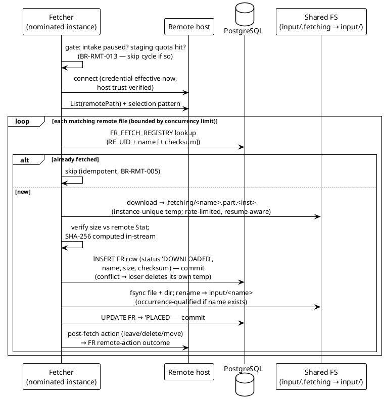
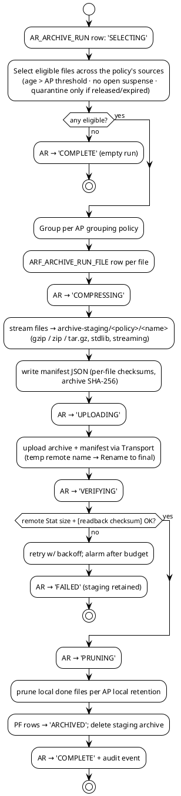

# 04 — Acquisition, Collection & Archiving (`RMT` · `COL` · `ARC`)

> Part of the [[00-index|baasparse TS]]. Previous: [[03-database-design]] · Next: [[05-decoding-and-canonical-record]]

This section designs the three modules that own the **file side** of the engine:

| Module | Package | Responsibility | BRS area |
|--------|---------|----------------|----------|
| **fetcher** | `internal/fetcher` | Pull files from remote SFTP/FTPS hosts into the source input directory | §6.1 `RMT` |
| **collector** | `internal/collector` | Detect, claim, and shepherd input files through the on-disk lifecycle | §6.2 `COL` |
| **archiver** | `internal/archiver` | Compress, offload, verify, and prune aged "done" files | §6.12 `ARC` |

Registry tables used (see [[02-conventions]] §2.2): `SRC_SOURCE`, `RE_REMOTE_ENDPOINT`,
`AP_ARCHIVE_POLICY`, `FR_FETCH_REGISTRY`, `PF_PROCESSED_FILE`, `FC_FILE_CLAIM`,
`SQ_SEQUENCE_ALLOCATOR`, `SJ_SCHEDULED_JOB`, `AR_ARCHIVE_RUN`, `ARF_ARCHIVE_RUN_FILE`,
plus `DL_DELIVERY` (owned by [[07-distribution-delivery]]) and `SU_SUSPENSE` (owned by
[[08-suspense-reconciliation-replay]]). Cluster-wide claim/lease semantics are shared with
[[11-ha-clustering-recovery]]; this section owns the **file-side** application of them.

---

## 4.1 Directory layout on the shared file area

Every directory the engine reads or writes is **explicit per-source configuration**
(`SRC_SOURCE`, §4.8), but the recommended layout — and the one config validation
defaults to — is:

```
<shared-root>/
  sources/<source-slug>/
    input/                  ← producers and the fetcher deliver here (BR-COL-001)
    input/.fetching/        ← fetcher partial-download staging (dot-dir: never scanned)
    in-progress/            ← files under an active claim (BR-COL-009/015)
    done/                   ← fully delivered files + completion markers (BR-COL-009)
    quarantine/             ← poison files, integrity-failed files (BR-COL-017/014)
    rejected/               ← duplicate re-arrivals, per disposition policy (BR-COL-006)
  archive-staging/<policy-slug>/   ← compressed archives awaiting upload (BR-ARC-*)
  out/<destination-slug>/          ← delivered output (owned by 07)
  divert/<destination-slug>/       ← overflow divert holding (owned by 07)
```

**Binding rules (validated at config publish and again at instance startup):**

1. Every configured input directory (`SRC_INPUT_DIRS` — a source declares **one or
   more**, `BR-COL-001`; the tree above shows the single-directory default), its
   `.fetching/` staging, `in-progress`, `done`, `quarantine`, and `rejected` for one
   source MUST live on the **same filesystem/mount** — the lifecycle transitions are
   `rename(2)` calls, which are atomic only within one filesystem. The startup check
   compares `unix.Stat_t.Dev` across all of these directories and refuses the source
   (config error alarm) on mismatch.
2. Temporary names are **dot-prefixed** (`.fetching/`, `.<name>.tmp`) so that directory
   scans and selection patterns (§4.4.3) can exclude them by a single rule: *no dotfile
   is ever a candidate*.
3. Directories are created by the engine if absent (mode from bootstrap config), audited.
4. **On-disk name disambiguation.** An `input/` name is unique only at a point in time —
   the same producer name can legitimately recur (occurrence-qualified re-offers,
   §4.3.3/§4.4.5), so `in-progress/`, `done/`, `quarantine/` and `rejected/` never key on
   the bare name. Every lifecycle move out of `input/` renames the file to a
   **file-UID-qualified name**: `<name>.__uid<PF_FILE_UID>` (the **business** file UID,
   [[02-conventions]] §2.5); the completion marker is
   `<name>.__uid<PF_FILE_UID>.done.json` (§4.4.10). The current expected on-disk path
   (directory + qualified name) is recorded on `PF_PROCESSED_FILE.PF_PATH` in the
   transaction that *precedes* each move (DB-intent-first), so every recovery path
   probes exact paths, never guesses among same-named files. Because the qualifier is
   globally unique, a lifecycle-rename target can only pre-exist through outside
   interference: the engine stats the target before every lifecycle rename, and an
   unexpectedly existing target is a **checked error** (file held in place, alarm) —
   never an implicit replace. Fetch placement *into* `input/` uses an
   **occurrence-qualified** name (`<name>.__occ<n>`, §4.3.4) when the target name
   already exists there. Scanners strip a trailing `.__occ<n>` qualifier before applying
   selection patterns and sequence extraction (§4.4.3/§4.4.6); `.__uid` qualifiers never
   appear in `input/`.

### NFS / cross-host atomicity considerations

The claim protocol never depends on filesystem locks (`ASM-3` — claiming is in
PostgreSQL), so NFS lock semantics are irrelevant to correctness. What the design *does*
lean on, and how each lean is made safe:

| Assumption | Reality on NFS | Design response |
|------------|----------------|-----------------|
| `rename(2)` is atomic | Atomic at the NFS server within one mount/filesystem | Same-mount rule (1) above; a file is always in exactly **one** lifecycle directory — recovery checks both ends of an interrupted move (§4.7) |
| A renamed file is immediately visible to other hosts | Visibility lags by the client **attribute/readdir cache** (`actimeo`, typically ≤ 30 s) | Detection is scan-based and latency-tolerant (`BR-COL-012`); the scan interval knob, not cache timing, is the contract for detection latency (`BR-NFR-008`). No decision ever hinges on *absence* of a file on another host — presence checks during recovery re-stat with a fresh handle |
| Durability of a placed file | Client-side write-back caching | The fetcher and every marker write `fsync` the file **and** its parent directory before the final rename (§4.3.4, §4.4.10) |
| Stability detection (size unchanged) | Attribute cache can serve stale sizes | Stability samples (`BR-COL-002`) are taken by **one** instance's scanner over ≥ N of its own consecutive scans, spaced by the scan interval — never by comparing sizes observed on different hosts; each sample uses a fresh `open()`+`fstat` (close-to-open revalidation, §4.4.2) so the answer cannot come from the attribute cache |
| `O_EXCL` / dotlock tricks | Historically unreliable on NFS | Not used anywhere; uniqueness comes from `FC_FILE_CLAIM` (§4.4.4) |

### Storage backends — the `storage.Store` seam (`BR-STO-001/002/004/005`)

The directory layout above describes **topology A**: a shared POSIX filesystem where the
lifecycle transitions are `rename(2)` calls. All record-file access in this section —
fetch placement, collection reads, the `input → in-progress → done` moves, and archive
offload — is routed through one consumer-defined **storage abstraction**, so the same
modules serve a **local/shared POSIX filesystem**, **SFTP/FTPS** remote hosts, and
**S3-compatible object storage** without change (`BR-STO-001/002`;
[[16-cloud-native-deployment]] §16.2 owns the seam). A record file — input, in-progress,
output, or archive — is identified by a **storage reference** `Ref{backend, root, key}`,
**never by its content in PostgreSQL** (`BR-NFR-009` preserved; the reference widens the
existing `PF_PATH`/marker columns, [[03-database-design]]).

```go
// storage.Store — the durable-substrate seam behind fetch / collect / archive.
type Ref struct {
    Backend string // "posix" | "sftp" | "s3"
    Root    string // bucket (s3) or base directory (posix/sftp)
    Key     string // object key or relative path
}

type Store interface {
    List(ctx context.Context, prefix Ref) ([]Entry, error)        // detection: scan a prefix
    Open(ctx context.Context, r Ref) (io.ReadCloser, error)       // streaming read (range-capable)
    Put(ctx context.Context, r Ref, body io.Reader, meta Meta) error // atomic write
    Stat(ctx context.Context, r Ref) (Entry, error)               // size/etag/mtime/exists
    Move(ctx context.Context, from, to Ref) error                 // lifecycle transition
    Delete(ctx context.Context, r Ref) error
}
```

| Backend | Detect (`List`) | Read (`Open`) | Write (`Put`) — atomic (`BR-STO-004`) | Lifecycle (`Move`) |
|---------|-----------------|---------------|----------------------------------------|--------------------|
| `posix` | `readdir` scan (`BR-COL-012`) | file read | temp-then-`rename(2)` | `rename(2)` (atomic, same mount) |
| `sftp` | remote `ls` | SFTP get (streamed, resumable) | SFTP put → remote rename | remote rename / move-to-done |
| `s3` | `ListObjectsV2(prefix)` poll | ranged `GetObject` | `PutObject`/multipart (**atomic by nature**) | server-side **copy + delete** (no native rename) |

- **Per source / per destination (`BR-STO-002`).** The backend + root is named in
  configuration per source and per destination (`SRC_STORAGE`/destination JSONB, §4.8);
  a deployment may **mix** them — e.g. SFTP ingest, S3 working prefixes, a *different* S3
  bucket for archive — or run entirely on shared POSIX. This keeps traditional
  SFTP/filesystem mediation fully supported alongside cloud object storage.
- **Atomic writes on every backend (`BR-STO-004`):** temp-then-rename on POSIX/SFTP,
  atomic `PutObject`/multipart-complete on S3 — a consumer never observes a partial file
  or object (satisfies `BR-DST-003`).
- **Security in transit and at rest (`BR-STO-005`):** TLS to remote/object backends
  (SFTP host-key/x509 trust §4.3.7) and at-rest encryption where the backend provides it
  (SSE-S3 / SSE-KMS on S3; `BR-NFR-050/055`).
- The SFTP/FTPS `Transport` of §4.3.1 is the remote-host realisation used by fetch and
  archive offload; the POSIX realisation is the direct filesystem calls of §4.1; the
  `s3` realisation adds object storage as a first-class backend (§4.2 topology B).

### Datasources — reusable, named storage connections (`BR-STO-002`)

The backend + root that `SRC_STORAGE` (§4.8) names per source is, operationally, a
**connection** an operator wants to reuse across many pipelines. `DSR_DATASOURCE`
(§4.8, `.db/schema.sql` §3.4.9) promotes that connection to a first-class, **named**
registry entity so it is defined once and selected by reference:

- **Connection only — no per-pipeline specifics.** A datasource holds a `posix` working
  directory (`Root`) **or** an `s3` endpoint + region + credentials — and deliberately
  **not** the S3 bucket (chosen per pipeline) nor the lifecycle sub-directories (derived
  per pipeline, below). Identity + kind are relational (`DSR_NAME`,
  `DSR_KIND ∈ {posix, s3}`); the connection blob — including the S3 secret key,
  encrypted through the same `internal/secret` AES-GCM path as the `SRC`/`PLV` JSONB
  (`BR-NFR-054`) — lives in `DSR_CONFIG`.
- **Reference, not copy.** A pipeline links a datasource **by id inside its
  `PLV_STAGE_GRAPH` document** — `Source.DatasourceID` (input), `Source.OutputDatasourceID`
  (output/done), `Source.OutputBucket` (per-pipeline S3 bucket) — so nothing FKs into
  `DSR_DATASOURCE`. The store **materialises** the reference at read time
  (`applyDatasources`, `internal/store/datasource.go`): the input datasource fills the
  source backend/root/credentials (`Source`), and a distinct output datasource becomes
  the pipeline's output/done destination (`OutputDest`). Inline-config pipelines
  (`DatasourceID = 0`) are left verbatim — the model is fully backward-compatible.
- **Soft delete.** `DSR_STATUS ∈ {ACTIVE, DISABLED}` with a partial-unique index
  `UX_DSR_NAME_ACTIVE (DSR_NAME) WHERE DSR_STATUS = 'ACTIVE'`; deleting a datasource sets
  `DISABLED` (never a row delete) so a pipeline still referencing it keeps resolving —
  config is data, never destroyed.
- Store surface `ListDatasources` / `GetDatasource` / `CreateDatasource` /
  `DeleteDatasource`, managed through the GUI's `/datasources` CRUD pages with a **Test
  connection** probe (a posix write/read/delete round-trip, or an S3 `ListBuckets`
  reachability check when the connection carries no bucket, a probe object when one is
  given — `storage.TestConnection`).

**Per-pipeline lifecycle prefix.** Because one datasource hosts many pipelines, each
pipeline's lifecycle areas default to a **pipeline-scoped prefix** under the datasource
root: `<slug(name)>-<id>/{input, in-progress, done, quarantine, output}`. The slug is
derived from the pipeline name (lower-cased, each run of non-alphanumerics collapsed to a
single `-`); the pipeline **id** is appended because `slug()` is not injective —
`cdr-in`, `cdr_in` and `cdr in` all slug to `cdr-in`, so without the id two distinct
pipelines could alias to the same directories and **double-process the same files**.
These are the relative keys/prefixes of §4.8 under the datasource's backend + root — real
directories on `posix`, object-key prefixes on `s3`.

**Cross-backend pipelines — read one datasource, write another (`BR-STO-002`).**
Selecting a **distinct** output datasource splits the data plane into a **source store**
(input, in-progress, quarantine) and a **dest store** (output, done, completion markers)
— e.g. read from S3, land done/output on a local filesystem. `Pipeline.CrossBackend()`
reports the split and `OutputDest` carries the resolved destination
(`internal/store/store.go`; data plane in `internal/watcher/watcher.go`,
`internal/runner/runner.go`). Because `Store.Move` is same-store only, the cross-store
lifecycle move is a new primitive `storage.Relocate(dst, dstKey, src, srcKey)`
(`internal/storage/ops.go`): a native `Move` when source and dest resolve to the same
store, otherwise a streamed `Put` (dest) then `Delete` (source) — the source is removed
only after the destination write succeeds, so an interrupted relocate never loses the
original (`BR-STO-004`). The store cache keys (`storage.SourceKey` / `DestKey`,
`internal/storage/resolve.go`) include endpoint | bucket | region | access-key | TLS, so
two datasources on the same bucket that authenticate differently resolve to **separate**
`Store` instances rather than silently sharing one.

**Filesystem auto-provisioning on pipeline create.** §4.1 rule 3 (the engine creates
absent directories) is realised eagerly for filesystem-backed pipelines: creating a
pipeline pre-creates its lifecycle tree via `storage.EnsureTree`, which writes a
dot-prefixed `.keep` marker into each directory so an operator can drop input files
immediately. Input/in-progress/quarantine are created on the **source** store,
done/output on the **dest** store. **Object-storage backends are skipped** — S3 prefixes
are virtual, so an empty prefix needs no `mkdir`. The hook runs after `CreatePipeline`
(`handlePipelineCreate → provisionDirs`, `internal/httpserver/datasource_handlers.go`)
and is best-effort: a provisioning error is logged, never fatal.

---

## 4.2 File lifecycle overview

```plantuml
@startuml file-lifecycle-ts
!theme plain
skinparam defaultTextAlignment center
skinparam state { BackgroundColor #E8F0FE BorderColor #4472C4 }

state "remote host" as R
state "input/.fetching\n(.part temp)" as T
state "input/" as I
state "in-progress/" as P
state "done/ (+ marker)" as D
state "quarantine/" as Q
state "rejected/" as X
state "archive-staging → remote archive" as A

[*] --> R : (remote sources)
R --> T : download + resume\n(BR-RMT-008)
T --> I : verify → fsync → rename\n(BR-RMT-004)
[*] --> I : (local/shared delivery)
I --> P : claim won → PF row (file UID)\n→ rename to .__uid-qualified name\n(BR-COL-004/005/009, §4.1 rule 4)
I --> X : duplicate re-arrival\n(BR-COL-006)
P --> D : all endpoints terminal\nmarker-then-move (BR-COL-009)
P --> Q : integrity fail (BR-COL-014)\nor poison max-attempts (BR-COL-017)
D --> A : age > threshold, no open suspense\ncompress → upload → verify → prune\n(BR-ARC-001/006/007)
Q --> A : operator-released or\nretention elapsed (BR-ARC-001)
A --> [*]
@enduml
```

The corresponding database state machine lives on `PF_PROCESSED_FILE.PF_STATUS`
(`COLLECTED → IN_PROGRESS → DONE | SUSPENDED | QUARANTINED | REJECTED_DUPLICATE → ARCHIVED`)
and `FC_FILE_CLAIM.FC_STATUS` (`HELD → RELEASED`; ownership and the fencing token ride
the `HELD` claim, which is released at **spool-complete** — not at done, §4.4.10),
column detail in [[03-database-design]]. Disk and DB are deliberately
redundant: the **on-disk completion marker** (§4.4.10) lets the startup DB↔disk
reconciliation (`BR-NFR-017`, [[11-ha-clustering-recovery]]) rebuild truth from either
side.

**Two realisations of one state machine (`BR-STO-003`).** The lifecycle above is defined
**abstractly** as PostgreSQL state (`PF_STATUS` + `FC_STATUS`) plus a backend-specific
realisation of each transition ([[16-cloud-native-deployment]] §16.3):

- **Topology A — local/shared POSIX FS (the default this section describes in full):**
  `input/ → in-progress/ → done/` are real directory `rename(2)` moves, every instance
  sees every file over the shared mount, and detection is a directory scan
  (`BR-COL-012`). SFTP is the same topology rooted on a remote host.
- **Topology B — S3 object storage (no shared filesystem, no ReadWriteMany volume,
  `BR-STO-003`):** the transitions are **authoritative PostgreSQL state + object
  placement**. The claiming instance streams its claimed object to **instance-local
  scratch**, processes it, and `Put`s outputs back; a "directory move" becomes an object
  **copy + delete** (S3 has no atomic rename) and the on-disk completion marker becomes a
  **done-marker object**; detection is `ListObjects` polling. Because `PutObject`/
  multipart completion is atomic and coordination stays in PostgreSQL, `PF_STATUS` is
  **authoritative** and object placement is a reconciled mirror (§4.7.3, `BR-STO-006`).

All exactly-once coordination (claim, lease, fence, dedup, collation working set,
reconciliation) stays in PostgreSQL on **both** topologies (`BR-HA-003`, `BR-COR-006`).
The subsections below specify topology A in full and note the topology-B realisation
where a mechanism differs — detection (§4.4.1), atomic output and the done move
(§4.4.10), archive offload (§4.5.5), and DB↔store reconciliation (§4.7.3).

---

## 4.3 Fetcher module (`internal/fetcher`)

### 4.3.1 Transport seam

One interface serves both fetch (`BR-RMT-001`) and archive offload (`BR-ARC-003`):

```go
// internal/fetcher/transport.go
type Transport interface {
    List(ctx context.Context, dir string) ([]RemoteFile, error) // name, size, mtime
    Open(ctx context.Context, path string, offset int64) (io.ReadCloser, error)
    Store(ctx context.Context, path string, r io.Reader) error  // upload (archiver)
    Stat(ctx context.Context, path string) (RemoteFile, error)
    Rename(ctx context.Context, from, to string) error          // post-fetch move; remote atomic-publish
    Delete(ctx context.Context, path string) error
    Close() error
}
```

- **SFTP** (`sftpTransport`): `golang.org/x/crypto/ssh` + `github.com/pkg/sftp`.
  Resume = `Open` with `sftp.Client.Open` + `Seek(offset)`.
- **FTPS** (`ftpsTransport`): `github.com/jlaffaye/ftp` with explicit TLS
  (`ftp.DialWithExplicitTLS`); resume = `RetrFrom(path, offset)` (`REST`).
- Plain FTP is **not constructible** — `RE_PROTOCOL` is `CHECK (RE_PROTOCOL IN ('SFTP','FTPS'))`
  (`BR-RMT-001`).
- **Object storage is a `storage.Store` backend, not an `RE_REMOTE_ENDPOINT` transport**
  (§4.1, `BR-STO-002`): an `s3`-backed source is detected and read directly through
  `List`/`Open` (§4.4.1), so it needs no fetch transport and no `.fetching/` staging.
  Fetch from a *remote* SFTP/FTPS host **into** an object-store input area is still
  supported — the download streams to instance-local scratch and is `Put` atomically to
  the source's `input/` prefix instead of `rename`d into a shared directory
  (`BR-STO-002/004`; topology B, §4.2).

Connections are held in a small per-endpoint pool, capped by the endpoint's concurrency
limit (§4.3.8); every operation takes `context.Context` so pause/shutdown cancels
transfers at the next read.

### 4.3.2 Poll scheduling and the nominated instance (v1 seam)

Each remote-fetching source has one row in `SJ_SCHEDULED_JOB`:
`SJ_KIND = 'FETCH'`, `SJ_SCOPE = <source root UID>`, `SJ_SCHEDULE` (cron or interval),
`SJ_INS_UID_NOMINATED` = the **nominated instance** (`BR-RMT-012` v1 seam,
`BR-HA-010`), plus the lease columns (`SJ_INS_UID_LEASE`, `SJ_LEASE_EXPIRES_ON`,
`SJ_FENCE`) that v2's dynamic lease activates without schema change.

At runtime each instance loads the enabled `FETCH` jobs and runs only those where
`SJ_INS_UID_NOMINATED` matches its own registration. Correctness never depends on the nomination:
if two instances ever poll the same source (mis-nomination, config race during
hot-reload), the **already-fetched guard** (§4.3.3) makes the second download a no-op —
wasted bandwidth, never a duplicate file (`BR-RMT-012`). If the nominated instance is
down, fetch for that source stalls; that is surfaced by feed-liveness monitoring
(`BR-OPS-007`) rather than silently — automatic failover is the v2 upgrade.

A poll cycle for one source:



### 4.3.3 Already-fetched guard — `FR_FETCH_REGISTRY` (`BR-RMT-005`)

One row per acquired remote file: `FR_RE_UID`, `FR_SRC_UID`, `FR_REMOTE_NAME`
(endpoint-path-qualified — path relative to `RE_REMOTE_PATH` including the source's
fetch subpath, [[03-database-design]] §3.5.3), `FR_SIZE_BYTES`, `FR_CHECKSUM`
(SHA-256 computed while streaming the download; `NOT NULL` — known before the row is
written), `FR_STATUS` (`DOWNLOADED → PLACED`), `FR_REMOTE_ACTION` outcome,
`FR_FETCHED_ON`. Unique index `UX_FR_RE_NAME (FR_RE_UID, FR_REMOTE_NAME, FR_CHECKSUM)` —
the guard IS name+checksum: a double-poll of the same bytes conflicts (idempotent); a
same-name re-offer with different bytes inserts as a new arrival.

Guard semantics, per source policy `fetch.refetchPolicy`:

- **`name`** (default): a listed remote file whose name has an `FR` row is skipped.
- **`name+checksum`**: a name match with a **different remote size/mtime** triggers a
  re-download to temp; if the computed checksum differs from the registered one, the file
  is **auto-fetched as a new arrival** (new `FR` row — same `FR_REMOTE_NAME`, different
  `FR_CHECKSUM`, admitted by the name+checksum guard — placed under an
  occurrence-qualified local name recorded in `FR_LOCAL_NAME`, e.g. `<name>.__occ2`,
  §4.3.4/§4.1 rule 4; collector-side duplicate policy then decides its
  fate, §4.4.5). Same checksum → skip, `FR` row touched with a `re-offered` audit event.

The guard holds across polls, restarts, and accidental double-polling (`BR-RMT-012`).
`FR` rows are retained per the processed-file metadata retention policy (`BR-CMP-002`) —
far longer than any legitimate remote re-offer horizon.

### 4.3.4 Download, integrity verification, atomic placement (`BR-RMT-004`)

1. Download streams to `input/.fetching/<name>.part.<instanceId>` through a chain:
   `Transport.Open → rate-limited reader (§4.3.8) → io.TeeReader(sha256) → *os.File`,
   copy buffer from the pooled-buffer allocator ([[14-performance-sizing]]). The temp
   name is **instance-unique**: two instances polling the same source (mis-nomination,
   config race during hot-reload) can never write to the same temp file, so neither can
   corrupt the byte stream the other is hashing.
2. On EOF: compare bytes written against the remote `Stat` size (re-statted after
   download — a growing remote file fails verification and is retried next poll,
   `ASM-9`); where the endpoint publishes checksum sidecars
   (`fetch.remoteChecksum: {suffix: ".sha256"}`), verify against the sidecar too.
3. `f.Sync()`, close, `fsync` the parent directory.
4. Register `FR` (`DOWNLOADED`), **commit** — the `FR` insert is the **placement gate**:
   `UX_FR_RE_NAME` admits exactly one row per (remote file, checksum) — two racing
   downloaders of the same remote file stream the same bytes and compute the same
   checksum, so exactly one commits; the **loser's insert conflicts and it deletes its
   own temp** —
   its bytes are never placed. The winner then renames its own temp into `input/`:
   target `<name>`, or the occurrence-qualified `<name>.__occ<n>` when that name already
   exists in `input/` (earlier unclaimed arrival, `leaveMarked` resident, or a re-offer,
   §4.3.3); the placed name is recorded on the `FR` row. The collector can only ever see
   a complete, verified file (`BR-RMT-004`); update `FR` to `PLACED`.

**DB-before-rename ordering** makes every crash window recoverable without duplication
(walk-through in §4.7.1): the `FR` row is the durable record that a verified byte-stream
exists locally; recovery completes the rename instead of re-downloading.

**Tee-hash safety.** Each instance's in-stream SHA-256 covers exactly the bytes of its
**own** instance-unique temp, and only the `FR` winner's temp is ever renamed into
`input/` — so `FR_CHECKSUM` always describes the placed bytes, with no re-verification
pass against the placed file needed. (The gate ordering, not a second read, is what
makes the single-pass tee hash trustworthy.)

### 4.3.5 Post-fetch remote action (`BR-RMT-006`)

Per source, `fetch.onFetched`: `leave` (default) | `delete` | `move:<remote-done-dir>`.
The operative action is the **endpoint-level default** on `RE_REMOTE_ENDPOINT`
(`RE_POST_FETCH`, with `RE_REMOTE_DONE_PATH` for `move`), overridden per source when
`SRC_FETCH_POLICY` carries `onFetched`.
Executed after `FR` reaches `PLACED`. A failed remote action does **not** un-fetch the
file: the outcome is recorded on `FR_REMOTE_ACTION` (`PENDING/OK/FAILED`), retried on
subsequent polls, and alarmed after the retry budget — the already-fetched guard keeps a
lingering remote copy harmless (`BR-RMT-005`).

### 4.3.6 Retry, backoff, resume (`BR-RMT-008`)

- **Transient failures** (connect, TLS, mid-transfer I/O): exponential backoff with full
  jitter, `base 5 s → cap 5 min`, within and across poll cycles; classified by error type
  (net timeouts, `io.ErrUnexpectedEOF`, SSH disconnects).
- **Resume**: a surviving temp is resumed **only by the instance that owns it**
  (`.part.<instanceId>`, §4.3.4) by appending from `len(.part)` via
  `Open(path, offset)` (SFTP seek / FTPS `REST`); another instance's orphaned temp is
  never adopted — it is pruned by age (only its owner could ever have placed it). The
  end-to-end SHA-256 cannot be
  resumed mid-stream, so on resume the fetcher **re-hashes the local prefix from disk**
  (sequential local read — cheap relative to WAN transfer) and continues the hash over
  the appended remote bytes. Final verification is therefore always a full-file
  checksum; any corruption of the prefix or a remote-side change fails verification and
  forces a clean full re-fetch (`.part` discarded).
- **Permanent failures** (auth rejection, host-trust failure, remote path gone) skip
  backoff escalation and raise an alarm immediately (`BR-OPS-008`) with the endpoint and
  cause; the poll keeps its schedule so recovery is automatic once the operator fixes
  the cause (`R7`).

### 4.3.7 Host-key and certificate verification (`BR-RMT-009`)

- **SFTP**: `RE_TRUST` carries pinned host key(s) (OpenSSH `known_hosts` format, or a
  secret ref); the SSH client uses `ssh.FixedHostKey` / a multi-key matcher — never
  `ssh.InsecureIgnoreHostKey`. First-connection capture is an explicit operator action
  in the GUI ("trust this key", RBAC-gated, audited), not automatic TOFU.
- **FTPS**: standard x509 verification via `crypto/tls` against the system root pool, or
  a pinned CA/leaf in `RE_TRUST`. `tls.Config.InsecureSkipVerify` is not reachable from
  configuration; the only relaxation is pinning a self-signed cert explicitly (audited).
- Auth: password or SFTP private key (`BR-RMT-003`), both sourced as **secret
  references** resolved through the secrets mechanism (`BR-NFR-054`,
  [[13-security-compliance]]) — never plaintext in `RE_REMOTE_ENDPOINT`.

### 4.3.8 Concurrency and bandwidth limits (`BR-RMT-010`)

Per endpoint (`RE_LIMITS` JSONB): `maxConcurrentTransfers` (weighted semaphore across
all sources sharing the endpoint — one remote host is never hit by more parallel
sessions than configured, whichever sources it serves) and `bandwidthBytesPerSec`
(token bucket via `golang.org/x/time/rate` wrapping the download/upload reader; shared
per endpoint). The archiver's uploads draw from the **same** limiter (§4.5.5), so fetch
and offload jointly respect the host budget.

### 4.3.9 Scheduled credential rotation (`BR-RMT-011`)

`RE_CREDENTIALS` is a JSONB **list** of credential versions:

```json
[
  {"secretRef": "secret://sftp/voice-key",    "effectiveFrom": "2026-01-01T00:00:00Z"},
  {"secretRef": "secret://sftp/voice-key-v2", "effectiveFrom": "2026-08-01T00:00:00Z"}
]
```

- Connect-time selection picks the entry with the latest `effectiveFrom ≤ now()`; prior
  entries are retained (temporal config, `BR-CFG-009`) so in-flight transfers opened
  under the old credential are unaffected — cutover applies to **new** connections only.
- Uploading a credential version is RBAC-gated and audited; the secret body goes to the
  secrets store, only the reference lands in config (`BR-NFR-054`).
- **Failed cutover**: an auth failure on the first post-cutover connection raises a
  dedicated `TRANSFER_FAILURE` alarm (credential-rotation context: endpoint, credential version — [[12-observability-operations]] §12.5) instead of
  the generic transient-retry path — loudly, immediately (`BR-RMT-011`). The fetcher
  keeps retrying the *effective* credential (no silent fallback: falling back would mask
  the failed rotation); the operator remedy is fixing the secret or end-dating the new
  version, both live config actions.

### 4.3.10 Backpressure coupling and staging quota (`BR-RMT-013`)

Before each poll cycle **and** between individual downloads, the fetcher evaluates two
gates:

1. **Intake gate** — the same gate the collector's scanner honours: source paused by an
   operator (`BR-OPS-001`) or by the store-and-forward overflow policy *pause intake*
   (`BR-DST-017`, [[07-distribution-delivery]]). Gate state is read from the active
   `OS_OPERATIONAL_STATE` rows covering the source ([[12-observability-operations]]
   §12.1) via the config/control cache;
   fetch pauses with the intake and resumes automatically with it. A pause mid-file lets
   the current download finish into `.fetching/` but does not rename it into `input/`
   until the gate reopens (nothing new is offered to a stalled pipeline).
2. **Staging quota** — per source, `fetch.stagingQuota: {maxFiles, maxBytes}` bounds the
   *fetched-but-not-yet-claimed* population: files in `input/` (plus `.fetching/`),
   counted from the scanner's directory listing cache. On reaching the bound: fetching
   for the source pauses, a `STAGING_QUOTA` alarm is raised (`BR-OPS-008`), and
   the usage is exported as a disk-pressure metric (`BR-OPS-015`). Fetch resumes when
   usage drops below a hysteresis threshold (default 80 % of the bound).

Pausing loses nothing: files stay on the remote host (`ASM-8`) and the already-fetched
guard holds across the pause (`BR-RMT-005`). State-aware alert suppression for the
deliberately-stalled source follows `BR-OPS-017` ([[12-observability-operations]]).

---

## 4.4 Collector module (`internal/collector`)

### 4.4.1 Detection: scan loop + optional inotify (`BR-COL-012`)

One **scanner goroutine per source** lists each of the source's configured input
directories (`SRC_INPUT_DIRS` — one or more, `BR-COL-001` — plus configured
subdirectories) every `collection.scanIntervalMs` (default 2 000 ms, `SRC_COLLECTION_POLICY`) using
`os.ReadDir`. The claimed name (`FC_FILE_NAME`) is qualified by the declaring input
directory (declared-directory ordinal + relative path), so identical names offered
through different configured directories are distinct claims. The scan interval is *the* detection-latency knob on shared storage
(`BR-NFR-008`) — cross-host `inotify` does not fire for other hosts' writes on NFS, so
the scan is primary, not a safety net.

Where a source's input directory is declared **instance-local**
(`collection.local: true`), an `inotify` watch (`IN_MOVED_TO | IN_CLOSE_WRITE` via
`golang.org/x/sys/unix`; Linux-only per `CON-13`) supplements the scan for sub-second
detection. Both paths feed the same candidate function; idempotency is guaranteed by
the candidate insert (§4.4.4), so a file seen by scan **and** inotify — or by scanners
on three hosts — is still claimed exactly once (`BR-COL-004`).

Scanners skip sources whose intake gate is closed (pause/overflow/readiness hold/
fail-closed) — detection continues (cheap listing for metrics) but no candidates are
offered.

**Object-store detection (topology B, `BR-STO-003`).** Where the source's working area
is an object-store backend, the scanner lists via `Store.List` =
`ListObjectsV2("input/…")` polling instead of `os.ReadDir`; the poll interval is the same
detection-latency knob (`scanIntervalMs`, `BR-NFR-008`) and the candidate/claim path
(§4.4.4) is byte-for-byte identical — the claim is still a PostgreSQL `FC_FILE_CLAIM`
insert, so exactly-once holds with **no shared filesystem**. Cross-host `inotify` has no
object-store analogue, so `List` polling is primary (as it already is on NFS).
Completeness (§4.4.2) uses `marker` (a companion marker object) or object-`Stat`
stability; the mount attribute-cache reasoning is POSIX-specific and simply does not
apply — strongly-consistent object `List`/read removes it.

### 4.4.2 Completeness detection (`BR-COL-002`)

Per source, `collection.completeness` selects one of:

| Mode | Mechanism | When to use |
|------|-----------|-------------|
| `rename` (default) | Producer writes a dot-/`.tmp`-named temp and renames; the scanner's dotfile/temp-pattern exclusion means anything visible is complete (`ASM-1`) | Producers with atomic-delivery contracts (incl. our own fetcher) |
| `marker` | File is a candidate only when `<name><markerSuffix>` (default `.done`) exists; the marker is consumed (deleted) at claim time | Producers that signal with trigger files |
| `stability` | Candidate only after size is unchanged for `intervals` (default 3) consecutive scans **by the same scanner instance**; **each sample is taken via a fresh `open()`+`fstat` on a new file handle** (NFS close-to-open revalidation — a cached attribute answer can never fake stability); tracked in the scanner's in-memory candidate cache. Config validation requires `intervals × scanIntervalMs` to **exceed the mount's attribute-cache lifetime** (`actimeo`/`acregmax`, declared per shared-storage mount in bootstrap config), so a stability verdict can never complete inside one cache window. On instance loss the count restarts elsewhere — costing latency, never correctness | Producers with no atomicity contract (fallback, `ASM-1` "if wrong") |

### 4.4.3 File selection (`BR-COL-003`)

`collection.select` JSONB: `{"glob": "*.ber*"}` and/or `{"regex": "^MSC01_\\d{8}_(\\d{6})\\.ber$"}`,
optional `subdirs: true`. Glob via `path/filepath.Match`; regex via compiled `regexp`
(cached per config version). The regex's capture groups double as the **sequence
extraction** hook (§4.4.6). Non-matching files are ignored (visible in a per-source
`unmatched_files` metric so a mis-pattern is noticeable).

### 4.4.4 The claim protocol (`BR-COL-004`, `BR-HA-003/004`)

The heart of exactly-once file ownership. Cluster mechanics (instance registry,
heartbeat cadence, lease tuning) are specified in [[11-ha-clustering-recovery]]; this
section owns the file-side protocol.

`FC_FILE_CLAIM` carries: `FC_SRC_UID`, `FC_FILE_NAME`, `FC_STATUS` (`HELD|RELEASED`),
`FC_INS_UID` (owner), `FC_EXPIRES_ON` (lease), `FC_FENCE` (fencing token), `FC_PF_UID`
(null until collected), `FC_CHECKPOINT_OFFSET`/`FC_CHECKPOINT_RECORD` + `FC_CHECKPOINT`
JSONB (`BR-NFR-013`), `FC_PATH` (current lifecycle directory), and the poison-guard
columns `FC_CHECKPOINT_PREV`/`FC_STALL_COUNT` (§4.4.12). Partial unique index
`UX_FC_SRC_NAME_HELD (FC_SRC_UID, FC_FILE_NAME) WHERE FC_STATUS = 'HELD'`.

**Step 1 — claim insert (any instance, idempotent):**

```sql
INSERT INTO FC_FILE_CLAIM (FC_SRC_UID, FC_FILE_NAME, FC_INS_UID, FC_STATUS,
        FC_EXPIRES_ON, FC_PATH, ...)
VALUES ($1, $2, $me, 'HELD', now() + $leaseTTL, 'INPUT', ...)
ON CONFLICT (FC_SRC_UID, FC_FILE_NAME) WHERE FC_STATUS = 'HELD' DO NOTHING
RETURNING FC_UID, FC_FENCE;   -- no row → owned elsewhere: move on
```

Duplicate detection events (two scanners, scan+inotify, scanners on three hosts)
collapse here — the insert **is** the claim, exactly one wins, and the winner carries
`FC_FENCE` into every later file-scoped write ([[03-database-design]] §3.9.1; an
earlier draft's separate lease-less *candidate* state was folded into this insert at
consolidation).

**Step 2 — collect (one transaction, `BR-COL-005`):** run the duplicate re-arrival
check (§4.4.5), then allocate the file UID, create the processed-file record and its
reconciliation-summary row **atomically** (this is transaction 2 of the two-transaction
claim/collect protocol — claim insert is tx 1 — mirrored in [[03-database-design]]
§3.9.1):

```sql
BEGIN;
UPDATE SQ_SEQUENCE_ALLOCATOR SET SQ_LAST_VALUE = SQ_LAST_VALUE + 1, ...
 WHERE SQ_NAME = 'FILE_UID' RETURNING SQ_LAST_VALUE;     -- serialised, contiguous
INSERT INTO PF_PROCESSED_FILE (PF_FILE_UID /* = SQ_LAST_VALUE */, PF_SRC_UID, PF_NAME,
        PF_SIZE_BYTES, PF_SEQUENCE_NO, PF_STATUS /*'COLLECTED'*/, PF_ATTEMPT_COUNT /*1*/,
        PF_PATH /* 'in-progress/<name>.__uid<PF_FILE_UID>' — move intent, §4.1 rule 4 */, ...);
INSERT INTO RS_RECONCILIATION_SUMMARY (RS_PF_UID, ...);  -- zeroed conservation row
UPDATE FC_FILE_CLAIM SET FC_PF_UID = ..., FC_PATH = 'IN_PROGRESS'
 WHERE FC_UID = $fc AND FC_INS_UID = $me AND FC_FENCE = $fence AND FC_STATUS = 'HELD';
COMMIT;
```

Because the counter update commits **with** the `Collected` record, the file UID is
unique and contiguous under normal operation — a gap is a meaningful lost-file signal,
not allocator noise (`BR-COL-005`). The serialised allocator row is negligible at the
v1 envelope (`BR-NFR-005`).

**Step 3 — move to in-progress (strictly *after* the step-2 commit):**
`rename(input/<name>, in-progress/<name>.__uid<PF_FILE_UID>)` — the UID-qualified
target was recorded as move intent on `PF_PATH` in step 2 (§4.1 rule 4); the target is
stat-checked first, and an unexpectedly existing file there is a checked error, never a
replace. The file is then handed to a worker from the bounded pool (§4.4.11).
DB-intent-first ordering means a crash between step 2 and the rename is recovered by the
takeover logic (file located by probing `PF_PATH` and the input-side name, §4.7.3).

**Heartbeat lease renewal:** the instance's claim coordinator runs one renewal goroutine
batching all held claims:

```sql
UPDATE FC_FILE_CLAIM
   SET FC_EXPIRES_ON = now() + $leaseTTL, FC_HEARTBEAT_ON = now()
 WHERE (FC_UID, FC_FENCE) IN (($u1, $f1), ($u2, $f2), ...)  -- per-claim (uid, fence) pairs
   AND FC_INS_UID = $me AND FC_STATUS = 'HELD';
```

The predicate is **per-claim `(FC_UID, FC_FENCE)` pairs** — never `FC_FENCE = ANY(...)`
— so a single advanced fence surfaces as exactly that row's miss, not as an ambiguous
shortfall across the batch.

every `leaseTTL/3` (defaults: TTL 30 s, renew 10 s — tunables in
[[11-ha-clustering-recovery]]). A renewal that updates fewer rows than held, or fails
because a fence advanced, means **the lease was lost**: the affected worker's context is
cancelled immediately and it must produce **no further side effects**. Renewal failure
from an unreachable primary triggers fail-closed quiescence at the last checkpoint
(`BR-NFR-019`).

**Fencing:** every takeover increments `FC_FENCE`. All file-scoped writes a worker
makes **during the processing pass** (checkpoints, spool/delivery-record creation,
reconciliation totals, the claim-releasing final checkpoint) carry
`... AND FC_FENCE = $myFence` so a paused-then-resumed zombie worker (GC pause, NFS
stall) cannot commit against a file another instance now owns (`R13`). The fence's
guard duty ends at spool-complete when the claim is released; post-release done-gating
is PF-row-serialised instead (§4.4.10, [[02-conventions]] §2.2 decision note 3).

**Lease expiry & takeover (`BR-HA-004`, `BR-COL-015`):** every instance's sweeper
periodically claims expired leases (and adopts **gracefully released** claims whose `PF`
row is non-terminal — drain, operator stop, fail-closed quiescence release without
abandoning the file):

```sql
SELECT FC_UID FROM FC_FILE_CLAIM
 WHERE FC_STATUS = 'HELD' AND FC_EXPIRES_ON < now()
 FOR UPDATE SKIP LOCKED;
UPDATE FC_FILE_CLAIM SET FC_INS_UID = $me, FC_FENCE = FC_FENCE + 1,
       FC_CHECKPOINT_PREV = FC_CHECKPOINT,          -- stall-comparison input (§4.4.12)
       FC_EXPIRES_ON = now() + $leaseTTL;
UPDATE PF_PROCESSED_FILE SET PF_ATTEMPT_COUNT = PF_ATTEMPT_COUNT + 1 ...;  -- audit counter (§4.4.12)
```

Before adopting, the sweep checks the source's `OS_OPERATIONAL_STATE` intake-liveness —
an operator *stop* sticks; a stopped source's files wait for the operator, not the
sweep ([[11-ha-clustering-recovery]] §11.2). Adoption of a *released* claim advances
the fence like any takeover but does **not** run the stall comparison and does not set
`FC_CHECKPOINT_PREV` — only lease-**expiry** takeovers (abnormal termination) feed the
poison guard (§4.4.12). The taking instance then runs the poison-guard check (§4.4.12)
and, if clear, resumes the file from its checkpoint (§4.4.13). No file is ever
stranded: any surviving instance can take any expired claim.

### 4.4.5 Duplicate re-arrival rejection (`BR-COL-006`)

Inside the collect transaction (step 2), before the `PF` row is created:

- **Name check** (always): `PF_PROCESSED_FILE` lookup on `(PF_SRC_UID, PF_NAME)` over
  terminal statuses. Hit → the arrival is a re-delivery.
- **Checksum policy** (`collection.duplicate: "name" | "name+checksum"`): under
  `name+checksum`, a name hit additionally compares checksums — requiring a streaming
  SHA-256 pre-pass over the new arrival (one extra sequential read; the per-source
  policy opts into that cost). Same checksum → duplicate; different → treated as a
  legitimately re-used filename and collected as a **new file** (its `PF_NAME` stored
  with an occurrence qualifier). Under plain `name`, a name hit is always a duplicate.
  A **content** duplicate under a *new name* is additionally caught when the in-stream
  checksum completes: under policy `name+checksum` the file's spooled outputs are
  **delivery-held** — its `DL_DELIVERY` rows stay `SPOOLED`, not claimable for
  publishing, until the end-of-decode file verdict commits (the per-file delivery-hold
  gate, implemented in [[07-distribution-delivery]]) — so a rejected content duplicate
  publishes nothing.

A rejected duplicate: `PF` row inserted with `PF_STATUS = 'REJECTED_DUPLICATE'` (audited
rejection event, `BR-AUD-001` — never silent), file moved to `rejected/` (default) or
deleted per `collection.duplicateDisposition`; `rejected/` usage is a monitored,
age-pruned disk area (`BR-OPS-015`).

### 4.4.6 Sequence-gap detection (`BR-COL-007`)

Where the source carries file sequence numbers, `collection.sequence` declares the
extraction: `{"from": "filename", "regexGroup": 1}` or
`{"from": "trailer", "field": "fileSeq"}` (trailer-sourced values are checked at decode
time, [[05-decoding-and-canonical-record]]). On collection commit (step 2):

- `PF_SEQUENCE_NO` is recorded; the expected next value is `max(PF_SEQUENCE_NO)+1` for
  the source (indexed lookup `IX_PF_SRC_SEQ`, cheap at v1 volumes).
- A **gap** (arrival > expected) raises a `SEQUENCE_GAP` alarm naming the missing
  range and records a reconciliation exception (`BR-REC-003`); a late arrival of a
  missing number auto-resolves the alarm's range entry (`BR-OPS-011` lifecycle).
- A **sequence duplicate** (same number, different file) raises its own alarm — distinct
  from name/checksum duplication.

This is the file-level completeness control for the loss reconciliation cannot see
(upstream-of-collection loss); sources without sequences rely on feed-liveness
(`BR-OPS-007`) and expected-vs-received reconciliation (`BR-REC-003`), recorded in the
source contract (`DEP-5`).

### 4.4.7 Streaming bounded reader (`BR-COL-008`)

A file worker never holds more of the file than its buffer chain:

```go
f, _ := os.Open(inProgressPath)               // *os.File
h := sha256.New()
var r io.Reader = io.TeeReader(bufio.NewReaderSize(f, cfg.ReadBufBytes), h) // default 256 KiB
r = maybeDecompress(r, f, src)                 // §4.4.8 — still streaming
// → decoder consumes r record-at-a-time (BR-DEC-006)
```

Memory per in-flight file = read buffer + decoder window + stage batch buffers — a
function of configuration, never file size (`BR-NFR-001`). The in-stream hash yields
`PF_CHECKSUM` for the completion marker and re-arrival guard without a second pass.
`PF_CHECKSUM` is populated at end-of-stream and is **nullable until then** (a fetched
file's `FR_CHECKSUM` exists earlier, from the download tee); a takeover's re-stream
recomputes the hash identically from byte 0 (§4.4.13), so the single-pass property
survives crashes.

### 4.4.8 Input decompression (`BR-COL-013`)

`collection.decompress: "none" | "auto" | "gzip" | "zip"` (`auto` by extension):

- **`.gz`** — `compress/gzip.NewReader` wraps the stream transparently; fully streaming.
- **`.zip`** — `archive/zip` needs random access (central directory at EOF); it reads via
  the `*os.File`'s `io.ReaderAt` — no in-memory load. Default expectation is a
  **single-entry** archive (the common telco pattern); multi-entry archives are
  processed entry-by-entry in central-directory order under the same file UID when
  `decompress.multiEntry: "sequential"`, otherwise routed to suspense as a file-level
  integrity failure.

Checkpoint note: the checkpoint records the **record ordinal** (plus the logical-stream
byte offset, diagnostic only); takeover resume always **re-streams from the start with
emission suppressed** up to the ordinal (§4.4.13) — compression changes nothing,
because no resume path seeks.

**As built (alpha) — multi-member archive containers, and the phased plan.**
The alpha extends this section with **tar.gz containers**: one collected object
holding *many* member CDR files (`internal/container`). Format choice is driven by
streamability — **tar.gz is the streaming-read format** (gzip and tar are both
sequential; memory stays bounded at the gzip window + read buffer regardless of
archive size), whereas true zip cannot be purely streamed on principle (its central
directory sits at EOF; it needs `io.ReaderAt` — trivial on POSIX, ranged GETs on S3).
Semantics as built:

- **Config**, in the input Format Definition: `container: "" | "targz"` plus a
  `memberGlob` matched against each member's **base name** (default `*`). The
  container is a layer *above* the decoder seam: members are decoded by the
  pipeline's ordinary DSV/JSON/XML decoder, one fresh decoder per member, one
  shared encoder session across members (one output, header written once).
- **Unit of work = the archive**: one claim/lease, one `PF` row, one done/quarantine
  move, one completion marker (which records the member count). Member-level detail
  aggregates into the file-scope reconciliation counts.
- **Error semantics**: a member that fails to decode quarantines the **whole
  archive** with the member named in the reason (`DECODE_ERROR: member "x.csv": …`)
  — an archive is one blob and cannot be split for quarantine. Extract-bad-member-
  and-continue is a v2 refinement.
- **Safety limits** (decompression-bomb guards, enforced on the fly while
  streaming; breach → quarantine with `ARCHIVE_LIMIT_EXCEEDED`): max member count,
  max per-member decompressed bytes, max total decompressed bytes
  (`BAASPARSE_ARCHIVE_MAX_{MEMBERS,MEMBER_BYTES,TOTAL_BYTES}`). Only regular-file
  members are read (symlinks/devices skipped); member names are never used as
  filesystem paths; **no recursion** into nested archives.
  - The total guard meters the **whole decompressed stream** — tar headers,
    padding, and the bodies of members we never hand to the decoder — not just
    record bytes, and every regular-file entry counts toward the member cap
    whether or not it matches `memberGlob`. This is load-bearing: tar is
    sequential, so the reader must decompress a member's body to reach the next
    header. Metering only *selected* members would let an archive hide its payload
    behind a name the pipeline does not select and inflate without bound. The
    counter therefore sits **below** the tar reader, where no byte can get past it.
  - The gzip trailer (CRC32/ISIZE) is read at end-of-archive, so a **truncated or
    corrupted** archive fails instead of completing as a short, clean run.
- **Error attribution.** A failing input stream must not be misread as bad
  content. Decoders manufacture parse errors out of bytes they read cleanly;
  stream failures (limit breach, torn object read, cancellation) pass *through*
  the reader, so the runner captures them at that seam and classifies on the cause,
  not on whatever the decoder made of the truncation. A `LimitError` stays
  `ARCHIVE_LIMIT_EXCEEDED`; a structurally broken archive (bad gzip header/CRC,
  malformed tar) is content and quarantines; **any other stream failure is
  transient and retried** rather than condemning a file that is probably fine.

**Phasing** (input side; output phasing in [[07-distribution-delivery]] §7.3):
phase 1 (built) = `targz` containers + plain single-stream `.gz`; phase 2 = resume
checkpoint per member on the claim; phase 3 = **zip input** via `io.ReaderAt`
(POSIX native; S3 via ranged reads), superseding this section's single-entry-zip
expectation with proper multi-entry support.

### 4.4.9 Integrity/authenticity check (`BR-COL-014`)

Optional per pipeline, `collection.integrity`:

- `{"mode": "checksum", "manifestSuffix": ".sha256"}` — verify the in-stream hash
  against a producer-supplied sidecar/manifest (verified at end of the streaming pass,
  before any delivery is confirmed).
- `{"mode": "signature", "alg": "pgp"|"ed25519", "keyRef": "secret://..."}` — detached
  signature verified streaming (PGP via the maintained `ProtonMail/go-crypto` fork of
  `x/crypto/openpgp`; `ed25519` via stdlib for partners who can produce it).

Failure is a **file-level** suspense outcome with reason `COL_INTEGRITY_CHECK_FAILED`
(`BR-ERR-001`; reason codes per the [[02-conventions]] §2.3 registry): file moved to
`quarantine/<name>.__uid<PF_FILE_UID>` (§4.1 rule 4), `PF_STATUS = 'QUARANTINED'`,
alarm raised. For sources with an integrity check configured — and likewise
`duplicate: name+checksum` content-duplicate detection (§4.4.5) — the file's spooled
outputs are held at the **per-file delivery-hold gate**: `DL_DELIVERY` rows remain
`SPOOLED`, not claimable for publishing, until the file-level verdict commits
([[07-distribution-delivery]] implements the hold). A failed verdict therefore
publishes nothing from the file. Sources *without* such checks trade the hold away and
stream deliveries as they spool.

### 4.4.10 In-progress → done: lifecycle, marker, dispositions (`BR-COL-009/010`)

A file reaches **done** only when **every** fan-out endpoint is terminal for every
record (`BR-DST-008/010`): each `DL_DELIVERY` row for the file is `delivered` (or
`confirmed` where a receipt callback is configured, `BR-DST-016`) **or** `diverted`
(recorded, re-sendable, reconciled as not-delivered — `BR-DST-017`). For **collating**
pipelines, a record is file-terminal once its window membership is durably committed to
the working set (`BR-COR-006`) — delivery of the eventual aggregate belongs to the
window, not the file; the marker records those records as *contributed/open*.
Record-level suspense does not block done (the record is terminally accounted; the file
stays reprocessable on disk per `BR-ERR-008`); **file-level** failures never reach done.

**Claim lifetime vs done.** The FC claim does **not** live until done. The processing
pass ends at **spool-complete**: every record is terminally accounted (spooled to its
destinations, contributed to windows, suspended, or discarded) and the final checkpoint
plus reconciliation totals are committed — at that point the file worker **releases the
claim** (`FC_STATUS = 'RELEASED'`; the final checkpoint is the release record).
Store-and-forward delivery does not hold the claim: publishing spooled outputs is the
delivery executors' job ([[07-distribution-delivery]]). Done-gating is therefore *not*
fence-guarded — it is **PF-row-serialised** (below).

**Done sequence (marker-first, PF-row-serialised):** executed by whichever **delivery
executor terminalises the LAST `DL_DELIVERY` row** for the file (guarded by its DL
lease), backstopped by a periodic **done-gate sweep** that re-runs the same gate for
files whose deliveries are all terminal but whose `PF` is not yet `DONE` (covers an
executor crash between terminalising the last DL row and this sequence, and closes the
race where two executors each believe the other holds the last row). Where every DL row
is already terminal at spool-complete (zero-record files, divert-everything cases), the
file worker itself is the "last terminaliser" and runs the same sequence before
releasing the claim.

1. `SELECT … FOR UPDATE` on the `PF` row with the **status precondition**
   (`PF_STATUS` not yet `DONE`) — this row lock is the serialisation point: a
   concurrent executor or sweep blocks here, then sees `DONE` and no-ops. The FC fence
   plays no part — the claim was released at spool-complete.
2. Verify in one query, under the lock, that all `DL_DELIVERY` rows are terminal and
   suspense/recon totals are committed.
3. Compose the **completion marker** and write it to
   `done/.<name>.__uid<PF_FILE_UID>.done.json.tmp` → `fsync` file + dir → rename to
   `done/<name>.__uid<PF_FILE_UID>.done.json`.
4. `rename(in-progress/<name>.__uid<PF_FILE_UID>, done/<name>.__uid<PF_FILE_UID>)` —
   target stat-checked first; an unexpectedly existing target is a checked error, never
   a replace (§4.1 rule 4).
5. Commit the done transaction: `PF_STATUS = 'DONE'` (open record-level suspense does
   not change the status — the file stays disk-pinned via the open-`SU` check,
   `BR-ERR-008`), `PF_PATH` advanced to the done path, final reconciliation totals
   (`RS_RECONCILIATION_SUMMARY`). No `FC` write occurs here.

Marker-first means: *a data file in `done/` always has its marker*; a marker without its
file is an unambiguous recovery breadcrumb (§4.7.3). File and marker share the same
`.__uid` qualifier, so recurring producer names never collide in `done/` and every
marker unambiguously names its file.

**Object-store realisation (topology B, `BR-STO-003/004`).** On an object-store backend
the same marker-first, PF-row-serialised sequence holds with these substitutions: every
output write in the processing pass is an atomic `PutObject`/multipart-complete, so a
consumer never sees a partial object (`BR-DST-003`); step 3's marker is a **done-marker
object** written by atomic `PutObject` (`…/done-markers/<fileUID>.json`, the same manifest
payload below); and step 4's `rename` becomes `Store.Move` = server-side **copy + delete**
of the source object from the `input/` to the `done/` prefix (S3 has no atomic rename).
Because there is no atomic rename, **PostgreSQL `PF_STATUS` is authoritative** and the
object placement is a reconciled mirror — marker-first still guarantees a `done/` object
always has its marker object, and the DB↔store reconciliation (§4.7.3, `BR-STO-006`)
repairs a move interrupted between the PG commit and the copy+delete. Suspense-pinned
files (`BR-ERR-008`) are retained cheaply as durable objects rather than pinning local
disk.

**Completion marker format** (`BR-COL-009`, consumed by the `BR-NFR-017` DB↔disk
reconciliation):

```json
{
  "markerVersion": 1,
  "fileUid": 184467,
  "source": "voice-cdr-eu",
  "name": "MSC01_20260704_000123.ber",
  "size": 1073741824,
  "sha256": "9f2c…",
  "sequenceNo": 123,
  "pipelineVersion": 42,
  "counts": { "decoded": 1250000, "delivered": 1249100, "discarded": 400,
              "suspended": 500, "duplicates": 0,
              "contributedToAggregates": 0, "openInWindows": 0 },
  "outcome": "Completed",
  "deliveries": [
    { "destination": "billing", "state": "delivered", "outputSeq": 991,
      "outputs": ["billing_000991.dsv"] },
    { "destination": "fraud",   "state": "diverted",  "holdingRef": "divert/fraud/…" }
  ],
  "instance": "engine:inst-a",
  "engineVersion": "1.3.0",
  "completedAt": "2026-07-04T10:15:04Z",
  "markerSha256": "…"
}
```

(`fileUid` is the **business** `PF_FILE_UID` — the lineage/marker/log correlation key
of [[02-conventions]] §2.5 and the value in the on-disk `.__uid` qualifier — never the
surrogate `PF_UID`. `markerSha256` is a self-hash over the preceding fields — the
validity check the DB↔disk reconciliation applies before trusting a marker,
[[11-ha-clustering-recovery]] §11.8; `markerVersion` keeps the format readable across
one adjacent engine version.)

**Alternative dispositions** (`BR-COL-010`, `collection.disposition`):

- `done` (default) — as above.
- `delete` — steps 1–3 unchanged (the marker, `<name>.__uid<PF_FILE_UID>.done.json`,
  is still written to `done/` as a tombstone manifest, preserving disk-side
  reconciliation), then the file is unlinked instead of moved. Blocked while the file
  has open suspense (`BR-ERR-008`) — the disposition silently degrades to `done` and an
  advisory event is recorded.
- `leaveMarked` — the marker is written **alongside the file in `input/`**, as
  `<name>.done.json` (unqualified: the file never leaves `input/` or gains a `.__uid`
  qualifier, and the scanner's exclusion match is by name); the scanner excludes any
  file whose marker exists. Used for shared directories the producer also curates —
  name reuse in such a directory is the producer's contract.

### 4.4.11 Concurrency caps (`BR-COL-011`)

Two nested bounds: a **global** file-worker pool per instance
(`maxConcurrentFiles`, memory-budget-derived, [[14-performance-sizing]]) and a
**per-source** cap (`collection.maxConcurrentFiles` in `SRC_COLLECTION_POLICY`, semaphore) so one bursty source cannot
starve the rest. The claim coordinator only attempts claims while it holds a slot in
both — files it doesn't claim remain claimable by other instances (natural load
spreading).

### 4.4.12 Poison-file protection (`BR-COL-017`)

Two mechanisms, never conflated: a record that fails **gracefully** goes to suspense
and the stream continues (`BR-DEC-007`, `BR-VAL-002`) — that path is owned by the
pipeline stages. This section owns **abnormal termination** (panic/OOM/kill), where the
offending record is frequently not identifiable:

1. **Attempt counter** — `PF_ATTEMPT_COUNT` increments on every claim and takeover
   (`BR-HA-004`); worker-boundary `recover()` converts an in-process panic into a
   recorded attempt failure where possible ([[02-conventions]] §2.3). It is an **audit
   counter of all claims/takeovers** — never itself the quarantine driver.
2. **Checkpoint-stall comparison** — on a **lease-expiry takeover** (abnormal
   termination), the sweeper compares the claim's checkpoint against the checkpoint
   recorded at the *previous* expiry takeover (`FC_CHECKPOINT_PREV`): unchanged
   progress increments a stall counter (`FC_STALL_COUNT`); any advance resets it.
   **Graceful releases** (drain, operator stop, fail-closed quiescence) neither run the
   comparison nor count toward quarantine (§4.4.4). Attempts alone don't condemn a
   file — only failing *at the same point* does; `FC_STALL_COUNT` is the sole
   quarantine driver.
3. **Record-skip — only if unambiguously identifiable.** When
   `FC_STALL_COUNT ≥ stallSkipThreshold` (default 2) **and** the decoder for the format
   reports the record at the checkpoint as unambiguously delimitable
   (`decoder.CanIsolate(checkpoint)` — true for line-framed NDJSON/DSV, fixed-length
   records, and cleanly-length-prefixed ASN.1 TLV; false where framing is itself
   corrupt), that single record is routed to suspense with reason
   `COL_POISON_RECORD_SKIPPED` ([[02-conventions]] §2.3 registry) and processing
   continues past it.
4. **File-level quarantine** — otherwise, when `FC_STALL_COUNT ≥`
   `collection.maxAttempts` (default 3, per source in `SRC_COLLECTION_POLICY`;
   Open Q11) — i.e. the attempt budget is exhausted **without checkpoint advance**;
   attempts that advanced the checkpoint never condemn a file: file renamed to
   `quarantine/<name>.__uid<PF_FILE_UID>` (§4.1 rule 4), `PF_STATUS = 'QUARANTINED'`,
   `FC_STATUS = 'RELEASED'` (**not re-claimable** — the file has left `input/` and the
   terminal `PF` status guards re-collection, breaking the crash-loop, `R21`),
   reconciliation records the `INDETERMINATE_COUNT` state (records confirmed to the
   checkpoint, remainder unknown — `BR-REC-001/008`), and a `POISON_QUARANTINE`
   alarm is raised. The file is retained on disk under quarantine retention
   (`BR-CMP-002`) and has a defined archive path (§4.5.2).

### 4.4.13 In-progress recovery on takeover (`BR-COL-015`)

After a takeover (§4.4.4) passes the poison guard, the new owner drives the file to
completion — never stranded, never restarted blindly:

1. **Locate** the file by `PF_PATH` (the exact expected path — UID-qualified outside
   `input/`, §4.1 rule 4) and, if absent there, at the adjacent lifecycle directory
   under the name form that stage implies (interrupted-move recovery, §4.7.3); re-stat
   with a fresh handle to defeat NFS attribute caching.
2. **Resume by re-stream** (`FC_CHECKPOINT`): takeover resume always **re-streams the
   file from the start** and **suppresses emission** up to the checkpointed record
   ordinal — there is **no seek-based resume** for any input stacking (plain,
   decompressed, charset-transformed). Re-decode is deterministic
   ([[05-decoding-and-canonical-record]] §5.2.6) and cheap relative to correctness;
   suppression is by record ordinal, so the checkpoint's byte offset is diagnostic, not
   load-bearing. Because the re-stream recomputes the full-file SHA-256 from byte 0,
   every single-pass hash/checksum claim (§4.4.7 `PF_CHECKSUM`, integrity verification
   §4.4.9, content-duplicate detection §4.4.5) holds unchanged across takeover.
3. **Idempotent re-run** of the checkpoint tail: any records after the checkpoint that
   were already partially processed are absorbed by the dedup store (`BR-DUP-002`),
   deterministic output identity + idempotent RDBMS upsert (`BR-DST-013/018`), and
   atomic file-output finalisation ([[07-distribution-delivery]]) — no loss, no
   duplication (`BR-NFR-011/012`).
4. Spool processing continues under the new fence through spool-complete and claim
   release; delivery and the done gate then proceed executor-driven per §4.4.10 (not
   fence-guarded).

Cluster-side detail (who sweeps, detection latency budgets) in
[[11-ha-clustering-recovery]].

### 4.4.14 Zero-record files (`BR-COL-016`)

A file whose decode yields zero records is **always accepted and recorded**
(`PF` counts = 0, audited) — never an error unless configured. Per
`collection.zeroRecordFile`:

- `{"emitEmptyOutput": true}` — the distribution stage produces empty outputs (header/
  trailer only, where configured — `BR-DST-020`) to each endpoint; the file follows the
  normal done lifecycle with real delivery records.
- `{"emitEmptyOutput": false}` (default) — the file is acknowledged straight to done
  with a zero-count marker.
- `{"treatAsError": true}` — opt-in only: routed to suspense (some feeds define an empty
  file as a fault signal).

---

## 4.5 Archiver module (`internal/archiver`)

Scheduled housekeeping over `done/` (and, per policy, `quarantine/`), reusing the
fetcher's `Transport` for offload. Runs as `SJ_SCHEDULED_JOB` rows
(`SJ_KIND = 'ARCHIVE'`, one per `AP_ARCHIVE_POLICY`, `SJ_SCHEDULE` cron), on the
nominated instance in v1 (`BR-ARC-004`, `BR-HA-010` seam — same nomination and lease
columns as fetch, §4.3.2). Every step is idempotent, so an accidental duplicate run
wastes work but never loses data (`R32`).



### 4.5.1 Selection (`BR-ARC-001`)

For each source referencing the policy: list `done/`, join markers/`PF` rows, and select
files whose done-timestamp is older than `AP_AGE_DAYS`, **excluding**:

- files with **open suspense** — `EXISTS (SELECT 1 FROM SU_SUSPENSE WHERE SU_PF_UID = PF_UID
  AND SU_STATUS IN ('OPEN','REPROCESSING') AND SU_SE_UID IS NULL)` — escrowed entries
  do not pin ([[08-suspense-reconciliation-replay]] §8.3.1); a suspense-pinned file is never archived or pruned
  (`BR-ERR-008`); its pinned bytes are exported as the suspense-pinned disk metric
  (`BR-OPS-015`). Where the optional per-record escrow (`BR-ERR-011`,
  [[08-suspense-reconciliation-replay]]) has escrowed all of a file's open entries, the
  pin lifts and the file becomes eligible.
- files already `ARCHIVED` (idempotency across duplicate runs).

### 4.5.2 Quarantined-file eligibility (`BR-ARC-001`)

Where `AP_INCLUDE_QUARANTINED = true`, the selection also scans `quarantine/`: a
quarantined file is eligible only when **operator-released** (an RBAC-gated release
action stamping the `PF` row) **or** its configured quarantine retention
(`BR-CMP-002`) has elapsed — and never while open suspense pins it. This gives
quarantine a defined offload path instead of indefinite residence outside housekeeping.
Archived quarantined files keep `PF_STATUS = 'QUARANTINED'` semantics in reconciliation
(`BR-REC-008`); the `ARF` row records the quarantine provenance.

### 4.5.3 Grouping, naming, compression (`BR-ARC-002/005`)

`AP_GROUPING` JSONB — `{"by": ["day","source"]}` etc. — buckets the selection;
`AP_NAME_TEMPLATE` (e.g. `"{source}_{yyyyMMdd}.tar.gz"`) names each archive.
`AP_COMPRESSION ∈ {gzip, zip, tar.gz}` via stdlib (`compress/gzip`, `archive/zip`,
`archive/tar`) — all written **streaming** (source file → tar/zip writer → gzip writer →
staging file), bounded memory regardless of archive size. `gzip` (single file per
archive) is valid only where grouping yields one file per bucket; config validation
enforces this. Completion markers are archived **with** their data files — member names
are the on-disk qualified names (`<name>.__uid<fileUid>` and
`<name>.__uid<fileUid>.done.json`, §4.1 rule 4) — so an offloaded archive is
self-describing and collision-free even when producer names recur.

### 4.5.4 Integrity manifest (`BR-ARC-010`)

Alongside each archive, `<archiveName>.manifest.json`:

```json
{
  "archive": "voice-cdr-eu_20260627.tar.gz",
  "sha256": "ab31…",
  "createdAt": "2026-07-04T02:00:11Z",
  "policy": "voice-archive",
  "files": [
    { "name": "MSC01_20260627_000101.ber", "fileUid": 180221,
      "sha256": "9f2c…", "size": 812345678 }
  ]
}
```

Per-file checksums come from `PF_CHECKSUM` (computed in-stream at collection, §4.4.7);
the archive-level SHA-256 is computed while streaming the compressed output. The
manifest is uploaded after the archive and recorded on `AR_ARCHIVE_RUN`.

### 4.5.5 Transfer and verify-before-prune (`BR-ARC-003/006`)

Upload reuses `RE_REMOTE_ENDPOINT` + `Transport` (§4.3.1) — same credential handling,
rotation, host trust, and per-endpoint concurrency/bandwidth limiters as fetch. The
archive is uploaded to a dot-prefixed temp remote name, then `Rename`d to its final
name, so the archive host never sees a partial file under the final name.

**Verification, before any local prune** (`BR-ARC-006`): mandatory remote `Stat` — size
must equal the local staging archive — plus, per `AP_VERIFY_MODE`:

- `"size"` — size match only (upload already ran over a checksummed TLS stream).
- `"readback"` (default) — re-download the remote archive through a hashing reader and
  compare against the manifest's archive SHA-256. Costs a second transfer of the
  compressed bytes; at the v1 envelope that is an acceptable price for
  integrity-over-everything (§ TS ground rule 1). Deployments with constrained WAN links
  opt down to `"size"` explicitly.

Verification failure → the run parks `FAILED`, local files and the staging archive are
**retained untouched**, retry per §4.5.7.

**Object-store backends (topology B, `BR-STO-002/006/007`).** Where the source's working
area and/or the archive destination is an object-store backend, `done/` selection lists
via `Store.List` (`ListObjects`); the compressed archive is written by atomic
`PutObject`/multipart to the archive `Root`/prefix (a *distinct* bucket is common); and
verify-before-prune (`BR-ARC-006`) re-`Get`s the archive object for the `readback` mode.
Pruning is a `Store.Delete` of the source objects after verify, with the done-marker
object retained for the marker-retention window so DB↔store reconciliation can still
explain absent objects (`BR-STO-006`). The staging area may itself be an object prefix,
**bounded and monitored by object count/bytes** analogous to the disk-pressure metric
(`BR-STO-007`, `BR-OPS-015`).

### 4.5.6 Local retention and pruning (`BR-ARC-007`)

`AP_LOCAL_RETENTION` JSONB: `{"deleteAfterUpload": true}` or `{"keepDays": N}`. Pruning
unlinks the data file but **keeps the completion marker** in `done/` for the marker
retention period (default = processed-file metadata retention) so the DB↔disk
reconciliation can still explain absent files (`BR-NFR-017`). Deferred pruning
(`keepDays`) is executed by later runs from `AR`/`ARF` records (`PF_STATUS='ARCHIVED'`
and offload age), not by re-verifying the remote. Replay of a pruned file is an
operator re-add (`ASM-14`).

### 4.5.7 Retries and alerts (`BR-ARC-008`)

Compression or transfer failures retry with the standard backoff **inside** the run up
to a per-run budget, then the run records `FAILED` and the next scheduled run resumes
idempotently: an existing staging archive whose manifest matches the current selection
is re-uploaded rather than rebuilt; an already-verified archive is never re-uploaded
(the run skips to pruning). Repeated failures (`N` consecutive failed runs, default 3)
raise an `TRANSFER_FAILURE` alarm (archive-offload context) (`BR-OPS-008`). The archiver runs entirely
outside the file-worker pool — a stalled archive never blocks mediation. Staging usage
(`archive-staging/`) is bounded by policy and exported as a disk-pressure metric
(`BR-OPS-015`, `ASM-10`); a full staging area pauses archive runs with an alarm, never
mediation.

### 4.5.8 Audit — `AR_ARCHIVE_RUN` / `ARF_ARCHIVE_RUN_FILE` (`BR-ARC-009`)

`AR_ARCHIVE_RUN`: policy ref (`AR_AP_UID`), schedule fire time, phase/outcome
(`SELECTING → COMPRESSING → UPLOADING → VERIFYING → PRUNING → COMPLETE | FAILED`),
archive name, size, archive SHA-256, destination endpoint, error detail, instance.
`ARF_ARCHIVE_RUN_FILE`: one row per included file (`ARF_AR_UID`, `ARF_PF_UID`, name,
size, checksum, quarantine provenance, prune outcome). Both feed `AE_AUDIT_EVENT`
entries (`BR-AUD-001`) and the GUI's archive history view.

---

## 4.6 Module wiring (Go)

```go
// cmd/baasparse wiring (excerpt)
fetch := fetcher.New(fetcher.Deps{
    Endpoints: configsvc.RemoteEndpoints(),  // RE_REMOTE_ENDPOINT (temporal)
    Registry:  fetcher.NewRegistry(pool),    // FR_FETCH_REGISTRY
    Jobs:      cluster.Jobs(),               // SJ_SCHEDULED_JOB (nominated, v1)
    Gate:      controlsvc.IntakeGate(),      // BR-RMT-013(a)
    Secrets:   secrets.Resolver(),
    Alerts:    alerting.Raiser(),
})
coll := collector.New(collector.Deps{
    Sources: configsvc.Sources(),            // SRC_SOURCE (temporal)
    Claims:  cluster.FileClaims(),           // FC_FILE_CLAIM protocol (§4.4.4)
    Files:   collector.NewFileStore(pool),   // PF_PROCESSED_FILE + SQ allocator
    Workers: pipeline.WorkerPool(),          // bounded, BR-COL-011
    Gate:    controlsvc.IntakeGate(),
})
arch := archiver.New(archiver.Deps{
    Policies:  configsvc.ArchivePolicies(),  // AP_ARCHIVE_POLICY
    Transport: fetch.Transports(),           // shared RE transports + limiters
    Runs:      archiver.NewRunStore(pool),   // AR / ARF
    Jobs:      cluster.Jobs(),
})
```

Consumer-defined interfaces keep the seams inverted per [[02-conventions]] §2.3; the
fetcher and archiver share transports so endpoint limits bind jointly (§4.3.8).

---

## 4.7 Failure-mode walk-throughs

All scenarios assume the invariants of §1.5 ([[01-architecture]]): PostgreSQL is the
source of coordination truth, disk carries content plus completion markers, and every
recovery step is idempotent.

### 4.7.1 Instance dies mid-download (fetcher)

State: `input/.fetching/<name>.part.<instanceId>` exists; `FR` row absent, or present
as `DOWNLOADED`.

- v1: fetch for the source stalls until the nominated instance returns (or the operator
  re-nominates via config) — surfaced by feed-liveness (`BR-OPS-007`); no other instance
  polls (v2 lease removes this gap).
- On the next poll: **no `FR` row** → the returning owner resumes **its own** temp
  (§4.3.6) or, on checksum mismatch, discards and re-fetches — the file was never
  visible to collection, so nothing downstream happened. A dead-and-re-nominated
  instance's orphaned temp is never adopted; it ages out (§4.3.6) and the new nominee
  fetches afresh. **`FR = 'DOWNLOADED'`** → recovery re-verifies the local bytes:
  complete owned temp matching `FR_CHECKSUM` → finish the rename
  (occurrence-qualified target if the name now exists, §4.3.4) and mark `PLACED`; file
  already in `input/` or already collected (a `PF` row matches name+checksum) → just
  mark `PLACED`; nothing usable → delete the `FR` row and re-fetch. Every branch
  converges with zero duplicate acquisition (`BR-RMT-005`).

### 4.7.2 Instance dies mid-scan / mid-claim (collector)

- Died between detection and the claim insert: nothing persisted; any scanner
  re-detects next interval.
- Died inside the claim-insert transaction: the row (and its lock) dies with the
  connection; the next scanner's insert wins cleanly.
- Died after the claim committed but before the collect transaction (§4.4.4 step 2):
  the claim is `HELD` with a running lease and **no `PF` row**; on lease expiry the
  takeover sweep (fence advanced) re-runs collection from the top (allocate UID, insert
  `PF`) — the file UID consumed by the dead attempt, if any, was never committed
  (step 2 is one transaction), so contiguity holds.

### 4.7.3 Instance dies mid-move

Renames are atomic, so the file is in exactly **one** of the two directories; the DB
records intent (`PF_PATH` names the exact UID-qualified target, §4.1 rule 4), so
recovery probes the two exact paths and finishes the journey. Before spool-complete the
recovering actor is the **claim takeover**; after the claim is released (§4.4.10) it is
the **done-gate sweep** or the startup DB↔disk reconciliation:

- **input → in-progress** (after collect commit): takeover finds the collect committed
  (`PF_PATH = 'in-progress/<name>.__uid<uid>'`) but the file still at `input/<name>`
  (the claimed name) → performs the rename and proceeds. Reverse ambiguity cannot
  arise (the path intent is only advanced in the commit *preceding* the move), and the
  UID-qualified target cannot collide with a later same-named arrival.
- **in-progress → done** (§4.4.10): four interruption windows, all recovered by the
  done-gate sweep (or DB↔disk reconciliation after a DB restore, `BR-NFR-017`) —
  1. after delivery-terminal verification, before marker write: the sweep re-verifies
     in the DB (cheap) and redoes from step 2;
  2. marker `done/<name>.__uid<uid>.done.json` written, file still in `in-progress/`:
     marker present + DB says all deliveries terminal → complete the rename (the
     marker is the breadcrumb, and its `.__uid` names exactly which file it belongs to);
  3. file renamed to `done/`, done transaction not committed: `PF` not `DONE` but
     file+marker in `done/` → the sweep/reconciliation trusts the marker and commits
     the terminal transaction — the file is **not** reprocessed;
  4. done transaction committed, crash after: nothing left to do.

**Object-store realisation (topology B, `BR-STO-006`).** On an object-store backend the
same interrupted-move recovery runs over `Store` operations, but PostgreSQL `PF_STATUS`
is authoritative, so recovery reconciles **DB ↔ object `List` + done-marker objects**
rather than DB ↔ directory. A `Move` interrupted after the `copy` but before the `delete`
leaves the object in **both** prefixes; the copy target is idempotent (same key + bytes)
and the reconciliation completes the `delete`, so no file is lost or duplicated. The
startup DB↔store reconciliation (`BR-NFR-017`, generalised in
[[16-cloud-native-deployment]] §16.3) uses `ListObjects` + done-marker objects exactly as
topology A uses a directory scan + on-disk markers.

### 4.7.4 Instance dies mid-archive-upload

`AR_ARCHIVE_RUN` is parked in `UPLOADING`; the staging archive and all local `done`
files are intact (pruning is strictly last, `BR-ARC-006`). The next scheduled run (v1:
nominated instance back up) finds the incomplete run, re-verifies: remote temp object
partial/absent → re-upload from staging (remote temp name + `Rename` means the final
remote name never held a partial); remote final object present and verification passes →
skip to pruning. A duplicate concurrent run (mis-nomination) is harmless: verify-before-
prune gates every destructive step, and re-uploading over the remote temp name is
idempotent (`R32`, `BR-HA-010`).

---

## 4.8 Configuration surface

Column-level DDL lives in [[03-database-design]]; temporal behaviour
(`effective_from`/`end_date`, draft→publish, hot reload) in
[[09-configuration-management]]. The fields below are the behavioural contract of this
section — relational where reconciliation/queries need them, JSONB where declarative
(`CON-3`).

### `SRC_SOURCE`

| Field | Type | Drives |
|-------|------|--------|
| `SRC_NAME` | TEXT | identity (unique per live source); directory-layout defaulting (§4.1) |
| `SRC_INPUT_DIRS` | JSONB | **one or more** input directories (`BR-COL-001` "one or more"); each scanned per §4.4.1, each same-mount-validated with the lifecycle directories (§4.1); the fetcher places into the first-declared directory |
| `SRC_IN_PROGRESS_DIR`, `SRC_DONE_DIR`, `SRC_QUARANTINE_DIR`, `SRC_REJECTED_DIR` | TEXT | lifecycle directories (`BR-COL-001/009/015`); same-mount validation (§4.1) |
| `SRC_FILE_PATTERN` | TEXT | glob/regex selection (`BR-COL-003`) |
| `SRC_RE_UID` | FK → RE | fetch endpoint (null = local-only source) (`BR-RMT-002`) |
| `SRC_AP_UID` | FK → AP | archive policy (null = no archiving) (`BR-ARC-001`) |
| `SRC_COLLECTION_POLICY` | JSONB | `select` subdir option (`BR-COL-003`) · `completeness` (rename/marker/stability, `BR-COL-002`) · `local` (inotify opt-in, `BR-COL-012`) · `scanIntervalMs` (detection-latency knob, `BR-NFR-008`) · `maxConcurrentFiles` (per-source cap, `BR-COL-011`) · `maxAttempts` (poison threshold, `BR-COL-017`) · `duplicate` + `duplicateDisposition` (`BR-COL-006`) · `sequence` extraction (`BR-COL-007`) · `decompress` (`BR-COL-013`) · `integrity` (`BR-COL-014`) · `zeroRecordFile` (`BR-COL-016`) · `disposition` (`BR-COL-010`) |
| `SRC_FETCH_POLICY` | JSONB | `remotePath` + `match` (`BR-RMT-002`) · `onFetched` override of `RE_POST_FETCH` (`BR-RMT-006`) · `refetchPolicy` (`BR-RMT-005`) · `remoteChecksum` sidecar (`BR-RMT-004`) · `stagingQuota` (`BR-RMT-013(b)`); the poll schedule lives on the source's `SJ_SCHEDULED_JOB` `FETCH` row (`SJ_SCHEDULE`, `BR-RMT-007`) |
| `SRC_STORAGE` | JSONB | storage backend + root for the source's working area — `{"backend": "posix"\|"sftp"\|"s3", "root": "<dir-or-bucket>"}` (`BR-STO-002`; default `{"backend":"posix"}` = topology A). The lifecycle-directory fields above are the relative **keys/prefixes** under this backend + root (real directories on `posix`/`sftp`, object-key prefixes on `s3`); atomic writes and the `input → in-progress → done` move are realised per backend (§4.1, `BR-STO-004`) |

The `SRC_STORAGE` backend + root may be supplied **inline** (as above) or **by
reference** to a reusable `DSR_DATASOURCE` (§4.1 "Datasources"): a pipeline names a
datasource id inside its `PLV_STAGE_GRAPH` document and the store materialises it into
`SRC_STORAGE` at read time, so inline sources remain valid and unchanged.

### `DSR_DATASOURCE` (reusable storage connections)

| Field | Type | Drives |
|-------|------|--------|
| `DSR_NAME` | TEXT | identity — unique among live datasources (`UX_DSR_NAME_ACTIVE (DSR_NAME) WHERE DSR_STATUS='ACTIVE'`) |
| `DSR_KIND` | TEXT CHECK (`posix`/`s3`) | connection backend (`BR-STO-002`) |
| `DSR_CONFIG` | JSONB | connection only — posix `root`, or s3 `endpoint`+`region`+credentials (S3 secret key encrypted via `internal/secret`, `BR-NFR-054`); **no bucket** (per-pipeline) and no lifecycle prefixes (derived per pipeline, §4.1) |
| `DSR_STATUS` | TEXT CHECK (`ACTIVE`/`DISABLED`) | soft-delete — a `DISABLED` datasource still resolves for referencing pipelines (config never destroyed) |
| `DSR_CREATED_BY/ON`, `DSR_MODIFIED_BY/ON` | TEXT / TIMESTAMPTZ | audit |

Pipeline-side reference fields (in `PLV_STAGE_GRAPH`, materialised by `applyDatasources`):
`datasourceId` (input), `outputDatasourceId` (distinct output/done backend → cross-backend,
§4.1), `outputBucket` (per-pipeline S3 bucket). No table FKs into `DSR_DATASOURCE`.

### `RE_REMOTE_ENDPOINT`

| Field | Type | Drives |
|-------|------|--------|
| `RE_NAME` | TEXT | identity (shared by fetch and archive offload) |
| `RE_PROTOCOL` | TEXT CHECK (`SFTP`/`FTPS`) | transport selection (`BR-RMT-001`) |
| `RE_HOST`, `RE_PORT` | TEXT/INT | connection (`BR-RMT-002`) |
| `RE_CREDENTIALS` | JSONB | ordered credential versions `{secretRef, effectiveFrom}` — auth (`BR-RMT-003`) + scheduled rotation (`BR-RMT-011`) |
| `RE_TRUST` | JSONB | pinned SSH host keys / x509 CA or leaf pins (`BR-RMT-009`) |
| `RE_LIMITS` | JSONB | `maxConcurrentTransfers`, `bandwidthBytesPerSec` (`BR-RMT-010`) — bind fetch **and** archive jointly |

### `AP_ARCHIVE_POLICY`

| Field | Type | Drives |
|-------|------|--------|
| `AP_NAME` | TEXT | identity |
| `AP_AGE_DAYS` | INT | eligibility threshold (`BR-ARC-001`) |
| `AP_COMPRESSION` | TEXT CHECK (`GZIP`/`ZIP`/`TAR_GZ`) | archive format (`BR-ARC-002`) |
| `AP_GROUPING`, `AP_NAME_TEMPLATE` | JSONB/TEXT | batching + naming (`BR-ARC-005`) |
| `AP_RE_UID`, `AP_REMOTE_PATH` | FK → RE / TEXT | offload destination (`BR-ARC-003`) |
| `AP_SCHEDULE` | TEXT (cron) | run cadence via `SJ_SCHEDULED_JOB` (`BR-ARC-004`) |
| `AP_VERIFY_MODE` | TEXT CHECK (`SIZE`/`READBACK`) | verify-before-prune rigor (`BR-ARC-006`) |
| `AP_LOCAL_RETENTION` | JSONB | prune-now vs keep-N-days (`BR-ARC-007`) |
| `AP_INCLUDE_QUARANTINED` | BOOL | quarantine offload path (`BR-ARC-001`) |
| `AP_MANIFEST` | BOOL (default true) | integrity manifest emission (`BR-ARC-010`) |

### `SJ_SCHEDULED_JOB` (fetch + archive rows)

`SJ_KIND` (`FETCH`/`ARCHIVE`/…), `SJ_SCOPE` (source / policy root UID), `SJ_SCHEDULE`,
`SJ_ENABLED`, `SJ_INS_UID_NOMINATED` (v1 nominated instance — `BR-RMT-012`,
`BR-HA-010`), plus dormant-in-v1 lease columns `SJ_INS_UID_LEASE`,
`SJ_LEASE_EXPIRES_ON`, `SJ_FENCE` (the v2 seam: dynamic lease election activates with
**no schema change**, BRS §10.6).

---

## 4.9 Observability hooks (summary)

Detailed in [[12-observability-operations]]; emitted by these modules: fetch cycle
duration/bytes, staging-quota usage (`BR-RMT-013`), per-source detection latency
(file-mtime → claim), unmatched-file count (§4.4.3), claim age and takeover count,
in-progress/done/quarantine/rejected/archive-staging directory usage (`BR-OPS-015`; on an
object-store backend, the equivalent bounded/monitored working-prefix object count/bytes,
`BR-STO-007`), suspense-pinned bytes (`BR-ERR-008`), sequence-gap alarms (`BR-COL-007`), archive run
outcomes and backlog of over-age unarchived files.

---

## 4.10 BRS coverage

| Requirement | Where satisfied |
|-------------|-----------------|
| BR-RMT-001 | §4.3.1 (SFTP/FTPS transports; plain FTP unconstructible) |
| BR-RMT-002 | §4.3.2, §4.8 (`SRC_FETCH_POLICY`, `RE_REMOTE_ENDPOINT`) |
| BR-RMT-003 | §4.3.7, §4.8 (secret refs, password/key auth) |
| BR-RMT-004 | §4.3.4 (verify → fsync → atomic rename) |
| BR-RMT-005 | §4.3.3 (`FR_FETCH_REGISTRY` guard), §4.7.1 |
| BR-RMT-006 | §4.3.5 (post-fetch leave/delete/move) |
| BR-RMT-007 | §4.3.2 (`SJ_SCHEDULE` per source) |
| BR-RMT-008 | §4.3.6 (backoff, resume, permanent-failure alarms) |
| BR-RMT-009 | §4.3.7 (host-key pinning, x509 verification) |
| BR-RMT-010 | §4.3.8 (per-endpoint semaphore + token bucket) |
| BR-RMT-011 | §4.3.9 (effective-from credential versions, cutover alarm) |
| BR-RMT-012 | §4.3.2 (v1 nominated instance; idempotence via §4.3.3; v2 lease seam) |
| BR-RMT-013 | §4.3.10 (intake-gate coupling, staging quota + alarm) |
| BR-COL-001 | §4.1, §4.4.1 (local/shared dirs, incl. fetch-fed) |
| BR-COL-002 | §4.4.2 (rename/marker/stability) |
| BR-COL-003 | §4.4.3 (glob/regex selection) |
| BR-COL-004 | §4.4.4 (idempotent claim insert + lease + fence) |
| BR-COL-005 | §4.4.4 step 2 (`SQ_SEQUENCE_ALLOCATOR` + `PF` in one tx) |
| BR-COL-006 | §4.4.5 (name/checksum re-arrival rejection, audited) |
| BR-COL-007 | §4.4.6 (sequence extraction, gap/duplicate alarms) |
| BR-COL-008 | §4.4.7 (bounded streaming reader) |
| BR-COL-009 | §4.4.10 (all-endpoints-terminal done, marker-first, manifest format) |
| BR-COL-010 | §4.4.10 (delete / leave-marked dispositions) |
| BR-COL-011 | §4.4.11 (global + per-source caps) |
| BR-COL-012 | §4.4.1 (scan interval knob; inotify local-only; idempotent detection) |
| BR-COL-013 | §4.4.8 (streaming gz/zip decompression) |
| BR-COL-014 | §4.4.9 (checksum/signature check → quarantine) |
| BR-COL-015 | §4.4.13, §4.7.3 (takeover recovery of in-progress files) |
| BR-COL-016 | §4.4.14 (zero-record policy) |
| BR-COL-017 | §4.4.12 (attempts + checkpoint-stall + conditional skip + quarantine) |
| BR-ARC-001 | §4.5.1, §4.5.2 (age selection; suspense pin honoured; quarantine path) |
| BR-ARC-002 | §4.5.3 (stdlib streaming compression) |
| BR-ARC-003 | §4.5.5 (shared `Transport`/`RE` reuse) |
| BR-ARC-004 | §4.5 intro, §4.8 (`AP_SCHEDULE` via `SJ_SCHEDULED_JOB`) |
| BR-ARC-005 | §4.5.3 (grouping + naming template) |
| BR-ARC-006 | §4.5.5 (verify-before-prune, size/readback modes) |
| BR-ARC-007 | §4.5.6 (local retention, marker survives prune) |
| BR-ARC-008 | §4.5.7 (in-run + cross-run retries, alarms, non-blocking) |
| BR-ARC-009 | §4.5.8 (`AR_ARCHIVE_RUN` / `ARF_ARCHIVE_RUN_FILE`) |
| BR-ARC-010 | §4.5.4 (integrity manifest) |
| BR-STO-001 | §4.1 (storage `Ref` model; content never in PG — `BR-NFR-009`) |
| BR-STO-002 | §4.1, §4.3.1, §4.8 (`posix`/`sftp`/`s3` backends, per source/destination; `SRC_STORAGE`; `DSR_DATASOURCE` named connections + cross-backend output datasource) |
| BR-STO-003 | §4.2, §4.4.1, §4.4.10 (abstract PG state + object placement; instance-local scratch, no RWX) |
| BR-STO-004 | §4.1, §4.4.10 (atomic write on every backend — rename / `PutObject`) |
| BR-STO-005 | §4.1, §4.3.7 (TLS in transit; SSE-S3/SSE-KMS at rest) |
| BR-STO-006 | §4.7.3, §4.4.10 (DB↔store reconciliation via `List` + done-marker objects) |
| BR-STO-007 | §4.5.5, §4.9 (object-store working-prefix bounds + pressure metric) |
| BR-ERR-008 *(interaction)* | §4.5.1 (never archive/prune suspense-pinned files) |
| BR-HA-003/004 *(file side)* | §4.4.4 (claim/lease/fence/takeover; cluster detail in [[11-ha-clustering-recovery]]) |
| BR-NFR-008/017 *(interaction)* | §4.4.1 (scan knob), §4.4.10 + §4.7.3 (markers feeding DB↔disk reconciliation) |

## Registry additions

One (cloud-native track) — `DSR_DATASOURCE`, the reusable storage-connection registry
(§4.1 "Datasources", §4.8): an identity row + encrypted `DSR_CONFIG` blob with the
`UX_DSR_NAME_ACTIVE` partial-unique index, referenced by pipelines from
`PLV_STAGE_GRAPH` (no FK) and soft-deleted (`DISABLED`) so referencing pipelines keep
resolving. The remaining behaviour in this section lands on tables already registered in
the [[02-conventions]] §2.2 registry (`SRC_SOURCE`, `RE_REMOTE_ENDPOINT`,
`AP_ARCHIVE_POLICY`, `FR_FETCH_REGISTRY`, `PF_PROCESSED_FILE`, `FC_FILE_CLAIM`,
`SQ_SEQUENCE_ALLOCATOR`, `SJ_SCHEDULED_JOB`, `AR_ARCHIVE_RUN`, `ARF_ARCHIVE_RUN_FILE`;
the collect transaction seeds `RS_RECONCILIATION_SUMMARY`, §4.4.4; intake gating reads
`OS_OPERATIONAL_STATE`). Sequence-gap state derives from indexed
`PF_PROCESSED_FILE` queries; staging quotas and directory pressure are computed from
scanner listings — no new tables required.
