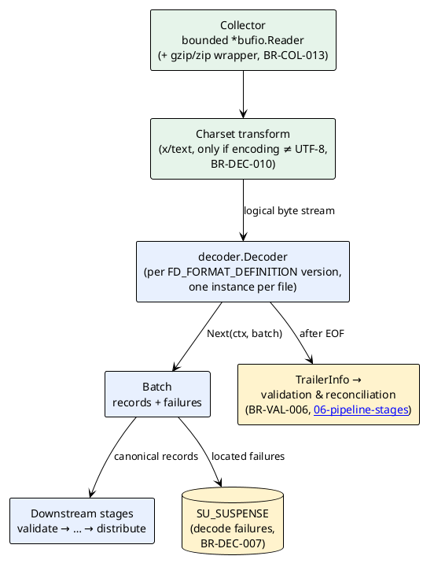

# 05 — Decoding & the Canonical Record

> Part of the [[00-index|baasparse TS]]. Previous: [[04-acquisition-collection-archiving]] · Next: [[06-pipeline-stages]]

This section designs the **decode seam**: how raw bytes from a collected file become
**canonical records** — the format-independent representation every downstream stage
consumes (`BR-DEC-009`, BRS §5.6) — and the five v1 decoders (ASN.1 BER/DER, JSON, XML,
DSV, fixed-position; `BR-DEC-001..004/011`). It also fixes the two properties the rest of
the system leans on:

- **Lineage** — every canonical record carries `(file UID, in-file record position)` —
  the **business** `PF_FILE_UID` plus the 1-based decode ordinal — which is the input
  to the **deterministic output identity** of `BR-DST-018`.
- **Streaming** — decoding is record-at-a-time / bounded-batch over a bounded read
  buffer (`BR-DEC-006`, `BR-COL-008`), so memory is a function of configuration, never
  input size (`BR-NFR-001`).

## 5.1 Position in the pipeline

The decoder is the first record-producing stage. Its input is the **collector's bounded
reader** over the in-progress file — already claimed, checksummed, and (where configured,
`BR-COL-013`) wrapped in a **streaming decompression reader** (`gzip.Reader` / zip entry
stream), so the decoder always sees the *logical* byte stream and never needs to know
about compression. Where the format definition declares a text **encoding** other than
UTF-8, a charset transform reader (`BR-DEC-010`, §5.3.6) sits between the two.



The decoder never touches PostgreSQL and never persists anything itself: failures are
returned **as values** in the batch and written to suspense by the pipeline runtime; the
only place canonical record content is persisted is the collation working set
(`CM_COLLATION_MEMBER`, §5.2.5) — and only for collating pipelines (`BR-NFR-009`).

## 5.2 The canonical record model (`BR-DEC-009`)

### 5.2.1 Design goals

1. **Typed, with explicit units** — a field is never "a string that happens to be a
   duration"; its kind and unit travel with the value, so transformation/unit conversion
   (`BR-TRN-004`) and aggregation operate on semantics, not guesses.
2. **Allocation-conscious hot path** — the in-memory form is a dense **field vector**
   with **interned names**, pooled and reused (`BR-NFR-003`); per-record heap allocations
   are a benchmark-tracked number ([[14-performance-sizing]]).
3. **Self-describing at rest** — the JSONB form persisted to `CM_COLLATION_MEMBER`
   stands alone: a member row is interpretable without the decoding schema in hand
   (windows outlive files and config publishes, `BR-COR-011`).
4. **Lineage first-class** — `(FileUID, RecordSeq)` is on the record itself, not
   reconstructed later (`BR-DST-018`).

### 5.2.2 Type system: kinds and units

Every field value carries a **kind tag** and, for dimensioned kinds, a **unit tag**:

| Kind | Go storage | Unit tag | Notes |
|------|-----------|:--------:|-------|
| `string` | `string` | — | UTF-8 after charset conversion (`BR-DEC-010`) |
| `int` | `int64` | optional (`bytes`, `count`, …) | counters, volumes |
| `decimal` | `int64` mantissa + `int8` scale | optional (e.g. `currency:ZAR`) | **never float** — charge/money paths are exact fixed-point |
| `bytes` | `[]byte` | — | opaque binary (e.g. raw cell id); bounded length |
| `timestamp` | `int64` unix-nanos + interned `*time.Location` | — | an **instant plus its originating zone** (§5.2.4) |
| `duration` | `int64` magnitude | **required** (`s`, `ms`, `min`, …) | unit is part of the value, not convention |
| `enum` | interned symbol id (`int32`) | — | small-cardinality discriminators/causes; symbol table per format version |
| `bool` | `int64` 0/1 | — | |
| `null` | — | — | absent OPTIONAL field; distinct from empty string |

A field slot MAY additionally hold a **bounded homogeneous list** of one scalar kind
(`maxItems` enforced from the format definition) — this is how ASN.1 `SEQUENCE OF`
leaf groups and repeated XML elements are represented without an open-ended document
model. Lists serialise as JSON arrays; downstream transforms may explode or join them.

The **unit vocabulary** is a closed, versioned enumeration owned by the canonical
package (time: `s`/`ms`/`us`/`min`; data: `bytes`/`KiB`/`MiB`/`kbit`; money:
`currency:<ISO-4217>` with the decimal scale carrying minor units; `count`; `none`).
Transformation's unit-conversion table ([[06-pipeline-stages]]) is defined against this
vocabulary, which is what makes `BR-TRN-004` checkable at config-validation time.

### 5.2.3 Go representation (hot path)

```go
package canonical

// Kind and Unit are small tag enums (see §5.2.2).
type Kind uint8
type Unit uint16

// Value is a compact tagged union — no interface{} boxing on the hot path.
type Value struct {
	K     Kind
	U     Unit
	Scale int8           // decimal only
	I     int64          // int / bool / enum-symbol / duration / decimal mantissa / unix-nanos
	S     string         // string (copied out of the read buffer on retention)
	B     []byte         // bytes (pooled backing)
	Loc   *time.Location // timestamp only; interned per source
	List  []Value        // bounded homogeneous list, nil for scalars
}

// Layout is the compiled per-record-type shape: one per (format version ×
// record type), built once at decoder instantiation and shared by all records.
type Layout struct {
	FormatUID  int64    // FD_FORMAT_DEFINITION version that defines it
	RecordType string   // discriminator value (BR-DEC-008)
	Names      []string // slot index → field name (the interned name table)
	slotByName map[string]int
}

// Record is the canonical record. Field names are NOT stored per record —
// the Layout holds them once; the record is a dense vector indexed by slot.
type Record struct {
	// Lineage — feeds deterministic output identity (BR-DST-018).
	// FileUID is the business PF_PROCESSED_FILE.PF_FILE_UID — never the
	// surrogate PF_UID ([[02-conventions]] §2.5). RecordSeq is the 1-based
	// position in decode order within the file — THE record ordinal used
	// everywhere (identity, suspense, markers; §5.2.6).
	FileUID   int64
	RecordSeq int64

	// Event time (BR-COR-010): the event START date/time, zone-explicit.
	EventTime Value // Kind = timestamp; Null only if the feed carries none

	Layout *Layout
	Fields []Value // len == len(Layout.Names); Null for absent OPTIONALs
}

func (r *Record) Get(name string) (Value, bool) // via Layout.slotByName
func (r *Record) Release()                      // return to the per-Layout pool
```

Pooling and copy discipline:

- Records are drawn from a **`sync.Pool` per Layout** (the field vector is
  preallocated at the layout's width) and released after the last consumer —
  distribution commit for streaming pipelines, JSONB persist for collating ones.
- Decoders MAY point `Value.S`/`Value.B` at the read buffer **only within one batch's
  lifetime** (zero-copy fast path for DSV/fixed, §5.4.4/5.4.5); any value that outlives
  `Next()` — retained by dedup keys, collation members, suspense context — is copied
  on retention. The pipeline runtime enforces this by contract: a stage that holds a
  record across batches must `Retain()` it (which deep-copies buffer-aliased values).

### 5.2.4 Event time and timezone handling (`BR-COR-010`)

The canonical event time is the **event start date/time** carried in the record, marked
in the format definition by `"role": "eventTime"` on exactly one field (per record
type). Rules:

- A timestamp parsed **with** an explicit offset/zone keeps it.
- A timestamp parsed **without** zone information gets the **source timezone**
  declared in the format definition (`"timezone": "<IANA name>"` — file-level default,
  overridable per field). A zoneless timestamp field in a format definition with no
  declared timezone is a **config-validation error** (`BR-CFG-003`), not a runtime
  guess — window and group boundaries must be unambiguous, DST included (`BR-TRN-010`).
- The value stores the **instant** (UTC nanos) *plus* the originating `time.Location`
  (interned — one allocation per source, not per record), so event-local calendar
  grouping (`event_date`) and canonical-timezone normalisation are both derivable.
- At rest (JSONB, and any `TIMESTAMPTZ` column) the instant is UTC per
  [[02-conventions]] §2.1; the zone name rides alongside in the JSONB form.

Records whose feed genuinely carries no event time have `EventTime = Null`; such feeds
cannot drive event-time windowing and the config validator rejects collation rules over
them ([[06-pipeline-stages]]).

### 5.2.5 JSONB serialisation (collation working set)

Collating pipelines persist canonical members to `CM_COLLATION_MEMBER` (`CM_BODY
JSONB`, `BR-COR-006`). The serialisation is **self-describing** — kinds and units
inline — because a window outlives the decoding context and may be emitted by a
different instance under a different active config generation (`BR-COR-008/011`):

```json
{
  "v": 1,
  "type": "moCall",
  "lineage": { "fileUid": 108234, "recordSeq": 5741 },
  "eventTime": { "ts": "2026-07-03T21:14:09.250+02:00", "zone": "Africa/Johannesburg" },
  "fields": {
    "servedIMSI":     { "k": "string",    "v": "655010123456789" },
    "callingNumber":  { "k": "string",    "v": "+27821234567" },
    "callDuration":   { "k": "duration",  "u": "s", "v": 421 },
    "dataVolumeUp":   { "k": "int",       "u": "bytes", "v": 1048576 },
    "charge":         { "k": "decimal",   "u": "currency:ZAR", "v": "12.50" },
    "teleservice":    { "k": "enum",      "v": "telephony" },
    "suppServices":   { "k": "string",    "list": ["clip", "hold"] }
  }
}
```

Encoding rules: `lineage.fileUid` is the **business** `PF_FILE_UID` (§5.2.6);
`decimal` as **string** (exactness survives JSON round-trip);
`timestamp` as RFC 3339 with numeric offset **plus** IANA zone name; `bytes` as base64;
`enum` as its symbol string; absent/`null` fields **omitted**. `v` versions the
envelope itself so the serialisation can evolve additively. The same serialisation is
reused wherever a canonical record must be materialised outside process memory (e.g.
the optional suspense escrow `SE_SUSPENSE_ESCROW`, `BR-ERR-011`).

This JSONB form is deliberately **not** the hot-path form: streaming pipelines never
produce it; collating pipelines produce it once per member at the collate stage.

### 5.2.6 Lineage and deterministic identity (`BR-DST-018`)

`FileUID` binds to the **business `PF_FILE_UID`** — the same value that appears in
completion markers and on-disk `.__uid` qualifiers ([[04-acquisition-collection-archiving]]
§4.1/§4.4.10), output identities ([[07-distribution-delivery]] §7.4.2), suspense rows,
and log correlation ([[02-conventions]] §2.5); the surrogate `PF_UID` never appears in
lineage. `RecordSeq` is assigned by the decoder as a **1-based counter in decode
order** and is **the** record ordinal wherever a record is referenced — output
identity, suspense (`SU_RECORD_INDEX`), checkpoints, replay. Three invariants:

1. **Deterministic** — decoding the same file bytes under the same
   `FD_FORMAT_DEFINITION` version always yields the same `(RecordSeq → record)`
   mapping. Decoders MUST NOT reorder, parallelise-and-interleave, or renumber.
2. **Failures consume a sequence number** — a record that fails to decode occupies its
   position (`BR-DEC-007` failures carry the seq they would have had), so a later
   config fix + reprocess (`BR-ERR-004`) reproduces the *identical* lineage and the
   deterministic output identity holds across replay.
3. **Header/trailer records do not consume data sequence numbers** — they are
   structural (§5.5), counted separately, so adding a trailer to a feed's definition
   cannot shift every record's identity.

`(FileUID, RecordSeq)` is therefore stable across re-delivery, crash re-run from
checkpoint, re-send, and replay — exactly the property `BR-DST-013/018` requires of the
idempotent upsert key. Checkpointing ties into this: the `FC_FILE_CLAIM` checkpoint
records the last durably-accounted `RecordSeq` (and its byte offset, diagnostic only),
and a takeover **always resumes by re-streaming from the file start with emission
suppressed** up to the checkpointed ordinal — no seek-based resume for any input
stacking ([[04-acquisition-collection-archiving]] §4.4.13). Re-decode is cheap and
deterministic (invariant 1); re-emission is suppressed by identity; and the re-stream
recomputes the full-file checksum, keeping the collector's single-pass hash claims
intact across takeover.

## 5.3 Decoder architecture

### 5.3.1 The `decoder.Decoder` interface (`BR-DEC-006`)

```go
package decoder

// Decoder streams canonical records out of one file's logical byte stream.
// One instance per file, owned by the file worker; NOT goroutine-safe.
type Decoder interface {
	// Begin binds the decoder to the file's stream. r is the collector's
	// bounded (and possibly decompressing/charset-transforming) reader.
	Begin(ctx context.Context, r *bufio.Reader, meta FileMeta) error

	// Next fills batch with up to its configured capacity and returns.
	// Record-level failures are returned INSIDE the batch (BR-DEC-007),
	// never as the error. A non-nil error means the stream itself cannot
	// be decoded further (structural corruption past recovery) — the file
	// worker then routes the remainder per BR-COL-017 semantics.
	// io.EOF signals clean end of stream, after trailer capture.
	Next(ctx context.Context, batch *Batch) error

	// Trailer reports header/trailer info once EOF is reached (§5.5).
	Trailer() (TrailerInfo, bool)

	Close() error
}

type FileMeta struct {
	FileUID  int64 // business PF_FILE_UID (§5.2.6)
	Name     string
	SourceID int64
}

// Batch is the unit of flow between decode and the stage graph — bounded,
// pooled, sized from the memory budget ([[14-performance-sizing]]).
type Batch struct {
	Records  []*canonical.Record
	Failures []Failure
}

// Failure is a record-level decode failure with enough context to locate
// the record for suspense and later reprocessing (BR-DEC-007, BR-ERR-001).
type Failure struct {
	FileUID    int64
	RecordSeq  int64  // the position the record occupies (§5.2.6)
	ByteOffset int64  // record start offset — coordinate system per §5.3.4
	Length     int64  // record length where delimitable; 0 = unknown
	ReasonCode string // stable machine code, e.g. "DEC_ASN1_UNEXPECTED_TAG"
	Detail     string // human diagnostic (bounded)
}
```

Contract points:

- **Bounded batches** — `Next` never returns more than the configured batch size;
  the decoder never buffers more than one batch plus one bounded read window
  (`BR-DEC-006`, `BR-COL-008`).
- **Failure ≠ error** — a malformed record becomes a `Failure` value and decoding
  continues at the next recoverable boundary (§5.3.4); only unrecoverable stream
  corruption returns an error.
- **Backpressure by blocking** — `Next` is pull-based; a slow downstream simply
  doesn't call it (`BR-NFR-002/007`).

### 5.3.2 `decoder.Registry` and instantiation from `FD_FORMAT_DEFINITION` (`BR-DEC-005`)

A format definition row (`FD_FORMAT_DEFINITION`, temporal per `BR-CFG-009`) carries:
`FD_KIND` (`ASN1` | `JSON` | `XML` | `DSV` | `FIXED`), `FD_VARIANT` (empty for the
schema-driven default; a plug-in name otherwise), and `FD_SPEC JSONB` — the declarative
structure the GUI's file-structure modelling produces (`BR-UI-004`, sketches in §5.4).

```go
// FormatDef is one published version of a format definition.
type FormatDef struct {
	UID     int64  // FD_UID — the version identity records are stamped with
	Kind    string // FD_KIND
	Variant string // FD_VARIANT ("" = schema-driven default)
	Body    []byte // FD_SPEC (JSONB)
}

// Factory compiles a FormatDef into a ready Decoder.
type Factory func(def FormatDef) (Decoder, error)

type Registry struct{ /* map[kindVariant]Factory + compiled-plan cache */ }

func (r *Registry) Register(kind, variant string, f Factory)
func (r *Registry) New(def FormatDef) (Decoder, error) // dispatch kind+variant
```

- The five built-in factories register at wiring time (`cmd/baasparse`); the **common
  case is pure configuration** — onboarding a well-formed feed is a new `FD` row, no
  code (`BR-DEC-005`, `D-3`).
- `New` **compiles** the JSONB body into an immutable execution plan (parsed schema,
  layouts, symbol tables, charset transformer) and **caches the plan by `FD_UID`**
  (bounded LRU) — per-file instantiation then only allocates the mutable cursor state,
  keeping file-open cost trivial.
- Config validation at publish time (`BR-CFG-003`) runs the same compile: an
  unparseable body, an unknown `variant`, or a schema violating structural limits is
  rejected **before** it can reach the data plane.

### 5.3.3 Vendor-variant extension point (`BR-NFR-032`)

Real ASN.1 CDR feeds carry vendor-specific encodings that a declarative schema cannot
always express (`R2`, BRS `ASM-2`/`DEP-3`): proprietary time encodings, non-standard
indefinite-length usage, undocumented extension containers. For these:

- A **variant decoder is a compiled-in Go package** under
  `internal/decoder/asn1variant/<vendor>/`, implementing `decoder.Decoder` (usually by
  embedding the core TLV reader, §5.4.1, and overriding specific value decoders) and
  registered as `Register("asn1", "<vendor-name>", factory)` in one wiring file.
- **Selection stays configuration**: the operator sets `FD_VARIANT =
  "<vendor-name>"` — no pipeline, core, or registry change. If the configured variant
  is not compiled into the running binary, publish-time validation fails with a clear
  error (never a runtime surprise).
- **Onboarding process** (the "bounded, reviewed engineering task" of `BR-DEC-005`):
  1. Capture a representative **golden-file corpus** from the vendor feed (masked per
     [[13-security-compliance]]) and the vendor's format documentation (`DEP-3`).
  2. Implement the variant behind the seam; it may reuse the schema JSONB for the
     parts that *are* regular, coding only the abnormal value decoders.
  3. It must pass the **decoder conformance suite**: golden-file decode equality,
     streaming/bounded-memory verification (decode a multi-GB synthetic file under a
     fixed heap ceiling), failure-isolation tests (`BR-DEC-007` semantics), and
     determinism of `RecordSeq` (§5.2.6).
  4. Code review + normal release: the variant ships in the next engine version; the
     core and existing pipelines are untouched.

Which variants ship in v1 is confirmed against the concrete feed list (BRS Open Q2);
the seam itself is a v1 deliverable regardless.

### 5.3.4 Record-level failure → suspense (`BR-DEC-007`)

Each decoder defines its **recovery boundary** — the point from which decoding can
continue after a bad record:

| Format | Recovery boundary |
|--------|-------------------|
| ASN.1 | next top-level TLV (length-skippable even when contents are malformed); if the *length octets themselves* are corrupt, resync by scanning for the next valid top-level identifier is not attempted — that is unrecoverable stream corruption (error return) |
| JSON | next NDJSON line / next array element (token-level skip of the malformed value) |
| XML | next record element close (skip subtree via token depth) |
| DSV | next record line (respecting quoted embedded newlines where the quote state is sound; a broken quote state resyncs at the next bare newline) |
| Fixed | next record boundary (fixed length or newline) |

The `Failure` carries `(FileUID, RecordSeq, ByteOffset, Length, ReasonCode)` — the
pipeline runtime writes it to `SU_SUSPENSE` (stage `decode`) with **no record content**
(`BR-ERR-001`); reprocessing re-reads the file from disk and the offset/seq locate the
record. Reason codes are a stable, per-format enumerated set (`DEC_ASN1_*`,
`DEC_JSON_*`, …) per [[02-conventions]] §2.3.

**Offset coordinate system.** `ByteOffset`/`Length` (and the checkpoint's byte offset)
are defined per input stacking:

- **Plain file** (no decompression, no charset transform): **raw-file coordinates** — a
  reprocessor may `seek(2)` directly to the record.
- **Stacked stream** (decompression `BR-COL-013` and/or charset transform §5.3.6):
  **logical-stream coordinates** — offsets into the decompressed/transformed byte
  stream; location is by **re-streaming from the start**, matching takeover resume,
  which never seeks either ([[04-acquisition-collection-archiving]] §4.4.13).

`RecordSeq` locates the record deterministically in both regimes (§5.2.6) and is the
authoritative locator; offsets accelerate or diagnose, never define, identity.

### 5.3.5 Heterogeneous record types (`BR-DEC-008`)

Every format definition declares a **record-type discriminator** and a per-type field
mapping (`"types"` in the sketches, §5.4). The discriminator source is format-natural:
the selected **CHOICE alternative** (ASN.1), a **field path** (JSON/XML), a **column**
(DSV), or a **byte range with a value map** (fixed). The resolved discriminator value
selects the record's `Layout` and is stored as `Record.Layout.RecordType` — the same
value routing (`BR-DST-004`) and per-type validation key on. A record whose
discriminator matches no configured type fails with `DEC_UNKNOWN_RECORD_TYPE`
(suspense, stream continues) unless the definition marks specific values `"ignore"`
(counted as discarded for reconciliation, decode-side screening of structural filler
records). Single-type feeds simply declare one type and no discriminator rule.

### 5.3.6 Charset / code-page conversion (`BR-DEC-010`)

Two levels, both declarative:

- **Stream level (text formats)** — `"encoding"` in the definition (`utf-8` default;
  `latin-1`, `windows-1252`, EBCDIC code pages e.g. `cp037`, via
  `golang.org/x/text/encoding` charmaps). Applied as a `transform.Reader` between
  collector and decoder, so decoders always operate on UTF-8 internally. Invalid byte
  sequences follow a per-definition policy: `replace` (U+FFFD, default) or `fail`
  (record-level failure at the affected record).
- **Field level (binary formats)** — ASN.1/fixed field `"decode"` hints for telco
  encodings that are not charsets in the IANA sense: `tbcd` (swapped-nibble BCD
  digits), `bcdDirectoryNumber` (TS 24.008 number with TON/NPI octet), `gsm7`
  (GSM 03.38 7-bit), `ia5`, `utf8String`, address/IP octet forms. These are value
  decoders in the compiled plan, not stream transforms.

### 5.3.7 Format-version selection: v1 rule, v2 seam (`BR-DEC-012`)

The selection rule lives behind **one function** — the entire v2 change surface:

```go
// selectFormatVersion resolves which FD_FORMAT_DEFINITION version governs
// decoding. It is THE single seam for BR-DEC-012.
//
// v1: called once per file at claim time; returns the version current-active
//     under the pipeline config version the file is pinned to (BR-CFG-007);
//     the `at` parameter is ignored (wall-clock/current-active semantics).
//
// v2: called per record type with the record's event start time; returns the
//     version whose [effective_from, end_date) covers `at` — same table, same
//     temporal columns (BR-CFG-009), no schema change. Callers are unchanged.
func selectFormatVersion(b SourceBinding, recordType string, at time.Time) (FormatDef, error)
```

v1 consequences, stated plainly: a file is decoded **entirely** under one format
version (stamped into every record as `Layout.FormatUID` for audit/lineage); a format
cutover is an operator-timed publish (`BR-CFG-008`), and in-flight files finish under
the version they started. The v2 event-time rule needs a bootstrap for the
chicken-and-egg (event time is only known *after* some decoding): the seam's contract
is that the **structural skeleton** (record framing + discriminator + event-time field
location) is resolved under the current-active version, and full field mapping may then
re-select by event time — this is documented here so the v1 JSONB shape (framing and
`role: eventTime` declared per type) already provides what v2 needs (BRS §10.6).

## 5.4 Per-format design

Every format definition body shares a common envelope — `kind`, `variant`, `encoding`,
`recordType` (discriminator rule), `types` (per-type field mappings), `fileHeader` /
`fileTrailer` (§5.5), and structural limits (`maxRecordBytes`, `maxItems`, format
caps) — matching the GUI file-structure modelling flow (`BR-UI-004`): the operator
models the file once; the sketches below are what the GUI persists.

**As built (alpha).** Three of the five decoders are **wired** in the alpha data
plane — DSV (`BR-DEC-003`), JSON (`BR-DEC-002`) and XML (`BR-DEC-011`) — over a
simplified alpha spec envelope (`internal/spec.FormatSpec`: `kind` + one per-kind
spec + a single flat `fields` declaration list shared by all three formats). Declared
field types are applied as **best-effort coercion** at decode
(`internal/decoder/coerce.go`) — DSV cells and XML text get the same typed values
JSON produces natively; a value that does not parse is left unchanged (input decoding
stays lenient; strict typing is the transform's job). ASN.1 (`BR-DEC-001`) and
fixed-position (`BR-DEC-004`) remain **future** — §5.4.1/§5.4.5 are their forward
design. Alpha failure handling is file-scoped: a decode error quarantines the file
with a reason; the record-level failure→suspense isolation of §5.3.4 is not yet
wired. Per-format as-built notes follow the JSON and XML sketches below; the mirror
encoders are in [[07-distribution-delivery]] §7.3.1 and the measured numbers in
[[14-performance-sizing]] §14.4.

### 5.4.1 ASN.1 BER/DER (`BR-DEC-001`)

**Why not `encoding/asn1`.** The stdlib package is unusable for this job on four
counts: (1) it is **DER-oriented** — it rejects BER forms that real CDR files use
(indefinite lengths, constructed strings); (2) it unmarshals into **compile-time Go
structs** via reflection, contradicting no-code onboarding (`BR-DEC-005`); (3) it
operates on a complete `[]byte` element — **not streaming**, violating `BR-COL-008`
for multi-GB files; (4) it cannot express untagged CHOICE, per-field implicit
context tags, or extensibility markers without struct-tag code per feed.

**In-house streaming TLV reader** (`internal/decoder/asn1`):

- Reads **identifier octets** (class, primitive/constructed bit, tag number including
  high-tag-number form) and **length octets** (definite short/long form, and
  **indefinite form** `0x80` with end-of-contents tracking) directly off the bounded
  `bufio.Reader`.
- Maintains an explicit **stack of open constructed scopes** (definite scopes tracked
  by remaining bytes, indefinite by EOC) — depth bounded by `maxDepth` (default 32);
  exceeding it is a record failure, not a stack blowout.
- **Primitive contents** are yielded as slices of the read buffer when they fit the
  window (zero-copy), else read via a bounded copy; a primitive longer than
  `maxPrimitiveBytes` (default 64 KiB) is a record failure, not an allocation —
  no crafted length can make the decoder allocate unboundedly.
- A malformed record is skipped by its outer length (definite) or by EOC scan
  (indefinite) — the §5.3.4 recovery boundary.

**Schema-driven mapping.** The declarative schema (compiled from `FD_SPEC`) walks the
TLV stream against **module/type definitions**: `SEQUENCE`/`SET` component lists with
per-component tag (class + number, implicit/explicit), `OPTIONAL`/`DEFAULT`
(tag-directed presence resolution — the next tag decides which optional components are
absent), `CHOICE` (alternative selected by tag; an untagged nested CHOICE resolves
through its alternatives' tag sets), and `SEQUENCE OF`/`SET OF` (bounded by
`maxItems`, mapped to a canonical list value or — via `"explode": true` — to one
canonical record per element for partial-record feeds). Constructed-vs-primitive
mismatches against the schema are record failures with precise reason codes.
Unrecognised tags inside an extensible type (`"extensible": true`, ASN.1 `...`) are
skipped by length and counted, mirroring how 3GPP schemas evolve.

This is expressive enough for **3GPP TS 32.298-style CDR structures**: a file is
typically a concatenation of `CallEventRecord` CHOICE values (`moCallRecord [0]`,
`mtCallRecord [1]`, `sgsnPDPRecord [18]`, `pGWRecord [85]`, …) — the CHOICE alternative
**is** the record-type discriminator (`BR-DEC-008`), and the schema's `decode` hints
cover the 32.298 value idioms (TBCD IMSI/IMSI, BCD directory numbers, the TS 32.297
9-octet local timestamp with embedded UTC offset → `role: eventTime`, §5.2.4).

**TAP3 note (GSMA TD.57, `BR-VAL-007` decode side).** TAP3 files are BER; the decode
side supplies the validation profile's inputs, the profile itself lives in
[[06-pipeline-stages]]:

- Top-level `DataInterChange ::= CHOICE { transferBatch [1], notification [2] }` —
  the **transfer-vs-notification discrimination** is the ordinary CHOICE discriminator.
- The batch/notification control structures (sender, recipient,
  **file sequence number**, transfer cut-off) decode as **header records**; the
  `auditControlInfo` totals (call-event count, charge totals) decode as the
  **trailer** (§5.5) — giving validation the sequence number for stream-continuity
  checks and the declared count for reconciliation (`BR-VAL-006/007`).
- Call events inside `callEventDetails` are ordinary discriminated records.

Illustrative `FD_SPEC` (shape is normative, field detail is per-feed design):

```json
{
  "kind": "asn1",
  "variant": "",
  "encodingRules": "ber",
  "timezone": "Africa/Johannesburg",
  "maxDepth": 32,
  "maxPrimitiveBytes": 65536,
  "file": { "structure": "concatenatedRecords", "rootType": "CallEventRecord" },
  "recordType": { "choiceOf": "CallEventRecord" },
  "types": {
    "CallEventRecord": {
      "choice": {
        "moCall":  { "tag": "[0]", "type": "MOCallRecord" },
        "mtCall":  { "tag": "[1]", "type": "MTCallRecord" }
      },
      "extensible": true
    },
    "MOCallRecord": {
      "sequence": [
        { "name": "servedIMSI",    "tag": "[1]",  "asn1": "OCTET STRING", "decode": "tbcd", "kind": "string" },
        { "name": "callingNumber", "tag": "[2]",  "asn1": "OCTET STRING", "decode": "bcdDirectoryNumber", "kind": "string", "optional": true },
        { "name": "seizureTime",   "tag": "[6]",  "asn1": "OCTET STRING", "decode": "ts32297Time", "kind": "timestamp", "role": "eventTime" },
        { "name": "callDuration",  "tag": "[9]",  "asn1": "INTEGER", "kind": "duration", "unit": "s" },
        { "name": "causeForTerm",  "tag": "[14]", "asn1": "INTEGER", "kind": "enum",
          "enum": { "0": "normalRelease", "1": "partialRecord", "4": "abnormalRelease" } },
        { "name": "suppServices",  "tag": "[12]", "asn1": "SEQUENCE OF", "of": "SS-Code",
          "kind": "enum", "maxItems": 16, "optional": true }
      ],
      "extensible": true
    }
  }
}
```

### 5.4.2 JSON (`BR-DEC-002`)

Streaming over stdlib `encoding/json`'s **`json.Decoder` token walk** — never a
whole-document unmarshal:

- **Document modes:** `ndjson` (one JSON value per line — the trivially streaming
  case), `array` (records are elements of an array located by `recordPath`), `object`
  (one record per document, for feeds delivering one event per file).
- For `array`/`object` documents the decoder walks tokens (`Decoder.Token()`) down the
  **record path** — a deliberately small **JSONPath-like subset**: `$`, `.name`
  member steps, and one `[*]` array step (e.g. `$.batch.records[*]`). No filters, no
  recursive descent — anything fancier belongs in transformation, and the subset keeps
  the walker allocation-free and validated at publish time.
- Each record element is captured as a bounded token sequence (capped by
  `maxRecordBytes`) and mapped: per-type **field paths relative to the record
  element**, each with `kind`/`unit`/parse hints. Numbers are read as `json.Number`
  and parsed per the declared kind (`int` / `decimal` with exact scale — floats never
  transit money fields).
- Fields present in the document but not mapped are skipped at token level (no
  materialisation); `repeated: true` maps arrays to bounded list values.

```json
{
  "kind": "json",
  "document": "array",
  "recordPath": "$.batch.records[*]",
  "encoding": "utf-8",
  "maxRecordBytes": 262144,
  "recordType": { "path": "$.type", "default": "dataSession" },
  "types": {
    "dataSession": {
      "fields": [
        { "name": "sessionId", "path": "$.session.id",   "kind": "string" },
        { "name": "bytesUp",   "path": "$.usage.up",     "kind": "int", "unit": "bytes" },
        { "name": "bytesDown", "path": "$.usage.down",   "kind": "int", "unit": "bytes" },
        { "name": "start",     "path": "$.startTime",    "kind": "timestamp", "layout": "rfc3339", "role": "eventTime" },
        { "name": "rating",    "path": "$.charge.amount","kind": "decimal", "unit": "currency:ZAR" }
      ]
    }
  },
  "fileHeader":  { "path": "$.batch.header" },
  "fileTrailer": { "path": "$.batch.trailer", "recordCountField": "recordCount" }
}
```

**As built (alpha).** The wired JSON decoder covers `ndjson` and `array` documents of
**flat objects** (`internal/decoder/json.go`); the `recordPath` walk and per-field
paths above are the forward design. The flat-object parse itself is **hand-rolled**
(`internal/decoder/jsonfast.go`), replacing the earlier `encoding/json`
map + `UseNumber` + key-sort route (which alone cost ~240 allocs/record on a
50-field object):

- **Document key order is preserved** (the map route sorted keys) — fields enter the
  canonical record in source order.
- **Zero-copy substrings** — keys and escape-free string values are sliced directly
  out of the one per-line (or per-array-element) string, ≈1 alloc/record
  steady-state; escaped strings are unescaped into a fresh buffer (`\uXXXX` incl.
  surrogate pairs; unpaired surrogates → U+FFFD, matching the stdlib).
- **Number semantics unchanged** — integral → `int64`, else `float64`, else
  (unrepresentable, e.g. overflow) the raw text as a string — exactly the previous
  `json.Number` behaviour.
- **Nested objects/arrays are kept as their raw JSON source text** (previously they
  were re-marshalled compact with sorted keys); the alpha treats them as opaque
  string values.
- Two deliberate divergences, both malformed-input territory: **duplicate keys —
  the first occurrence wins** (the old map kept the last; RFC 8259 leaves duplicate
  handling undefined), and **trailing non-whitespace after the object is an error**
  (previously silently ignored) — garbage after a record now quarantines the file
  with a reason instead of being dropped.

Differential tests against `encoding/json` pin these semantics
(`internal/decoder/jsonfast_test.go`).

### 5.4.3 XML (`BR-DEC-011`)

Streaming over stdlib **`encoding/xml` token walk** — no DOM, no etree, no external
dependency:

- The **record element** is an XPath-style **absolute element path**
  (`/mmsBatch/records/record` — element name steps only; namespace handling via
  declared prefix map). The walker tracks element depth against the path; on a match
  it captures the record subtree's tokens (bounded by `maxRecordBytes`) and skips
  everything else at token level.
- **Field mappings are relative paths** within the record element: child element
  steps, `@attr` for attributes, element text as the default leaf value. **Nested
  structures** are addressed by deeper paths; **repeated elements** (`repeated: true`)
  become bounded list values, or `"explode": true` yields one record per repeated
  group (record-per-element extraction at a deeper level).
- `xml.Decoder`'s charset hook is wired to the same `x/text` machinery as §5.3.6, so
  declared-encoding XML (`encoding="ISO-8859-1"`) decodes without a separate stream
  transform.
- A malformed subtree is skipped to the record element's close tag (§5.3.4);
  a malformed *document* structure past the last recoverable record close is an error
  return.

```json
{
  "kind": "xml",
  "recordElement": "/mmsBatch/records/record",
  "encoding": "utf-8",
  "maxRecordBytes": 262144,
  "recordType": { "path": "@type", "default": "mms" },
  "types": {
    "mms": {
      "fields": [
        { "name": "msgId",      "path": "messageId",             "kind": "string" },
        { "name": "sender",     "path": "party/sender/@msisdn",  "kind": "string" },
        { "name": "size",       "path": "content/size",          "kind": "int", "unit": "bytes" },
        { "name": "submitted",  "path": "timestamps/submit",     "kind": "timestamp",
          "layout": "2006-01-02T15:04:05", "timezone": "Africa/Johannesburg", "role": "eventTime" },
        { "name": "recipients", "path": "party/recipients/recipient/@msisdn",
          "kind": "string", "repeated": true, "maxItems": 64 }
      ]
    }
  },
  "fileTrailer": { "element": "/mmsBatch/summary", "recordCountField": "count" }
}
```

**As built (alpha) — WIRED, flat-record subset.** XML decode is live in the alpha
data plane (`spec.FormatXML`); the path-addressed nested/repeated mapping and
namespace handling above remain the forward design. The alpha spec shape is two
optional strings (`internal/spec`):

```go
// XMLSpec configures the alpha's FLAT-record XML format.
type XMLSpec struct {
	// RecordElement is the repeated element holding one record. Decode: empty
	// auto-detects the first element under the document root. Encode: the
	// element written per record (default "record").
	RecordElement string `json:"recordElement,omitempty"`
	// RootElement is the document root the encoder wraps records in
	// (default "records"). Ignored on decode.
	RootElement string `json:"rootElement,omitempty"`
}
```

Decode semantics (`internal/decoder/xml.go`):

- **Streaming over `encoding/xml`'s `RawToken`** — `RawToken` (vs `Token`) skips
  per-token namespace translation and start/end-tag matching, saving several
  allocations per element; the decoder re-imposes well-formedness itself with an
  open-element name stack (a mismatched close tag or unclosed element at EOF is a
  decode error). **Entities and CDATA are still decoded inside the stdlib
  tokenizer**; comments and processing instructions are consumed by it and ignored.
- **Record element matching** — every occurrence of the configured element (by
  **local name**, matched at any depth ≥ 2, i.e. anywhere below the document root)
  yields one record; with `recordElement` unset the decoder **auto-detects** the
  first element under the document root and uses its name.
- **Flat fields** — a record's fields are the record element's **attributes** (in
  document order, first) followed by one field per **direct child element**, whose
  value is the child subtree's concatenated `CharData`, whitespace-trimmed
  (`strings.TrimSpace`) — nested structure flattens to its text content in the
  alpha. Stray character data at record level (indentation etc.) is ignored.
- **Declared-type coercion** — XML values are text; declared fields coerce
  best-effort exactly like DSV cells (§5.4 as-built intro), so `<size>1024</size>`
  under a declared integer field yields the same typed value JSON produces natively.
- One record struct is **reused across emits** (the pipeline consumes records
  synchronously — same contract as the DSV/JSON decoders); the residual
  ~305 allocs/record are the stdlib tokenizer's own — the documented exception in
  [[14-performance-sizing]] §14.4.

The GUI wizard models XML end-to-end ([[10-management-plane]] §10.5): an input-format
option with the record element and sample-driven field detection, and an
output-format option with root/record element settings. The mirror flat-record
**encoder** (default `<records>`/`<record>` wrapping, escaping byte-identical to
`encoding/xml.EscapeText`, sanitized element names, `.xml` + `application/xml`
outputs) is specified in [[07-distribution-delivery]] §7.3.1.

### 5.4.4 DSV (`BR-DEC-003`)

Configurable **delimiter** (any rune), **quote** character, **escape** convention
(`doubling` RFC-4180 style, or `backslash`), **header** handling (`none` /
`names` — bind columns by header name / `skip` — positional with header validated or
ignored), **encoding** (§5.3.6), line endings (`auto` LF/CRLF), and optional skip/
comment-prefix lines.

**Row reader.** Row-splitting is isolated behind an internal `rowReader` interface
with two implementations, and the split of duties is fixed:

- The **custom splitter is the requirement-bearing implementation**. `encoding/csv`
  hard-codes RFC-4180 semantics — `"` as the quote character and doubling as the only
  escape — and cannot express an arbitrary configured quote rune or `backslash`
  escaping, both of which `BR-DEC-003` requires. Any **non-RFC-4180 configuration
  therefore runs the custom splitter**: an in-place scan of the read buffer with a
  quote-state machine driven by the configured quote/escape, yielding `[][]byte` field
  slices valid for the batch lifetime (the §5.2.3 copy-on-retention discipline) and
  pooled row descriptors — which also avoids `encoding/csv`'s per-row `[]string` /
  per-field string allocations that can make decode GC-bound (`BR-NFR-003`).
- `encoding/csv` is retained **only as a fast path for default quote/escape settings**
  (quote `"`, `doubling`) — correct, well-tested quoting behaviour for the plain case.

Both implementations must pass the same conformance corpus;
`BenchmarkDecodeDSV` ([[14-performance-sizing]], `BR-NFR-005`) decides which serves
the default-settings configuration.

```json
{
  "kind": "dsv",
  "delimiter": "|",
  "quote": "\"",
  "escape": "doubling",
  "encoding": "latin-1",
  "lineEnding": "auto",
  "header": { "mode": "names", "validate": true },
  "recordType": { "column": "REC_TYPE", "default": "sms" },
  "fileHeader":  { "lines": 1, "prefix": "H|" },
  "fileTrailer": { "prefix": "T|", "recordCountColumn": 2 },
  "types": {
    "sms": {
      "fields": [
        { "name": "recordId",   "column": "REC_ID",    "kind": "string" },
        { "name": "aNumber",    "column": "A_NUM",     "kind": "string" },
        { "name": "submitTime", "column": "SUBMIT_TS", "kind": "timestamp",
          "layout": "20060102150405", "timezone": "Africa/Johannesburg", "role": "eventTime" },
        { "name": "segments",   "column": "SEGS",      "kind": "int", "unit": "count" }
      ]
    }
  }
}
```

### 5.4.5 Fixed-position (`BR-DEC-004`)

Record framing is `fixedLength` (exact byte count per record — the common
mainframe-export shape, EBCDIC included) or `newline` (fixed columns, line-terminated).
Each field is an **offset/length/padding/alignment/trim map**:

- `offset` (0-based byte position within the record), `length` (bytes),
  `align` (`left`/`right` — which side the padding sits on), `pad` (padding byte),
  `trim` (`left`/`right`/`both`/`none`) — trim strips the declared pad from the
  declared side only, so significant leading zeros or embedded spaces survive.
- Extraction is **pure slicing of the record's byte window** — zero-copy: the record
  is one bounded read; every field value aliases it until kind conversion (numeric
  parse, timestamp parse, charset decode for text fields under EBCDIC et al.), and
  string fields alias until batch-end per §5.2.3.
- A record shorter than the declared length (truncated tail) is a record failure;
  fields wholly of pad bytes map to `null` when `"optional": true`.

```json
{
  "kind": "fixed",
  "record": { "mode": "fixedLength", "length": 210 },
  "encoding": "cp037",
  "recordType": { "offset": 0, "length": 2, "map": { "01": "voice", "02": "sms" } },
  "fileHeader":  { "match": { "offset": 0, "length": 2, "equals": "HH" } },
  "fileTrailer": { "match": { "offset": 0, "length": 2, "equals": "TT" },
                   "recordCount": { "offset": 2, "length": 9 } },
  "types": {
    "voice": {
      "fields": [
        { "name": "aNumber",  "offset": 2,  "length": 16, "align": "left",  "pad": " ", "trim": "right", "kind": "string" },
        { "name": "start",    "offset": 18, "length": 14, "kind": "timestamp",
          "layout": "20060102150405", "timezone": "Africa/Johannesburg", "role": "eventTime" },
        { "name": "duration", "offset": 32, "length": 6,  "align": "right", "pad": "0", "kind": "duration", "unit": "s" },
        { "name": "cellId",   "offset": 38, "length": 8,  "kind": "bytes", "optional": true }
      ]
    }
  }
}
```

## 5.5 Header/trailer parsing (`BR-VAL-006`, decode side)

Header/trailer **recognition and extraction** are the decoder's job; the **count
reconciliation and integrity verdict** are validation's ([[06-pipeline-stages]], with
the reconciliation tie-in `BR-REC-006`). Per format definition:

- **Recognition** is format-natural (visible in the sketches above): DSV — leading
  line count and/or a line prefix; fixed — a byte-range match; JSON/XML — designated
  paths/elements; ASN.1 — designated types in the file structure (e.g. TAP3
  `batchControlInfo` / `auditControlInfo`).
- Header/trailer records are **structural**: not emitted as data records, not given
  data `RecordSeq` numbers (§5.2.6), not counted in the decoded-record total.
- Extracted values populate `TrailerInfo`, surfaced via `Decoder.Trailer()` at EOF:

```go
type TrailerInfo struct {
	DeclaredCount    int64  // -1 if the feed declares none
	DeclaredChecksum string // optional
	FileSeq          string // file sequence number where carried (BR-COL-007,
	                        // TAP3 stream continuity for BR-VAL-007)
	HeaderFields     map[string]canonical.Value // remaining named header/trailer fields
}
```

`DeclaredCount` becomes the authoritative "collected" baseline where present
(`BR-REC-001`); `FileSeq` feeds source-level sequence-gap detection (`BR-COL-007`) and
the TAP3 continuity check. A definition that declares a trailer whose recognition never
fires by EOF is itself a decode-side finding (`DEC_TRAILER_MISSING`) handed to
validation as a file-level integrity input.

## 5.6 Memory & performance

Concrete budget rules, benchmarked in [[14-performance-sizing]] (`BR-NFR-003/005`):

| Knob | Default | Bound |
|------|---------|-------|
| Read buffer per open file | 256 KiB | configurable per source; total = `maxConcurrentFiles × bufSize` |
| Batch size | 256 records | one batch in flight per stage edge; total footprint per [[01-architecture]] §1.4 |
| `maxRecordBytes` / `maxPrimitiveBytes` | 256 KiB / 64 KiB | oversize record → `Failure`, never an allocation spike |
| ASN.1 `maxDepth` | 32 | explicit stack, no recursion |
| Compiled-plan cache | LRU, small (dozens of `FD_UID`s) | plans are shared, immutable |

Allocation discipline (steady state, per record):

- **DSV/fixed:** target **amortised ~0 heap allocations** for field storage — records
  and their field vectors come from per-layout pools; string/bytes values alias the
  read buffer within the batch and are copied only on retention (§5.2.3).
- **JSON/XML/ASN.1:** inherently costlier (token machinery, value decoding); target a
  small constant per record, tracked by `BenchmarkDecode<Format>` with
  `-benchmem` regression gates — decode must stay CPU-bound, not GC-bound
  (`BR-NFR-003`), inside the tier‑3/tier‑2 envelope (`BR-NFR-005`).
- Interning: field names once per `Layout`; enum symbols and `time.Location`s once per
  compiled plan — never per record.
- Decode memory is **independent of file size** by construction: no decoder ever holds
  more than (read buffer + one record window + one batch), so a 10 GB file costs the
  same residency as a 10 MB one (`BR-NFR-001`, `BR-COL-008`) — including through the
  decompression wrapper (`BR-COL-013`), which is itself streaming.

## 5.7 BRS coverage

| Requirement | Where addressed |
|-------------|-----------------|
| BR-DEC-001 (ASN.1 BER/DER) | §5.4.1 — streaming TLV reader + declarative schema JSONB |
| BR-DEC-002 (JSON) | §5.4.2 — NDJSON/array/object token-walk decoder; ndjson/array flat-object decode **wired in the alpha** (hand-rolled parser, §5.4.2 as-built) |
| BR-DEC-003 (DSV) | §5.4.4 — delimiter/quote/escape/header/encoding; requirement-bearing custom `rowReader` (stdlib `encoding/csv` as default-settings fast path only) |
| BR-DEC-004 (fixed-position) | §5.4.5 — offset/length/pad/align/trim map, zero-copy slicing |
| BR-DEC-005 (config-selected decoders, no code for the common case) | §5.3.2 registry + JSONB instantiation; §5.3.3 vendor-variant seam & onboarding process |
| BR-DEC-006 (record-at-a-time / bounded batches) | §5.3.1 `Decoder`/`Batch` contract; §5.6 bounds |
| BR-DEC-007 (decode failure → suspense, continue) | §5.3.4 — `Failure` values, per-format recovery boundaries, located context |
| BR-DEC-008 (heterogeneous record types) | §5.3.5 discriminator rules; per-format `recordType` in §5.4 |
| BR-DEC-009 (canonical typed representation) | §5.2 — kinds/units, hot-path form, JSONB form |
| BR-DEC-010 (charset/code-page conversion) | §5.3.6 — stream-level `x/text` transforms + field-level telco decodes |
| BR-DEC-011 (XML streaming decode) | §5.4.3 — `encoding/xml` token walk, record-per-element, nested/repeated mapping; flat-record subset **wired in the alpha** (§5.4.3 as-built) |
| BR-DEC-012 (v2 event-time format selection; v1 seam) | §5.3.7 — `selectFormatVersion` single-function seam over temporal `FD_FORMAT_DEFINITION` |
| BR-VAL-006 (header/trailer — decode side) | §5.5 recognition/extraction + `TrailerInfo`; verdict in [[06-pipeline-stages]] |
| BR-VAL-007 (TAP3 — decode side) | §5.4.1 TAP3 note — BER decode, transfer/notification discrimination, file-sequence & declared-count extraction; profile in [[06-pipeline-stages]] |
| BR-COL-008 (streaming input, interplay) | §5.1 bounded reader contract; §5.6 file-size independence |
| BR-COL-013 (decompression, interplay) | §5.1 — decoder consumes the logical stream behind the collector's streaming decompression wrapper |
| BR-COR-010 (event time — record-side) | §5.2.4 event-time field, timezone/DST rules; windowing itself in [[06-pipeline-stages]] |
| BR-DST-018 (deterministic identity — lineage input) | §5.2.6 — `(FileUID, RecordSeq)` determinism incl. failure-seq and replay stability |
| BR-NFR-001/002/003 (streaming, budget, hot path) | §5.2.3, §5.6 |
| BR-NFR-032 (decoder extension point) | §5.3.2/§5.3.3 |

No new tables are required: this section uses `FD_FORMAT_DEFINITION`,
`CM_COLLATION_MEMBER`, `SU_SUSPENSE`, `SE_SUSPENSE_ESCROW`, `PF_PROCESSED_FILE`, and
`FC_FILE_CLAIM` exactly as registered in [[02-conventions]] §2.2.
