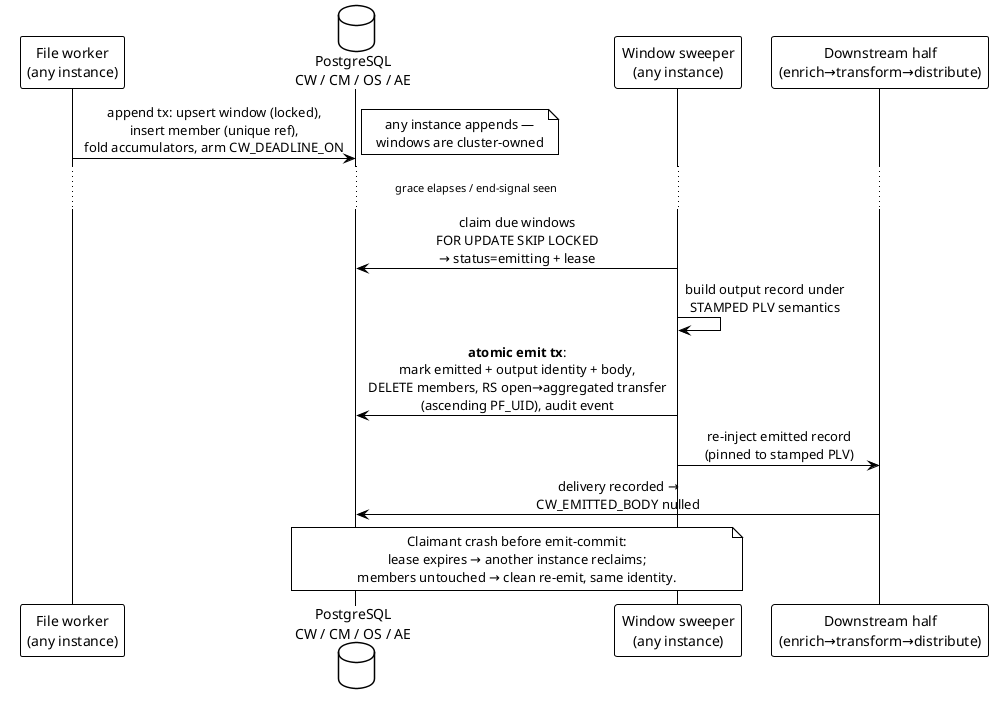

# 06 — Pipeline Stages: Validation, Dedup, Collation, Enrichment, Transformation

> Part of the [[00-index|baasparse TS]]. Previous: [[05-decoding-and-canonical-record]] · Next: [[07-distribution-delivery]]

This section specifies the mid-pipeline stages — everything between decode
([[05-decoding-and-canonical-record]]) and distribute ([[07-distribution-delivery]]):
**validation & screening** (`VAL`), **deduplication** (`DUP`), **correlation/aggregation
(collation)** (`COR`), **enrichment** (`ENR`), and **transformation** (`TRN`) — plus the
**pipeline runtime** that composes them. Naming follows the binding standard of
[[02-conventions]] §2.1; all tables referenced here appear in the §2.2 registry
(this section's earlier draft addition was merged into `OS_OPERATIONAL_STATE` — §6.7).

---

## 6.1 Pipeline runtime

### 6.1.1 The stage graph

A pipeline's behaviour is one published `PLV_PIPELINE_VERSION` row. Its
`PLV_STAGE_GRAPH JSONB` holds the ordered stage list with its configuration pins — the
**normative schema is [[09-configuration-management]] §9.2.1**; the example below is
illustrative of that schema. The pin model is one model everywhere (stated normatively
in §9.2.1): **version-row UIDs** are pinned for the non-effective-dated kinds
(`VR`/`CR`/`DR`/`TR`/`DS`/`FD`) — frozen at publish, so a `PLV` row is a complete,
self-contained processing definition (`BR-CFG-007/008`); **effective-dated kinds**
(enrichment rules, reference data) are pinned by **root UID**, with the governing
version resolved at runtime by the record's **event time** per the latest published
configuration (`BR-CFG-014`, §6.5.4):

```json
{
  "schemaVersion": 1,
  "keyGeneration": 3,
  "requires": [
    { "dataset": "rd:number-portability", "maxAge": "26h" }
  ],
  "source": { "srcUid": 4102, "key": "src:voice-cdr-eu", "version": 3 },
  "format": { "fdUid": 812,   "key": "fd:voice-cdr-v3",  "version": 5 },
  "stages": [
    { "stage": "validate",  "vrUid": 220, "key": "vr:voice-basic-checks",       "version": 4 },
    { "stage": "dedup",     "drUid": 91,  "key": "dr:voice-dedup",              "version": 2 },
    { "stage": "collate",   "crUid": 47,  "key": "cr:voice-agg-subscriber-day", "version": 7 },
    { "stage": "enrich",    "erRootUid": 130, "key": "er:country-by-prefix" },
    { "stage": "transform", "trUid": 501, "key": "tr:voice-normalise",          "version": 3 },
    { "stage": "transform", "trUid": 502, "key": "tr:billing-projection",       "version": 1 }
  ],
  "destinations": [
    { "dsUid": 2011, "key": "ds:billing", "version": 6 },
    { "dsUid": 2012, "key": "ds:fraud",   "version": 2 },
    { "dsUid": 2013, "key": "ds:dwh",     "version": 1 }
  ]
}
```

**Canonical stage order** (fixed; individual stages optional):

```
decode → validate → dedup → [collate] → enrich* → transform* → distribute
```

- `validate` MUST precede `dedup` (only structurally sound records earn a dedup key).
- `dedup` MUST precede `collate` where both are configured — duplicates must never
  inflate a window (`BR-DUP-005`). Publish-time validation (`BR-CFG-003`) **rejects** a
  stage graph violating this order.
- `enrich` and `transform` may appear multiple times (`*`); `decode` is always first and
  `distribute` always last — in the §9.2.1 schema they are carried by the top-level
  `format` and `destinations` pins rather than `stages` entries.
- `requires` declares readiness preconditions (named datasets + freshness bound) —
  evaluated by the collector's claim gate (§6.5.5, `BR-ENR-006`).
- `keyGeneration` is the collation **key-derivation generation** — incremented at publish
  when the collation key spec changes **or when a flush of open windows is requested
  with the publish**, carried forward otherwise. §6.4.10 explains why (`BR-COR-011`).

### 6.1.2 Processing mode is derived, never declared

Per `BR-CFG-010`, the pipeline's mode **follows from its configured stages**:

| Configured stages | Mode | Consequence |
|---|---|---|
| No `collate` stage | **Streaming (pass-through)** | No record bodies persisted anywhere; memory = Σ(stage buffers × batch size × concurrent files) |
| Has a `collate` stage | **Collating** | The collate stage persists canonical members to `CW_COLLATION_WINDOW`/`CM_COLLATION_MEMBER` and releases memory; everything else still streams |

The engine computes and displays the mode from the graph (GUI/API show it read-only);
there is no independent "mode" flag that could contradict the stages.

### 6.1.3 Stage interface

Stages operate **batch-in / batch-out over canonical records**
([[05-decoding-and-canonical-record]]) — batches amortise channel and allocation overhead
(`BR-NFR-003`) while keeping buffers bounded (`BR-NFR-002`):

```go
// internal/pipeline

// Batch is a bounded slice of canonical records with per-record lineage
// (file UID, in-file record index, event time). Batch capacity comes from
// the memory-budget configuration (see 14-performance-sizing).
type Batch struct {
    Records []canonical.Record
    Lineage []RecordRef // parallel slice: PF_UID + record index + event time
}

// Stage is the uniform seam every mid-pipeline stage implements.
// Record-level outcomes (suspense, discard, duplicate, warn) are reported
// through the StageContext sinks — never as errors. A returned error aborts
// the file attempt (claim retry / poison handling, BR-COL-017).
type Stage interface {
    // Process consumes one input batch and yields zero or more output batches.
    // A collate stage absorbs records (persists members, yields nothing).
    Process(ctx context.Context, sc *StageContext, in Batch) ([]Batch, error)

    // Flush runs at end-of-file for stage-held per-file state
    // (e.g. the trailer-count reconciliation in validate).
    Flush(ctx context.Context, sc *StageContext) ([]Batch, error)
}

type StageContext struct {
    File    FileRef         // PF_UID, source, pinned PLV_UID (BR-CFG-007)
    Config  *plv.Resolved   // the pinned stage-graph with resolved rule sets
    Outcome OutcomeSink     // suspend / discard / duplicate / warn + counters
    Audit   audit.Appender  // stage-level audit events (batched)
}
```

`OutcomeSink` maintains **per-file, per-rule counters** in memory and flushes them with
the file's terminal accounting into `RS_RECONCILIATION_SUMMARY` (§6.2.3), so every
record leaving the stream is accounted for (`BR-REC-001/002`).

### 6.1.4 The two halves of a collating pipeline

In collating mode the graph splits at the collate stage:

- **Upstream half** (decode → validate → dedup → collate) runs inside the **file
  worker** under the file claim. A record's file-side terminal state is *appended to a
  window (committed)* — the file can reach its own completion once every record is
  delivered, discarded, suspended, **or contributed to a window**; conservation then
  continues at window level (`BR-REC-001/007`).
- **Downstream half** (enrich → transform → distribute) is re-entered by the **window
  sweeper** (§6.4.7) with emitted aggregate records, running under the window's
  **stamped** `PLV` version (§6.4.10) — not the version of whichever file happened to
  trigger the emit.

In streaming mode the two halves are one uninterrupted chain in the file worker.

---

## 6.2 Validation & screening — `VAL`

### 6.2.1 Rule model

A `VR_VALIDATION_RULESET` row holds a named, versioned, declarative rule set
(`VR_RULES JSONB`, temporal per `BR-CFG-009`). Rules come in two kinds:

- **Validation rules** — assert correctness; failure routes the record per severity.
- **Screening rules** — intentionally **discard** valid-but-unwanted records
  (`BR-VAL-003`); the discard is a first-class, counted, audited terminal outcome.

```json
{
  "name": "voice-basic-checks",
  "rules": [
    { "id": "vr-01", "field": "recordId",      "check": "required",
      "severity": "reject", "reason": "MISSING_RECORD_ID" },
    { "id": "vr-02", "field": "duration",      "check": "type", "type": "integer",
      "severity": "reject", "reason": "BAD_DURATION_TYPE" },
    { "id": "vr-03", "field": "duration",      "check": "range", "min": 0, "max": 86400,
      "severity": "warn",   "reason": "DURATION_OUT_OF_RANGE" },
    { "id": "vr-04", "field": "callingNumber", "check": "regex",
      "pattern": "^\\+?[0-9]{6,20}$",
      "severity": "reject", "reason": "BAD_A_NUMBER" },
    { "id": "vr-05", "field": "cellId",        "check": "referential",
      "dataset": "known-cells",
      "severity": "warn",   "reason": "UNKNOWN_CELL" },
    { "id": "scr-01", "kind": "screen",
      "when": "duration == 0 && recordType == \"voice\"",
      "action": "discard",  "reason": "ZERO_DURATION" }
  ],
  "headerTrailer": { "trailerCountField": "recordCount", "onMismatch": "suspend-file" },
  "profile": null
}
```

Check kinds (`BR-VAL-001`):

| `check` | Semantics |
|---|---|
| `required` | Field present and non-null in the canonical record |
| `type` | Canonical type matches (`integer`, `decimal`, `string`, `timestamp`, `boolean`) |
| `range` | Numeric/timestamp bounds (`min`/`max`, inclusive) |
| `regex` | RE2 pattern match on the string form (RE2: linear-time, no catastrophic backtracking on the hot path) |
| `referential` | Key exists in a named `RD_REFERENCE_DATASET` — reuses the enrichment lookup path and hot cache (§6.5.2) unchanged |
| `expr` | Arbitrary boolean predicate in the transformation expression grammar (§6.6.3) — one grammar, one evaluator, everywhere |

Screening `when` predicates use the same expression grammar. Rules evaluate in listed
order; the **first `reject` outcome wins** for a record (its reason code is the suspense
reason); `warn` outcomes accumulate and never stop evaluation.

### 6.2.2 Severity: reject vs warn (`BR-VAL-002`, `BR-VAL-005`)

| Severity | Effect |
|---|---|
| `reject` | Record routed to `SU_SUSPENSE` with the rule's reason code (stage `validate`), removed from the stream. Never silently dropped (`BR-VAL-002`). |
| `warn` | Record **passes**; the warn is counted per rule, recorded in the file's reconciliation summary and audit context, and a `warn` marker is added to the record's processing context (visible in suspense views if the record later suspends elsewhere). |

Suspense entries hold **references only** (file UID + record index + stage + reason) —
never record content (`BR-ERR-001`); reprocessing re-reads the file
([[08-suspense-reconciliation-replay]]).

### 6.2.3 Screening/discard as a first-class outcome (`BR-VAL-003`, `BR-OPS-014`)

Discard is the one terminal outcome that removes records while reconciliation still
balances — so it is engineered to be impossible to hide:

1. **Per-rule counters.** `OutcomeSink` counts `discarded`/`rejected`/`warned` per rule
   ID. At file completion these flush into the file's `RS_RECONCILIATION_SUMMARY` row:
   the relational totals (`RS_DISCARDED_COUNT`, `RS_SUSPENDED_COUNT`, …) satisfy query/reconciliation
   needs, and a per-rule breakdown is kept in `RS_RULE_OUTCOMES JSONB`
   (`{"scr-01": {"discarded": 1412}, "vr-03": {"warned": 7}}`). JSONB is acceptable here
   because the relational totals carry the reconciliation arithmetic ([[02-conventions]]
   §2.1) — the breakdown is drill-down detail.
2. **Audited in aggregate.** Each file's validation outcome writes one `AE_AUDIT_EVENT`
   carrying the per-rule counts and reason codes — count-level, not per-record (a
   per-record audit row for every zero-duration discard would be an unbounded hot-path
   write for no forensic gain; the reason + count + file reference reconstructs what
   happened, `BR-AUD-002`).
3. **Metrics + anomaly alerting.** Prometheus counters
   `baasparse_discards_total{source, rule, reason}` (and the reject/warn equivalents)
   feed the discard-anomaly monitor ([[12-observability-operations]]), which alerts when
   a rule's discard rate breaches an absolute/relative threshold or step-changes against
   baseline (`BR-OPS-014`, `BR-OPS-008`).
4. **RA visibility.** Reconciliation views expose discard counts *by rule and reason*
   per file/stream/period (`BR-REC-002`).

### 6.2.4 Header/trailer count reconciliation (`BR-VAL-006`)

Header/trailer **parsing** is part of the Format Definition
([[05-decoding-and-canonical-record]]) — the decoder classifies header/trailer records
and surfaces their fields. The **reconciliation** is the validate stage's `Flush`:

- At end-of-file, compare the trailer's declared count (`trailerCountField`) against the
  count of records actually decoded (excluding header/trailer records themselves).
- Mismatch ⇒ **file-level integrity failure**: one `SU_SUSPENSE` entry with scope
  `file`, reason `VAL_TRAILER_MISMATCH` (declared vs actual recorded in context); the
  file's `RS_RECONCILIATION_SUMMARY` is flagged as a reconciliation exception
  (`BR-REC-006`) and an alert raised (`BR-OPS-008`).
- **What `onMismatch` can honestly promise differs by pipeline mode:**
  - **Streaming pipelines.** `suspend-file` (default) holds the file's entire output:
    the source's per-file **delivery hold** ([[07-distribution-delivery]] — sources with
    end-of-decode file-level verdicts keep the file's spooled `DL` rows unpublishable
    until the verdict commits) means nothing from the file has reached a target when the
    trailer is reconciled, so the whole file suspends cleanly pending investigation.
  - **Collating pipelines.** By the time the trailer is read, the file's records have
    already been appended into **shared** collation windows — reversing those appends
    would corrupt other files' aggregates, so wholesale suspension is not honestly
    available. A trailer mismatch here is handled as: reconciliation exception + alarm
    (as above), the file is **blocked from done** (never archived as successfully
    processed), and every affected window is flagged (windows carry the file in
    `CW_CONTRIB_FILES`). **Operator replay** ([[08-suspense-reconciliation-replay]]) is
    the correction path — a verified full replacement or delta per §6.4.8.
  - `record-and-continue` (feeds with known-broken trailers) delivers/appends normally
    with the exception recorded, in either mode.
- Where the trailer count exists, it is the **authoritative "collected" baseline** for
  input conservation; otherwise the fully-decoded count is (`BR-REC-001`).

### 6.2.5 TAP3 (GSMA TD.57) ingestion validation profile (`BR-VAL-007`)

Where a deployment onboards TAP3 roaming-in feeds, the source's ruleset declares
`"profile": {"kind": "tap3", ...}`. The profile layers TAP-specific controls over
generic ASN.1 decode (the exact TD.57 validation subset is confirmed at design,
Open Q16):

```json
{
  "profile": {
    "kind": "tap3",
    "sequence":    { "continuity": true, "scope": "sender-recipient" },
    "fileKinds":   { "transfer": true, "notification": true },
    "severityMap": { "fatal": "suspend-file", "severe": "suspend-record",
                     "warning": "pass-and-record" }
  }
}
```

1. **File-sequence continuity.** The TAP `FileSequenceNumber` (from the Batch Control
   Info / Notification, cross-checked against the TD.57 file name) is tracked per
   `(sender, recipient)` stream using the same per-source sequence machinery as
   `BR-COL-007` (`PF_PROCESSED_FILE.PF_SEQUENCE_NO`): a **gap** raises a sequence-gap alarm
   (missing TAP file = unbilled inbound-roaming revenue); a **duplicate** sequence is an
   audited file rejection (`BR-COL-006`).
2. **Transfer vs notification.** A *notification* file carries no call events; it is
   validated structurally, recorded with 0 records (never treated as an error,
   `BR-COL-016`), advances the sequence, and produces no output. A *transfer* file
   proceeds through the pipeline.
3. **Severity classification.** TAP3 validation errors map to three outcomes, not a
   flat valid/invalid:

   | TD.57 severity | Engine outcome |
   |---|---|
   | **Fatal** (e.g. unreadable Batch Control Info, invalid sender) | **Whole file** to suspense — one file-scope `SU_SUSPENSE` entry, file quarantined for downstream/manual handling, alerted |
   | **Severe** (call-level validation failure) | **That record** to suspense (record-scope entry), stream continues |
   | **Warning** | Record **passes**; warn counted and recorded (as §6.2.2) |

4. **Out of scope, stated.** RAP file generation and roaming settlement output are
   roadmap items ([[../brs/10-roadmap|BRS 10]]); v1's obligation is to quarantine and
   report TAP3 rejects clearly, which the suspense + reconciliation + alarm paths above
   deliver.

---

## 6.3 Deduplication — `DUP`

### 6.3.1 Key derivation (`BR-DUP-001`)

`DR_DEDUP_RULE` (`DR_KEY_SPEC JSONB` + `DR_RETENTION`, temporal) defines the key:

```json
{
  "name": "voice-dedup",
  "key": { "mode": "fields", "fields": ["recordId", "eventStart"] },
  "bucket": "event-time",
  "retention": "96h",
  "scope": "pipeline"
}
```

or, for feeds with no reliable natural identity:

```json
{ "key": { "mode": "record-hash", "exclude": ["fileName", "arrivalTs"] } }
```

The stored key is always a **SHA-256 digest (32 bytes)** over a **canonical field
encoding**, so the store is fixed-width regardless of field sizes and immune to
delimiter-injection ambiguity. The encoding, over the selected fields in the
**configured order** (`fields` mode) or over all canonical fields in **schema order**
minus exclusions (`record-hash` mode):

```
for each field:
    uvarint(len(name))  ‖ name-bytes(UTF-8)
    type-tag (1 byte: i=int, d=decimal, s=string, t=timestamp, b=bool, n=null)
    uvarint(len(value)) ‖ canonical-value-bytes
key = SHA-256(concatenation)
```

Canonical value bytes come from the canonical record's typed representation
([[05-decoding-and-canonical-record]]): integers as decimal ASCII, decimals in
normalised form (no trailing zeros), timestamps as UTC RFC 3339 with fixed precision,
strings as raw UTF-8. Length-prefixing makes the encoding **injective** — two different
field vectors can never produce the same byte stream. Where PII tokenisation is enabled
(`BR-CMP-001`), the key is computed over the **deterministic tokens**, so dedup still
matches ([[13-security-compliance]]).

### 6.3.2 `DK_DEDUP_KEY`: insert-or-detect

Key columns (full DDL in [[03-database-design]]):

| Column | Meaning |
|---|---|
| `DK_UID` | Surrogate identity (PK includes the partition column, a partitioning necessity noted in 03) |
| `DK_PL_UID` | Scope: the pipeline's **logical** identity (`PL_PIPELINE`) — stable across config versions, so a rule edit never resets dedup memory |
| `DK_KEY_HASH` | `BYTEA(32)` SHA-256 key |
| `DK_KEY_DATE` | Partition column: the record's **event date** (default; see below) |
| `DK_PF_UID`, `DK_RECORD_INDEX` | First-seen lineage (which file/record claimed the key) — duplicate investigation and `BR-DUP-003` accounting |
| audit columns | `DK_CREATED_BY = engine:<instance>` etc. |

Unique index: `UX_DK_SCOPE_KEY (DK_PL_UID, DK_KEY_HASH, DK_KEY_DATE)`.

The check is a **single atomic statement**, batched per input batch:

```sql
INSERT INTO baasparse.DK_DEDUP_KEY
       (DK_PL_UID, DK_KEY_HASH, DK_KEY_DATE, DK_PF_UID, DK_RECORD_INDEX,
        DK_CREATED_BY, DK_MODIFIED_BY)
SELECT * FROM unnest($1::bigint[], $2::bytea[], $3::date[], $4::bigint[], $5::bigint[],
                     $6::text[],   $7::text[])
ON CONFLICT (DK_PL_UID, DK_KEY_HASH, DK_KEY_DATE) DO NOTHING
RETURNING DK_KEY_HASH;
```

Hashes present in the input but absent from `RETURNING` are **duplicates**.
`INSERT … ON CONFLICT DO NOTHING` is the atomic check-and-record: PostgreSQL's
speculative insertion lock guarantees that of two **concurrent** inserts of the same key
— from different instances, different files, or the same batch — **exactly one** wins
and the other observes the conflict. There is no check-then-insert window, no advisory
locking, and no serialisation beyond the index page — which is why this is the mechanism
rather than `SELECT`-then-`INSERT` (`BR-HA-005`: behaviour identical from any instance).

### 6.3.3 Partitioning, bucketing, and expiry (`BR-DUP-002`, `BR-DUP-004`)

`DK_DEDUP_KEY` is **range-partitioned by day** on `DK_KEY_DATE`
(`DK_DEDUP_KEY_P20260704`, per [[02-conventions]] §2.1). Expiry of the retention window
is a **partition drop** by the dedup-maintenance job (`SJ_SCHEDULED_JOB`) — never
row-by-row deletion — keeping the highest-write-rate store's housekeeping off the
write path (`BR-NFR-024`).

**Why the partition key is event date, not arrival date.** A global unique constraint on
a partitioned table must include the partition column. If rows were bucketed by
*arrival* date, a duplicate arriving on a later day would land in a different partition
and the `ON CONFLICT` target could not see the original — reintroducing the
check-then-insert race at day boundaries. Bucketing by the record's **event date**
(a canonical field) makes the partition **deterministic from the record itself**: a
true duplicate is byte-identical, computes the same event date, targets the same
partition, and conflicts atomically. `(scope, hash, event-date)` uniqueness is therefore
equivalent to `(scope, hash)` uniqueness for identical records.

- Fallback: a feed whose records carry no event time may configure
  `"bucket": "arrival"`; the day-boundary race then exists in a window of seconds around
  midnight and is documented as a residual, covered by the same backstops as §6.3.4.
- Partitions are retained for **max(retention across rules bucketed to them)** and
  pre-created ahead of time (plus backfill-deep partitions during a declared catch-up,
  since old event dates insert into old partitions).

### 6.3.4 Retention window vs retransmission horizon (`BR-DUP-006`)

The per-source `retention` MUST be set ≥ that source's **maximum legitimate re-send
horizon plus its maximum delivery lag** (event-date bucketing measures age from event
time, so the original delivery lag consumes part of the window; the per-feed horizon
figure is Open Q19). The documented **residual risk**: a duplicate arriving after its
key's partition is dropped is undetectable at record level and processes as new.

The engine enforces the boundary as an explicit **retention-floor check** rather than
letting it emerge from partition errors: a record whose event date is older than the
oldest retained `DK` partition **skips the dedup insert entirely** and is processed as
new — counted per file and visible in reconciliation context. This makes behaviour at
the horizon deterministic and identical to the documented residual (rather than a
failed insert against a nonexistent partition), and the floor is engine-side, so a
partition dropped between check and insert cannot surface as a hot-path error. The
residual is bounded, not hidden, by two longer-horizon backstops:

1. **File-level re-arrival detection** (`BR-COL-006`) — `PF_PROCESSED_FILE` metadata
   (name/checksum) is retained far longer than record keys and catches whole-file
   re-sends.
2. **Idempotent RDBMS delivery** (`BR-DST-013/018`) — a re-emitted identical output
   record upserts on its deterministic identity at database targets regardless of the
   record-key window.

### 6.3.5 Duplicate accounting (`BR-DUP-003`)

A detected duplicate is **not delivered** and **not suspended** — it is counted:
per-file `RS_DUPLICATE_COUNT` in `RS_RECONCILIATION_SUMMARY`, with the first-seen reference
(`DK_PF_UID`/`DK_RECORD_INDEX`) available for investigation, and
`baasparse_duplicates_total{pipeline}` for monitoring. Duplicates are a distinct term in
the input-conservation equation (`BR-REC-001/002`).

### 6.3.6 Dedup key ≠ correlation key (`BR-DUP-005`)

The dedup key is **whole-record identity** ("have I seen this exact event record
before?"); the correlation key (§6.4) is **event identity** ("which logical event do
these partials belong to?"). Legitimately-related partial records — the legs/segments
that collation exists to join — *share a correlation key but differ in content* (segment
number, timestamps, partial indicator), so their dedup keys differ and dedup never drops
them. Publish-time validation warns if a dedup rule's field set is a subset of the same
pipeline's correlation key (a config almost certainly wrong, since it would collapse
distinct partials). Ordering (dedup **before** collate) is enforced by §6.1.1.

### 6.3.7 v2 read-path pre-filter seam (`BR-NFR-025`)

Dedup is consumed through one stable interface:

```go
// internal/dedup

// Verdict for one key in a batch.
type Verdict uint8
const (
    New Verdict = iota // recorded now — first sighting
    Duplicate          // already present (DB-confirmed)
)

// KeyStore atomically records a batch of keys and reports, per key,
// whether it was new or a duplicate. Implementations MUST be safe for
// concurrent use from any instance and MUST never report Duplicate
// without database confirmation.
type KeyStore interface {
    CheckAndRecord(ctx context.Context, scope PipelineID, day civil.Date,
        keys [][32]byte, lineage []RecordRef) ([]Verdict, error)
}
```

v1 ships the direct `pgKeyStore` (§6.3.2). v2 wraps it with a bounded in-memory
pre-filter (probabilistic set / recent-key cache) that answers *definitely-new* cheaply
and forwards only *possible-duplicate* candidates to the inner store — same interface,
identical semantics, never a false `Duplicate` (any positive is DB-confirmed). A pure
performance change with no effect on on-disk state, which is exactly what the seam
requires.

---

## 6.4 Collation — correlation & aggregation — `COR`

> Collation is optional per pipeline (`BR-COR-001/004` are Should); every MUST below is
> conditional: *where the pipeline collates*. This subsection is the heart of the
> engine's stateful design: the only place record content is persisted (`BR-NFR-009`),
> the proving ground for the cluster lease mechanism (`BR-COR-008`), and the stage with
> the subtlest correctness rules (`BR-COR-010/011/012`).

### 6.4.1 Rule model

`CR_CORRELATION_RULE` (`CR_KEY_SPEC` / `CR_COMPLETION_SPEC` / `CR_AGGREGATE_SPEC` JSONB + policy columns, temporal) — one rule per collate stage:

```json
{
  "name": "voice-agg-subscriber-day",
  "mode": "aggregate",
  "key": ["subscriberId"],
  "window": { "basis": "eventTime", "size": "P1D", "timezone": "Africa/Johannesburg" },
  "aggregate": { "duration": "sum", "bytesUp": "sum", "bytesDown": "sum", "*": "count" },
  "retainMemberBodies": false,
  "complete": {
    "triggers": [
      { "kind": "endSignal",    "field": "partialIndicator", "finalValue": "final" },
      { "kind": "count",        "expected": 4 },
      { "kind": "sessionClose", "field": "causeForTermination", "values": ["sessionEnd"] },
      { "kind": "graceTimeout", "after": "15m" }
    ]
  },
  "incompleteAtTimeout": "emit-partial",
  "lateArrival": "delta",
  "postEmitRetention": null
}
```

```json
{
  "name": "data-session-join",
  "mode": "correlate",
  "key": ["chargingId", "eventDate"],
  "window": { "basis": "eventTime", "size": "P1D", "timezone": "UTC" },
  "assemble": { "strategy": "coalesce-by-role", "roleField": "recordType",
                "roles": ["sgw", "pgw"] },
  "retainMemberBodies": true,
  "complete": {
    "triggers": [
      { "kind": "count", "expected": 2 },
      { "kind": "graceTimeout", "after": "30m" }
    ]
  },
  "incompleteAtTimeout": "suspend",
  "lateArrival": "suspend",
  "postEmitRetention": "72h"
}
```

- `mode: correlate` assembles one logical record from member **bodies** at emit —
  `retainMemberBodies` is forced `true` while open.
- `mode: aggregate` folds members into **accumulators** at append; member bodies are
  not needed for emit and default to reference-only members
  (`retainMemberBodies: false`).
- `key` fields are read from the canonical record **after dedup** — normalised,
  tokenised where PII rules apply (`BR-CMP-001`: deterministic tokens still collate).
- Aggregate functions: `sum`, `count`, `min`, `max` (`BR-COR-004`); `"*": "count"` is
  the contributing-count shorthand.

### 6.4.2 Working-set model: `CW_COLLATION_WINDOW` + `CM_COLLATION_MEMBER`

One `CW` row per **open window** — the unit of completion, claim, and emit. Key columns
(full DDL in [[03-database-design]]):

| Column | Meaning |
|---|---|
| `CW_UID` | Surrogate identity |
| `CW_PL_UID` | Owning pipeline (logical). *v2 seam:* an additive migration adds nullable `CW_CG_UID` → `CG_CORRELATION_GROUP` for cross-source scopes (§6.4.12); no v1 column carries source binding |
| `CW_PLV_UID` | **Stamped governing config version**, set at window open, never changed (`BR-COR-011`) |
| `CW_KEY` | Canonical correlation/group key (joined key fields, unit-separated) |
| `CW_KEY_HASH` | 64-bit hash of `CW_KEY` — the **hash-partition column** |
| `CW_KEY_GEN` | Key-derivation generation from the stamped PLV (§6.4.10) |
| `CW_WINDOW_START`, `CW_WINDOW_END` | Event-time window bounds (UTC instants computed from the rule's zone; equal to the key's whole validity for unwindowed rules) |
| `CW_STATUS` | `OPEN · EMITTING · EMITTED · SUSPENDED · DISCARDED` (TEXT + CHECK). There is **no held status**: intake stalls and declared catch-ups never change window state — they suppress due evaluation via `OS_OPERATIONAL_STATE` (§6.4.9) |
| `CW_TRIGGER_STATE` | JSONB runtime trigger state (end-signal seen, session-close seen, expected count) |
| `CW_DEADLINE_ON`, `CW_DUE_REASON` | Single indexed due deadline + which trigger armed it (`GRACE · END_SIGNAL · COUNT · SESSION_CLOSE · FLUSH`); NULL while not due-armed |
| `CW_LAST_APPEND_ON` | Wall-clock time of last member append (grace-timer basis) |
| `CW_MEMBER_COUNT` | Contributing-record count |
| `CW_AGG_STATE` | JSONB aggregate accumulators (aggregation mode) |
| `CW_CONTRIB_FILES` | JSONB array of distinct contributing `PF_UID`s (rolled up; retained after emit for `BR-COR-012(b)` verification) |
| `CW_EMITTED_ON`, `CW_OUTPUT_IDENTITY`, `CW_EMITTED_BODY` | Emit results: timestamp, deterministic output identity (`BR-DST-018`), and the emitted canonical record (durable hand-off to the downstream half; nulled once delivery is recorded — but **retained while any `SU_SUSPENSE` entry anchors on the window** via `SU_CW_UID`, §6.4.7) |
| `CW_ADJUSTMENT_SEQ` | Monotonic per-window adjustment counter (`BR-COR-012(a)`), 0 until first delta |
| `CW_INS_UID`, `CW_EMIT_EXPIRES_ON` | Emit claimant + heartbeat lease (crash recovery of `EMITTING`) |
| audit columns | per convention |

`CM_COLLATION_MEMBER` — one row per contributing member of an **open** window:

| Column | Meaning |
|---|---|
| `CM_UID` | Surrogate identity |
| `CM_CW_UID`, `CM_KEY_HASH` | Owning window (+ co-partitioning hash) |
| `CM_PF_UID`, `CM_RECORD_INDEX` | Deterministic member reference (contributing file + in-file ordinal) — **unique per window** (`UX_CM_MEMBER`), the mechanism behind no-double-contribution (`BR-COR-012(c)`); also the lineage reference |
| `CM_EVENT_TIME` | Member's canonical event time |
| `CM_BODY` | Canonical record body JSONB — NULL for reference-only members (aggregation default) |
| audit columns | per convention |

**Hash partitioning (R20, `BR-COR-006`).** Both tables are `PARTITION BY HASH` on the
key hash (`CW_COLLATION_WINDOW_H00 … _H15`, default 16 partitions, sized at deployment),
so concurrent appends from multiple instances spread across partition B-trees instead of
serialising on one index/heap hot spot. This is the single-primary, v1-viable mitigation
— distinct from v2 cross-primary sharding (`BR-NFR-024`). A single very hot *key* still
serialises on its own row (every append updates it); that is the v1 aggregation ceiling
(§6.4.13). Content in `CM_BODY`/`CW_EMITTED_BODY` is the one record-data exception to
`BR-NFR-009` and is subject to PII masking/tokenisation and retention controls
([[13-security-compliance]], `BR-CMP-001/002`).

### 6.4.3 Append path — atomic upsert from any instance (`BR-COR-006/008`)

Any instance appends; the working set has no notion of the ingesting instance.

**Retention-floor pre-check (before touching the working set).** The engine first
checks the computed window identity against the **emitted-row retention horizon**
(§6.4.11): a window start older than the horizon is routed **directly to the
late-arrival path** (§6.4.8) *without* attempting the upsert. Beyond the horizon a
pruned emitted window and a never-seen window are indistinguishable — inserting would
silently resurrect an already-emitted window as if new. The pre-check makes the
behaviour deterministic and matches the documented residual (late-arrival policy
applies; whether the identity was ever emitted is unknowable past the horizon).
Corollary: **EMITTED-row retention MUST be ≥ the late-arrival detection horizon** the
deployment intends to honour.

Within the horizon: per member, **one transaction, three statements** (batched per key
within an input batch):

```sql
BEGIN;

-- (1) Ensure the window exists; detect closed windows.
--     Conflict arbiter: the FULL (non-partial) unique index over
--     (CW_PL_UID, CW_KEY_HASH, CW_KEY_GEN, CW_KEY, CW_WINDOW_START),
--     spanning ALL statuses ([[03-database-design]]) — so a window identity
--     always conflicts with its existing row, whatever state that row is in.
INSERT INTO baasparse.CW_COLLATION_WINDOW
       (CW_PL_UID, CW_PLV_UID, CW_CR_UID, CW_KEY, CW_KEY_HASH, CW_KEY_GEN,
        CW_WINDOW_START, CW_WINDOW_END, CW_STATUS, CW_TRIGGER_STATE,
        CW_LAST_APPEND_ON, CW_MEMBER_COUNT, CW_AGG_STATE, CW_CONTRIB_FILES,
        CW_CREATED_BY, CW_MODIFIED_BY)
VALUES ($1,$2,$cr,$3,$4,$5,$6,$7,'OPEN',$8, now(), 0, $9, '[]'::jsonb, $10,$10)
ON CONFLICT (CW_PL_UID, CW_KEY_HASH, CW_KEY_GEN, CW_KEY, CW_WINDOW_START)
DO UPDATE SET CW_MODIFIED_ON = now()          -- no-op touch: takes the row lock
WHERE CW_COLLATION_WINDOW.CW_STATUS = 'OPEN'
RETURNING CW_UID, CW_STATUS, CW_PLV_UID;
-- 0 rows returned  ⇒  the conflict hit an EMITTING/EMITTED/SUSPENDED/DISCARDED
--                     row (the DO UPDATE's WHERE filtered it out)
--                  ⇒  LATE-ARRIVAL path (§6.4.8); the handler re-reads the
--                     conflicting row (plain SELECT) to record which closed
--                     state was hit

-- (2) Insert the member; the unique member reference blocks double-contribution.
INSERT INTO baasparse.CM_COLLATION_MEMBER
       (CM_CW_UID, CM_KEY_HASH, CM_PF_UID, CM_RECORD_INDEX, CM_EVENT_TIME, CM_BODY,
        CM_CREATED_BY, CM_MODIFIED_BY)
VALUES ($cwUid, $4, $pf, $idx, $evt, $body, $10, $10)
ON CONFLICT (CM_CW_UID, CM_PF_UID, CM_RECORD_INDEX, CM_KEY_HASH) DO NOTHING
RETURNING CM_UID;
-- 0 rows returned  ⇒  already contributed (replay/reprocess)  ⇒  skip step (3),
--                     audit as blocked double-contribution (BR-COR-012(c))

-- (3) Fold the member into the window row (only if (2) inserted).
UPDATE baasparse.CW_COLLATION_WINDOW
   SET CW_MEMBER_COUNT   = CW_MEMBER_COUNT + 1,
       CW_LAST_APPEND_ON = now(),
       CW_AGG_STATE      = baasparse.fold_accumulators(CW_AGG_STATE, $member, $aggSpec),
       CW_CONTRIB_FILES  = CASE WHEN NOT CW_CONTRIB_FILES @> to_jsonb($pf)
                                THEN CW_CONTRIB_FILES || to_jsonb($pf)
                                ELSE CW_CONTRIB_FILES END,
       CW_TRIGGER_STATE  = $newTriggerState,
       CW_DEADLINE_ON    = $dueAt,        -- see trigger evaluation, §6.4.5
       CW_DUE_REASON     = $dueReason,
       CW_MODIFIED_BY    = $10, CW_MODIFIED_ON = now()
 WHERE CW_UID = $cwUid;

COMMIT;
```

Notes:

- The `ON CONFLICT … DO UPDATE (no-op) … WHERE status = 'OPEN'` upsert is the
  atomic *find-or-create-and-lock*: it returns the window **with its row locked** for
  the rest of the transaction, so appends to one key serialise correctly, appends to
  different keys don't interact, and a window being claimed by the sweeper (row locked
  `FOR UPDATE`) simply blocks briefly — after which the status check routes the record
  to the late-arrival path if the sweeper won. Conversely the sweeper's
  `SKIP LOCKED` scan skips a window mid-append, so **a window being actively appended to
  is never completed prematurely** (`BR-COR-008`).
- **Late-arrival detection is structural, not procedural**: because the arbiter index
  spans all statuses, a closed window can never be shadowed by a second live row for
  the same identity — the insert *must* conflict, and the `DO UPDATE`'s status filter
  returning 0 rows *is* the late-arrival signal (`BR-COR-012`).
- The conflict target includes `CW_WINDOW_START` (event-time assignment, §6.4.5) and
  `CW_KEY_GEN` (version pinning, §6.4.10).
- Step (3) is the same row the append must touch anyway (grace timer, count) — folding
  aggregation accumulators there adds no extra contention.
- The whole tx is a handful of index operations: the file worker batches appends and the
  memory for the records is released at commit — the working set lives in PostgreSQL,
  not memory (`BR-COR-003/005`, `BR-NFR-001`).

### 6.4.4 Completion triggers (`BR-COR-007`)

Configured per rule, evaluated at **append time** (step 3 computes
`CW_DEADLINE_ON`/`CW_DUE_REASON`), in priority order:

| # | Trigger | Kind | Due semantics |
|---|---------|------|----------------|
| 1 | **Explicit end-of-event signal** | event-intrinsic | Final flag / closing cause / last-sequence marker seen in a member ⇒ `CW_DEADLINE_ON = now()`, reason `END_SIGNAL` — emit as soon as the sweeper sees it |
| 2 | **Grace timeout** | wall-clock | `CW_DEADLINE_ON = CW_LAST_APPEND_ON + grace`, reason `GRACE` — re-armed by every append; fires only when no member has arrived for the grace period |
| 3 | **Record count** | event-intrinsic | `CW_MEMBER_COUNT == expected` ⇒ due `now()`, reason `COUNT` |
| 4 | **Session close** | event-intrinsic | A member matching the session-close predicate ⇒ due `now()`, reason `SESSION_CLOSE` |

Multiple triggers may be configured; **the first to fire wins** and `CW_DUE_REASON`
records which. An event-intrinsic due (1/3/4) marks the window *complete*; a grace due
marks it *timed out* and engages the incomplete-at-timeout policy if the rule's
completeness condition (expected count / end signal) was not met (§6.4.8).

### 6.4.5 The two clocks (`BR-COR-010`)

Collation uses two distinct clocks, and conflating them is the classic mediation bug:

- **Event time** — the record's canonical event start-date/time, carried in the record.
  **Window assignment** (`CW_WINDOW_START = floor(eventTime, window.size, window.timezone)`),
  **grouping keys**, and **effective-dated rule/reference selection** (`BR-ENR-005`) are
  all computed from event time. A file processed today carrying yesterday's events lands
  in yesterday's windows — never "now's".
- **Wall clock** — only the **grace timeout** (elapsed time since the last member was
  appended), because "have we waited long enough for stragglers?" is inherently a
  real-world-time question.

**Timezone/DST-aware boundaries.** `floor(eventTime, size, zone)` converts the event
instant into the rule's IANA zone via the shared time library of §6.6.5 (`BR-TRN-010`),
truncates in *local* time, and converts back to a UTC instant for `CW_WINDOW_START`.
Daily windows over a DST change are therefore 23h/25h long — correct, and identical no
matter which instance computes them. The DST fall-back ambiguity policy (§6.6.5) applies
when the event time itself is a local time.

**Routing by the two clocks:**

- Event time falls in a **still-open** window ⇒ appended to that window (however old the
  event is) — the normal path.
- Event time falls in an **already-closed** window (the append's `DO UPDATE` returns
  0 rows, §6.4.3), or in a window boundary **older than the emitted-row retention
  horizon** (caught by the §6.4.3 pre-check, §6.4.11) ⇒ **late arrival** (§6.4.8).

**Missing event time.** A record with no canonical event time cannot be
window-assigned. In a collating pipeline it **suspends** by default (stage `collate`,
reason `COR_EVENT_TIME_MISSING`); alternatively the rule may configure an explicit
**arrival-time fallback** (`"eventTimeFallback": "arrival"`), in which case the
substitution is recorded in the record's processing context and audit — never a silent
default.

### 6.4.6 Window lifecycle

```plantuml
@startuml window-lifecycle
!theme plain
skinparam defaultTextAlignment center
skinparam state { BackgroundColor #E8F0FE BorderColor #4472C4 }

[*] --> open : first member appended\n(CW stamped with governing PLV,\nBR-COR-011)
open --> open : append member\n(atomic tx, any instance;\ngrace deadline re-armed)
open --> emitting : due + claimed by sweeper\n(FOR UPDATE SKIP LOCKED\n+ emit lease)
emitting --> emitted : **atomic emit tx**\n(consume members, record output,\nmark emitted — one tx, BR-COR-006)
emitting --> open : claimant crashed →\nlease expired, reclaimed
open --> suspended : grace due, incomplete,\npolicy = suspend (audited)
open --> discarded : grace due, incomplete,\npolicy = discard (audited)
emitted --> emitted : late arrival → **delta emission**\n(adjustment identity =\nwindow identity + CW_ADJUSTMENT_SEQ)
emitted --> [*] : retention horizon passed →\nrow pruned (counts already\nin RS/AE)
suspended --> [*]
discarded --> [*]
note bottom of open
  There is no held state. Intake stalls and declared
  catch-ups suppress GRACE dues via the sweeper's
  OS_OPERATIONAL_STATE probe — the window stays OPEN.
  At stall end a fresh grace is re-armed (catch-up end:
  FLUSH due) in the same transaction as the OS clear (§6.4.9).
end note
@enduml
```

### 6.4.7 The window sweeper — claim, atomic emit, downstream re-entry (`BR-COR-006/008`)

The sweeper is a cluster-wide, **lease-based** worker running on **every** instance (it
is the v1 proof of the scheduled-job lease seam, [[01-architecture]] §1.4). Windows are
owned collectively via PostgreSQL — never by the instance that ingested their members —
so a due window is claimed and completed by whichever instance gets there first, and a
dead ingester strands nothing.

**Due-window claim** (short transaction):

```sql
BEGIN;
SELECT w.CW_UID
  FROM baasparse.CW_COLLATION_WINDOW w
 WHERE w.CW_STATUS = 'OPEN'
   AND w.CW_DEADLINE_ON IS NOT NULL AND w.CW_DEADLINE_ON <= now()
   -- grace dues are suppressed while any ACTIVE OS row covers the window —
   -- SOURCE-, PIPELINE- or CLUSTER-scoped (event-intrinsic dues still fire,
   -- per BR-COR-007 catch-up rule (i)); source scope resolved via the
   -- pipeline→source relationship (SRC_PL_UID):
   AND (w.CW_DUE_REASON <> 'GRACE' OR NOT EXISTS (
          SELECT 1 FROM baasparse.OS_OPERATIONAL_STATE s
           WHERE s.OS_STATUS = 'ACTIVE'
             AND (s.OS_SCOPE = 'CLUSTER'
                  OR s.OS_PL_UID = w.CW_PL_UID
                  OR s.OS_SRC_UID IN (SELECT src.SRC_UID
                                        FROM baasparse.SRC_SOURCE src
                                       WHERE src.SRC_PL_UID = w.CW_PL_UID))))
 ORDER BY w.CW_DEADLINE_ON
   FOR UPDATE OF w SKIP LOCKED
 LIMIT $batch;

UPDATE baasparse.CW_COLLATION_WINDOW
   SET CW_STATUS = 'EMITTING', CW_INS_UID = $me,
       CW_EMIT_EXPIRES_ON = now() + $lease,
       CW_MODIFIED_BY = $engineId, CW_MODIFIED_ON = now()
 WHERE CW_UID = ANY($claimed);
COMMIT;
```

The `OS_OPERATIONAL_STATE` suppression probe covers **all three declared-state
scopes**: `CLUSTER`-scoped rows (e.g. the journaled fail-closed interval,
`BR-NFR-019`) suppress every pipeline's grace dues; `PIPELINE`-scoped rows suppress one
pipeline's; `SOURCE`-scoped rows are resolved via the pipeline→source relationship —
the `SRC_SOURCE` rows whose `SRC_PL_UID` references the window's pipeline — at
query-build time (inline as above, or as a prepared per-pipeline source-set lookup).
Destination-driven conditions have **no destination scope here**: `BR-DST-017`
overflow pause-intake is declared as **SOURCE-scoped rows for every source feeding the
bounded destination** (§6.4.9), so the probe needs no destination joins. A
denormalised `CW_SRC_UID` on the working set was deliberately rejected: the working
set must carry no hard source binding (the v2 cross-source seam, `BR-COR-009`) — in
v2, correlation-group windows derive their suppression scope from the group's
participating sources.

`FOR UPDATE SKIP LOCKED` gives each due window to **exactly one** surviving instance
(the same mechanism as file claims, `BR-HA-003`); the heartbeat-renewed emit lease makes
a claimant crash recoverable — the sweeper's scan also reclaims
`emitting`-with-expired-lease windows back to the claim step (the emit tx below is
all-or-nothing, so a reclaimed window is always in a re-emittable state: nothing was
consumed).

**Atomic emit** — one transaction per window (`BR-COR-006`):

```sql
BEGIN;
-- re-take the row and re-verify (defensive; append races resolved by locks)
SELECT ... FROM baasparse.CW_COLLATION_WINDOW
 WHERE CW_UID = $w AND CW_STATUS = 'EMITTING' AND CW_INS_UID = $me
   FOR UPDATE;

-- build the output record in memory:
--   aggregate mode: from CW_AGG_STATE (+ CW_MEMBER_COUNT)
--   correlate mode: from CM_BODY rows per the assemble strategy
--   under the STAMPED version's semantics (CW_PLV_UID, BR-COR-011)

UPDATE baasparse.CW_COLLATION_WINDOW
   SET CW_STATUS          = 'EMITTED',
       CW_EMITTED_ON      = now(),
       CW_OUTPUT_IDENTITY = $identity,   -- deterministic, BR-DST-018 (see below)
       CW_EMITTED_BODY    = $outputRecord,
       CW_AGG_STATE       = NULL,
       CW_INS_UID = NULL, CW_EMIT_EXPIRES_ON = NULL,
       CW_MODIFIED_BY = $engineId, CW_MODIFIED_ON = now()
 WHERE CW_UID = $w;

-- consume the members: default drops bodies AND rows — the rolled-up
-- CW_MEMBER_COUNT + CW_CONTRIB_FILES are the retained lineage (BR-COR-006);
-- with postEmitRetention configured, rows are kept and pruned later instead.
DELETE FROM baasparse.CM_COLLATION_MEMBER WHERE CM_CW_UID = $w;

-- reconciliation transfer (BR-REC-001/007): for every contributing file, this
-- window's member contribution moves from the open/in-flight bucket into the
-- aggregated bucket of the file's RS_RECONCILIATION_SUMMARY row — one UPDATE per
-- PF_UID in CW_CONTRIB_FILES, executed in ASCENDING PF_UID order (the fixed
-- lock-acquisition order that makes concurrent emits deadlock-free).
UPDATE baasparse.RS_RECONCILIATION_SUMMARY
   SET /* open in-flight − n_f, aggregated + n_f (exact columns: 03 §3.9.3) */ ...
 WHERE RS_PF_UID = $pf;                       -- repeated per file, ascending PF_UID

INSERT INTO baasparse.AE_AUDIT_EVENT (...);  -- emit event: window identity, trigger,
                                             -- completeness, governing PLV, counts
COMMIT;
```

The emit transaction creates **no `DL_DELIVERY` rows**: the downstream half hands the
emitted record to the distribution spool, and DL rows are created by the spool writers
at roll ([[07-distribution-delivery]]).

Consume-members, record-output, mark-emitted commit **together or not at all**: a crash
before commit leaves the window `emitting` with members intact (lease expiry ⇒
re-claim ⇒ re-emit, deterministic identity ⇒ no duplicate); a crash after commit leaves
a durable `CW_EMITTED_BODY` from which the downstream half re-runs idempotently. No
failure point loses inputs or double-emits (`BR-NFR-011/012`).

**Deterministic output identity** (`BR-DST-018`): the normative identity grammar is
defined once, in [[07-distribution-delivery]] **§7.4.2**. For aggregates:

```
identity = agg:{PL_UID}:{keyGen}:{sha256hex(canonicalKey)}:{epochSecondsWindowStart}
delta    = <aggregate identity>:a{n}     (n = CW_ADJUSTMENT_SEQ; kind = DELTA, §6.4.8)
```

`keyGen` is the window's **stamped** key generation (`CW_KEY_GEN`) — recorded in
lineage, so a replacement re-emits under the stamped generation, which is what makes
the identity reproducible from configuration + data, independent of UIDs and of which
instance emitted.

**Downstream re-entry.** After the emit commits, the sweeper worker feeds the emitted
record from `CW_EMITTED_BODY` into the pipeline's downstream half (enrich → transform →
distribute) under the **stamped** `PLV` (enrichment reads live reference-data snapshots
regardless — `BR-ENR-004` excludes reference data from pinning). Once
[[07-distribution-delivery]] records the emission's delivery, `CW_EMITTED_BODY` is
nulled — the retained emitted row is then metadata only (identity, counts, contributing
files, adjustment sequence).

**Downstream-half failure ⇒ aggregate suspense.** If a downstream-half stage fails the
emitted aggregate (enrichment `onMiss: suspend`, transform expression/output-schema
failure, DISTRIBUTE-stage target-schema mismatch), the `SU_SUSPENSE` entry anchors on
the **window**, via `SU_CW_UID` ([[03-database-design]],
[[08-suspense-reconciliation-replay]]) — there is no single source file to anchor on.
While any suspense entry references the window, `CW_EMITTED_BODY` is **retained** (the
delivery-recorded nulling is deferred): the members were consumed at emit, so the
retained body *is* the reprocessing input. Reprocessing after correction **re-emits
from the retained body** through the downstream half under the stamped `PLV` — same
identity, idempotent at the target.



### 6.4.8 Incomplete-at-timeout and late-arrival policies (`BR-COR-007`, `BR-COR-012`)

**Incomplete at timeout** — a grace-due window whose completeness condition was unmet:

| Policy | Behaviour |
|---|---|
| `emit-partial` | Emit normally with `partial=true` in the output metadata and audit; identity as §6.4.7 |
| `suspend` | Window → `SUSPENDED`; one `SU_SUSPENSE` entry (stage `collate`, reason `COR_INCOMPLETE_TIMEOUT`) referencing the window and its member references (file UID + index each — content re-readable from disk, `BR-ERR-001`); members retained until resolution |
| `discard` | Window → `DISCARDED`; counted per `BR-REC-002`, audited |

**Late arrival** — a record whose window has already emitted (§6.4.5):

| Policy | Behaviour |
|---|---|
| `delta` | Emit an **adjustment** (below) |
| `suspend` | Record to `SU_SUSPENSE` (reason `COR_LATE_ARRIVAL`) — operator decides |
| `discard` | Counted + audited discard |

**Delta emissions (`BR-COR-012(a)`).** A delta is **never** emitted under the original
identity — at an idempotent target that would *overwrite* the true total. Instead:

1. Build the delta record in memory: aggregation mode folds *only the late member(s)*
   (sum/count deltas; `min`/`max` deltas are emitted as observed candidate values,
   flagged for consumer-side merge); correlation mode emits the late part.
2. **One transaction — the mirror of the main emit tx** — makes the delta durable:

   ```sql
   BEGIN;
   -- allocate the adjustment sequence on the retained emitted row (row-locked)
   UPDATE baasparse.CW_COLLATION_WINDOW
      SET CW_ADJUSTMENT_SEQ = CW_ADJUSTMENT_SEQ + 1,
          -- the delta's contributing file rolls into the window's lineage,
          -- so replacement verification (below) covers delta members too:
          CW_CONTRIB_FILES  = CASE WHEN NOT CW_CONTRIB_FILES @> to_jsonb($pf)
                                   THEN CW_CONTRIB_FILES || to_jsonb($pf)
                                   ELSE CW_CONTRIB_FILES END, ...
    WHERE CW_UID = $w AND CW_STATUS = 'EMITTED'
   RETURNING CW_ADJUSTMENT_SEQ, CW_OUTPUT_IDENTITY;
   -- persist the delta body (durable hand-off, exactly as CW_EMITTED_BODY is for
   -- the main emission) and create the delta's spool hand-off for the downstream
   -- half — DL/spool semantics owned by [[07-distribution-delivery]];
   -- + audit event
   COMMIT;
   ```

   A crash after commit re-runs the downstream half idempotently from the persisted
   delta body under its allocated identity; a crash before commit allocates nothing —
   no sequence burned, no half-emitted delta.
3. Emit with `kind = DELTA`, identity `<aggregate identity>:a{n}` (n =
   `CW_ADJUSTMENT_SEQ`; grammar in [[07-distribution-delivery]] §7.4.2), and an
   explicit `adjusts = <original identity>` reference — an RDBMS target **inserts** it
   as a new adjustment row (`BR-DST-013`), file consumers see it marked (`BR-DST-012`);
   it never silently overwrites the original.
4. Audited and reconciled as **adjustment volume**, never new input (`BR-REC-008`).

**Replacements (`BR-COR-012(b)`).** An emission under the **original** identity
(`kind = replacement`, upsert/supersede at the target) is permitted only via the replay
machinery ([[08-suspense-reconciliation-replay]]) and only after the engine **verifies
full re-aggregation**: the replay set must cover every `PF_UID` in the affected window's
retained `CW_CONTRIB_FILES` — which, because delta contributors roll into
`CW_CONTRIB_FILES` (step 2 above), **includes every delta member's file** (or the rule
kept post-emit member bodies within `postEmitRetention`). A subset replay is, per
configuration, **blocked** with an error listing the missing files, or **downgraded**
to deltas / investigation output (`BR-ERR-010(b)`).

**A replacement supersedes outstanding deltas.** The replacement's output metadata
lists the adjustment identities it supersedes
(`supersedes: ["<identity>:a1", …, "<identity>:a{n}"]`). An RDBMS target applies the
supersession where the mapping supports it (the adjustment rows are marked/removed as
mapped); for file targets, applying the supersession is the **documented consumer
responsibility** (`BR-DST-012`) — the metadata makes it mechanical, never inferred.

**No double-contribution (`BR-COR-012(c)`).** For **still-open** windows, the
`(CM_CW_UID, CM_PF_UID, CM_RECORD_INDEX)` unique index makes a replayed record's re-append a no-op
(append step 2), dedup-override notwithstanding — checked structurally, not
procedurally.

### 6.4.9 Backfill/catch-up mode and intake-stall grace-due suppression (`BR-COR-007`)

The grace timeout is wall-clock, which is only meaningful **while records can actually
arrive**. Two situations break that premise, and both are handled by the same
**suppression-only** machinery — a stall never changes window state (`CW_STATUS` stays
`OPEN`; there is no held status): due evaluation is suppressed by the sweeper's `OS`
probe, and a fresh grace is re-armed at stall end.

**Per-source intake liveness.** `OS_OPERATIONAL_STATE` ([[03-database-design]] §3.5.22
— the single system of record for declared states, [[02-conventions]] §2.2) holds one
row per declared state interval: `OS_KIND`, scope (`SOURCE` / `PIPELINE` / `CLUSTER`),
`OS_STARTED_ON`/`OS_CLEARED_ON`. A source is **intake-live** iff no `ACTIVE` row covers
it; `OS_KIND='CATCHUP'` is the declared-catch-up state. The control plane writes
transitions when any engine/operator condition starts or ends — operator pause
(`BR-OPS-001`), overflow pause-intake (`BR-DST-017` — declared as **SOURCE-scoped rows
for every source feeding the bounded destination**, so suppression needs no
destination scope), fetch pause/staging bound (`BR-RMT-013`), reference-data readiness
hold (`BR-ENR-006` — written by the gate in §6.5.6), fail-closed recovery
(`BR-NFR-019` — the journaled fail-closed interval is a **CLUSTER-scoped** row), and
declared catch-up (`BR-OPS-013`). Every transition is audited (`AE_AUDIT_EVENT`) and the
rows themselves carry the interval bounds, so the **intake-live interval history** per
source is directly queryable; the active rows are what the hot path consults.

**Grace-timeout evaluation excludes stalled time**, by construction rather than by
interval arithmetic on the hot path:

1. *While stalled*: the sweeper's due scan suppresses `GRACE`-reason dues for windows
   covered by an active `OS` row — SOURCE-, PIPELINE- or CLUSTER-scoped (the
   `NOT EXISTS` probe in §6.4.7); the windows remain `OPEN`, only their due evaluation
   is suppressed. Event-intrinsic dues (end-signal/count/session-close) still emit, per
   the catch-up rule (i).
2. *At stall-end*: one set-based statement re-arms a **fresh grace period** on the
   affected `OPEN` grace-armed windows, so stalled time never counts — and the re-arm
   and the `OS` clear are **one transaction** (equivalently: re-arm first), so there is
   no scan gap in which a cleared row lets stale deadlines mass-fire before the re-arm
   lands:

   ```sql
   BEGIN;  -- stall-end: re-arm + OS clear commit together
   UPDATE baasparse.CW_COLLATION_WINDOW
      SET CW_DEADLINE_ON = now() + (grace per stamped rule), CW_MODIFIED_ON = now(), ...
    WHERE CW_PL_UID = $pl AND CW_STATUS = 'OPEN' AND CW_DUE_REASON = 'GRACE';
   UPDATE baasparse.OS_OPERATIONAL_STATE
      SET OS_STATUS = 'CLEARED', OS_CLEARED_ON = now(), ...
    WHERE OS_UID = $os;
   COMMIT;
   ```

   Fail-closed is the degenerate case — with no reachable primary neither appends nor
   the sweeper can run, so nothing fires *during* the outage; the reconnect path clears
   the journaled CLUSTER-scoped `FAIL_CLOSED` row in the same transaction as the same
   re-arm (before the sweeper resumes), so deadlines that "passed" during the
   outage cannot mass-fire against records sitting in unclaimed files.

**Declared catch-up / backfill windowing mode (`BR-OPS-013`).** While an active
`OS_KIND='CATCHUP'` row covers a source:

- Completion relies on **event-intrinsic** triggers where the feed carries them —
  those emit normally throughout the backfill (rule (i)).
- Grace-only windows have their dues **suppressed until the source's backlog drains**
  (rule (ii)) — the same due-suppression as a stall (windows stay `OPEN`), so a burst
  of historical records neither resets timers indefinitely nor slams windows shut into
  spurious deltas.
- When backlog depth (visible per `BR-OPS-013`) reaches zero and the operator (or the
  auto-threshold) ends the catch-up, the end **flushes**: suppressed grace windows are
  set due immediately with `CW_DUE_REASON = 'FLUSH'` — the flush `UPDATE` and the
  clearing of the `CATCHUP` row are **one transaction**, mirroring the stall-end
  re-arm — each flush audited and reflected in the open in-flight count (`BR-REC-007`).
- Feeds with **no** event-intrinsic completion signal are the hardest to backfill
  (`ASM-11`); the mode makes that an explicit, audited operational condition rather
  than silent misbehaviour. Alert suppression for due-suppressed windows during
  declared states follows `BR-OPS-017` ([[12-observability-operations]]).

### 6.4.10 Config-version pinning of open windows (`BR-COR-011`)

A window can outlive a publish, so per-file pinning (`BR-CFG-007`) cannot govern it:

- **Stamp at open.** The window is created with `CW_PLV_UID` = the governing version at
  open. All appends' *trigger evaluation*, the completion decision, and the emit run
  under the **stamped** version's semantics — the sweeper loads the rule from
  `CW_PLV_UID`, never from "current". A window never mixes two versions' semantics; a
  publish never mutates open windows.
- **Key generation.** The record's key is derived under its **file's pinned** version;
  windows match on `(pipeline, CW_KEY_GEN, key, window-start)`. At publish, the config
  service diffs the collation key spec: unchanged ⇒ the new `PLV` **carries the same
  `keyGeneration`**, so post-publish records map to (and join) still-open windows under
  their stamped semantics; changed ⇒ `keyGeneration` increments, post-publish records
  open **new** windows under the new version while prior windows complete under their
  stamped version — never merged. Two generations may coexist briefly, each internally
  consistent.
- **Optional flush-at-publish.** A publish may request a flush of the pipeline's open
  windows for a clean generation boundary: all open windows are set due
  (`CW_DUE_REASON='FLUSH'`) and completed per their **stamped** incomplete-at-timeout
  policy. A flush **always increments `keyGeneration`** — even when the collation key
  spec is unchanged — so post-publish appends open **new-generation** windows
  immediately while the flushed old-generation windows drain through the sweeper via
  their armed `FLUSH` dues. There is therefore **no appendability race**: no record can
  race a flushing window's emit and need re-routing, because no post-publish record
  targets the old generation at all.
- **Lineage.** Every emission's audit event and output metadata records the governing
  `PLV` version (`BR-AUD-003`, R37), so RA can always tell which rules produced an
  aggregate — including across a mid-stream publish.

### 6.4.11 Post-emit retention (`BR-COR-006`)

- **Default:** member bodies *and rows* are dropped in the emit transaction;
  the emitted `CW` row retains `CW_MEMBER_COUNT` + `CW_CONTRIB_FILES` (lineage,
  replacement verification) and the adjustment sequence.
- **Optional** `postEmitRetention: "72h"`: the emit keeps `CM` rows (bodies included)
  for the horizon — enabling verified full replacements and drill-down — pruned by the
  collation-maintenance job thereafter.
- Emitted `CW` rows themselves are retained for the pipeline's **adjustment/late-arrival
  horizon** — this retention **MUST be ≥ the late-arrival detection horizon** the
  deployment intends to honour (the emitted row *is* the late-arrival detector: the
  §6.4.3 arbiter conflicts against it; `BR-CMP-002` retention applies) — and then
  pruned by the maintenance job (bounded row-deletes — CW is hash-partitioned, so
  time-based partition-drop is not available here; volume is windows, not records, and
  is orders below the dedup store). A record whose window start is older than that
  horizon is routed to the late-arrival policy by the §6.4.3 retention-floor pre-check,
  with the documented residual that "previously emitted" and "never seen" are
  indistinguishable past the horizon.

### 6.4.12 v2 cross-source correlation seam (`BR-COR-009`)

The v1 working set is already **source-agnostic**: `CW`/`CM` carry a correlation key,
not a source binding; appends are legal from any instance and any pipeline *mechanically*
— v1 config simply never points two pipelines at one scope. v2 activates the seam:

- `CG_CORRELATION_GROUP` (registered, v2) — name, shared key spec, participating
  pipelines, one completion policy.
- The concrete **additive migration**: a nullable `CW_CG_UID` column plus a
  **replacement arbiter unique index** on
  `(COALESCE(CW_CG_UID, CW_PL_UID), CW_KEY_HASH, CW_KEY_GEN, CW_KEY, CW_WINDOW_START)`
  ([[03-database-design]] §3.5.5) — a group-scoped window uses `CW_CG_UID` where a v1
  window uses `CW_PL_UID`.
- Participating pipelines' collate stages target the group's scope; the **member rows,
  hash partitioning, sweeper claim, and atomic emit transaction are unchanged** — the
  migration is additive (new column + replacement index), not a persistence-model
  rewrite; pinning and adjustment semantics carry over as-is. Participating sources
  must produce key-compatible canonical records (shared key present and normalised —
  §6.6.5, `BR-TRN-010`, `BR-DEC-009`).

### 6.4.13 v1 aggregation ceiling (stated limitation)

Hash partitioning spreads concurrent appends across partitions, but every append to one
*key* still updates that key's single `CW` row, and every emit commits to the **single
PostgreSQL primary** (`BR-NFR-024`). A feed whose single-key append rate exceeds what
one primary's row-level concurrency absorbs is **not aggregatable in v1**: the v1 answer
is to run that feed in **streaming mode** (`BR-CFG-010`) and aggregate downstream.
This is a recognised scope boundary (BRS §4.3, `BR-COR-006` end) — cross-primary
sharding of the working set would forfeit the single-transaction atomic emit and is
explicitly future work, not a configuration flip.

---

## 6.5 Enrichment — `ENR`

### 6.5.1 Rule model — 1:1, in-stream (`BR-ENR-001`, `BR-ENR-002`)

Enrichment adds fields to a passing record. It never persists records, never changes
record counts, and only *reads* the database. `ER_ENRICHMENT_RULE`
(`ER_LOOKUP_SPEC JSONB` + on-miss policy columns, temporal):

```json
{
  "name": "country-by-prefix",
  "dataset": "country_by_prefix",
  "match": "longest-prefix",
  "in":  "callingNumber",
  "out": { "originCountry": "country", "originZone": "zone" },
  "onMiss": "blank",
  "effectiveDated": true
}
```

- `match`: `exact` (default) · `longest-prefix` (number-plan/portability lookups) ·
  `range` (numeric key ranges).
- `out` maps attribute names from the reference row's value document onto new canonical
  fields (existing fields are never silently overwritten — publish validation rejects
  collisions).
- `onMiss` per rule: `blank` (fields absent/null) · `default` (configured constant
  values) · `suspend` (record to `SU_SUSPENSE`, stage `enrich`, reason
  `ENR_LOOKUP_MISS` — the dataset recorded in the entry's context). Misses are counted
  per rule (same `OutcomeSink` counters as
  §6.2.3) and threshold-alertable — a mass on-miss is usually a reference-data problem,
  which is what §6.5.5 exists to prevent.

### 6.5.2 Lookup path: indexed rows + bounded hot cache (`BR-ENR-003`)

Reference data lives in three registry tables:

- `RD_REFERENCE_DATASET` — dataset identity (name, key kind, match modes allowed).
- `RDV_REFERENCE_DATA_VERSION` — versions of a dataset:
  `RDV_RD_UID`, `RDV_VERSION_NO`, `RDV_STATUS (LOADING·READY·ACTIVE·RETIRED·FAILED)`,
  `RDV_EFFECTIVE_FROM`/`RDV_END_DATE` (effective-dated datasets),
  `RDV_ROW_COUNT`, `RDV_CHECKSUM`.
- `RDR_REFERENCE_DATA_ROW` — the rows, **list-partitioned per dataset version**
  (`RDR_RDV_UID`): `RDR_KEY` (normalised text key), `RDR_KEY_TO` (range upper bound,
  NULL otherwise), `RDR_ATTRS JSONB`. Indexes per partition:
  per-partition `IX_RDR_<RDV>_KEY (RDR_KEY, RDR_EFFECTIVE_FROM)` and, for range datasets, a btree on
  `(RDR_RDV_UID, RDR_KEY, RDR_KEY_TO)`.

Query shapes (all bounded-latency, index-only where possible, sized to tens of millions
of rows per `BR-NFR-023`):

- `exact`: point lookup on the unique index.
- `longest-prefix`: one query per record —
  `WHERE RDR_RDV_UID = $v AND RDR_KEY IN ($p1..$pN)` where `$p1..$pN` are the input's
  prefixes (≤ 15 for an MSISDN), pick the longest hit; N point probes on one index, no
  scans.
- `range`: `WHERE RDR_RDV_UID = $v AND RDR_KEY <= $k AND RDR_KEY_TO >= $k`
  `ORDER BY RDR_KEY DESC LIMIT 1`.

**Hot cache.** Each instance holds one bounded in-process LRU (byte-capped from the
memory budget, [[14-performance-sizing]]) shared across rules, keyed by
**`(RD_UID, RDV_UID, lookup-key)`**:

```go
// internal/refdata

type VersionRef struct{ RD, RDV int64 }

// Lookup answers enrichment probes. found=false is a definitive miss
// (negative entries are cached too — bounded, same key space).
type Lookup interface {
    Get(ctx context.Context, v VersionRef, key string) (attrs Row, found bool, err error)
}
```

Because the version UID is **in the cache key** and versions are immutable once active,
a version swap invalidates naturally: post-swap lookups carry the new `RDV_UID`, miss,
and load fresh; stale entries for the old version stop being requested and fall out of
the LRU. No cross-instance cache invalidation protocol exists or is needed
(`BR-ENR-003`).

### 6.5.3 Reference-data lifecycle: load → verify → atomic activation (`BR-ENR-004`)

A refresh — GUI upload, API, or bulk import — never touches the active version:

1. **Load** into a **new** `RDV` (`status = LOADING`): a fresh `RDR` partition is
   created and bulk-loaded (`COPY`) — zero contention with live lookups, which read
   only active partitions. A failed/aborted load is marked `FAILED` and its
   partition dropped; the pipeline never saw it.
2. **Verify**: row count/checksum recorded on the `RDV` (`status = READY`).
3. **Activate** — one transaction, an **`RDV` pointer swap** ([[03-database-design]]):
   the dataset's active-version pointer on `RD_REFERENCE_DATASET` moves to the new
   `RDV` (`status = ACTIVE`), and the displaced version is marked **`RETIRED`**
   (end-dated); audited (`BR-AUD-001`). Every lookup thereafter resolves the new
   `RDV_UID`; every lookup before resolves the old — **an in-flight record always reads
   a single consistent snapshot; partial-table visibility is impossible** because
   visibility is a metadata flip, not row-state.

Reference data is deliberately **excluded from per-file config pinning**
(`BR-CFG-007`): each lookup reads the snapshot active (or effective) *at lookup time*,
so a mid-file activation applies deterministically from that record onward; the resolved
`RDV_UID` is recorded in the file's audit context (`BR-AUD-002`) so RA can explain a
split within one file. `RETIRED` versions are retained per `BR-CFG-009` and pruned by
**partition drop** after the configured history horizon.

### 6.5.4 Effective-dated selection by event time (`BR-ENR-005`)

Where a rule sets `effectiveDated: true`, version resolution is by the **record's event
time** (`BR-COR-010`) rather than "currently active": among the dataset's published
versions, pick the one whose `[RDV_EFFECTIVE_FROM, RDV_END_DATE)` covers the event
instant — *per the latest published configuration*, so a backdated correction
(`BR-CFG-014`) is picked up by reprocessing while audit retains what was previously
believed. The per-instance resolver caches the version timeline per dataset (tiny;
refreshed on `LISTEN/NOTIFY` config events). Scheduled changes — a new tariff table
effective the 1st — thus activate by event date with no operator action at the boundary.

**Effective-dating precedence, version-level before row-level:** the **version-level**
selection above picks the governing dataset *version*; **row-level** effective dating
(`RDR_EFFECTIVE_FROM`) then applies *within* the selected version, and only where the
dataset declares row-effective dating. The two axes never compete — the version answers
"which snapshot", the row date answers "which entry inside it".

### 6.5.5 Readiness preconditions hold intake (`BR-ENR-006`)

A pipeline may declare `requires` (§6.1.1): named datasets that must have an active
version, optionally with a **freshness bound** (`maxAge` against the active version's
activation/as-of time). The **collector's claim gate** evaluates the precondition
before claiming files for the pipeline:

- Unmet (cold start before the reference feed loads, failed refresh, stalled upstream
  feed) ⇒ intake for that pipeline is **held**: no files claimed, an active
  `OS_OPERATIONAL_STATE` row with `OS_KIND='READINESS_HOLD'` is declared (§6.4.9 — so
  open windows' grace dues are suppressed too), and one alarm raised representing the
  state (`BR-OPS-008`,
  `BR-OPS-017`) — instead of a thousand per-record on-miss suspensions that would each
  need reprocessing.
- Met again ⇒ intake resumes automatically; the transition is audited.

Where no precondition is declared, the per-rule `onMiss` policy applies as usual.

### 6.5.6 Refresh never stalls the pipeline (`BR-NFR-023`)

By construction: loads write only inactive partitions; activation is a single-row
metadata transaction; lookups hold no locks a load needs. The only pipeline-visible
effects of a refresh are (a) the atomic snapshot change and (b) a brief, bounded
cold-cache period for swapped keys — both benign. Reference-table size never counts
against the per-record memory budget: rows live in PostgreSQL; only the bounded LRU is
in memory.

---

## 6.6 Transformation — `TRN`

### 6.6.1 Rule model — ordered, declarative steps (`BR-TRN-001`, `BR-TRN-007`)

`TR_TRANSFORM_RULESET` (`TR_RULES JSONB`, temporal) holds a named, reusable rule set: an
**ordered list of steps**, each consuming and producing a canonical record. A pipeline's
transform stage references one or more rule sets applied in order (`BR-TRN-009` — e.g. a
shared `voice-normalise` followed by a per-destination `billing-projection`), and steps
within a set apply in listed order — fully deterministic: same input record + same
config version ⇒ same output, always (`BR-TRN-007`).

```json
{
  "name": "billing-projection",
  "steps": [
    { "op": "normalise",
      "fields": { "callingNumber": { "fn": "e164", "defaultCountry": "ZA" },
                  "calledNumber":  { "fn": "e164", "defaultCountry": "ZA" },
                  "imsi":          { "fn": "imsi" },
                  "startTime":     { "fn": "timestamp", "tz": "Africa/Johannesburg",
                                     "format": "iso8601" } } },
    { "op": "derive",
      "fields": { "event_date":  "toDate(startTime, \"yyyy-MM-dd\")",
                  "call_class":  "duration > 3600 ? \"long\" : \"normal\"",
                  "route_label": "concat(originCountry, \"-\", map(recordType, {\"moc\":\"OUT\",\"mtc\":\"IN\"}, \"OTH\"))" } },
    { "op": "convert",
      "fields": { "duration": { "from": "seconds", "to": "minutes", "round": "ceil" },
                  "bytesUp":  { "from": "bytes",   "to": "kilobytes", "round": "half-up" } } },
    { "op": "rename",
      "fields": { "callingNumber": "a_number", "calledNumber": "b_number" } },
    { "op": "select",
      "fields": ["recordId", "a_number", "b_number", "event_date",
                 "duration", "call_class", "originCountry"] }
  ],
  "outputSchema": {
    "fields": [
      { "name": "recordId",  "type": "string",  "required": true, "maxLength": 40 },
      { "name": "a_number",  "type": "string",  "required": true },
      { "name": "duration",  "type": "decimal", "required": true, "min": 0 },
      { "name": "event_date","type": "string",  "required": true }
    ],
    "onFail": "suspend"
  }
}
```

### 6.6.2 Step catalog

| `op` | Requirement | Semantics |
|---|---|---|
| `select` | `BR-TRN-002` | Projection **and ordering**: output carries exactly the listed fields, in listed order (field order is meaningful to DSV/fixed encoders downstream) |
| `drop` | `BR-TRN-002` | Inverse projection — remove listed fields, keep the rest |
| `rename` | `BR-TRN-003` | Field renames (validated acyclic/collision-free at publish) |
| `convert` | `BR-TRN-004` | Type and unit conversion: declared `from`/`to` units over the built-in unit tables (bytes ↔ KB/MB/GB, seconds ↔ minutes/hours, ms ↔ s, epoch ↔ ISO-8601, string ↔ number) with an explicit rounding mode (`ceil` · `floor` · `half-up` · `truncate`) — billing arithmetic is decimal, never binary float |
| `derive` | `BR-TRN-005` | New/overwritten fields computed by expressions (§6.6.3) |
| `normalise` | `BR-TRN-010` | Telco normalisation functions (§6.6.5) in declarative form |

### 6.6.3 The expression grammar — small, safe, non-Turing-complete

One expression language serves `derive`, validation `expr`/screen predicates (§6.2.1),
and routing predicates ([[07-distribution-delivery]]). Grammar (EBNF):

```
expr     → cond
cond     → or ( "?" expr ":" expr )?
or       → and ( "||" and )*
and      → cmp ( "&&" cmp )*
cmp      → sum ( ("==" | "!=" | "<" | "<=" | ">" | ">=") sum )?
sum      → term ( ("+" | "-") term )*
term     → factor ( ("*" | "/" | "%") factor )*
factor   → ("-" | "!") factor | primary
primary  → literal | fieldRef | call | "(" expr ")"
fieldRef → identifier
call     → identifier "(" ( expr ( "," expr )* )? ")"
literal  → intLit | decimalLit | stringLit | "true" | "false" | "null"
```

Guarantees, by construction:

- **Non-Turing-complete and total:** no loops, no recursion, no assignment, no
  user-defined functions — only built-ins; every evaluation terminates in O(AST size).
- **Bounded:** AST depth ≤ 64 and node count ≤ 4096, enforced at parse; parse happens
  **once at publish-time validation** (`BR-CFG-003`), producing a type-checked AST
  stored with the resolved config — the hot path only walks pre-built ASTs.
- **Deterministic:** no wall-clock, random, or environment functions on the data path —
  everything derives from the record and constants (`BR-TRN-007`; production timestamps
  belong to output headers, [[07-distribution-delivery]]).
- **Typed:** field refs resolve against the canonical schema where known; `+` is
  numeric-only (`concat` is explicit); `/` on integers yields decimal.
- **Error semantics:** a runtime evaluation error (type mismatch on an untyped feed,
  division by zero, unparseable date) follows the ruleset's `onError` policy —
  `suspend` (default; stage `transform`, reason `TRN_EXPR_ERROR`, offending field in
  context) or `null-and-warn` (field null, warn counted per §6.2.3).

**Function catalog** (built-ins; all pure):

| Group | Functions |
|---|---|
| String | `concat, substr, upper, lower, trim, lpad, rpad, replace, length, coalesce, startsWith, matches` (RE2) |
| Numeric | `round, ceil, floor, abs, truncate` (all take an optional scale) |
| Conversion | `toInt, toDecimal, toString, toBool` |
| Date/time | `parseTs(s, layout, zone), formatTs(ts, layout, zone), toDate(ts, layout), addDuration(ts, iso8601Duration), tzConvert(ts, zone), epochToTs(n, unit), tsToEpoch(ts, unit), extract(part, ts, zone)` |
| Mapping/conditional | `map(value, {"k": "v", ...}, default)` — plus the `? :` ternary |
| Telco | `e164(msisdn, country?, opts?), imsi(s), imei(s, opts?)` (§6.6.5) |

```go
// internal/transform/expr

// Expr is a type-checked, immutable AST compiled at publish time.
type Expr interface {
    // Eval computes the expression over one canonical record.
    // It never panics; errors are values routed per the ruleset's onError policy.
    Eval(rec *canonical.Record) (canonical.Value, error)
    // Type is the statically inferred result type (Any for untyped feeds).
    Type() canonical.Type
}

func Compile(src string, schema *canonical.Schema, limits Limits) (Expr, error)
```

### 6.6.4 Output-schema validation (`BR-TRN-008`)

An optional `outputSchema` on the final rule set validates the **post-transform** record
before distribution: field presence, type, bounds, max length. Failure routes the record
to suspense (stage `transform`, reason `TRN_OUTPUT_SCHEMA`, offending field in
context) — the guarantee that a
config error produces visible suspense, never malformed output. Destination-format
constraints (fixed-width fits, DSV escaping, RDBMS column compatibility) are additionally
enforced at the encoding seam and at publish-time mapping validation
([[07-distribution-delivery]], `BR-DST-014`).

### 6.6.5 Telco normalisation functions (`BR-TRN-010`)

Implemented once in `internal/canonical/norm`, shared by the `normalise` step, the
expression built-ins, decode-side normalisation (`BR-DEC-009`), and collation key/time
computation (`BR-COR-010`) — one implementation, so a "normalised MSISDN" means the same
thing everywhere (the cross-source key-compatibility prerequisite of §6.4.12):

- **MSISDN → E.164** — configured per source/rule: default country code, international
  prefix (`00`), trunk prefix (`0`), optional NDC rules for national-format
  disambiguation. Algorithm: strip formatting; `+`/international-prefix ⇒ already
  international; leading trunk prefix ⇒ strip and prepend default CC; bare national
  significant number ⇒ prepend default CC; validate length (E.164 ≤ 15 digits);
  unnormalisable ⇒ expression error semantics (§6.6.3).
- **IMSI** — digits-only validation (15 digits), MCC/MNC-aware formatting where split
  output is configured.
- **IMEI** — 14/15/16-digit handling: Luhn check-digit validation, and canonical forms
  `imei14`, `imei15` (check digit computed), or IMEISV passthrough per `opts`.
- **Timestamp/timezone normalisation, DST-aware** — parse per configured layout and
  source IANA zone; canonical form is a UTC instant with the original zone retained in
  the canonical field metadata. **Ambiguous local times** (DST fall-back hour) resolve
  per configured policy `earliest · latest · suspend`; **non-existent** local times
  (spring-forward gap) shift forward by the gap or suspend, per the same policy. This is
  the exact machinery event-time window assignment uses (§6.4.5), which is what makes
  window and group boundaries unambiguous across feeds and across a DST change.

### 6.6.6 Output-format independence (`BR-TRN-006`)

Transformation ends at a **canonical record shaped for the consumer** — fields, order,
names, units, values. It deliberately knows nothing about bytes: serialisation to
DSV/JSON/XML/fixed (ASN.1 output *(S)*) and per-destination layout is the distribution
stage's encoding seam, specified in [[07-distribution-delivery]] (`BR-DST-002`). This is
what makes any-input → any-output composition hold, and per-destination fan-out formats
(`BR-DST-008`) a distribution concern rather than N transform variants.

---

## 6.7 Registry addition

This section's draft claimed a per-source intake-liveness table; during consolidation it
was **merged into `OS_OPERATIONAL_STATE`** — the single system of record for declared
operational states — already registered in the [[02-conventions]] §2.2 registry (which
is final). Full DDL in [[03-database-design]] §3.5.22. Everything this section needs is
served by `OS` rows: intake-liveness is *derived* (no active stalling row covers the
source), the interval history comes from `OS_STARTED_ON`/`OS_CLEARED_ON`, and the
consumers are the collation sweeper's grace suppression and stall-end re-arm (§6.4.9)
and state-aware alerting (`BR-OPS-017`, [[12-observability-operations]] §12.6). It is
operational state, not configuration (source *config* stays temporal in `SRC_SOURCE`;
these rows mutate at runtime), which is why it is a distinct table rather than columns
on `SRC_SOURCE`.

---

## 6.8 BRS coverage

| Requirement | Where satisfied |
|---|---|
| BR-VAL-001 | §6.2.1 — declarative rule model: required/type/range/regex/referential/expr |
| BR-VAL-002 | §6.2.2 — reject ⇒ `SU_SUSPENSE` with reason code, never dropped |
| BR-VAL-003 | §6.2.3 — screening rules; per-rule counters → `RS_RECONCILIATION_SUMMARY`, RA views, audit |
| BR-VAL-004 | §6.2.1 — `VR_VALIDATION_RULESET` JSONB, temporal/versioned, publish-validated |
| BR-VAL-005 | §6.2.2 — per-rule severity `reject` vs `warn` |
| BR-VAL-006 | §6.2.4 — trailer-count reconciliation at `Flush`; file-level integrity failure + `BR-REC-006` exception; mode-honest handling (streaming delivery hold vs collating exception + replay) |
| BR-VAL-007 | §6.2.5 — TAP3 profile: sequence continuity, transfer vs notification, fatal/severe/warning → file/record suspense/pass |
| BR-DUP-001 | §6.3.1 — configured fields or record hash; SHA-256 over canonical injective encoding |
| BR-DUP-002 | §6.3.2/§6.3.3 — `DK_DEDUP_KEY` persisted store; day-range partitions; partition-drop expiry |
| BR-DUP-003 | §6.3.5 — duplicate counts + first-seen reference in reconciliation; never delivered |
| BR-DUP-004 | §6.3.3 — retention-bounded, prunable by partition drop |
| BR-DUP-005 | §6.1.1/§6.3.6 — dedup-before-collate enforced at publish; dedup key ≠ correlation key, partials never dropped |
| BR-DUP-006 | §6.3.4 — per-source retention ≥ retransmission horizon + delivery lag; residual risk documented with file-level + idempotent-delivery backstops |
| BR-COR-001 | §6.4.1 — `mode: correlate`, configurable key |
| BR-COR-002 | §6.4.4/§6.4.8 — window/completion condition + incomplete-at-timeout policy |
| BR-COR-003 | §6.4.2/§6.4.3 — working set in PostgreSQL; memory released at append commit |
| BR-COR-004 | §6.4.1 — `mode: aggregate`, grouping key, sum/count/min/max, completion triggers |
| BR-COR-005 | §6.4.2/§6.4.7 — bounded DB-backed accumulators; deterministic, audited emit |
| BR-COR-006 | §6.4.2 (canonical working set, hash partitioning), §6.4.7 (atomic emit tx), §6.4.11 (bodies dropped, counts+file refs retained, optional retention), §6.4.13 (v1 aggregation ceiling) |
| BR-COR-007 | §6.4.4 (trigger set), §6.4.8 (incomplete/late policies), §6.4.9 (catch-up backfill mode, intake-stall grace-due suppression) |
| BR-COR-008 | §6.4.3 (append from any instance), §6.4.7 (SKIP LOCKED claim, open→emitting→emitted, lease-recovered emit; no window stranded, none emitted twice, no premature completion) |
| BR-COR-009 | §6.4.12 — v2 seam: source-agnostic working set, `CG_CORRELATION_GROUP`, additive `CW_CG_UID` |
| BR-COR-010 | §6.4.5 — event-time window assignment (tz/DST-aware via §6.6.5) vs wall-clock grace; late-arrival determination |
| BR-COR-011 | §6.4.10 — stamp-at-open, key-generation matching, no mixed semantics, optional flush-at-publish (always bumps `keyGeneration`), governing version in lineage |
| BR-COR-012 | §6.4.8 — (a) delta identity `<aggregate identity>:a{n}` ([[07-distribution-delivery]] §7.4.2), kind + adjusts-reference, durable in the seq-allocation tx; (b) replacements only on verified full re-aggregation against `CW_CONTRIB_FILES` (delta contributors included), supersession metadata listed; (c) `UX_CM_MEMBER` blocks double-contribution |
| BR-ENR-001 | §6.5.1 — 1:1 in-stream lookups against PostgreSQL reference data |
| BR-ENR-002 | §6.5.1 — per-rule on-miss: blank / default / suspend |
| BR-ENR-003 | §6.5.2 — indexed `RDR` lookups (exact/prefix/range) + bounded LRU keyed (dataset, version, key) with natural version invalidation |
| BR-ENR-004 | §6.5.3 — load-into-new-`RDV`, verify, atomic activation swap; consistent snapshot always; excluded from per-file pinning; audited |
| BR-ENR-005 | §6.5.4 — effective-dated version selection by event time, per latest published config |
| BR-ENR-006 | §6.5.5 — readiness precondition gate holds intake + alarms via `OS_OPERATIONAL_STATE` |
| BR-TRN-001 | §6.6.1 — declarative JSONB rule sets, no code |
| BR-TRN-002 | §6.6.2 — `select`/`drop` projection and reordering |
| BR-TRN-003 | §6.6.2 — `rename` |
| BR-TRN-004 | §6.6.2 — `convert` with unit tables and explicit rounding |
| BR-TRN-005 | §6.6.3 — `derive` over the bounded expression grammar |
| BR-TRN-006 | §6.6.6 — transform is format-independent; encoding in [[07-distribution-delivery]] |
| BR-TRN-007 | §6.6.1/§6.6.3 — ordered composable steps; pure, deterministic evaluation |
| BR-TRN-008 | §6.6.4 — output-schema validation pre-distribution |
| BR-TRN-009 | §6.6.1 — named reusable rule sets, composable per pipeline |
| BR-TRN-010 | §6.6.5 — E.164/IMSI/IMEI normalisation, DST-aware timestamp/timezone handling shared with collation |
| *Also addressed here* | `BR-CFG-010` (§6.1.2 derived mode) · `BR-NFR-025` (§6.3.7 dedup seam) · `BR-OPS-014` (§6.2.3 discard anomaly feed) · `BR-NFR-023` (§6.5.6 non-stalling refresh) · `BR-DST-018` (§6.4.7 aggregate identity per the normative grammar in [[07-distribution-delivery]] §7.4.2) · `BR-REC-001/002/006/007/008` accounting hooks (§6.2.3, §6.3.5, §6.4.8; full reconciliation design in [[08-suspense-reconciliation-replay]]) |
