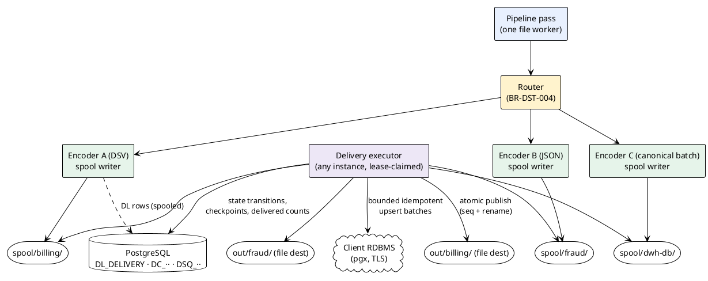

# 07 — Distribution & Delivery (`DST`)

> Part of the [[00-index|baasparse TS]]. Previous: [[06-pipeline-stages]] · Next: [[08-suspense-reconciliation-replay]]

This section designs the **distribute** module: the `distribute.Target` seam, output
encoders, the file and RDBMS destinations, fan-out and routing, store-and-forward,
per-destination sequencing, delivery confirmation, delivered-output lifecycle, and
re-send. Tables used (registry, [[02-conventions]] §2.2): `DS_DESTINATION`,
`DL_DELIVERY`, `DC_DELIVERY_CONTRIBUTION` ([[02-conventions]] §2.2), `DSQ_DESTINATION_SEQUENCE`,
`PF_PROCESSED_FILE`, `SU_SUSPENSE`. Column-level schema detail lives in
[[03-database-design]]; the operative columns are named here because the delivery
transactions depend on them.

## 7.1 The `distribute.Target` seam and fan-out

### 7.1.1 Design shape: spool once, deliver independently

The single load-bearing decision of this section: **a pipeline pass writes each
destination's output exactly once, to that destination's spool area on the shared FS —
and delivery to the destination is a separate, idempotent, retryable step tracked in
`DL_DELIVERY`.** This one shape simultaneously gives:

- **Fan-out from a single processing pass** (`BR-DST-008`) — N spool writers, one pass;
- **Store-and-forward for free** (`BR-DST-010`) — a down destination means the spooled
  output simply waits; nothing is re-processed, nothing is lost;
- **Any-instance retry** (`BR-HA-004`) — delivery is driven off claimable `DL_DELIVERY`
  rows, not off the memory of the instance that ran the pass;
- **A clean crash story** (§7.9) — the pass/deliver boundary is durable on disk + DB.



**Fast path note.** When a destination is healthy and its output directory is on the
same shared FS as its spool (the normal case), "delivery" of a file output is a single
`rename(2)` — the spool adds no copy and negligible latency. The spool is not a queue
the happy path pays for; it is where the output *already is* when the unhappy path
needs it.

### 7.1.2 The `Target` interface (`BR-NFR-031/032`)

A destination kind implements `distribute.Target` and registers under a kind string.
v1 ships `file` and `rdbms`. The `file` target's substrate is itself pluggable: it
writes through the cloud-track **`storage.Store`** seam ([[16-cloud-native-deployment]]
§16.2), so one file destination lands on **local/shared POSIX, SFTP/FTPS, or
S3-compatible object storage** per its configured backend + root (`BR-STO-002`) — object
storage is a v1 backend, not a future kind. Further Target kinds (message bus, …) plug in
behind the same seam without touching the pipeline — the proof of `BR-NFR-031` is that
the two v1 targets already share it.

```go
package distribute

// Target is the destination extension point (BR-NFR-031/032). One Target
// instance exists per DS_DESTINATION row, constructed from its published
// config; a hot reload (BR-CFG-007) builds the new instance and retires the
// old one after in-flight passes pinned to the prior version drain.
type Target interface {
	Kind() string // "file" | "rdbms" (v1)

	// ValidatePublish runs at config publish time (BR-CFG-003). For rdbms it
	// connects to the client-owned target and validates the field→column
	// mapping against the live table (BR-DST-014).
	ValidatePublish(ctx context.Context, cfg *Config) error

	// NewWriter opens the destination's spool writer for one pipeline pass:
	// it encodes canonical records into the destination's spool area,
	// rolling outputs per the batching policy (BR-DST-005) and registering
	// each closed output as a DL_DELIVERY row in state 'SPOOLED'.
	NewWriter(ctx context.Context, cfg *Config, pass PassContext) (SpoolWriter, error)

	// Deliver drives one spooled output (one DL_DELIVERY row) to the
	// destination. MUST be idempotent and resumable: invoked again after any
	// crash or retry it converges to the same terminal state with no loss
	// and no duplication (§7.9).
	Deliver(ctx context.Context, cfg *Config, d *Delivery) error

	// Confirm evaluates the optional delivery confirmation (BR-DST-016).
	// Targets without a confirmation convention confirm immediately on
	// written (the v1 default: delivered = atomically written).
	Confirm(ctx context.Context, cfg *Config, d *Delivery) (Confirmation, error)
}

type SpoolWriter interface {
	Write(ctx context.Context, batch []*canonical.Record) error
	Roll(ctx context.Context) (*Spooled, error)   // close current output, count-checked
	Close(ctx context.Context) ([]*Spooled, error) // final roll; all manifests
	Abort(ctx context.Context) error
}

// Registry mirrors decoder.Registry (BR-DEC-005): kinds register at init,
// config resolves kind→constructor, no core change to add one.
func Register(kind string, ctor func(deps Deps) Target)
```

Lifecycle: **construct on config load → validate on publish → per-pass writers →
long-lived `Deliver`/`Confirm` workers → retire on config supersession.** `Deliver` and
`Confirm` take the destination config *version pinned on the DL row* — a re-published
destination does not change the semantics of already-spooled output.

### 7.1.3 Fan-out executor

The distribute stage of the pipeline graph ([[06-pipeline-stages]]) holds, per pass,
one open `SpoolWriter` per destination the pipeline routes to. For each canonical
record batch:

1. The **router** (§7.1.4) computes the record's destination set.
2. The record is appended to each matching destination's writer — **one decode/
   transform pass, N encodings** (`BR-DST-008`). Per-destination transformation
   variants (field selection/layout per destination) are resolved by the transform
   stage emitting the canonical record once plus per-destination projection specs the
   encoder applies (`BR-TRN-002/006`), so the upstream pass is still single.
3. Writers roll per the destination's batching policy (§7.3.2); each roll produces a
   `DL_DELIVERY` row (`SPOOLED`) and `DC_DELIVERY_CONTRIBUTION` rows linking the output
   to the source file(s) whose records it contains (§7.2.2).

Backpressure: writers are synchronous and bounded — a slow shared FS blocks the stage,
which blocks the pass (`BR-NFR-002`); nothing queues unboundedly.

### 7.1.4 Routing rules (`BR-DST-004`)

Routing is declarative per pipeline, stored in the `PLV_PIPELINE_VERSION` stage graph
and referencing `DS_DESTINATION` entries. Predicates are evaluated in order; **all**
matching routes contribute (fan-out is additive), with a default route and an explicit
unrouted-record policy:

```json
{
  "routes": [
    { "when": { "recordType": "voice" },                    "to": ["billing-dsv", "fraud-json"] },
    { "when": { "field": "originCountry", "in": ["ZA"] },   "to": ["dwh-db"] },
    { "when": { "source": "roaming-tap3" },                 "to": ["ra-json"] }
  ],
  "default": ["billing-dsv"],
  "unrouted": "suspense"
}
```

- **Predicate forms:** `recordType` (the `BR-DEC-008` discriminator), `field`
  (equality / `in` set / numeric range / anchored regex on a canonical field), and
  `source`. Conjunction inside one `when`; multiple routes give disjunction.
- **Unrouted policy:** `suspense` (reason `DST_UNROUTABLE`, default — a record no route
  claims is an accounting hole, `BR-REC-001`) or `discard` (recorded as a screened
  discard, `BR-VAL-003` semantics).
- Routing config is validated at publish: every `to` must name a destination attached
  to the pipeline; regexes compile; field names resolve against the pipeline's
  canonical schema (`BR-CFG-003`).

## 7.2 Delivery state model: `DL_DELIVERY`, `DC_DELIVERY_CONTRIBUTION`, `DSQ_DESTINATION_SEQUENCE`

### 7.2.1 `DL_DELIVERY` — one row per output × destination

Operative columns (full DDL in [[03-database-design]]; naming per [[02-conventions]]):

| Column | Meaning |
|--------|---------|
| `DL_UID` | Surrogate key |
| `DL_DS_UID` | Destination (`DS_DESTINATION`) |
| `DL_PLV_UID` | Pipeline config version pinned for this output (`BR-CFG-007`) |
| `DL_STATUS` | `PENDING → SPOOLED → PUBLISHING → WRITTEN → WRITTEN_UNCONFIRMED → DELIVERED`, plus `DIVERTED`, `FAILED` (§7.2.3) |
| `DL_SPOOL_PATH` / `DL_OUTPUT_NAME` | Where the bytes are; the final templated name (§7.3.3) |
| `DL_SEQUENCE_NO` | Per-destination monotonic sequence; NULL until allocated at delivery-commit (§7.3.5) |
| `DL_RECORD_COUNT` / `DL_SIZE_BYTES` / `DL_CHECKSUM` | Finalised output totals (trailer-checked, §7.3.4) |
| `DL_KIND` | `ORIGINAL` \| `REPLAY` \| `REPLACEMENT` \| `DELTA` — replay/adjustment marker carried into output metadata (`BR-DST-012`, `BR-COR-012`) |
| `DL_CW_UID` | Set on window-output deliveries (aggregate / delta / replacement bodies) — such DLs carry **no** `DC` rows and are excluded from the file done-gate (§7.2.2); NULL for pass outputs |
| `DL_COMMITTED_THROUGH` | RDBMS batch checkpoint: last batch index committed at the target (§7.4.4) |
| `DL_DELIVERED_COUNT` | Records committed at the target so far (`BR-REC-009`) |
| `DL_ATTEMPTS` / `DL_NEXT_RETRY_ON` / `DL_LAST_ERROR` | Retry-with-backoff state (`BR-DST-010`) |
| `DL_INS_UID_LEASE` / `DL_LEASE_EXPIRES_ON` | Delivery-executor lease — any instance claims due rows via `FOR UPDATE SKIP LOCKED` (`BR-HA-003` pattern) |
| `DL_DELIVERED_ON` | Confirmation receipt time (`BR-DST-016`) |
| `DL_OUTPUT_DISPOSITION` | `PRESENT` \| `CONSUMED` \| `PRUNED` \| `ARCHIVED` (`BR-DST-021`) |
| `DL_RESEND_COUNT` | Operator re-sends performed (`BR-DST-009`) |

### 7.2.2 `DC_DELIVERY_CONTRIBUTION` — output ↔ source-file fan-in

Batching can legitimately put records of **more than one source file** into one output
(time-based roll-over on a slow stream, §7.3.2), and one source file fans out to many
outputs. `DC_DELIVERY_CONTRIBUTION` records the many-to-many with counts:
`DC_DL_UID`, `DC_PF_UID`, `DC_RECORD_COUNT`, `DC_FIRST_RECORD_INDEX`,
`DC_LAST_RECORD_INDEX` (record indexes are **1-based decode-order ordinals**,
[[02-conventions]] §2.5). It serves two masters:

- **Done-gating (`BR-COL-009`):** `PF_PROCESSED_FILE` may move to *done* only when
  every `DL_DELIVERY` reachable through its `DC` rows is terminal (`DELIVERED` or
  `DIVERTED`) — evaluated under a `PF`-row lock in the transaction that terminalises
  the last DL (§7.5.4).
- **Reconciliation (`BR-REC-002/009`):** per-file, per-destination *emitted vs
  committed* counts roll up through `DC` (see [[08-suspense-reconciliation-replay]]).

**Window outputs sit outside `DC`.** A window-output DL (`DL_CW_UID` set — aggregate,
delta, or replacement body) has **no** `DC` rows and is excluded from the file
done-gate: a contributing file reaches *done* on its record-level outcomes (members
contributed = `RS_AGGREGATED`), not on the aggregate's delivery. Window-scoped
delivery reconciliation instead rolls up via the window's retained `CW_CONTRIB_FILES`
references ([[08-suspense-reconciliation-replay]] §8.5.1).

### 7.2.3 DL state machine

```plantuml
@startuml dl-states
!theme plain
skinparam state { BackgroundColor #E8F0FE BorderColor #4472C4 }
[*] --> PENDING : writer opens output\n(temp file in spool)
PENDING --> SPOOLED : roll/close: trailer count\nverified, fsync, spool rename
PENDING --> FAILED : pass aborted\n(spool temp removed)
SPOOLED --> PUBLISHING : delivery-commit tx:\nsequence allocated (§7.3.5)
PUBLISHING --> WRITTEN : stamped + atomic rename\nat destination (file)\n/ all batches committed (rdbms)
SPOOLED --> DIVERTED : overflow policy (b)\n(§7.6.3)
WRITTEN --> DELIVERED : no callback configured\n(v1 default: WRITTEN = DELIVERED)
WRITTEN --> WRITTEN_UNCONFIRMED : callback configured\n(BR-DST-016)
WRITTEN_UNCONFIRMED --> DELIVERED : confirmation received
WRITTEN_UNCONFIRMED --> WRITTEN_UNCONFIRMED : missing confirmation\n→ alert, keep waiting
DIVERTED --> PUBLISHING : operator re-send\nfrom holding area
DELIVERED --> [*]
DIVERTED --> [*] : terminal for done-lifecycle\n(reconciled as NOT DELIVERED)
@enduml
```

Mapping to the BRS Delivery Record vocabulary ([[../brs/08-data-and-configuration|BRS §8.3]]):
BRS *pending* = `PENDING`/`SPOOLED`; *written* = `WRITTEN`; *written-unconfirmed* =
`WRITTEN_UNCONFIRMED`; *delivered* = `DELIVERED`; *resent* is recorded as
`DL_RESEND_COUNT` + audit events (the row returns through `PUBLISHING → WRITTEN →
DELIVERED` on each re-send); *diverted* = `DIVERTED`; *failed* = `FAILED` (permanent,
alerted; recovery is re-send or replay). **There is no silent-drop state** — every
overflow/failure path ends in a recorded, re-sendable state (`BR-DST-017`).

### 7.2.4 `DSQ_DESTINATION_SEQUENCE`

One row per destination: `DSQ_DS_UID` (unique), `DSQ_LAST_VALUE BIGINT`. Allocation is
a plain row `UPDATE … RETURNING` inside the delivery-commit transaction (§7.3.5) —
serialised per destination, which is deliberate and cheap at the v1 envelope
(`BR-NFR-005`, same argument as the file-UID allocator `SQ_SEQUENCE_ALLOCATOR`,
`BR-COL-005`).

## 7.3 Output encoders and the file target

### 7.3.1 Encoders: format definitions in reverse (`BR-DST-002`, `BR-TRN-006`)

Output encoding reuses `FD_FORMAT_DEFINITION` — the same declarative structure the
decoders are driven by ([[05-decoding-and-canonical-record]]) — walked in reverse: the
definition maps canonical fields to the wire shape instead of the wire shape to
canonical fields. One streaming interface:

```go
package encode

type Encoder interface {
	// Begin writes the configured header control record (BR-DST-020).
	// Fields not knowable until publish (the destination sequence) are
	// emitted as fixed-width placeholders and patched at publish (§7.3.5).
	Begin(w io.Writer, fc FileContext) error
	Encode(w io.Writer, rec *canonical.Record) error
	// End writes the trailer (record count, optional checksum, timestamps)
	// from the writer's own running counters.
	End(w io.Writer, fc FileContext) error
}
```

| Encoder | Priority | Notes |
|---------|:--------:|-------|
| JSON (NDJSON / array document) | Must | Mirror of `BR-DEC-002` structures |
| DSV | Must | Delimiter/quote/escape/header per definition (`BR-DEC-003` mirror) |
| Fixed-position | Must | Offset/length/pad/align per field (`BR-DEC-004` mirror) |
| XML | Must | Element/attribute mapping, record-per-element (`BR-DEC-011` mirror) |
| ASN.1 (BER/DER) | Should | Schema-driven encode over the same declarative ASN.1 module the decoder uses; definite-length DER for output |
| Canonical batch | internal | The RDBMS target's spool format (§7.4.1) — length-prefixed canonical records, not a consumer-facing format |

Encoders are streaming and allocation-disciplined like decoders (`BR-NFR-003`): pooled
buffers, one record in flight, no whole-file materialisation.

### 7.3.2 Batching & roll-over (`BR-DST-005`)

Per file destination, configurable roll triggers — the writer closes the current
output and opens the next when **any** configured trigger fires:

```json
"roll": { "maxRecords": 100000, "maxBytes": "512MiB", "maxAge": "15m" }
```

- `maxRecords` / `maxBytes` split one source file into several outputs; such outputs
  never span source files.
- **`maxAge` (cross-file batching) — the per-destination single-writer roll job.**
  Passes never share an open output file. Where `maxAge` is configured, each pass
  stages its records into **per-pass segment files** under the destination's spool
  (`spool/<dest>/segments/`), each segment registered (source `PF`, record count,
  order) as it is closed and fsynced at the pass's checkpoint. The destination's
  **roll job** — an `SJ_SCHEDULED_JOB` nominated to a single instance in v1, holding
  an explicit per-destination lease (heartbeat-renewed; lease expiry lets another
  instance's scheduler adopt the job) — is the **only writer** that assembles
  outputs: at `maxAge` expiry (or `maxRecords`/`maxBytes` across the accumulated
  segments) it concatenates the segments in registration order into one output,
  writes header/trailer, count-checks (§7.3.4), and rolls it as a normal `SPOOLED`
  `DL_DELIVERY` row with `DC` rows derived from the segment registry.
  **Crash story:** segments are immutable once their pass closes them; the roll
  job's concatenation is a temp-file build + fsync + rename within the spool, and the
  DL/DC insert commits after the spool rename — a crash mid-roll leaves the segments
  intact plus a discardable temp, and the retried roll (same or adopting instance)
  rebuilds the identical output deterministically. Segments are deleted only after
  the transaction that recorded the DL row consuming them has committed (orphans are
  swept per §7.5.6). The cost is honest: contributing files cannot reach *done* until
  the batched output rolls and delivers — exactly the `BR-COL-009` semantics, made
  visible by `DC` rows. Default is roll-at-end-of-file (no cross-file batching)
  unless `maxAge` is explicitly configured.
- Zero-record source files produce an empty output (header+trailer, count 0) where the
  source's policy says so (`BR-COL-016`), else no output.

### 7.3.3 Templated naming (`BR-DST-006`)

```json
"name": "billing_{source}_{yyyyMMdd}_{HHmmss}_{seq:8}.dsv"
```

Tokens: `{source}`, `{pipeline}`, `{destination}`, date/time patterns (production
time, UTC or configured zone), `{seq[:width]}` (the destination sequence, zero-padded),
`{fileUid}` (the business `PF_FILE_UID`, [[02-conventions]] §2.5; single-source
outputs only), `{ext}`. `{seq}` is resolved at publish time
(§7.3.5); templates using it keep the spool name distinct from the final name. Publish
verifies the rendered name is unique at the destination (collision → alert, not
overwrite).

### 7.3.4 Header/trailer control records and the count check (`BR-DST-020`)

Where configured, the encoder writes a header record (production timestamp, source,
sequence placeholder) and a trailer record (record count, optional checksum, sequence).
At `Roll`/`Close`, **before** anything becomes visible:

1. The writer compares its trailer count against the router's per-output routed count
   (independent counters — encoder bugs cannot self-certify).
2. Mismatch → the temp file is discarded, the pass fails the file attempt
   (`BR-COL-017` accounting), alert raised. **A truncated-but-complete-looking output
   cannot be produced.**
3. Match → `fsync`, rename `*.tmp → *` *within the spool* (the spool copy itself is
   atomic and durable), DL → `SPOOLED` with count/size/checksum recorded — the
   spool-time checksum, together with **every placeholder offset** the encoder emitted
   (header *and* trailer sequence fields); both are superseded/consumed by the
   post-patch checksum recompute at delivery-commit (§7.3.5).

### 7.3.5 Atomic publish, sequence allocation at delivery-commit (`BR-DST-003`, `BR-DST-011`)

Publishing a spooled output to its destination directory is a two-phase, idempotent
step driven by the delivery executor:

```sql
-- Phase 1: delivery-commit transaction (allocate sequence, record intent)
BEGIN;
  UPDATE DSQ_DESTINATION_SEQUENCE
     SET DSQ_LAST_VALUE = DSQ_LAST_VALUE + 1,
         DSQ_MODIFIED_BY = 'engine:'||$instance, DSQ_MODIFIED_ON = now()
   WHERE DSQ_DS_UID = $destination
  RETURNING DSQ_LAST_VALUE AS seq;

  UPDATE DL_DELIVERY
     SET DL_STATUS = 'PUBLISHING', DL_SEQUENCE_NO = $seq,
         DL_OUTPUT_NAME = $rendered_name,   -- template with {seq} resolved
         DL_CHECKSUM = $post_patch_checksum, -- recomputed for the patched bytes (below)
         DL_MODIFIED_BY = 'engine:'||$instance, DL_MODIFIED_ON = now()
   WHERE DL_UID = $dl AND DL_STATUS = 'SPOOLED';
  -- rowcount-checked: zero rows (raced by divert/re-send/another executor) →
  -- ROLLBACK of the WHOLE transaction, un-burning the DSQ increment
  -- ([[03-database-design]] §3.9.6 states the same rule normatively)
COMMIT;

-- Phase 2 (filesystem): patch the fixed-width sequence field at EVERY recorded
-- placeholder offset — header AND trailer (§7.3.4) — with pwrite, fsync, then
-- atomically rename/link the spool file to <outdir>/<DL_OUTPUT_NAME>. Same-FS:
-- rename(2). Cross-FS: copy to <outdir>/.tmp/, fsync, rename within outdir.

-- Phase 3: mark written
UPDATE DL_DELIVERY SET DL_STATUS = 'WRITTEN', ... WHERE DL_UID = $dl AND DL_STATUS = 'PUBLISHING';
```

Why this satisfies `BR-DST-011`'s *contiguous, allocated at delivery-commit* wording:

- The sequence is allocated **only once the output is final and count-verified**
  (`SPOOLED`), never for output that can still be rolled back — so it is not a
  rollback-prone raw sequence.
- The allocated number is **persisted on the DL row in the same transaction**; every
  retry of phases 2–3 reuses it. A crash anywhere after phase 1 can therefore never
  burn the number — the same DL row is driven to `WRITTEN` with the same sequence, and
  a downstream gap is a **real missing-file signal** (`BR-DST-011`), not allocator
  noise.
- **Rowcount-checked, no burned sequences on the other side either:** the guarded
  `DL_DELIVERY` update must report exactly one row; zero rows rolls the whole
  transaction back — including the `DSQ` increment — so a lost race can never consume
  a sequence number ([[03-database-design]] §3.9.6).
- **The persisted checksum is the post-patch checksum:** with `$seq` known, phase 1
  streams the spool file once, substituting the resolved sequence at every recorded
  placeholder offset (header **and** trailer), and persists the resulting checksum as
  `DL_CHECKSUM` in the same transaction. Idempotency probes (§7.9.3), the completion
  marker, and receipt verification (§7.6) therefore compare against the bytes a
  consumer actually sees.
- Idempotency of phase 2: if the final name already exists with the recorded checksum,
  the rename already happened (crash between rename and phase 3) — adopt it and run
  phase 3 (§7.9.3).
- Consumers never see partials (`BR-DST-003`): the only write into the destination
  directory is an atomic rename of a fully-written, fsynced file; an optional
  **done-marker** (`<name>.done`, containing sequence/count/checksum) is written after
  the rename for consumers that require one.

**Object-storage backend (`BR-STO-004`).** Where the file destination's configured
`storage.Store` backend is S3-compatible object storage ([[16-cloud-native-deployment]]
§16.2), phase 2 needs no temp-then-rename: it is a single `PutObject` (or multipart
complete) of the patched bytes straight to the final key — **atomic by nature**, so a
consumer never observes a partially-written object. This satisfies `BR-DST-003` *more
strongly* than a filesystem rename: there is no window in which a truncated object is
listable, and object storage is strongly read-after-write consistent. The idempotency
probe (§7.9.3) then compares the final key's existence + ETag/checksum rather than a
final name; the optional done-marker is a sibling **marker object** (`<key>.done`).
Sequence allocation, the rowcount-checked delivery-commit transaction, and the DL ledger
are all unchanged — only the byte-placement primitive differs per backend (`rename(2)`
on POSIX, put-then-rename on SFTP, `PutObject`/multipart on S3).

### 7.3.6 Ordering guarantees (`BR-DST-012`)

Exactly as scoped by the BRS, no more:

- **Within one input file:** preserved. A file is one pass on one instance; the spool
  writer appends in decode order; record/size rolls split at order boundaries.
- **Across files:** not guaranteed (any instance claims any file). Consumers order and
  gap-check by the per-destination sequence (`BR-DST-011`).
- **Replay/adjustment output** carries `DL_KIND` into output metadata — a
  header field and/or a per-record marker column/field per destination convention —
  so consumers distinguish corrections from originals (`BR-COR-012`,
  [[08-suspense-reconciliation-replay]] §8.4).

### 7.3.7 Delta and replacement output durability (`BR-COR-012`)

A late-arrival **delta** is emitted by the collation engine ([[06-pipeline-stages]]);
its durability contract mirrors the main window emit. Unlike pass outputs — whose DL
rows are created by the spool writers at roll (§7.3.4), never in the emit transaction
— a delta is a single self-contained output whose spool hand-off **is** part of the
delta emit: the delta's spool file is written and fsynced first, and the transaction
that allocates `CW_ADJUSTMENT_SEQ` also persists the delta body and inserts the
`SPOOLED` `DL_DELIVERY` row (`DL_KIND = 'DELTA'`, `DL_CW_UID` set). A crash before
commit leaves at most an orphan spool file for the reconciliation sweep (§7.5.6); a
crash after commit leaves a normal claimable spooled delivery. Retries re-emit the
same adjustment identity (`:a{n}`, §7.4.2) — nothing is double-counted.

A **replacement** output's metadata (header field / mapped metadata columns, §7.4.3)
lists the adjustment identities it **supersedes**. The RDBMS target applies the
supersession where the metadata columns are mapped; file consumers apply it per their
documented responsibility (`ASM-14`).

## 7.4 The RDBMS target (`BR-DST-007`)

### 7.4.1 Shape

The RDBMS target loads canonical records into a **client-owned** database
(`DEP-7`, `ASM-13`) — configured with a connection (secret-ref DSN, `BR-NFR-054`), a
target table, and a field→column mapping. Its spool format is the internal
**canonical batch** encoding (§7.3.1): the pass writes once to
`spool/<destination>/`, and the delivery executor replays it into the target in
bounded transactional batches. This is what makes RDBMS store-and-forward
(`BR-DST-010`) identical in shape to the file case: a down database delays the
`Deliver` step; the pass is never re-run.

- **Connection pool:** one small `pgxpool` per destination (default `max_conns = 4`,
  configurable), owned by the Target instance, separate from the engine's state-store
  pools. Non-PostgreSQL targets are a v2 seam behind the same `Target` interface
  (`database/sql` variant); v1 ships PostgreSQL (`BR-DST-007` names it as the example).
- **TLS default (`BR-DST-019`):** the DSN is forced to `sslmode=verify-full` unless
  the destination config carries the explicit `"tlsDisabled": {"reason": "..."}` block —
  which is RBAC-gated, audited on publish, and surfaced in the destination's config
  view. Same rule as the engine's own state store (`BR-NFR-050`).

### 7.4.2 Deterministic output identity — the normative grammar (`BR-DST-018`)

> **Normative.** This subsection is the single definition of output identity for the
> whole TS. [[06-pipeline-stages]] (emit/delta identities) and
> [[08-suspense-reconciliation-replay]] (replay/adjustment identities) cross-reference
> it; no other section restates the grammar.

Every output record carries an identity **stable across re-delivery, crash recovery,
re-send, and replay** and **unique per logical output record**. The grammar, per output
kind:

| Output kind | Identity | Encoding (identity column value) |
|-------------|----------|----------------------------------|
| Pass-through record (default) | **Lineage-derived:** business file UID + in-file record ordinal | `f{PF_FILE_UID}:r{recordSeq}` — `PF_FILE_UID` is the **business** file UID (never the surrogate `PF_UID`; [[02-conventions]] §2.5) and `recordSeq` is the **1-based decode-order ordinal** (`RecordSeq`, [[05-decoding-and-canonical-record]]) — reproducible because replay re-decodes the identical retained file in the identical order (`BR-ERR-008/009`; guard below) |
| Pass-through record (configured business key) | Ordered list of canonical fields declared per feed | `k:` + canonical-encoded field values, unit-normalised (`BR-TRN-010`). Config must declare the key unique-per-record; publish warns it cannot be proven, and a runtime identity collision (two distinct records claiming one key) routes to suspense |
| Aggregate (`BR-COR-004`) | **Pipeline + key generation + group key + window start** | `agg:{PL_UID}:{keyGen}:{sha256hex(canonicalKey)}:{epochSecondsWindowStart}` — `keyGen` is the window's **stamped key generation** (`CW_KEY_GEN`), `canonicalKey` the canonical group-key encoding, and the final term the event-time window start in UTC epoch seconds. Deliberately **not** `CW_UID` (a replay opens a new working-set row; the identity must survive rebuild) |
| Adjustment delta (`BR-COR-012(a)`) | **Aggregate identity + adjustment sequence** | `<aggregate identity>:a{n}` — kind `DELTA`, carrying an explicit adjusts-reference to the aggregate identity it adjusts; `n` is the monotonic per-window adjustment counter (`CW_ADJUSTMENT_SEQ`) allocated in the delta-emit transaction, so retries re-emit the same `n` (§7.3.7) |
| Verified replacement (`BR-COR-012(b)`) | The **original** aggregate identity | Same key ⇒ upsert **supersedes** the prior row; permitted only after full-coverage verification ([[08-suspense-reconciliation-replay]] §8.4.3); its output metadata lists the adjustment identities it supersedes (§7.3.7) |

**Why `keyGen` is reproducible.** The key generation is stamped on the window at open
(`CW_KEY_GEN`) and recorded in the emitted output's lineage. A replacement re-emits
under the **stamped** generation recorded in lineage — not whatever generation the
current config would assign — so the aggregate identity is bit-for-bit reproducible
even after a flush-at-publish bumped the live generation ([[06-pipeline-stages]]).

**Replay identity guard.** Before a replay emits under original identities, the replay
executor compares the re-decoded record count (and, where retained, the decode-order
digest) against the original `RS_IN_COUNT` for that `PF_FILE_UID`. Divergence — e.g. a
backdated format-definition change that altered record delimitation, shifting every
`recordSeq` — means the lineage identities no longer correspond; the replay is
**downgraded to an operator-confirmed replacement** rather than silently re-emitting
shifted identities ([[08-suspense-reconciliation-replay]] §8.4.2).

The identity is written to a configured identity column (default a single text column,
e.g. `bp_identity`, with a unique constraint/index the mapping validation requires —
§7.4.5), or to the business-key columns themselves where a business key is configured.
The **identity scheme per feed is chosen at configuration time and validated at
publish** (Open Q13 discharge): a feed with no natural key uses the lineage key.

### 7.4.3 Idempotent upsert

```sql
-- one bounded batch, one target transaction (BR-DST-013/015)
INSERT INTO client_schema.usage_load
       (bp_identity, bp_kind, bp_adjusts, a_number, b_number, duration_min, ...)
VALUES ($1, $2, $3, $4, ...), ...             -- batch of N rows
ON CONFLICT (bp_identity) DO UPDATE            -- all kinds: re-delivery CONVERGES to
   SET a_number = EXCLUDED.a_number, ...,      -- the latest delivery's values
       bp_kind  = EXCLUDED.bp_kind;
-- replacement aggregates (DL_KIND = 'REPLACEMENT') ride the same shape:
-- the conflict update IS the supersession (bp_kind = 'replacement')
```

**Ruling — the conflict action is `DO UPDATE`, never `DO NOTHING` (binding).**
Re-delivery of a deterministic identity overwrites the row with the delivered values,
so any re-run — crash retry, re-send, zombie writer — converges to the **latest
delivery's values** instead of freezing whatever was written first. *Documented
caveat:* where a pipeline uses **unpinned reference data** (event-time re-resolution
under the latest published config, `BR-ENR-004`'s audited split), a re-delivery after a
reference-data correction may legitimately carry different values than the first write;
`DO UPDATE` makes the corrected values win, and the audited config change explains the
difference. [[11-ha-clustering-recovery]] cites this ruling for zombie-writer
convergence.

`bp_kind` / `bp_adjusts` are optional mapped metadata columns carrying the adjustment
marker and adjusted-identity reference (`BR-DST-012`, `BR-COR-012`); deployments that
cannot add columns may map identity to business-key columns and forgo the metadata
(recorded per destination, Open Q22).

### 7.4.4 Bounded batches, delivered-on-commit (`BR-DST-013/015`, `BR-REC-009`)

`Deliver` streams the spooled canonical batches and, per batch:

1. `BEGIN` on the target → upsert batch `i` → `COMMIT` (all-or-nothing per batch).
2. In the **engine** DB: `UPDATE DL_DELIVERY SET DL_COMMITTED_THROUGH = i,
   DL_DELIVERED_COUNT = DL_DELIVERED_COUNT + $n WHERE DL_UID = $dl AND
   DL_COMMITTED_THROUGH = i - 1` — the delivered-count ledger advances **only with the
   checkpoint**, in file-order batch sequence.

Consequences:

- A record counts as **delivered only on target commit**; a target rollback leaves
  `DL_COMMITTED_THROUGH` unmoved and its records **in-flight** (spooled, retried) —
  `BR-REC-009` exactly.
- Counts can never double: on crash between target-commit and checkpoint, the batch is
  re-applied (rows absorbed by `ON CONFLICT`) and *then* checkpointed — the ledger
  moves once per batch regardless of how many times the batch ran (§7.9.2).
- **Knobs (`BR-DST-015`):** `batchRows` (default 1000), `commitInterval` (max time a
  target tx stays open), `rateLimit` (rows/sec token bucket per destination, protecting
  the client DB, `BR-OPS-006`), pool size. All bounded; batch memory counts against
  the pass's budget (`BR-NFR-002`).

### 7.4.5 Mapping validation & runtime schema mismatch (`BR-DST-014`)

- **Publish time:** `ValidatePublish` connects to the target, introspects
  `information_schema.columns` / constraints for the target table, and verifies: every
  mapped column exists; canonical-type → column-type assignability; the identity
  column(s) carry a unique constraint or unique index; `NOT NULL` columns are all
  mapped or defaulted. Failures reject the publish with field-level errors
  (`BR-CFG-003`). The engine never creates or migrates the target schema
  ([[02-conventions]] §2.4).
- **Runtime:** classified by SQLSTATE. *Structural* errors (`42P01` undefined table,
  `42703` undefined column, `42804` datatype mismatch) fail the **batch**, route the
  batch's records to suspense with reason `DST_SCHEMA_MISMATCH`, raise an alert, and
  pause the destination's delivery (retry on a slow probe — the schema may be fixed
  in place). *Row-level* data errors (`23502`, `23514`, `22xxx`) are isolated by
  binary-split retry of the batch: offending records go to suspense with
  `DST_CONSTRAINT_VIOLATION` (+ masked context), the rest commit. **Never a crash,
  never a silent drop** — suspense entries reference the spool file + record index, so
  reprocessing re-reads them ([[08-suspense-reconciliation-replay]] §8.2). In both
  cases the transaction that inserts the `SU` rows also performs the conservation
  movement `routed → suspended` (`RS_ROUTED −= n`, `RS_SUSPENDED += n`) **and**
  reduces the affected `DL`/`DC` emitted counts by `n` — delivery ledger and
  conservation ledger step together ([[08-suspense-reconciliation-replay]] §8.5.2).

## 7.5 Store-and-forward (`BR-DST-010`)

### 7.5.1 The on-disk spool

Layout on the shared FS (all paths per-destination configurable):

```
<shared>/spool/<destination>/         # outputs awaiting delivery (written once, §7.1.1)
<shared>/spool/<destination>/.tmp/    # in-flight writer temps (pending)
<shared>/divert/<destination>/        # divert holding area (§7.5.3)
```

The spool **is** the store-and-forward buffer: output is written exactly once, at pass
time, into the spool; `DL_DELIVERY` rows are the delivery ledger over it. No second
copy of output bytes exists anywhere (and never in PostgreSQL, `BR-NFR-009`).

**Spool backend (`BR-STO-002`, `BR-STO-007`).** The spool is a location on the
destination's configured `storage.Store` backend, not necessarily an on-disk directory.
On POSIX it is the tree above; on **object storage** it is a bounded
**`spool/<destination>/` object prefix** with the identical write-once /
deliver-separately shape — the pass `Put`s the output to a spool key, and publish
(§7.3.5) promotes it to the final key by server-side copy (object storage has no atomic
rename, so `Move` = copy + delete; the authoritative delivery state stays in
`DL_DELIVERY`). The §7.5.3 bound is then expressed in **object count / bytes per prefix**
and sampled as an **object-store-pressure** metric — the object-store analogue of the
disk-pressure monitor (`BR-OPS-015`) — so the working area (spool / holding / in-progress
prefixes) stays bounded and monitored on every backend (`BR-STO-007`).

### 7.5.2 Retry by any instance

Each instance runs a bounded **delivery executor** pool that claims due DL rows:

```sql
SELECT DL_UID FROM DL_DELIVERY
 WHERE DL_STATUS IN ('SPOOLED','PUBLISHING','WRITTEN_UNCONFIRMED')
   AND DL_NEXT_RETRY_ON <= now()
   AND (DL_LEASE_EXPIRES_ON IS NULL OR DL_LEASE_EXPIRES_ON < now())
   -- plus the §7.5.5 delivery-hold exclusion: SPOOLED rows whose contributing PF
   -- (via DC) awaits a file-level verdict on a hold-configured source are skipped
 ORDER BY DL_NEXT_RETRY_ON
 FOR UPDATE SKIP LOCKED LIMIT $n;
```

— then leases them (heartbeat-renewed, same discipline as `FC_FILE_CLAIM`,
`BR-HA-003/004`) and calls `Target.Deliver`/`Confirm`. Backoff: exponential with
jitter, `1s → cap 5m` (configurable per destination); after a configurable
`alertAfter` duration in retry, a destination-down alarm is raised and escalates
(`BR-OPS-008/011`). The instance that ran the pass attempts delivery immediately
(fast path); if it dies, **any** surviving instance's executor finishes the job.

### 7.5.3 Bounded spool, escalating alerts, overflow policies (`BR-DST-017`)

Per destination (and one global bound over the spool root):

```json
"spool": { "maxBytes": "50GiB", "maxFiles": 20000, "maxAge": "72h",
           "alertAt": [0.70, 0.85, 0.95],
           "overflow": "pause-intake" }        // default; or "divert"
```

- Spool usage (bytes/files/oldest-age) is sampled by the disk-pressure monitor and
  exported per destination (`BR-OPS-015`); crossing 70/85/95% raises
  warning/major/critical alarms respectively (escalating severity, `BR-DST-017`).
- **`pause-intake` (default — integrity over liveness):** on reaching the bound, the
  engine stops **claiming** new files for every source that routes to the affected
  destination (and remote fetch for those sources pauses with it, `BR-RMT-013`); the
  input backlog grows visibly (`BR-OPS-013`); open collation grace-timers freeze for
  the stalled sources (`BR-COR-007`). Nothing is lost — resume is automatic when the
  spool drains below a hysteresis threshold.
- **`divert`:** the oldest spooled outputs for the blocked destination are moved
  (rename) into the **divert holding area** (walk-through: §7.9.5), their DL rows →
  `DIVERTED`, and a suspense entry per output references the held file
  (`SU_SUSPENSE`, reason `DST_DIVERTED`, scope `OUTPUT`) — visible, queryable,
  re-sendable. `DIVERTED` is
  **terminal for the done-lifecycle**: the source file may reach *done*, its
  completion marker listing the diverted endpoints (`BR-COL-009`), and the records
  reconcile as *diverted, not delivered* until re-sent (`BR-REC-002`,
  [[08-suspense-reconciliation-replay]] §8.5). The holding area has its own
  size/age bound and monitoring; **if it fills, the engine falls back to
  `pause-intake`** — silent discard does not exist in the state machine.

### 7.5.4 Interaction with in-progress → done (`BR-COL-009`)

The `FC_FILE_CLAIM` is **released at spool-complete** — the pass's final checkpoint
(all outputs `SPOOLED`, all `DC` rows written) releases the claim; store-and-forward
does **not** hold it, and the file worker plays no further part. Done-gating is
thereafter serialised on the **PF row**, not the FC fence ([[02-conventions]] §2.2,
decision-note 3 as re-scoped):

1. The delivery executor that terminalises a DL row (`DELIVERED` or `DIVERTED`) —
   guarded by its own **DL lease** — takes, in the same transaction,
   `SELECT … FOR UPDATE` on each `PF_PROCESSED_FILE` row reachable via that DL's `DC`
   rows, with the **PF-status precondition** (not yet done).
2. Holding the PF lock, it evaluates whether **all** of that file's DL rows are now
   terminal — window-output DLs (`DL_CW_UID` set) carry no `DC` rows and are
   **excluded** from this gate (§7.2.2) — whether every confirmation-gated destination
   has confirmed (§7.6), and whether any per-file delivery hold is still pending
   (§7.5.5).
3. If all gates pass, the same transaction performs the done-move: write the on-disk
   completion marker (business file UID `PF_FILE_UID`, checksum, counts,
   per-destination outcomes incl. diverted endpoints), rename to the done directory,
   commit `PF → DONE`, and write the `FILE_COMPLETED` audit event — the terminal
   transition and its audit event commit atomically
   ([[04-acquisition-collection-archiving]]).

The PF row lock is what makes two executors terminalising a file's last two DL rows
concurrently safe: they serialise on the lock, the second re-evaluates against the
first's committed state, and the PF-status precondition makes the done-move
exactly-once.

**Done-gate sweep (backstop).** A periodic `SJ_SCHEDULED_JOB` re-evaluates files whose
DL rows are all terminal but whose `PF` has not reached done (e.g. the terminalising
executor died between its DL commit and the done transaction) and performs the
identical PF-row-serialised done-move. So the file lifecycle of BRS §5.5 holds
exactly: *done means fully delivered (or terminally diverted) at every fan-out
endpoint*, no matter which instance — or the sweep — finishes the job.

### 7.5.5 Per-file delivery hold — file-verdict gating (`BR-COL-014` × content-duplicate detection)

For sources configured with a collection integrity/signature check (`BR-COL-014`) or
with `duplicate: name+checksum` end-of-decode content-duplicate detection, a file's
outputs must not reach any consumer before the **file-level verdict** exists —
otherwise a file later ruled bad would already be partially delivered. The hold is
per-file, keyed off `PF`/`DC`:

- Spooled DL rows whose contributing `PF` (via `DC`) belongs to a hold-configured
  source stay `SPOOLED` and are **not claimable for publishing**: the executor's claim
  query (§7.5.2) excludes them while the file-level verdict is pending.
- The transaction that commits a **positive** file-level verdict (integrity pass /
  content-duplicate clearance) releases the hold; the held DL rows become claimable
  and deliver normally.
- A **negative** verdict routes the file per the source's failure policy (file-scope
  suspense / quarantine, [[04-acquisition-collection-archiving]] §4.4.9); its spooled
  outputs are never published and are removed by the spool reconciliation sweep
  (§7.5.6). 04's "nothing from a failed file is delivered" holds **because of this
  gate** — and only for sources that configure such a check; all other sources carry
  no hold and no added latency.

### 7.5.6 Spool reconciliation sweep

A periodic maintenance job (`SJ_SCHEDULED_JOB`) reconciles the spool directories
against the DL ledger:

- A **final-named spool file with no live DL row** (`SPOOLED` or later, non-terminal)
  is removed — an orphan of a rolled-back registration, an abandoned pass, or a failed
  file's held outputs (§7.5.5); if the output is ever needed again, re-encode from the
  file checkpoint reproduces it.
- Orphaned `.tmp/` writer temps and roll-job build temps (§7.3.2) are discarded, as in
  §7.9.4.
- An **RDBMS canonical-batch spool file is deleted when its DL row reaches
  `DELIVERED`** — the target holds the committed rows and the ledger the counts; a
  later re-send against an RDBMS destination falls back to full-file replay (§7.7).
- Conversely, a `SPOOLED`-or-later non-terminal DL row whose spool file is **missing**
  raises an integrity alarm (never silent); recovery is re-encode via replay of the
  contributing file(s).

## 7.6 Delivery confirmation callback (`BR-DST-016`)

Optional per file destination; without it, `WRITTEN` = `DELIVERED` (the v1 default,
`ASM-6`). Two conventions:

- **Receipt file:** the consumer writes `<output>.receipt` (or a configured
  pattern/directory). The `Confirm` step — polled by the delivery executor on the
  destination's confirm interval — treats its appearance as confirmation; if the
  receipt carries a checksum/count, they are verified against the DL row (mismatch →
  alarm + `FAILED`, not delivered).
- **HTTP callback:** the engine polls a downstream-provided endpoint
  (`GET <url>?name=…&checksum=…` → `200` confirmed / `404` not yet), TLS with
  configured trust, credentials via secrets (`BR-NFR-054`). (Push-style inbound
  confirmation arrives through the management API as an authenticated
  `POST /api/v1/deliveries/{name}/confirm` — same effect; the route is registered in
  the canonical route map, [[10-management-plane]] §10.4.2.)

State: `WRITTEN → WRITTEN_UNCONFIRMED → DELIVERED` (`DL_DELIVERED_ON` set). A
confirmation missing past `confirmDeadline` raises an alarm (`BR-OPS-008`) and keeps
escalating (`BR-OPS-011`); the source file **cannot reach done** while a
confirmation-gated DL is unconfirmed (§7.5.4). Confirmation outcomes feed
reconciliation (`BR-REC-002`).

## 7.7 Delivered-output lifecycle (`BR-DST-021`)

Per destination disposition for **delivered** output:

| Disposition | Behaviour | DL trace |
|-------------|-----------|----------|
| `consumer-deletes` (default, `ASM-6`) | Consumer removes the file on pickup; the engine's output-scanner notices absence and records consumption | `DL_OUTPUT_DISPOSITION = 'CONSUMED'` |
| `engine-prunes` | The pruner job (a `SJ_SCHEDULED_JOB`) deletes delivered outputs past `retention` (age and/or size watermark) | `'PRUNED'` |
| `archive` | Delivered outputs are handed to the archiver (compress/offload/verify-then-prune, `BR-ARC-*`) | `'archived'` + `AR_ARCHIVE_RUN` ref |

Rules:

- The pruner touches only DLs in `DELIVERED` (never `WRITTEN_UNCONFIRMED`,
  `DIVERTED`, or `FAILED`), and never inside the destination's configured **re-send
  horizon** — publish warns when `retention < resendHorizon`.
- Output-directory usage (per destination, plus the divert holding area) is a
  monitored, alertable disk-pressure metric (`BR-OPS-015`) — the output side of the
  shared disk has an owner.
- **Re-send after prune:** a re-send request against a `PRUNED`/`CONSUMED`/`ARCHIVED`
  output falls back to **full-file replay** of the contributing source file(s)
  targeted at that destination only ([[08-suspense-reconciliation-replay]] §8.4),
  regenerating the output from the retained source. The DL row's disposition makes
  the fallback decision explicit and audited.

## 7.8 Re-send (`BR-DST-009`)

An operator/API action (RBAC permission `delivery.resend`, audited) that re-transmits
a **previously produced output without re-running the pipeline**:

1. Operator selects DL row(s) (by destination, name, sequence, time). The request is
   recorded as an `RQ_REPROCESS_REQUEST` of kind `RESEND`
   ([[08-suspense-reconciliation-replay]] §8.2.4 — one request/audit surface for all
   operator reprocessing actions).
2. Source bytes are taken from the destination directory (still `PRESENT`), the spool,
   or the divert holding area (`DIVERTED` rows — this is the `BR-DST-017` recovery
   path). If none holds the bytes → fallback to full-file replay (§7.7).
3. The DL row re-enters `PUBLISHING → WRITTEN → (WRITTEN_UNCONFIRMED) → DELIVERED`
   with `DL_RESEND_COUNT + 1`. It **keeps its original sequence number** — a re-send
   is the same logical output, and re-issuing a new sequence would manufacture a fake
   gap. The re-sent file's name/content are byte-identical to the original (checksum
   verified); duplicate-ingestion protection at file consumers is a downstream
   responsibility (`ASM-14`, `R29`), while an RDBMS destination absorbs the re-send
   via the idempotent upsert (§7.4.3).
4. Audit events record who/what/when/why on the request and each DL transition.

## 7.9 Failure walk-throughs

### 7.9.1 Destination down

*File destination:* output is already durable in the spool (`SPOOLED`). Publish fails
(rename/copy error) → `DL_ATTEMPTS++`, backoff, retry by any instance; alert after
`alertAfter`, spool-bound escalation and overflow policy per §7.5.3. Source file stays
in-progress (or reaches done via `divert`). When the mount returns, delivery resumes
where the ledger says — **no pass re-run, no loss**.

*RDBMS destination:* identical shape — `Deliver` cannot connect/commit; the canonical
batches sit in the spool; `DL_COMMITTED_THROUGH` marks exactly how far the target got;
retries resume from batch `i+1`. Idempotent upsert makes an ambiguous
"commit-then-connection-dropped" batch safe to re-run (`BR-DST-010/013`).

### 7.9.2 Crash mid-batch (RDBMS)

The target transaction for batch `i` either committed or vanished with the session.

- **Not committed:** re-run of batch `i` inserts normally. Ledger unmoved → counts
  right.
- **Committed, engine died before the checkpoint:** re-run of batch `i` converges via
  `ON CONFLICT … DO UPDATE` on every row (identities are deterministic, §7.4.2; the
  update rewrites the same values) — no new rows — then the checkpoint commits once.
  Rows exactly once, delivered-count exactly once (`BR-NFR-011/012`, `BR-REC-009`).

### 7.9.3 Crash between destination write and DL update (file)

Phase 2 completed (final name exists at the destination) but phase 3 never ran; the DL
row says `PUBLISHING` with its sequence already assigned. The retrying executor's
`Deliver` is idempotent by inspection: final name present **and checksum matches the
DL row** → adopt (run phase 3 only); present with a different checksum → alarm
(operator conflict, never overwrite); absent → redo phase 2 from the spool with the
**same** stamped sequence. The consumer can never observe a duplicate (one final name,
one atomic rename) and the sequence stream stays gap-free — this is why the sequence
is persisted on the DL row *before* the filesystem is touched (§7.3.5).

### 7.9.4 Crash mid-pass (before spool roll)

Writer temps live under `spool/<dest>/.tmp/` and their DL rows are `PENDING`. File
takeover (`BR-HA-004`) restarts the pass from the file checkpoint; startup/lease
recovery discards orphaned temps and marks their `PENDING` DLs `FAILED`
(pass-superseded). Re-encoded output gets fresh spool files; no partial output was
ever visible, and sequences were never allocated for the discarded temps
(allocation happens only at `spooled → publishing`), so no gaps.

### 7.9.5 Divert under overflow (`BR-DST-017(b)`)

Divert is DB-first, filesystem-second — the mirror of publish:

1. **Status flip (transaction):** the overflow handler, holding the DL lease,
   executes `UPDATE DL_DELIVERY SET DL_STATUS = 'DIVERTED', DL_SPOOL_PATH =
   $holding_path, … WHERE DL_UID = $dl AND DL_STATUS = 'SPOOLED'` — lease-guarded and
   rowcount-checked, with the target **holding path recorded before any file moves**.
   The same transaction inserts the `SU_SUSPENSE` entry (`DST_DIVERTED`, scope
   `OUTPUT`) and writes the `OUTPUT_DIVERTED` audit event — terminal transition and
   audit commit atomically.
2. **Rename:** the spool file is renamed into the divert holding area at the recorded
   path.
3. **Recovery adopts by path probe:** a crash between steps 1 and 2 leaves a
   `DIVERTED` row whose bytes still sit at the spool path; any instance's
   recovery/sweep probes both recorded paths and completes the rename. Re-send (§7.8)
   reads from the recorded holding path either way — the DB row, not the directory,
   is the source of truth.

## Registry additions

This section's addition was merged into the [[02-conventions]] §2.2 registry, which is
**final**: `DC_DELIVERY_CONTRIBUTION` is registered there — output ↔ source-file
fan-in: per-file record counts within each delivery (`BR-DST-005` × `BR-COL-009`;
delivered-count rollups `BR-REC-002/009`). Full DDL in [[03-database-design]] §3.5.23.

## BRS coverage

| Requirement | Where addressed |
|-------------|-----------------|
| BR-DST-001 (file destinations) | §7.1, §7.3 |
| BR-DST-002 (configurable output format) | §7.3.1 |
| BR-DST-003 (atomic output, done-marker) | §7.3.5 |
| BR-DST-004 (routing rules) | §7.1.4 |
| BR-DST-005 (batching / roll-over) | §7.3.2, §7.2.2 |
| BR-DST-006 (templated naming) | §7.3.3 |
| BR-DST-007 (RDBMS destination, v1) | §7.4.1 |
| BR-DST-008 (fan-out, one pass, per-destination format) | §7.1.1, §7.1.3 |
| BR-DST-009 (delivery guarantee, delivery record, re-send) | §7.2, §7.8 |
| BR-DST-010 (store-and-forward, no loss) | §7.5.1–§7.5.2, §7.9.1 |
| BR-DST-011 (per-destination monotonic sequence at delivery-commit) | §7.2.4, §7.3.5 |
| BR-DST-012 (ordering scope; replay/adjustment markers) | §7.3.6 |
| BR-DST-013 (transactional, idempotent RDBMS load) | §7.4.3–§7.4.4, §7.9.2 |
| BR-DST-014 (client-owned schema; publish validation; mismatch → suspense) | §7.4.5 |
| BR-DST-015 (batch size / commit interval / rate limits / pooling) | §7.4.4 |
| BR-DST-016 (delivery-confirmation callback) | §7.6 |
| BR-DST-017 (bounded spool, escalating alerts, pause-intake / divert) | §7.5.3–§7.5.4, §7.9.5 |
| BR-DST-018 (deterministic output identity) | §7.4.2 |
| BR-DST-019 (TLS default to load target) | §7.4.1 |
| BR-DST-020 (header/trailer control records, count check before rename) | §7.3.4 |
| BR-DST-021 (delivered-output lifecycle, retention vs re-send horizon) | §7.7 |
| BR-STO-002 (file-destination backend: local POSIX / SFTP / S3, per destination) | §7.1.2, §7.5.1 |
| BR-STO-004 (atomic output on every backend; native `PutObject`/multipart on S3) | §7.3.5 |
| BR-STO-007 (bounded, monitored object-store spool prefix) | §7.5.1, §7.5.3 |

Related requirements satisfied here and cross-referenced: `BR-NFR-031/032` (§7.1.2),
`BR-TRN-006` (§7.3.1), `BR-COL-009` (§7.5.4 incl. done-gate serialisation + sweep),
`BR-COL-014` per-file delivery hold (§7.5.5), `BR-COR-012` (§7.3.7, §7.4.2),
`BR-REC-009` (§7.4.4), `BR-RMT-013` (§7.5.3), `BR-ERR-007` transient-retry
(§7.5.2; taxonomy in [[08-suspense-reconciliation-replay]] §8.2.5).
