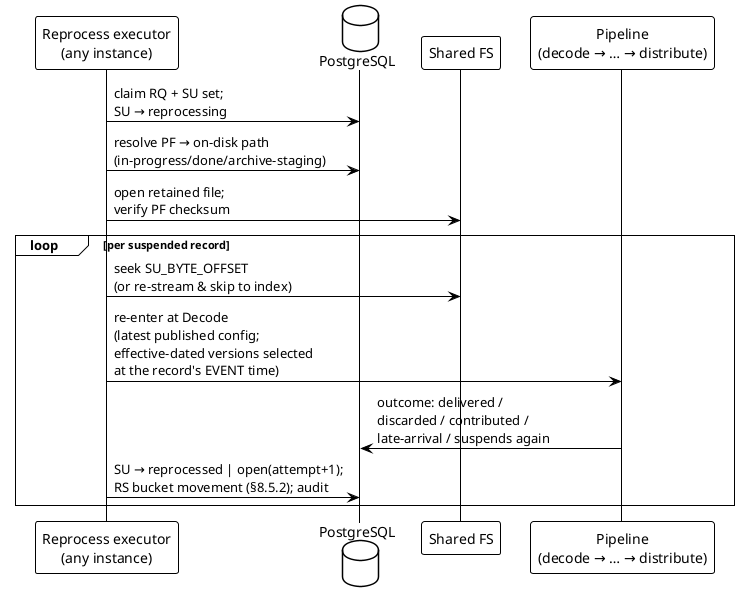
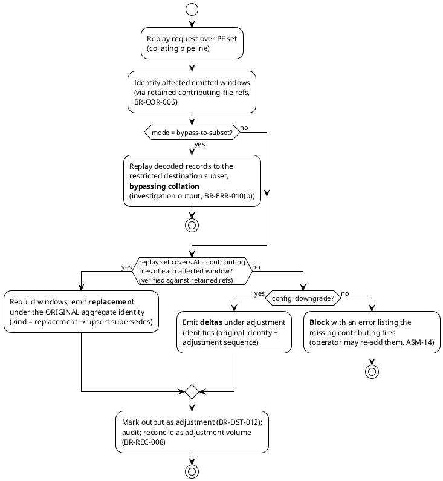

# 08 — Suspense, Reconciliation & Replay (`ERR`, `REC`)

> Part of the [[00-index|baasparse TS]]. Previous: [[07-distribution-delivery]] · Next: [[09-configuration-management]]

This section designs the error/suspense/reprocessing machinery and the
input-conservation reconciliation ledger. Tables used (registry,
[[02-conventions]] §2.2): `SU_SUSPENSE`, `SE_SUSPENSE_ESCROW`,
`RS_RECONCILIATION_SUMMARY`, `PF_PROCESSED_FILE`, `AE_AUDIT_EVENT`, plus
`RQ_REPROCESS_REQUEST` ([[02-conventions]] §2.2). Full DDL in [[03-database-design]].

## 8.1 The suspense model (`BR-ERR-001`)

### 8.1.1 Reference, not content

A suspense entry is a **pointer plus diagnosis** — never record bytes
(`BR-NFR-009`; the bounded escrow of §8.3.3 is the single, explicit exception).
Operative columns of `SU_SUSPENSE`:

| Column | Meaning |
|--------|---------|
| `SU_UID` | Surrogate key |
| `SU_PF_UID` | Source-file anchor (`PF_PROCESSED_FILE`) — nullable; **exactly one** of `SU_PF_UID`/`SU_CW_UID` is set (CHECK, [[03-database-design]]) |
| `SU_CW_UID` | Window anchor (`CW_COLLATION_WINDOW`) for **aggregate-output suspense**: a distribute-half failure on an *emitted* aggregate suspends against the window, whose `CW_EMITTED_BODY` is retained while an open entry references it — reprocess re-emits from that retained body after correction ([[06-pipeline-stages]]) |
| `SU_SCOPE` | `RECORD` \| `FILE` \| `OUTPUT` (whole-file rejects e.g. TAP3 *fatal* / integrity failures `BR-COL-014`/`BR-VAL-007`; `OUTPUT` = diverted outputs, `BR-DST-017(b)`) |
| `SU_RECORD_INDEX` / `SU_BYTE_OFFSET` / `SU_BYTE_LENGTH` | Record locator: the **1-based decode-order ordinal** (`RecordSeq`, [[02-conventions]] §2.5) always; byte offset/length additionally where the decoder can delimit the record (fixed/DSV/NDJSON/BER TLV) — enabling direct seek on reprocess |
| `SU_STAGE` | `COLLECT` \| `DECODE` \| `VALIDATE` \| `DEDUP` \| `COLLATE` \| `ENRICH` \| `TRANSFORM` \| `DISTRIBUTE` |
| `SU_REASON_CODE` | Stable machine code ([[02-conventions]] §2.3), e.g. `DEC_DECODE_FAILURE`, `VAL_MANDATORY_MISSING`, `ENR_LOOKUP_MISS`, `DST_SCHEMA_MISMATCH`, `COR_INCOMPLETE_TIMEOUT`, `DST_DIVERTED` |
| `SU_REASON_CLASS` | `PERMANENT` \| `TRANSIENT` (drives retry policy, §8.2.5) |
| `SU_REASON_DETAIL` | `JSONB`: rule id, offending field names, **masked** value excerpts (`BR-CMP-001`), destination/batch refs, decoder diagnostics — enough to diagnose without the file |
| `SU_PLV_UID` | Pipeline config version the record failed under (explains outcomes across publishes) |
| `SU_STATUS` | `OPEN` \| `REPROCESSING` \| `REPROCESSED` \| `ABANDONED` (§8.1.3) |
| `SU_ATTEMPTS` / `SU_RQ_UID_LAST` | Reprocess attempts; last request that touched it |
| `SU_SE_UID` | Optional escrow row (§8.3.3) |

Indexes serve the query surface: `IX_SU_SRC_STAGE_REASON` + `IX_SU_STATUS_CREATED`
(partial on `SU_STATUS = 'OPEN'`), and `IX_SU_PF_OPEN` (the file-pinning check,
§8.3.1) — [[03-database-design]] §3.5.7.

### 8.1.2 Non-blocking by construction (`BR-ERR-002`)

Suspense routing is a **value**, not an exception ([[02-conventions]] §2.3): a stage
returns `(ok []Record, suspended []Suspense)` per batch and the pass continues.
Suspense rows are inserted in the **same checkpoint transaction** as the batch's other
effects (§8.5.2) — durable before the file can complete, adding no extra round-trip,
and never re-inserted on crash-replay because they travel with the checkpoint offset.
A poison record that fails *gracefully* lands here; a **whole-file** failure — by
content-decode error or by repeated no-progress takeover — is the separate quarantine
mechanism (`BR-COL-017`, §8.1.4, [[04-acquisition-collection-archiving]]) — the two are
never conflated.

### 8.1.3 Status lifecycle and query surface (`BR-ERR-003`)

```plantuml
@startuml su-states
!theme plain
skinparam state { BackgroundColor #E8F0FE BorderColor #4472C4 }
[*] --> open : stage routes record\n(reason code + locator)
open --> reprocessing : RQ_REPROCESS_REQUEST\nselects it (operator/bulk)
reprocessing --> reprocessed : re-run reaches a terminal\noutcome (delivered/discarded/\ncontributed/late-arrival handled)
reprocessing --> open : re-run suspends again\n(SU_ATTEMPTS+1, reason may change,\naudited per attempt)
open --> abandoned : operator abandons\n(RBAC-gated, audited)
reprocessed --> [*]
abandoned --> [*] : terminal, audited\n(reconciled as suspended-abandoned)
@enduml
```

Operators list/filter/inspect by **source, stage, reason, time, status** via GUI/API
([[10-management-plane]]), with grouped counts (per source×stage×reason) served from
the partial index; every row drills down to its file, locator, context, attempt
history, and audit trail (`AE_AUDIT_EVENT` rows correlated by file UID +
`SU_UID`). Rising-suspense and suspense-age alerts feed from the same counts
(`BR-OPS-004`, [[12-observability-operations]]).

### 8.1.4 Whole-file quarantine: content failure vs retryable infrastructure (`BR-COL-017`)

Suspense (§8.1.1–§8.1.3) is per-record and *graceful*; **quarantine** is the whole-file
counterpart, reached by **two distinct triggers**, each carrying a reason:

- **Content failure — quarantine immediately.** A whole-file decode/content failure (a
  malformed input that will never parse, an unusable format) is classified as a content
  error and quarantines the file **on the first attempt**, rather than looping a lease
  over bytes that can never succeed. On object storage there is no filesystem for an
  operator to inspect, so the *recorded reason* is how such a failure becomes visible at
  all.
- **Poison stall — quarantine after repeated no-progress takeovers.** A file taken over
  `maxStall` times without advancing its checkpoint is treated as poison and quarantined
  with a `STALLED` reason — the original attempt-count heuristic (`FC_STALL_COUNT`,
  [[04-acquisition-collection-archiving]]), unchanged.

**Classification — what is *not* quarantined.** Quarantine must never swallow a valid
input that merely hit an infrastructure fault, so the worker classifies the pipeline
run's error *before* deciding. Because output is produced by streaming
decode→transform→encode into a destination `Put` through an `io.Pipe`, a write-side
outage cannot masquerade as a bad input — it arrives wrapped as an `EncodeError`:

| Failure | Signal | Disposition |
|---------|--------|-------------|
| **Decode/content failure** | anything other than the two below — surfaced as a `DECODE_ERROR` reason | **Quarantine now**, with the reason |
| **Destination write outage** | `pipeline.EncodeError` — the encoder's write into the output pipe fails when the (possibly cross-backend, §8.3.1) destination `Put` dies mid-stream | **Retryable infra** — return; let the lease expire and re-run |
| **Shutdown / timeout** | `context.Canceled` / `context.DeadlineExceeded` (the `MaxProcessing` bound or the drain deadline) | **Retryable infra** — same |

Only a genuine decode failure quarantines; a destination outage or a shutdown is
retried lease-paced, never quarantined — so a transient S3/FS write fault on the output
side can never strand a good input in the quarantine area.

**Reason persistence.** The quarantine reason is split into a leading `UPPER_SNAKE` code
plus the full detail text ([[02-conventions]] §2.3.1) and persisted in the columns
**`PF_REASON_CODE`** and **`PF_ERROR_TEXT`** on `PF_PROCESSED_FILE` — so the file's
`QUARANTINED` row explains *why*. The reason is surfaced on the processed-files view
(status-aware pill + reason) and as the metric label
`baasparse_files_quarantined_total{pipeline, reason_code}`
([[12-observability-operations]]); the high-cardinality detail stays in the row and
logs. The record is written **fence-guarded and atomic** with the claim release (a lost
claim makes it a no-op), the source is moved into the quarantine area on the **source**
store, and the file reconciles as `INDETERMINATE` (§8.5.3, §8.5.7).

## 8.2 Reprocessing as-is (`BR-ERR-004`)

### 8.2.1 Mechanics

Correction is **fix config/reference data, then re-run the original bytes** — never
in-place edit (content is not stored). A reprocess request (§8.2.4) executes per
affected source file:



- The re-run enters at **Decode** and flows the full pipeline under the **latest
  published** configuration — with effective-dated rules/reference data selected at
  the record's **event time** (`BR-COR-010`, `BR-ENR-005`), which is precisely why a
  correction to effective-dated config must be published as a **backdated version**
  (`BR-CFG-014`, [[09-configuration-management]]): a forward-dated fix would re-select
  the same defective version and the reprocess would loop back to `open`.
- Checksum mismatch between the on-disk file and `PF_CHECKSUM` aborts the request
  with an alarm — reprocessing never runs against substituted bytes.
- Every attempt writes audit events (who requested, what ran, outcome per record).
- **Backend-independent bytes.** The on-disk path in the diagram is one
  realisation: the executor resolves the retained file through its **storage `Ref`**
  (`backend/root/key`, `BR-STO-001`) via the storage abstraction, so reprocess
  re-streams the original bytes identically on a POSIX/SFTP filesystem or an S3
  object pulled to **instance-local scratch** (`BR-STO-002/003`,
  [[16-cloud-native-deployment]] §16.2–§16.3). Seek-to-offset uses a **ranged read**
  where the backend supports it, else re-stream-and-skip-to-index; the `PF_CHECKSUM`
  guard is unchanged.

### 8.2.2 Idempotent with respect to dedup (`BR-ERR-005`)

`DK_DEDUP_KEY` rows carry **lineage** (`DK_PF_UID`, `DK_RECORD_INDEX`) alongside the
key. The dedup check distinguishes:

- key present with **the same lineage** → the same physical record re-presented
  (reprocess/replay) → **passes** (not a duplicate of itself);
- key present with **different lineage** → genuine duplicate → dropped and counted.

So a reprocessed record whose key was registered on its first pass sails through, and
can never create a downstream duplicate: file outputs regenerated by reprocess carry
adjustment markers (`BR-DST-012`), and RDBMS delivery is absorbed by the deterministic
identity upsert ([[07-distribution-delivery]] §7.4.2–7.4.3) — the reprocessed record
reproduces its original identity.

### 8.2.3 Collation-suspended records (`BR-ERR-004` × `BR-COR-007`)

A record suspended out of a collate stage (e.g. `COR_INCOMPLETE_TIMEOUT` with policy
*suspend*) re-enters as a **late arrival**:

- Target window **still open** → appended, unless its member reference already exists
  in the working set (`CM_COLLATION_MEMBER` refs make this checkable) — the
  no-double-contribution rule `BR-COR-012(c)`.
- Window **already emitted** → the window's late-arrival policy applies:
  adjustment-delta (own deterministic adjustment identity), suspend (back to `open`
  with the late-arrival reason), or discard — each audited and reconciled as
  adjustment volume (§8.5.7).

### 8.2.4 Bulk actions and the request record (`BR-ERR-006`)

All operator reprocessing actions are rows in **`RQ_REPROCESS_REQUEST`**
([[02-conventions]] §2.2; DDL in [[03-database-design]] §3.5.24) — one auditable
surface for three kinds:

| `RQ_KIND` | Action | Key parameters (`RQ_PARAMS JSONB`) |
|-----------|--------|--------------------------------------|
| `REPROCESS` | Suspense reprocess (single or bulk selection) | selection filter (source/stage/reason/time/ids), abandon-vs-reprocess |
| `REPLAY` | Full-file replay (§8.4) | `PF` set, `dedupOverride`, destination subset, collation mode |
| `RESEND` | Delivery re-transmit ([[07-distribution-delivery]] §7.8) | DL selection |

Columns: `RQ_UID`, `RQ_KIND`, `RQ_STATUS`
(`SUBMITTED → RUNNING → COMPLETED | PARTIAL | FAILED | CANCELLED`), `RQ_PARAMS`,
`RQ_U_UID` (requesting user), progress counters (`RQ_ITEM_COUNT`/`RQ_DONE_COUNT`/
`RQ_FAILED_COUNT`), per-item outcome summary (`RQ_RESULT JSONB`) —
[[03-database-design]] §3.5.24. Bulk selections resolve to concrete `SU_UID` sets at submit time
(recorded), execute in bounded batches grouped by file (one file open per group), and
report per-entry outcomes. Who/what/when is on the row and mirrored to
`AE_AUDIT_EVENT`. Abandon is the same surface: selected `OPEN` entries →
`ABANDONED`, RBAC-gated (`suspense.reprocess`), audited, reconciled as terminal.

### 8.2.5 Retry policy: transient vs permanent (`BR-ERR-007`)

Every reason code is classified at definition time; `SU_REASON_CLASS` records it.

| Class | Examples | Handling |
|-------|----------|----------|
| **Transient** | destination unavailable, target deadlock/serialization, reference-data readiness hold | **Not suspense-first**: retried in place with backoff by the owning machinery (delivery executor for destinations, [[07-distribution-delivery]] §7.5.2; intake hold for readiness, `BR-ENR-006`). Suspense only if a per-code max-retry/age bound is exceeded — then an `open` entry with `transient-exhausted` context and an alarm |
| **Permanent** | parse failure, mandatory-field missing, constraint violation, schema mismatch, lookup miss (policy = suspend) | Suspense immediately; retrying without a correction is pointless, so automatic retry never touches them — resolution is correction + reprocess (§8.2.1) |

The classification is configurable per deployment only in the transient bounds
(backoff, max age), never in the class itself — a data error cannot be configured
into a retry loop.

## 8.3 File pinning and the escrow exception

### 8.3.1 Open suspense pins the source file (`BR-ERR-008`)

The archiver and every pruning path ([[04-acquisition-collection-archiving]]) exclude
pinned files with one predicate:

```sql
-- archive/prune eligibility (per candidate PF)
AND NOT EXISTS (SELECT 1 FROM SU_SUSPENSE
                 WHERE SU_PF_UID = PF_UID
                   AND SU_STATUS IN ('OPEN','REPROCESSING')
                   AND SU_SE_UID IS NULL)   -- escrowed entries do not pin (§8.3.3)
```

A file with unresolved suspense therefore remains on disk (in-progress/done —
including through archive selection) until its entries are `REPROCESSED` or
`ABANDONED`, so reprocessing can always re-read the original bytes.
Window-anchored entries (`SU_CW_UID`, §8.1.1) pin the window's retained
`CW_EMITTED_BODY` instead of a file — the working-set sweep may not drop an emitted
body while an open entry references it.

**Pinning is retention on the configured backend (`BR-STO-003`).** Remaining on
disk is the POSIX realisation of a backend-agnostic rule: the pin predicate above is
**PostgreSQL-side and unchanged** — it withholds the retained bytes from
archive/prune on whichever backend holds them. On a shared POSIX/SFTP filesystem this
keeps the file in `in-progress/`/`done/`; on **object storage** it keeps the **source
object** in its `input/`/`done/` prefix (cheap, durable storage — **no local-disk
pinning**, since an instance streams the object to instance-local scratch only when
reprocessing; `BR-STO-001`, [[16-cloud-native-deployment]] §16.3). Startup
**DB↔storage reconciliation** (`BR-NFR-017`, `BR-STO-006`) confirms every pinned
reference still resolves on its backend — by **directory scan** (POSIX/SFTP) or
**object `List` + done-marker objects** (S3), over the same `Ref` — so a pin can
never silently outlive its bytes.

**Cross-backend markers resolve on the destination.** When a pipeline reads input from
one datasource and writes output/done to a *different* one (e.g. read S3 → write local
FS), the completion markers are written beside the `DONE` files on the
**destination** store — a different backend from the source. Startup reconciliation
therefore lists and reads them from the **destination** backend for such pipelines (and
from the source backend otherwise): a missing `PF` row is recovered from wherever the
runner wrote its marker, so a cross-backend recovery/pin check never looks on the wrong
backend (`BR-NFR-017`).

### 8.3.2 Pinned-bytes visibility

The whole-file-pin cost is accepted at the v1 envelope and made **visible**:
gauge `baasparse_suspense_pinned_bytes{source}` = `Σ PF_SIZE_BYTES` over files with
pinning entries (refreshed by the disk-pressure monitor), plus a pinned-file count
and oldest-pin age. Threshold alerts (`BR-OPS-002/008/015`) and rising-suspense
alerts (`BR-OPS-004`) pressure timely resolution ([[12-observability-operations]]).
On object-storage backends the same gauge sums the retained **objects'** bytes and is
surfaced as **object-store working-set pressure** (`BR-STO-007`) rather than disk
pressure — the whole-file pin cost stays visible either way.

### 8.3.3 Bounded escrow — `SE_SUSPENSE_ESCROW` (`BR-ERR-011`, optional)

Per-source opt-in that relieves whole-file pinning: at suspense time, copy **only the
suspended record's bytes** into the side-store, after which that entry no longer pins
the file (the file can archive/prune normally; reprocess decodes from escrow).

- **Columns:** `SE_UID`, `SE_BODY BYTEA`, `SE_SIZE_BYTES`, `SE_SHA256`,
  `SE_ENCODING` (the format-definition version ref etc. needed to re-decode),
  `SE_EXPIRES_ON` — the owning suspense entry points at it via `SU_SE_UID`
  ([[03-database-design]] §3.5.8).
- **Bounds (enforced, not advisory):** per-record cap (`maxRecordBytes`, default
  64 KiB — a record over the cap is not escrowed and pins the file as usual) and a
  per-source total cap (`maxTotalBytes`); reaching the total cap stops escrow for new
  entries (they pin) and alerts. Retention-bounded by `SE_EXPIRES_ON` (`BR-CMP-002`).
  **Expiry ordering:** an escrowed entry still `OPEN` at `SE_EXPIRES_ON` is
  auto-transitioned to `ABANDONED` with reason `ESCROW_EXPIRED` — audited and
  reconciled as terminal — **before** the `SE` row is pruned (an approaching-expiry
  alert precedes the deadline so operators can act first). An entry whose bytes went
  to escrow **never returns to pinning** the file (the file may already be
  archived/pruned); after escrow expiry the record is recoverable only by operator
  re-add + replay (`ASM-14`).
- **PII controls:** escrowed bytes are raw record content, so the store carries the
  collation-working-set controls (`BR-CMP-001/002`, `BR-NFR-055`): access is
  RBAC-gated (`compliance.data-access`) and audited per read; GUI/API views render
  masked context from `SU_REASON_DETAIL`, never the raw bytes, unless the caller holds the
  content permission; at-rest encryption is the deployment-layer obligation
  ([[13-security-compliance]]). This is the **narrow, deliberate exception** to
  no-record-content-in-PostgreSQL, and it is off by default.

## 8.4 Full-file replay (`BR-ERR-009`)

### 8.4.1 Action and gating

Operator/API action, RBAC permission `replay.execute` (privileged; distinct from
`suspense.reprocess`), recorded as `RQ_REPROCESS_REQUEST` kind `REPLAY`, fully
audited. Parameters: the `PF` set, `dedupOverride` (default true — replay is by
definition re-presenting known records; §8.2.2's lineage rule makes it precise),
**destination subset** (e.g. only RA) — delivered as a routing overlay on the replay
pass so non-selected destinations receive nothing — and, for collating pipelines, the
collation mode (§8.4.3).

**File presence is required:** the executor resolves the PF's current location and
verifies checksum. An archived/pruned file must be **re-added by the operator**
(`ASM-14`) — the engine detects the re-added file by checksum match against the PF
record and does not treat it as new input; it never auto-retrieves from archive.

**Location is the PF's storage `Ref`.** The current location resolves through the
stored `backend/root/key` (`BR-STO-001`), so replay re-reads and re-streams over the
configured backend exactly as reprocess does (§8.2.1) — a POSIX/SFTP file, or an S3
object pulled to instance-local scratch. The re-add checksum match is
backend-independent; on object storage a re-add means placing the object back under
its source prefix (`BR-STO-002/003`, [[16-cloud-native-deployment]] §16.3).

### 8.4.2 Execution

The replay runs the normal pipeline (same claim/checkpoint machinery, a replay-scoped
`FC` claim; latest published config with event-time effective-dating, §8.2.1).
**Identity guard:** before emitting under original lineage identities, the executor
compares the re-decoded record count (and retained decode-order digest, where present)
against the original `RS_IN_COUNT` for the file's `PF_FILE_UID`; divergence — e.g. a
backdated format-definition change altered record delimitation — downgrades the replay
to an **operator-confirmed replacement** ([[07-distribution-delivery]] §7.4.2). All
output carries the adjustment marker (`DL_KIND ≠ 'ORIGINAL'`,
`BR-DST-012`); RDBMS targets absorb duplication via deterministic identity
([[07-distribution-delivery]] §7.4.2); for file destinations, avoiding duplicate
ingestion is a downstream/operator responsibility (`ASM-14`, `R29`) — the markers make
replays distinguishable. Replay output reconciles as **adjustment volume, never new
input** (§8.5.7).

### 8.4.3 Collating-pipeline replay semantics (`BR-ERR-010` × `BR-COR-012`)

Aggregates have emitted and member bodies been dropped; replay must not silently
re-run aggregation. Per-request mode:



- **Replacement only on verified full coverage:** the emit-side working set retains
  contributing-file references after emit (`BR-COR-006`); the replay executor checks
  `replaySet ⊇ contributingFiles(window)` per affected window before permitting kind
  `replacement`. Partial coverage is never a replacement (`BR-COR-012(b)`).
- **Deltas** carry `<aggregate identity>:a{n}` adjustment identities and
  adjust-references (`BR-COR-012(a)`; the normative identity grammar is
  [[07-distribution-delivery]] §7.4.2).
- **No double-contribution:** replayed records whose member reference already exists
  in a still-open window are not appended again (`BR-COR-012(c)`), dedup-override
  notwithstanding.

## 8.5 Reconciliation (`BR-REC-*`)

### 8.5.1 `RS_RECONCILIATION_SUMMARY` — the conservation ledger

One `FILE`-scope row per `PF` (created with the PF at collection) plus
`STREAM`/`PERIOD` rollup rows. Operative columns ([[03-database-design]] §3.5.11):

| Column | Meaning |
|--------|---------|
| `RS_SCOPE` | `FILE` \| `STREAM` \| `PERIOD` |
| `RS_PF_UID` / `RS_SRC_UID` / `RS_PERIOD_START` / `RS_PERIOD_END` | Scope keys (file; or source + period bucket) |
| `RS_BASELINE_KIND` | `TRAILER` \| `DECODED` \| `INDETERMINATE` (§8.5.3) |
| `RS_DECLARED_COUNT` / `RS_IN_COUNT` | Trailer-declared and actually-decoded totals |
| `RS_SUSPENDED_COUNT` / `RS_DISCARDED_COUNT` / `RS_DUPLICATE_COUNT` | Terminal per-record outcomes (suspended = currently-open + abandoned, split by the companion `RS_ABANDONED_COUNT`) |
| `RS_AGGREGATED_COUNT` / `RS_OPEN_COUNT` | Collation: contributed-to-emitted-aggregates; still open in windows (`BR-REC-007`) |
| `RS_ROUTED_COUNT` | Records handed to distribution (spooled to every routed destination) |
| `RS_ADJ_EMITTED_COUNT` / `RS_ADJ_CONTRIBUTED_COUNT` | **Replay OUTPUT volume only**, accounted distinctly outside the conservation identity (§8.5.2, §8.5.7) — suspense-resolution moves baseline buckets and never touch these |
| `RS_STATE` + `RS_EXCEPTION` | `PENDING` \| `BALANCED` \| `EXCEPTION` \| `INDETERMINATE`, with the exception detail (`trailer_mismatch` \| `indeterminate_count` \| `sequence_gap` + specifics) in the `RS_EXCEPTION` JSONB — the queryable exception flag (§8.5.4, §8.5.6) |

**Conservation invariant (checked, alertable):** for a fully-decoded file
(`_COUNT` suffixes elided),

```
RS_IN = RS_SUSPENDED + RS_DISCARDED + RS_DUPLICATE
      + RS_AGGREGATED + RS_OPEN + RS_ROUTED
```

Pass-through pipelines have `RS_AGGREGATED = RS_OPEN = 0`, reducing to the BRS
`collected = distributed + discarded + suspended` form (`BR-REC-001`). **Delivery** is
deliberately a second layer over `RS_ROUTED_COUNT`: per-destination *emitted vs committed*
comes from `DC_DELIVERY_CONTRIBUTION` × `DL_DELIVERY`
([[07-distribution-delivery]] §7.2), so fan-out multiplicity and per-destination
commit states never distort record-level conservation. Window-output deliveries
(`DL_CW_UID` set) carry **no** `DC` rows and sit outside the file done-gate; their
delivery state rolls up per window via the retained `CW_CONTRIB_FILES` references
instead ([[07-distribution-delivery]] §7.2.2). The RA view
(`BR-REC-002`) joins both layers: records in/out, suspended, discarded, duplicates,
contributed, open, plus per-destination delivered/diverted/unconfirmed.

### 8.5.2 Transactional accumulation through the stages

Counters advance **only in checkpoint transactions**, with the deltas they describe:

```sql
BEGIN;
  -- the batch's progress point (BR-NFR-013), fenced (decision 3)
  UPDATE FC_FILE_CLAIM
     SET FC_CHECKPOINT_OFFSET = $newOffset, FC_MODIFIED_ON = now(), ...
   WHERE FC_UID = $claim AND FC_INS_UID = $me
     AND FC_FENCE = $fence AND FC_STATUS = 'HELD';      -- lease still held
  -- the batch's conservation deltas (exactly-once: they travel with the offset)
  UPDATE RS_RECONCILIATION_SUMMARY
     SET RS_IN_COUNT        = RS_IN_COUNT        + $decoded,
         RS_SUSPENDED_COUNT = RS_SUSPENDED_COUNT + $suspended,
         RS_DISCARDED_COUNT = RS_DISCARDED_COUNT + $discarded,
         RS_DUPLICATE_COUNT = RS_DUPLICATE_COUNT + $dups,
         RS_OPEN_COUNT      = RS_OPEN_COUNT      + $appendedToWindows,
         RS_ROUTED_COUNT    = RS_ROUTED_COUNT    + $spooled, ...
   WHERE RS_PF_UID = $pf AND RS_SCOPE = 'FILE';
  -- the batch's side-effects: SU rows, DK keys, CM appends, DL/DC spool rows
  INSERT INTO SU_SUSPENSE (...) VALUES ...;
  INSERT INTO DK_DEDUP_KEY (...) ...;
COMMIT;
```

Crash-replay resumes from `FC_CHECKPOINT_OFFSET` and re-derives only the
un-checkpointed tail — counters can neither skip nor double (`BR-NFR-011/012`).
Window **emits** move `open → aggregated` inside the atomic emit transaction
(`BR-COR-006`): for each contributing `PF` (member rows carry file refs), the emit
decrements `RS_OPEN_COUNT` and increments `RS_AGGREGATED_COUNT` — so the open in-flight count is
correct the instant the aggregate exists, whichever instance emits
([[06-pipeline-stages]]).

**Conservation movements — the exact counter moves (binding).** Every movement is a
paired decrement/increment *within* the conservation identity, executed in the same
transaction as the state change it describes (`_COUNT` suffixes elided):

| Event | Transaction | Movement |
|-------|-------------|----------|
| Batch progress (decode → distribute) | the checkpoint tx above | `RS_IN += decoded`; `RS_SUSPENDED` / `RS_DISCARDED` / `RS_DUPLICATE` / `RS_OPEN` / `RS_ROUTED` `+=` the batch's per-outcome counts |
| Window emit | the atomic emit tx (`BR-COR-006`) | per contributing `PF`: `RS_OPEN −= members`, `RS_AGGREGATED += members` — RS rows of multiple contributing files are updated in **ascending `PF_UID` order** (deadlock rule) |
| **Suspense resolution** | the resolution tx that flips `SU → REPROCESSED` | `RS_SUSPENDED −= 1` **and** `RS_ROUTED` / `RS_DISCARDED` / `RS_AGGREGATED` `+= 1` per the terminal outcome (routed to distribution; discarded — incl. dedup-dropped on the re-run; contributed to an aggregate). A re-run that suspends again moves nothing (still suspended); **abandon moves nothing** — `RS_SUSPENDED` covers open *and* abandoned entries, split by the companion `RS_ABANDONED_COUNT` |
| **DISTRIBUTE-stage suspense** (target schema mismatch, constraint violation — records already counted as routed) | the **same tx** that inserts the `SU` row | `RS_ROUTED −= n`, `RS_SUSPENDED += n`, **and** the affected `DL`/`DC` emitted counts are reduced by `n` — the delivery ledger and the conservation ledger step together ([[07-distribution-delivery]] §7.4.5) |
| Late-arrival delta / full-file replay output | the delta-emit / replay checkpoint tx | `RS_ADJ_EMITTED` / `RS_ADJ_CONTRIBUTED` `+= n` — **replay OUTPUT volume only**, never a baseline bucket (§8.5.7) |

**The invariant, restated.** At every commit boundary, for a fully-decoded file,

```
RS_IN = RS_SUSPENDED + RS_DISCARDED + RS_DUPLICATE
      + RS_AGGREGATED + RS_OPEN + RS_ROUTED
```

holds exactly, because a record's bucket only ever changes by one of the paired moves
above: a record leaves `RS_SUSPENDED` only by simultaneously entering
`RS_ROUTED`/`RS_DISCARDED`/`RS_AGGREGATED`, and leaves `RS_ROUTED` only by
simultaneously entering `RS_SUSPENDED`. `RS_ADJ_*` sits **outside** the identity — it
counts replay output, so correction volume is visible without ever inflating input.
This is the product's core promise (`BR-REC-001`): *in = out + suspended + discarded*,
checkable and alertable at any moment, per file and rolled up.

### 8.5.3 The collected baseline (`BR-REC-001`)

- **Trailer present** (`BR-VAL-006`): `RS_BASELINE_KIND = 'TRAILER'`,
  `RS_DECLARED_COUNT` is the authoritative input total.
- **No trailer:** `'DECODED'` — the decoded count is authoritative, established only
  when the file is fully decoded (until then the file-scope row is visibly
  in-progress).
- **Quarantined poison file** (`BR-COL-017`): `'INDETERMINATE'` + `RS_STATE = 'INDETERMINATE'` and
  `RS_EXCEPTION` detail `{"kind": "indeterminate_count", …}` — records confirmed up to the checkpoint,
  remainder unknown, **never silently balanced**; surfaced to RA as a distinct
  file-level state alongside the quarantine (§8.5.7). `RS_QUARANTINED_COUNT`
  ([[03-database-design]] §3.5.11) records the file's confirmed-up-to-checkpoint
  record count, complementing the `INDETERMINATE` baseline — quarantined files sit
  outside the conservation identity until resolved (`BR-REC-001/008`).

### 8.5.4 Trailer-mismatch exception (`BR-REC-006`)

At end-of-decode, `RS_IN_COUNT ≠ RS_DECLARED_COUNT` sets
`RS_STATE = 'EXCEPTION'` with `RS_EXCEPTION` detail `{"kind": "trailer_mismatch", declared, actual}`, raises a file-level integrity alarm
(`BR-OPS-008`), and suspends the file per source policy (scope `file`, reason
`VAL_TRAILER_MISMATCH`) — a reconciliation exception, queryable as such, not a quiet
counter divergence.

### 8.5.5 Open windows as a first-class state (`BR-REC-007`)

`RS_OPEN_COUNT` (per file, rolled up per stream/period) is maintained by the append/emit
transactions (§8.5.2) and is **distinct and queryable at any time**: `in ≠ out` is
always explained by *pending* (`RS_OPEN_COUNT`) or *collapsed* (`RS_AGGREGATED_COUNT`), never
loss. Windows open past their configured bound alert (`BR-OPS-004`), with the
declared-state suppression of `BR-OPS-017` applying during backfill hold-until-drain
([[12-observability-operations]]).

### 8.5.6 File-count / sequence reconciliation (`BR-REC-003`)

Per source, the `PERIOD` rollup carries `RS_FILES_EXPECTED` (from the source's
cadence/sequence contract, `BR-OPS-007`/`DEP-5`) vs `RS_FILES_RECEIVED`; sequence-gap
detections (`BR-COL-007`) mark the period `RS_STATE = 'EXCEPTION'` (`RS_EXCEPTION` kind `sequence_gap`) and alert.
This is the file-level completeness control covering what record conservation cannot
see (a file lost upstream of collection).

### 8.5.7 Adjustment and quarantine accounting (`BR-REC-008`)

Full-file replay passes write their **output** volume to `RS_ADJ_*_COUNT` counters —
**never** to the collected/decoded baseline — while suspense reprocessing moves the
baseline buckets themselves (`RS_SUSPENDED → RS_ROUTED/RS_DISCARDED/RS_AGGREGATED`,
§8.5.2): adjustment output is visible, and input volume never inflates either way. Diverted outputs reconcile as *diverted, not delivered* (from
`DL_DELIVERY` `DIVERTED` rows via `DC`, `BR-DST-017`). Quarantined files keep PF status
`QUARANTINED` + baseline `INDETERMINATE` — shown as **unprocessed/quarantined**,
neither lost nor done; the quarantine reason is carried on the row
(`PF_REASON_CODE` + `PF_ERROR_TEXT`) and surfaced to operators (§8.1.4), so the
file-level state records not just *that* it was quarantined but *why*.

### 8.5.8 RDBMS delivered-on-commit (`BR-REC-009`)

Delivered counts for database destinations advance only with the per-batch checkpoint
(`DL_COMMITTED_THROUGH`/`DL_DELIVERED_COUNT`,
[[07-distribution-delivery]] §7.4.4): a target **rollback moves nothing** — the
batch's records remain in-flight (spooled/retrying) and the RA view shows *rows
committed vs records emitted* per destination from exactly that ledger. Conservation
is preserved because `RS_ROUTED_COUNT` (records handed to distribution) and per-destination
commitment are separate layers (§8.5.1).

### 8.5.9 Queryability and the report artifact (`BR-REC-004/005`)

- File-scope rows live as long as their `PF` metadata (retention `BR-CMP-002`);
  `STREAM`/`PERIOD` rollups are small and kept for the full configured reconciliation
  retention — any historical period within retention is queryable via API/GUI
  (`recon.view`), by source/pipeline/period.
- **Report artifact:** on file completion (and on demand per period) the engine can
  emit a JSON reconciliation report — RS row + per-destination delivery ledger +
  exceptions + adjustment summary — to `<shared>/reports/<source>/…` and/or via API
  export. Off by default (Could-priority), one renderer shared by both paths.

## 8.6 Record-state machine: BRS §5.2 → implementation

The pipeline is streaming; most §5.2 states are **transient in-memory positions**
whose *transitions* are what get persisted. The mapping:

| BRS §5.2 state | Realisation |
|----------------|-------------|
| Collected | `PF_PROCESSED_FILE` row (+ `FC` claim) + `RS` file row created; baseline per §8.5.3 |
| Decoded / Validated / Enriched / Transformed | Transient in-stream; outcomes persist only as `RS` counter deltas in checkpoint txs (§8.5.2) |
| Suspended | `SU_SUSPENSE.SU_STATUS = 'OPEN'` (+ optional `SE` escrow); pins file per §8.3.1 |
| Deduplicated → Discarded | `DK_DEDUP_KEY` (lineage-bearing, §8.2.2); `RS_DUPLICATE_COUNT` / `RS_DISCARDED_COUNT` |
| Collating (open working set) | `CW_COLLATION_WINDOW` + `CM_COLLATION_MEMBER` rows; `RS_OPEN_COUNT` (`BR-REC-007`) |
| Collating → emit | Atomic emit tx: members consumed, aggregate emitted, `RS_OPEN_COUNT → RS_AGGREGATED_COUNT` (`BR-COR-006`) |
| Distributed | `RS_ROUTED_COUNT` + `DL_DELIVERY`/`DC_DELIVERY_CONTRIBUTION` ledger; *delivered* is per-destination terminal state, commit-based for RDBMS (§8.5.8) |
| Suspended → Reprocessing | `RQ_REPROCESS_REQUEST` + `SU_STATUS = 'REPROCESSING'`; re-enters at Decode (§8.2.1) |
| Suspended → abandoned | `SU_STATUS = 'ABANDONED'`, RBAC-gated, audited, reconciled |

Every terminal outcome writes `AE_AUDIT_EVENT` entries correlated by file UID
(`BR-AUD-001/003`); nothing reaches a terminal state without a ledger movement — that
is the whole design.

## Registry additions

This section's addition was merged into the [[02-conventions]] §2.2 registry, which is
**final**: `RQ_REPROCESS_REQUEST` is registered there — operator reprocessing actions:
suspense reprocess/abandon (bulk, `BR-ERR-006`), full-file replay (`BR-ERR-009`),
delivery re-send (`BR-DST-009`) — parameters, progress, per-item outcomes, requester.
Full DDL in [[03-database-design]] §3.5.24.

## BRS coverage

| Requirement | Where addressed |
|-------------|-----------------|
| BR-ERR-001 (reference-only suspense entries) | §8.1.1 |
| BR-ERR-002 (non-blocking) | §8.1.2 |
| BR-ERR-003 (list/query/inspect) | §8.1.3 |
| BR-ERR-004 (reprocess as-is; collation late-arrival; backdated-correction tie) | §8.2.1, §8.2.3 |
| BR-ERR-005 (reprocess idempotent wrt dedup) | §8.2.2 |
| BR-ERR-006 (bulk actions, audited) | §8.2.4 |
| BR-ERR-007 (transient vs permanent retry policy) | §8.2.5 |
| BR-ERR-008 (open suspense pins file; pinned-bytes visibility) | §8.3.1–§8.3.2 |
| BR-ERR-009 (full-file replay: RBAC, dedup-override, destination subset, file-on-disk) | §8.4.1–§8.4.2 |
| BR-ERR-010 (collating replay semantics: replacement/deltas/bypass) | §8.4.3 |
| BR-ERR-011 (bounded escrow, PII controls) | §8.3.3 |
| BR-REC-001 (input conservation; baseline incl. indeterminate) | §8.5.1–§8.5.3 |
| BR-REC-002 (per-file/stream totals for RA) | §8.5.1, §8.5.9 |
| BR-REC-003 (file-count / sequence reconciliation) | §8.5.6 |
| BR-REC-004 (historical queryability) | §8.5.9 |
| BR-REC-005 (reconciliation report artifact) | §8.5.9 |
| BR-REC-006 (trailer-mismatch exception) | §8.5.4 |
| BR-REC-007 (open in-flight as distinct queryable state) | §8.5.5 |
| BR-REC-008 (adjustment & quarantine accounting) | §8.5.7 |
| BR-REC-009 (RDBMS commit-based delivered; rollback → in-flight) | §8.5.8 |

Related requirements satisfied here and cross-referenced: `BR-CFG-014` (§8.2.1),
`BR-COR-012` (§8.2.3, §8.4.3), `BR-DST-012/017/018` (§8.2.2, §8.4, §8.5.7),
`BR-COL-017` (§8.1.2, §8.1.4, §8.5.3), `BR-VAL-006` (§8.5.4), record states BRS §5.2 (§8.6);
`BR-STO-001/003/006` (storage `Ref` for suspense/replay, backend retention, startup
DB↔storage reconciliation — §8.2.1, §8.3.1, §8.4.1).
