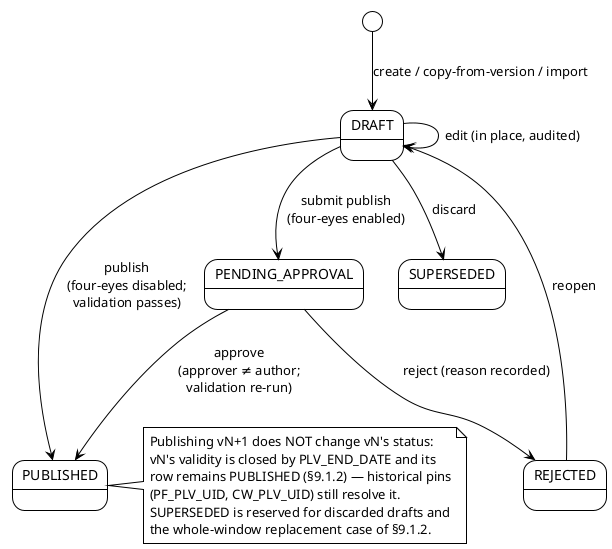
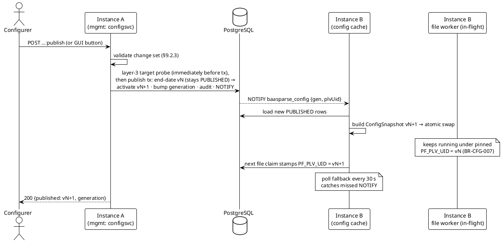

# 09 — Configuration & Rule Management

> Part of the [[00-index|baasparse TS]]. Previous: [[08-suspense-reconciliation-replay]] · Next: [[10-management-plane]]

This section designs the configuration subsystem (`configsvc` module, [[01-architecture]]
§1.3): the **temporal config model**, the **draft → published lifecycle**, **publish &
cluster-wide hot reload**, **edit locks**, the **dry-run harness**, **export/import**, and
**schema versioning of the JSONB rule bodies**. Tables referenced here are claimed in the
[[02-conventions]] §2.2 registry: `PL_PIPELINE`, `PLV_PIPELINE_VERSION`, `SRC_SOURCE`,
`FD_FORMAT_DEFINITION`, `VR_VALIDATION_RULESET`, `CR_CORRELATION_RULE`, `DR_DEDUP_RULE`,
`ER_ENRICHMENT_RULE`, `TR_TRANSFORM_RULESET`, `DS_DESTINATION`, `RD_REFERENCE_DATASET`,
`RDV_REFERENCE_DATA_VERSION`, `RDR_REFERENCE_DATA_ROW`, `EL_EDIT_LOCK`. Column-level DDL
lives in [[03-database-design]]; the sketches below are normative for shape and semantics.

**No registry additions are needed** — approval state lives on `PLV_PIPELINE_VERSION`,
and per-file pinning is a column (`PF_PLV_UID`) on the existing operational tables.

## 9.1 The temporal configuration model

### 9.1.1 Logical identity vs version rows

Every configuration entity separates **what it is** (logical identity) from **what it
says at a point in time** (version rows) — `BR-CFG-004/009`:

- **Pipelines** make the split physically: `PL_PIPELINE` is the logical identity (one row
  per pipeline, carries the immutable, deployment-unique `PL_NAME` and description);
  `PLV_PIPELINE_VERSION` holds the versions.
- **Every other config table** (`SRC`, `FD`, `VR`, `CR`, `DR`, `ER`, `TR`, `DS`, and the
  non-pipeline infrastructure config `RE`, `AP`, `RTN`) folds both into one table: each
  **row is a version**; the **logical identity is the root-UID self-reference** of the
  [[03-database-design]] §3.2 temporal pattern —
  `COALESCE(<P>_<P>_UID_ROOT, <P>_UID)` — with the human-stable `<P>_NAME` (unique per
  live entity) serving as the portable key for exports, locks, and diffs
  (e.g. `fd:voice-cdr-ber-v3`).

Every temporal config table carries the same column group (illustrated on
`FD_FORMAT_DEFINITION`; identical shape on the others — authoritative DDL in
[[03-database-design]] §3.4.4):

```sql
CREATE TABLE FD_FORMAT_DEFINITION (
  FD_UID            BIGINT GENERATED ALWAYS AS IDENTITY PRIMARY KEY,
  FD_FD_UID_ROOT    BIGINT      NULL,                 -- logical identity (root row = its own root)
  FD_VERSION_NO     INT         NOT NULL,             -- monotonic per logical entity
  FD_STATUS         TEXT        NOT NULL
                    CHECK (FD_STATUS IN ('DRAFT','PUBLISHED','SUPERSEDED')),
  FD_NAME           TEXT        NOT NULL,             -- human-stable portable key
  FD_KIND           TEXT        NOT NULL
                    CHECK (FD_KIND IN ('ASN1','JSON','XML','DSV','FIXED')),
  FD_VARIANT        TEXT        NOT NULL DEFAULT '',  -- vendor-variant decoder plug-in (BR-DEC-005)
  FD_SPEC           JSONB       NOT NULL,             -- declarative structure spec (BR-CFG-002);
                                                      --   carries "schemaVersion" (§9.7)
  FD_EFFECTIVE_FROM TIMESTAMPTZ NOT NULL,             -- validity window (event-time axis
  FD_END_DATE       TIMESTAMPTZ NULL,                 --  for effective-dated kinds; else
                                                      --  activation time). NULL = open-ended.
  -- + the four mandatory audit columns (§2.1) and the three §3.2 temporal indexes
  CONSTRAINT FK_FD_FD_ROOT FOREIGN KEY (FD_FD_UID_ROOT) REFERENCES FD_FORMAT_DEFINITION (FD_UID)
);
```

A **version row is immutable once published**: edits while `DRAFT` update the row in
place (audited); the moment it becomes `PUBLISHED` its body is frozen — any further
change is a **new version row**. `PLV_PIPELINE_VERSION` pins non-effective-dated rule
sets by **version-row UID** — so a pin can never observe a mutation — and
effective-dated kinds by **root UID** with event-time resolution (the §9.2.1 pin
model).

### 9.1.2 Supersession — end-date, never delete (`BR-CFG-009`)

Configuration rows are **never physically deleted**. All lifecycle transitions are
expressed with `STATUS`, `EFFECTIVE_FROM`, and `END_DATE`:

| Operation | Effect |
|-----------|--------|
| Forward supersession (publish v*N+1*) | v*N* gets `END_DATE = v(N+1).EFFECTIVE_FROM` and **remains `PUBLISHED`** — its validity window is closed, not its status; for effective-dated kinds it still governs events inside that window; v*N+1* becomes `PUBLISHED` |
| Whole-window replacement | A correction whose validity covers v*N*'s **entire** window leaves no period in which v*N* can ever be selected — only then is v*N* marked `SUPERSEDED` |
| "Delete" / retire an item | Latest published version gets `END_DATE = now()` and remains `PUBLISHED`; no new version. The item stops being selectable from now on but its full history remains |
| Restore / reactivate a prior version | A **new** version row is created as a copy of the historical body and published normally — history is never rewound in place (`R18` rollback path) |
| Discard a draft | `DRAFT` row is marked `SUPERSEDED` without ever having been active (retained for audit) |

`SUPERSEDED` is therefore **reserved** for exactly two cases: a version replaced across
its *entire* validity window, and a discarded draft. An end-dated historical version
stays `PUBLISHED` — "historical" is expressed by `END_DATE`, never by status — which is
precisely what the §9.1.3 selection requires: it matches the validity window among
`PUBLISHED` rows and lets the highest version win where backdated corrections overlap.
Whether a `PUBLISHED` row currently governs any period is answerable from
`EFFECTIVE_FROM`/`END_DATE` plus the publish audit events.

### 9.1.3 Effective-dated selection and backdated correction (`BR-CFG-014`)

For **effective-dated kinds** (enrichment rules, transform rule sets, reference data —
`BR-ENR-005`), `EFFECTIVE_FROM`/`END_DATE` are on the **event-time axis**: the engine
selects the version effective at the **record's event time** (`BR-COR-010`). The binding
selection rule is:

> *the version effective at the event time, **per the latest published configuration*** —
> i.e. among `PUBLISHED` rows of the key whose validity window covers the event time,
> the one with the **highest version number** wins.

```sql
-- Governing enrichment-rule version for event time $2 (BR-ENR-005, BR-CFG-014)
SELECT ER_UID, ER_VERSION_NO, ER_LOOKUP_SPEC
FROM   ER_ENRICHMENT_RULE
WHERE  COALESCE(ER_ER_UID_ROOT, ER_UID) = $1
  AND  ER_STATUS = 'PUBLISHED'
  AND  ER_EFFECTIVE_FROM <= $2
  AND  ($2 < ER_END_DATE OR ER_END_DATE IS NULL)
ORDER BY ER_VERSION_NO DESC
LIMIT 1;
```

A **backdated correction** is then an ordinary publish whose validity window lies in the
past: version *N+1* is created with `EFFECTIVE_FROM`/`END_DATE` covering the defective
period. The *highest-version-wins* rule outranks version *N* **for that period only** —
no bisecting or rewriting of v*N*'s row is needed; v*N* keeps its original window and
**remains `PUBLISHED`** (exactly as the selection SQL above requires — it loses only on
version number, and only where the windows overlap), preserving **what was previously
believed**. Only a correction covering v*N*'s *entire* validity window marks it
`SUPERSEDED` (§9.1.2). Reprocessing a suspended
record (`BR-ERR-004`, [[08-suspense-reconciliation-replay]]) now selects the corrected
version at the record's original event time, while the audit trail records which version
each run actually used (`BR-AUD-002/003`).

**Tighter RBAC:** a publish is classified **backdated** when any published validity
window in the change set starts before `now()` minus a configurable tolerance (default
5 minutes, absorbing clock/entry skew). Backdated publishes require the distinct
permission `config.publish-backdated` (held by *Administrator* only by default —
[[10-management-plane]] §10.2), pass the same validation and four-eyes gate (§9.2.4)
where enabled, and are audited with a dedicated event type (`CONFIG_PUBLISHED_BACKDATED`
— event-type taxonomy per [[13-security-compliance]] §13.5.6).

## 9.2 Draft → published lifecycle (`BR-CFG-008`)

### 9.2.1 What a pipeline version aggregates

`PLV_PIPELINE_VERSION` is the **unit of publish and of runtime pinning**: one row that
freezes an entire pipeline's behaviour. Its `PLV_STAGE_GRAPH` JSONB is the declarative
stage graph — **this schema is normative** ([[06-pipeline-stages]] §6.1.1 carries an
illustrative example of it):

```json
{
  "schemaVersion": 1,
  "keyGeneration": 3,
  "requires": [
    { "dataset": "rd:number-portability", "maxAge": "26h" }
  ],
  "source":  { "srcUid": 4102, "key": "src:voice-cdr-eu", "version": 3 },
  "format":  { "fdUid": 8804, "key": "fd:voice-cdr-ber-v3", "version": 5 },
  "stages": [
    { "stage": "validate",  "vrUid": 1027, "key": "vr:voice-basic",    "version": 4 },
    { "stage": "dedup",     "drUid": 5501, "key": "dr:voice-recordid", "version": 2 },
    { "stage": "collate",   "crUid": 3140, "key": "cr:voice-partials", "version": 7 },
    { "stage": "enrich",    "erRootUid": 1209, "key": "er:np-lookup" },
    { "stage": "transform", "trUid": 7702, "key": "tr:voice-billing",  "version": 3 }
  ],
  "destinations": [
    { "dsUid": 2011, "key": "ds:billing-dsv",  "version": 6 },
    { "dsUid": 2012, "key": "ds:dwh-rdbms",    "version": 1 }
  ]
}
```

**The pin model — one model everywhere** ([[03-database-design]] §3.4.1/§3.4.5 and
[[06-pipeline-stages]] §6.1.1 state the same rules):

- **Non-effective-dated kinds** (`VR`, `CR`, `DR`, `TR`, `DS`, `FD`) are pinned by
  **version-row UID** — immutable version rows (§9.1.1), so a pin can never observe a
  mutation; `key`/`version` are echoed for human-readable diffs (§10.5).
- **Effective-dated kinds** (`ER` enrichment rules, reference data, and any rule kind
  explicitly marked effective-dated) are pinned by **root UID**, with the governing
  version resolved **at runtime by the record's event time, per the latest published
  configuration** (§9.1.3) — this is what makes a backdated correction (`BR-CFG-014`)
  reach past events on reprocessing. Reference data is not pinned at all (§9.3.3).
- **Format-definition selection at the source:** `SRC_FD_UID` references the FD
  **root**; v1 selects the current-active FD version **at file claim** and stamps it
  per file (`BR-CFG-007`); v2 flips that selection to event-time (`BR-DEC-012`). The
  `format` pin above freezes the version validated with this pipeline version.

Two further graph-level fields:

- `keyGeneration` — the collation **key-derivation generation**, stamped onto windows
  as `CW_KEY_GEN`. It is incremented at publish when the collation key spec changes
  **or when a flush of open windows is requested with the publish**, and carried
  forward otherwise ([[06-pipeline-stages]] §6.4.10, `BR-COR-011`).
- `requires` — **readiness preconditions**: named reference datasets that must have an
  active version, optionally with a `maxAge` freshness bound; evaluated by the
  collector's claim gate before files are claimed for the pipeline
  ([[06-pipeline-stages]] §6.5.5, `BR-ENR-006`).

`PLV_MODE` (`STREAMING`/`COLLATING`) is **derived at save time** from the presence of a
`collate` stage and stored as a visible column (`BR-CFG-010`); the GUI and API surface
it on the pipeline view.

```sql
CREATE TABLE PLV_PIPELINE_VERSION (
  PLV_UID             BIGINT GENERATED ALWAYS AS IDENTITY PRIMARY KEY,
  PLV_PL_UID          BIGINT      NOT NULL,         -- FK → PL_PIPELINE.PL_UID
  PLV_VERSION_NO      INT         NOT NULL,
  PLV_STATUS          TEXT        NOT NULL CHECK (PLV_STATUS IN
                      ('DRAFT','PENDING_APPROVAL','REJECTED','PUBLISHED','SUPERSEDED')),
  PLV_MODE            TEXT        NOT NULL CHECK (PLV_MODE IN ('STREAMING','COLLATING')),
  PLV_STAGE_GRAPH     JSONB       NOT NULL,         -- carries "schemaVersion" (§9.7)
  PLV_EFFECTIVE_FROM  TIMESTAMPTZ NULL,             -- set at publish; NULL while draft
  PLV_END_DATE        TIMESTAMPTZ NULL,
  PLV_U_UID_SUBMITTED BIGINT      NULL,             -- four-eyes: author of the publish request
  PLV_U_UID_APPROVED  BIGINT      NULL,             -- four-eyes: approving identity
  PLV_PUBLISHED_ON    TIMESTAMPTZ NULL,
  -- + audit columns and FKs ([[03-database-design]] §3.4.5)
  CONSTRAINT UX_PLV_PL_VERSION UNIQUE (PLV_PL_UID, PLV_VERSION_NO),
  CONSTRAINT CK_PLV_FOUR_EYES CHECK (PLV_U_UID_APPROVED IS NULL
                                     OR PLV_U_UID_APPROVED <> PLV_U_UID_SUBMITTED)
);
-- exactly one active published version per pipeline
CREATE UNIQUE INDEX UX_PLV_PL_ACTIVE ON PLV_PIPELINE_VERSION (PLV_PL_UID)
  WHERE PLV_STATUS = 'PUBLISHED' AND PLV_END_DATE IS NULL;
```

### 9.2.2 Status state machine



Edits always target a `DRAFT` (`BR-CFG-008`): opening a published pipeline for editing
creates (or resumes) the pipeline's single open draft — a copy of the active version with
`PLV_VERSION_NO = max + 1` — under an edit lock (§9.4). Production is never touched until
publish. Adding a **new source + pipeline** is the same flow starting from an empty draft;
no redeploy is involved at any point (`BR-CFG-005`).

### 9.2.3 Validation before activation (`BR-CFG-003`)

One validator (`configsvc/validate`) serves every channel — GUI field-level checks
(`BR-UI-007`), API submissions (`BR-API-004`), import (§9.6), and the publish gate. It
runs three layers; **publish requires all three green**, save-as-draft requires only (1):

1. **JSON-Schema validation** of every JSONB body in the change set, against the embedded
   schema for its (`kind`, `schemaVersion`) (§9.7). Errors carry JSON-pointer paths for
   field-level display.
2. **Referential & semantic checks:** every version-row UID pinned by the stage graph
   exists, is `PUBLISHED` (or part of this same publish set), and is of the expected
   kind; every root-UID pin (effective-dated kinds, §9.2.1) resolves to at least one
   published version; stage ordering is legal; `PLV_MODE` matches the stages;
   dedup/correlation keys reference fields the format definition produces; enrichment
   rules reference existing `RD_REFERENCE_DATASET` keys; destination routing covers all
   routes; effective-dated windows do not leave uncovered gaps where a rule is
   mandatory.
3. **External-target validation:** for each RDBMS destination in the set, the field→column
   mapping is validated **against the live target table** (`information_schema` of the
   client-owned target — column existence, type compatibility, NOT-NULL coverage,
   idempotency-key columns present) per `BR-DST-014` ([[07-distribution-delivery]]);
   for file destinations, output directories exist and are writable.

**Sequencing at publish:** layer 3 — the live probe of an external system that cannot
participate in the transaction — runs **immediately before** the publish transaction;
layers 1–2 are then **re-verified inside** it, against the rows as locked (§9.3.1). The
residual layer-3 TOCTOU window (target schema changing between probe and commit) is
accepted: `BR-DST-014`'s runtime mapping validation covers post-publish drift anyway.

Validation failures reject the publish with the structured error envelope of
[[10-management-plane]] §10.4 — never a partial activation.

### 9.2.4 Optional four-eyes approval gate (`BR-CFG-013`)

A deployment-level (and optionally per-pipeline) config flag enables the gate. When
enabled: *submit publish* stamps `PLV_U_UID_SUBMITTED` and moves the version to
`PENDING_APPROVAL`; a second user holding `config.publish` (and
`config.publish-backdated` where applicable) reviews the **diff** (same renderer as the
GUI publish dialog, §10.5) and approves or rejects. The `CK_PLV_FOUR_EYES` constraint
makes *approver ≠ author* a database invariant, not just a service check. Approval
executes the publish transaction (§9.3.1) with `PLV_U_UID_APPROVED` stamped; the audit event
records author, approver, and the diff summary. While `PENDING_APPROVAL`, the draft is
frozen (no edits; edit-lock acquisition refused) — rejection reopens it. When the gate is
disabled, publish activates directly (small tier-3 teams).

## 9.3 Publish and cluster-wide hot reload (`BR-CFG-007`)

### 9.3.1 The publish transaction

Publish is **one PostgreSQL transaction** on the primary:

```sql
BEGIN;
  -- 1. re-run validation layers 1–2 (§9.2.3) against the rows as locked in this tx;
  --    layer 3 (the live client-target probe) ran immediately BEFORE this
  --    transaction — an external target cannot be locked, so the residual TOCTOU
  --    window is accepted (BR-DST-014's runtime mapping checks cover drift)
  -- 2. promote every DRAFT dependency in the publish set (rule sets, format, source,
  --    destinations): STATUS='PUBLISHED'; end-date the prior published version of
  --    each key — the prior version REMAINS 'PUBLISHED' (§9.1.2)
  -- 3. close the validity of the pipeline's current active version — the row
  --    REMAINS 'PUBLISHED' (§9.1.2); historical pins still resolve it:
  UPDATE PLV_PIPELINE_VERSION
     SET PLV_END_DATE=now(), ...
   WHERE PLV_PL_UID=$1 AND PLV_STATUS='PUBLISHED' AND PLV_END_DATE IS NULL;
  -- 4. activate the new version:
  UPDATE PLV_PIPELINE_VERSION
     SET PLV_STATUS='PUBLISHED', PLV_PUBLISHED_ON=now(), PLV_EFFECTIVE_FROM=now(), ...
   WHERE PLV_UID=$2;
  -- 5. bump the cluster config generation (named counter, SQ_SEQUENCE_ALLOCATOR)
  -- 6. append the audit event (CONFIG_PUBLISHED / CONFIG_PUBLISHED_BACKDATED, BR-AUD-001)
  -- 7. NOTIFY baasparse_config, '{"gen":<n>,"plUid":...,"plvUid":...}'
COMMIT;
```

The `UX_PLV_PL_ACTIVE` partial unique index makes a double-publish race impossible.
Because `NOTIFY` is transactional in PostgreSQL, the notification exists **iff** the
publish committed. An optional **flush of open collation windows** requested with the
publish (`BR-COR-011`) is executed *before* step 3 as a control action on the pipeline's
windows ([[06-pipeline-stages]]).

### 9.3.2 Propagation: LISTEN/NOTIFY + poll fallback

Every instance holds one dedicated `LISTEN baasparse_config` connection (outside the
pools). On notification — or on the **poll fallback** (every `configPollInterval`,
default 30 s, comparing the stored config generation against the last loaded one, which
covers dropped connections and missed notifications) — the instance:

1. reads the config generation and all `PUBLISHED`-active rows it does not yet have,
2. builds a new immutable **`ConfigSnapshot`** (parsed, schema-migrated (§9.7), compiled
   rule programs, resolved stage graphs),
3. swaps it in atomically:

```go
// configsvc: per-instance cache
type Cache struct {
    active atomic.Pointer[ConfigSnapshot]        // what new work claims
    byPLV  sync.Map // map[int64]*PipelineConfig — pinned versions still in use
}

func (c *Cache) Active() *ConfigSnapshot { return c.active.Load() }

// PLV resolution for a pinned worker: memory first, DB on miss —
// always answerable, because config is never deleted (BR-CFG-009).
func (c *Cache) Pipeline(ctx context.Context, plvUID int64) (*PipelineConfig, error)
```

Convergence is therefore bounded by `max(NOTIFY latency, configPollInterval)`; no restart,
no coordination beyond the database (`BR-CFG-007`). Instance start loads the snapshot
before the data plane starts ([[01-architecture]] §1.7).

### 9.3.3 Per-file version pinning

A file worker resolves the pipeline version **once, at claim time**, and is pinned to it
for the life of the file:

1. Claim coordinator acquires the file claim ([[04-acquisition-collection-archiving]]).
2. In the same transaction that records `Collected`, it stamps **`PF_PLV_UID`** on the
   `PF_PROCESSED_FILE` row with `Cache.Active()`'s version for the source's pipeline.
3. The worker runs entirely against `Cache.Pipeline(PF_PLV_UID)` — a publish mid-file
   changes nothing for it; the next claimed file picks up the new active version.
4. Crash-takeover re-reads `PF_PLV_UID` and resumes under the **same** version
   (`BR-HA-004`) — pinning survives instance loss because it is a DB fact, not memory.

Old snapshot versions stay in `byPLV` while any local worker uses them and are evicted
when released; a takeover on another instance reloads the version from the database.
Every audit/lineage record of the file carries `PF_PLV_UID` (`BR-AUD-003`).

**Open collation windows pin separately** (`BR-COR-011`): a window is stamped
`CW_PLV_UID` at open and all appends/completion/emit run under that stamped version's
collation semantics, because a window can outlive many files and a publish — full
semantics in [[06-pipeline-stages]]. **Reference data is explicitly *not* pinned**
(`BR-ENR-004`): each lookup reads the active `RDV_REFERENCE_DATA_VERSION` snapshot (or
the version effective at the record's event time where effective-dated) at **lookup
time**, via the `refdata` module's versioned cache; the active reference version is
recorded in audit context so RA can explain a mid-file split.

### 9.3.4 Publish / hot-reload sequence



## 9.4 Edit locks (`BR-CFG-012`)

`EL_EDIT_LOCK` serialises editing per **logical config item** across all instances and
both channels:

```sql
CREATE TABLE EL_EDIT_LOCK (
  EL_UID         BIGINT GENERATED ALWAYS AS IDENTITY PRIMARY KEY,
  EL_ITEM_KIND   TEXT        NOT NULL,   -- table prefix of the locked entity: 'PLV' | 'FD' | 'SRC' | ...
  EL_ITEM_UID    BIGINT      NOT NULL,   -- root UID of the locked logical entity (§9.1.1)
  EL_U_UID       BIGINT      NOT NULL,   -- FK → U_USER (holder)
  EL_CHANNEL     TEXT        NOT NULL CHECK (EL_CHANNEL IN ('GUI','API','IMPORT')),
  EL_ACQUIRED_ON TIMESTAMPTZ NOT NULL DEFAULT now(),
  EL_EXPIRES_ON  TIMESTAMPTZ NOT NULL,   -- idle deadline, renewed by heartbeat
  EL_STATUS      TEXT        NOT NULL DEFAULT 'HELD',  -- HELD | RELEASED | EXPIRED
  -- + audit columns ([[03-database-design]] §3.3.8)
  CONSTRAINT CK_EL_STATUS CHECK (EL_STATUS IN ('HELD','RELEASED','EXPIRED'))
);
CREATE UNIQUE INDEX UX_EL_ITEM_HELD ON EL_EDIT_LOCK (EL_ITEM_KIND, EL_ITEM_UID)
  WHERE EL_STATUS = 'HELD';
```

- **Acquire** is `INSERT … ON CONFLICT DO NOTHING` against `UX_EL_ITEM_HELD`; on
  conflict, one guarded `UPDATE` takes over the lock **iff expired**
  (`… SET (holder, deadlines) = (…) WHERE EL_STATUS='HELD' AND EL_EXPIRES_ON < now()`),
  else the current holder is returned for the conflict message ("being edited by
  *jsmith* since 14:02").
- **GUI sessions:** opening an editor acquires the lock; the HTMX editor page heartbeats
  (piggy-backed on its periodic refresh) to renew `EL_EXPIRES_ON` (idle timeout default
  10 min, configurable); save/cancel releases (`EL_STATUS='RELEASED'` — history kept until pruned; lock
  lifecycle is also audited via `AE_AUDIT_EVENT`). Lock state is displayed to other users
  (`BR-UI-011`, [[10-management-plane]] §10.5).
- **API:** a single-request mutation acquires the item's lock for the duration of the
  request and releases on completion, failing `409 Conflict` (envelope carries holder +
  acquired-at) if held by another user. Explicit `POST /api/v1/locks` /
  `DELETE /api/v1/locks/{kind}/{uid}` support multi-step editing sessions.
- **Import** (§9.6) acquires per item; items locked by another user are **skipped and
  reported** per item, never overwritten.
- A user may release their own lock; `config.edit` holders cannot break another's
  non-expired lock — an Administrator can (`rbac`-gated force-unlock, audited as
  `CONFIG_LOCK_BREAK`).

Locks guard **editing** only — they are administration data, not temporal config,
status-released and pruned per retention; publish does not require the lock beyond the
submitting user's own.

## 9.5 Dry-run / test harness (`BR-CFG-006`)

`POST /api/v1/pipelines/{key}/versions/{v}:dry-run` (and the GUI panel, `BR-UI-009`)
executes a **draft (or any) pipeline version against sample input with distribution
disabled**. Sample input is an uploaded file (bounded, default ≤ 64 MiB) or a filename in
the deployment's designated sample directory.

**Sandbox construction** — the real stage implementations wired with side-effect-free
ports:

| Concern | Production | Dry-run sandbox |
|---------|-----------|-----------------|
| Pipeline config | pinned `PLV` | the requested version, incl. `DRAFT` (validated first, layer 1+2 of §9.2.3) |
| Dedup store | `DK_DEDUP_KEY` | in-memory ephemeral set (reads production keys **read-only** for realistic duplicate verdicts; writes nothing) |
| Collation working set | `CW`/`CM` tables | in-memory windows, force-flushed at end-of-sample per the incomplete policy, so aggregates appear in the preview |
| Enrichment / reference data | `refdata` cache | same, **read-only** (real lookups, real on-miss policy) |
| Distribution | file / RDBMS targets | capture sink: renders output bytes per file destination format; generates (never executes) the RDBMS upsert statements |
| Suspense | `SU_SUSPENSE` | captured in the report only |
| Audit / recon / PF | written | none — zero operational rows |

The run executes under **management-plane resources** (§10.7) with a wall-clock and
record cap. The **report** returns per-stage in/out/suspense/discard counts, suspense
previews (reason code + offending fields), the first *N* rendered output records per
destination, generated RDBMS statements, and the derived reconciliation totals — enough
to validate a revenue-bearing feed end-to-end *before* publish. Dry-run execution is
RBAC-gated (`config.edit`) and audited (`CONFIG_DRYRUN`).

## 9.6 Export / import (`BR-CFG-011`)

### 9.6.1 Artifact format

Export produces a **portable, versioned JSON artifact**: a pipeline (or set) plus the
transitive closure of its dependencies, optionally with reference-data snapshots.

```json
{
  "artifact": "baasparse-config-export",
  "artifactVersion": 1,
  "engineVersion": "1.0.0",
  "exportedAt": "2026-07-04T10:15:00Z",
  "exportedBy": "jsmith",
  "items": [
    {
      "kind": "format", "key": "fd:voice-cdr-ber-v3", "version": 5,
      "schemaVersion": 2, "effectiveFrom": "2026-01-01T00:00:00Z", "endDate": null,
      "body": { "...": "..." }
    },
    { "kind": "pipeline", "key": "pl:voice-cdr-eu", "version": 7,
      "schemaVersion": 1, "stageGraph": { "...": "pins by key+version, not UID" } }
  ],
  "referenceData": [
    { "dataset": "rd:country-by-prefix", "version": 12, "rows": [ "..." ] }
  ],
  "secretRefs": [ "secret://sftp/voice-key", "secret://ftps/archive" ],
  "environment": {
    "overridable": { "paths": ["/shared/in/voice"], "hosts": ["cdr-gw.example.net"] }
  }
}
```

Rules: **secrets appear only as `secret://` references** — the exporter scans bodies and
refuses to serialise any field not in reference form (`BR-NFR-054`, `R23`); cross-item
pins are exported as `key`+`version` (UIDs are deployment-local); effective-dating is
preserved verbatim; export is RBAC-gated (`config.export`) and audited.

### 9.6.2 Import

Import runs entirely through the standard change controls — it is a *bulk draft editor*,
never a back door (`R18`, `R23`):

1. **Parse & schema-migrate** (artifact version, then per-body `schemaVersion`, §9.7).
2. **Apply environment overrides** — a caller-supplied override map (paths, hosts,
   secret-ref renames) applied before validation.
3. **Validate** the whole set (§9.2.3 layers 1–2; layer 3 at eventual publish); unresolved
   `secret://` references are reported as warnings blocking publish, not import.
4. **Conflict handling** per item, keyed on logical `key` (policy per item or global):
   `create` (key must not exist), `update` (new draft version on the existing key),
   `skip` (leave existing untouched).
5. **Locks respected:** each imported item acquires its edit lock (`EL_CHANNEL='IMPORT'`);
   items locked by another user are skipped and reported.
6. **Land as drafts:** every imported item is written `DRAFT`. Activation is the standard
   publish (§9.3), **including the four-eyes gate where enabled** — an import can never
   silently change production.
7. **Per-item report** returned (created / updated / skipped-conflict / skipped-locked /
   failed-validation, with errors); the import is audited with the report summary.

## 9.7 Config-schema versioning of JSONB bodies

The JSONB bodies are themselves a versioned contract:

- Every body carries `"schemaVersion": <int>` (queryable via the JSONB path — no
  dedicated column; bodies are always parsed through the migration chain on read); the
  engine embeds a JSON Schema per (`kind`,
  `schemaVersion`) — the same schemas back validation (§9.2.3) and OpenAPI request models
  ([[10-management-plane]] §10.4).
- **Migration on read:** `configsvc` holds an ordered chain of pure migration functions
  per kind (`v1→v2→…→current`). Snapshot building (§9.3.2), export, and the GUI editors
  always operate on the **current** in-memory shape. Stored rows are **never rewritten in
  place** (published rows are immutable, §9.1.1); a body is persisted at the current
  `schemaVersion` only when a *new* version row is saved anyway.
- New engine releases may add schema versions only **additively** across one adjacent
  release (mirroring the DB expand-then-contract rule, [[02-conventions]] §2.4), so a
  rolling upgrade's old and new binaries can both read every active body (`BR-HA-011`).
- Import accepts any body version it has a migration chain for and reports bodies newer
  than the engine understands as per-item failures.

## 9.8 BRS coverage

| Requirement | Where satisfied |
|-------------|-----------------|
| BR-CFG-001 (all behaviour is config in PostgreSQL, JSONB bodies) | §9.1.1 temporal tables + JSONB bodies; [[03-database-design]] |
| BR-CFG-002 (declarative, human-readable JSON) | §9.2.1 stage graph, §9.6.1 artifact, JSONB bodies §9.1.1/§9.7 |
| BR-CFG-003 (validate before activation) | §9.2.3 three-layer validator; re-run inside publish tx §9.3.1; import §9.6.2 |
| BR-CFG-004 (versioned, audited) | §9.1.1 version rows; audit events in §9.3.1, §9.4, §9.5, §9.6 |
| BR-CFG-005 (new source + pipeline without redeploy) | §9.2.2 (draft from empty), §9.3 (hot reload) |
| BR-CFG-006 (dry-run / test harness) | §9.5 |
| BR-CFG-007 (hot reload cluster-wide; per-file pinning) | §9.3.2 propagation, §9.3.3 pinning; exclusions (windows, refdata) §9.3.3 |
| BR-CFG-008 (publish-to-production; draft → published) | §9.2 lifecycle; §9.3.1 publish tx; GUI/API surfaces [[10-management-plane]] |
| BR-CFG-009 (temporal, never delete, restore) | §9.1.2 supersession table; §9.1.1 immutability; restore-as-new-version |
| BR-CFG-010 (mode follows stages, visible per pipeline) | §9.2.1 `PLV_MODE` derived + surfaced |
| BR-CFG-011 (export/import artifact, secrets as refs, conflicts, overrides, drafts, locks, four-eyes) | §9.6 |
| BR-CFG-012 (edit locks, both channels, expiry, audited) | §9.4 |
| BR-CFG-013 (optional four-eyes approval gate) | §9.2.4; DB invariant `CK_PLV_FOUR_EYES` |
| BR-CFG-014 (backdated correction, tighter RBAC) | §9.1.3; permission `config.publish-backdated` ([[10-management-plane]] §10.2) |

Related requirements touched here and owned elsewhere: `BR-COR-011` (window pinning,
[[06-pipeline-stages]]), `BR-ENR-004/005` (reference-data lifecycle, [[06-pipeline-stages]]),
`BR-DST-014` (RDBMS mapping validation, [[07-distribution-delivery]]), `BR-ERR-004`
(reprocess after correction, [[08-suspense-reconciliation-replay]]), `BR-NFR-054`
(secrets, [[13-security-compliance]]).
