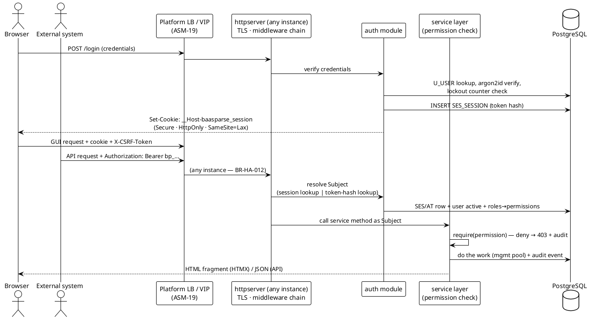

# 10 — Management Plane: Users/RBAC, REST API, HTMX GUI

> Part of the [[00-index|baasparse TS]]. Previous: [[09-configuration-management]] · Next: [[11-ha-clustering-recovery]]

This section designs the management plane ([[01-architecture]] §1.2): the `httpserver`,
`auth`, and management service modules — the built-in user system with RBAC (`USR`), the
REST API (`API`), and the HTMX GUI (`UI`). Tables: `U_USER`, `R_ROLE`, `UR_USER_ROLE`,
`PRM_PERMISSION`, `RP_ROLE_PERMISSION`, `SES_SESSION`, `AT_API_TOKEN` (registry,
[[02-conventions]] §2.2). **No registry additions are needed.**

## 10.1 Authentication architecture

### 10.1.1 One service/authorization layer (`BR-NFR-034`, `BR-USR-005`)

The GUI and the API are **two thin presentation adapters over one service layer**. All
business behaviour — config editing, publish, control, suspense actions, user admin —
lives in the management services (`configsvc`, `controlsvc`, `monitorsvc`, `auth`); every
service method takes an authenticated `Subject` and declares its required permission,
enforced **inside the service layer** (§10.2.3). A GUI form post and an API call for the
same operation execute the *same method*, so the authorization decision is identical by
construction, not by convention.



### 10.1.2 Password storage — argon2id (`BR-USR-004`)

Passwords are hashed with **argon2id** (`golang.org/x/crypto/argon2`): memory 64 MiB,
iterations 3, parallelism 2, 16-byte random salt, 32-byte key — stored as a PHC-format
string in `U_PASSWORD_HASH` so parameters can be raised later (rehash-on-next-login when
parameters are below current policy). Verification is constant-time. Plaintext passwords
never touch logs, audit payloads, or error messages; request logging redacts credential
fields structurally (the login handler logs outcome only).

### 10.1.3 Bootstrap administrator (`BR-USR-009`)

On first start, when `U_USER` is empty, the migration-owner instance creates user
`admin` with the *Administrator* role and `U_MUST_CHANGE_PASSWORD = true`. The initial
password comes from the secrets mechanism (`BOOTSTRAP_ADMIN_PASSWORD` secret ref,
`BR-NFR-054`); if absent, a random 24-character password is generated and written to a
`0600` file under the instance's private run directory (never logged), with its path
announced in the log. The generated credential is held to the **same at-rest bar as
any other secret** (`BR-NFR-054`): the run directory MUST reside on an encrypted
volume, or the deployment MUST route the generated credential through the secrets
mechanism instead of the file fallback; the file is deleted on completion of the
forced password change. While `U_MUST_CHANGE_PASSWORD` is set, the only permitted
operations are login and password change — GUI redirects to the change form; API returns
`403 PASSWORD_CHANGE_REQUIRED`. The bootstrap creation and the forced change are audited.

### 10.1.4 Password policy, lockout, throttling (`BR-USR-008`)

Configurable policy (stored config, defaults in brackets): minimum length (12), required
character classes (2 of 4), reuse history (5), optional maximum age (off). Lockout:
per-user failed-attempt counter in `U_USER` (`U_FAILED_LOGIN_COUNT`, `U_LOCKED_UNTIL`) —
after N failures (10) the account locks for a period (15 min; Administrator unlock
available); every failure also incurs a small constant response delay, and the login
endpoint carries an unconditional per-IP token-bucket throttle independent of the
optional API rate limiting (§10.4.5). Login success/failure and lockout are audited
(§10.6). Counters live in the DB, so throttling is cluster-consistent behind the LB.

**Trusted proxy / client address.** Behind the platform LB (`ASM-19`) the TCP peer of
every request is the LB, so per-IP throttling and address attribution need an
explicit trust rule: bootstrap config `http.trusted_proxies` (CIDR list) names the
proxies whose `X-Forwarded-For` is honoured. The **effective client address** — used
for the per-IP login throttle, `SES_CLIENT_ADDR`, and audit context — is the
right-most `X-Forwarded-For` entry not belonging to a trusted proxy; a forwarded
header arriving from an **untrusted** peer is ignored entirely (the TCP peer address
is used), so clients cannot spoof their way past the throttle. The default is the
empty list: never trust `X-Forwarded-For`.

### 10.1.5 MFA disposition and external IdP seam (`BR-USR-011`, `BR-USR-010`)

**MFA is out of scope for v1** (per `BR-USR-011`). Mitigations in force: lockout and
throttling (§10.1.4), TLS-only access (§10.7), argon2id hashing (§10.1.2), and full
attribution/audit (§10.6). A deployment mandating MFA fronts the management plane with
the external IdP (which carries MFA) when `BR-USR-010` lands.

The design does not foreclose either: authentication is behind a small seam —

```go
// auth.Authenticator — the only thing the login flow depends on.
type Authenticator interface {
    // Authenticate resolves credentials to a local U_USER identity,
    // or returns a challenge (the v2 seam for MFA steps / IdP redirects).
    Authenticate(ctx context.Context, req Credentials) (Identity, *Challenge, error)
}
```

`U_USER` carries `U_AUTH_SOURCE` (`'LOCAL'` now; `'OIDC'`/`'LDAP'` later): external
identities map to local user rows (so RBAC, sessions, audit attribution, and edit locks
are unchanged), with `U_PASSWORD_HASH` null for externally-authenticated users. Sessions,
tokens, and the RBAC layer are identical in every case — the IdP replaces only the
credential-verification step.

## 10.2 RBAC model (`BR-USR-003`)

### 10.2.1 Permission catalog (v1)

`PRM_PERMISSION` is seeded by migration with the capability-level catalog below;
`RP_ROLE_PERMISSION` grants permissions to roles; `UR_USER_ROLE` assigns roles to users.
A subject's permission set is the union over its roles, resolved at request time.

| Permission | Capability |
|------------|-----------|
| `users.view` | List/inspect user accounts and role assignments |
| `users.manage` | Create/update/deactivate users; reset passwords; unlock accounts |
| `rbac.manage` | Manage roles and role↔permission grants; force-release edit locks |
| `tokens.manage-own` | Issue/rotate/revoke **own** API tokens |
| `tokens.manage-all` | Manage any user's API tokens |
| `config.view` | Read all configuration (incl. history) and reference data |
| `config.edit` | Create/edit drafts (all config kinds), acquire edit locks, run dry-runs |
| `config.publish` | Publish-to-production; approve/reject four-eyes submissions |
| `config.publish-backdated` | Publish versions with past-dated validity ([[09-configuration-management]] §9.1.3) |
| `config.export` | Export config artifacts |
| `config.import` | Import config artifacts (lands as drafts) |
| `refdata.edit` | Load/refresh/activate reference-data versions |
| `control.operate` | Start/stop/pause/resume per source/stream |
| `suspense.view` | Query suspense entries and reasons |
| `suspense.reprocess` | Trigger reprocessing / abandon of suspense |
| `replay.execute` | Full-file replay incl. dedup-override and destination subset |
| `delivery.resend` | Re-send delivered/diverted outputs |
| `delivery.confirm` | Report downstream delivery confirmation (`BR-DST-016`, [[07-distribution-delivery]] §7.6) — intended for external-system API tokens |
| `recon.view` | Reconciliation summaries and completeness views |
| `alarms.view` | View alarms and their lifecycle |
| `alarms.ack` | Acknowledge/resolve alarms (GUI/API and email callback) |
| `audit.view` | Query the audit trail |
| `compliance.data-access` | See unmasked subscriber-identifying fields in suspense/window/audit browsers, incl. re-reading record bytes from disk (`BR-CMP-003`); **granted to no built-in role by default** |

The compliance/security permissions defined in [[13-security-compliance]] §13.7 —
`compliance.subject-search`, `compliance.erasure`, `tokenmap.reveal`, `tokenmap.admin`,
`audit.verify`, `config.security-override` — are part of the same seeded catalog
(separator convention: hyphen within the capability segment); like
`compliance.data-access` they are granted to **no built-in role by default** (explicit
grant only).

### 10.2.2 Built-in roles (resolves BRS Open Q5)

Migration seeds four built-in roles (flagged `R_BUILT_IN`, rename/delete refused; grants
adjustable; additional custom roles allowed via `rbac.manage`):

| Permission | Administrator | Configurer | Operator | Viewer |
|------------|:---:|:---:|:---:|:---:|
| `users.view` / `users.manage` | ✓ / ✓ | — | — | — |
| `rbac.manage` | ✓ | — | — | — |
| `tokens.manage-own` | ✓ | ✓ | ✓ | ✓ |
| `tokens.manage-all` | ✓ | — | — | — |
| `config.view` | ✓ | ✓ | ✓ | ✓ |
| `config.edit` | ✓ | ✓ | — | — |
| `config.publish` | ✓ | ✓ | — | — |
| `config.publish-backdated` | ✓ | — | — | — |
| `config.export` / `config.import` | ✓ / ✓ | ✓ / ✓ | — | — |
| `refdata.edit` | ✓ | ✓ | — | — |
| `control.operate` | ✓ | — | ✓ | — |
| `suspense.view` | ✓ | ✓ | ✓ | ✓ |
| `suspense.reprocess` | ✓ | — | ✓ | — |
| `replay.execute` | ✓ | — | ✓ | — |
| `delivery.resend` | ✓ | — | ✓ | — |
| `delivery.confirm` | ✓ | — | ✓ | — |
| `recon.view` / `alarms.view` / `audit.view` | ✓ | ✓ | ✓ | ✓ |
| `alarms.ack` | ✓ | — | ✓ | — |
| `compliance.data-access` | — (explicit grant) | — | — | — |

Backdated publish is deliberately Administrator-only by default (`BR-CFG-014` "tighter
than forward edits"); deployments may grant it to a dedicated corrections role.

### 10.2.3 Enforcement point

```go
// Every service method self-enforces — the single decision point for both channels.
func (s *ConfigService) PublishPipeline(ctx context.Context, sub auth.Subject,
    req PublishRequest) (PublishResult, error) {

    perm := PermConfigPublish
    if req.Backdated { perm = PermConfigPublishBackdated }
    if err := sub.Require(perm); err != nil {
        s.audit.Denied(ctx, sub, perm, req.PipelineKey)   // PERMISSION_DENIED event
        return PublishResult{}, err                        // → 403 at both adapters
    }
    ...
}
```

The HTTP router additionally declares each route's permission (used for OpenAPI security
metadata and GUI navigation), but the **service check is the one that counts** — a route
misdeclaration fails closed. The GUI also filters at the presentation layer (§10.5.4) as
defence in depth (`BR-UI-008`): hidden buttons are UX, the 403 is security.

## 10.3 Sessions and API tokens (`BR-USR-007`)

### 10.3.1 GUI sessions — DB-backed, instance-agnostic

Sessions live in `SES_SESSION`, so **any instance validates any session and instance
loss invalidates nothing** (`BR-HA-012`):

- Session token: 256-bit random; **only its SHA-256 lands in `SES_TOKEN_HASH`**. Row
  carries user ref, `SES_CREATED_ON`, `SES_LAST_SEEN_ON`, `SES_IDLE_EXPIRES_ON`,
  `SES_ABSOLUTE_EXPIRES_ON`, `SES_REVOKED_ON`, `SES_CLIENT_ADDR` (audit context;
  effective client address per the trusted-proxy rules, §10.1.4).
- Cookie: `__Host-baasparse_session` — `Secure`, `HttpOnly`, `SameSite=Lax`, `Path=/` (`__Host-`
  prefix pins scheme+host; `BR-NFR-053`).
- Expiry: **idle** (default 30 min, renewed on activity) and **absolute** (default 12 h),
  both configurable; logout and Administrator revocation set `SES_REVOKED_ON`. Expired
  rows are pruned by a scheduled job; session create/expire/revoke is audited.
- **Automated polling never keeps a session alive**: HTMX polling fragments
  (dashboard, alarms, lock banners — §10.5.1) send a marker header
  (`X-BP-Poll: 1`, via `hx-headers` on the polling trigger); requests carrying it are
  authenticated and served normally but are **excluded from idle-expiry renewal** —
  only user-initiated interaction advances `SES_IDLE_EXPIRES_ON`, so an unattended
  dashboard tab still idles out on schedule.
- Each request performs one indexed `SES` lookup on the management pool (§10.7) joined to
  user active-status — cheap, and always current (no cross-instance cache invalidation
  problem).

**CSRF (`BR-NFR-053`):** `SameSite=Lax` plus a **synchronizer token** — a per-session
CSRF secret; every rendered page carries it in a meta tag, HTMX is configured
(`hx-headers`) to send it as `X-CSRF-Token`, and the middleware rejects any
state-changing GUI request (non-GET) without a valid token. The API is exempt (Bearer
auth is not browser-ambient), and login itself is protected by a pre-session token.

### 10.3.2 API tokens — first-class credentials

`AT_API_TOKEN` implements the full lifecycle; a presented token is treated as a secret
end to end (`BR-NFR-054`): shown **once** at issue, stored only as `AT_TOKEN_HASH`
(SHA-256), never logged (middleware redacts the `Authorization` header structurally).

- **Format:** `bp_<AT_UID>_<base64url 32-byte secret>` — the embedded UID gives O(1)
  lookup; the secret is compared in constant time against the stored hash.
- **Expiry:** `AT_EXPIRES_ON` is `NOT NULL` — every token has an explicit expiry
  (default 90 days, maximum lifetime configurable).
- **Revocation:** `AT_REVOKED_ON` — takes effect on the next request (every request hits
  the DB row; no instance-local validity cache).
- **Rotation:** `POST /api/v1/tokens/{id}:rotate` issues a replacement secret on a new
  row and marks the old row with a configurable grace expiry (default 24 h, may be 0), so
  callers cut over without downtime.
- **Deactivation/role coupling:** tokens carry **no permissions of their own** — each
  request resolves the *owning user's current* roles→permissions and active status. A
  deactivated user or a removed role is therefore effective immediately, with no token
  bookkeeping (`BR-USR-007`).
- Issue/rotate/revoke are audited; `AT_LAST_USED_ON` is maintained (coarse, batched) for
  hygiene review.

## 10.4 REST API (`BR-API-001..008`)

### 10.4.1 Shape and versioning (`BR-API-007`)

All API routes live under **`/api/v1/…`**. `v1` is the compatibility contract: additive
changes (new fields, new endpoints) do not bump it; breaking changes ship as `/api/v2`
alongside `v1` for a deprecation window. JSON everywhere; timestamps RFC 3339 UTC;
list endpoints paginate (`limit`/`cursor`) and filter via query parameters. Custom
actions that do not map to a resource verb use the `:action` suffix
(`POST /pipelines/{key}/versions/{v}:publish`).

### 10.4.2 Resource map (covers the `BR-API-003` list)

This table is the **single canonical route map** for the management API: route
mentions elsewhere ([[07-distribution-delivery]] §7.6, [[12-observability-operations]]
§12.1/§12.8/§12.11, [[13-security-compliance]] §13.2) reference this map.

| Area | Routes (methods elided where obvious) | Permission |
|------|----------------------------------------|------------|
| Auth | `POST /auth/login` · `POST /auth/logout` · `POST /auth/password` | — / authenticated |
| Users | `/users` · `/users/{id}` · `PUT /users/{id}/roles` · `POST /users/{id}:unlock` | `users.*` |
| RBAC | `/roles` · `/roles/{id}` · `GET /permissions` | `rbac.manage` (read: `users.view`) |
| Tokens | `/tokens` · `DELETE /tokens/{id}` · `POST /tokens/{id}:rotate` | `tokens.manage-own/-all` |
| Sources | `/sources` · `/sources/{key}` (+ `/versions`) | `config.view/edit` |
| Remote endpoints | `/remote-endpoints…` (+ credential rotation per `BR-RMT-011`) | `config.view/edit` |
| Format definitions (file-structure models) | `/format-definitions` · `/format-definitions/{key}/versions/{v}` | `config.view/edit` |
| Rule sets | `/validation-rulesets` · `/correlation-rules` · `/dedup-rules` · `/enrichment-rules` · `/transform-rulesets` (each `/{key}/versions/{v}`) | `config.view/edit` |
| Destinations | `/destinations…` (+ `POST …:validate-mapping` for `BR-DST-014`) | `config.view/edit` |
| Pipelines | `/pipelines` · `/pipelines/{key}` · `/pipelines/{key}/versions/{v}` · `GET …/diff?against=` | `config.view/edit` |
| Publish & approval | `POST /pipelines/{key}/versions/{v}:publish` · `:submit` · `:approve` · `:reject` | `config.publish[-backdated]` |
| Dry-run | `POST /pipelines/{key}/versions/{v}:dry-run` (multipart sample) | `config.edit` |
| Edit locks | `GET/POST /locks` · `DELETE /locks/{kind}/{key}` | `config.edit` |
| Reference data | `/reference-datasets` · `POST …/{key}/versions` (bulk load) · `POST …/versions/{v}:activate` | `refdata.edit` |
| Export / import | `POST /config:export` · `POST /config:import` (returns per-item report) | `config.export/import` |
| Control | `POST /sources/{id}/control` (body: action `start` / `stop` / `pause` / `resume`, scope, reason — semantics in [[12-observability-operations]] §12.1) | `control.operate` |
| Catch-up | `POST /sources/{id}/catchup` (declare/clear a backfill, `BR-OPS-013` — [[12-observability-operations]] §12.8) | `control.operate` |
| Operational state | `GET /sources/{id}/state` · `GET /pipelines/{id}/state` · `GET /destinations/{id}/state` · `GET /jobs` ([[12-observability-operations]] §12.11) | `recon.view` |
| Cluster | `GET /cluster` (instances: status, heartbeat age, version, throughput — `BR-HA-009`) | `recon.view` |
| Suspense | `GET /suspense` (filters: source, stage, reason, period) · `POST /suspense:reprocess` · `POST /suspense:abandon` | `suspense.*` |
| Replay | `POST /files/{fileUid}:replay` (dedup-override, destination subset — `BR-ERR-009`) | `replay.execute` |
| Re-send | `POST /deliveries/{dlUid}:resend` (`BR-DST-009`) | `delivery.resend` |
| Delivery confirm | `POST /deliveries/{name}/confirm` (downstream confirmation callback, `BR-DST-016` — [[07-distribution-delivery]] §7.6) | `delivery.confirm` |
| Reconciliation | `GET /reconciliation` (scope: file/stream/period) · `GET /reconciliation/files/{fileUid}` | `recon.view` |
| Alarms | `GET /alarms` · `POST /alarms/{id}:ack` · `:resolve` (+ signed email-callback route, [[12-observability-operations]]) | `alarms.*` |
| Secrets | `POST /admin/secrets/reload` (re-resolve secret refs — [[13-security-compliance]] §13.2) | `control.operate` |
| Stats | `GET /stats/throughput` · `GET /stats/backlog` | `recon.view` |
| Audit | `GET /audit-events` (filters: type, actor, correlation id, period) | `audit.view` |
| Contract | `GET /api/v1/openapi.json` | authenticated |

Prometheus `/metrics`, `/healthz` (liveness) and `/readyz` (readiness) are served
outside `/api` on the management listener without session auth
([[12-observability-operations]] §12.3), for the platform LB and monitoring
(`ASM-19`, `BR-OPS-009`) — **the platform LB health-checks `/readyz`**.

### 10.4.3 HTTP semantics and error envelope (`BR-API-005`)

Standard semantics: `200`/`201`/`204` success; `400` malformed; `401` unauthenticated;
`403` forbidden (incl. forced password change); `404` unknown resource; `409` conflict —
**edit-lock held** or version race; `422` validation failure; `429` rate-limited
(`Retry-After`); `500`/`503` server/degraded (fail-closed states surface here). Every
non-2xx returns one envelope:

```json
{
  "error": {
    "code": "CONFIG_VALIDATION_FAILED",
    "message": "pipeline pl:voice-cdr-eu version 8 failed validation",
    "requestId": "9f2c4b7a",
    "details": [
      { "path": "$.stages[2].crUid", "code": "UNKNOWN_REFERENCE",
        "message": "correlation rule 3141 does not exist or is not publishable" },
      { "path": "$.dedup.retention", "code": "INVALID_DURATION",
        "message": "must be a positive duration, got \"-72h\"" }
    ]
  }
}
```

`code` values are stable machine strings; `details[].path` is a JSON pointer into the
submitted payload — the same structure the GUI renders as field-level errors
(`BR-API-004`, `BR-UI-007`), because both channels call the one validator of
[[09-configuration-management]] §9.2.3. `requestId` correlates with structured logs.

### 10.4.4 OpenAPI generation (`BR-API-006`)

Routes are declared as **data** (method, path, permission, request/response Go types
carrying struct tags), not ad-hoc `mux.Handle` calls. A `go:generate` step reflects over
this route table plus the embedded JSON Schemas ([[09-configuration-management]] §9.7) to
emit `openapi.yaml`, which is (a) committed under `docs/technical-spec/api/` so the
Obsidian vault renders it, and (b) embedded and served at `/api/v1/openapi.json`. CI
regenerates and diffs, so the served contract cannot drift from the code.

### 10.4.5 Optional rate limiting (`BR-API-008`)

Per-credential (token UID / session UID) token bucket, in-memory per instance (the
platform LB spreads load, so the effective cluster bound is ≈ N × limit — documented,
acceptable for a protective limit), configurable rps/burst per credential class, **off by
default**. `429` + `Retry-After` + envelope code `RATE_LIMITED`. Independent of the
always-on login throttle (§10.1.4).

## 10.5 HTMX GUI (`BR-UI-001..011`)

### 10.5.1 Rendering model

Server-rendered `html/template` with **HTMX-driven partial updates**: a base layout +
page templates + fragment templates (the same fragments serve initial render and HTMX
swaps). All assets — HTMX itself, CSS, icons — are **embedded in the binary**
(`embed.FS`); the GUI makes **no CDN or external requests** (`BR-UI-001`, and the
management plane may be network-isolated). Polling views (dashboard, alarms, lock
banners) use `hx-trigger="every Ns"` against fragment endpoints; no WebSocket dependency.

### 10.5.2 Screen inventory

| Screen | Route | Permission | Notes |
|--------|-------|------------|-------|
| Login / forced password change | `/login`, `/password` | — | §10.1.3/§10.1.4 |
| Dashboard / cluster view | `/` | authenticated | instances + heartbeats (`INS_INSTANCE`), per-source throughput & backlog, open-alarm summary, disk-pressure signals |
| User admin | `/admin/users` | `users.view/manage` | accounts, roles, unlock, deactivate (`BR-UI-002`) |
| Roles & permissions | `/admin/roles` | `rbac.manage` | grants matrix §10.2 |
| API tokens | `/admin/tokens` | `tokens.*` | issue (one-time display), rotate, revoke |
| Sources & pipelines | `/config/pipelines` | `config.view` | list with mode (`PLV_MODE`), active version, lock state |
| Pipeline editor | `/config/pipelines/{key}` | `config.edit` | stage graph editing on the open draft, under edit lock |
| Datasources | `/datasources` | `config.view` | reusable storage connections (posix/S3): list, create, remove (soft-delete) — §10.5.7 |
| Datasource setup | `/datasources/new` | `config.edit` | connection form + inline "Test connection" probe (§10.5.7) |
| File-structure modeller | `/config/formats/{key}` | `config.edit` | per format kind, §10.5.3 (`BR-UI-004`) |
| Transformation modeller | `/config/transforms/{key}` | `config.edit` | projection/rename/convert/derive/output builder (`BR-UI-005`) |
| Destinations | `/config/destinations/{key}` | `config.edit` | incl. RDBMS mapping + "validate mapping" action (`BR-DST-014`) |
| Reference data | `/config/refdata` | `refdata.edit` | dataset versions, bulk load, atomic activate (`BR-ENR-004`) |
| Dry-run / preview | `/config/pipelines/{key}/dry-run` | `config.edit` | sample upload → staged report ([[09-configuration-management]] §9.5; `BR-UI-009`) |
| Export / import | `/config/transfer` | `config.export/import` | artifact download; import wizard with per-item report |
| Publish dialog | fragment | `config.publish` | §10.5.5 (`BR-UI-003b`) |
| Monitoring: throughput | `/ops/throughput` | `recon.view` | records/sec, files, lag; catch-up view (`BR-UI-006`) |
| Suspense browser | `/ops/suspense` | `suspense.view` | filter by source/stage/reason/period; select → reprocess/abandon (`suspense.reprocess`) |
| Reconciliation | `/ops/reconciliation` | `recon.view` | file/stream/period conservation views, drill-down to `PF` |
| Alarms | `/ops/alarms` | `alarms.view` | lifecycle open→ack→resolved, ack/resolve actions (`alarms.ack`) |
| Control | `/ops/control` | `control.operate` | start/stop/pause/resume per source with state display |
| Audit browser | `/ops/audit` | `audit.view` | filter by type/actor/correlation id |

### 10.5.3 File-structure modeller — how the GUI edits `FD` JSONB

The modeller is a **projection of the `FD_SPEC` JSONB** — there is no separate GUI model;
the form partials read and write exactly the document the API accepts, so GUI- and
API-authored formats are indistinguishable. Per kind (`BR-UI-004`):

- **ASN.1:** tree editor over the declarative schema (tags, constructed/primitive,
  OPTIONAL/DEFAULT, field bindings to canonical names), plus record-type discriminator
  mapping (`BR-DEC-008`); vendor-variant decoder selection from `decoder.Registry`.
- **DSV:** delimiter/quote/escape/header settings + an ordered column grid
  (name, type, trim, nullable).
- **Fixed:** field grid of offset/length/type/padding with live overlap/gap checking.
- **XML:** record-element path + field rows mapping element/attribute paths to canonical
  fields.
- **JSON:** record path (for wrapped arrays / NDJSON) + JSON-pointer field mappings.

Every kind gets a **"raw JSON" tab** (schema-validated on the server, same validator) for
power users, and a "preview against sample" action that decodes the first N records of an
uploaded sample (dry-run harness, decode stage only). Field-level errors return as HTMX
fragments targeted at the offending input (`BR-UI-007`) using the `details[].path`
structure of §10.4.3.

### 10.5.4 RBAC in the presentation (`BR-UI-008`)

Templates receive the subject's resolved permission set; navigation entries, buttons, and
editable fields render only when permitted (read-only rendering for `*.view`-only
subjects). This is **defence in depth**: the service layer re-checks every action
(§10.2.3), so a hand-crafted request without permission still gets `403` + a
`PERMISSION_DENIED` audit event.

### 10.5.5 Publish-to-production and edit-lock indication

**Publish** (`BR-UI-003b`): a single button on the pipeline editor. The dialog shows a
server-computed **diff** — stage-graph changes plus the resolved body diff of every
changed rule version (old published vs candidate, keyed by `key@version` from the stage
graph of [[09-configuration-management]] §9.2.1) — a validation summary, the pipeline's
mode, and a warning banner when the publish is **backdated**. Confirmation requires an
explicit checkbox; with four-eyes enabled the same dialog becomes the submit/approve
surface (approver sees the identical diff). The audit event stores the diff summary
(`BR-CFG-013`).

**Edit locks** (`BR-UI-011`): opening an editor acquires the lock
([[09-configuration-management]] §9.4). The editor page's HTMX refresh renews the lock
**only while it observes recent user interaction** (input/focus activity within the
idle threshold — the poll itself is marked per §10.3.1 and never renews on its own),
and every lock carries an **absolute lifetime cap** (default 4 h, configurable) after
which it expires regardless of activity — an abandoned editor tab cannot hold a config
item hostage. Other users see a lock banner ("locked by *jsmith* since 14:02") and get
a read-only rendering; the banner polls, so lock release/expiry converts to editable
without reload.

### 10.5.6 Authenticated and audited (`BR-UI-010`)

Every GUI route (except `/login` and static assets) sits behind the session middleware;
every state-changing action passes CSRF (§10.3.1) and lands in the service layer, which
writes the corresponding audit event (§10.6) attributed to the session's user.

### 10.5.7 Datasources — reusable storage connections and the wizard picker

A **datasource** is a reusable, named storage *connection* that many pipelines
share — a POSIX working directory (a `Root`) or an S3/MinIO endpoint + region +
credentials. It deliberately holds **only the connection, never per-pipeline
specifics**: the S3 bucket and the input / in-progress / done / quarantine /
output lifecycle areas are chosen when a pipeline is created, so one datasource
can host many pipelines without collision. Datasources persist in a dedicated
`DSR_DATASOURCE` table — an identity row (`DSR_UID`, `DSR_NAME`,
`DSR_KIND ∈ {posix,s3}`, `DSR_STATUS ∈ {ACTIVE,DISABLED}`, audit columns) plus a
`DSR_CONFIG` JSONB blob whose S3 secret key is **AES-GCM encrypted via the
`secret` module, the same at-rest pattern as the `SRC`/`PLV` JSONB**
(`BR-NFR-054`). A partial-unique index `UX_DSR_NAME_ACTIVE` enforces name
uniqueness among *live* datasources; removal is a **soft-delete**
(`DSR_STATUS = 'DISABLED'`) so any pipeline still referencing the datasource by id
keeps resolving (config is data — never destroyed).

**CRUD surface (GUI form routes).** Like the rest of the HTMX GUI these are
server-rendered pages and form posts (no `/api/v1` binding in the alpha; a future
`/api/v1/datasources` resource slots into the §10.4.2 map). They sit behind the
session middleware and, by design, the config permissions of §10.2.1:

| Route | Purpose |
|-------|---------|
| `GET /datasources` | List page: name, kind, connection summary, created-on, Remove |
| `GET /datasources/new` | Connection setup form (kind toggle → posix `Root` or S3 endpoint/region/keys) |
| `POST /datasources` | Create — the store encrypts the secret before persisting; duplicate active name → inline error |
| `POST /datasources/{id}/delete` | Soft-delete (sets `DISABLED`; referencing pipelines unaffected) |
| `POST /datasources/test` | **Test connection** — probes the config and swaps back an inline pass/fail fragment |

**Test connection (`POST /datasources/test`).** The button posts the same-named
connection fields and runs `storage.TestConnection` (12 s timeout), rendering an
HTMX `test_result` fragment (`✓ connected` / `⚠ <reason>`) in place — no page
reload, no CDN (`BR-UI-001`). The probe is backend-aware and exercises the *same
code paths the data plane uses*, so a green result means real pipelines will work:

- **posix** — a full round-trip under `Root`: `List` (read access) then write →
  read-back → byte-verify → delete a throwaway object, proving mkdir + atomic
  write + read + delete.
- **s3 with a bucket** — the identical round-trip inside that bucket (an optional
  "bucket to test" field on the form).
- **s3 without a bucket** — a connection-only datasource, where the bucket is
  chosen per-pipeline: the endpoint + credentials are validated with a
  `ListBuckets` reachability call, and the fragment says so ("endpoint and
  credentials verified (bucket is set per-pipeline)").

The probe object lives under a dot-prefixed `.baasparse-probe/` key so it stays
invisible to any List-based detection even if the cleanup delete fails. Because
the handler reads the same field names as the setup form, the check works both on
the datasource form and inline in the wizard.

**Datasource picker in the pipeline-creation wizard (`BR-UI-003`).** Step 1 of the
wizard offers a datasource `select` for the input location; the default
`— Configure inline below —` option keeps the **legacy inline path**
(`DatasourceID == 0`) verbatim, so pre-datasource pipelines remain fully
backward-compatible. When a datasource is picked the wizard reveals:

- a **per-pipeline S3 bucket** (`ds_bucket`) + optional "create if missing" —
  required because the datasource itself carries no bucket;
- an optional **distinct output datasource** (`output_datasource_id`, default
  `— Same as input —`) with its own per-pipeline **output bucket**
  (`ds_output_bucket`, defaulting to the input bucket). A different "write to"
  datasource makes the pipeline **cross-backend** — read input from one place and
  land done/output on another (e.g. read S3 → write local FS).

These references are stored **inside the `PLV_STAGE_GRAPH` JSONB document**
(`Source.DatasourceID`, `Source.OutputDatasourceID`, `Source.OutputBucket`) — no
new columns and no FK into `DSR_DATASOURCE` — and are **materialized at read time**
(`applyDatasources`): the input datasource supplies backend/root/credentials for
input + in-progress + quarantine; the output datasource becomes the pipeline's
output/done destination; and the lifecycle areas default to a
`<slug(name)>-<id>/{input,in-progress,done,quarantine,output}` prefix (the
pipeline id guarantees uniqueness even when two names slug alike). On create, a
filesystem-backed pipeline additionally has this directory tree
**pre-provisioned** (`storage.EnsureTree`, writing a dot-prefixed `.keep` marker)
so an operator can drop files immediately; object-store backends have virtual
prefixes and are skipped.

## 10.6 Security-relevant audit events (`BR-USR-006`)

All management-plane events append to `AE_AUDIT_EVENT` (hash-chained, append-only —
[[13-security-compliance]]). `AE_EVENT_TYPE` values follow the **single UPPER_SNAKE
taxonomy of [[13-security-compliance]] §13.5.6** — the rows below detail the
Security/users, Configuration and Control/ops groups of that catalog:

| `AE_EVENT_TYPE` | Trigger | Key context |
|-----------|---------|-------------|
| `LOGIN_SUCCESS` / `LOGIN_FAILURE` | Login attempt | username, channel, IP, UA (never the credential) |
| `LOCKOUT` | Lockout threshold reached | username, failure count |
| `LOGOUT` / `SESSION_REVOKED` / `SESSION_EXPIRED` | Session end | session UID, reason |
| `PASSWORD_CHANGED` | Password change (incl. forced bootstrap) | target user, changed-by |
| `PERMISSION_DENIED` | Service-layer permission denial | subject, permission, resource |
| `USER_CREATED` / `USER_MODIFIED` / `USER_DEACTIVATED` | User admin | target user, changed fields (no secrets) |
| `USER_ROLE_GRANTED` / `USER_ROLE_REVOKED` | Role assignment | target user, role |
| `ROLE_CHANGED` | Role/permission grant edits | role, permission delta |
| `TOKEN_ISSUED` / `TOKEN_ROTATED` / `TOKEN_REVOKED` | API-token lifecycle | token UID, owner, expiry (never the secret) |
| `BOOTSTRAP_ADMIN_CREATED` | First-run provisioning | — |
| `CONFIG_LOCK_ACQUIRED` / `_RELEASED` / `_EXPIRED` / `_BROKEN` | Edit-lock lifecycle | item kind+key, holder |
| `CONFIG_DRAFT_SAVED` / `CONFIG_PUBLISHED` / `CONFIG_PUBLISHED_BACKDATED` | Config change / activation | keys+versions, diff summary, PLV UID |
| `CONFIG_APPROVAL_SUBMITTED` / `_APPROVED` / `_REJECTED` | Four-eyes gate | author, approver, diff summary |
| `CONFIG_EXPORTED` / `CONFIG_IMPORTED` / `CONFIG_DRYRUN` | Config operations | artifact/report summary |
| `REFDATA_LOADED` / `REFDATA_ACTIVATED` | Reference-data lifecycle | dataset, version |
| `CONTROL_START` / `CONTROL_STOP` / `CONTROL_PAUSE` / `CONTROL_RESUME` | Operational control | source/stream |
| `SUSPENSE_REPROCESSED` / `SUSPENSE_ABANDONED` | Suspense actions | selection filter, counts |
| `REPLAY_INITIATED` / `RESEND` | Replay / re-send | file UID / delivery UID, options |
| `ALARM_ACKNOWLEDGED` / `ALARM_RESOLVED` | Alarm lifecycle (GUI/API/email callback) | alarm UID, via-channel |
| `DATA_ACCESS` | Unmasked subscriber-data view | subject, resource (`BR-CMP-003`) |

Every event carries the acting identity (`AE` context + the row's `*_CREATED_BY`),
satisfying `BR-NFR-052` attribution end to end.

## 10.7 Isolation from the data plane (`BR-NFR-033`)

Within the single Modulith process ([[01-architecture]] §1.2):

- **Separate listener:** the management HTTP server binds its own address:port (TLS,
  §13); the data plane owns no listener the management plane shares.
- **Separate DB pools:** a dedicated management `pgxpool` (small, capped — default max 8
  connections) so a burst of GUI/API activity can never starve the data-plane pool, and
  vice versa. Long report queries (audit, reconciliation) run with a statement timeout.
- **Bounded work:** a management-side concurrency semaphore (default 32 in-flight
  requests → `503` beyond, LB retries another instance), per-request timeouts, and body
  limits (config payloads 4 MiB; import artifacts and dry-run samples 64 MiB default) —
  management memory is a fixed budget line, outside the data-plane record budget.
- **Fault separation:** a management-handler panic is recovered at the middleware
  boundary (500 + log); nothing in the request path can block a pipeline goroutine —
  the only shared resources are PostgreSQL (separate pools) and the config cache
  (lock-free atomic pointer reads, [[09-configuration-management]] §9.3.2).
- **Instance-agnostic behind the platform LB** (`BR-HA-012`, `ASM-19`): sessions, tokens,
  locks, alarms, and config all live in shared PostgreSQL, so any instance serves any
  request and instance loss invalidates nothing; the LB health-checks `/readyz`
  ([[12-observability-operations]] §12.3). TLS
  holds end-to-end under either termination model (pass-through, or
  terminate-and-re-encrypt at the LB) — instances always serve TLS themselves
  (`BR-NFR-053`; certificates via the secrets mechanism, [[13-security-compliance]]).

## 10.8 BRS coverage

| Requirement | Where satisfied |
|-------------|-----------------|
| BR-USR-001 (user system, GUI+API) | §10.2.1 tables, §10.4.2 `/users`, §10.5.2 user admin |
| BR-USR-002 (authenticate before any operation) | §10.1.1 middleware + service layer; §10.5.6 |
| BR-USR-003 (RBAC roles → permissions) | §10.2.1–10.2.2 |
| BR-USR-004 (argon2id, no plaintext ever) | §10.1.2 |
| BR-USR-005 (same decision GUI & API) | §10.1.1, §10.2.3 single enforcement point |
| BR-USR-006 (security actions audited, attributable) | §10.6 |
| BR-USR-007 (sessions; token lifecycle: expiry/revoke/rotate/deactivation coupling) | §10.3.1, §10.3.2 |
| BR-USR-008 (password policy, lockout/throttle) | §10.1.4 |
| BR-USR-009 (bootstrap admin, forced change) | §10.1.3 |
| BR-USR-010 (external IdP seam) | §10.1.5 (`Authenticator`, `U_AUTH_SOURCE`) |
| BR-USR-011 (MFA out; mitigations; not foreclosed) | §10.1.5 (`Challenge` seam) |
| BR-API-001 (REST API) | §10.4 |
| BR-API-002 (auth + same RBAC) | §10.1.1, §10.2.3, §10.3.2 |
| BR-API-003 (full capability coverage) | §10.4.2 resource map |
| BR-API-004 (validate before activation, structured errors) | §10.4.3; validator in [[09-configuration-management]] §9.2.3 |
| BR-API-005 (HTTP semantics, error envelope) | §10.4.3 |
| BR-API-006 (OpenAPI, Obsidian-renderable) | §10.4.4 |
| BR-API-007 (versioned API) | §10.4.1 |
| BR-API-008 (optional rate limiting) | §10.4.5 |
| BR-UI-001 (HTMX GUI served by the Go app, embedded assets) | §10.5.1 |
| BR-UI-002 (user management) | §10.5.2 |
| BR-UI-003 (pipelines/streams setup) | §10.5.2 pipeline editor + destinations; §10.5.7 datasource picker |
| BR-UI-003b (publish button, confirmation, audit) | §10.5.5 |
| BR-UI-004 (file-structure modelling, all five kinds) | §10.5.3 |
| BR-UI-005 (transformation modelling) | §10.5.2 transformation modeller |
| BR-UI-006 (monitor & control) | §10.5.2 monitoring/control screens |
| BR-UI-007 (field-level validation errors) | §10.4.3 details→fragments, §10.5.3 |
| BR-UI-008 (RBAC in presentation, defence in depth) | §10.5.4 |
| BR-UI-009 (dry-run/preview) | §10.5.2 dry-run; [[09-configuration-management]] §9.5 |
| BR-UI-010 (all GUI actions authenticated + audited) | §10.5.6, §10.6 |
| BR-UI-011 (edit-lock indication) | §10.5.5; [[09-configuration-management]] §9.4 |
| BR-NFR-033 (plane isolation) | §10.7 |
| BR-NFR-034 (one service/authz layer) | §10.1.1, §10.2.3 |
| BR-NFR-052 (authenticated, RBAC'd, attributable) | §10.1, §10.2, §10.6 |
| BR-NFR-053 (TLS, cookie protection, CSRF, web risks) | §10.3.1, §10.7; TLS detail in [[13-security-compliance]] |

Related, owned elsewhere: `BR-HA-012` (instance-agnostic management plane —
[[11-ha-clustering-recovery]], surface here §10.3.1/§10.7), `BR-CMP-003`
(`compliance.data-access`, [[13-security-compliance]]), `BR-OPS-009/011` (health,
metrics, alarm callback — [[12-observability-operations]]), `BR-NFR-054` (secrets,
[[13-security-compliance]]).
