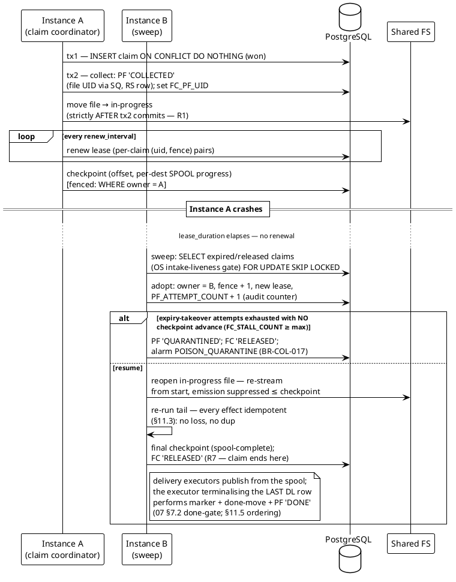

# 11 — High Availability, Clustering & Crash Recovery

> Part of the [[00-index|baasparse TS]]. Previous: [[10-management-plane]] · Next: [[12-observability-operations]]

This section specifies how N identical instances behave as **one logical mediation
service**: instance identity and liveness, the distributed claim/lease that underpins
exactly-once file ownership, takeover and checkpoint-based resume, the crash-recovery
matrix, PostgreSQL failover, fail-closed behaviour when no primary is reachable, the
startup DB↔disk reconciliation, rolling upgrades, and scale-out. For the **cloud/Kubernetes topology** those same mechanisms map onto
container primitives — a `Deployment` of replicas behind a `Service`/ingress, health
probes, graceful drain, a disruption budget, a pre-deploy migration `Job`, and the v1
scheduled-job lease (§11.13–§11.16, grounded in [[16-cloud-native-deployment]]).
It realises BRS §6.19
(`BR-HA-*`) and §7.2 (`BR-NFR-010..019`). Registry tables used: `INS_INSTANCE`,
`FC_FILE_CLAIM`, `SJ_SCHEDULED_JOB`, `PF_PROCESSED_FILE`, `CW_COLLATION_WINDOW`,
`SM_SCHEMA_MIGRATION` ([[02-conventions]] §2.2 — no new tables are required by this
section). Full DDL lives in [[03-database-design]]; column usage is normative here.

**One design rule governs everything below:** all coordination state lives in
PostgreSQL, all lease timestamps are **stamped and compared on the database clock**
(`now()` in SQL — a single time authority), and every downstream effect is
**idempotent**, so the worst any failure can cause is *bounded re-work*, never loss or
duplication (`BR-NFR-010/011/012`, BRS §7.8 priority 1).

---

## 11.1 Instance identity & the cluster registry — `INS_INSTANCE`

### Identity

Each instance gets a **stable instance ID** from bootstrap configuration
(`BR-NFR-061`; e.g. `med-a01`), unique per deployment. The engine identity used in
audit columns is `engine:<instance-id>` ([[02-conventions]] §2.1). On startup
(after migrations verify, [[01-architecture]] §1.7) the instance **registers**:

| Column (prefix `INS`) | Meaning |
|---|---|
| `INS_NAME` | Bootstrap instance ID (`UX_INS_NAME` unique) |
| `INS_HOST` | Where the process runs |
| `INS_ENGINE_VERSION` | Semver of the running binary (drives the contract-migration gate, §11.9) |
| `INS_STATUS` | `STARTING → READY → DEGRADED / DRAINING → STOPPED` (TEXT + CHECK) |
| `INS_STARTED_ON`, `INS_HEARTBEAT_ON` | Registration and last heartbeat, DB clock |
| `INS_MGMT_ADDR` | Management listener address (cluster view, LB diagnostics) |

Re-registration after a crash **upserts** on `INS_NAME` (the old row's status is
overwritten; history is in the audit trail, not the registry).

### Heartbeat & liveness detection

A dedicated goroutine updates `INS_HEARTBEAT_ON = now()` every
`instance.heartbeat_interval` (default **10 s**), on the management pool — never the
data-plane pool — so data-plane saturation cannot make a healthy instance look dead.

Liveness is **derived, never stamped by the failing party**: an instance is *suspect*
when `now() - INS_HEARTBEAT_ON > instance.down_after` (default **45 s**, > 3 missed
beats + margin) and its status is not `stopped`. A suspect instance triggers the
**`INSTANCE_DOWN` alarm** ([[12-observability-operations]] §12.5) — but nothing else:
work recovery never keys off instance liveness, only off **claim-lease expiry**
(§11.2), which is what actually proves work is abandoned. The registry exists for the
**cluster membership view** (`BR-HA-001`, `BR-HA-009`): GUI/API list all instances,
status, heartbeat age, version, and per-instance throughput
([[12-observability-operations]] §12.11).

---

## 11.2 The claim/lease mechanism — `FC_FILE_CLAIM`

The single coordination primitive of the cluster (`BR-HA-003`, `BR-COL-004`). The same
mechanism, with the same shape, runs **file claims** (this section), **collation-window
emit claims** (`BR-COR-008`), and — in v2 — **scheduled-job leases**
(`BR-HA-010` seam, below).

### Claim row shape (usage)

| Column (prefix `FC`) | Meaning |
|---|---|
| `FC_SRC_UID`, `FC_FILE_NAME` | File identity at detection; the partial unique index `UX_FC_SRC_NAME_HELD (FC_SRC_UID, FC_FILE_NAME) WHERE FC_STATUS='HELD'` makes detection idempotent |
| `FC_PF_UID` | Set when the `Collected` record commits (file UID allocated from `SQ_SEQUENCE_ALLOCATOR`, `BR-COL-005`) |
| `FC_INS_UID` | Current owner |
| `FC_FENCE` | **Fencing token** — incremented on every claim, takeover, and adoption; every file-scoped write carries it (decision 3, [[02-conventions]] §2.2) |
| `FC_STATUS` | `HELD` · `RELEASED` — **"expired" is computed** (`HELD AND FC_EXPIRES_ON < now()`), never stamped, so a dead owner needs no dying act |
| `FC_ACQUIRED_ON`, `FC_EXPIRES_ON`, `FC_HEARTBEAT_ON` | Lease timestamps — **DB clock only** |
| `FC_CHECKPOINT_OFFSET`/`FC_CHECKPOINT_RECORD`, `FC_CHECKPOINT` (JSONB), `FC_CHECKPOINT_ON` | Resume point (§11.4) |

Attempt counting is split (R15): `PF_PROCESSED_FILE.PF_ATTEMPT_COUNT` is the **audit
counter** of all claims/takeovers; `FC_STALL_COUNT` counts **expiry takeovers without
checkpoint advance** and is what drives quarantine (`BR-COL-017`, §11.3 step 1).

### Acquisition: two paths, one exactly-once outcome

**Path A — new file (insert-claim).** Any scanner that detects a candidate
(`BR-COL-012`) attempts:

```sql
INSERT INTO FC_FILE_CLAIM
    (FC_SRC_UID, FC_FILE_NAME, FC_INS_UID, FC_STATUS,
     FC_ACQUIRED_ON, FC_EXPIRES_ON,
     FC_CREATED_BY, FC_MODIFIED_BY)
VALUES ($src, $name, $me, 'HELD',
        now(), now() + $lease_duration,
        $engine_id, $engine_id)
ON CONFLICT (FC_SRC_UID, FC_FILE_NAME) WHERE FC_STATUS = 'HELD' DO NOTHING
RETURNING FC_UID, FC_FENCE;   -- the fence rides every later write
```

Exactly one instance's insert wins; every other scanner's conflict means "owned or
already handled — ignore" (BRS §5.3). No lock waiting, no thundering herd.

**Path B — adoption (SKIP LOCKED sweep).** A periodic sweep on every instance's claim
coordinator (interval = `claim.sweep_interval`, default 15 s) makes **abandoned work
reclaimable** — both lease-expired claims and gracefully **released** claims with
non-terminal files (drain handoff, §11.9). The sweep is **gated on intake liveness**:
before adopting, it checks `OS_OPERATIONAL_STATE` for an active intake-stopping
declared state (operator `STOP`, and any state that stops claiming) covering the
claim's source — a stopped scope's released claims are **not** re-adopted, so an
operator stop sticks across instance loss ([[12-observability-operations]] §12.1;
normative takeover SQL incl. the OS gate in [[03-database-design]] §3.9.1):

```sql
-- One short transaction per adopted claim (sketch; normative SQL in 03 §3.9.1)
BEGIN;
SELECT FC_UID, FC_PF_UID, FC_CHECKPOINT
FROM   FC_FILE_CLAIM
WHERE  ((FC_STATUS = 'RELEASED' AND FC_PF_UID IS NOT NULL AND <PF not terminal>)
   OR   (FC_STATUS = 'HELD' AND FC_EXPIRES_ON < now()))
  AND  <no active intake-stopping OS row covers FC_SRC_UID>   -- R16 adoption gate
ORDER  BY FC_UID
LIMIT  1
FOR UPDATE SKIP LOCKED;          -- serialises the takeover moment only

UPDATE FC_FILE_CLAIM
SET    FC_INS_UID = $me, FC_STATUS = 'HELD',
       FC_FENCE = FC_FENCE + 1,          -- the fence advances: the old owner is cut off
       FC_CHECKPOINT_PREV = FC_CHECKPOINT, -- poison stall-comparison input (BR-COL-017)
       FC_ACQUIRED_ON = now(),
       FC_EXPIRES_ON = now() + $lease_duration,
       FC_MODIFIED_BY = $engine_id, FC_MODIFIED_ON = now()
WHERE  FC_UID = $claimed;

UPDATE PF_PROCESSED_FILE
SET    PF_ATTEMPT_COUNT = PF_ATTEMPT_COUNT + 1, ...
WHERE  PF_UID = $pf;             -- attempt audit counter: BR-HA-004, BR-COL-017
COMMIT;
```

`FOR UPDATE SKIP LOCKED` guarantees two sweeping instances never adopt the same row;
the transaction is milliseconds long — the **row lock protects only the acquisition
instant**, the **lease expresses ownership for the minutes of processing** that follow.

### Heartbeat renewal & fencing

A per-instance **lease-renewal goroutine** (dedicated connection, not the data-plane
pool) renews all held claims in one batched statement every
`claim.renew_interval` = **lease_duration / 3** (defaults: lease **30 s**, renew
**10 s**):

```go
// renewLoop runs on its own connection; ctx cancellation = shutdown/drain.
func (c *Coordinator) renewLoop(ctx context.Context) {
    t := time.NewTicker(c.renewInterval)
    for {
        select {
        case <-ctx.Done():
            return
        case <-t.C:
            renewed, err := c.db.RenewClaims(ctx, c.instanceUID, c.heldClaimPairs(),
                c.leaseDuration) // UPDATE ... WHERE FC_INS_UID=$me AND FC_STATUS='HELD'
                                 //   AND (FC_UID, FC_FENCE) IN (($u1,$f1),($u2,$f2),…)
                                 //   -- per-claim (uid, fence) pairs, never
                                 //   -- FC_FENCE = ANY(...): each claim renews only
                                 //   -- under its own current fence
                                 // RETURNING FC_UID
            if err != nil {      // DB unreachable → §11.7 fail-closed path
                c.enterDegraded(err)
                continue
            }
            for _, lost := range diff(c.heldClaimUIDs(), renewed) {
                c.abortWorker(lost) // fencing: we no longer own it — stop side effects
            }
        }
    }
}
```

**Fencing is re-checked on every state write**, not just at renewal: each checkpoint,
delivery record, and terminal commit is conditional —
`UPDATE … WHERE FC_UID=$id AND FC_INS_UID=$me AND FC_FENCE=$fence AND FC_STATUS='HELD'`
(the merged owner-check **plus fencing-token** predicate, decision 3,
[[02-conventions]] §2.2) — and a zero-row result aborts the worker immediately. The
owner check alone would readmit a zombie that is re-adopted-then-re-lost or that races
its own successor on the same instance identity; `FC_FENCE`, incremented on **every**
takeover/adoption, makes each ownership epoch distinguishable. So even if a
paused/partitioned old owner wakes up **after** its claim was adopted, it cannot commit
any further state; and every *non-DB* effect it may have raced to produce (an output
file, a target-DB batch) is idempotent by construction (§11.3). This closes the R13
split-brain risk with database-native fencing — no external lock service is needed.

### Why row locks + lease — not advisory locks

| Concern | Advisory lock | Claim row + lease (chosen) |
|---|---|---|
| Owner dies cleanly (process exit) | Lock released with session — OK | Lease expires — OK |
| Owner *hangs* (network partition, VM pause, long GC) | Lock held as long as the orphaned backend lingers (TCP keepalive/tcp_user_timeout — minutes, opaque) — takeover blocked invisibly | Lease expires on a **deterministic, configured bound**; takeover time is a design parameter |
| Connection pooling | Session-scoped — breaks under transaction-mode pooling (PgBouncer, `BR-NFR-020`) | Rows are pooling-agnostic |
| Carries state | None — no owner, attempts, checkpoint, audit | Owner, lease, checkpoint, status — queryable operational state (`BR-NFR-042`) and the resume vehicle (`BR-NFR-013`) |
| Ownership span | Tied to a connection, but processing a file spans **minutes** and many pooled connections | Ownership is data, independent of any connection |

The row lock (`FOR UPDATE SKIP LOCKED`) is still used — precisely and only — to make
the **moment of acquisition** race-free, which is what it is good at. PostgreSQL's
automatic release of row locks when a connection dies means a claimant that crashes
*inside* the acquisition transaction leaves nothing locked.

### Clock-skew tolerance

- **Expiry decisions never involve instance clocks.** `FC_EXPIRES_ON` is written
  with `now()` (DB time) and compared against `now()` (DB time). A single time
  authority means instance skew **cannot** cause premature takeover or immortal leases.
- Instance clocks matter only for **scheduling renewal**. The margin is
  lease_duration − renew_interval = 2/3 of the lease (20 s at defaults): a renewal can
  be a full interval late — scheduler jitter, one failed round trip, GC pause — before
  the lease lapses. A lapse is *safe* anyway (fencing + idempotency); it costs one
  spurious takeover's re-work.
- NTP synchronisation is assumed (`ASM-3b`) because event-time windowing and audit
  timestamps want it; the claim mechanism does not *depend* on it. Skew is monitored
  per instance against DB time and alerted over threshold (`BR-OPS-012`,
  [[12-observability-operations]] §12.9) so drift is seen long before it matters.

### The same mechanism elsewhere

- **Collation-window emit (v1, `BR-COR-008`).** `CW_COLLATION_WINDOW` rows are owned
  by nobody while open (any instance appends members via atomic upsert). A **due**
  window (`CW_STATUS='OPEN' AND` completion trigger met/deadline passed) is claimed for
  emit by the window sweeper with the identical pattern: `SELECT … FOR UPDATE SKIP
  LOCKED`, stamp `CW_INS_UID` + `CW_EMIT_EXPIRES_ON`, transition
  `OPEN → EMITTING → EMITTED`. A crashed emitter's `EMITTING` lease expires and the
  window reverts to due — re-claimable by any survivor (R25). The emit itself is one
  transaction (`BR-COR-006`), so re-claiming a half-emitted window is impossible: it
  either emitted or it did not. The v2 correlation-group seam (`BR-COR-009`) is an
  **additive migration**: a nullable `CW_CG_UID` plus a replacement unique index on
  `(COALESCE(CW_CG_UID, CW_PL_UID), CW_KEY_HASH, CW_KEY_GEN, CW_KEY,
  CW_WINDOW_START)` — member rows, the claim mechanism, and the emit transaction are
  unchanged ([[03-database-design]] §3.5.5).
- **Scheduled jobs (v1 nominated / v2 lease, `BR-HA-010` seam).** `SJ_SCHEDULED_JOB`
  carries the job definition (type, scope, schedule, **nominated instance**) *and* the
  lease columns (`SJ_INS_UID_LEASE`, `SJ_LEASE_ACQUIRED_ON`, `SJ_LEASE_EXPIRES_ON`, `SJ_FENCE`) from day one. In
  **v1** the runner check is `SJ_INS_UID_NOMINATED = $me` (static, from
  configuration); correctness never depends on it — every job is idempotent
  (already-fetched guard `BR-RMT-005`, verify-before-prune `BR-ARC-006`, alarm dedup
  `BR-OPS-011`), so mis-nomination wastes work, never corrupts (R32). In **v2** the
  runner check becomes "acquire the SJ lease" — the exact code path already proven by
  the window sweeper — with **no schema change** (BRS §10.6). **For the cloud/Kubernetes topology this lease is
pulled into v1** (`BR-HA-010`, [[16-cloud-native-deployment]] §16.7): with N replicas from
day one a static nomination may name a pod that does not exist, so every singleton job —
fetch polling, archiver, feed-liveness, partition maintenance — runs under the SJ lease
with **automatic failover**, the identical code path already proven by the window sweeper,
still no schema change and the idempotent backstops (`BR-RMT-005`, `BR-ARC-006`) unchanged
(§11.16). The startup DB↔disk
  reconciliation (§11.8) is claimed through an SJ row even in v1, a second in-v1 proof
  of the seam.

### Claim / lease / takeover sequence



---

## 11.3 Takeover semantics — resuming a dead instance's work

Takeover (`BR-HA-004`, `BR-COL-015`) is Path B adoption (§11.2) plus **checkpoint-based
resume**. The adopter:

1. **Increments `PF_ATTEMPT_COUNT`** in the adoption transaction —
   `PF_ATTEMPT_COUNT` is an **audit counter of all claims/takeovers**, not the
   quarantine driver. What drives quarantine is `FC_STALL_COUNT`
   (**attempts-without-checkpoint-advance**): only **lease-expiry takeovers**
   (abnormal termination) count toward it, and only when the checkpoint shows no
   progress beyond the previous attempt's stall point
   (`FC_CHECKPOINT` vs `FC_CHECKPOINT_PREV`); a takeover that finds the checkpoint
   advanced resets the stall count, and **graceful releases** (drain, operator stop)
   never count. When stall attempts are exhausted (`FC_STALL_COUNT ≥
   source.max_attempts` with no checkpoint advance) the poison-file path applies
   (`BR-COL-017`): record-skip *only* where the record at the checkpoint offset is
   unambiguously identifiable (fixed record framing or a decoder-confirmed boundary),
   else **file-level quarantine** — `PF_STATUS='QUARANTINED'`, claim `RELEASED` (file
   moved out of input/ — never re-adopted), reconciliation state
   `indeterminate-count` (`BR-REC-001/008`), alarm raised. A poison file therefore
   costs at most `max_attempts` expiry takeovers, never a cluster crash-loop (R21).
   [[04-acquisition-collection-archiving]]'s poison section states the same rule.
2. **Locates the file**: `PF` records the in-progress path (the dead owner moved it
   there; if it died *before* the move, recovery is the crash-matrix row C2, §11.5).
3. **Restores the checkpoint** (§11.4): re-streams the file **from the start with
   emission suppressed** through the checkpointed record index (no seek — decode is
   deterministic, so re-streaming reproduces identical records and lineage; a raw
   byte-offset seek is only a fast path for plain uncompressed files,
   [[05-decoding-and-canonical-record]] §5.2.6), then restores per-destination
   **spool** progress and window-append high-water marks.
4. **Re-runs the post-checkpoint tail.** Records between the checkpoint and the crash
   point may have had *some* effects applied. Every downstream effect is idempotent,
   so re-processing them is absorbed rather than doubled (`BR-NFR-011/012/013`):

| Effect | Idempotency mechanism |
|---|---|
| **Dedup store** (`DK_DEDUP_KEY`) | Key rows carry lineage (`DK_PF_UID`, record index). Insert is `ON CONFLICT` ; a conflict with **identical lineage** is *self* (this record's own prior attempt) → treated as first-seen and passed on; a conflict with different lineage is a true duplicate → dropped and counted. Re-work can never make a record eat itself. |
| **RDBMS destination rows** | Deterministic output-record identity (`BR-DST-018`: business file UID + 1-based record seq, or configured business key) + `INSERT … ON CONFLICT … DO UPDATE` upsert (`BR-DST-013`; [[07-distribution-delivery]] normative) → re-delivery **converges to the latest delivery's values** (R26). Caveat: a batch recomputed under *unpinned* reference data may carry different enriched values across attempts — the audited `BR-ENR-004` split; convergence is to the last writer. |
| **File outputs** | Encoded into the per-destination **spool** temp-then-rename with deterministic names (`BR-DST-003/006/011`); a crashed pass's writer temps are discarded and their `PENDING` DL rows failed as pass-superseded — re-encoding from the checkpoint produces fresh spool files ([[07-distribution-delivery]] §7.9.4). Publishing recovery is **adopt-by-inspection, never regenerate-over-rename** (§7.9.3): final name present + checksum matches the DL row → adopt; mismatch → alarm; absent → redo from spool under the same stamped sequence. |
| **Delivery records** (`DL_DELIVERY`) | Unique per (output identity × destination); recorded transitions are upserts — re-runs cannot double-record delivery. |
| **Collation-window appends** | Member rows unique per (window, member lineage ref); re-append is `ON CONFLICT DO NOTHING` (`BR-COR-012(c)`) — no double contribution to open windows. |
| **Suspense entries** | Keyed by (file UID, record locator, stage) — re-suspending the same record updates, not duplicates. |
| **Audit** | Append-only; recovery events are *new* audited facts (a takeover **is** an event), so re-work adds trail, never corrupts it. |

5. **Open collation windows of the dead instance need no special takeover.** Windows
   are collectively owned (`BR-COR-008`); only an in-flight *emit* lease can be held by
   a dead instance, and its expiry returns the window to *due*, where any survivor's
   sweeper claims and completes it — no window stranded, none emitted twice
   (§11.2, R25).

The net effect: killing an instance mid-file costs **≤ lease_duration takeover latency
plus re-processing of at most one checkpoint interval per in-flight file** — the BRS
exit-criterion scenario (BRS §10.2) — with zero loss and zero downstream duplicates.

---

## 11.4 Checkpointing design — `FC_CHECKPOINT`

`BR-NFR-013`: bound the re-work, cheaply.

### Contents (JSONB, versioned)

```json
{
  "v": 1,
  "byte_offset": 104857600,        // safe record boundary in the source stream
  "record_index": 512000,          // records fully accounted for below this line
  "decoder": {"block": 12800},     // format-specific boundary state (e.g. block-framed ASN.1)
  "destinations": {                // SPOOL progress per destination — never target commits
    "billing-dsv":  {"spooled_through": 512000, "last_rolled_segment": 512},
    "dwh-rdbms":    {"spooled_through": 500000}
  },
  "windows_appended_through": 512000   // collation append high-water (record index)
}
```

The checkpoint asserts: *every record with index < `record_index` has all its effects
durably **staged*** — **spooled** for its destinations (rolled spool output / `DL` +
`DC` span, [[07-distribution-delivery]] §7.2), suspended, discarded, counted, or
appended to its window. Per-destination checkpoint progress is **spool progress
only**: how far the processing pass has durably encoded output. **Target-commit
progress is not checkpoint state** — it lives on the delivery row
(`DL_COMMITTED_THROUGH` for RDBMS batches, `DL_STATUS` for file publishes,
[[07-distribution-delivery]] §7.4.4) and advances executor-driven after the claim is
gone: per R7 the FC claim is released at pass/spool-complete (the final checkpoint);
store-and-forward delivery does **not** hold the claim. `byte_offset` is always a
**record boundary** (for block-framed formats, a block boundary + intra-block index),
so resume never re-enters mid-record. The JSONB is versioned (`"v"`) and readable
across one adjacent engine version (§11.9, `BR-HA-011`).

### When written & cost bounds

- **Piggybacked on batch commits** wherever possible: the transaction that commits a
  spool roll (`DL`/`DC` rows) / recon increment also updates `FC_CHECKPOINT` — the
  checkpoint then costs **zero extra transactions**.
- Otherwise on the configurable cadence `checkpoint.every_records` (default **5 000**)
  or `checkpoint.every_interval` (default **30 s**), whichever first.
- Cost bound: one small single-row `UPDATE` per interval per in-flight file →
  ≤ `instances × maxConcurrentFiles / 30 s` extra writes cluster-wide — noise against
  the dedup-key write rate (`BR-NFR-024`). Re-work bound after a crash:
  ≤ 5 000 records (or 30 s of throughput) per in-flight file, all absorbed
  idempotently.

Checkpoints are **advisory for performance, mandatory for safety**: a lost/ancient
checkpoint only enlarges re-work (up to whole-file re-run), never correctness — the
idempotency table in §11.3 holds from record zero.

---

## 11.5 Crash-recovery matrix

Every crash point of the file lifecycle, walked to its recovery. "Adopter" = any
surviving instance via §11.2 Path B. Terminal ordering is fixed as:
**(a)** all deliveries terminal → **(b)** completion marker written into *done*
(temp-then-rename) → **(c)** source file renamed into *done* → **(d)** DB commit
`PF='DONE'`. Marker-before-move makes every step recoverable (§11.8 uses the same
logic). Per R7 the **FC claim is already `RELEASED` at spool-complete**; steps
(a)–(d) are performed by whichever **delivery executor terminalises the last `DL`
row**, guarded by the DL lease + `SELECT … FOR UPDATE` on the `PF` row + a PF-status
precondition — not by the FC fence — with a periodic **done-gate sweep** as backstop
([[07-distribution-delivery]] §7.2).

| # | Crash point | On disk | In DB | Recovery | No-loss / no-dup argument |
|---|---|---|---|---|---|
| C1 | **Pre-claim** (detected only) | File in input | Nothing | Next scan on any instance re-detects; insert-claim proceeds | No effects existed; detection idempotent (`UX_FC_SRC_NAME_HELD`) |
| C2 | **Claim inserted, before in-progress move** | File in input | Claim `HELD` (expiring), maybe `PF COLLECTED` | Adopter finds file still in input (PF/claim says pre-move) → performs the move itself (atomic rename, idempotent: check both dirs) and proceeds | Move is the only pending effect; rename is atomic (`ASM-3`) |
| C3 | **Mid-decode / mid-pipeline** (between checkpoints) | File in in-progress; maybe temp outputs | Checkpoint at index k | Adopter resumes at k; tail re-runs | §11.3 idempotency table: dedup self-lineage, upserts, deterministic outputs |
| C4 | **Mid-delivery: target-DB batch committed, state DB not yet updated** (the two-database gap) | Canonical batches in spool | `DL_COMMITTED_THROUGH` predates the batch | The retrying **delivery executor** (claim already released — R7) re-runs batch *i* from the spool per [[07-distribution-delivery]] §7.9.2 | Deterministic identity + `ON CONFLICT … DO UPDATE` upsert converges on the target (`BR-DST-013/018`); `DL_COMMITTED_THROUGH` advances only with the *recorded* commit (`BR-REC-009`) |
| C5 | **Between spool/destination write and DL update** | Writer temp, or spool final name, or destination final name | `DL='PENDING'` (pre-roll) / `DL='PUBLISHING'` (mid-publish) | Defer to [[07-distribution-delivery]] §7.9.3–§7.9.4 — **no regeneration-over-rename**: mid-publish recovery is *adopt-by-inspection* (destination final name present + checksum matches DL → adopt; mismatch → alarm, never overwrite; absent → redo from spool under the same stamped sequence); pre-roll temps are discarded, their `PENDING` DLs failed as pass-superseded, and the pass re-encodes from the checkpoint | One final name, one atomic rename — a consumer can never observe a duplicate; the sequence is persisted on the DL row before the filesystem is touched, so the stream stays gap-free |
| C6 | **Mid-window-emit** | — | Window `EMITTING`, lease expiring | Emit is **one transaction** (consume members, write output row/spool entry, mark `EMITTED`, `BR-COR-006`) — it either committed or nothing did. Lease expiry returns the window to *due*; any sweeper re-claims | Atomic emit: inputs never consumed without the output existing, output never exists twice (same window identity) |
| C7 | **All deliveries terminal, executor dies before marker** (a→b) | File in in-progress, no marker | All `DL` rows terminal; claim long released (R7) | The **done-gate sweep** (or the next executor action on the file) re-runs the done gate: `FOR UPDATE` on `PF`, all-terminal check passes, writes marker, moves, commits | All effects already recorded; remaining steps idempotent and PF-row-serialised |
| C8 | **Marker written, before done-move** (b→c) | Marker in done, file in in-progress | `PF` not completed | Done-gate sweep / startup reconciliation sees the marker (deliveries complete) → completes the move + DB commit, no reprocessing | Marker is the durable proof of completion (`BR-COL-009`) |
| C9 | **Done-move done, before DB commit** (c→d) | File + marker in done | `PF` not completed | Done-gate sweep (or startup reconciliation §11.8) recovers `DONE` **from the marker** — never reprocesses | Identical to the DB-behind-disk case (`BR-NFR-017`); marker carries counts/deliveries |
| C10 | **Instance dies with open windows it fed** | — | Windows `OPEN`, collectively owned | Nothing to recover: appends were committed per batch; due windows claimed by any survivor's sweeper | `BR-COR-008` collective ownership; §11.3 point 5 |

Rows C4/C5/C9 are the reason the design insists on deterministic identity, atomic
emit, and marker-before-commit ordering: they are exactly the gaps where a naive
design silently loses or doubles records.

---

## 11.6 PostgreSQL failover handling

`BR-NFR-016`, `BR-HA-006`. PostgreSQL HA itself (primary + streaming standbys + DR
standby, automated failover via Patroni/repmgr) is platform-provided (`ASM-4`); this
section specifies the **engine's client-side behaviour**.

### Reaching the primary

Two supported DSN models (deployment's choice, `BR-NFR-061`):

- **Multi-host DSN**: `postgres://…?host=pg1,pg2,pg3&target_session_attrs=read-write`
  — pgx tries hosts in order and accepts only the writable primary; a promotion is
  found by reconnecting.
- **Stable name**: a DNS name / VIP / HAProxy endpoint that the failover manager
  points at the current primary (typical Patroni deployment).

Both pools ([[01-architecture]] §1.2) use the same DSN. TLS per `BR-NFR-050`.

### Detection, retry, reconnect

- **Detection**: pool health-check failures, connection errors, and SQLSTATE
  classification — `57P01` (admin shutdown), `25006`/read-only (standby answering
  before promotion completes), `08xxx` (connection exceptions) are *retryable*;
  constraint/data errors are not.
- **Retry**: exponential backoff with jitter, 100 ms → cap 5 s, indefinitely (the
  engine never gives up on its state store; prolonged outage escalates to §11.7).
  Statement-level auto-retry applies only to idempotent single statements; a failure
  mid-transaction aborts the tx and the *caller* re-runs it — every engine transaction
  is short and idempotent-by-design, so re-running is always safe.
- **Promotion detection**: after any reconnect that follows a failure episode, the
  engine reads `SELECT system_identifier, timeline_id FROM pg_control_checkpoint()`.
  A **timeline increase** = a promotion happened → raise a `DB_FAILOVER` alarm, and
  schedule the **DB↔disk reconciliation** (§11.8) as a single-owner job — because with
  v1's permitted **asynchronous replication**, the promoted primary may be missing the
  tail of the old primary's commits.

### The async-replication re-work bound

Transactions committed on the old primary but not yet replicated are gone from the
database — but their **disk evidence is not**: files, in-progress positions, output
files, and completion markers all survive on the shared FS. Recovery therefore
degrades to *bounded, reconcilable re-work*, never silent loss (`BR-NFR-016`, R31):

- A claim/checkpoint that vanished → the file sits in in-progress with no live claim →
  reconciliation re-creates the claim from disk evidence; processing resumes from the
  last *replicated* checkpoint (more tail re-work, still idempotent).
- A completion that vanished → marker in done recovers it without reprocessing (C9).
- The bound on this re-work **is the replication lag at failover** — which is why lag
  is not assumed but **observed**: the engine samples
  `pg_stat_replication` on the primary per standby (including DR) and exposes
  `baasparse_pg_replication_lag_bytes/seconds{standby}` with a threshold alarm
  (`BR-OPS-016`, R35; metric detail in [[12-observability-operations]] §12.2/§12.5).

**v2 seam (`BR-NFR-018`)**: enabling `synchronous_commit` on the local standby makes
local failover RPO = 0 — a **deployment configuration change only**; the marker +
reconciliation machinery above is unchanged (it remains the DR/site-failover
backstop, `ASM-18`).

---

## 11.7 Fail-closed on no reachable primary

`BR-NFR-019`, R34. When retries (§11.6) find **no writable primary at all** for
`db.degraded_after` (default 15 s of consecutive total failure), the instance enters
**DEGRADED** — a purely in-memory state machine, since the DB is precisely what is
gone.

### Quiesce semantics

- **Stop claiming/collecting**: scanners keep scanning (visibility) but the claim
  coordinator attempts nothing; remote fetch pauses (it cannot record the
  already-fetched guard — and `BR-RMT-013` pauses it with intake anyway).
- **Quiesce in-flight work at the last successfully-written checkpoint**: workers
  finish their current in-memory batch **without committing any new effect** — no new
  target-DB batch is issued, no output file is finalised/renamed, no done-move happens
  — because none of those deliveries could be durably recorded. Backpressure
  propagates upstream naturally (bounded channels block); nothing is buffered
  unboundedly (`BR-NFR-002`). Integrity over liveness (BRS §7.8).
- Leases will lapse — harmlessly: if *all* instances lost the DB, nobody can adopt
  either; if only *this* instance is partitioned from the DB while others are fine,
  adoption + fencing (§11.2) make the partitioned instance's later writes fail cleanly
  and the adopter's re-work idempotent.

### DB-independent degraded visibility

The alarm store is unreachable, so visibility must not depend on it:

- **Readiness** flips to `503 not-ready`, body `{"status":"degraded",
  "reason":"state-store-unreachable","since":…}` — served entirely from in-memory
  state (`BR-OPS-009`, [[12-observability-operations]] §12.3).
- **Metrics** keep serving from process memory: `baasparse_state_store_up 0`,
  degraded-duration gauge — external monitoring sees the condition with no DB.
- **Best-effort email**: the alerter composes a `STATE_STORE_OUTAGE` email from
  in-memory state and sends it directly to the SMTP relay (DEP-1c), rate-limited
  (default 1/15 min per instance). Cross-instance dedup is impossible without the DB —
  duplicate emails from N instances are accepted and rate-bounded.

### Journal & auto-resume

On the first successful reconnect: **journal the alarm** — insert the
`STATE_STORE_OUTAGE` alarm into `AL_ALARM` retroactively (actual start/end timestamps
from memory) plus the audit event — then auto-resume in order: verify timeline
(§11.6) → re-register `INS_INSTANCE` → re-validate held claims (renewal statement; lost
ones were adopted — abort those workers) → resume checkpointing/delivery → resume
claiming. No manual repair for the common case (`BR-NFR-012`).

---

## 11.8 Startup DB↔disk reconciliation

`BR-NFR-017`, `BR-COL-009`, R22, `ASM-12`. Runs at instance startup (before the data
plane starts; readiness gates on it), and after a detected promotion (§11.6) or a
declared restore.

### Storage-backend generalisation (`BR-STO-006`)

Reconciliation is defined against the **configured storage backend**, not disk
specifically (`BR-NFR-017` generalised for the cloud/Kubernetes topology,
[[16-cloud-native-deployment]] §16.3/§16.6). On a **shared POSIX FS** (topology A) the
scan of the input / in-progress / done areas is a **directory read**; on **S3-compatible
object storage** (topology B) it is an **object `List` over the configured prefixes plus
retrieval of the done-marker objects** — the completion marker is a `done-markers/…`
object rather than a `done/….done.json` file, but its fields and self-hash are identical
(§4.4.10, [[04-acquisition-collection-archiving]]). The done-move that topology A performs
as an atomic rename is, on object storage, a **copy-then-delete** whose authority is
`PF_STATUS`; `BR-STO-004` keeps every output write atomic on every backend
(temp-then-rename on POSIX/SFTP, atomic `PutObject`/multipart on S3), so a consumer never
observes a partial object. Every class below, the allocator high-water restore, and the
single-owner `SJ` claim are otherwise **backend-agnostic** — read "disk" in the algorithm
as "the source's configured storage backend".

### Completion-marker format

The marker format and filename are specified in
[[04-acquisition-collection-archiving]] §4.4.10 — `done/<name>.done.json`, written
temp-then-rename **before** the file itself is moved (§11.5 ordering). The fields this
section relies on: `markerVersion` (readable across one adjacent engine version,
§11.9), `fileUid`, `source`, `name`, `sha256`, `size`, `pipelineVersion`, the per-stage
`counts`, per-destination `deliveries` (incl. `diverted` endpoints, `BR-DST-017`),
`outcome`, `completedAt`, and a trailing self-hash (`markerSha256`) that defines what a
*valid* marker is.

It carries everything needed to reconstruct the `PF` completion, its `DL` states, and
its reconciliation totals — without reprocessing.

### Single-owner execution

The reconciliation is claimed through its `SJ_SCHEDULED_JOB` row
(kind `DB_DISK_RECONCILE`) using the lease columns — the claim/lease mechanism of
§11.2 even in v1 (second proof of the `BR-HA-010` seam). Non-owners verify the owner's
run completed (job outcome row) before opening their data plane. Every step is also
idempotent, so a botched ownership handoff can only repeat work.

### The algorithm

For each configured source area (input / in-progress / done):

1. **Done-on-disk, not-done-in-DB** (file + valid marker in done; `PF` missing,
   stale, or not `DONE`): **recover from the marker** — upsert `PF` as
   `DONE`, its `DL` rows, and `RS` totals from the marker; audit
   `recovered-from-marker`. **Never reprocessed** (`BR-NFR-017`).
2. **In-progress on disk**: live claim → leave alone (an instance owns it). No live
   claim → marker already in done means C8 (finish move + commit from marker); no
   marker means re-create the claim (`RELEASED`) from disk evidence and let normal
   adoption resume from the last surviving checkpoint, or from record zero —
   idempotent either way (§11.3).
3. **DB references a file missing on disk** (`PF` in-progress/done but neither file
   nor marker found): flag `PF_STATUS='MISSING_ON_DISK'`, raise a critical alarm —
   this is the divergence the engine can *detect but not repair*
   (`ASM-18` — file-area DR is platform-owned).
4. **Unknown files on disk** (input or in-progress with no DB trace at all — e.g. DB
   restored to before their arrival): treat as **new input** — move back to input
   where needed and let normal detection claim them; dedup + file re-arrival detection
   (`BR-COL-006`, `BR-DUP-002` — subject to its retention window) absorb any
   re-delivery downstream.
5. **Allocator high-water restore (R17).** Before the data plane opens, advance
   `SQ_SEQUENCE_ALLOCATOR('FILE_UID')` and **every** `DSQ_DESTINATION_SEQUENCE` row to
   `max(current value, highest value recovered from markers / DL rows / spool and
   output evidence)` — a DB restored behind the disk must never re-issue a file UID or
   a destination sequence that already exists in the world. If a destination listing
   shows sequence numbers **above** the DB high-water even after the restore step
   (evidence the engine cannot account for), raise a critical alarm rather than
   silently continuing.
6. Emit a reconciliation summary (files scanned, recovered, flagged, re-queued,
   allocators advanced) to audit and the ops view.

### After-restore procedure (`ASM-12`)

The state DB and shared file area are backed up as a **coordinated pair**. After any
restore: restore both → start the cluster (or one instance first — single-owner makes
it equivalent) → the reconciliation runs before readiness → operators review the
divergence alarms (class 3 above) before resuming feeds. Because the DB may be
restored *behind* the disk, classes 1 and 4 are the expected outcome of a restore, and
both are loss-free by construction.

---

## 11.9 Rolling upgrades

`BR-HA-008`, `BR-HA-011`.

### Drain & claim handoff

`SIGTERM` (or the API drain action) →

1. `INS_STATUS='DRAINING'`; readiness flips not-ready (LB drains management traffic,
   `ASM-19`).
2. Stop claiming; stop scheduled-job runs at the next boundary.
3. In-flight files run to spool-complete (the claim-release point, R7) **or** to the
   next checkpoint within `shutdown.grace` (default 60 s), whichever first.
4. Remaining claims are **released** (`FC_STATUS='RELEASED'`, checkpoint retained) —
   handoff by release is **immediate** adoption fodder for the sweep (subject to the
   §11.2 OS intake-liveness gate), with no lease-expiry wait; the successor resumes
   from the checkpoint. A graceful release never counts toward poison-stall
   accounting (§11.3 step 1).
5. Deregister (`INS_STATUS='STOPPED'`), exit. A kill -9 instead of a drain simply
   degrades to lease-expiry takeover (§11.3) — slower, equally safe.

### Expand-then-contract schema compatibility

During a rolling upgrade, version N and N+1 binaries **run concurrently against one
schema** (`BR-HA-011`). The contract:

- Every migration is **expand-then-contract**: release N+1 ships only **additive**
  steps (new tables/columns with defaults, new CHECK values — enums are TEXT+CHECK
  precisely for this, [[02-conventions]] §2.1); destructive counterparts ship in
  N+2, after no N binary can be running.
- The N binary must run correctly on the expanded schema (it ignores additions); the
  N+1 binary must run correctly pre-expansion during its own startup window. Rollback
  to N is therefore also safe within the adjacent step.
- **Cross-version data contracts** (claim checkpoints §11.4, marker files §11.8,
  config JSONB) carry a version field and are readable across one adjacent version.

### `SM_SCHEMA_MIGRATION` single-owner ledger

Applied on startup, before registration ([[01-architecture]] §1.7,
[[02-conventions]] §2.4):

- One instance becomes the migration owner by taking the **session-level advisory
  lock** — `SELECT pg_advisory_lock(hashtext('baasparse.migrate'))`, on a direct
  (non-pooled) connection ([[03-database-design]]'s design; a crashed migrator's
  session death releases it automatically); concurrent starters block on the lock,
  then re-verify the ledger and proceed — apply-once, exactly ordered.
- Each step records `SM_VERSION`, `SM_CHECKSUM` (of the embedded SQL
  — drift between binaries is detected, not silently divergent), `SM_APPLIED_ON`,
  `SM_CREATED_BY` (`engine:<instance-id>`), outcome (`SM_STATUS`, `SM_DURATION_MS`). Steps are idempotent.
- **Contract steps are gated on cluster version**: a destructive step embedded in
  release N+2 refuses to run while `min(INS_ENGINE_VERSION)` over live (non-stopped,
  heartbeat-fresh) instances is < N+1. The gate makes "after all instances are
  upgraded" mechanical rather than procedural.

---

## 11.10 Management-plane instance-agnosticism

`BR-HA-012`. Any instance serves any GUI/API request, because nothing
session-scoped lives in process memory:

- **Sessions** (`SES_SESSION`), **API tokens** (`AT_API_TOKEN`, hash only),
  **edit locks** (`EL_EDIT_LOCK`), and **alarms** (`AL_ALARM`) are all rows in shared
  PostgreSQL — an instance's death invalidates **nothing**; the client's next request
  lands on a survivor and its session/token simply works. No sticky sessions required.
- Clients reach "the cluster" through the **platform-provided VIP/LB/reverse proxy**
  (`ASM-19`, `DEP-1e`), health-checked against each instance's readiness endpoint
  (draining/degraded instances drop out of rotation automatically,
  [[12-observability-operations]] §12.3). The entry point is a platform
  responsibility, like shared-FS HA and DB failover — the engine's part is being
  instance-agnostic.
- **TLS end-to-end** (`BR-NFR-053`) under either termination model:
  **pass-through** (LB forwards TCP; instances terminate with their own certificates)
  or **terminate-and-re-encrypt** (LB terminates client TLS, re-encrypts to the
  instances' TLS listeners). Plaintext LB→instance is not a supported model. The
  choice and certificate ownership are per-deployment (Open Q21), detailed in
  [[13-security-compliance]].

---

## 11.11 Scale-out behaviour

`BR-HA-007`, `BR-NFR-015/020`.

**Add an instance** = deploy the binary with bootstrap config (DSN, unique instance
ID, shared paths, memory budget). It migrates/verifies, registers, and starts
scanning and claiming. **No other instance is reconfigured, restarted, or even
notified** — coordination is entirely data-driven through PostgreSQL. **Remove** =
drain (§11.9); crash-remove = lease takeover (§11.3). The application tier has no
single point of failure and no leader (`BR-NFR-015`): every role any instance plays —
claiming, window emit, management serving — is claimable by every other.

**Scaling limits, stated honestly** (`BR-NFR-024`):

- Throughput grows roughly with instance count while work is file-parallel — until the
  **single PostgreSQL primary** (claims, dedup-key writes, collation working set,
  audit, reconciliation all commit there) or the **shared file area** (aggregate
  read/write bandwidth, metadata rates under short-interval scanning) saturates.
  Mitigations in v1: time-partitioned high-churn tables with partition-drop expiry,
  pooling (PgBouncer), streaming mode for the highest-volume feeds, hash-partitioned
  collation working set (`BR-COR-006`).
- Points that deliberately **serialise** and do not scale out: the per-file-UID and
  per-destination sequence allocators (`SQ`, `DSQ` — negligible at the v1 envelope,
  `BR-COL-005`, `BR-DST-011`) and the v1 **nominated-instance** scheduled jobs (fetch
  polling per source, archiver, liveness — v2's job lease spreads and fails these
  over, `BR-HA-010`).
- Beyond the single-primary write ceiling lies the **tier-1 v2/future
  re-architecture** (BRS §10.6, R30) — v1 neither solves nor claims it; within the
  tier-3/tier-2 envelope (`BR-NFR-005`, `ASM-17`) the single primary is sufficient.

---

## 11.12 BRS coverage

| Requirement | Where satisfied |
|---|---|
| `BR-HA-001` multi-instance cluster | §11.1, §11.11 |
| `BR-HA-002` shared file area | §11.5, §11.8 (usage); [[04-acquisition-collection-archiving]] (layout) |
| `BR-HA-003` distributed claim/lease | §11.2 |
| `BR-HA-004` takeover, attempt counter, window completion by survivors | §11.3 |
| `BR-HA-005` shared stateful stages in PostgreSQL | §11.2 (claims/windows); [[03-database-design]], [[06-pipeline-stages]] |
| `BR-HA-006` PostgreSQL DR deployment, auto-failover | §11.6 |
| `BR-HA-007` add/remove instance, zero reconfiguration | §11.11 |
| `BR-HA-008` rolling restarts/upgrades, drain & handoff | §11.9, §11.15 (K8s drain, PDB, migration Job) |
| `BR-HA-009` cluster-wide operational view | §11.1; [[12-observability-operations]] §12.11 |
| `BR-HA-010` scheduled-job lease — v1 nominated (on-prem) **and v1 lease (cloud/K8s) with automatic failover** | §11.2 ("same mechanism elsewhere"), §11.8 (single-owner via SJ lease), §11.16 |
| `BR-HA-011` expand-then-contract, adjacent-version compatibility | §11.9, §11.15 (pre-deploy migration `Job`, rollout order) |
| `BR-HA-012` instance-agnostic management plane, LB, TLS models | §11.10, §11.13 (K8s Deployment/Service/ingress, no session affinity) |
| `BR-NFR-010` zero record loss | §11.3, §11.5 (every crash row), §11.7 (fail-closed) |
| `BR-NFR-011` no unintended duplication | §11.3 idempotency table, §11.5 C4–C6 |
| `BR-NFR-012` recovery from abrupt termination, no manual repair | §11.3, §11.5, §11.7 (auto-resume) |
| `BR-NFR-013` checkpointing bounds re-work | §11.4 |
| `BR-NFR-014` transient retry w/ backoff | §11.6 (state store); destination retries in [[07-distribution-delivery]] |
| `BR-NFR-015` survives loss of an instance/server; no app-tier SPOF | §11.3, §11.11 |
| `BR-NFR-016` DB failover: reconnect, resume, bounded async re-work | §11.6 |
| `BR-NFR-017` startup DB↔disk reconciliation, markers, single-owner | §11.8 (generalised to **DB↔storage**, `BR-STO-006`) |
| `BR-NFR-018` *(v2)* RPO=0 / RPO-RTO — v1 seam | §11.6 (sync-commit as config change on unchanged machinery) |
| `BR-NFR-019` fail-closed on no primary; DB-independent visibility | §11.7, §11.14 (`/healthz` liveness vs `/readyz` readiness probes) |
| `BR-COL-015` in-progress recovery | §11.3, §11.5 |
| `BR-COL-017` poison-file protection (attempts, quarantine) | §11.3 step 1 |
| `BR-COR-008` window collective ownership & emit lease | §11.2, §11.5 C6/C10 |
| `BR-OPS-012` clock-skew monitoring (mechanism dependency) | §11.2 (tolerance analysis); [[12-observability-operations]] §12.9 |
| `BR-OPS-016` replication-lag metric + alert | §11.6; [[12-observability-operations]] §12.2/§12.5 |
| `BR-STO-004` atomic output on every backend (satisfies `BR-DST-003`) | §11.8 (storage generalisation); §11.5 (marker-before-move ordering) |
| `BR-STO-006` startup DB↔storage reconciliation (directory scan / object `List` + done-markers) | §11.8 |
| `ASM-3` (substrate = shared POSIX FS **or** S3 + pod-local scratch) | §11.13 |
| `ASM-3b`, `ASM-12`, `ASM-18`, `ASM-19`; `R13`, `R21`, `R22`, `R25`, `R31`, `R34`, `R35` | §11.2, §11.8, §11.8/§11.6, §11.10; §11.2, §11.3, §11.8, §11.2/§11.5, §11.6, §11.7, §11.6 |
| Cloud/Kubernetes topology — Deployment/Service/ingress, probes, drain/PDB, migration `Job`, v1 job lease | §11.13, §11.14, §11.15, §11.16; [[16-cloud-native-deployment]] §16.5–§16.7 |

---

## 11.13 Kubernetes deployment topology

`BR-HA-001/007/012`, `ASM-3`; [[16-cloud-native-deployment]] §16.5. The on-prem cluster of
§11.1/§11.11 has a second, **cloud-native realisation**: N identical replicas as a
Kubernetes **`Deployment`** (not a `StatefulSet`), behind a **`Service` with no session
affinity**, reached through an **ingress** (TLS via cert-manager). Nothing in this topology
changes the coordination model — claims, leases, fences, and reconciliation stay in
PostgreSQL exactly as above; the Kubernetes objects merely package the same instances.

| Engine concept (base spec) | Kubernetes realisation |
|---|---|
| Instance = one process (§11.1) | one **Pod**, one of N `Deployment` replicas |
| Stable instance ID `INS_NAME` (`BR-NFR-061`, §11.1) | **pod name via the Downward API** (`metadata.name` → `--instance-id`); claim/lease/fence already tolerate ephemeral, churning identities, so pod eviction/reschedule is the designed-for case (§11.2) |
| Cluster membership view (§11.1) | `INS_INSTANCE` rows, one per live pod; an evicted pod ages out by heartbeat (`INSTANCE_DOWN`) exactly as a crashed host does |
| Platform VIP/LB (§11.10, `ASM-19`) | `Service` — **no sticky sessions**, since sessions/tokens are PG rows (`BR-HA-012`, §11.10) — plus **ingress**; TLS termination models per §11.10 |
| Shared substrate (`ASM-3`) | **one of**: shared POSIX FS (on-prem) **or** S3 object storage + **pod-local ephemeral scratch** — the object-store topology needs **no ReadWriteMany volume**, since each pod streams its claimed object to its own scratch ([[16-cloud-native-deployment]] §16.3) |

Because instance identity is the pod name and nothing is process-local, **add/remove is
unchanged from §11.11**: scaling the `Deployment` (or an HPA doing so) adds a replica that
registers and starts claiming with zero reconfiguration of its peers; removing one drains
(§11.15) or, on a hard kill, degrades to lease-expiry takeover (§11.3).

---

## 11.14 Health probes — liveness `/healthz` vs readiness `/readyz`

`BR-NFR-019`, `BR-OPS-009`; [[16-cloud-native-deployment]] §16.5,
[[12-observability-operations]] §12.3. The base spec's two-endpoint split maps directly
onto Kubernetes probes, and the mapping is **load-bearing**, not cosmetic:

| Probe | Endpoint | Semantics | Kubernetes wiring |
|---|---|---|---|
| **Liveness** | **`/healthz`** — **DB-independent** | "the process is alive and its event loop is turning", served from process memory only. A fail-closed/**DEGRADED** pod (§11.7) is still *live* and MUST NOT be killed — the DB being gone is no reason to restart the process | `livenessProbe: httpGet /healthz` |
| **Readiness** | **`/readyz`** — **DB-aware** | reflects state-store reachability and completion of startup reconciliation (§11.8); flips to `503 {"status":"degraded",…}` under §11.7 and to not-ready on drain (§11.15) | `readinessProbe: httpGet /readyz` — a not-ready pod drops out of the `Service`/ingress rotation, exactly as it drops out of the platform LB on-prem (§11.10) |

This split is why a state-store outage (§11.7) does **not** cause a pod crash-loop:
liveness stays green (the pod is healthily *waiting*), readiness goes red (traffic bleeds
away), and the pod auto-resumes when PostgreSQL returns (§11.7 journal & auto-resume).
Wiring `/readyz` to the *liveness* probe — a common mistake — would turn a transient DB
blip into a rolling restart of the whole `Deployment`, precisely the fail-open behaviour
the design forbids (integrity over liveness, BRS §7.8).

---

## 11.15 Graceful drain, disruption budget & migration Job

`BR-HA-008/011`; [[16-cloud-native-deployment]] §16.5/§16.6. The drain of §11.9 and the
migration ledger of §11.9 are **unchanged** — this subsection only states how they bind to
Kubernetes primitives.

**Graceful drain on `SIGTERM`.** Pod termination sends `SIGTERM`, which is exactly the
drain trigger of §11.9: `INS_STATUS='DRAINING'` → readiness `/readyz` flips not-ready
(traffic bleeds from the `Service`) → stop claiming and stop scheduled-job runs at the next
boundary → in-flight files run to spool-complete or the next checkpoint within
`shutdown.grace` → remaining claims are **`RELEASED`** as immediate adoption fodder (no
lease-expiry wait) → deregister and exit. Two knobs make this safe under Kubernetes:

- **`terminationGracePeriodSeconds` ≥ `shutdown.grace`** (the worst-case single-file
  drain). Set it *below* the drain budget and the kubelet's post-grace `SIGKILL` downgrades
  an orderly release into a lease-expiry takeover (§11.3) — still safe, just slower.
- An optional **`preStop` hook** that flips readiness-false first, so the endpoints
  controller removes the pod from rotation *before* `SIGTERM`, closing the small window in
  which the `Service` could still route to a draining pod.

**`PodDisruptionBudget`.** A `PodDisruptionBudget` (`minAvailable ≥ 1`) caps *voluntary*
disruptions (node drain, cluster-autoscaler, rolling upgrade) so the platform cannot evict
every replica at once — the Kubernetes expression of §11.11's "no application-tier SPOF".
Involuntary loss is still covered by lease takeover (§11.3); the PDB simply stops routine
node maintenance from taking the whole mediation service down in one step.

**Migrations as a pre-deploy `Job`.** Pods run with **`--auto-migrate=false`**; schema
migration is a **pre-deploy `Job`** (Helm/Argo hook), never per-pod. This makes the
**expand-then-contract** contract of §11.9 explicit in the *rollout order*:

1. the **expand** (additive) migration `Job` runs and completes **before** the new replicas
   roll;
2. the new `Deployment` revision rolls — N and N+1 pods briefly share the expanded schema
   (§11.9);
3. the **contract** (destructive) migration `Job` runs **after** the rollout completes and
   every old pod is gone — the same "after all instances upgraded" gate of §11.9, now
   mechanical in the pipeline rather than resting on the cluster-version check alone.

The startup **advisory lock** (§11.9) remains the safety net if two migration Jobs ever
overlap, and the `SM_SCHEMA_MIGRATION` checksum guard still catches binary/SQL drift.

---

## 11.16 Scheduled-job lease in v1 (`BR-HA-010`)

`BR-HA-010` — **pulled into v1** for the cloud/Kubernetes topology (was v2);
[[16-cloud-native-deployment]] §16.7. With N replicas from day one, a **static nominated
instance** (§11.2) for singleton work is fragile: the nominated pod may not exist. For the
cloud topology the **scheduled-job lease is therefore promoted into v1** — singleton jobs
run under the SJ lease with **automatic failover**, not under a static nomination:

- **Which jobs:** fetch polling per remote source (`BR-RMT-005`), the archiver
  (`BR-ARC-*`), feed-liveness evaluation, the startup DB↔storage reconciliation (§11.8), and
  partition maintenance are each claimed through their `SJ_SCHEDULED_JOB` row using the
  lease columns (`SJ_INS_UID_LEASE`, `SJ_LEASE_ACQUIRED_ON`, `SJ_LEASE_EXPIRES_ON`,
  `SJ_FENCE`) — the **identical `SELECT … FOR UPDATE SKIP LOCKED` + lease + fence** pattern
  already proven in v1 by the collation-window sweeper (`BR-COR-008`, §11.2) and the
  reconciliation owner (§11.8).
- **Automatic failover:** the lease-holder runs the job; if that pod is evicted or crashes,
  its lease lapses and any survivor's sweeper re-claims — the takeover story of §11.3
  applied to jobs rather than files. No pod is special; no leader election outside
  PostgreSQL is introduced.
- **No schema change:** the lease columns shipped from day one
  ([[03-database-design]] §3.5.19), so this is purely turning the runner check from
  `SJ_INS_UID_NOMINATED = $me` into "acquire the SJ lease" (§11.2).
- **Additive & backstopped:** because the lease already runs in v1 for window emit, this is
  additive; correctness never depended on single-runner enforcement anyway — the idempotent
  backstops are unchanged (already-fetched guard `BR-RMT-005`, verify-before-prune
  `BR-ARC-006`, alarm dedup `BR-OPS-011`), so a mis-fire wastes work, never corrupts (R32).

The on-prem topology may still run the static nomination (correctness is identical either
way); the lease is the default wherever replicas churn — which is always the case under
Kubernetes (`ASM-3`).
