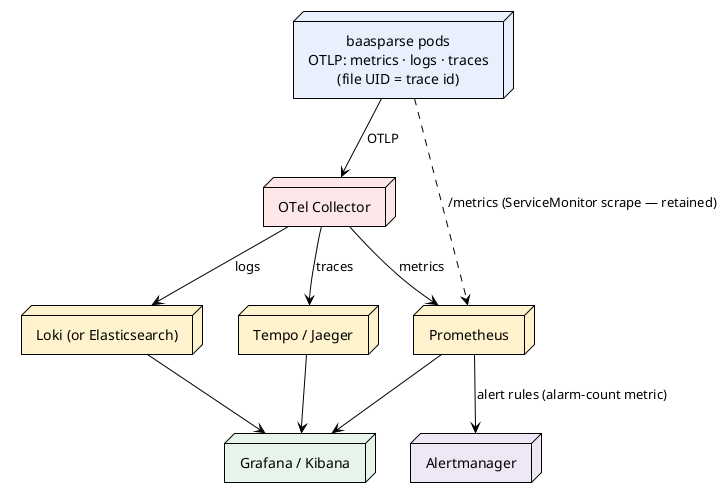

# 12 — Observability & Operations

> Part of the [[00-index|baasparse TS]]. Previous: [[11-ha-clustering-recovery]] · Next: [[13-security-compliance]]

This section specifies how baasparse is **operated and observed**: control operations,
the Prometheus metrics catalog, health endpoints, feed-liveness monitoring, the alarm
subsystem (lifecycle, email, signed callbacks, escalation), state-aware alert
suppression, discard/suspense anomaly alerting, catch-up operations, clock-skew
monitoring, structured logging, and the queryable cluster-wide operational state. It
realises BRS §6.15 (`BR-OPS-*`) and §7.5 (`BR-NFR-040/041/042`). Registry tables used:
`AL_ALARM`, `AN_ALARM_NOTIFICATION`, `SJ_SCHEDULED_JOB`, `INS_INSTANCE`, and
`OS_OPERATIONAL_STATE` (registered in [[02-conventions]] §2.2; see §12.12).

**Cloud-native telemetry pivot (TS 16 §16.8; see §12.14).** In the Kubernetes/S3
topology the engine emits **OpenTelemetry** — OTLP **metrics, logs and traces** — routed
by an **OTel Collector** to Prometheus (metrics), Loki or Elasticsearch (logs) and
Tempo/Jaeger (traces); the **file UID (correlation id) becomes the trace correlation
key**, structured logs go to **stdout JSON** collected by the platform (so **log viewing
is delegated to Grafana/Kibana** — there is no in-app log viewer), and **alert routing is
delegated to Alertmanager** while the engine keeps the `AL_ALARM` lifecycle as
system-of-record plus the alarm-count metric. The Prometheus `/metrics` endpoint
(ServiceMonitor scrape), the metric catalog (§12.2) and the DB-first alarm/operational
model below are **all preserved** — this is an emission/routing pivot, not a redesign.

---

## 12.1 Control operations — start / stop / pause / resume

`BR-OPS-001`. Control actions apply **per source or per pipeline/stream** (and
cluster-wide), issued from the GUI or `POST /api/v1/sources/{id}/control`
(RBAC-gated, audited; route per the canonical map, [[10-management-plane]] §10.4.2).

### Semantics

| Action | Effect |
|---|---|
| **pause** | No new claims for the scope; in-flight files run to completion; fetch for the source pauses (`BR-RMT-013(a)`) |
| **stop** | No new claims **and** in-flight files drain to their next checkpoint and are released (`FC_STATUS='RELEASED'`, [[11-ha-clustering-recovery]] §11.9) — the scope goes fully quiescent. **Stop sticks**: the adoption sweep checks `OS_OPERATIONAL_STATE` intake-liveness before adopting expired/released claims ([[11-ha-clustering-recovery]] §11.2 Path B), so a stopped scope's released claims are not silently picked up by another instance |
| **resume / start** | Clear the declared state; claiming and fetch resume; open collation windows whose dues were suppressed **re-arm with a fresh grace period** — the OS clear and the re-arm are one transaction (§12.1 stall accounting below) |

### Propagation & convergence

A control action writes a row to `OS_OPERATIONAL_STATE` (§12.12) —
kind (`PAUSE`/`STOP`), scope, who, why, started-on — then issues PostgreSQL
`NOTIFY baasparse_ops`. Every instance holds a `LISTEN` on that channel (the same
mechanism as config hot-reload, `BR-CFG-007`) **plus a poll fallback** every
`ops.poll_interval` (default 15 s), so convergence is bounded even if a notification
is missed. Because the state is a **persisted row, not an RPC**, an instance that was
down or degraded during the action converges the moment it reads the table — all
instances always agree with the database, never with each other.

Knock-on effects of a declared stall are specified where they act, and keyed off the
same `OS` rows:

- **Fetch pauses** with intake (`BR-RMT-013`) — the fetcher checks active `OS` rows
  for its source before each poll ([[04-acquisition-collection-archiving]]).
- **Grace-timeout stall accounting** (`BR-COR-007`) is **suppress-and-re-arm, never
  interval subtraction**: while an active `OS` row covers a window's scope, the
  window sweeper's due-probe simply **suppresses** the window's due evaluation (the
  window stays `OPEN`; no elapsed-time arithmetic is performed); when the stall ends,
  the affected open windows are **re-armed with a fresh grace period in the same
  transaction as the `OS` clear** (or the re-arm commits first), so no window can
  fire on stall-inflated elapsed time and none is stranded un-armed. The
  due-suppression probe covers **SOURCE-, PIPELINE- and CLUSTER-scoped** `OS` rows
  (mechanism detail in [[06-pipeline-stages]]). The `OS` table is thus the **single
  system of record for "intake is deliberately stalled"**, feeding control, fetch,
  windowing, and alert suppression (§12.6) identically.
- Engine-declared states use the same table: overflow *pause-intake*
  (`BR-DST-017(a)` — declared as **SOURCE-scoped** `OS` rows for every source feeding
  the bounded destination), fetch staging-quota pause (`BR-RMT-013(b)`),
  reference-data readiness hold (`BR-ENR-006`), and fail-closed (`BR-NFR-019` —
  **CLUSTER scope**, journaled on reconnect, since it cannot be written during the
  outage, [[11-ha-clustering-recovery]] §11.7).

## 12.2 Metrics catalog

`BR-OPS-002/009/013/015/016`, `BR-NFR-040`. Exposed on `GET /metrics`
(`prometheus/client_golang`) per instance — scraped by a **ServiceMonitor** (Prometheus
Operator) in K8s and/or exported over **OTLP** to the OTel Collector (§12.14), the
endpoint and this catalog unchanged by the telemetry pivot; cluster totals are
aggregation in Prometheus. Conventions: `baasparse_` prefix, base units (seconds/bytes),
`_total` counters. The `instance` label is added by the scraper (target label) on-prem; in the
cloud-native topology it is a **per-instance label** carrying the pod name (Downward API,
TS 16 §16.5), so per-pod isolation and cluster-wide aggregation both hold under a
churning multi-replica Deployment (§12.14). **Label cardinality is bounded by configuration** (sources,
pipelines, destinations, stages) — never by record values.

| Metric | Type | Labels | Meaning |
|---|---|---|---|
| `baasparse_records_total` | counter | `source,pipeline,stage,outcome` | Records per stage; `rate()` = records/sec per source/stage (`BR-OPS-002`). Outcomes: `passed,suspended,discarded,duplicate` |
| `baasparse_files_total` | counter | `source,outcome` | Files completed / rejected / quarantined |
| `baasparse_file_processing_duration_seconds` | histogram | `source` | Claim → done per file |
| `baasparse_file_start_delay_seconds` | histogram | `source,catchup` | File-available → processing-start latency (`BR-NFR-008`); `catchup="true"` series is reported separately (§12.8) |
| `baasparse_suspense_open` | gauge | `source,stage` | Open suspense entries (`BR-OPS-002/004`) |
| `baasparse_suspense_total` | counter | `source,stage,reason_code` | Suspense inflow by reason |
| `baasparse_suspense_pinned_bytes` | gauge | `source` | Disk bytes pinned by files with open suspense (`BR-ERR-008`, `BR-OPS-015`) |
| `baasparse_input_backlog_files` / `_bytes` | gauge | `source` | Detected-but-unclaimed backlog depth (`BR-OPS-013`) |
| `baasparse_collation_windows_open` | gauge | `pipeline` | Open windows (`BR-REC-007`) |
| `baasparse_collation_windows_overdue` | gauge | `pipeline` | Windows past their completion bound (stuck-window alert feed) |
| `baasparse_spool_bytes` / `_files` | gauge | `destination` | Store-and-forward spool depth (`BR-DST-017`, `BR-OPS-015`) |
| `baasparse_spool_oldest_age_seconds` | gauge | `destination` | Age of oldest undelivered output |
| `baasparse_deliveries_total` | counter | `destination,state` | Delivery outcomes (`written,delivered,diverted,failed,resent`) |
| `baasparse_dir_usage_bytes` / `_files` | gauge | `area,source` | Directory usage; `area ∈ input, in_progress, done, output, divert_holding, archive_staging` (`BR-OPS-015`) |
| `baasparse_fetch_staging_used_ratio` | gauge | `source` | Fetched-not-yet-processed staging vs quota (`BR-RMT-013(b)`) |
| `baasparse_fetch_files_total` | counter | `source,outcome` | Remote fetch outcomes |
| `baasparse_discards_total` | counter | `source,rule,reason` | Screening discards per rule and reason code (`BR-VAL-003`, feeds §12.7; label set shared with [[06-pipeline-stages]]) |
| `baasparse_duplicates_total` | counter | `source` | Dedup drops |
| `baasparse_pg_replication_lag_bytes` / `_seconds` | gauge | `standby` | Streaming-replication lag per standby incl. DR (`BR-OPS-016`) |
| `baasparse_state_store_up` | gauge | — | 1/0; served from memory even when 0 (`BR-NFR-019`) |
| `baasparse_alarms` | gauge | `severity,state` | Alarm counts by severity/state (`BR-OPS-009`) |
| `baasparse_alarms_raised_total` | counter | `type,severity` | Alarm inflow |
| `baasparse_alarm_emails_total` | counter | `outcome` | Email sends (`sent,failed`) — failure also alarms (§12.5) |
| `baasparse_catchup_active` | gauge | `source` | 1 while a declared catch-up is active (§12.8) |
| `baasparse_clock_skew_seconds` | gauge | — | This instance's clock vs DB time (§12.9) |
| `baasparse_instance_heartbeat_age_seconds` | gauge | `peer` | Cluster view: peers' heartbeat age (`BR-HA-009`) |
| `baasparse_memory_budget_bytes` / `baasparse_memory_used_bytes` | gauge | — | Configured budget vs in-use ([[14-performance-sizing]]) |
| `go_*` / `process_*` | — | — | Standard Go collectors: heap, GC pauses, goroutines, FDs |

Throughput collapse, rising suspense, disk pressure etc. are **alerted by the engine
itself** (§12.5–§12.7) — the metrics additionally let external monitoring (DEP-1d)
alert independently, per `BR-OPS-008`'s "visibility never depends on one channel"
principle.

## 12.3 Health endpoints

`BR-OPS-009`. Served per instance on the management listener (and answered without
touching the data plane, `BR-NFR-033`):

- **`GET /healthz` — liveness.** "The process is alive and not wedged": the HTTP
  loop answers and internal supervisors are responsive. **Deliberately ignores the
  database** — a DB outage must not make the platform kill/restart instances that are
  correctly failing closed. Non-200 means "restart me".
- **`GET /readyz` — readiness.** "This instance can currently do useful work and take
  management traffic": migrations verified, instance registered, active config
  loaded, data plane started, state store reachable. Returns `503` with a JSON body
  naming the gate when not ready — including the **fail-closed degraded state**
  (`{"status":"degraded","reason":"state-store-unreachable",…}`, from in-memory
  state, `BR-NFR-019`) and **draining** during shutdown/upgrade. The platform LB
  (`ASM-19`) health-checks this endpoint, so degraded/draining instances drop out of
  management rotation automatically ([[11-ha-clustering-recovery]] §11.10).

## 12.4 Feed-liveness / expected-arrival monitoring

`BR-OPS-007`. Per source, an **arrival expectation** in the source configuration
(two forms, combinable):

- `max_gap`: maximum time between file arrivals (e.g. `PT30M`), optionally restricted
  to active hours;
- `calendar`: cron-style expected windows plus tolerance (e.g. "daily by 06:15 +45m")
  for batch-cadenced feeds.

Evaluation runs as the `SJ_SCHEDULED_JOB` **`feed-liveness`** job every minute — on
the **nominated instance in v1**, with the lease columns already present for the v2
dynamic lease (`BR-HA-010` seam, [[11-ha-clustering-recovery]] §11.2 — **pulled into v1
in the cloud/K8s topology**, TS 16 §16.7, so any replica may hold the lease and the job
fails over automatically). It compares
each source's last collection timestamp (max `PF` collected-on, cached) against the
expectation; a missed window raises a **`FEED_STALL`** alarm (§12.5) — deduplicated,
so a feed dead for hours is one escalating alarm, not sixty. Duplicate evaluation
under mis-nomination is harmless: alarm dedup absorbs it (`BR-HA-010` backstop).

Feed-liveness is suppressed for sources under a declared stall or catch-up (§12.6) —
a deliberately paused feed is not a dead feed.

**Sequence-gap tie (`BR-COL-007`):** where a feed carries file sequence numbers, gaps
are detected **inline at collection** and raise a `SEQUENCE_GAP` alarm — the
file-level completeness control that liveness monitoring only approximates for
unsequenced feeds. Expected-vs-received reconciliation (`BR-REC-003`) complements
both ([[08-suspense-reconciliation-replay]]).

## 12.5 The alarm subsystem — `AL_ALARM`, `AN_ALARM_NOTIFICATION`

`BR-OPS-008/011`.

### Lifecycle

```plantuml
@startuml alarm-lifecycle
!theme plain
skinparam state { BackgroundColor #E8F0FE BorderColor #4472C4 }

[*] --> Open : condition detected\n(raise or re-raise → occurrences++)
Open --> Open : unacknowledged past threshold →\n**escalate** (re-notify / alternate\nrecipient / raise severity),\nrepeating per policy
Open --> Acknowledged : operator ack\n(GUI/API/email callback)
Acknowledged --> Resolved : operator resolve, or\ncondition-clear auto-resolve\n(where the type supports it)
Open --> Resolved : direct resolve (audited)
state Suppressed #FFF3CD
[*] --> Suppressed : condition detected while a\ndeclared state covers it (§12.6)
Suppressed --> Open : declared state cleared,\ncondition persists
Suppressed --> Resolved : declared state cleared,\ncondition gone
Resolved --> [*]
@enduml
```

Key columns ([[03-database-design]] §3.5.15): `AL_TYPE`, `AL_SEVERITY`
(`INFO|WARNING|MAJOR|CRITICAL`), `AL_STATUS` (`OPEN|ACKNOWLEDGED|SUPPRESSED|RESOLVED`),
`AL_DEDUP_KEY` (type + scope digest, e.g. `FEED_STALL:source:msc-01`), `AL_RAISED_ON`,
`AL_LAST_SEEN_ON`, `AL_OCCURRENCES`, `AL_ESCALATION_LEVEL`, `AL_CONTEXT` (JSONB),
`AL_U_UID_ACKNOWLEDGED`/`AL_U_UID_RESOLVED` + timestamps,
`AL_AL_UID_SUPPRESSED_BY` (self-FK to the declared-state alarm, §12.6). Every
transition is audited (`BR-AUD-001`).

### Deduplication of repeated conditions

The partial unique index `UX_AL_DEDUP_OPEN` on `AL_DEDUP_KEY` over non-resolved rows
makes raising an upsert: an already-open alarm for the same condition gets
`AL_OCCURRENCES + 1` and a fresh `AL_LAST_SEEN_ON` — one alarm per ongoing
condition, however many instances or evaluations observe it (this is also the
`BR-HA-010` v1 backstop for duplicate job runs).

### Alarm types (enumerated)

| `AL_TYPE` | Default severity | Raised by |
|---|---|---|
| `FEED_STALL` | major | Feed-liveness job (§12.4) |
| `SEQUENCE_GAP` | major | Collection, inline (`BR-COL-007`) |
| `RISING_SUSPENSE` | warning→major | Suspense thresholds (§12.7) |
| `DISCARD_ANOMALY` | major | Screening thresholds (§12.7, `BR-OPS-014`) |
| `RECON_MISMATCH` | critical | Trailer/count reconciliation failure (`BR-REC-006`) |
| `DESTINATION_FAILURE` | major→critical | Store-and-forward retry exhaustion window (`BR-DST-010`) |
| `TRANSFER_FAILURE` | major | Fetch/archive permanent failure (`BR-RMT-008`, `BR-ARC-008`) incl. credential-rotation cutover failure (`BR-RMT-011`) |
| `THROUGHPUT_COLLAPSE` | major | Per-source throughput vs trailing baseline (`BR-OPS-004`) |
| `INSTANCE_DOWN` | critical | The **`instance-liveness`** `SJ_SCHEDULED_JOB` (nominated v1 / lease v2 — same pattern as §12.4), scanning `INS_HEARTBEAT_ON` each minute ([[11-ha-clustering-recovery]] §11.1); any instance's cluster-view read may additionally raise it opportunistically — alarm dedup makes double-raising safe |
| `POISON_QUARANTINE` | critical | File quarantined (`BR-COL-017`) |
| `STUCK_WINDOW` | warning | Windows past completion bound (`BR-REC-007`) |
| `DISK_PRESSURE` | warning→critical | Directory/spool/holding-area thresholds (`BR-OPS-015`), escalating toward the bound (`BR-DST-017`) |
| `REPLICATION_LAG` | major | Standby/DR lag over threshold (`BR-OPS-016`) |
| `STAGING_QUOTA` | major | Fetch staging bound reached (`BR-RMT-013(b)`) |
| `EMAIL_SEND_FAILURE` | major | The alerter itself (below) |
| `CLOCK_SKEW` | warning | Skew monitor (§12.9) |
| `DECLARED_STATE` | info→warning | Declared operational states (§12.6) |
| `STATE_STORE_OUTAGE` | critical | Journaled on reconnect after fail-closed (`BR-NFR-019`) |
| `DB_FAILOVER` | major | Timeline-change detection ([[11-ha-clustering-recovery]] §11.6) |
| `SCHEMA_MISMATCH` | major | RDBMS target mapping failure at runtime (`BR-DST-014`) |
| `MISSING_ON_DISK` | critical | DB↔disk reconciliation divergence (`BR-NFR-017`) |

### Severity & routing configuration

Alerting configuration (part of the config domain, draft→publish like everything
else, [[09-configuration-management]]) maps `(type, severity, scope pattern)` →
recipient list(s), and defines per-severity **escalation policies**: ack deadline,
escalation steps (re-notify same list → notify alternate list → raise severity), and
repeat interval. Severity per type is overridable per deployment.

### Escalation of unacknowledged alarms

The `SJ_SCHEDULED_JOB` **`alarm-escalator`** (nominated instance v1 on-prem; **lease-held
v1 in the cloud/K8s topology**, `BR-HA-010`, TS 16 §16.7) scans
open alarms past their ack deadline and executes the next policy step —
re-notify, alternate recipient/list, and/or severity raise — bumping
`AL_ESCALATION_LEVEL` and repeating per policy **until acknowledged**
(`BR-OPS-011`): an unwatched mailbox cannot silently absorb a critical alarm. Every
step is a new `AN_ALARM_NOTIFICATION` row and an audit event.

### Email sender & failure-to-send

Emails go through the deployment SMTP relay (`DEP-1c`; credentials via the secrets
mechanism, `BR-NFR-054`). Sends are recorded in `AN_ALARM_NOTIFICATION`
(`AN_AL_UID`, `AN_CHANNEL='EMAIL'` — the channel column is the v2 seam for
webhook/SNMP/chat, BRS §10.3 — `AN_RECIPIENT`, `AN_SENT_ON`, `AN_STATUS`,
`AN_ESCALATION_LEVEL`, token fields below). A failed send is retried with backoff;
persistent failure raises **`EMAIL_SEND_FAILURE`** — visible via GUI/API and the
`baasparse_alarms` metric even though email is down (`BR-OPS-008`). During a
state-store outage the in-memory best-effort path applies
([[11-ha-clustering-recovery]] §11.7).

### The signed ack/resolve callback link (R17)

Each notification email carries action links,
`https://<mgmt-entry>/alarm/callback?token=…`, engineered against forgery, replay,
and mail-scanner prefetch:

- **Token**: `base64url(payload) . HMAC-SHA256(payload, callback_key)`; payload =
  `{an_uid, al_uid, action (ack|resolve), expires_on}`. The `callback_key` comes from
  the secrets mechanism; only the **token hash** is stored (`AN_TOKEN_HASH`), with
  `AN_TOKEN_EXPIRES_ON` (default 72 h) and `AN_TOKEN_USED_ON`.
- **Single-use & idempotent**: consuming the token sets `AN_TOKEN_USED_ON`
  transactionally; a second use is rejected — but acknowledging an
  already-acknowledged alarm through a *different* valid token succeeds as a no-op,
  so races between GUI and email are harmless.
- **Prefetch-safe**: `GET` renders a confirmation page and changes **nothing**; the
  state change is the authenticated `POST` behind the confirm button. Mail scanners
  only GET.
- **RBAC-checked**: the confirmation page requires an authenticated session
  (login redirect if absent); the POST enforces the alarm-ack/resolve permission —
  the token *identifies* the alarm action, it does not *authorise* it.
- **Audited**: token issue, use, expiry-rejection, and permission-denial are audit
  events attributable to the acting user.

### Visibility independent of email

Alarms are rows first: the GUI alarm console and `GET /api/v1/alarms` (filter by
state/severity/type/scope/time) read `AL_ALARM` directly, and
`baasparse_alarms{severity,state}` feeds external monitoring — a mail-relay outage
hides nothing (`BR-OPS-008`).

### Alert routing delegation — Alertmanager (cloud-native topology)

`BR-OPS-008` (v1 alerting model per TS 16 §16.8/§16.10). In the Kubernetes topology the
engine **does not fan notifications out to arbitrary channels itself**: the
`AL_ALARM`/`AN_ALARM_NOTIFICATION` lifecycle above remains the **single system of record**
(raise, dedup, ack, escalate, suppress, audit — all DB rows) and is exposed as the
`baasparse_alarms{severity,state}` metric. **Alertmanager** consumes that metric via
Prometheus alert rules and owns **notification routing** — email, Slack, PagerDuty,
webhook — with its own grouping, silencing and on-call schedules. This delivers the base
spec's v2 "alerting beyond email" **without building channels into the engine**: in-engine
channels beyond the direct SMTP relay (above) remain out of scope, and the `AN_CHANNEL`
seam is satisfied externally rather than in v1. On-prem deployments keep the engine's own
email sender and `alarm-escalator` job as the primary path; the two models coexist because
both key off the same DB alarm rows, so alarm visibility never depends on any one channel.

## 12.6 State-aware alert suppression

`BR-OPS-017`. A declared state must not storm the alarms it necessarily causes.

**Mechanism.** The alarm-raise path consults active `OS_OPERATIONAL_STATE` rows
(§12.1). If the condition's type is in the suppression matrix for an active state
covering its scope, the alarm is recorded with `AL_STATUS='SUPPRESSED'` and
`AL_AL_UID_SUPPRESSED_BY` pointing at the **declared-state alarm** — the single
`DECLARED_STATE` alarm (cause, start time, scope) raised when the state was declared,
which follows the normal lifecycle and escalation (§12.5). Suppressed conditions are
**recorded, not discarded**: queryable in the GUI/API alongside open alarms, so a
deliberate pause cannot mask a genuinely independent failure. When the state clears,
suppressed alarms are re-evaluated: condition persists → reopened as `open`
(fresh notification); condition gone → auto-resolved.

**Suppression matrix** (per affected scope only):

| Declared state (`OS_KIND`) | Suppressed | Downgraded |
|---|---|---|
| `PAUSE` / `STOP` (operator, `BR-OPS-001`) | `FEED_STALL` | — |
| `PAUSE_INTAKE_OVERFLOW` (`BR-DST-017(a)`, SOURCE-scoped rows per feeding source) | `FEED_STALL` | `STUCK_WINDOW` → info (window dues suppressed by design, `BR-COR-007` — §12.1) |
| `FETCH_PAUSE` / `STAGING_QUOTA` (`BR-RMT-013`) | `FEED_STALL` | — |
| `READINESS_HOLD` (`BR-ENR-006`) | `FEED_STALL`, `RISING_SUSPENSE` (the on-miss flood the hold exists to prevent) | — |
| `FAIL_CLOSED` (`BR-NFR-019`, CLUSTER scope) | `FEED_STALL`, `THROUGHPUT_COLLAPSE` (all sources) — applied **retroactively on reconnect**: the `OS` row is journaled with its actual in-memory start/end ([[11-ha-clustering-recovery]] §11.7), and evaluations whose condition window falls inside the journaled interval are recorded `SUPPRESSED` against it (nothing can be written *during* the outage; in-memory visibility per §11.7 covers it live) | — (`STATE_STORE_OUTAGE` is the alarm) |
| `CATCHUP` (`BR-OPS-013`) | `THROUGHPUT_COLLAPSE` (inverted meaning during drain) | `STUCK_WINDOW` → info (hold-until-drain, `BR-COR-007`); latency reported separately (§12.8) |

Everything **not** in the matrix fires normally during any state — `DISK_PRESSURE`,
`INSTANCE_DOWN`, `REPLICATION_LAG`, `DESTINATION_FAILURE` are never suppressed.

## 12.7 Anomaly & threshold alerting: discards and suspense

- **Discard anomaly (`BR-OPS-014`).** Discard is the one terminal outcome that removes
  records while reconciliation still balances, so it gets dedicated alerting: per
  screening rule and per stream, a configurable **absolute threshold** (discards >
  X% of the stream's records over a sliding window) and a **step-change detector**
  (rate vs an exponentially-weighted baseline of the last N files). Evaluated at file
  completion from the reconciliation totals; breach → `DISCARD_ANOMALY` with the rule,
  observed vs expected rates in `AL_CONTEXT`. Per-rule discard counts and reasons
  remain visible to RA regardless (`BR-VAL-003`, `BR-REC-002`).
- **Rising suspense (`BR-OPS-004`).** Per source: open-count ceiling, inflow-rate
  threshold, and suspense-pinned-bytes threshold (`BR-ERR-008`) → `RISING_SUSPENSE`,
  escalating severity as thresholds stack. Complements discard alerting — the two
  cover opposite failure modes (visible failure vs silent removal).

## 12.8 Catch-up / backfill operations

`BR-OPS-013`. A catch-up is **declared**, never inferred:
`POST /api/v1/sources/{id}/catchup` (or GUI; route + permission `control.operate` per
the canonical map, [[10-management-plane]] §10.4.2) creates an `OS` row
`OS_KIND='CATCHUP'` (RBAC-gated, audited) with an optional auto-clear policy.

Effects while active:

- **Relaxed latency reporting**: `baasparse_file_start_delay_seconds` for the scope is
  emitted with `catchup="true"` — dashboards/SLA alerts key on the normal series, so a
  backlog drain is not an SLA breach (`BR-NFR-008`); processing itself is unchanged
  (same claim/decode/collation/reconciliation paths — no separate code path).
- **Backlog/drain visibility**: `baasparse_input_backlog_files/_bytes` plus the drain
  view (GUI/API): files remaining, drain rate, ETA.
- **Windowing switches to backfill mode** for the scope — event-intrinsic triggers
  where the feed has them, else hold-until-drain-then-flush; mode switch and flushes
  audited (`BR-COR-007` — mechanism in [[06-pipeline-stages]], driven by the same
  `OS` row and the backlog-drained signal).
- **Suppression** per §12.6 (one `DECLARED_STATE` alarm carries the operation).

Clearing: manual, or auto when the scope's backlog stays drained for the configured
period; the clear is audited and re-evaluates suppressed alarms.

## 12.9 Clock-skew monitoring

`BR-OPS-012`, `ASM-3b`. Every instance, each minute, measures skew against the one
clock that matters — the database's (the lease/expiry time authority,
[[11-ha-clustering-recovery]] §11.2): record local `t0`, `SELECT now()`, record
`t1`; `skew = db_now − (t0+t1)/2` (round-trip-halved). Exposed as
`baasparse_clock_skew_seconds`; `|skew|` over `clock.skew_warn` (default 500 ms)
raises `CLOCK_SKEW` (warning; major at 2 s). Skew never breaks claim correctness
(DB-clock leases) — the alert protects the things that *do* care: event-time
windowing, audit timestamp coherence, and renewal-margin erosion.

## 12.10 Structured logging

`BR-NFR-041`, `BR-OPS-005/010`.

### slog JSON schema

All logs are `log/slog` JSON, one object per line. Canonical fields (present where
applicable — correlation identifiers are **the same ones the audit trail uses**
([[02-conventions]] §2.5), so a log line, its audit events, and its metrics join on
`file_uid`/`window_uid`/`alarm_uid`):

| Field | Content |
|---|---|
| `ts`, `level`, `msg` | RFC 3339 UTC; `DEBUG/INFO/WARN/ERROR`; human summary |
| `instance` | Instance ID |
| `module` | Modulith module (`collector`, `decoder`, `distribute`, …) |
| `file_uid` | Processed-file UID for file-scoped events |
| `source`, `pipeline`, `pipeline_version` | Config identity in effect |
| `window_uid` | Collation window for collation events |
| `alarm_uid` | Alarm lifecycle events |
| `destination` | Delivery events |
| `reason_code` | Machine reason on suspense/reject paths ([[02-conventions]] §2.3) |
| `attempt` | Processing attempt for claim/takeover events |
| `user` | Acting user for management-plane events (never credentials/tokens) |
| `err` | Wrapped error chain text |
| `trace_id`, `span_id` | OTel correlation (cloud-native, §12.14): `trace_id` carries the `file_uid`, so a log line joins its distributed trace and its metrics on the same file (`BR-NFR-041`) |

Sensitive values (subscriber identifiers, secrets) never appear — masking rules per
`BR-NFR-051` apply to log emission ([[13-security-compliance]]).

### Rotation & retention

**Decision: in-process size/age rotation (lumberjack-style), not host logrotate.**
Each instance writes to `log.file` and rotates itself on `log.max_size_mb` (default
100), pruning by `log.max_age_days` / `log.max_backups`, optional gzip of rotated
files. Justification: the engine is a **single static binary** whose disk-growth
bound must hold on every host by its **own** configuration (`BR-OPS-010`) — not by a
hand-maintained per-host logrotate entry that drifts or is forgotten; there is no
copytruncate data-loss window; and config lives with the rest of engine config.
Deployments preferring journald/container capture set `log.output=stdout`, which
delegates rotation to the platform — both modes satisfy `BR-OPS-010`; the file mode
is the default for bare-Linux installs.

### Log collection & viewing (cloud-native topology)

`BR-OPS-005/010`, `BR-NFR-041` (per TS 16 §16.8, D5). In the Kubernetes topology logs are
written as **JSON to stdout** (`--log-format=json --log-output=stdout`, the container
default) and **collected by the platform** — a node agent (Vector / Fluent Bit) or the
OTel Collector's filelog receiver — and shipped to **Loki (recommended, Grafana-native) or
Elasticsearch**. **Log *viewing* is delegated to Grafana / Kibana**: there is **no in-app
log viewer**. The base spec's in-app `/logs` page and file reader are **superseded** by
this telemetry stack — the engine's job is emission (correct, masked, correlated JSON), not
presentation; the DB-backed alarm console and operational-state views (§12.5/§12.11) stay
in-app because they are operational state, not log presentation. The in-process file
rotation above (`BR-OPS-010`) remains the default for bare-Linux installs. Because
`file_uid` is emitted on every line and promoted to the **OTel trace id** (§12.14), a log
query in Grafana/Kibana pivots directly to the file's distributed trace and its metrics.

## 12.11 Queryable operational state

`BR-NFR-042`, `BR-HA-009`. All operational state is **rows in shared PostgreSQL**, so
any instance answers for the whole cluster (`BR-HA-012`) — the GUI dashboard and REST
API are views over the same service layer (`BR-NFR-034`):

| View | Backing | Content |
|---|---|---|
| `GET /api/v1/cluster` | `INS_INSTANCE` | Instances: status, heartbeat age, version, host, per-instance throughput |
| `GET /api/v1/sources/{id}/state` | `OS`, `PF`, `FC` | Run-state (running/paused/stopped + declared states), backlog depth, in-flight files, last arrival, liveness expectation status |
| `GET /api/v1/pipelines/{id}/state` | `CW`, `RS` | Open/overdue windows, in-flight ("open") record counts (`BR-REC-007`) |
| `GET /api/v1/destinations/{id}/state` | `DL`, spool scan | Spool depth/age, delivery states, divert holding usage |
| `GET /api/v1/alarms` (+ GUI console) | `AL`, `AN` | Alarms incl. suppressed; notification/escalation history |
| `GET /api/v1/jobs` | `SJ` | Scheduled jobs: nominated instance, last run, outcome, (v2) lease holder |

Reconciliation views are specified in [[08-suspense-reconciliation-replay]]; the
**canonical route map** (these routes included) and RBAC live in
[[10-management-plane]] §10.4.2.

## 12.12 Registry additions

This section's addition was merged into the [[02-conventions]] §2.2 registry, which is
**final**: `OS_OPERATIONAL_STATE` is registered there (Operational domain) as the
**single** system of record for declared operational states — operator pause/stop,
overflow pause-intake, fetch pause/staging quota, readiness hold, fail-closed
(journaled), catch-up (`BR-OPS-001/013/017`); the two parallel-drafted source-state
tables were merged into it (consolidation decision 1).

Key columns: `OS_KIND` (TEXT + CHECK per §12.1/§12.6), `OS_SCOPE`, scope FKs
(`OS_SRC_UID`, `OS_PL_UID`, `OS_DS_UID`, `OS_INS_UID`, each nullable), `OS_STATUS`
(`ACTIVE|CLEARED`), `OS_STARTED_ON`, `OS_CLEARED_ON`, `OS_REASON`,
`OS_U_UID_DECLARED`, `OS_AL_UID` (the `DECLARED_STATE` alarm link); standard UID +
audit columns. Full DDL in [[03-database-design]] §3.5.22.

## 12.13 BRS coverage

| Requirement | Where satisfied |
|---|---|
| `BR-OPS-001` start/stop/pause/resume per source/stream | §12.1 |
| `BR-OPS-002` health & throughput signals | §12.2, §12.3 |
| `BR-OPS-003` safe resume after crash | [[11-ha-clustering-recovery]] §11.3/§11.5 (referenced; ops-visible via §12.2/§12.11) |
| `BR-OPS-004` alerts: sequence gaps, rising suspense, destination failure, throughput collapse | §12.5 (types), §12.7 |
| `BR-OPS-005` structured logs & metrics for external monitoring | §12.2, §12.10; stdout JSON + OTLP via OTel Collector §12.14 |
| `BR-OPS-006` rate limiting per source *(C)* | Destination-side limits in [[07-distribution-delivery]]; source claim concurrency `BR-COL-011` in [[04-acquisition-collection-archiving]] |
| `BR-OPS-007` feed-liveness / expected-arrival monitoring | §12.4 |
| `BR-OPS-008` alerting on operational issues; email; visibility independent of email; send-failure alarmed; (cloud) Alertmanager routing | §12.5 (incl. Alertmanager routing delegation), §12.14 |
| `BR-OPS-009` health endpoints + Prometheus incl. alarm-count metric | §12.2, §12.3; OTLP emission §12.14 |
| `BR-OPS-010` log rotation/retention configurable | §12.10 |
| `BR-OPS-011` alarm lifecycle, secured callback, escalation | §12.5 |
| `BR-OPS-012` clock-skew monitoring | §12.9 |
| `BR-OPS-013` catch-up/backfill handling & visibility | §12.8 |
| `BR-OPS-014` discard anomaly/threshold alerts | §12.7 |
| `BR-OPS-015` disk-pressure metrics (spool, suspense-pinned, directories, staging) | §12.2 |
| `BR-OPS-016` replication-lag metric + alert | §12.2, §12.5 (type `REPLICATION_LAG`); mechanism [[11-ha-clustering-recovery]] §11.6 |
| `BR-OPS-017` state-aware alert suppression | §12.6 (with §12.1 `OS` state) |
| `BR-NFR-040` Prometheus metrics + health endpoints | §12.2, §12.3; OTel/OTLP emission §12.14 |
| `BR-NFR-041` structured logs correlated with audit identifiers | §12.10; file UID → trace id §12.14 |
| `BR-NFR-042` queryable operational state | §12.11 |
| `BR-HA-009` cluster-wide operational view | §12.11 |
| `BR-HA-010` scheduled-job lease (cloud) — feed-liveness, escalator, singleton jobs | §12.4, §12.5 (v1 in cloud/K8s topology, TS 16 §16.7); mechanism [[11-ha-clustering-recovery]] §11.2 |

## 12.14 Telemetry emission — OpenTelemetry (cloud-native topology)

`BR-OPS-005/008/009`, `BR-NFR-040/041` (cloud-native track; TS 16 §16.8). On-prem,
§12.2–§12.11 stand as written (Prometheus scrape, in-engine email, in-process log files).
In the Kubernetes/S3 topology the engine additionally **emits OpenTelemetry** and an
**OTel Collector** routes each signal to a purpose-built backend. **This is an
emission/routing pivot — every metric, alarm and correlation identifier defined above is
preserved.**



**Signals:**

| Signal | Emission | Collector route | Explored in |
|---|---|---|---|
| **Metrics** | the full §12.2 catalog via `prometheus/client_golang`, **per-instance labelled** (pod name, Downward API); `/metrics` endpoint retained and/or OTLP-exported | Prometheus (ServiceMonitor scrape or OTLP) | Grafana |
| **Logs** | structured JSON to **stdout** (§12.10), one object per line, `file_uid`-correlated and masked (`BR-NFR-051`) | Loki (recommended) or Elasticsearch | Grafana / Kibana |
| **Traces** | OTel spans across decode → validate → transform → distribute, and across pods on takeover | Tempo / Jaeger | Grafana |

- **File UID is the trace correlation key.** The processed-file UID (`file_uid`, the same
  id the audit trail, logs and metrics already carry — §12.10, [[02-conventions]] §2.5) is
  **promoted to the OTel trace id**, so one file's journey through the pipeline — across
  every pod that claimed, streamed, or took over the file — is a **single distributed
  trace**, and any log line or metric series pivots to that trace on the shared id.
- **Per-instance labels.** Every series and span carries the instance/pod identity (§12.2),
  so cross-instance aggregation and per-pod isolation both work under a churning
  multi-replica `Deployment` (TS 16 §16.5).
- **Alert routing is delegated to Alertmanager** (§12.5): the engine keeps the `AL_ALARM`
  lifecycle as **system-of-record** and exposes `baasparse_alarms{severity,state}`;
  Alertmanager consumes it via Prometheus alert rules and owns notification routing
  (email/Slack/PagerDuty/webhook). In-engine channels beyond the direct SMTP relay remain
  out of scope (`BR-OPS-008`).
- **No in-app log viewer.** Log *viewing* is a Grafana/Kibana concern; the in-app `/logs`
  page is superseded (§12.10, TS 16 §16.8 D5). The DB-backed alarm console and
  operational-state views (§12.5/§12.11) remain in-app — they are operational state, not
  log presentation.
- **Grafana dashboards** ship as ConfigMaps: per-pipeline throughput, reconciliation (in vs
  out vs suspended vs open), backlog/latency, disk/object-store pressure, replication lag,
  cluster/instance health (TS 16 §16.8).
