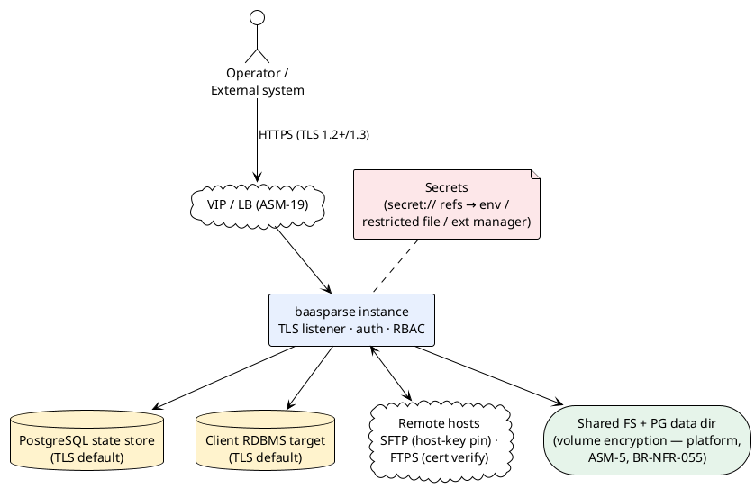

# 13 — Security & Compliance

> Part of the [[00-index|baasparse TS]]. Previous: [[12-observability-operations]] · Next: [[14-performance-sizing]]

This section specifies transport security, secrets handling, web-application security,
audit-trail integrity, PII protection, retention, and the at-rest encryption posture —
covering `BR-NFR-050..055`, `BR-AUD-*`, `BR-CMP-*`, the security slices of `BR-USR-*`, and
the in-transit/at-rest slice of `BR-STO-005` for the cloud-native object-storage backend.
Naming follows the binding standard in [[02-conventions]]; tables used here:
`AE_AUDIT_EVENT`, `AA_AUDIT_ANCHOR`, `TM_TOKEN_MAP`, `SE_SUSPENSE_ESCROW`,
`RTN_RETENTION_POLICY` (registered in [[02-conventions]] §2.2; DDL in
[[03-database-design]] §3.5.25).

## 13.1 Security posture overview

The engine is deployed **on-premises, per tenant** (`BR-NFR-062`), so the perimeter is the
operator's network — but the design does **not** rely on it. Every channel that can carry
subscriber-identifying data or credentials is encrypted by default, every management
action is authenticated/authorised/attributed (`BR-NFR-052`), and the audit trail is
tamper-evident against actors *inside* the perimeter, including actors with database
write access (§13.5). In the **cloud-native (Kubernetes) topology**
([[16-cloud-native-deployment]] §16.9, `ASM-3` cloud variant) the perimeter becomes the
cluster — ingress TLS, `NetworkPolicy` and pod hardening (§13.8.1) replace the
tenant-network boundary — but the same "do-not-rely-on-the-perimeter" stance holds unchanged.



## 13.2 Transport security

### 13.2.1 Management plane — GUI and REST API (`BR-NFR-053`)

- The HTTP listener serves **TLS only**; there is no plaintext listener (an optional
  plain-HTTP port exists solely to `301`-redirect to HTTPS, disabled by default).
- **Protocol floor:** `MinVersion = TLS 1.2`; TLS 1.3 preferred (Go negotiates 1.3
  automatically). For TLS 1.2 the cipher suites are restricted to
  ECDHE + AES-GCM / ChaCha20-Poly1305 (no CBC, no RSA key exchange).
- **Certificate configuration** is bootstrap config (`BR-NFR-061`): `tls_cert_path`,
  `tls_key_path`; an encrypted private key's passphrase is a secret reference (§13.3).
  The listener watches the cert/key files and **hot-reloads on change**
  (`tls.Config.GetCertificate`), so certificate rotation needs no restart.
- Under the platform LB (`ASM-19`, `BR-HA-012`) TLS holds **end-to-end**: either
  pass-through to the instance listener, or terminate-and-re-encrypt at the LB — the
  instance side is HTTPS in both models; the deployment records which.
- **Kubernetes / cloud-native topology** ([[16-cloud-native-deployment]] §16.9, `ASM-3`
  cloud variant): TLS is terminated at the **ingress** with a **cert-manager-issued
  certificate**. The app trusts the `X-Forwarded-Proto` header set by the trusted ingress
  to decide the session-cookie `Secure` flag (§13.4) and to build correct HTTPS redirects —
  so the external channel is HTTPS even though the ingress→pod hop may run plaintext inside
  the cluster. **Re-encrypt to pods** is offered where the platform mandates it, giving the
  same end-to-end HTTPS as the LB model above (`BR-NFR-053`). `X-Forwarded-Proto` is trusted
  only from the known ingress source, never from arbitrary clients.

### 13.2.2 State store and RDBMS load target (`BR-NFR-050`, `BR-DST-019`)

Both connection classes carry subscriber-identifying record data (the collation working
set; the loaded output rows), so both follow the same rule:

- **TLS is the default.** The state-store DSN and every `DS_DESTINATION` of kind `rdbms`
  default to `sslmode=verify-full` with a configured CA bundle (system store or
  per-connection `ca_path`). `verify-full` (not `require`) — hostname verification
  defeats MITM, not just passive capture.
- **Opt-out is explicit and audited.** Setting `tls: "disabled"` is valid only together
  with a non-empty `tls_disabled_justification` (e.g. *"loopback to co-hosted PG"*),
  is accepted only via a publish by a role holding `config.security-override`, and emits
  an `AUDIT: TLS_OPT_OUT` event **at publish and again at every engine startup** that
  loads the config — the choice stays permanently visible, per the protected-segment
  clause of `BR-NFR-050`/`BR-DST-019`.
- Client-certificate (mTLS) auth to PostgreSQL is supported via secret-referenced
  cert/key paths where the DBA mandates it.

### 13.2.3 SFTP host keys and FTPS certificates (`BR-RMT-009`)

Per `RE_REMOTE_ENDPOINT`:

- **SFTP:** the endpoint config carries one or more **pinned host public keys**
  (`hostKeyRef` → secret or inline public-key line). Verification is **strict**: an
  unknown or changed host key aborts the connection and raises an alarm (`BR-OPS-008`).
  There is no silent trust-on-first-use: the GUI offers a *fetch-and-pin* helper that
  retrieves the remote key and presents its fingerprint for an RBAC-gated, audited pin
  action — the human approves, the engine never auto-trusts.
- **FTPS:** X.509 chain verification against the system CA store or a per-endpoint
  pinned CA/leaf certificate, **with hostname verification**; TLS 1.2 floor as in
  §13.2.1. Plain FTP does not exist in the codebase (`BR-RMT-001`).
- Host-key/cert pin changes are config changes: drafted, published, audited
  (`BR-CFG-008`), so a rotation on the remote side is an attributable operator action.

### 13.2.4 Object-storage backend (S3) — TLS in transit (`BR-NFR-050`, `BR-STO-005`)

Where a source, destination or archive uses the **S3-compatible object-storage backend**
(`BR-STO-002`, [[16-cloud-native-deployment]] §16.2), the record bytes crossing to and from
the store are subscriber-identifying, so the same in-transit rule as the DB links (§13.2.2)
applies:

- The S3 endpoint is addressed over **HTTPS/TLS** (TLS 1.2 floor as in §13.2.1) with
  **X.509 chain + hostname verification** against the system CA store or a per-endpoint
  pinned CA. A plaintext `http://` endpoint is refused unless paired with the same explicit,
  audited `tls_disabled_justification` opt-out as §13.2.2 (e.g. in-cluster MinIO reached over
  a mesh-mTLS sidecar).
- S3 credentials (access key / secret key, or a workload-identity token) are `secret://`
  references resolved at point of use (§13.3), never inline in config or exports.
- At-rest protection of the objects themselves is **SSE-S3 / SSE-KMS** (§13.8,
  `BR-NFR-055`, `BR-STO-005`); this transport rule and the at-rest rule are independent and
  both required.

## 13.3 Secrets mechanism (`BR-NFR-054`)

### The `secret://` reference scheme

Configuration never contains secret material — only **references**, matching the BRS
config examples (`secret://sftp/voice-key`). A reference is a **logical path**:

```
secret://<logical-path>          e.g. secret://sftp/voice-key
                                      secret://db/state-store
                                      secret://smtp/relay
                                      secret://pii/hmac-key
```

The **binding of logical paths to providers is deployment-local bootstrap config**
(`BR-NFR-061`), which is exactly what makes exported configuration portable
(`BR-CFG-011` environment overrides): the same `secret://sftp/voice-key` reference
resolves against each deployment's own provider.

```go
// internal/secrets
type Provider interface {
    // Resolve returns the current secret value for a logical path.
    // Implementations MUST NOT log or persist the resolved value.
    Resolve(ctx context.Context, logicalPath string) (Secret, error)
}
// Secret wraps []byte with a String() that always returns "[redacted]",
// so accidental fmt/slog use can never leak the value.
```

### Providers

| Provider | Binding example | Notes |
|----------|----------------|-------|
| `env` | `sftp/* → env:BAAS_SECRET_SFTP_*` | Values from the process environment. |
| `file` | `* → file:/etc/baasparse/secrets.json` | JSON/`KEY=VALUE` file. **Documented minimum bar** (`BR-NFR-054`): mode `0400`/`0600`, owned by the engine user, **and resident on an encrypted volume** (§13.8, `ASM-5`). The engine verifies ownership/permissions at load and **refuses to start** on a world/group-readable secrets file; encrypted-volume residency is attested in the deployment record (the engine cannot reliably introspect it). |
| `ext` *(seam)* | `* → ext:vault:…` | External secret-manager provider behind the same `Provider` interface — an additive v2/deployment option, no config-schema change. **In the Kubernetes topology** ([[16-cloud-native-deployment]] §16.9) this is realised by **External Secrets Operator syncing from Vault** into a K8s `Secret`; the DB URL, S3 credentials and SMTP secret are then injected as Secret-sourced env or mounted file and resolve through the `env`/`file` providers above, so `secret://` bindings and portability (`BR-NFR-054`, `BR-CFG-011`) are unchanged. |

### Rotation without redeploy — every credential type

Resolution happens **at point of use**, never once at startup:

| Credential | Consumption point | Rotation path |
|------------|------------------|---------------|
| State-store DB password / client cert | `pgxpool` `BeforeConnect` hook resolves fresh per new connection | Update provider value → `SIGHUP` or `POST /api/v1/admin/secrets/reload` (route registered in the canonical route map, [[10-management-plane]] §10.4.2) → pools recycle idle conns; new connections authenticate with the new value |
| RDBMS target credentials | Same `BeforeConnect` pattern per destination pool | Same |
| SFTP/FTPS credentials & keys | Resolved per session open | Same; plus **scheduled rotation** below |
| SMTP relay credentials | Resolved per send | Same |
| API tokens (`AT_API_TOKEN`) | Only the **SHA-256 hash** of the token secret is stored ([[10-management-plane]]'s design — the token is a 256-bit random value, so a fast hash suffices and gives O(1) lookup; passwords stay argon2id, §13.4) | Rotation = issue replacement + revoke old (`BR-USR-007`), zero downtime |
| TLS private key | `GetCertificate` file-watch | Replace files in place (§13.2.1) |
| PII HMAC / token-map keys | Resolved at pipeline start; versioned (`TM_KEY_VER`, §13.6) | New key version published with an activation **event date**; key selection is pinned by the record's event date with a dual-compute overlap (§13.6); old versions retained for verification and subject search |

**Scheduled remote-credential rotation (`BR-RMT-011`):** `RE_REMOTE_ENDPOINT` holds an
ordered credential list `[{secretRef, effectiveFrom}]` (JSONB). The fetcher selects the
entry whose `effectiveFrom` is the latest ≤ now; the prior entry stays resolvable until
cutover so in-flight transfers finish. A post-cutover authentication failure raises an
alarm (`BR-OPS-008`) rather than silently starving input. Upload of the new credential
and the cutover time are RBAC-gated, drafted/published, audited.

### Secrets never in exports or logs

- **Exports** (`BR-CFG-011`): the export writer serialises the `secret://` reference
  string, never a resolved value — structurally, resolved values exist only inside the
  `secrets` module and the consuming dialer.
- **Logs:** the `Secret` type redacts on formatting; additionally every resolved value
  is registered in a process-wide **redaction set** consulted by the `slog` handler,
  which replaces any accidental occurrence with `[redacted]`. Secret values never
  appear in audit payloads — audit records the *reference* and key fingerprint only.

## 13.4 Web-application security (`BR-NFR-053`, `R10`)

| Control | Design |
|---------|--------|
| **Session cookie** | `__Host-baasparse_session`: `Secure; HttpOnly; SameSite=Lax; Path=/` — the `__Host-` prefix forbids domain-scoped overrides. Session IDs are 256-bit random, stored server-side in `SES_SESSION` (hash only), with idle + absolute expiry (`BR-USR-007`). Behind the K8s ingress the `Secure` attribute and HTTPS redirects derive from the trusted `X-Forwarded-Proto` header (§13.2.1), so the `__Host-`/`Secure` guarantees still hold when TLS is terminated at the ingress. |
| **CSRF (HTMX)** | Defence in depth: (1) `SameSite=Lax` blocks cross-site POSTs from browsers; (2) a per-session **synchroniser token** is embedded in the page (`<meta name="csrf-token">`) and attached to every HTMX request via `hx-headers` inherited from `<body>`; all state-changing GUI routes require a matching `X-CSRF-Token`; (3) an `Origin`/`Referer` allowlist check on state-changing requests. The REST API authenticates by `Authorization: Bearer` token — no cookie, therefore no CSRF surface. |
| **Injection defence** | **Parameterised SQL only** — all statements go through `pgx` with positional/named args; string-built SQL is rejected in review and by a CI vet rule (identifier-only interpolation is confined to the migration/partition-maintenance module with quoted identifiers). Template output is auto-escaped `html/template`; no `template.HTML` from user data. |
| **Input validation** | Every management mutation is schema-validated in the shared service layer (`BR-NFR-034`) before touching state — types, ranges, enum membership, path/glob sanity — returning structured field errors (`BR-API-004`, `BR-UI-007`). |
| **Security headers** | `Strict-Transport-Security: max-age=63072000`; `Content-Security-Policy: default-src 'self'; frame-ancestors 'none'` (HTMX and CSS are embedded and served same-origin — no CDN, no inline script); `X-Content-Type-Options: nosniff`; `X-Frame-Options: DENY`; `Referrer-Policy: no-referrer`; `Cache-Control: no-store` on authenticated responses. |
| **Auth-failure throttling** (`BR-USR-008`) | Per-account: exponential response delay after N failures, lockout after a configurable threshold (time-based release or admin unlock). Per-source-IP: token-bucket rate limit on the login and token endpoints. All failures, lockouts, and permission-denied outcomes are audited (`BR-USR-006`) and countable as metrics for alerting. |
| **Alarm resolve-callback** (`R17`) | Single-use, expiring, HMAC-signed token; the GET renders a confirmation page (idempotent, safe against mail-scanner prefetch); the confirming POST is RBAC-checked and audited (`BR-OPS-011`). |
| **Password storage** | `argon2id` with per-user salt (`BR-USR-004`); bootstrap admin forced credential change on first login (`BR-USR-009`). |

## 13.5 Audit-trail integrity (`BR-AUD-001..005`)

### 13.5.1 `AE_AUDIT_EVENT` — append-only enforcement

The audit store is `AE_AUDIT_EVENT` (authoritative DDL in [[03-database-design]] §3.5.9
— monthly range-partitioned on `AE_CHAIN_ON`, composite PK per the partitioned-table
convention). Operative columns:

| Column | Content |
|--------|---------|
| `AE_SEQ` | Dense position in the **single** hash chain (§13.5.2) |
| `AE_CHAIN_ON` | Monotonic **chain time** (the partition key), stamped under the chain-head lock as `chain_on := greatest(prev_chain_on, now())` (§13.5.2) — chain order and partition order can therefore never disagree |
| `AE_OCCURRED_ON` | Event time — a **payload column**, not the partition key (it may lag chain time on the batched flush path) |
| `AE_EVENT_TYPE` | Taxonomy code, §13.5.6 |
| `AE_CORRELATION_KIND` / `AE_CORRELATION_ID` | Polymorphic correlation: `FILE`/`WINDOW`/`ALARM`/`CONFIG`/`USER`/… + the referent UID (soft reference — audit must outlive every referent) |
| `AE_ACTOR` | Acting identity: username or `engine:<instance-id>` |
| `AE_CONTEXT` | JSONB payload sufficient to reconstruct the event (`BR-AUD-002`) |
| `AE_PREV_HASH` / `AE_HASH` | 32-byte SHA-256 chain links, §13.5.2 |

Two independent layers enforce append-only (`BR-AUD-004`):

```sql
-- Layer 1: grants — the engine role can only ever add and read
REVOKE ALL    ON AE_AUDIT_EVENT FROM baasparse_engine;
GRANT  INSERT, SELECT ON AE_AUDIT_EVENT TO baasparse_engine;

-- Layer 2: trigger — blocks UPDATE/DELETE regardless of role (defence in depth)
CREATE FUNCTION AE_APPEND_ONLY_GUARD() RETURNS trigger LANGUAGE plpgsql AS
$$ BEGIN RAISE EXCEPTION 'AE_AUDIT_EVENT is append-only (BR-AUD-004)'; END $$;
CREATE TRIGGER TG_AE_APPEND_ONLY BEFORE UPDATE OR DELETE ON AE_AUDIT_EVENT
  FOR EACH STATEMENT EXECUTE FUNCTION AE_APPEND_ONLY_GUARD();
```

`MODIFIED_*` columns exist per the mandatory convention ([[02-conventions]] §2.1) and
never diverge from `CREATED_*`. Retention removal is by **partition drop only**
(§13.5.5), which the trigger does not block (dropping a partition is DDL owned by the
maintenance job's role, not row deletion).

### 13.5.2 The hash chain — one serialised chain (binding decision)

**Per entry:** `AE_HASH = SHA-256( AE_PREV_HASH ‖ canonical(entry) )`, computed **by the
application**, where `canonical(entry)` is a fixed-order, unambiguous encoding:

```
canonical = seq ‖ chain_on(RFC3339Nano, UTC) ‖ occurred_on(RFC3339Nano, UTC)
          ‖ event_type ‖ correlation_kind ‖ correlation_id ‖ actor
          ‖ JCS(context)                       -- RFC 8785 canonical JSON
```

(fields length-prefixed; NULL encoded distinctly from empty — no ambiguity, so the hash
commits to exactly one reading of the entry).

**Serialisation.** The trail is **one hash chain**, serialised through the
`SQ_SEQUENCE_ALLOCATOR` row named `AUDIT_CHAIN`, whose `SQ_LAST_VALUE`/`SQ_CHAIN_HASH`
are the chain head ([[03-database-design]] §3.8.2):

```sql
-- audit writer: runs INSIDE the transition transaction for terminal events
-- (below), or as one transaction per BATCH for high-frequency non-terminal events
BEGIN;  -- (or: continue the caller's transition transaction)
SELECT SQ_LAST_VALUE, SQ_CHAIN_HASH FROM SQ_SEQUENCE_ALLOCATOR
 WHERE SQ_NAME = 'AUDIT_CHAIN' FOR UPDATE;     -- the single serialisation point
-- Go, under the head lock:
--   chain_on  := greatest(prev_chain_on, now())   -- prev_chain_on travels with the head
--   seq_i     := last + i
--   hash_i    := SHA-256(hash_{i-1} ‖ canonical(event_i))
INSERT INTO AE_AUDIT_EVENT (…) VALUES …;       -- multi-row; AE_CHAIN_ON = chain_on
UPDATE SQ_SEQUENCE_ALLOCATOR SET SQ_LAST_VALUE = $last_plus_n, SQ_CHAIN_HASH = $hash_n, …
 WHERE SQ_NAME = 'AUDIT_CHAIN';                -- head: last value, hash, chain time
COMMIT;   -- head and entries move atomically; a rollback rewinds both
```

**Terminal transitions are audited in the transition transaction (binding).** Audit
events for terminal state transitions — file done, window emit, quarantine, config
publish, suspense abandon, delivery terminalisation/divert, erasure — are written **in
the same transaction** as the transition itself (the writer above simply runs inside
that transaction), so a terminal state can never exist without its audit event, and a
crash can never lose one. The **batched flush** path remains only for high-frequency
**non-terminal** events (per-batch progress, probe outcomes, login noise), where a
crash loses at most events describing work that is re-derived on replay.

**Write-rate viability, honestly argued.** Audit events are file/window/admin-scoped,
never per record (§13.5.6), so the envelope rate is **tens of events/sec**
([[14-performance-sizing]] §14.8), and writers **batch** — the head lock is taken at
most a few hundred times per second, well inside a single row-lock's capacity. A
**multi-chain design** (K fixed logical chains with per-chain heads and periodic
cross-linking root hashes) was considered to remove this serialisation point; it was
**rejected** ([[02-conventions]] §2.2, decision 2) because at the v1 envelope the point
never binds, a single chain keeps `BR-AUD-004` verification a single ordered walk
against a single externally-anchored head, and v2 write-scale-out already carries the
chain as an acknowledged non-sharding structure (`BR-NFR-024`) — the complexity bought
nothing inside v1's envelope and diluted the verification story.

### 13.5.3 External anchoring — `AA_AUDIT_ANCHOR` (`BR-AUD-004`)

A bare in-database chain is forgeable by an actor who can rewrite the whole table.
The **anchor job** (an `SJ_SCHEDULED_JOB` of kind `AUDIT_ANCHOR`, configurable cadence —
default hourly, tightened per regulatory need) therefore:

1. Reads the chain head (`SQ_LAST_VALUE`, `SQ_CHAIN_HASH` of the `AUDIT_CHAIN` row,
   `FOR SHARE`) and inserts one `AA_AUDIT_ANCHOR` row per emission channel, in status
   **`PENDING`**: `AA_AE_SEQ` (the anchored chain position), `AA_CHAIN_HASH` (the head
   hash at that position), `AA_KIND` (`PERIODIC` | `PRUNE_BOUNDARY`), `AA_EMITTED_TO`,
   `AA_STATUS` (`PENDING` | `EMITTED`) ([[03-database-design]] §3.5.10).
2. **Emits the anchor outside the database** — each channel independently configurable
   (`AA_EMITTED_TO ∈ WORM_LOG | EXPORT | EMAIL`):
   - append-only **anchor log file** on a restricted path (append-only attributes /
     WORM storage where the platform provides it) — one line:
     `seq | timestamp | head-hash`;
   - inclusion in every **configuration/operational export** artifact (`BR-CFG-011`);
   - **email** of the anchor line to a configured compliance recipient via the alert
     channel (`BR-OPS-008`).
3. **Flips the row to `EMITTED` only on per-channel acknowledgement** — the fsynced
   log append returned, the export artifact was written, the SMTP relay accepted the
   message. A failed emission leaves the row `PENDING` (retried on the next run;
   alerted past a bound). Only `EMITTED` anchors count for anything downstream — in
   particular the prune gate (§13.5.5) and the verification start boundary (§13.5.4).

A whole-table rewrite now has to also forge every independently-held anchor copy —
tamper is detectable against any surviving external anchor.

### 13.5.4 Verification procedure

`baasparse audit verify [--from T1 --to T2]` (also exposed read-only via the API,
RBAC `audit.verify`):

1. Walk `AE_SEQ` in order from the verification start boundary (the newest surviving
   `EMITTED` anchor at or before `--from`, or the oldest retained partition's boundary
   anchor), recomputing each `AE_HASH` from the canonical encoding — any mismatch, gap
   in `AE_SEQ`, duplicate seq, or `AE_CHAIN_ON` regression is reported with the first
   bad position.
2. Compare the final recomputed head with the `AUDIT_CHAIN` row's
   `SQ_LAST_VALUE`/`SQ_CHAIN_HASH` and with every `AA_AUDIT_ANCHOR` (seq, hash) pair in
   range.
3. The operator compares the newest `AA_CHAIN_HASH` against the **externally held**
   anchor copies (log file / export / email) — the step no database actor can forge.

Verification is read-only and runs at a bounded rate so it never contends with the
data plane.

### 13.5.5 Retention pruning — whole aged segments only (`BR-AUD-005`)

- `AE_AUDIT_EVENT` is **monthly range-partitioned on `AE_CHAIN_ON`**; retention expiry
  **drops whole aged partitions** — never row deletes, never selective edits within
  the retained trail. Because `AE_CHAIN_ON` is monotone with `AE_SEQ` (both stamped
  under the same head lock, §13.5.2), every chain-time partition covers a
  **contiguous `AE_SEQ` range** — which is what makes seq-defined pruning possible.
- **The prune boundary is defined strictly by `AE_SEQ`:** a partition is droppable
  only when its entire `AE_SEQ` range lies **wholly behind an anchor in status
  `EMITTED`**. Before the drop, the maintenance job emits a **prune-boundary anchor**
  (`AA_KIND='PRUNE_BOUNDARY'`) recording the hash and seq of the **last event inside
  the dropped segment**; the retained chain then verifies from that boundary — the
  first retained event's `AE_PREV_HASH` must equal the boundary hash. The prune itself
  is audited (`RETENTION_PRUNE` event, written *after* the boundary anchor), and the
  drop executes only once the boundary anchor has reached **`EMITTED`** (per-channel
  acknowledgement, §13.5.3) — a `PENDING` anchor never gates a drop
  ([[03-database-design]] §3.6.2).
- `AA_AUDIT_ANCHOR` rows are retained for the full audit retention (they are tiny and
  are the verification spine).

### 13.5.6 Event taxonomy and correlation identifiers (`BR-AUD-001/002/003`)

| Group | `AE_EVENT_TYPE` values | Correlation (`AE_CORRELATION_KIND` + `_ID`) | Payload (`AE_CONTEXT`) highlights |
|-------|------------------------|-------------|----------------------------|
| File lifecycle | `FILE_COLLECTED`, `FILE_REJECTED`, `FILE_COMPLETED`, `FILE_QUARANTINED`, `FILE_ARCHIVED` | `FILE` + file UID | name, checksum, size, counts, outcome, attempt no |
| Record outcomes | `SUSPENSE_RAISED`, `SUSPENSE_REPROCESSED`, `SUSPENSE_ABANDONED`, `DISCARD_SUMMARY` | `FILE` + file UID (SU refs in context) | stage, reason code, record locator, `SU_UID` range; discards are **summarised per (file, rule)** — count + rule id — not per record, keeping the audit write-rate file-scoped while `RS_RECONCILIATION_SUMMARY` carries exact totals. Suspense batches raised together produce **one event per (file, stage, reason) batch** |
| Collation | `WINDOW_EMITTED`, `WINDOW_TIMEOUT`, `LATE_ARRIVAL`, `ADJUSTMENT_EMITTED`, `BACKFILL_MODE`, `WINDOW_FLUSH` | `WINDOW` + window UID | trigger, member count, contributing `PF_UID`s, governing `PLV` config version (`BR-COR-011`) |
| Delivery | `OUTPUT_DELIVERED`, `OUTPUT_DIVERTED`, `RESEND`, `REPLAY_INITIATED` | `DELIVERY` + DL UID (file UID in context) | destination, output identity, sequence no, `RQ_UID` for operator actions |
| Configuration | `CONFIG_DRAFT_SAVED`, `CONFIG_PUBLISHED`, `CONFIG_PUBLISHED_BACKDATED`, `CONFIG_IMPORTED`, `CONFIG_ROLLED_BACK`, `REFDATA_ACTIVATED`, `TLS_OPT_OUT` | `CONFIG` + PLV / entity root UID | diff summary, approver (four-eyes, `BR-CFG-013`) |
| Security / users | `LOGIN_SUCCESS`, `LOGIN_FAILURE`, `LOCKOUT`, `PERMISSION_DENIED`, `USER_CREATED/MODIFIED/DEACTIVATED`, `ROLE_CHANGED`, `TOKEN_ISSUED/REVOKED/ROTATED`, `SECRET_ROTATED`, `HOSTKEY_PINNED` | `USER` / `TOKEN` / `ENDPOINT` + UID | never credential material — references and fingerprints only |
| Control / ops | `CONTROL_PAUSE/RESUME/STOP/START`, `CATCHUP_DECLARED`, `ALARM_*` | `ALARM` + alarm UID / `CONFIG` scope (OS row UID in context) | scope, reason |
| Compliance | `SUBJECT_SEARCH`, `ERASURE_EXECUTED`, `DATA_ACCESS`, `RETENTION_PRUNE`, `ANCHOR_EMITTED` | `TOKEN_MAP` / `JOB` + UID | token (never raw identifier), stores touched |

**Lineage (`BR-AUD-003`).** Forward: `PF_PROCESSED_FILE → RS_RECONCILIATION_SUMMARY`
(per-outcome totals) + `DL_DELIVERY` (per destination, with deterministic output
identity) + `SU_SUSPENSE` + contributing-window references — all FK-joined on `PF_UID`.
Backward: every output file/row carries the deterministic identity of `BR-DST-018`,
which embeds source file UID + record position (or window identity), resolving to
`PF_UID` and, via `IX_AE_CORRELATION`, to the file's time-ordered audit events. Structured
logs use the same identifiers (`BR-NFR-041`), so logs, audit, and reconciliation
correlate on `PF_UID`/`CW_UID`/`AL_UID` ([[02-conventions]] §2.5).

## 13.6 PII protection & deterministic tokenisation (`BR-CMP-001`, `BR-NFR-051`)

### Field-protection policy

Pipeline configuration marks fields with a **PII class** and a **surface policy**:

```json
"pii": {
  "msisdn": { "class": "subscriber-id",
              "logs": "tokenise", "suspense": "mask:keep-last-3",
              "workingSet": "tokenise", "output": "none" },
  "imsi":   { "class": "subscriber-id",
              "logs": "redact", "suspense": "redact",
              "workingSet": "tokenise", "output": "tokenise" }
}
```

Modes: `mask` (partial, pattern-configurable), `redact` (fixed literal), `hash`
(one-way, non-correlatable), `tokenise` (deterministic, §below), `none`. Applied at
the four surfaces of `BR-CMP-001`:

| Surface | Enforcement point |
|---------|------------------|
| Logs | policy-aware `slog` handler — protected fields transformed before emission |
| Suspense views & escrow | GUI/API render layer applies the policy on the re-read record; `SE_SUSPENSE_ESCROW` bytes are stored with the working-set policy already applied where tokenisation is on (`BR-ERR-011`) |
| Collation working set | canonical members are persisted to `CM_COLLATION_MEMBER` with `workingSet`-policy fields already tokenised |
| Output | applied in the transform stage where the destination requires it |

### Deterministic tokenisation — `TM_TOKEN_MAP`

Where a protected field is also a **correlation/dedup key**, equality must survive
protection. Token generation is **keyed HMAC**:

```
token = base32( HMAC-SHA-256( K_pii , field_class ‖ 0x00 ‖ normalised_raw )[0:16] )
```

- `K_pii` comes from `secret://pii/hmac-key` (per deployment, versioned); the same raw
  value always yields the same token, so **dedup keys and correlation keys match on
  tokens** exactly as they would on raw values. Tokenisation runs in the
  normalisation step (after `BR-TRN-010` normalisation, before dedup/correlation),
  so `DK_DEDUP_KEY` and the working set only ever see tokens.
- **Key rotation is pinned by event date (`TM_KEY_VER`).** A key version carries an
  activation **event date**, aligned with `DK_DEDUP_KEY`'s event-date partitioning: a
  record is tokenised under the key version active for its *event* date, not the
  processing date — so replay/reprocess of an old record reproduces its original
  token, and dedup/correlation equality survives rotation. Around a rotation boundary
  the engine **dual-computes** tokens under both key versions for an overlap window
  **≥ max(dedup retention, maximum collation window horizon)**, so lookups against
  keys and open windows written under the outgoing version still match. Subject
  search (below) iterates every retained key version.
- The reverse mapping is stored once per (class, token):

| Column | Content |
|--------|---------|
| `TM_KIND` | identifier class: `MSISDN` \| `IMSI` \| `IMEI` \| `OTHER` (the token scheme's `field_class`) |
| `TM_TOKEN` | the token (unique with kind: `UX_TM_KIND_TOKEN`) |
| `TM_IDENTIFIER_ENC` | the raw identifier, AES-256-GCM under the token-map key (`secret://pii/tokenmap-key`) |
| `TM_KEY_VER` | HMAC/encryption key version |

Detokenisation (showing the raw value to an authorised investigator) requires
permission `tokenmap.reveal` and emits `DATA_ACCESS`.

### Crypto-shredding erasure (`BR-CMP-005`)

- **Subject search (a):** given a raw identifier, compute its candidate token(s) per
  class **under every retained key version** (rotation, above) and search the
  token-bearing stores — suspense metadata, `DK_DEDUP_KEY`, `CW/CM` working set,
  reconciliation references, audit payloads — plus retained files' *metadata*. The
  audit-trail leg is honestly bounded: it is a **background scan job** —
  progress-reported, rate-bounded, resumable, producing a per-store report — with the
  scan restricted to **token-bearing event types** via `IX_AE_TYPE_TIME`, not an
  indexed point lookup over the whole trail. RBAC `compliance.subject-search`; emits
  `SUBJECT_SEARCH` (payload carries the **token**, never the raw identifier).
- **Erasure (b):** delete the subject's `TM_TOKEN_MAP` rows (and any escrowed raw
  occurrences in `SE_SUSPENSE_ESCROW`). The stored mapping is destroyed: every
  persisted token everywhere — including inside the immutable audit history — becomes
  an irreversible pseudonym **at once**, while the hash chain stays intact
  (`BR-AUD-004` never rewritten). Emits `ERASURE_EXECUTED` (token only).
  *Honest residual:* the HMAC key still allows testing whether a *candidate* raw value
  maps to a token (needed for continued dedup/correlation correctness); this is
  mitigated by key custody via the secrets mechanism and `tokenmap.admin` RBAC, and
  recorded in the deployment's POPIA basis.
- **Where tokenisation is disabled**, erasure is honoured by retention expiry
  (`BR-CMP-002`) and the deployment documents that basis — enabling tokenisation from
  day one is the recommended posture (BRS Open Q20; retrofitting cannot re-tokenise
  written history).
- **Lawful-basis exemption:** identifiers inside CDR files/archives retained under a
  legal obligation (RICA) are exempt for the retention term; the per-store lawful
  basis and retention are recorded in `RTN_RETENTION_POLICY` (§13.7) so the position
  is explicit, queryable configuration — not tribal knowledge.

## 13.7 Retention engine & governed data access (`BR-CMP-002/003/004`)

### Per-store retention

Retention is configuration (`RTN_RETENTION_POLICY`, §13.10 — temporal, audited like
all config), enforced by idempotent maintenance jobs (`SJ_SCHEDULED_JOB`):

| Store | Table(s) / area | Mechanism |
|-------|-----------------|-----------|
| Audit | `AE_AUDIT_EVENT` | monthly **partition drop** + prune-boundary anchor (§13.5.5) |
| Dedup keys | `DK_DEDUP_KEY` | time-partitioned per `BR-DUP-002`; **partition drop** at the per-source retention window |
| Collation working set | `CW/CM` | bounded by window close (`BR-COR-006`); emitted members dropped at emit or after the configured post-emit window; hash partitions truncated by sweep |
| Suspense metadata | `SU_SUSPENSE`, `SE_SUSPENSE_ESCROW` | resolved/abandoned entries pruned after age; escrow additionally **size-bounded** (`BR-ERR-011`); open suspense never pruned (`BR-ERR-008`) |
| Reconciliation | `RS_RECONCILIATION_SUMMARY` | periodic partitions dropped after the RA query horizon (`BR-REC-004`) |
| Processed files | done/archive dirs | archiver + local retention (`BR-ARC-007`), quarantine per `BR-ARC-001`; never while suspense pins a file |
| Delivered output | output dirs | `BR-DST-021` age+size bounds (pruner; never inside the re-send horizon) |
| Divert holding area | `divert/` dirs | **Never auto-pruned** (`BR-DST-017`): its size/age bounds trigger escalating alerts and the pause-intake fallback ([[07-distribution-delivery]] §7.5.3) — the **only** removal path is an audited operator abandon/re-send action |
| Sessions / tokens | `SES_SESSION`, `AT_API_TOKEN` | expiry sweep |
| Token map | `TM_TOKEN_MAP` | retained until erasure; optional age prune where policy allows |

Every prune run is audited (`RETENTION_PRUNE`: store, boundary, rows/partitions/files
affected). Verify-before-prune applies to file stores (`BR-ARC-006`).

### Data residency (`BR-CMP-004`)

The deployment is single-tenant, on-prem — data is resident by construction. The
**egress points** are remote archive offload endpoints and alert email. Where a
residency constraint is enabled, each `RE_REMOTE_ENDPOINT` and SMTP relay carries a
declared jurisdiction tag; publish-time validation rejects an endpoint outside the
allowlist, and the constraint choice itself is audited configuration.

### RBAC-gated, audited data access (`BR-CMP-003`)

Subscriber-data-bearing views are distinct permissions in `PRM_PERMISSION` (beyond the
role's functional rights): `compliance.data-access` (unmasked fields; re-reads record
bytes from disk), `tokenmap.reveal`, `compliance.subject-search`, `compliance.erasure`,
`audit.view`, `audit.verify` (hyphenated separators throughout, matching
[[10-management-plane]]'s permission style). Each exercise emits a `DATA_ACCESS`-group audit event with
the acting identity — access is always attributable ([[10-management-plane]] §10.2.1
carries the full permission catalog).

## 13.8 Encryption at rest — delegated to the deployment layer (`BR-NFR-055`, `ASM-5`)

Core PostgreSQL has no TDE; v1 therefore **requires of the platform** (documented in
the deployment guide and attested in the deployment record):

| Asset | Requirement on the platform |
|-------|-----------------------------|
| PostgreSQL data directory **and WAL** | Block-level encryption (LUKS/dm-crypt or encrypting array) — carries the collation working set, suspense metadata, token map, audit |
| Shared file area | Same — carries raw CDR files (input/in-progress/done/divert/escrow staging/archive staging) |
| Object storage (S3 backend) | Where the substrate is object storage (`BR-STO-002/003`), objects carry the same raw CDR bytes: **server-side encryption SSE-S3 or SSE-KMS** on every object across the `input/`, `processing/`, `output/`, `archive/` and `spool/` prefixes (`BR-STO-005`), with a **bucket policy that denies unencrypted `PutObject`**; TLS to the endpoint in transit (§13.2.4). SSE-KMS where per-tenant key custody/rotation is required. Object-store durability/replication underpins whole-site DR (`ASM-18`). Attested in the deployment record. |
| Secrets file volume | Encrypted volume is the **minimum bar** for the `file` provider (`BR-NFR-054`, §13.3) |
| Backups | Encrypted at rest and in transit; DB + file area backed up as a coordinated pair (`ASM-12`) |
| Anchor log | Restricted/WORM location (§13.5.3) |

The engine's own contributions: it never persists raw file bytes in PostgreSQL
(`BR-NFR-009`) — shrinking the DB-side sensitive surface to the bounded working set —
and tokenisation (§13.6) removes raw identifiers from the persisted stores entirely
where enabled. The engine cannot verify volume encryption from userspace; the
deployment record attests it, and the startup log prints the documented expectation.

### 13.8.1 Kubernetes pod & network hardening (cloud-native topology)

In the Kubernetes topology ([[16-cloud-native-deployment]] §16.5 / §16.9, `ASM-3` cloud
variant) the perimeter is the cluster, not a tenant network — so the workload is hardened to
the platform's baseline in addition to the controls above:

| Control | Requirement |
|---------|-------------|
| **Non-root** | The container runs as a non-root UID with `runAsNonRoot: true`; the image is distroless/scratch (no shell, no package manager). |
| **Read-only root filesystem** | `readOnlyRootFilesystem: true`; the only writable mounts are the `emptyDir` processing scratch and `/tmp` (the pod-local streaming scratch of the object-storage topology, `BR-STO-003`). |
| **Dropped capabilities** | `capabilities.drop: ["ALL"]`, `allowPrivilegeEscalation: false`, no host namespaces — satisfying the PodSecurity **`restricted`** profile. |
| **NetworkPolicy** | Default-deny egress; egress allowed only to **PostgreSQL/PgBouncer, the S3 endpoint, the OTel Collector, and the SMTP relay**; ingress only from the ingress controller. This bounds the blast radius of a compromised pod to its declared dependencies. |
| **Secrets exposure** | Secrets injected per §13.3 (K8s `Secret` / ESO+Vault); never baked into the image, never placed in a ConfigMap, redacted in logs (§13.3). |

TLS at the ingress (cert-manager, §13.2.1), TLS to the S3 endpoint (§13.2.4), and object
SSE-S3/SSE-KMS (§13.8) complete the cloud-native security posture; the platform still owns
volume/backup encryption and the S3 durability/cross-region replication that underpins
whole-site DR (`ASM-18`).

## 13.9 Threat-model summary

| Actor | Surface | Controls |
|-------|---------|----------|
| External/internal network attacker | GUI/API | TLS 1.2+/1.3 only, authN + RBAC, session hardening, CSRF defence, security headers, login throttling/lockout (§13.2.1, §13.4) |
| Eavesdropper on DB links | State store / RDBMS target | TLS `verify-full` default; audited opt-out only for protected segments (§13.2.2) |
| MITM / compromised remote host | SFTP/FTPS fetch & archive | Strict host-key pinning / X.509 + hostname verification; integrity check before handover (`BR-RMT-004`); alarm on key change (§13.2.3) |
| Malicious/negligent operator | Config publish, replay, erasure | RBAC, four-eyes gate (`BR-CFG-013`), edit locks, full attribution in the hash-chained audit, temporal rollback (`BR-CFG-009`) |
| Insider with DB write access | Audit trail | Append-only grants + trigger, per-entry hash chain, **external anchors** — full-table rewrite detectable (§13.5) |
| Credential thief | Secrets in config/exports/logs | `secret://` references only; redaction set; hashed tokens/passwords; rotation without redeploy (§13.3) |
| Mail-scanner / link prefetch | Alarm resolve-callback | Single-use, expiring, signed, idempotent, RBAC-checked token (§13.4) |
| Stolen disk / backup | PII at rest | Platform volume encryption (§13.8) + S3 SSE-S3/SSE-KMS (§13.8) + deterministic tokenisation of persisted stores (§13.6) |
| Compromised pod / lateral movement (cloud) | K8s workload | Non-root + read-only rootfs + dropped caps (PodSecurity `restricted`); default-deny `NetworkPolicy` egress to PG/S3/OTel/SMTP only; secrets via K8s `Secret`/ESO+Vault, never in image (§13.3, §13.8.1) |
| Log/monitoring exfiltration | PII in logs/metrics | Field-policy masking/tokenisation in the slog handler; metrics carry counts, never identifiers (§13.6) |
| Data-subject / regulator | POPIA/RICA obligations | Subject search, crypto-shred erasure, per-store retention + lawful basis, audited data access (§13.6–13.7) |

## Registry additions

This section's additions were merged into the [[02-conventions]] §2.2 registry, which is
**final**: `RTN_RETENTION_POLICY` is registered there (DDL in [[03-database-design]]
§3.5.25). The earlier draft's multi-chain audit-head table was **rejected** in favour of
the single serialised chain through `SQ_SEQUENCE_ALLOCATOR` (§13.5.2, decision 2) — no
new audit table exists.

## BRS coverage

| Requirement | Where |
|-------------|-------|
| BR-AUD-001 | §13.5.1, §13.5.6 (event capture, append-only store) |
| BR-AUD-002 | §13.5.6 (timestamp, correlation, type, payload) |
| BR-AUD-003 | §13.5.6 (lineage forward/backward via `PF_UID`/deterministic identity) |
| BR-AUD-004 | §13.5.1–13.5.4 (append-only enforcement, hash chain, external anchoring, verification) |
| BR-AUD-005 | §13.5.5, §13.7 (segment-drop retention) |
| BR-CMP-001 | §13.6 (masking/redaction/hashing/tokenisation per field & surface) |
| BR-CMP-002 | §13.7 (per-store retention engine) |
| BR-CMP-003 | §13.7 (RBAC-gated, audited data access) |
| BR-CMP-004 | §13.7 (residency note & endpoint allowlist) |
| BR-CMP-005 | §13.6 (subject search; crypto-shredding; lawful-basis exemptions) |
| BR-NFR-050 | §13.2.2 (state-store auth + TLS default + audited opt-out); §13.2.4 (TLS to the S3 endpoint) |
| BR-NFR-051 | §13.6 (masking in logs/output) |
| BR-NFR-052 | §13.4, §13.5.6 (authN/RBAC/attribution of every management action) |
| BR-NFR-053 | §13.2.1, §13.4 (TLS, cookies, CSRF, injection, headers; ingress TLS + `X-Forwarded-Proto`) |
| BR-NFR-054 | §13.3 (secret:// scheme, providers, minimum bar, rotation, export/log exclusion; K8s `Secret` / ESO+Vault) |
| BR-NFR-055 | §13.8 (delegated at-rest encryption — platform requirements; incl. S3 SSE-S3/SSE-KMS) |
| BR-STO-005 | §13.2.4, §13.8 (TLS in transit to S3; SSE-S3/SSE-KMS at rest) |
| BR-DST-019 | §13.2.2 (RDBMS-target TLS default + audited opt-out) |
| BR-RMT-009 | §13.2.3 (host-key / certificate verification) |
| BR-RMT-011 | §13.3 (scheduled remote-credential rotation, effective-from) |
| BR-USR-004/007/008/009 (security slices) | §13.4 (argon2id, token lifecycle & hashing, throttling/lockout, bootstrap admin) |
| BR-ERR-011 (security slice) | §13.6–13.7 (escrow masking, bounds, retention) |
