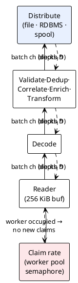

# 14 — Performance, Memory & Sizing

> Part of the [[00-index|baasparse TS]]. Previous: [[13-security-compliance]] · Next: [[15-traceability]]

Performance and memory efficiency are the **sponsor's top priority** (`CON-4`, BRS §7.1).
This section makes them engineering artifacts: a computable memory budget, an explicit
backpressure architecture, a hot-path allocation discipline, database write-rate
analysis at the v1 envelope, and a repeatable benchmark plan. The **v1 envelope**
(`BR-NFR-005`, `ASM-17`, design-gating per BRS Open Q1) is: tier-3/tier-2 operators —
illustratively **tens to a few hundred million records/day**, sustained peaks in the
**low tens of thousands of records/sec cluster-wide**, files up to **multi-GB**, on a
handful of instances.

## 14.1 The memory-budget model (`BR-NFR-002`)

### Decomposition

Each instance is given one number in bootstrap config: `memory_budget_bytes` (**B**).
Everything else derives from it. `GOMEMLIMIT = B` is the hard runtime ceiling; the
configured decomposition must fit in `0.85 × B`, leaving headroom for GC float and
transients:

```
M_total = M_runtime + M_mgmt + M_caches + M_sweeper + M_data      ≤ 0.85 × B

M_runtime  ≈ 150 MiB      Go runtime, pools, pgx buffers, TLS, metrics
M_mgmt     = capped management-plane allowance (default 128 MiB; own pools, BR-NFR-033)
M_caches   = enrichment hot-cache bound + refdata index cache      (BR-NFR-023, below)
M_sweeper  = W_sw × B_emit × R_max     window-sweeper emit batches (BR-COR-008)
M_data     = Σ_source  W_s × M_worker(s)                          (the dominant term)
```

**Per-file-worker worst case** for source *s* — a chain of `K_s` stages joined by
bounded channels of depth `D` carrying batches of `B_s` records with a per-record
footprint bound `R_s`:

```
M_worker(s) = IO_s  +  (K_s + 1) × D × B_s × R_s  +  S_dec(s)

IO_s      read buffer (default 256 KiB) + decompression buffer where enabled
R_s       max canonical-record footprint: derived from the Format Definition
          (max record bytes × a per-format expansion factor; validated at publish)
S_dec(s)  decoder scratch bound (format-specific; ASN.1 nesting depth × TLV frame)
```

*Worked default* (quoting [[05-decoding-and-canonical-record]] §5.6: batch size
**256 records**, **one batch in flight per stage edge**, i.e. `D = 1`):
`B_s = 256`, `R_s = 2 KiB`, `K_s = 6` (decode→validate→dedup→enrich→
transform→distribute) → `M_worker ≈ 0.25 + 7×1×256×2 KiB ≈ 3.8 MiB`. With
`W_s = 8` concurrent files: **≈ 30 MiB** for the source — independent of file size.

**Streaming pipeline footprint** = exactly the formula above (records never persist,
`BR-NFR-009`). **Collating pipeline footprint** = the same formula: the collate stage
appends members to `CW/CM` in PostgreSQL and releases the batch — the working set costs
**disk in PG, not engine memory** (`BR-NFR-001`, `BR-COR-006`); only the sweeper's
in-flight emit batches (`M_sweeper`) count.

**Excluded from the per-record budget** (`BR-NFR-023`): enrichment reference data
(served from indexed PG tables through a **bounded LRU hot cache** whose max-entries ×
entry-size bound is `M_caches` — configured explicitly, not per-record) and dedup state
(v1 dedup is DB-backed, `BR-DUP-002`; the only engine memory is the per-batch key
buffer already inside `M_worker`).

### Enforcement

- **At config load / publish** (`BR-CFG-003`): the configuration service computes
  `M_total` from the published sources' `W_s`, `B_s`, `R_s`, cache bounds — and
  **rejects a publish whose worst case exceeds `0.85 × min(B)`**, where `min(B)` is
  taken across the **live registered instances** (`INS_INSTANCE`, non-stopped and
  heartbeat-fresh — each instance's configured budget is visible from its
  registration): any instance may claim any file, so the cluster is sized by its
  smallest member. Deployments SHOULD keep budgets homogeneous; a heterogeneous
  cluster is validated — and effectively sized — at the minimum. The rejection
  reports the decomposition so the operator sees which knob to lower. A config that
  fits is guaranteed bounded; there is no runtime "hope".
- **At runtime:** worker counts are enforced by semaphores sized from `W_s` (global +
  per-source), channel capacities are exactly `D`, batch pools are pre-sized to
  `B_s × R_s` — there is no code path that allocates a queue without a configured bound
  ([[02-conventions]] §2.3).
- `GOMEMLIMIT = B` backstops estimation error; `GOGC` defaults to 100 (tunable) — with
  the budget fitting in 85 % of the limit, the collector runs on its normal cadence and
  the limit only engages under transient spikes (§14.4).

## 14.2 Backpressure architecture (`BR-NFR-002/007`)

Every stage is **pull-based over bounded channels**; a slow consumer blocks its
producer — no queue anywhere can grow:



**Blocking propagation:** a stalled destination (slow consumer, RDBMS target under
load) fills its input channel → transform blocks → … → the reader blocks on a full
decode channel → the file worker stays occupied → the claim coordinator, gated by the
worker-pool semaphore, **claims no new files**. The backlog therefore accumulates
**on disk as unclaimed input files** — the one place it is unbounded-safe and visible
(`BR-OPS-013` backlog metrics) — never in memory.

**Graceful degradation under overload** (`BR-NFR-007`): throughput saturates at the
configured concurrency; latency rises; nothing OOMs and nothing is dropped. Prolonged
destination failure escalates through store-and-forward bounds and the overflow policy
(`BR-DST-017` — default *pause intake*, same mechanism: stop claiming). Operator
pause and fail-closed (`BR-NFR-019`) reuse the identical seam: claims stop, in-flight
work quiesces at the last checkpoint, channels drain, memory returns to pool.

## 14.3 Hot-path design (`BR-NFR-003`)

### Canonical record representation — defined in [[05-decoding-and-canonical-record]] §5.2

The canonical record model is **normatively owned by [[05-decoding-and-canonical-record]]
§5.2** — kinds and units (§5.2.2), the `canonical.Value` tagged union and `Layout`
interning (§5.2.3), event-time semantics (§5.2.4), and lineage (§5.2.6). This section
adds no second model; the binding facts the performance design builds on are:

- **No `interface{}` boxing, no float on value paths.** `Value` is a compact tagged
  union; monetary/charge fields are the `decimal` kind (`int64` mantissa + scale) —
  exact fixed-point end to end, never `float64`.
- **Zone-on-value timestamps.** A timestamp is an instant (unix-nanos) *plus* its
  originating interned `*time.Location` — the zone is part of the value, never
  "applied later at output time".
- **Dense field vectors with interned names.** Records carry no per-record name table:
  format/rule compilation (at config load) resolves every field name to a slot
  **ordinal** against the shared `Layout`; stages address `Fields[i]` — names exist
  only at config-compile and output-encoding time.
- **`int64` lineage ordinals.** `FileUID` (the business `PF_FILE_UID`) plus the
  **1-based** `RecordSeq` in decode order ride on the record itself (`BR-DST-018`).
- **Bounded homogeneous lists** and `maxItems` bounds keep every value's footprint a
  config-derivable number (feeding `R_s` in §14.1).

### Implementation notes: arena, pooling, zero-copy (within the §5.2.3 contract)

- **Batch arena:** decoded bytes live in a pooled per-batch arena; decoders may point
  `Value.S`/`Value.B` at the read buffer/arena **only within one batch's lifetime** —
  any value retained across batches (dedup keys, collation members, suspense context)
  is deep-copied via `Retain()`, exactly the §5.2.3 copy-on-retention discipline. The
  arena is reset (not reallocated) per batch.
- **Pooling:** records come from a **`sync.Pool` per `Layout`** (field vectors
  preallocated at the layout's width); batches, reader buffers, and output encoders
  are pooled likewise and freed as units.
- **Zero-copy fast paths:** DSV/fixed decoders slice the read buffer directly
  (§5.4.4/§5.4.5); string materialisation is deferred to the output encoder;
  numeric/time/decimal parsing writes into the union's `int64` fields without
  intermediate strings.

### GC tuning

`GOMEMLIMIT = B` (§14.1); `GOGC = 100` default. Because steady-state allocation is
pool-recycled, the live heap is nearly flat and GC cycles are short and rare; the
soft limit absorbs bursts (many files claimed at once) by temporarily increasing GC
frequency instead of OOM-ing — degradation, not failure.

### Per-record allocation targets & measurement

| Path | Target (steady state, amortised) |
|------|----------------------------------|
| DSV / fixed decode → transform → file output | **≤ 2 allocs/record** (goal 0 — pools + arena) |
| JSON / XML | ≤ 6 allocs/record |
| ASN.1 BER | ≤ 8 allocs/record |
| Any stage adding a field | 0 (writes into the preallocated vector) |

Measured three ways: (1) `go test -bench` with `b.ReportAllocs()` per stage — a **CI
regression gate** fails the build when allocs/record rises above target; (2) the
benchmark harness (§14.8) reports `Mallocs/records`; (3) in production,
`runtime/metrics` allocation rate divided by the records/sec counter is exported as
`baasparse_allocs_per_record` for drift detection.

## 14.4 Concurrency model (`BR-NFR-004/021`)

| Knob | Scope | Default | Effect |
|------|-------|---------|--------|
| `max_concurrent_files` | global per instance | cores | file-worker pool (the unit of parallelism) |
| `sources[].max_concurrent_files` (`W_s`) | per source | 2 | caps one source (`BR-COL-011`) |
| `sources[].batch_size` (`B_s`) | per source | 256 | records per channel message (amortises overhead; default per [[05-decoding-and-canonical-record]] §5.6) |
| `channel_depth` (`D`) | global | 1 | stage-edge buffering — **one batch in flight per edge** ([[05-decoding-and-canonical-record]] §5.6) |
| `sweeper_workers` (`W_sw`) | per instance | 2 | concurrent window emits (`BR-COR-008`) |
| `destinations[].rdbms.batch_size` / `pool_size` | per destination | 1000 / 4 | target-side batching (`BR-DST-015`) |
| `fetch.concurrency` / bandwidth | per remote host | 1 | `BR-RMT-010` |
| `scan_interval` | per source group | 2 s | detection floor (§14.6) |

**What parallelises:** files (across and within instances — the primary scaling axis),
window emits, destinations within a fan-out (each destination writes its own output
concurrently from the shared transformed batch), fetch per remote host, and the
management plane (isolated pools, `BR-NFR-033`).

**What stays ordered:** *within one file*, records flow through a single stage-chain —
one goroutine per stage, ordered channels — so within-file order is preserved end-to-end
as decoded (`BR-DST-012`). There is deliberately **no intra-file record fan-out** in
v1: it would buy little (files are the abundant parallelism unit at the envelope) and
cost the ordering guarantee plus re-sequencing buffers. Cross-file ordering is a
consumer responsibility via gap-detectable sequence numbers (`BR-DST-011/012`).

Vertical scaling (`BR-NFR-021`) is therefore: more cores → raise
`max_concurrent_files` (and `B` proportionally) → near-linear throughput until the
shared FS or PostgreSQL bounds, since workers share almost nothing in memory.

## 14.5 Streaming guarantee walk-through (`BR-NFR-001`)

**The 10 GB file.** A single file worker: bounded reader (256 KiB) → decoder produces
256-record batches into single-batch (depth-1) channels → stages transform in place → distribute
writes output files with **temp-then-rename roll-over** at the configured batch/size/
time bound (`BR-DST-003/005`) and streams RDBMS batches with bounded commits
(`BR-DST-013`). Checkpoints (`FC` offset) commit every N records/bytes (`BR-NFR-013`).
Peak memory = `M_worker` ≈ **4 MiB with defaults** (§14.1) — the same for a 10 MB or a
10 GB file; only wall-clock time differs. Nothing in the path holds more than
`(K+1) × D` batches alive.

**The collating case.** The collate stage upserts each batch's members to
`CW_COLLATION_WINDOW`/`CM_COLLATION_MEMBER` and releases the batch — the open working
set is bounded **in PostgreSQL** by window-completion policy and retention
(`BR-COR-006`, `BR-NFR-006`), hash-partitioned against hot keys (§14.7). The sweeper
later claims due windows and emits atomically, feeding the downstream half of the
pipeline in the same bounded-batch fashion. Engine memory stays at `M_worker + M_sweeper`
regardless of how many windows are open.

## 14.6 Near-real-time latency (`BR-NFR-008`)

The **detection floor is the scan interval** (`BR-COL-012` — cross-host `inotify` is
not reliable on shared storage). End-to-end budget for a file arriving on shared FS,
with defaults:

| Step | Bound | Driver |
|------|-------|--------|
| Detect (scan) | ≤ `scan_interval` (2 s; avg ½) | per-source config; `inotify` ≪ 100 ms where dir is instance-local |
| Claim + move to in-progress | < 50 ms | one `SKIP LOCKED` tx + rename |
| First record decoded | < 100 ms | open + first read/decode batch |
| First output visible | batch/roll-over bound | `BR-DST-005` roll policy (e.g. 10 s / N records) — atomic rename makes it visible |
| **Detect → processing start** | **≤ scan_interval + ~150 ms** | the configurable SLA knob |

The scan interval is set per deployment to meet the agreed latency target; scan cost is
O(directory listing) and is measured by the harness at representative directory sizes.

**Catch-up relaxation (`BR-OPS-013`):** during a *declared* catch-up/backfill the
latency SLA is relaxed and **reported separately** — latency metrics carry a
`catchup="true"` label ([[12-observability-operations]] §12.2), dashboards/alerts key
on the non-catch-up series, and the declared
state is a single alarm per `BR-OPS-017`, so a backlog drain never reads as an SLA
breach.

## 14.7 Database capacity engineering (`BR-NFR-020/022/024`)

### Connection architecture

- Per instance: a **data-plane `pgxpool`** sized `min(2 × cores, 24)` and a
  **management pool** capped at 8 connections ([[10-management-plane]] §10.7,
  `BR-NFR-033`); statement-level work only — transactions are short and explicit.
- **PgBouncer expected** in front of the primary (`BR-NFR-020`, `DEP-1`), transaction
  pooling mode, so N instances × pools never exhaust PostgreSQL connections
  (`max_connections` stays modest, e.g. 200).
- Exceptions that bypass PgBouncer (direct to primary): one **LISTEN/NOTIFY**
  connection per instance (config hot-reload, `BR-CFG-007`) and the migration owner —
  both session-stateful. Claims/leases need no session state (row locks live inside a
  single transaction), so they pool freely.

### Write-rate analysis at the v1 envelope

Envelope: 200 M records/day ≈ 2.3 k rec/s average, **20 k rec/s peak** cluster-wide;
~20–50 k files/day. Per store, at peak:

| Store | Peak write rate | Batching | Resulting tx/s | Notes |
|-------|----------------|----------|----------------|-------|
| `DK_DEDUP_KEY` — **highest** (`BR-NFR-024`) | 20 k keys/s | multi-row `INSERT … ON CONFLICT DO NOTHING`, 1 batch per record-batch (256) | ~80 | ~100 B/row + PK index ⇒ heap+WAL ≈ 4–6 MB/s peak; **daily partitions**, dropped at retention (`BR-DUP-002`) — no delete churn, no vacuum debt |
| `CM/CW` collation appends | share of volume that collates (design assumption ≤ 20 % ⇒ 4 k rec/s) | batched upsert per batch (256) | ~16 | **hash-partitioned by group key** (16 partitions, `CW_COLLATION_WINDOW_H00..H15`) so concurrent appends from all instances spread, not serialise (`R20`, `BR-COR-006`) |
| `FC/PF` claims & lifecycle | ~1 file/s avg, bursts | row per file + heartbeat | < 5 | negligible; `SKIP LOCKED` scans indexed on status |
| `AE_AUDIT_EVENT` | file/window/admin-scoped | single hash chain; `AE_CHAIN_ON` stamped under the `AUDIT_CHAIN` head lock; terminal-transition events ride their owning transaction, high-frequency non-terminal events batch-flush ([[13-security-compliance]] §13.5, [[03-database-design]] §3.8.2) | tens/s | per-record outcomes are *counts* in `RS`, not audit rows — by design |
| `RS_RECONCILIATION_SUMMARY` | per file/period | single row updates per checkpoint | < 10 | |
| `DL_DELIVERY` / `DSQ` | per output file × destination | tx at delivery-commit | < 10 | serialised per destination — cheap at envelope (`BR-DST-011`) |

**Headline:** the primary sees on the order of **≤ 150 write tx/s and ≤ 10 MB/s WAL at
peak** — comfortable for a single, properly-provisioned PostgreSQL primary (`ASM-17`),
with the stated mitigations: time-partitioning + **partition-drop expiry**
(`BR-NFR-022`), batching, pooling, hash-partitioned working set, and keeping the
hottest feeds in **streaming (non-collating) mode** (`BR-CFG-010` — the documented v1
answer for feeds whose single-key append rate exceeds row-level concurrency, BRS §4.3).

### v2 seams — what v1 keeps stable (`BR-NFR-024/025`, BRS §10.6)

| Seam | v1 shape (binding) | v2 change |
|------|--------------------|-----------|
| Dedup pre-filter (`BR-NFR-025`) | dedup behind `dedup.KeyStore` — `CheckAndRecord(batch) → verdicts` ([[06-pipeline-stages]]), DB-confirmed, **no false-duplicate possible** | insert a bounded probabilistic/recent-key cache **in front of the same interface**; *definitely-new* answered in memory, positives still DB-confirmed — pure performance |
| Write-path scale-out (`BR-NFR-024`, `R30`) | high-churn tables **time/hash-partitioned**; expiry by partition drop; all state access behind module interfaces; deterministic output identity independent of store layout | shard/partition state or external dedup store behind the same interfaces — acknowledged as a genuine re-architecture of the shared state/audit layer, **not** claimed as a config flip |

v1 delivery is not complete unless these shapes exist (`BRS §10.6` rule 1); v1
correctness never depends on the deferred mechanism (rule 2).

## 14.8 Benchmark & validation plan (`BR-NFR-005`)

A repeatable harness lives in the repo (`bench/`), runnable on any target-class Linux
host — the envelope figures are validated **before design sign-off** (Open Q1) and on
every release.

**Components**

1. **Synthetic feed generators** per format (`bench/gen`): parameterised
   records/file, field mix, record size, duplicate rate, correlation-key cardinality;
   deterministic seed so runs are comparable. ASN.1 generator emits representative
   CDR structures (BRS §4.5).
2. **Stage microbenchmarks** (`go test -bench`): records/sec/core and allocs/record
   per decoder and stage — the CI regression gate (§14.3).
3. **End-to-end rig:** N instances + PostgreSQL + shared dir (compose/ansible),
   driven by the generators; measures cluster records/sec, p50/p99 detect-to-output
   latency, RSS per instance, PG tx/s and WAL rate.
4. **Memory-ceiling assertion:** process a 10 GB file per format under a 512 MiB
   budget; the run **fails if RSS exceeds the budget** at any sample — the executable
   proof of `BR-NFR-001/002`.
5. **Soak + chaos:** 24 h at peak-envelope rate with `kill -9` of one instance every
   hour (BRS §10.2 exit criterion). Pass = every file completes exactly once
   (reconciliation balances, `in = out + suspended + discarded`), no duplicate output
   identities at file or RDBMS targets, takeover within lease-expiry + margin, no RSS
   growth trend, management plane responsive throughout (`BR-NFR-033`).
6. **Management-load-vs-data-plane soak variant** (BRS §10.2 exit-criterion
   direction, `BR-NFR-033`): the same peak-envelope run with **sustained GUI/API and
   report load** driven concurrently — scripted dashboard polling, alarm/suspense
   browsing, reconciliation and audit report queries, config dry-runs — at a
   configured multiple of expected operator activity. Pass = data-plane throughput
   and p99 detect-to-output latency stay **within a stated tolerance** (default
   ≤ 5 % deviation) of the unloaded soak baseline, management p99 response time stays
   bounded, and neither pool starves the other (plane isolation proven under load,
   not just by construction).

**Design throughput targets** (records/sec/core, steady state; to be confirmed as the
gating figures of Open Q1 — DSV/fixed higher, ASN.1 lower, per `BR-NFR-005`):

| Format | Decode-only | Full streaming pipeline |
|--------|------------:|------------------------:|
| Fixed-position | 80 k | 40 k |
| DSV | 60 k | 30 k |
| ASN.1 (BER) | 25 k | 12 k |
| JSON (NDJSON) | 30 k | 15 k |
| XML | 20 k | 10 k |

At these rates a 3 × 8-core cluster sustains ≈ 3 × 8 × 12 k ≈ 288 k rec/s on ASN.1
pipeline-limited work — an order of magnitude of headroom over the 20 k/s envelope
peak, which is what "sized with headroom" means concretely.

**Sizing guidance vs envelope tiers** (validated by the rig; per-tenant, `BR-NFR-062`):

| Tier | rec/day | Peak rec/s | Instances × cores | RAM/instance (budget) | PostgreSQL | Disk |
|------|---------|-----------:|-------------------|-----------------------|------------|------|
| Small (tier-3) | ≤ 50 M | 5 k | 2 × 4 | 8 GiB (B = 4 GiB) | 4 c / 16 GiB, SSD 2 k IOPS | shared FS ≥ 200 MB/s |
| Medium (tier-2) | ≤ 200 M | 20 k | 3 × 8 | 16 GiB (B = 8 GiB) | 8 c / 32 GiB, SSD 5 k IOPS | shared FS ≥ 500 MB/s |
| Upper envelope | ≤ 500 M | 30 k | 4 × 12 | 24 GiB (B = 12 GiB) | 16 c / 64 GiB, NVMe 10 k IOPS | shared FS ≥ 1 GB/s |

Beyond the upper row is a **tier-1 case deferred to v2/future** (`ASM-17`, `R30`) —
flagged pre-sale, not a v1 sizing exercise.

## 14.9 Vertical scaling & sustained-overload behaviour (`BR-NFR-021`, `BR-NFR-007`)

- **Vertical:** throughput scales near-linearly with cores by raising
  `max_concurrent_files` (workers share no hot locks; per-file state is private; DB
  batches amortise), until the shared FS or the primary bounds. The budget `B` scales
  with the added concurrency per §14.1 — memory remains a function of configuration,
  never input.
- **Sustained overload:** input arrives faster than the cluster processes → unclaimed
  backlog grows **on disk**; backpressure keeps memory flat; backlog depth/age metrics
  and alerts fire (`BR-OPS-002/013/015`); the operator adds an instance (`BR-HA-007`)
  or declares catch-up. The engine never sheds records — degradation is latency, by
  the §7.8 priority order (integrity over liveness).
- **Overload of a single destination** degrades only that destination (spool bounds →
  overflow policy, `BR-DST-017`); fan-out siblings and other sources continue.

### Deployment & portability notes (`BR-NFR-060/061/062`)

The performance machinery assumes nothing outside the delivered artifact: one
**static Go binary, Linux-only** (`BR-NFR-060` — `inotify`, `GOMEMLIMIT`, benchmark
harness all Linux-native); every knob in this section (`memory_budget_bytes`, pools,
batch sizes, scan intervals, DSNs) is **externalised** bootstrap/env configuration
(`BR-NFR-061`) or published pipeline config; sizing is **per tenant** — the tables in
§14.8 size one single-tenant, on-prem deployment (`BR-NFR-062`), never shared capacity.

## BRS coverage

| Requirement | Where |
|-------------|-------|
| BR-NFR-001 | §14.1, §14.5 (streaming/bounded-buffer; footprint independent of file size) |
| BR-NFR-002 | §14.1 (budget model + publish-time enforcement), §14.2 (backpressure) |
| BR-NFR-003 | §14.3 (value representation, pooling, GC tuning, alloc targets & measurement) |
| BR-NFR-004 | §14.4 (concurrency knobs; what parallelises) |
| BR-NFR-005 | §14.8 (envelope, targets/core, repeatable harness, sizing headroom) |
| BR-NFR-006 | §14.5, §14.7 (stateful stages bounded & spilled to PG; prunable partitions) |
| BR-NFR-007 | §14.2, §14.9 (graceful degradation, no OOM/loss under overload) |
| BR-NFR-008 | §14.6 (scan-interval detection floor; latency budget; continuous service) |
| BR-NFR-009 | §14.5, §14.7 (no raw bytes in PG; only the bounded collation working set) |
| BR-NFR-020 | §14.7 (horizontal scale via claims; PgBouncer pooling) |
| BR-NFR-021 | §14.4, §14.9 (vertical scaling path) |
| BR-NFR-022 | §14.7 (retention-bounded stores via partition drop) |
| BR-NFR-023 | §14.1 (refdata excluded from per-record budget; bounded hot cache) |
| BR-NFR-024 | §14.7 (single-primary write analysis, mitigations, honest v2 seam) |
| BR-NFR-025 | §14.7 (dedup pre-filter seam: stable `dedup.KeyStore` interface) |
| BR-NFR-060 | §14.9 (static Linux binary; Linux-native performance facilities) |
| BR-NFR-061 | §14.1, §14.9 (budget/knobs externalised in bootstrap/env config) |
| BR-NFR-062 | §14.8, §14.9 (per-tenant on-prem sizing) |
| BR-DST-012 (ordering slice) | §14.4 (within-file ordering preserved by design) |
| BR-COR-006 (memory slice) | §14.5 (working set in PG, not memory) |
| BR-CFG-010 | §14.7 (streaming-mode fallback for hottest feeds) |
| BR-OPS-013 (latency slice) | §14.6 (catch-up relaxation reported separately) |
