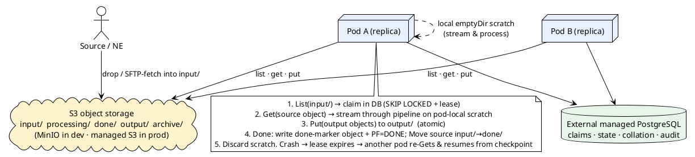
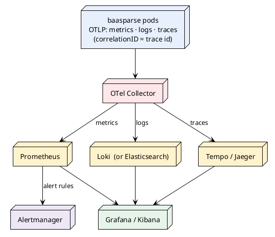

# 16 — Cloud-Native Deployment & Storage Abstraction

> Part of the [[00-index|baasparse TS]]. Previous: [[15-traceability]] · Next: —
> **Status:** Draft `v0.1` (cloud-native track) — for review before the inline amendments
> to sections 04/07/08/11/12/13 and the BRS scope note are applied.

## 16.1 What this section adds and why

The base TS (01–15) targets an on-premises cluster of Linux hosts sharing a **POSIX
filesystem** (NFS/clustered FS) and coordinating through PostgreSQL. This section adds a
**second, cloud-native deployment topology** — Kubernetes with **S3 object storage as the
durable substrate** — *without* dropping the on-prem model, by generalising all file access
behind a **Storage abstraction** with three backends.

**Confirmed design decisions (owner):**

| # | Decision | Consequence |
|---|----------|-------------|
| D1 | Support **POSIX (local/shared), SFTP/FTPS, and S3 object storage** as storage backends in v1 | New Storage seam; object storage promoted from "future" to v1 |
| D2 | In K8s: **object storage is the durable substrate; pods use local ephemeral scratch** | **The ReadWriteMany (RWX) shared-volume requirement is eliminated** in the cloud topology |
| D3 | **Multi-replica from the start** (incl. on microk8s) | Singleton jobs need real coordination now (§16.7); dev uses in-cluster **MinIO** |
| D4 | **S3-compatible only** for object storage (AWS S3, MinIO, Ceph RGW, GCS-interop) | One client/code path; Azure Blob deferred |
| D5 | **Adopt OpenTelemetry**; **drop the in-app logs page**; logs to **stdout** | Telemetry via OTel Collector → Prometheus/Loki(or ES)/Tempo; correlation id → trace id |
| D6 | **External managed PostgreSQL** | In-cluster PG operator out of scope; PgBouncer as a small pooler |
| D7 | **Delegate alert routing to Alertmanager** | Engine keeps DB-persisted alarms as system-of-record + alarm metric; no in-engine webhook/SNMP/chat |

**Non-negotiable invariants preserved across all backends:**
- Coordination (file claims, leases, dedup, collation working set, audit, reconciliation)
  stays in **PostgreSQL** — so **exactly-once** holds regardless of storage backend
  (`BR-HA-003`, `BR-COR-006`).
- **No raw record bytes in PostgreSQL** (`BR-NFR-009`) — the store holds a **storage
  reference**, never content.
- Integrity > performance > auditability > configurability > operability (BRS §7.8).

## 16.2 The Storage abstraction

All data-plane file access goes through one consumer-defined interface (`BR-NFR-031/032`),
with three backends. The pipeline core, collector, distributor and archiver depend on the
interface, never on a concrete backend.

```go
// storage.Store abstracts the durable substrate. A Ref identifies an object/file
// within a configured backend+root; content is streamed, never held in PostgreSQL.
type Ref struct {
    Backend string // "posix" | "sftp" | "s3"
    Root    string // bucket (s3) or base directory (posix/sftp)
    Key     string // object key or relative path
}

type Store interface {
    List(ctx context.Context, prefix Ref) ([]Entry, error)        // detection: scan a prefix
    Open(ctx context.Context, r Ref) (io.ReadCloser, error)       // streaming read (range-capable)
    Put(ctx context.Context, r Ref, body io.Reader, meta Meta) error // atomic write
    Stat(ctx context.Context, r Ref) (Entry, error)               // size/etag/mtime/exists
    Move(ctx context.Context, from, to Ref) error                 // lifecycle transition
    Delete(ctx context.Context, r Ref) error
}
```

| Backend | Detection (`List`) | Read (`Open`) | Write (`Put`) | Lifecycle (`Move`) |
|---------|--------------------|---------------|---------------|--------------------|
| `posix` | `readdir` scan (`BR-COL-012`) | file read | temp-then-rename (atomic) | `rename(2)` (atomic) |
| `sftp` | remote `ls` (fetch only) | SFTP get (streamed) | SFTP put + rename | remote rename / move-to-done |
| `s3` | `ListObjectsV2(prefix)` | ranged `GetObject` | `PutObject`/multipart (**atomic by nature**) | server-side **copy + delete** (no native rename) |

**Reference model.** `PF_PROCESSED_FILE` and every operational reference (suspense,
delivery, archive, completion marker) carries a `Ref` (`backend/root/key`) rather than a
path — this is the only schema change the abstraction forces (a widening of the existing
`PF_PATH`/marker columns into a small structured reference; `BR-NFR-009` is unaffected —
still a reference, not content).

**Per-source / per-destination backend.** Each source and each destination names its
backend + root in configuration (`SRC`/`DS` JSONB). A deployment can mix: e.g. ingest from
SFTP, process against S3 working prefixes, archive to a *different* S3 bucket — or run
entirely on a shared POSIX FS. This is what keeps traditional SFTP/filesystem mediation
fully supported alongside cloud object storage.

## 16.3 Two topologies, one lifecycle

The **record lifecycle** (`BR-COL-009`, input → in-progress → done → archive) is defined
abstractly as **PostgreSQL state** (`PF_STATUS`) plus backend-specific realisations of the
transitions. The "directory move" language of the base spec becomes one *implementation*
(topology A) of the abstract state machine.

### Topology A — on-prem / shared POSIX FS (base spec, unchanged)

Shared RWX filesystem is the working substrate; `input/ → in-progress/ → done/` are real
directory moves; all instances see all files; detection is a directory scan
(`BR-COL-012`). Exactly as sections 04/07/08 specify.

### Topology B — cloud / Kubernetes (object storage + pod-local scratch)



**Key property:** because each pod pulls the object it claimed to *its own* ephemeral
scratch, **no pod needs to see another pod's disk — RWX is not required.** Coordination is
entirely in PostgreSQL. This is the model that makes multi-replica trivial on microk8s
(hostpath/emptyDir per pod) and clean in production.

**Lifecycle mapping (topology B):**

| Abstract state (`BR-COL-009`) | Topology B realisation |
|-------------------------------|------------------------|
| Detected | `ListObjectsV2("input/")` poll surfaces a key |
| Claimed / in-progress | `FC_FILE_CLAIM` row (lease+fence) in PG; object stays in `input/` (no move yet) |
| Streaming | claiming pod ranged-`GetObject` → pod-local scratch; checkpoint offset in `FC` (`BR-NFR-013`) |
| Output written | `PutObject` to `output/…` (atomic; no partial-object visibility) |
| Done (all endpoints delivered) | write **done-marker object** (`…/done-markers/<fileUID>.json`, the `BR-COL-009` manifest) + `PF=DONE`; then `Move input/→done/` (copy+delete) |
| Suspense-pinned (`BR-ERR-008`) | source object retained in `done/`/`input/` until suspense resolved — cheap durable storage, no local-disk pinning |
| Crash mid-file | lease expiry → takeover pod re-`Get`s the still-durable source object, resumes from checkpoint |
| Archive (`BR-ARC-*`) | engine zips `done/` objects and `Put`s the archive to the archive backend/bucket, then deletes originals after verify (`BR-ARC-006`) |

**Consistency notes (S3):** modern S3 is **strongly consistent for read-after-write and
list**, so detection and takeover are safe. `PutObject`/multipart completion is **atomic**
(satisfies `BR-DST-003` more strongly than filesystem rename — there is never a
partially-visible object). There is **no atomic rename**, so `Move` is copy+delete and the
authoritative lifecycle state is **PostgreSQL `PF_STATUS`**, with object placement as a
best-effort mirror reconciled at startup (§16.6, generalising `BR-NFR-017`).

## 16.4 Impact on existing mechanisms (must stay correct)

| Mechanism | Base spec | Cloud-topology behaviour |
|-----------|-----------|--------------------------|
| Detection (`BR-COL-012`) | directory scan | `ListObjectsV2` prefix poll (interval = latency knob, `BR-NFR-008`) |
| Atomic output (`BR-DST-003`) | temp+rename | atomic `PutObject`/multipart — no partial visibility |
| Store-and-forward spool (`BR-DST-010/017`) | on-disk spool dir, bounded | spool as an `output/spool/` prefix, bounded by object count/bytes; overflow policy unchanged |
| Done-gate (`BR-COL-009`) | move to `done/` after all `DL` terminal | PG done-tx unchanged; object `Move` follows the PG transition |
| Suspense retention (`BR-ERR-008`) | keep file on disk | keep source **object**; resolves the whole-file local-disk pinning concern (G11) |
| Replay of archived file (`BR-ERR-009`, `ASM-14`) | operator re-adds to disk | re-`Get` from archive prefix (may be automatable later; still operator-gated in v1) |
| Startup reconciliation (`BR-NFR-017`) | DB ↔ disk markers | **DB ↔ object-store `List` + done-marker objects** |
| Whole-site DR (`ASM-18`) | replicate shared FS | **S3 durability / cross-region replication** — platform-native, arguably stronger |
| Collation working set (`BR-COR-006`) | PostgreSQL | unchanged — always PG |

## 16.5 Kubernetes deployment

```plantuml
@startuml k8s
!theme plain
skinparam defaultTextAlignment center
cloud "Ingress (nginx)\nTLS via cert-manager" as ING #EDE7F6
node "Deployment: baasparse × N\n(Service, no sticky sessions)" as DEP #E8F0FE
database "Managed PostgreSQL\n(+ PgBouncer)" as PG #E6F4EA
cloud "S3 (MinIO dev / managed prod)" as S3 #FFF3CD
node "OTel Collector" as OTC #FDE7E9
node "Prometheus · Grafana\nLoki/ES · Tempo · Alertmanager" as OBS #FFF3CD
actor "Operators / External systems" as U

U --> ING --> DEP
DEP --> PG
DEP --> S3
DEP --> OTC : OTLP (metrics/logs/traces)
OTC --> OBS
DEP ..> OBS : /metrics (ServiceMonitor fallback)
@enduml
```

- **Workload:** a `Deployment` of N identical replicas behind a `Service`. Sessions/tokens
  live in PG (`BR-HA-012`), so **no session affinity** is needed. (A `StatefulSet` is *not*
  required — instance identity comes from the pod name, below.)
- **Instance identity:** `INS_INSTANCE.INS_NAME` / `--instance-id` = pod name via the
  Downward API (`metadata.name`). Claim/lease/fence (`BR-HA-003/004`) already tolerate
  ephemeral, churning identities — pod eviction/rescheduling is the designed-for case.
- **Config & secrets:** non-secret tunables from a **ConfigMap**; DB URL, S3 credentials,
  SMTP from a **Secret** (or External Secrets Operator + Vault). Precedence (§16.9):
  **flags → env → `~/.baasparse/.config` → defaults.**
- **Probes:** `livenessProbe: /healthz` (DB-independent — a fail-closed pod must **not** be
  killed), `readinessProbe: /readyz` (reflects DB reachability, `BR-NFR-019`). This split is
  already in the base spec and is exactly right for K8s.
- **Graceful shutdown:** SIGTERM → stop claiming, drain in-flight to checkpoint, release
  claims (`BR-HA-008`). Set `terminationGracePeriodSeconds` ≥ the worst-case single-file
  drain; a `preStop` hook may set readiness-false first to bleed traffic.
- **Disruption & scaling:** a `PodDisruptionBudget` (minAvailable ≥ 1) protects against
  simultaneous evictions; **HPA** scales on CPU or a Prometheus custom metric (backlog /
  records-per-sec) via the prometheus-adapter.
- **Resources:** `resources.limits.memory` aligned with the engine memory budget and
  `GOMEMLIMIT` (TS 14) — the bounded-memory design (`BR-NFR-001/002`) makes limits
  predictable and OOM-safe, and bin-packs cleanly.
- **Image:** multi-stage build → **static Linux binary** (pgx is pure-Go; `CGO_ENABLED=0`)
  on **distroless/scratch**, **non-root**, **read-only root filesystem** with an `emptyDir`
  scratch mount for processing and `/tmp`.

### 16.6 Migrations in Kubernetes

Run schema migrations as a **pre-deploy Job** (Helm/Argo hook or init step), **not** per-pod
auto-migrate — pods run with `--auto-migrate=false`. This makes **expand-then-contract**
(`BR-HA-011`) explicit in the deploy pipeline: the *expand* migration Job runs before the
new replicas roll; the *contract* Job runs after the rollout completes and all old pods are
gone. The startup advisory lock remains the safety net if two migrators ever overlap.

### 16.7 Singleton / scheduled jobs — pull the v2 lease forward

With N replicas from day one (D3), a **static "nominated instance"** for fetch-polling, the
archiver, feed-liveness and partition maintenance is fragile (that pod may not exist).
**Decision:** promote the **scheduled-job lease** (`BR-HA-010`, previously v2) **into the
cloud topology now**. The lease mechanism already exists in v1 for collation-window emit
(`BR-COR-008`), so this is low-risk: any replica may run a job, only the lease-holder does,
and it fails over automatically. The idempotent backstops (already-fetched guard
`BR-RMT-005`, verify-before-prune `BR-ARC-006`) remain, so correctness never depended on
single-runner enforcement anyway. *(Alternative considered: a K8s `CronJob` for the archiver
+ Lease-API leader-election for fetch — rejected in favour of one mechanism the engine
already owns and can reason about with its own alarms.)*

## 16.8 Observability — OpenTelemetry-centric

**The in-app `/logs` page and its file reader are removed** (D5). Telemetry is emitted via
OpenTelemetry and routed by an **OTel Collector**:



- **Metrics:** the full TS 12 catalog (throughput, latency histograms, memory used-vs-budget,
  backlog, suspense-pinned bytes, spool depth, DB replication lag, open-window count, alarm
  counts) via `prometheus/client_golang`, **labelled per-instance**. Scraped by a
  **ServiceMonitor** (Prometheus Operator) and/or exported over OTLP.
- **Logs:** structured JSON to **stdout** (`--log-format=json`), collected by the node agent
  (Vector/Fluent Bit or the OTel Collector's filelog receiver) → **Loki (recommended,
  Grafana-native) or Elasticsearch**. Explored in **Grafana/Kibana**. The **correlation id
  (file UID)** is preserved on every record and becomes the log↔trace join key.
- **Traces:** OTel spans across decode → validate → transform → distribute, and across pods
  on takeover; the **file UID is promoted to the trace id**, so one file's journey is a
  single distributed trace regardless of which pod(s) handled it.
- **Alerting (D7):** engine **alarms remain the system-of-record in PostgreSQL**
  (`BR-OPS-008/011` lifecycle) and are exposed as a metric; **Alertmanager** owns
  *notification routing* (email/Slack/PagerDuty/webhook). This satisfies the base spec's
  v2 "alerting beyond email" **without building channels into the engine**.
- **Grafana dashboards** shipped as ConfigMaps: per-pipeline throughput, reconciliation
  (in vs out vs suspended vs open), backlog/latency, disk/object-store pressure, replication
  lag, cluster/instance health.

## 16.9 Security, config & secrets (reconciling the alpha)

- **TLS at the ingress** (cert-manager); Service → pods. The app trusts `X-Forwarded-Proto`
  to set the session-cookie `Secure` flag and build correct redirects (`BR-NFR-053`).
  Optional re-encrypt to pods where mandated.
- **Secrets** via K8s `Secret` / External Secrets Operator + Vault (`BR-NFR-054`); **S3
  credentials** and DB URL as Secret-sourced env. **Encryption-at-rest** for objects via
  **SSE-S3 / SSE-KMS** (`BR-NFR-055`); TLS to the S3 endpoint (analogue of `BR-NFR-050`).
- **Config precedence (reconciles the alpha's YAML file):**
  **flags → env (ConfigMap/Secret) → `~/.baasparse/.config` → defaults.** The file remains
  the local/dev layer; env/Secret is authoritative in-cluster. A **`--log-format`
  (json|pretty)** and **`--log-output` (stdout|file)** switch selects container vs local
  behaviour (container default: json+stdout).
- **Pod security:** non-root, read-only rootfs, dropped capabilities, `NetworkPolicy`
  restricting egress to PG/S3/OTel, PodSecurity "restricted".

## 16.10 Amendments this section implies (to apply after review)

| Target | Change |
|--------|--------|
| **BRS §4.3 / §10** | Move **object-store transports** from "future/out-of-scope" into **v1**; add object storage as a supported acquisition/output/archive backend. |
| **BRS `RMT`/`COL`/`DST`/`ARC`** | Add object-storage backend requirements (or a new **`STO` — Storage abstraction** area covering all three backends and the reference model). |
| **BRS `ASM-3`/`ASM-18`** | Storage substrate is **one of**: shared POSIX FS *or* S3 object storage (+ pod-local scratch); DR follows the chosen substrate (FS replication or S3 durability). |
| **BRS `BR-HA-010`** | Scheduled-job lease **pulled into v1** for the cloud topology (§16.7). |
| **BRS `BR-OPS-008`** | v1 alerting = DB alarms + metric + **Alertmanager routing**; in-engine channels beyond email remain out of scope. |
| **TS 04** (`COL`/`RMT`/`ARC`) | Generalise the file-lifecycle language to the abstract state machine + backend realisations (§16.3); add the `s3` backend. |
| **TS 07** (`DST`) | Add object-storage destination + spool-as-prefix; atomic output via `PutObject`. |
| **TS 08** (`ERR`) | Suspense/replay over the `Ref` model; retention = object retention. |
| **TS 11** (`HA`/recovery) | Startup reconciliation generalised to DB↔object-store; K8s topology, probes, PDB, graceful drain, migration Job. |
| **TS 12** (`OPS`) | OTel emission, Collector routing, Prometheus/Grafana/Loki(or ES)/Tempo, Alertmanager; **remove the in-app logs page**. |
| **TS 13** (security) | Ingress TLS + `X-Forwarded-Proto`, S3 SSE, K8s Secrets/ESO, pod security. |
| **TS 03** (schema) | Widen `PF_PATH` and marker columns into a small **storage `Ref`** (backend/root/key); no content in PG (`BR-NFR-009` intact). |

## 16.11 Open items to confirm during build

1. **S3 client library** offline-availability (implementation detail): the AWS SDK is large;
   a lean S3 client is preferable. Confirm at build time.
2. **Spool/holding-area bounds on object storage** — expressed in object count/bytes per
   prefix; monitored as an object-store-pressure metric (analogue of `BR-OPS-015`).
3. **Multipart thresholds** and part sizes for multi-GB CDR files (aligns with the streaming
   memory budget, `BR-NFR-001`).
4. **Done-marker object naming/retention** and its role in reconciliation (`BR-NFR-017`).
5. **microk8s dev bundle:** MinIO + external-ish PG + OTel Collector + Grafana stack as a
   Helm/kustomize overlay for local bring-up.

## 16.12 BRS coverage

This section is a **deployment/technical realisation**; it introduces no new *business*
capability beyond promoting **object storage to a v1 supported transport**. It elaborates:
`BR-HA-001..012` (topology), `BR-NFR-009/017` (reference model & reconciliation),
`BR-NFR-060/062` (portability/deployment), `BR-COL-009/012`, `BR-DST-003/010/017`,
`BR-ERR-008/009`, `BR-ARC-*`, `BR-OPS-008/009/015`, `BR-NFR-050/053/054/055`, plus the
**proposed `STO` area** and the **v1 promotion of `BR-HA-010`** recorded in §16.10.
