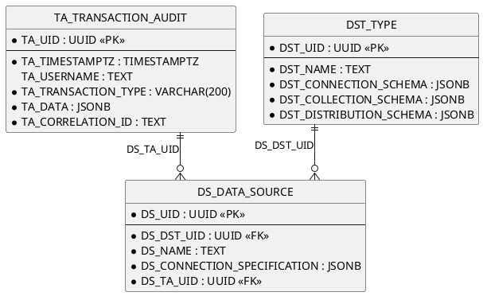

# baasparse Database ERD

```plantuml
@startuml baasparse ERD
hide empty methods
hide circle
skinparam linetype ortho
skinparam entity {
  BackgroundColor #FAFAFA
  BorderColor #555555
  ArrowColor #555555
}

entity "TA_TRANSACTION_AUDIT" as TA {
  * TA_UID : UUID <<PK>>
  --
  * TA_TIMESTAMPTZ : TIMESTAMPTZ
  TA_USERNAME : TEXT
  * TA_TRANSACTION_TYPE : VARCHAR(200)
  * TA_DATA : JSONB
  * TA_CORRELATION_ID : TEXT
}

entity "DST_TYPE" as DST {
  * DST_UID : UUID <<PK>>
  --
  * DST_NAME : TEXT
  * DST_CONNECTION_SCHEMA : JSONB
  * DST_COLLECTION_SCHEMA : JSONB
  * DST_DISTRIBUTION_SCHEMA : JSONB
}

entity "DS_DATA_SOURCE" as DS {
  * DS_UID : UUID <<PK>>
  --
  * DS_DST_UID : UUID <<FK>>
  * DS_NAME : TEXT
  * DS_CONNECTION_SPECIFICATION : JSONB
  * DS_TA_UID : UUID <<FK>>
}

' ── Data Sources ────────────────────────────────────────
DST ||--o{ DS : "DS_DST_UID"
TA  ||--o{ DS : "DS_TA_UID"

@enduml
```
